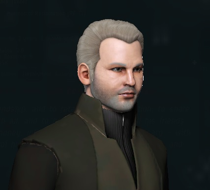

---
tags:
  - Prose
  - JoriannaGallaire
  - NewEdenCapsuleersWritingContestYC121
---

# “See and Hear” Magazine Article

> Author: Jorianna Gallaire

> Original post: [https://forums.eveonline.com/t/rumors-gossip-tabloids/130182/32](https://forums.eveonline.com/t/rumors-gossip-tabloids/130182/32)

> Entry for YC121 New Eden Capsuleer’s Writing Contest in the Academic/Scientific/News category.

Published in the Gallente tabloid “See and Hear” magazine on 12.05.121.

Rumours have reached our ears that the controversial and always charming James Syagrius, doyenne of the Aidonis Elabon Building in Caille, has decided to retire from his illustrious business career.

One of his employees whom we spoke to, tearfully leaving Reclamation’s offices in Caille with a box of belongings commented, “*Mr. Syagrius has always been a generous and fair employer and even helped my family when we were in need. He deserves this… I suppose!*”

Ownership of Reclamation’s operations in Cloud Ring appears to have been transferred to an undisclosed buyer. Rinai Vero, a Federal Militia commander in the area, was unaware or unwilling when asked for a comment. Fierce secrecy is a hallmark of Syagrius’ style, though, as a journalist from Caille Entertainment discovered during a recent research project cut short by a tragic accident.

So, what is Mr. Syagrius going to do now?

We have discovered that a substantial contract has been awarded for the renovation of an estate on Intaki Prime that Syagrius is rumoured to have acquired many years ago from the Bravaati family, owners of the eponymous olive brand, shortly after the prestigious family business was left cruelly exposed by the then CEO’s sudden and mysterious descent into Blue Pill addiction.

Syagrius is reported to have had a strained relationship with some Intaki capsuleers but this appears to be water under the bridge now. Bataav, leader of the Intaki Liberation Front, commented, “*Syagrius has been a political opponent of ours for many years, and tempers have flared on more than one occasion. More recently though, I’ve found that we leave our politics to one side when we talk, and I’ve come to believe that a mutual respect now exists between us. I’m sure he’ll find Intaki Prime to his liking, but we’ll have to see whether retirement suits him just as well.*”

Word has it, though, that Syagrius is unlikely to disappear entirely into life as an olive farmer. Staff at the Elabon Building, speaking off the record, hinted at tenancy discussions with a prominent Amarrian personality whom Syagrius is understood to have accompanied to various social functions lately. Known associates at the Elabon Lounge are remaining tight lipped about anything regarding this.

With his time freed from business responsibilities, we certainly hope to see more of this colourful character out and about enjoying himself!

Jorianna Gallaire Director See and Hear