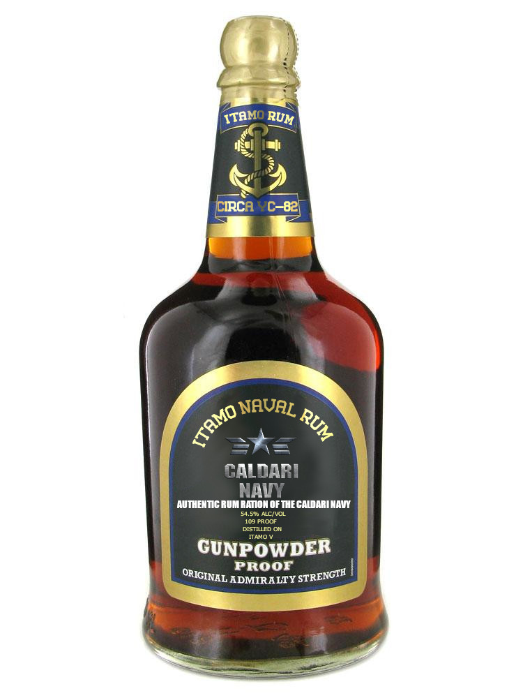

---
tags:
  - Prose
  - Mantelglobalindustries
  - NewEdenCapsuleersWritingContestYC121
---

# Itamo Naval Rum

> Author: Mantelglobalindustries

> Original post: [https://forums.eveonline.com/t/itamo-naval-rum/144886](https://forums.eveonline.com/t/itamo-naval-rum/144886)

> Author's Note: Many Thanks to Coulter Phelps for providing this wonderful image!

> Entry for YC121 New Eden Capsuleer’s Writing Contest in the Academic/Scientific/News category.

The Itamo Naval Rum Distillery Company, founded upon the planet of Itamo IV, is a company that specialises in the production, distillation and marketing of a beverage known simply as ‘Itamo Naval Rum’. Founded in YC82 as a start-up venture by a small group of entrepreneurs supported by a loan from the investment bank of Hyasyoda’s agricultural division, the Company grew from a humble distillery on the outskirts of Kallaste City to a planet-spanning enterprise that has coalesced into a major employer in Kallaste City and developed a strong brand following amongst the citizens of the Ruomo constellation. It has also founded a network of farms criss-crossing Itamo IV’s remote rural regions producing not only the necessary amounts of sugar cane and sugar beet required for the production of the rum, but also to produce foodstuffs to aid in feeding the population of Itamo IV and for selling the surplus to Hyasyoda and Perkone’s paramilitary security forces in exchange for their continued support, financially in the case of Hyasyoda and logistically with Perkone, as Perkone owns and operates a space installation in orbit over Itamo IV.

The link between rum and the Caldari can be traced back to ancient times, with the Raata Empire instituting the practice of granting the sailors on board its sizeable merchant fleet and war navy a daily ration of rum as a means of fortifying their spirits on long journeys across the treacherous, frigid waters of Cephalin (Caldari Prime). The hardiness of the sugar beet contributed to its popularity in Cephalin agriculture, as it could withstand the cold temperatures of the planet, as well as the longevity of rum in storage made it ideal for voyages across the expanse of the Great Western Sea. This custom survived well into the modern era, with Caldari members of the Federation United Defence Command bringing the practice of the rum ration with them, being appreciated by the Gallente members of the organisation who shared a similar naval heritage, especially those that could trace their roots back to the Kingdom of Garoun or Hueromont as an example.

There has been a significant demand from the populace for the rum styled as the ‘authentic rum ration of the Caldari Navy’ as in the society of the Caldari State the military forces, especially that of the Caldari Navy, are venerated highly as paragons of service and duty to the greater whole. The highly-militarised nature of the Caldari State can be seen quite evidently with the fact that an estimated five percent of the population are under arms at any one time, which can increase exponentially during wartime due to a period of compulsorily military service each State citizen must complete at the onset of adolescence. Additionally, there has been an appetite from certain areas of the Federation for the beverage, providing another consistent source of revenue for the corporation as well as forcing it to expand its production capability. This demand has forced the Itamo Naval Distillery Company to seek investor capital to set up additional distilleries on Itamo V, such as funding from the Mantel Global Industries Dependants Benevolent Fund in exchange for a stake in the business.

Whilst the modern Caldari Navy has long since abolished the rum ration as a daily fixture of naval life, an outcome of a series of debates held by figures of the Caldari Admiralty and Chief Executive Panel officials known as the 'Grand Rum Rammy of ‘58’, barrels of rum produced to Admiralty specifications can still be found on most major vessels of the Caldari fleet. In extraordinary circumstances, the master of the vessel may authorise a tot of rum to be distributed to every sailor onboard, usually as a reward for an arduous or testing task that the crew have successfully weathered. This social event amongst the crew, where officers and enlisted mingle alike, is done as a means of reinforcing the ideals of ‘the flock’ amongst the Caldari crew in that they are all part of one entity working together to achieve a common goal.

Three main varieties of rum are produced by the Company, all sold in a stout, wide bottle emblazoned with the seal of the Caldari Navy:

Itamo Naval Rum, dark. 54.5% alcohol percentage, 109 proof. Produced from sugar cane molasses, marked as ‘gunpowder proof’. This is the flagship brand of the Distillery Company, and can be found in most reputable and disreputable bars throughout The Forge constellation.

Itamo Naval Rum, spiced. 54.5% alcohol percentage, 109 proof. Produced from sugar cane molasses, marked as ‘gunpowder proof’. This is the second most-sold variety, often finding favour with export to the Federation, but can still be found for sale within State territory.

Itamo Naval Rum, Home edition. 54.5% alcohol percentage, 109 proof. This particular brand is produced from sugar beet molasses as an appreciation to the progenitor of the modern style of Caldari Naval Rum. It is not produced to the same quantity as the prior two types, but is done so as a means of the company as a marketing strategy to capitalise upon those in the State that reminisce about the Raata Empire.