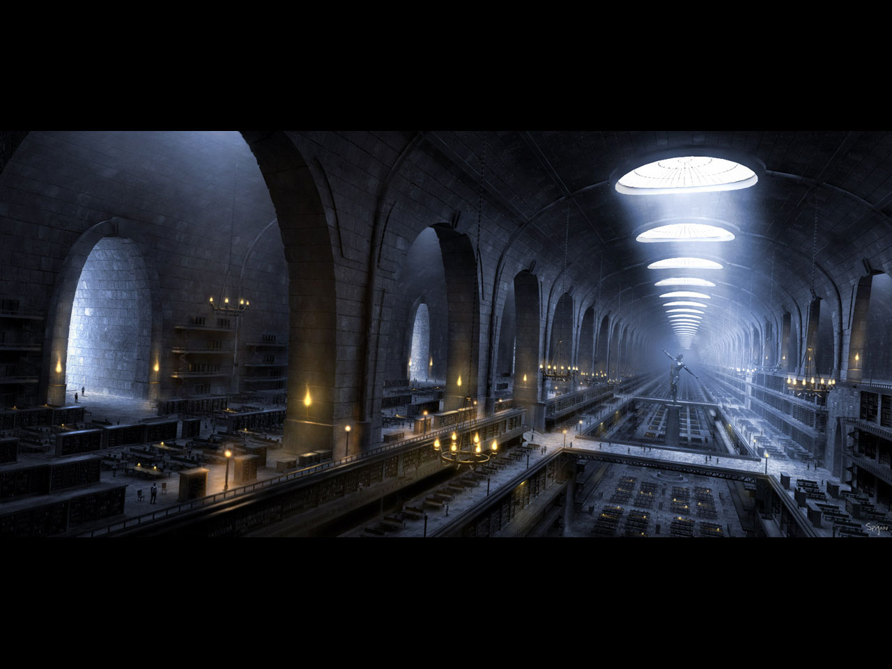

---
tags:
  - Prose
  - KalodoteLafisques
  - NewEdenCapsuleersWritingContestYC122
  - Length_Short
---

# Project Alexandria

> Author: Kalodote Lafisques

> Original post: [https://forums.eveonline.com/t/yc-122-necwc-open-for-replies-project-alexandria/155595](https://forums.eveonline.com/t/yc-122-necwc-open-for-replies-project-alexandria/155595)

> Entry for YC121 New Eden Capsuleer’s Writing Contest in the Academic/Scientific/News category.

From years many ideologies could revolutionize and improve the lifestyle and the welfare of the entire human race; but they failed to establish due to multiple factors, like fear, ignorance or misunderstanding of those same ideologies. Even today, different thoughts that discriminate other ones continue to generate separations, wars, hate and isolationism. This brings to prevent the rise of many other ideologies that could end the long cycle of the hate that the humanity brings from the dawn of his time. It’s time to contribute for the freedom of thought and expression of EVERY existent ideology to spread information, knowledge and clarifications, without any disinformation anymore!

We introduce, for the intergalactic community, the “Alexandria” project!

The earthologists said that many millennia ago, an incredibly great library in that mythological planet “Earth” existed. It was the Library of Alexandria, the biggest one of the world at that age, like the currently University of Caille, the biggest university of the entire New Eden. Independently from the fact if this was true or not, it would be a good idea making it a reality. The main goal of this project is creating a landmark for all what the humanity has to offer in terms of culture, traditions and thoughts! It will be a point where all of them can be introducted, questioned and opened to be known by the people of New Eden.

The location is still undecided. This being is still looking for collaborators and consensus to start the project. For now, this library could start to be localized online or within University of Caille areas, in Gallente space. Once there’s enough consensus and support for the project, a corporation (or an Alliance) will have the responsibility to decide the space localization of a citadel which will host the entire library (A library with the dimensions of a base). It’s suggested the creation of a corporation who will amministrate/maintain only that structure. The defense of this last (Besides the local authorities and the corporations and alliances who agreed at this project) will be indirectly entrusted to the people of New Eden, those people who want to build a better future, a future where everyone can be heard without any censorship of any authority.

The structure will have everything what a person would like to consult: Books, Databases, Reports, Datacores, Arts, Projects, Skillbooks, Historical ones of all mentioned above and it can come from any place or country: Amarr, Caldari, Gallente, Minmatar, Khanid, Ammatar, Interbus, SoE, Jove, Thukker, Sansha, SCT, CONCORD, Mordu, Intaki, ORE… It will be a point for any scientist or historians that can have everything they want for their studies. Students are welcomed too. If new content has been spotted around EVE, the library will have to obtain that too, taking a copy or agreeing to take the original one.

The library can be considered a Freeport. The corporation that will manage this wonder at his final stage will take ALWAYS a neutral position against every conflict that occurs in New Eden. In case of war declaration against this one, all the existing governents are called to protect this citadel since it’s considered a symbol of the entire human identity and his destruction would mean the loss of our origin unique human identity and the identification of the responsible as a denier of the general knowledge and consequently a very dangerous entity to take care about it.

Finally, despite this initiative can be considered a Gallentian initiative, the library must be easily accessible by everyone. His location, once decided, should be easily reachable by any of, at least, the 4 main factions. Not deeply in Gallente space, nor deeply in other government territories. This structure mustn’t be affiliated by any political entity. Consider that a gift from the Gallente… no… from the humanity, for the humanity!

The actual project is still in pending and in discussion. Contribute with your considerations!

