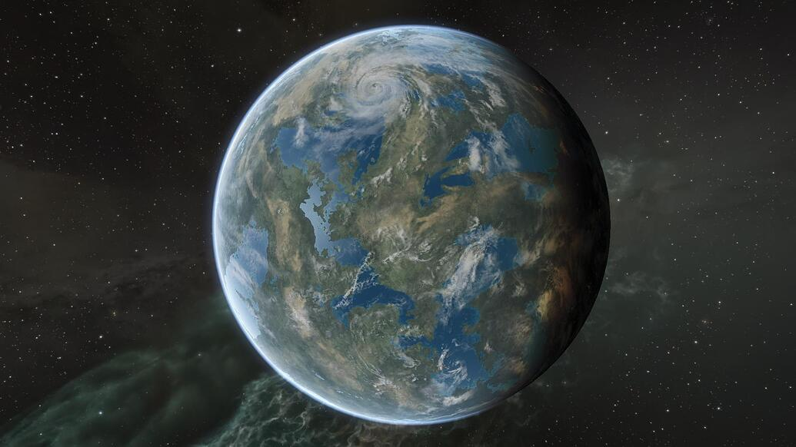

---
tags:
  - Prose
  - BakulenDivalone
  - NewEdenCapsuleersWritingContestYC121
---

# SEE THE INTAKI HOMEWORLD

> Author: Bakul en Divalone

> Original post: [https://forums.eveonline.com/t/yc-121-new-eden-capsuleers-writing-contest-see-the-intaki-homeworld-a-free-travel-brochure/152561](https://forums.eveonline.com/t/yc-121-new-eden-capsuleers-writing-contest-see-the-intaki-homeworld-a-free-travel-brochure/152561)

> Entry for YC121 New Eden Capsuleer’s Writing Contest in the Academic/Scientific/News category.

**SEE THE INTAKI HOMEWORLD** 
A Free Travel Brochure, Compliments of the Intaki Homeworld Tourism Authority 
*Promoting Tourism to Intaki Prime and the Intaki Colonies*

Book your next vacation to the Intaki system and Planet Intaki V, Homeworld of the Intaki people. Also known as Intaki Prime, the Homeworld is a planet of mesmerizing beauty that offers so much for the modern traveler.

> “Intaki Prime is a jewel among planets.” - Vremaja Idama

**Planet of a Thousand Treasures**

Experience an historic planet that has become a must-see travel destination. From the natural majesty of the Akat Mountains and famed volcano Mt. Yasur to high-tech metropolises like Drahaana City and the planetary capital Lenoika, there is something here for everyone.

The hospitality of Intaki Prime natives is legendary, and even remote villages such as Harasha, Trimeryevaaryam, and Werklav Naabhoum treat offworld visitors as honored guests. In the Intaki tongue, *Juuhnamas!* (Welcome!)

Are you of Intaki descent? A pilgrimage to Intaki Prime is the ideal way to learn more about your heritage.

**How to Get There**

Intaki is a low-security system in the Placid region, an easy three jumps from high-sec Stacmon. Travel to Intaki can be hazardous, however, as the spacelanes between Stacmon and Intaki are infested by capsuleer pirates as well as by the Serpentis.

Take safety precautions before embarking on your journey. Before entering low-sec space, it would be wise to employ a guide familiar with the area or at least travel in a fast shuttle. Always check the GalNet gatecamp alerts for pirate-camp activity before starting your trip.

**Where to Stay**

The closest public station to the Homeworld is the Intaki V - Moon 5 - Astral Mining Refinery. Despite the industrial-sounding name, this station is the perfect debarkation port for new arrivals.

Relax in the lobby of the station’s four-star Kohinoor hotel as your room is readied, or swing by the popular Rissa Bar for refreshments and live entertainment by the renowned Intaki Clackers Trio. Families with children can pass the time with the best in family fun and activities at the Funopolis Family Fun Center on the main concourse.

Prefer to avoid the crowds? A five-minute shuttle hop away is the Star-Traveler’s Lounge, a merry little dive bar with local Intaki flavor including a small but impressive collection of Intaki folk art. It also features cheap drinks, a laid-back environment, and stunning views of the Intaki Homeworld.

**Things to Do**

On beholding Intaki Prime from orbit, many first-time visitors report feelings of awe and wonder, transformed by the magic such a perspective brings. For the utmost enchantment while planetside, immerse yourself in the Intaki way of life as you visit the picturesque towns, historic landmarks, and natural wonders on the Homeworld.

Kickstart your Intaki Prime holiday by learning more about Intaki traditions and history. You may wish to attend a lecture by Professor Bataav at the Intaki Cultural Center in the Homeworld’s southern hemisphere. (Be sure to ask him about the Intaki Language Project.)

For the daring pilot, a surface tour of the Intaki Homeworld is just the beginning. Adventure and opportunity await throughout the Intaki system:

**✓ Pirate Bounties.** Earn 1,000,000 ISK and higher rewards for destroying Serpentis pirates, and collect valuable clone soldier tags.

**✓ Trade.** Profit by selling goods at the Intaki V-5 Trade Hub and help the local economy.

**✓ Faction War.** Defend the Intaki system against Caldari military invasions.

**✓ Mining.** Harvest rare ore like Pristine Jaspet and Radiant Hemorphite from Intaki’s asteroid fields.

**✓ Exploration.** Investigate low-sec Cosmic Anomalies and Signatures for valuable loot.

Plan your vacation to Intaki today and create memories for a lifetime!

**The Intaki Homeworld…** 
**Dream ◈ Explore ◈ Discover**