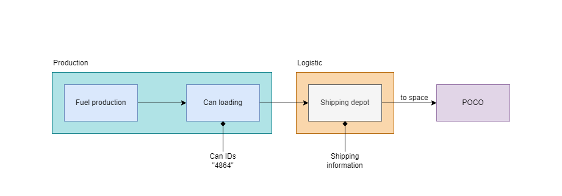

---
tags:
  - Prose
  - MiyoshiAkachi
  - NewEdenCapsuleersWritingContestYC124
---

# Establishing an industrial colony: a journal

> Author: Miyoshi Akachi

> Original post:

> Author’s Note: I wanted to dive a bit into how planetary colonies were built and operated, a theme I feel it is rarely touched. I focused a bit more on the logistic side of things: I imagined a set of diagrams and procedures behind PI and the construction of colonies. The logic behind the different crews is that, as in real life, who builds is often not the same operating what had been built: who builds a power plant is not the same operating it, who builds IT infrastructures are not the same operating them on a day to day basis. I think building a colony requires knowledge and specializations that would see a limited use in an established colony and thus, I defined a differentiation between building and operations crews. The faces are left without definition on purpose. They are engineers, biologists, technicians… whatever their profession and role, they are people: they could be white or black, woman or men, blonde or dark haired. I choose to let the reader fill in those faces. > The inspiration to dive into a bit of “world building” came from Zedicon Prime’s History of the Temperate Worlds of Helab and Eras of Soliara III.

> Entry for YC124 New Eden Capsuleer’s Writing Contest in the Academic category.

Author: Sawa Laboratories 
Version: 1.0 
Last revision: 04/05, YC124 

## Index

- Prologue
- Lava - Part 1
- Barren - Part 1
- Storm - Part 1
- Temperate - Part 1
- Interlude
- Lava - Part 2
- Barren - Part 2
- Storm - Part 2
- Temperate - Part 2
- Interlude
- Lava - Part 3
- Barren - Part 3
- Storm - Part 3
- Temperate - Part 3

## Prologue

“We need a more direct access to resources to cut costs, makes us more independent and flexible and last, but not least, it could represent a possible new source of revenues.” The blonde and red haired Achuran woman spoke as she leaned back in the form fitting chair, at the head of the table.

“Why not try to establish a few colonies?” the proposal came from the mohawked woman sitting to the right of the first, lounging back and peering through the hologram to the other people sitting around the table.

“It wouldn’t be a bad idea… if every planet wasn’t already colonized far and wide?” the point was raised by a dark haired woman sitting straight and composed. All the planets in high security space were indeed already colonized and, for a small corporation like Sawa Laboratories, they wouldn’t represent a profitable operation.

“In Empire’s space.” The reply came as a grin started spreading on those dark lips.

“Null security space is not an option.” A dark skinned woman with dreads spoke quietly but self assured from her seat facing the mohawked one.

“I wasn’t thinking of null security space…” the grin that had been blossoming on the mohawked woman’s face had spread in full swing.

~ <> ~

A solar system hovered above the table with seven planets slowly rotating around the central K5 star; the same women of not long ago sat around the table.

“We have six planets: planet II and IV are barren ones, planet I is a magmatic one due to its proximity to the star, planet III is temperate, planet V and VI are storm planets and ultimately we have a gas giant at the edge of the system.” the mohawked woman spoke as it rose from its chair, starting illustrating her proposal.

The spinning system was substituted by tables and data on every planet “Our best bet are the lava and the barren planets for the materials we need; the first draft of the colonization plan prioritizes these three planets, followed by the storm ones and the temperate one.”

The planets tables changed into a list of materials accompanied by market data “By market research my team conducted, we could devote part of our colonies and efforts to build for the market itself. This list of products could represent the revenue source we are searching for. There is competition as in all things where there is an open market but my team is confident it can work.”

“All of that is in a wormhole system, how will you stage in there?” was the curious question of the black haired woman; wormholes were particular system and brought with them quite some challenges.

“In this target system we have a citadel station managed by other capsuleers. By preliminaries contacts, we can stage from it. We cannot use it extensively, but we only need a logistic staging to dock up and store the materials in transit. It will be a just-on-time delivery: we will pick products up from the planets just in time and ship them outside the wormhole as soon as possible. Some of us had been there before, we know how to deal with such particular environment.”

A moment of silence shrouded the room as everyone thought on the project that was being presented, thought of the risks and possible gains, of the impacts and problems the operational groups they headed would face.

“The initial investment is limited but the possible returns make this project worth a try.”

“Do we have the crews to build there?” was the question asked by the black-skinned woman: a project on paper was nice, but had they what was needed to build it for real?

“We can recruit them. If the pay is good, we won’t have troubles finding the right people and we still have some contacts from our previous colonization projects, people of experience.” This time it was the Achura woman that spoken, anticipating the mohawked one.

The dark haired woman thoughtful gaze deepened “So in the end, it boils down to the relatively huge risk of loosing contact with them and/or loosing the products while on transit.”

“Pretty much so.”

The black skinned woman smiled, clearly savouring the oncoming challenge “Sounds good.”

<figure markdown>
  <figcaption>Figure 1: The standard production chain for planet-side colonies</figcaption>
</figure>

## Lava – Part 1

“What a place.”

As far as eyes could reach, the landscape was a charred and barren one, with only the glowing streaks of super heated lava lighting the place up. The sky was as dark as the ground, if not darker, with thick clouds covering the sun and the strange nebula that surrounded the system; the air was full of dust and ash, with the smell of lava, a smell that even with respirators managed to get through.

“They couldn’t choose a better place, could they?”

“It could have been worse, it could have been a plasma planet, with those plasma storms making it all charred!”

“Ah, not sure it would have been worse…”

The building crew quit their chit chatting as the industrial drone appeared above them, a cargo container tightly in its grasp, ready to land.

“There we are.”

The drone hovered and started to descend, touching down with a puff of ash. Its clamps let the container go and it moved back up, heading back toward the main landing area.

“Get to work guys, the next one will be here soon enough.”

“Yes, sir!” was the chorus reply as people.

They were going to take measurements, clear and flatten the area, readying it up for the bigger prefabricated structures that were being shipped down from orbit.

The main danger on such planet was the planet itself: given its proximity to the system’s star, the planet was considered a solar magmatic where its surface was never able to cool enough to solidify. The practical risk was that the ground on which the buildings stood turned into lava.

To counter that, the areas below and around the installations were the most watched and controlled; in case the planet decided it really had to liquify that area, the installations were usually lifted and moved to the next patch of solid ground.

The heat of a planet so close to its star and so restless was usually dealt with heath proof materials and solutions such as oversized cooling systems able to dissipate heat, even in such a heated environment.

And the smell, a key characteristic of lava planets was the smell: it went everywhere, it clung everywhere, even with air scrubbers and sealed environments. Most people got used to it, sooner or later.

## Barren – Part 1

“I can feel the dryness.” While suits kept a stable environment around their wearers, barren planets did that effect: their dry, rocky landscape with no water nor green in sight felt like a planet wide, dry desert. The thin atmosphere did not help.

“That’s the effect they do.” was the reply as the building crew followed and supervised the building drones crawling and raising dust all around.

Those barren planets were relatively easy to set up: minimal if no weather, no flora and fauna, just bring down the construction drones and let them work. The main problems were the dust, clogging filters and clinging everywhere and the thin atmosphere, making it hard to breath without respirators and bringing a lower pressure.

The construction drones were huge, automous machines able to conduct a series of construction tasks, from digging and landscaping to putting down structures, all following a pre defined plan. With the human component of the crew limited to a supervising role, being assigned to barren planets was mostly a vacation, where the biggest action most crews saw was machines breaking down and needing repair.

One of the huge drones was left a few tenth of meters from the crew and they watched as it powered up: it opened up, extending appendix and radiators, opening up vents and going through its set up phase. Through this, the central computer updated its tasks and timeline and soon enough, it started working, starting with a preliminary digging and flattening of the area.

“Machines of constructions…”

## Storm – Part 1

“I don’t know why but I feel like I got a weight on my shoulders.”

“It’s the high pressure atmosphere. But it’s the least, wait to see the electric storms” was the reply of one of the veterans.

“Mmm… Should I look forward to it?”

“Maybe! If you like big lightnings turning unshielded things to charred remains, sure!” the laugh was deep, the laugh of someone that had already see the majesty of the electric storms that rolled through storm planets.

Those storms were continent wide ones, releasing energy from the high pressure atmosphere down toward the rocky ground. The main defence was building below ground, using the rocking core of the planet as shield and leaving outside the least assets possible. Above ground remained energy and resource collectors, weather stations and the few openings that let people, machines and materials reach the surface and the orbit.

For the few structures that had to sit above ground, protections that took the energy and redirected it to the ground, shielding what was inside, were the most used; an example of such technologies were the Faraday shields. The presence of fauna and flora were usually non existents and they weren’t counted as a factor.

When building a new colony, the key element was time: the sooner they could dig under the surface, the sooner the risk to the crew, both organic and mechanical, would be lowered to acceptable levels.

The huge mole drones were burrowing themselves with plumes of dust while building drones waited with preassembled shielded locks ready to be applied once the excavations were deep enough: the goal was to seal the growing caverns from the electric surface.

Once done, the building crews would expand below ground and resurface only for the smallest timeframes to put in place extractors and other structures that needed to remain above ground.

## Temperate – Part 1

“You know, I’m tempted to ask for a transfer to planet-side operations.“ the tone was a playful one and it was clear why: the crew was walking on a sand beach, with tropical trees lining it on one side and a blue sea on the other.

“Hard to blame you, to be honest.” The reply was from one of the engineers that was letting the sight span over the watery horizon. The sun shined bright and the beach was kissed by crystal clear water.

“We got a good assignment, at least when off duty we can chill on the beach.” Such statement rose a few giggle and laughs. Of all the crews deployed by Sawa Laboratories, they did feel they had been the most lucky ones: temperate planet, no extremely dangerous fauna and flora, headquarter on a small island like continent and close to a beautiful beach.

It couldn’t be any better, couldn’t it?

Temperate planet were considered some of the easiest to colonize, with an environment favourable to the human crews; however, they still present some dangers, mainly in the form of flora and fauna. There were both tales and hard evidences of both flora and fauna giving a hard time to colonization.

But that wasn’t the case. The flora was mostly harmless and the fauna seemed to stay clear of the noisy colonization operations. The constructions drones were opening the forest up, cutting down trees and laying down the foundations for the new industrial colony while a few hovered and dived into the ocean.

## Interlude

“Planet I, II and IV are established and started operations about 6 hours ago. On planet V and VI we are finishing the set up phase and we expect to start in the next 12/24 hours. Planet III is running behind due to some resource limitations we did not expect; we still expect to become operation somewhere in the next 3/4 days.” There was a brief pause “Overall, we are on time with the schedule and the costs had not gone over the budget we had allocated.”

“That’s good.”

“We plan to have the first shipping test for the first three planets in 3 days: we will have the first products packaged and sent to orbit where they will be picked up by our transport. We will then ship them out to Jita 4-4.”

“Looks like everything is following the plan.”

“Pretty much.” Those words were matched by a smile, it was always good when projects progressed smoothly. There was still a lot to be done, but the setup phase was one with the most unaccountable risks: you could plan and observe a planet from afar so much and yet, when going down, things could turn in different and unplanned ways.

## Lava - Part 2

The blocky structures were barely visible on such a dark world, as black as the charred ground, with their lava-proof feet sinking deep into the scorched crust.

The lava was everything: it provided energy, in the form of geothermal one, and it provided with the resources to build the final products as well. The metals were divided and selected while still in a superheated fluid form and then sent directly to refining.

The cavernous building were hot and no technician could walk without thermal protections between the long steaming lines of the rolling area or, even less, in the super heated areas that saw the molten metal itself.

The whole planet was a hot furnace.

The building crew was gathering to the landing pad, the concrete brightly lit and the shuttles waiting there, ash flitting down in the lights.

“That’s it.” The head of the building crew concluded after he had briefed his counterpart on the plant and its construction.

“You did a good job.”

“Thank you, my crew is one of the best and we had built on similar planets before.”

“Your shuttle is waiting then.”

“Have a good work.” Those who remained had to have balls, so far away from known space, running a factory in such a devilish environment. He kind of understood why some of them did it, but at the same time he couldn’t get to do it himself, he preferred to build them and then go back to known space for some rest and easier construction tasks before heading back into the unknown for another dangerous assignment.

Once everyone was onboard, the shuttle powered up and took off: the plant wasn’t very visible in the ash and darkness, only the light spots broke the reddish darkness, but it was there, between burning rivers.

## Barren – Part 2

Dust swirled close to the ground while that same dust arose in plumes in the thin air from the ongoing mining operations. The ground was excavated, the rock crushed and turned into powder before going through refining to extract the target metals.

Without many worries for the environment, already mostly sterile, the industrial operation was at the center of vast open pit mining: huge excavators and trucks, all automated and with minimal human supervision, dug into the ground, into deepening spirals.

The refining happened in clattering and noisy industrial sheds and the residuals, all materials with no real value, piled up at a safe distance from the colony, the lighter parts taking flight in the feeble wind.

The human element of the operation concentrated in the true core of the colony: a group of pre fabricated modules that housed the command center, as well as living quarters and all that went around making humans comfortable in such a remote colony.

“Next one has to be an ocean planet, I want to feel soaked.”

“You know you will regret it in just a few days there?”

“I don’t care, I’m tired of this dryness.”

The last constructions drones were being lifted up while the new excavation drones were being brought down from orbit, all in expanding clouds of brownish dust. It was the moment where the building crews was leaving to give space to the running crews and their machines.

They watched from above the plant sprawling on the plain and the excavation drones starting to work, starting to eat the ground and the hills in pursue of the minerals hiding there, under the dusty surface.

## Storm – Part 2

While above ground an electric storm raged, down below the colony was in full operation. Buried deep into the rocky crust, there was a sprawling group of caves that housed everything ranging from industrial operations to relaxation areas.

The crew manning the colony rarely saw the outside from their sheltered base: the only parts that were visible on the surface where the entrances, especially the ones for the cargo vessels, and the parts tasked with collecting plasma and ionic solution.

The refining of both products happened below, in the safety of a controlled environment: the plasma was turned into Plasmoids, natural and self-sustaining structure made of plasma, while the ionic solution was turned into electrolytes.

Those were lengthy processes but as many other processes, they were ones that benefitted hugely from the automation that pervaded those industrial outposts. In such a controlled environment, computer and drones made most of the works, from extraction to loading the cans of materials into the waiting cargo ships that would bring it up to orbit.

“You’re clear to depart.” The huge maw like doors were slowly opening on the cloudy sky. They had built what they had been tasked with, they delivered a fully function colony to the crew that would run it long term: their work was done.

“The electric storms were impressive, but I won’t really miss them. Can’t wait to be able to get out without having to worry turning into an electrically fried fedo.”

“I feel that.”

## Temperate – Part 2

The main part of the colony arose in the luscious forest shrouding the small continent but a key extension stretched out into the ocean diving their land mass from another one of similar size.

The ocean was needed for its water, technically considered aqueous liquid given the presence of other elements in suspension, which was refined into pure water, H2O, to be used in the growth of bacteria as well as for export toward water-poor colonies.

Into light infused rooms of a blinding white, rows after rows of bacteria were grown, submerged into growth solutions to become test cultures. Once at the right age, those test cultures were put into stasis, in a similar way to how pilots’ clones were kept at ready, and then shipped to orbit.

Boots clanged on the metal walkaway attached to the side of one of those arms into the ocean “So you got the transfer?”

“Yup, I’ll be one of the engineers that will keep this place running.”

The two technicians paused as they opened one of the maintenance hatches, peering into a console that reported about one of the huge filters through which the ocean water was pushed to. “Looks all good, there is a higher concentration of bio materials, that’s probably what triggered the alert.”

“Indeed.”

“Won’t you feel alone, the colony is not that big. And well, you are where you are.” There was a glance stolen toward the blue horizon filled with endless ocean.

“Not really, the beaches are good and I’ll take this as a bit of a slow time. These colonies are built in such a way most of the work is taken care by drones and computer, but good technicians are still needed and the perks are pretty good after all.”

“I see. Good luck.”

“Thank you.” There was a smile with those words.

## Interlude

“Construction is concluded and each plant reports they are operational. As planned, they started with a halved production capacity and we will steadily increase it in the oncoming days to reach full capacity two weeks after the start of the operations.”

Above the table hovered a hologram summarizing the statistics for each planet they had been colonizing, as well as production statistics that showed a clear ramp up in a relatively short timespan. Those data changed as they were substituted by different tables and graphs, this time reporting on the internal needs of Sawa Laboratories for materials.

“The shipping test, as said before, had been a success. The products were up to market standards and the part intended for the open market had sold relatively quickly. Internally, we expect we will be able to completely satisfy the need for test cultures, biocells and metals. This will lower our running expenses and our reliance on the open market.”

## Lava - Part 3

The two technicians walked in front of row after row of pallets sitting under the stark lights: each one heavy with reactive metal blocks waiting for further refining. Those pallets were waiting to be turned into girders and other metal structures to be used in constructions ranging from space stations and colonies to ships and drones.

“We are building a stash of reactive metals.” said one of the two, consulting a tablet with tables and numbers of production and consumption rates.

“Yeah, we are producing more than we are using, but it’s not a bad thing. We can always export if we make too much surplus.”

They stopped as a cargo drone moved close to them, lumbering on its repulsor fields till it floated above one of the pallets: clamps slid down and they grasped the pallet tightly, before they lifted it up and away.

“Pallet 20345. For girder production, type 134. Used into stations.” Recited the tablet holding technician as it inspected the data the computer had on that specific pallet. The production was tracked from extraction to shipping: each pallet was numbered and the metal blocks on it counted; once they became construction blocks, each block would be numbered as well. Each production had a specific profile and throughout the chain, it was always possible to track what had gone where.

<figure markdown>
  <figcaption>Figure 2: Detail of the building blocks production chain</figcaption>
</figure>

## Barren – Part 3

The biocells were ordered in racks, five rows of five cells each on top of the other. Multiples racks went on filling the shipping containers that would bring them up to orbit and then to their market of choice. As the biocells were self contained and needed only limited form of isolation from one another, the racks could be stacked close to each other for the maximum space efficiency.

A technician came closer to a rack and with one of his tools, he inspected one of the biocells, checking its id, production chain and status:

ID: L14598R3456
Production Line: 1
Production chain: [click for details]
Rack ID: 3456
Time in depot: 1h 34m 12s
Status: OK [click for more info]

They conducted random checks in addition to the quality checks that the production chain did already at various steps before sitting those batteries on one of those racks, waiting for shipping.

“And this one is good as well. What about yours?” he called out to another technician standing a few rows deeper into the depot.

“This one is good as well.” She replied as she made her way back.

“We got a relatively quiet assignment this time.” Those words were met by a nod as they walked past row after row of biocells. They headed to where the loading bays opened, where the dust slipped inside together with the loading drones.

“It’s kind of alienating landscape, I’d say.” She commented as they stopped by and looked outside one of the huge doors, now opening for the loading of an incoming cargo shuttle. It was brownish greyish and dust, till eyes could see. Only the mining operations broke the otherwise barren landscape.

He nodded but he didn’t otherwise speak. One of the loader drones moved close to them, reaching for one of the containers, lifting it up in its grasp as it readied for the loading operations. The automated cargo shuttle arose clouds of dust as it hovered closer and its cargo bay doors filled the open door.

The cargo shuttle sat down and powered off before it opened its cargo bay; dust hadn’t settled yet that the drones were already moving to load container after container of fresh new biocells, heading for the furthest corners of New Eden.

The activity and movements kind of broke the moment and the two technicians took their leave, letting the drones work as they left the loading area, heading for their next task.

<figure markdown>
  <figcaption>Figure 3: Detail of the biocells production chain</figcaption>
</figure>

## Storm – Part 3

“Sometimes it feels like we are sitting on top of a huge bomb ready to explode at the smallest vibration.” It was a comment spoke with playfulness but it had a gem of truth; visible from the observation tunnel, rows after rows of huge, reinforced cans sat in silence.

Container sized, they were engineered to resist most forms of impact, high temperatures, and electrical activity during storage and transportation. Loaded in a sealed environment which was kept under pressure and filled with a special mix of gasses to stop and limit an eventual leak, each can contained several hundred thousand liters of severely volatile fuel.

An overhead crane slowly brought another can of freshly loaded fuel on top of the pile. Grounded vehicles such as overhead cranes were preferred to repulsor powered ones as those energy fields had a risk to interact with the content of the cans. When a depot housed hundreds, if not thousands, of cans full of volatile fuel, everything was done to avoid a chain reaction of any kind.

All the production chain was run in a sealed environment and technicians could cirectly access the production areas only when they weren’t running: inspections were run remotely through the use of drones. The only exception was the shipping depot where technicians could enter for routine checks.

The technicians took off and the observation tunnel turned white as they left the shipping depot “This really isn’t a place for claustrophobic people.” Spoken as a comment, it really was a matter of fact: the technicians were walking through one of the many tunnels that connected the various areas built in the crust of the storm planet.

“Yeah. To be honest, sometimes I miss the open skies.” The most skies a colony like that one saw where the virtual ones built on top of the larger caverns with the exact purpose of helping the people feels less the fact they were into a cavern, tens if not hundreds of meters below the surface.

“In fact, I think I’m going to ask for a bit of vacation on Planet III, they said they have quite a nice place to chill. You know: beach, palms and sun, that kind of stuff.”

“Ah, that sounds like a great idea!”

<figure markdown>
  <figcaption>Figure 4: Detail of the rocket fuel production chain</figcaption>
</figure>

## Temperate – Part 3

The biologists were dressed in white environmental suits as they inspected the rounded, transparent boxes filled with test cultures. Such cultures grew by themselves, computers took care of monitoring and keeping the delicate balance of the growth solutions but the technicians still kept an eye on them.

“This one needs a check.” The technician said shining light on the growth culture and removed it from its rack, putting it on a little cart, together with others. Some of those test cultures removed from the main line were scrapped, others would be set in specific container for specific uses, some would even be used for on site testing.

Once the check was over, the technician signalled the computer and the rack of test cultures moved outside the staging chamber to proceed to the statis stage where they would be prepped for transport.

The stasis stage slowed the biological functions of the test cultures enough that they could survive a long journey across New Eden. Achieved by a mix of chemicals and environmental control, it happened in a perfectly sterile environment, where the human element was allowed only in full coverings and in special cases. Other parts of the chain had less strict rules: in the growth area the biologist walked around wearing white coats, gloves, masks and boots protections, while in the shipping depot there really weren’t such rule since the test cultures were already sealed away safely.

Coming out of stasis, that last rack was moved by a loading drone to the environmentally controlled container. Once it retreated, the container hissed closed as the on board computer sealed it and stabilized the internal atmosphere, readying it up for transport.

Each container was numbered with a letter tuple, determining its destination, and a number, univocally defining the single container. The one that had just sealed was marked as Container CI2367, bound for one of Sawa Laboratories’ plants in Caldari space.

The container slipped out of the loading berth and an overhead crane reached out to pick it up, stacking it on top of others. Each pile line had a specific destination, either internal or the open market, and each internal marked line had different geographical destinations. They would wait in the environmentally controlled depot till enough where ready to be moved up in orbit.

All the energy spent to keep the areas at stable conditions was done to try limit the stress put on the content of the containers themselves: the internal energy supply risked being depleted if they faced too harsh conditions.

“In case outside it gets too hot…” the off hand comment of one of the technicians had a teasing undertone but it wasn’t false either: when outside the sun shined and the temperature rose, inside the colony the temperature was stable and constant and kind on the chiller side of things in certain areas, such as the shipping depot.

“Ah true!” was the smiled reply. Being around the equator they did not expect temperatures to go close to 273 degrees Kelvin at any point during the solar year, but on the opposite, statistics based on satellite observations expected temperatures as high as 313 degrees Kelvin.

<figure markdown>
  <figcaption>Figure 5: Detail of the test cultures production chain</figcaption>
</figure>

## Epilogue

Jita 4-4, the busiest spaceport of the whole cluster, you couldn’t find a busiest port anywhere else. A hive of endless activity as people and pilots came from the furthest corners of New Eden to trade and mingle in the cosmopolitan throng living on the station.

In the multitude of ships coming and going, a lone transport headed for one of the many docking ports. It glided silently through the external shields and deeper into the station, till it reached its assigned docking bay. Clamps extended and clung to the transport as it docked, tightly locking it in its berth.

Once connections were established, the transport’s airlocks hissed open “Man… I kind of miss Colony III, now.” The words had a tone of amusement as the crew got out of the hulking ship and into the docks proper.

The berth was mostly quiet, with loading drones and dock crews waiting and not much else but outside, they could see ships and shuttles coming and going, building sized billboards and deck after deck of teeming activity. Albeit from afar, Jita 4-4 felt busy.

They had touched the metal deck by only minutes that the transport’s cargo bays hissed open, revealing their content: rows after rows of containers, differently marked depending on their content. Heavy duty drones and port crews moved forward, ready to start unloading the transport.

In a matter of minutes, the docking berth become a flurry of activity as the unloading blossomed in full swing, with drones moving up and down the ramps, pile of cargos appearing on the decks and moving around as shipping manifests were inspected and choices were made.

Above the bustling dock and cargo area, a few figures observed the busyness below from the observation walkaways “The first full load is here, at last. We already set up sell orders on the open market, we are hopeful we will cash soon.”

“Very well.”

~ <> ~

Many building crews worked on contracts: they went out to far away planets to build new colonies and then when the contract expired and the work was done, they were free to leave. Each round, some would remain on whatever planet they were building on, transitioning from building crews to operations crews, taking roots in often difficult environments. Many, on the opposite, returned to central hubs like Jita, ready to take on a new contract or return to their home planets.

A few of the original building crews hired by Sawa Laboratories had transitioned, the perks made the transition worth, if one enjoyed whatever planet they were going to be stationed with, that is. Most of them, had been returning to known space in multiple waves, the last one finally breathing the cosmopolitan air of Jita 4-4.

“Now, what’s next?” one of the crews asked, as they sat at a bar. Working in such remote places turned building crews into tight knit groups, with a connection that run deep under the surface.

“Vacation time, somewhere well connected.” It was spoken with an amused tone, it couldn’t be said their last contract had been well connected to the rest of New Eden.

“Just a short break from me while I look for a new contract.”

Some came and some went, some remained together over multiple contracts, some split up after an assignment, never to meet again. That was the life of building crews, seeing remote places while building new colonies. However, they all shared such connection, telling them they belonged, belonged to the daring crews that built humanity’s outpost in the furthest corners of New Eden.

The operations crews were different, most of them were in for the long run, colonizing and living there with limited interests in going back to their planets of origin. They were an heterogenous group: people who escaped their pasts, their present or their families, people that were in for the perks and the money, people that were in for the solitude, people that were in for the adventure that living in a far away planet was.

As building crews looked to the next contract and vacation, to the next faraway place, the operations crews looked to make their far away outposts livable and comfortable while they cared for the industrial operations they had been handed over.

Different lives but both tied to each other by the push of humanity to colonize further and further.