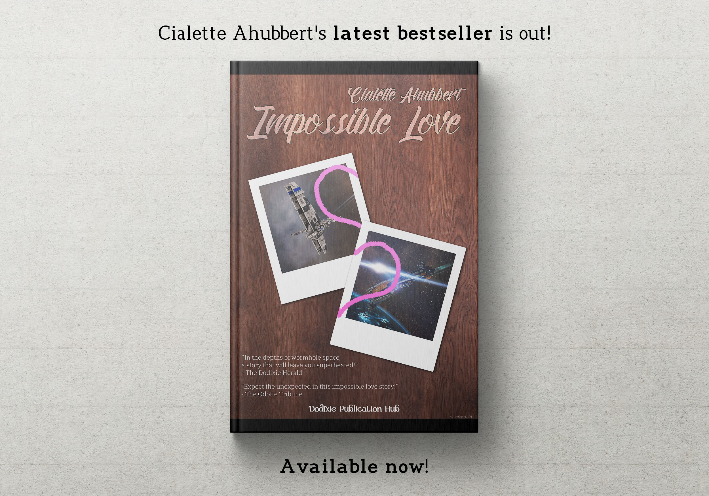
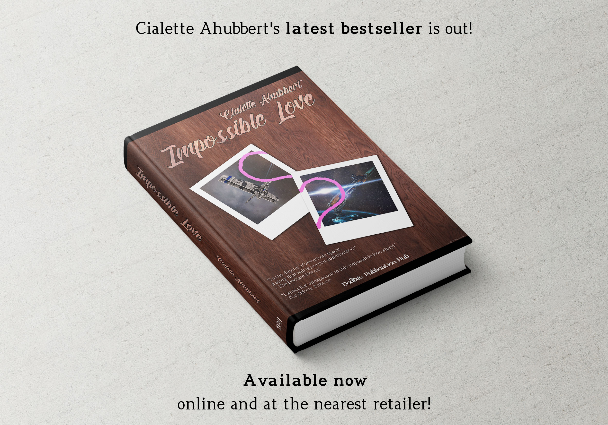

---
tags:
  - Prose
  - MiyoshiAkachi
  - NewEdenCapsuleersWritingContestYC124
---

# Impossible Love, the new bestseller by Cialette Ahubbert is out! 

> Author: Miyoshi Akachi

> Original post:

> Author’s Note: I wanted to try a pair of things: first, doing something “out of the comfort zone”; second, something different from “usual kind” of news that are created. I believe that even in a setting as advanced as New Eden there would still be books and written works and if there are those, then there is a certain kind, satisfying a market niche. For the purpose of the advertisement, I created a “New Eden Goodreads” which practically is our Goodreads. Albeit I’m sure you want to read it, no I don’t plan to write the whole book, yes it is between two ships and yes it is in Thera.

> Entry for YC124 New Eden Capsuleer’s Writing Contest in the News category.

>She gasped as she felt him get closer. The shrouds of the testing facility hid them, nobody would spot them there, it would be just her… and him. He was so close… … his bulk, with those heavy plates adding to his musculature, the smell of nanites ready to activate… those thick guns… She thrembled, her chassis shivering as her shield glowed with a blush. So strong… so close…

**The new bestseller by Cialette Ahubbert is out!**

Titled “***Impossible Love***”, it follows the impossible, and yet possible, struggle between two beings falling in love in the depths of New Eden! Carrying the reader to places never touched before, this masterpiece is once again a bestseller and one you don’t want to miss!

.

> In the depths of wormhole space, a story that will leave you superheated!
> - The Dodixie Herald

.

> Expect the unexpected in this impossible love story!
> - The Odotte Tribune

.

> You will love the steaming action and thrilling story leading from high security space to wormhole space and back!
> - Online reviewer on New Eden Goodreads

.

> I want him!!!
> - Online reviewer on New Eden Goodreads

