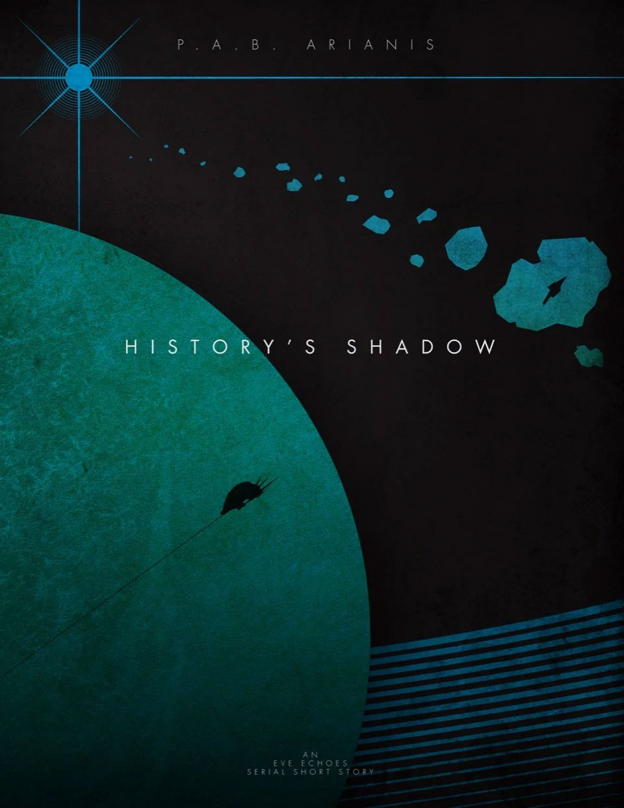

---
tags:
  - Prose
  - XephariousWryn
  - EvEEchoes
---

# History's Shadow

**BOOK 1 - Ancient terrors await those who venture too deeply into the cosmic abyss. What madness could be worth disturbing their slumber?**

 

> Author: P.A.B.Arianis

> Original post: [https://eve-arianis.webnode.page/l/historys-shadow/](https://eve-arianis.webnode.page/l/historys-shadow/)

> This is an EVE Echoes story written in serial short format. It is recommended that you pause between chapters... or don't, this is New Eden. Capsuleers make the rules anyway.

> This original work is based in the fictional world of New Eden as created by CCP and NetEase. All rights to concepts and property related to EVE Echoes or gameplay remain with their original owners.

 

## 1.

"Skinner, my systems are desyncing. I have to warp!"

"Then go, what ya telling me for?"

"But-"

"Just go! Before you take a missile up your ass."

It was too late, the hostile Gila had already locked the newest member of their little pirate clearing team and a salvo of missiles raced out to claim the now drifting Succubus class frigate. Skinner shrugged and shook his head. "Least he wasn't scrammed."

Life as a capsuleer was different. The rookie wouldn't end up losing much in the end. DevNetEasian Insurance would likely cover the loss of his ship, given the lack of warp scrams on field, and even his life wouldn't be lost... only the body. Kretskie would simply pop his consciousness right back into a fresh new clone and be back out with them within a half hour in his backup 'Bus.

All told, a life of clearing out pirate nests really only got exciting when other capsuleers showed up; either friend or foe.

Skinner watched the leading missiles close the distance apathetically as his own cannons blasted Kretskie's soon-to-be-killer to hull fragments and aligned his guns to the next Gurista pirate. These pilot de-syncs were really something CONCORD scientists needed to get to the bottom of... He chuckled. In the corner of his sensor net, his implants registered Kretski's last second jump into warp leaving the orphaned missiles to explode harmlessly in space. 'Son of a bitch, he got out'. Guess there'd be no need for Insurance claims after all.

It took a full five or six minutes more before Skinner noticed what had only started to tickle his mind; no normal desync could have lasted this long. Even if Kretsky had lost connection with his ship he should have kept connection to fleet coms through his implants.... so where the hell was he?

Skinner grunted knowing he couldn't just abandon his mission or the rest of the team to go off searching all of deadspace for one lone desynced Succubus... even if he had the scanning equipment to do so, which he didn't. No, the damned rookie was on his own... wherever he was.

Less than 1 AU away, Avar Kretski's mind re-synced with his ship as he felt the rush of sensations flood back into him. He could feel the particles of space dust and cosmic radiation bathing his ship's hull just as surely as he felt the various ship's systems like veins and organs of his body. There was a stillness when one was all alone in space, even for a capsuleer; so interconnected to his ship that it was in every sense a part of him. Deadspace, Avar felt, always seemed even more desolate. There were no space lanes, no celestial objects of any kind to make his place. Only the distant glow of one star more than any other gave signpost to what system he was in. Atioth burned a feint white to his starboard as Avar gathered his wits and called out through his implants to the fleet coms channel he'd been sharing with his team.

"Skinner, ya there?"

Nothing.

"Kella?"

No Answer.

He tried a different channel. No connection. Something was very wrong. Fleet coms operated via subspace and green as he was, even Avar knew that coms systems failures were all but unheard of in the modern era. Maybe he was pinging the wrong relays? It only took a few moments to check but what he found confused him even more. He was in the correct relay, he could even find the markers of each of his fleet members in the channel. But they couldn't hear him. His pulse was just starting to increase when he suddenly realized that he must have muted himself. Of course. ....nope.

Alone and mute in space wasn't the sort of position one typically wanted to be in. At least he could fix one of those. Avar was surprised that his ship autopilot hadn't yet kicked in and taken him back to the pirate base. So, he tried manually jumping to warp.

When that failed Avar Kretski damn near shat himself.

## 2.

Alone. No coms. No warp.

Well... Avar was fucked.

He took a few deep breaths. Or, at least he imagined himself taking deep breaths as a forced wave of calm seems to shimmer though the Succubus's systems. What had the FC said during that Frigate Wing course? Something about 'solace is in the silence...' Right.

Avar willed himself to be silent... and calm.

He could not warp, no coms... but also no hostiles on grid, so... at least there was that. He tried his impulse engines; working. He flashed his afterburner for a cycle... that worked too. The noise of panic faded further and he continued. All internal systems were functioning and his synaptic sync, pod integrity, and repair systems all performing efficiently. Good.

External. Camera drones had deployed perfectly and Avar's mind reached out to them and through them as he looked back at his ship. The spikey hooligan-hellspawn-fish of the Sansha hull floated calmy against the black-red of the local nebulae. His hull glistened with each refresh of nanites repairing any damage that might deign to nip at his armor.

He willed the camera drones to pull further out, his ship dwindling quickly to a mere mote. Small orphaned asteroids began to glide into the frame and he found himself maybe a little less alone. Orphaned asteroids, those separated from a belt by chance or by someone's will, were a rather common thing in space. But landing out of warp right next to some without a beacon to guide you was pretty slim chance. Space was huge, massive even. Avar began to ponder on the new input even as he continued to sweep the remote cameras about his ship, taking everything in.

He would have naturally dropped out of warp at the end of the de-sync; a standard safety measure put in place to prevent un-synced pilots from being at the mercy of whatever they were presumably fighting at the time. It wasn't absolute, but that was what the added protection of insurance was for. CONCORD couldn't provide 100% guarantee behind their capsuleer software, so it made sense to cover their asses properly through the DevNetEasian subsidiary who handled such minutiae like 'complaints'. Heh... at least he didn't have that job.

However, he should have gone back into warp again as soon as the resync was complete. Why didn't he? Well, what could normally prevent warp? Interdiction modules? No hostile ships about, no interdiction beams from anywhere nearby. Maybe an interdiction sphere? He pushed the camera drones to the furthest operational distance from his hull they could go but there was no telltale shimmer that they had crossed beyond an interdiction sphere. Yet his instruments acted as though he was in one. Strange. And no interdiction tech he'd ever heard of could have also impacted his coms. So likely not that then. Avar finally accepted the truth. Whatever it was that held him here was beyond his immediate reach. Time to learn more about wherever 'here' was then.

Something about the idea of an interdiction sphere and his instruments pulled at his mind and he tasked one of the camera drones into orbit of one of the asteroids, and then another. As he scanned, another part of his mind was processing what input his sensors could get of the effects they were registering. As to why they showed him under the effects of the interdiction field, that was simple. He was. But there was no indication of it's source and the variance frequencies were incredibly obscure. Modern sensors reliably betrayed the source of any negative jamming on one's ship, so why not now? Was it new tech?

Avar thought on that a bit. Unlikely... but what an advancement that would be. Imagine being able to cloak even your offensive electronic warfare emissions! You could send a fleet of identical ships with only one scram in effect and the enemy would never know where your weakness was. Or what if he was on the receiving end... Nope. That was scary as fuck. Nobody's opsec was that good. Not something any faction would want to put money into even in this ancient backwater of a system.

Ancient system... Atioth. It was the only system out in these pirate infested regions that carried a name. Why? Avar'd only been a capsuleer for a few short weeks. Becoming a capsuleer certainly never included history seminars. It never even occurred to him to care about such things. His job was to shoot shit and get paid. Maybe spend some of that pay in good ole' debauchery when he could. Discuss the finer points on Empire infighting, drama, and their combined eons of sins? Hell no. That's the bullshit he came out to nullsec to get away from. But ancient systems...

Just as the thought registered in his mind, so did an anomalous reading by one of the few camera drones he now had flitting about the asteroids nearby. One drone, it would seem, had located a significantly large fissure within one of the larger asteroids. Large enough for a frigate to fly into.

"Great idea, Avar... just fly millions of isk worth of Succubus into a rock."

But then, what other option did he have left. No readings were coming out of the fissure and the incredibly basic programming that made camera drones so small, plentiful, and cheap also meant that he couldn't maneuver them into anything other than an orbit. The more he thought about the kind of power source that could feed interdiction and jamming equipment so massive that he couldn't even see it's field, the more he was convinced that it would have to be within something like one of those bigger asteroids.

If he wanted to know what was inside this one, he was going to have to go himself.

Fuck it.

He maneuvered his ship to the opening and began, very, very slowly, drifting into the fissure. As his camera drones automatically pulled in and his external view shifted to only that which was immediately around his hull, Avar's appreciation of the macabre got the better of him.

If he lost his ship and got podded in this asteroidal-asshole, nobody was ever going to hear the story. He would take it to every grave he'd never have.

## 3.

Several minutes slipped by and Avar found himself and his ship still in one piece. The fissure gave way to a rough oblong tunnel with more than enough room for comfort. He laughed nervously at himself for too much caution and gently increased his speed as he maneuvered through the dark. A 3D rendering of the void about him filled his mind and revealed to him what the optical receptors of his camera drones couldn't. The rough hewn walls of the channel slowly gave way to smooth rock and finally to fabricated bulkheads. Signs of purpose and will played out in the way those bulkheads narrowed, guiding his tiny ship past one of several large pillars. For a moment, he wondered as to whether the pillars were structural then dismissed it. His curiosity was suddenly sated as energy sprang forth from one of the pillars and his ship was forcefully subjected to a barrage of electronic scans.

Shit.

Avar's mind leapt to compensate. What if there were automated defensive systems, or even a mind still at work here? He prepared to activate his emergency shield extenders and whip about to get out as fast as possible, but the shot never came and no targeting system reached out to ensnare him. Nothing...

Several more moments passed and the pillars drifted off behind him.

Before him, the tunnel gave way to a massive hanger, something the size and shape that might belong on a small capital sized ship. Row upon row of empty berth covered the cylindrical chamber giving Avar every impression that he'd just drifted into some sort of massive hive. It was not a pleasant feeling.

There was no other egress from the chasm than that which he'd come through though. An eerie sensation tingled through Avar as he realized that his only option to go further; his only option to find the source of the systems trapping him here would be to dock with one of the berths and attempt to have his pod extracted from his ship. The sensation intensified further as he realized that he fully intended to do exactly that.

Pod extraction, to a capsuleer, was akin to changing clothes. A quick insertion of a grappling beam gently pulls the capsule out from inside one ship and slips you into the next. Or, if you fancy some time on your feet, deposits your egg into a decanting system. A few moments later your clone is free of the shell, rinsed, and upright. But that was all with known, CONCORD inspected, modern systems. The berths Avar was staring at looked dismayingly old and entirely alien to any configuration he'd ever seen. He could only pray to the ancestors that they even worked. Avar picked one of the berths at random and maneuvered toward it.

The first sign of hope came in the form of station keeping fields that grasped his Succubus and pulled it into the final few meters. Once stationary, Avar simply waited. It was possible that these unknown systems wouldn't even interface with his. Or perhaps the earlier scan had somehow marked him as hostile and he'd been stupid enough to deliver himself right into his own jail. The laws of time smirked and twisted upon him as the moments stretched into the infinite, his pod access port open; his pod exposed.

He was moving. Slow at first, and then faster. He felt himself disconnect from the might of his ship as his pod was extracted. Deprived of all sensors and the pods own camera drones deactivated for the transfer, Avar was hurled blindly into a system he could not know. He'd given his fate unto the beast and once more he marveled at his stupidity. Only the knowledge that should he die, he'd be reawakened in a new clone gave him any comfort.

Something grappled to the outer skin of the capsule and Avar could only conclude that he'd reached the decanter. With all of his senses still tied into the pod's systems via the many umbilical cords that run up and down his spine, the experience of decanting was quite literally an out-of-body experience. Avar watched as the fluid within the capsule began to drain, lowering his body with it as it spilled out through alien hoses coupled below. It was like being the whole of the wall as it viewed the contents of a room. Meanwhile, the wall itself began to peel out and up as it exposed the transparent inner shell beneath.

Some capsuleers spent their entire existence in the egg. Most learned to capture the blessings of their godhood and live the pleasures, both esoteric and carnal, that it offered. One as new to such a life as Avar, he'd spent most of his time in the capsule fighting and scraping to make his place among the others. Only on rare occasion was he free to pursue something so frivolous as walking about. But, what he remembered of the decanting experience had been... unpleasant. And that god-awful smell!

What his body was being subjected to now was worse, much worse. These facilities were truly ancient. The fluid rushed out of his pod as though it were being sucked out and his body crumpled, undignified, to the bottom of the capsule as though discarded; unable yet to control itself. He waited for the next step but it was paradoxically slow to come. So there he lay, crumpled in a ball and dripping of his own filth. There'd be no molecular decontam at the end of this process. Fuck the chance of smelling good, he'd settle for surviving.

Blistering cold. In his mind, he knew it was his own skin that was truly experiencing the massive temperature change as the inner shell of his pod split. By cruel technology and science, he instead got to experience that cold as though stabbed through every sense he had. He didn't feel cold, he was the very essence of cold itself. And then the dizziness came. Waves of dysmorphia rolled through him as his brain tried to grapple with a whole new awareness of organs, tissues, muscles, and nerves that up until moments ago were simply superfluous to the power and majesty of the Succubus's systems.

The inner shell continued to fly slowly upward and away as it joined with the outer hull of the capsule, splayed above like the carapace of a giant beetle. Avar was lost to it all, senseless right up to the final violation. Every umbilical cord jettisoned itself from his spine in a ripple of concussive force that flung his body forward and sheared his mind into a blinding flash of bright white pain.

He laid there motionless, fetal upon the cold stone floor, for many minutes. His lungs struggled to remember how to manage the savage air through heaping, ragged breaths. He could not bear to open is eyes or even care. He wished for death but it didn't come. Nothing came.

An eternity later, as his head began to settle, Avar finally attempted to open his eyes. A light that was not quite green and not quite indigo, yet somehow both, glowed against the film over his eyes. He tried to make out the contours of the walls; how they seemed to slope and curve. There was something embossed upon them, a symbol of some kind. He didn't dare move enough to wipe his eyes clear and so settled for several painful blinks. They did him little good, but perhaps just enough. He strained again to see and finally placed what it is he was looking at: the harsh, squared symbol of the Jove Empire. Avar heaved and wretched.

## 4.

It was some time before Avar felt stable enough to stand. During that time, he had more than a few thoughts about exactly how much he wanted not to be wandering around, trapped in some Jovian facility. But, wandering around is exactly what he was now doing. There appeared to be no logical layout to the various corridors and passages he traversed. It was clear that this facility had once functioned as some sort of fighter garrison, housing about fifty frigate class ships at capacity. As he wandered un-guided, he came upon sleeping chambers bereft of any comforts, encountered dining compartments unfit for the barest of social interaction, and even several corridors which ended abruptly in bulkheads. The last of these was at least revealing.

Absent any charts or maps, Avar's best guess was that the abruptly ending corridors were located towards the exterior portions of the tunnel systems and networks. His implants kept a running sort of cartographic projection in his mind as he went. He'd tried to access the Jovian mainframe through his implants when he first left the decanting room but, unsurprisingly, found those systems incompatible with his current cranial software. All of this further supported his theory; none of these apparently exterior corridors had any compression chamber or hatch. His conclusion, of course, was then that this garrison hangar must have been part of a larger complex of facilities. What had caused it to be flung into this particular pocket of deadspace though... he still had no idea.

The other conclusion Avar began to form was that these Jovians must have been far more cybernetically enhanced than he. There were no data ports or user interfaces. Everything seemed to operate either via automatic function or what must have been some sort of neural interface. On several occasions, he could even feel his own implant suite being pinged for information or simply acknowledged as he passed. While it seemed he couldn't access any of the Jovian systems... those systems sure seemed to have access to him. It was a very chilling thought. That realization tracked though. Jovians had always been known for their incredible technological superiority as well as for how much they'd chosen to indulge in it, even to the point of more and more becoming one with it. Nobody was quite sure anymore whether the Jovians, now unseen and withdrawn to the fringes of nullsec for many centuries, were entirely human anymore; of course they would use direct neural interfacing to a higher degree.

Avar lost track of time as he searched. When, eventually, he came upon a room unlike the rest, he'd almost forgotten what it was he'd been searching for. So caught up in theories of the Jove and the stories one tells their children to scare them, he very nearly didn't recognize the tertiary command center for what it was. Unlike every other interface he'd seen, this one appeared to have a more... rudimentary access console. That it had clearly been a back-up to a back-up was evident by the way in which it had been placed at the most remote portion of the room and at shin height. Leave it to the Jove to have considered anything less than neural interface 'beneath them'... literally. Avar rolled his eyes and laid belly down on the metal decking.

At last, access. It wasn't much; life support was running at optimal (obvious or he'd be dead now), no indication of damage to hull or internal systems. Good. But that was it. This terminal miraculously had access to the mainframe, but there was nothing there to have access to. It'd been wiped clean; sterilized but for the basic autonomous functions of the station. The only log of activity was the following:

**System Boot**

&lt;&lt;Perimeter triggered>>

&lt;&lt;Unknown frigate of Sansha Origin>>

&lt;&lt;Classify: Hostile>>

&lt;&lt;Humanoid Capsuler

&lt;Make: Matari>

&lt;Sub: Sebiestor>

&lt;Implanted>

&lt;&lt;Classify: Non-threat>>

&lt;&lt;Reclassify: non-threat, non hostile>>

&lt;&lt;DeepScan complete: no antigens found>>

&lt;&lt;implant suite: supported>>

&lt;&lt;killswitch: intact>>

&lt;&lt;delta: within acceptable limits>>

&lt;&lt;memories: secured>>

&lt;&lt;Access: provisionally granted>>

Much of the code was archaic and confusing, secured memories and killswitch? Clearly his translators weren't up to the task. There was a reference to a small locked packet of compressed data attached to this new entry, but he hadn't the access level to open it and neither did it seem to have anything to do with security functions. He moved on. He saw another attachment to the file; this one he could open. It was a holofile and it opened in the form of a projection onto the center of the compartment behind him. He whipped his head around only to bring it crashing into the corner of an instrument console and swore. Through pain, profanity, and the trickle of blood, Avar began to watch a holofile of his decantation.

Avar couldn't locate the input to skip forward in the holofile fast enough.

Next he was treated to a surreal montage of himself wandering the corridors, skipping here and there over the boring bits... which was almost all of it. Eventually the holo became a replay of the current moments as they happened and Avar deactivated it. The chamber returned to its green-indigo hue. He searched again in the mainframe but found nothing else.

But why then... how then was he trapped?

Autonomous functions? He navigated back to those processes and finally found his answer. Somehow, beyond comprehension, the station maintained a standing warp disruption field and subspace communications jam. It was built into the core of the station substrate itself with no way to turn it on or off. No way to even reach the mechanical components so as to damage them.

And it spanned an entire quarter of an AU of space.

The. Fuck?

That kind of power could support an entire fleet... indefinitely. While his mind grappled with the enormity of his current jail and the power source that fed it, one glimmer of hope shone through all of the fear; .25 AU was a truly insane distance when speaking in terms of electronic warfare range. But it wasn't infinite, and with his Succubus; manageable. He could be home within a day.

Finally, some good news.

## 5.

The headwound left him a little dizzy, but not so much that he couldn't still move or think clearly. He was certainly clear-headed enough to avoid the corner of that console this time as he stood up. Avar pulled up the wireframe map he'd made thus far in his mind and pondered what it showed him. The safe path would be to retrace his steps completely around the outer hull of what was clear to him now, was a hollowed out ovoid asteroid. He must have been feeling better about his predicament for he spared himself a moment to muse about how, as always, he'd taken the long way to get somewhere.

Not this time.

The narrow bit of unmapped area that lay like a haze between his current position and his ship wasn't even a fifth of the distance he'd have to travel back the way he'd come. There was no way it was likely to be any more eventful than the march of boredom he'd taken to find this tertiary command center. Nope; he was going home as soon as possible. Avar took a deep breath and started off into the unmapped portion of the station.

This first fifteen minutes of his journey proved to be as mind-numbingly unspectacular as predicted. Only this time, he got to do it all with his new favorite companion; a headache. Bereft of any training on clone maintenance, it never occurred to Avar to use any sort of bandaging or seek out medical supplies. Even if he'd been able to find them, for someone so accomplished at throwing body after body into the eternal grinder that was capsuleer life, first aid wasn't even a concept. And so, as he walked, the blood from his cut continued to drip down and fall from his brow. Unconsciously he'd wipe it away, only to have it return moments later. He marked time by the sound of his bare footfalls and by the return of the blood.

By the fourth wipe and reliable return of blood, he was nearing his destination when he came upon a corridor that looked significantly different to the others. Positioned on a perpendicular axis relative to the shell of the asteroid, this corridor seemed to shoot off and away from the main body of the complex. If someone were to make him guess at how it might look from the outside, he'd have imagined it to be protruding off into the only major bulbous formation on the asteroid. If the entrance tunnel to this little hive had been the asshole, his memory of his flyby passes earlier made this out to be the goiter-like growth located at the apex.

Maybe it was that Avar was truly feeling better about his chances now that he had a clear plan to escape the warp interdiction field, or perhaps a small part of him was loath to leave without bringing at least something of use back to his friends in the fleet. Avar would never really know. But something pulled at him, summoned him to take that tangent. He found his feet betraying his desire for the comforts of safety and by the time he was more than twenty meters down the corridor he'd forgotten why.

On either side, door after door repeated itself in a pattern that extended all the way to the end of the corridor, as far as he could see. The doors were massive, each with three heavily reinforced and mechanically latched seals. The mechanical nature of the locks was so asynchronous to every other technological mechanism he'd seen here that Avar wondered as to their purpose. Were they even Jovian? Further supporting his confusion, each door had markings beside it. The translation software of his poor implants strained to make sense of what he saw. After several attempts, it simply overlayed the word 'Lab' in place of what was clearly multiple concepts worth of characters. What kind of technology would a group so advanced as the Jove be studying in a lab with such massive locks? Even more important, how much might it be worth?

He stopped to examine one of the doors. There was a biomechanical sensor placed centrally on the door and equidistant from the upper and lowermost locking seal. Nothing else in this hell hole had interfaced with his biology so why would this system be any different. Almost to prove his guess, Avar placed his hand on the biopad. Nothing happened.

He chuckled nervously to himself and removed his hand. Of course it wouldn't just let him in. Priceless Jovian technology locked away behind massive security systems; sure, 'open says me' was gonna just work. He stepped back from the door and turned to leave but jumped clear out of his wits when behind him he heard a cacophonous crash of all three mechanical seals popping off from their hold and thudding clear of the door, swinging on their hinges back against the wall.

Avar's heart raced as moments passed filled with terrifying amounts of nothing. Abandoning his senses to greed, he peeked inside.

A thick blackness oozed from the lab, shrouded in silence but for the thunder of his heart. Within, nothing changed. He opened the door further. Just to move the thing took quite a bit of strength. It was 15cm thick and entirely disconnected to any motor or hydraulic assist. With effort, it yawned further open, letting the oily darkness within spill out.

Something mechanical moved inside. He could hear the repulsive mechanisms activating and knew them for what they were. Something inside was hovering to life. Three glowing red optical sensors appeared, seemingly perplexed for just the barest of moments. Then, with only a single gurgley beep as warning, it shot at him like it had been fired from a cannon.

With the door still in both hands, Avar heaved it shut out of instinct. The colossal barrier of a door landed hard against it's frame but then crashed back open and into Avar as the beast crashed into it from inside. The impact flung Avar out into the corridor to land heavily on the grating, just far enough for the still swinging door to come to rest a few inches from his feet. The open maw of the lab was penetrated, just for a moment, by the corridor's lighting and in shadowed silhouette, Avar glimpsed his nightmares. He could just make out the horrifying shape that looked to all his sanity like a biomechanical doomshrimp. He could see sheering marks and jagged edges running along its dorsal spine like a razor where something large and cylindrical had once been torn from it.

In his terror, Avar kicked and flailed with his feet at the door, managing, by some miracle, to catch the very lip of the door and send it crashing back to its frame. Atrophied muscles protested and tore but he ignored the agony. Borne of sheer madness, he was crawling and scrambling to his knees, slipping in the blood and sweat. His brain finally caught up and Avar instantly knew what the mechanical latches were for.

He lunged, keeping not an ounce of thought for the pain or damage he was doing to himself. Visceral, soul rending clarity of purpose and survival took over and his weak body reached for the only hope it had to survive. His fingers found the cold metal even as he heard the monster inside accelerate. The latch fell into place with his fingertips still curled about it as the beast once more crashed into the armored door. A sickening crunch preceded a scream that to Avar, seems to come from another world or some other existence. New pain blinded his mind and he nearly passed out as what was left of his hand fell free of the latch... but it held. Time... changed. He watched as some other being slowly stood, collapsed, then stood again as it clung to the wall for support. That same unconscious being slammed the other two latches into place, spurred on by the staccato of the nightmare inside crashing again, and again against the door. In his fugue, he could sense the intelligence within; the anguish inside that lab. All around him he heard the heavy clash of metal on metal as every other door began to ring in unison with the hammering of their own occupants. The mind still in control of his body fled.

Avar could not recall the process by which he was put back into his pod, or how long it took for his pod to be moved back into his ship. Both looked agonizing to his body from within his removed mind, almost a macabre dance. Even as the outer shell of the pod had closed, the visceral gel within his capsule pinkened with free flowing blood from his wounds. He could feel his hold on reality, even as removed from it as he was, slipping. It took hours to burn at speed with full afterburners until he was finally clear of the warp field; any sight of the facility long since vanished behind. His conscious mind knew not whether he'd recorded it's location, it cared not. In the moments before he lost consciousness, before everything went black. Avar had just enough ability and stubborn humor to wonder if this clone would even make it through the warp or if he was, even after everything he did to escape, simply about to wake up in the next clone. Then he wondered if it even mattered.

END