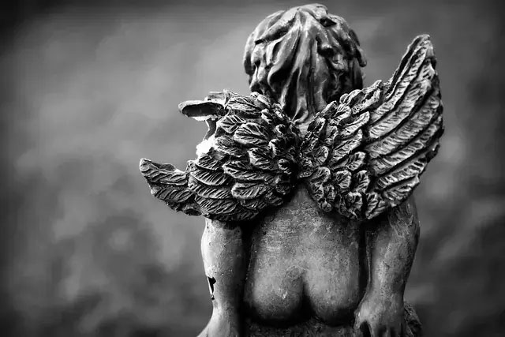

---
tags:
  - Prose
  - XephariousWryn
---

# Moments

> Author: Xepharious Wryn

> Original post: 

Her jacket lay tossed upon the couch across from us. I remember it clearly, perhaps because of how the sleeve of her jacket had fallen just so to partially cover some of the holo-transmitters from mine. The result of this was that the normal projection of the emblem that had come to represent the Alexylva Paradox Logistics wing, my favorite setting of late, showed only partially. This effectively of cutt the normally hope and reverence inspiring graphic off just as it would have otherwise started floating over top of her less holo-dynamic version of the ALXVP Corp Jacket. It was a rather sobering image really, one that invoked portents and thoughts of just how helpless I felt in that moment. 

I let my hand come to rest gently on her sobbing shoulder, hesitant at first given my complete and utter inexperience in such a role as I now found myself. I had meant the gesture to be consolatory but the sudden jump of her entire body at my touch was all together terrifying. She didn’t look up and nor did the sudden reaction bring any change to her sobs. Usually a being of many, many, words, I was totally at a loss for what to say; so I said nothing for a while. I’d always imagined I might be in this position, though, maybe not specifically so and certainly not so soon in my life. My thoughts turned to her mother and for a fleeting moment, just a small one, I wished that she wasn’t five or six jumps down-chain dutifully resolving yet another Anoikis system but instead here; with her heartbroken daughter instead of me. Death was nothing next to the sudden paralyzation that I had absolutely no idea how to help the child I’d come to love, maybe even as my own. What could I even say?

Try as I might, no words came, but then she seemed not to ask for any either. So there we sat for what seemed like the entire turning of the system; her with her sobs buried firmly into my chest and me with not a word on my lips. My eyes returned to the jackets as I tried to piece together what little I could of the events that had led to the catastrophic social falling out. I had no hope of understanding the emotional chain reaction, so maybe putting my overly-analytical mind to work on the events I could comprehend might help.

A few months ago Ami had smartly modified the fabricators to extrapolate a life-sized pattern for the Corp Jacket from the schematics I’d made for one of her collectable dolls. The ingenuity, and frankly lack of foresight on my part, had caused no small amount of social commotion throughout Indigo City Station. Few of Alexylva’s pilots actually had kids, and none of them had ever really thought to gift or reproduce the jacket, even in a non-holographic form, for their children. The Corp Jacket was something earned, not simply given. And so, being no more than a few weeks new to the system and only a few days new to the classroom, Ami was an instant sensation. For a kid who’d lived a life of hiding from all manner of unwanted attention and horrors, I couldn’t even begin to imagine what the sudden popularity must have felt like. Frightening? Amazing? Intoxicating? Confusing? Maybe it was all of that and more.

At first, as she settled into her studies, managed through the initial process of assessment and then the adaptation of curriculum specifically to her level, having such attention must have been comforting. I say this not because I had any way of reading her emotionally, but because for almost two standard weeks I never saw her take the jacket off beyond the walls of her family apartment. I’ll admit that I felt a bit odd keeping such covert surveillance on her during that time. To anyone else it would have likely been quite an awkward conversation having to explain why I was so closely watching my girlfriend’s pre-teen daughter, but to those few who know of my recent past, there can be little surprise. And to those who aren’t privy to such sensitive materials, I’ll simply comment that one should never, ever, take for granted the safety of those they love, and when such love is in child form… maybe it is after loss that we truly understand how precious something was to us. That thought will come up later in my story, but for now I’ll continue with the events.

Ackland had never struck me as any particular danger when, on about the third day after Ami started wearing the jacket, he offered to help her with any schoolwork she might be struggling with. He was otherwise a rather quiet boy, the child of a Stationmaster’s Aid, Ackland’s naturally scientific mind and minimal social skills had settled him into the role of tutor for many of his classmates. ‘Brainy’ personalities abound in Origin and more often than not such youths are appreciated by their peers but often left socially solitary on the assumption that they liked it that way or they’d have asked to be included. Maybe it was Ami’s incredibly high emotional IQ or perhaps the result of so many years of ‘people watching’ but where Ackland offered only academic help, she saw a request for connection and friendship.

That friendship grew and while it did so also the dynamic of Origin grew. We were experiencing, and still are, quite a massive boom in our immigration rates. With only a few hundred such integrated classrooms available on Indigo City Station, it was inevitable that other children of capsuleers or their fleets would join the class. And even if they hadn’t, most ALXVP families lived rather centralized to the docking sections of the station and their children would inherently frequent the same social venues and pleasure districts. In less than a month, Ami’s jacket caught on in a big way. It was a status symbol by virtue of an unspoken rule that only children of families directly involved in ALXVP as capsuleers, crew, or technicians had ‘earned’ the right to wear it. The inevitable fights broke out here or there, of which each one was not so covertly cc’d to me by our oh-so-kind public safety branch. They weren’t about to come out and blame me, a Sub-Coordinator, for causing the fights. But their unspoken assumption that school ground squabbles should, for some reason, concern a high ranking intelligence contact held very little air. Besides, I never saw Naraish’s name on a damn one of those ‘helpful FYI’s and he practically is Origin’s Intel network.

I mention the jackets again not because I feel some need to dwell on them, despite their excellent style and creativity; whoever designed them must have been having a really good day I think. No, I mention them because I think this might have been the first wedge in the ultimate split to an otherwise strong relationship. Ackland’s father, being an employee not of Alexylva Paradox, but rather reporting through his superiors to the Board of Coordinators as part of the Origin Colonial Authority government, didn’t fall into one of those select groups which could wear the coveted jacket without fear of ridicule or reprisal. I have no doubts that Ami, as humble and consolatory as she naturally is, must have encouraged him to obtain and wear one anyway and damn the status quo; an attitude she clearly inherited from her mother by the way.  But he never did take to wearing one. Maybe it was also Ami’s nature which led her to avoid gravitating towards the inevitable social cliques which formed among the ‘have’s and ‘have-not’s. Instead, she preferred to keep to her smaller circles, one of which still unconditionally included Ackland. Ami’s particular ability to rise above the less meritorious social effects, it turns out, would have a down side; I don’t think she ever saw what was coming.

Origin has always been hesitant to draw alliances or even strong relationships with entities within known-space. For most corporations throughout the greater New Eden, it can be hard to understand the unique constraints one must face within Anoikis. Certain tenants of life which exists equally throughout High-sec, low-sec, and even null-sec simply don’t apply in the cruel realities of a system accessible only by wormholes.  This can lead some contracts between a ‘wormhole corporation’ and any other to be inherently constraining or even flawed. I won’t innumerate the many examples of this but suffice to say that those inconsistencies in contractual effects often lead us to keep our distance from organizations who simply play by different rules than we must.  Of late, we’ve found ourselves more and more involved in diplomacy with such known-space groups, despite our history of avoidance. The change in policy was not one taken lightly and it has caused no small amount of trepidation among our people, many of whom came to Origin in order to distance themselves from the relentless realities that govern life in known-space. These people would very much prefer not to see the ghosts of their past brought to haunt them once again.

However, as much as we would like to think ourselves immune from the greater politick of New Eden, we simply aren’t. No better example of this is evident than the painful events that took place in Origin only eight standard months ago. Though the reasons which precipitated the most recent siege of Origin are still unknown to us, I have no doubt that were we better in tune with the forces at work beyond our wormholes, we may have been better prepared when during the waning hours of our primary watch a contingent of the S.T.I.L. Alliance parked almost a hundred Battleships just off Indigo City Station and demanded the unconditional surrender of our assets and fleet. It was through the incredible guile and determination of what allies we did have and through their willingness to stand by us that we survived those horrific three days.  Many things were made clear to me in those days; not the least of which was just how fragile everything we hold dear really can be. Much of our policy changed on the day we negotiated the final removal of what remained of the aggressing fleet. It was but one moment in many lifetimes of moments, but those decisions set in motion a new willingness to find and make friends even beyond the divergent realities of our system to so many others.

One such willingness that grew out of that moment was the hope for renewed relations with the Societas Imperialis Sceptri Coronaeque, or in short, SFRIM. Our history with SFRIM is not one from which many could derive a sense of pride, but the fundamental differences in ideology between Origin and SFRIM’s adherence to the tenants of their Empire never made for happy or simple conversation. I will admit that in consenting to proceed with such talks I thought of many, many different potential consequence to the millions of souls who I had sworn to protect. The particular consequence which had brought my not-quite-adoptive daughter in tears to my chest was not one of them.

A sharp pain shot through my biological arm as it sat too long unmoved across her shoulder. The sensation brought me back out of my memories and all-too-comfortably analytical headspace. Her sobs had slowed to the point where perhaps words might be possible. I still had no gassing clue what to say, but it was also clear that I’d have to say something.

“Do… would you like to talk about it?”

Her breathing changed but she didn’t move other than a brief and barely felt nod which didn’t come until several moments after the question. I knew she’d much rather have gone to her mom with this sort of thing anyway, but her mom wasn’t available right now and this had clearly been important enough that it couldn’t wait. Maybe I should have been flattered that she actually felt comfortable enough with me to let me be that substitute; and later, after I’d come to better understand the whole thing I was flattered. But in that moment, all I can remember feeling was a need to actually do something.

“Why did you have to send out the Tearnix too?” Her question was a bit hoarse at first but the disconnected nature of its content was the part that left me unable to answer for almost a minute. At length she finally pulled back and looked up at me. There was a lot of hurt in her eyes and I realized that some of it was even aimed at me.

I had no clue as to how to answer but I had to. “Send the Tearnix… in the escort?”

She nodded slowly, her eyes still holding that hint of accusation.

“I’m… We…” Speechless was not a condition to which I was accustomed. There were many, many reasons for which to send Shar’s controversial behemoth on that escort mission but most of them were very classified. As I tried to find some explanation I could tell her it occurred to me that she actually didn’t even care about the Phoenix. “What happened?”

It took her many more moments to answer. “His mother was killed in battle.” She shook her head. “He wouldn’t tell me before, only that she was dead. How was I supposed to know?”

Her narrative wasn’t exactly helpful. I knew that as part of the on-going talks we’d agreed to allow Templar Vadam, an emissary for SFRIM, passage into Origin in the hopes that his physical presence in our daily realities might in some way help bridge the understanding between our worlds. It was a move which I’d been decidedly against given the insane strategic vulnerability of having an agent so openly sworn to defend the Empire with direct access to our system. Were he to have snuck in even one set of scanning equipment it could have precipitated an Amarrian invasion the likes of which we could never hope to repel, even with every friend we had. I must also admit that my own history with the Amarr Empire did not resonate well with the idea either. For reasons of security as well as a myriad of political statements, we sent a fleet which included the Tearnix to greet the Templar before summarily closing the wormhole behind him. It was a move designed in no small part to minimize any fear that he or a disaffected member of his staff might transmit the location of the entrance to our home as well as to make it very clear that we took his visit very, very seriously. It wasn’t exactly privileged knowledge that the Tearnix had been deployed in such a way, in fact I’d pretty much ensured that just about anyone and everyone with a care to know in Origin was aware. The Tearnix had a reputation for its ruthless origins and I was more than happy to trade on that reputation in order to silence those who might question whether we were being too friendly with our erstwhile enemies. Apparently my intended message hadn’t been received as I’d meant it to be by everyone. But even that hadn’t explained the connection between Ackland’s mother and the Tearnix.

Lost again to my thoughts, I hadn’t responded and so she continued. “He screamed at me Xeph…” She looked into my eyes again. I could see her clawing for some fraction of understanding in those deep wells.

“Because of the Templar’s visit or because the Tearnix was sent to meet him?” I was hoping for at least some clarity, for her and for me.

She shook her head again gently and shifted in her seat as she pulled away from me just a little more. She was regaining herself but a part of me was almost sad for it. I realized later that it was the first time I’d ever in my life felt so entirely needed and so unconditionally trusted and as ridiculous as I want to see it a part of me felt loss in that moment when she pulled away; loss that the moment was over and she didn’t need me as much anymore. I realized just how much I didn’t… couldn’t even begin to deserve her faith in me and for a split second it seemed to me that maybe she’d realized exactly that too. But her eyes still looked to me for support and my fears quickly cleared as she answered.

“Both… I guess. She was killed by a Templar.”

That hit me in the gut. “But that’s part of why I… we sent the Tearnix.”

She looked at me in confusion for a moment. “But, you sent that ship, one of our largest and most powerful, in honor of his visit.”

Clearly I had never anticipated how my very covert message might be taken but those less advanced in years. Well fedoshit. “Yes… that is what we put on the news feeds isn’t it.”

She looked at me as though I hadn’t actually answered her question or the accusation in her eyes at all.

“And our honoring of a direct representative of what stole his mother from him must have hurt him deeply. Why did he yell at you though?”

She didn’t say anything but after a moment she too glanced over to the jackets which still lay in a pile together on the other couch. By the time she looked back to me I was only starting to put it all together.

“Your mother’s friendship with the Praefecta runs deep doesn’t it.” It wasn’t an answer really, but I saw acknowledgement of my new understanding played back in her eyes just then.

She looked down at her own hands for a moment before she spoke. “He didn’t tell me about his mother until after, while he was shouting it.”

Without really even knowing I was doing it my hand, now thoroughly tingling from lack of moment, began gently rubbing her shoulder. “He accused you because of the Jacket and your connection to ALXVP… to me.” She nodded, still looking down. “And then you defended Templar Vadam because of his connection to Praefecta Aspenstar Daphiti.” There was nothing even remotely funny about the moment but I was eminently happy that she never looked up to see the smirk that was crossing my face unbidden. Here she was standing up for what and who she believed in despite what, to her at least, must seem like planet-ending consequences and I had suddenly found myself to be incredibly proud of her. But I was proud of her for something that I had so far as yet been unable to do. I too had a relatively good relationship as well as positive past interactions with the woman who ran SFRIM and yet each time I tried to extend that inkling of trust through to apply to all of her corporation I found myself mired in the ghosts of my past. I recall taking a rather large breath as I looked down at Ami and realized just how petty my actions must have seemed to some, actions that despite their roots in actual cause for concern, were put in even greater relief by the loyalty of a girl just barely old enough to consider the many lives she may have yet to live. I can’t help but smile ironically at the image even now.

“He won’t even answer my messages…” I could see the flash of her external communicator holo as it displayed for an instant across her forearm. The format of the display was quite foreign to me having only ever used an implanted communications model and never an external one but even I could make out which icon must have signaled no incoming messages. In that moment it occurred to me that perhaps Ackland had been the only person with whom she’d regularly communicated the past few months. If that was true, his rejection carried all the more sting.

“Maybe he’ll come around… with time.” That was apparently not the correct answer. Her eyes lifted to skewer me with an incredulous stare and her shoulder instinctively shrugged off my hand, the last bit of me which had still been in direct contact with her. Yeah, the moment was very much over.

Her stare didn’t last long and soon her eyes returned to her hands. “He canceled our next study session too… I guess I’ll have to find someone else to work through the physics assignment with.”

I was starting to realize that the loss of this friendship went deeper than my previous comment had implied. This had been perhaps one of the first relationships for her in which the end couldn’t be explained by the fates of the world around her, but by something she’d done. I had the awareness to know that there would be chances and hope in the future, but this girl had known only isolation and cruelty from many of those beyond her family throughout her youth and as she glanced back at the friendships of her past, those had always ended with such intransient finality. Finally she’d had a chance to hope for a relationship with someone who might not be suddenly taken from her by war or slavery; and to her, she’d fucked it up.

I decided to take a different vector. “Got anyone else in mind?”

The question had caught her a bit off guard and this time when she looked up at me it was with a slight hint of curiosity. “No?” Then just a bit of the Ami I knew started to creep back in and she made half and attempt at a smirk. “Do you?”

Well, I certainly had no damn clue but I’d kind of already stepped in it so I might as well try right? “Off the top of my head? Not really.” Actually, I was starting to have a few thoughts but given that they were all kids of my fellow Corpmates and this whole thing had started because of Ami’s relation to the Corp I wasn’t about to even think their names.

“That’s what I thought.” That was said in jest. She really did have no idea of how to be unkind and even the attempt as poking fun at me was so dripping in playful humor that it made her smile too.

“Well, I know I’m not really the same, but at least this once, maybe you could try to teach me some Physics.”

Well that got a look of incredulity. “You think you, a mere capsuleer can learn this stuff!?” She was really trying quite hard to hold the face. “They said you had an ego but yikes.”

“Oh, is that what they’re saying about me these days? You shouldn’t believe a word of it; all lies.”

Ok, she was getting way to good at those incredulous looks of hers.

“Tell ya what, why don’t you invite me to that next physics session of yours while I go check on your brother and sister.”

“What if you have to pod up?” She was the daughter of a capsuleer too, why shouldn’t she expect for me to have to drop the study session due to system protection?

“If I have to pod up?” Personally, I fully expected Ackland to be taking my spot well before the session anyway but I couldn’t exactly tell her that. “Well, unless a capital pops into Origin, ain’t nothin’ going to get me in my pod from that study session, promise.”

I think her face was stuck on ‘incredulous’ now. “Even I know a capital can fit through… You’re messing with me, that’s what this is. Gee, thanks!”

“Yeah, but you’re smiling again, aren’t ya?”

The smile instantly disappeared only to slowly creep back despite the effort. “Fine, but I’m going to find the extra-hard problems for you, just because you’re being mean.” With that she finally shifted off of the couch and over to the satchel she’d left beside the pair of jackets. I rose, discreetly stretching my arm as much as possible, and turned to make my way down the hall to where the twins were sleeping. As I glanced back over at Ami I noticed that in opening her satchel she’d moved her jacket ever-so-slightly off of mine. I could have easily deactivated the hologram remotely as I typically did when not wearing the coat. The only reason I hadn’t in the first place had been that I’d entirely forgotten to with the look on Ami’s face when I arrived. But the shift in her sleeve had uncovered the other holo-emiter allowing the full Logistics emblem to dance about protectively over her repositioned coat. As I watched one of the stars in the dynamic emblem flare brilliantly into existence only to be suddenly linked up into the pattern of other stars I thought again on the concept of friends. Maybe it was time for me to grow a little as well. Maybe the moment had finally come for me to overcome some of my fears in the name of friendship.

As I walked down the short hallway I activated my own schedule via implant just in time to see Ami’s invite appear two days out. I accepted Ami’s invite but then cross-referenced the Amarr directory and found the name which I sought. She was still living close to the medical facilities following the birth, which was good. I willed multi-day event into existence on my schedule about two weeks out and it was quickly confirmed as my schedule back-checked to that of the other coordinators. It was time to visit an old friend that I’d once walked out on.

As I sit now in preparation for my trip, I think back to what those moments with Ami had really taught me. Through it all, you can only ever really count on your friends and on your family. I was learning again how to trust enough to make new friends but as I think back those feelings of complete and unadulterated trust that an upset girl showed me, I realize now that it takes a whole different level of trust to gain a family. I didn’t have much of that in my life; family. Oh, I’d always convinced myself that my crews were my family, and I guess they still kinda are, but with just how little chance I had at having true family in this whole Bob-forsaken star soup, I was running out of moments to hold onto that.

I’d better get started fixing that.