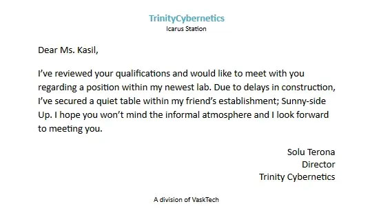

---
tags:
  - Prose
  - XephariousWryn
---

# Sunswept

> Author: Xepharious Wryn

> Original post: 

> Author’s Note: This story is set in the fictional world of EVE Online and uses characters created and played by multiple people. I’ve chosen to write the story assuming a basic awareness of the history of New Eden and the tales of its people as set forth by CCP. Those unfamiliar with the world should read the brief forward which covers just enough of that background to move onto the prelude.

## Forward

Somewhere lost in the vast history of New Eden is the tale of how humanity took an ultimate leap through the EvE gate, a portal that would propel them to another galaxy and begin one of the greatest stories of our time. Over millennia, civilization in New Eden has taken many forms, eventually coalescing into the rise of the four primary empires; Amarr, Gallente, Caldari, and Minmatar. At the dawning of the Empyrean age cloning technology matured and along with advancements in neuro-technical science, gave rise to a whole new type of human; the capsuleer. With the right genetic compatibility, a person could be cloned into a body which could interface directly with a starship and become virtually immortal. When a capsuleer was killed, their consciousness would be violently ripped from the present clone and instantly sent to another clone.

Each empire, and every faction in between, began the greatest arms race the galaxy had seen; capsuleers were courted as near-gods and anyone with the right genetic makeup was tested and recruited with fervor. In time the capsuleers themselves found that their power exceeded even the great empires themselves, banding together to form their own vast empires on the edge of known space. CONCORD, empowered to preserve the peace from a time before even the first capsuleers, found that they had little jurisdiction within those outer reaches and so accepted the task of preventing at least known criminals from returning to the higher security central systems where the original four empires still held sovereignty. Unable to prevent them, great wars raged between the null-security alliances and empires and continue even to this day.

Back within the relatively safe territories which came to be referred to as high-security space, or simply 'high-sec' there were those who began to question some of the imposing limitations set forth by CONCORD and upheld by even the most destructive of the outer alliances. Seeking freedom from a system that deemed automated intelligence as fundamentally non-sentient and restricted further advancements in clone sciences, Saede Riordan and several hundred like-minded individuals left known space and ventured through a wormhole into the Anoikis cluster, a labyrinth of ever changing wormhole connected systems unchartable to known science and unreachable to all but the most dedicated explorers. They took with them embryonic rogue drone AIs with which they hoped to raise free and sentient AI.

In the many months that it took CONCORD to finally locate Saede and her followers, they had successfully established a colony, introduced fully digital minds into their society, and hacked through just about every security firewall with which CONCORD maintained ultimate control over the capsuleer population. CONCORD's attempts to regain control over those capsuleers who fled with Saede into the system they now called Origin were immediately met with the promise that the new fledgling Colonial Government would release their hacks to the greater high-sec capsuleer population should CONCORD ever try to invade their new home. Faced with a stalemate, CONCORD was forced to cede any control they had hoped to establish over Origin and instead focus on policing those who came and went from it.

Within the relative safety of their new frontier home, the colonists of Origin, protected by their very own capsuleer corporation; Alexylva Paradox, established their capital, Foundation City. They further established a government of Coordinators who, along with their sophisticate and sentient AI began almost immediate advances into neuro-technics and cloning sciences. Within only a year, their top scientists had discovered the key to allow each and every citizen over the biological age of 14 the ability to save off a digital copy of their consciousness to be revived and cloned should they ever die. The new clone couldn't retain the memories from the time passed since the person was scanned, and so regular 'back-ups' became a way of life for the quickly expanding population.

Such miracles of science also created an almost constant need for raw biomass with which to generate new clones. A practice of donating one's body back to be biomassed for the community upon death became mandatory and even the capsuleers would spend the extra diligence to retrieve any corpses from the occasional invader into Origin. Morbidity turned to routine and routine to purpose as overtime the cycle of biomass became as accepted as the cycle of precipitation. It was believed that this practice or at least word of it lead to some of the belief held among those in high-sec that all people who lived in wormholes were cannibals and monsters of myth.

__________________________________

## Prelude

A recently given dissertation on the unique characteristics of the Dajellan primate E-364 Outbreak lay atop a pile of datapads where she had finished it. Various other articles and datapads are strewn about the apartment while yesterday's dishes lay unwashed, the bed unmade, and an empty pint of KipWa's Veg Delight with hashi still splayed within germinating on the table. Only the small partitioned corner of the studio shows signs of life. On an immaculately cleaned table, over a well lit MicroSlide a microscopic pipet drips once with an audible 'click-it'. Two eyes swiftly move to the display screen and wait. A brownish greenish blob makes contact with, then begins to surround is single human epithelial cell.

There is a moment and then slowly, gently the blob is absorbed. Time seems to suspend as only the soft breathing of a recently graduated Med. Student defies the stillness. With a sudden breath of air she leaps to her feet and lets loose a deafening cheer. Within the narrow confines of the cleanzone she dances about as the view begins to pull back to a standard 10x magnification and very faintly, small green organelles begin to show in one half of a mitotic cell.

__________________________________

Jallif could feel the alien vibrations of the event horizon and the 'wub-wub-wub' reminded him that he was now a very, very long way from home. Perspiration came to his skin as each step down the corridor accompanied yet another thought of how his first (and decidedly last) adventure as a starship crewman was doomed to end in horrible pain. The local fleet might mistake the delivery crew as hostile and blow every one of them out of space; quick way to die at least. Clerical errors were made. Or would the delivery go fine, and the new owner might just decide to space the superfluous crew. What would a capsuleer care for extra bodies? Floating in space... Jallif shuddered reflexively, having to pause before regaining composure and checking both ways to ensure that no one was around.

Another crewmate entered the hall behind him and he cursed inwardly. Regaining his pace, he stepped right past his destination and continued down the hall until he came to a data processing junction board attached to the corridor wall. The crewmate, moving far too slow for Jallif's like, continued past him as he set down his case and extracted an unassuming diagnostic device. Running a lame reading on the junction his mind retreated to his previous speculation. He would make it to the station, but only to be killed; all wormhole people were crazy, everyone knew that. Or, no wormhole would ever open to Gallente space again and he'd be stuck here forever. Or they might never let him leave? The crewmate turned the corner and Jallif tossed the useless device into his case as he quickly retraced his steps to a small access panel set low in the corridor plating. Wasn't it true that some wormholers were cannibalistic? His uniform was slowly saturating as he bent to remove the fasteners and retract the panel. With the skills of one used to hiding and motivated by mounting terror, Jallif slipped into the narrow channel with just enough room to squeeze around and use a magnet to refasten the plate behind him. The ship which had begun moving after making transit of the wormhole was now starting to decelerate and he could feel his time evaporating. He squirmed to the end of the channel and found his target. He would have only one shot at this.

Less than 10 meters away a typical cargo container sat pre-positioned in an egress port ready to be jettisoned. Atypically, this canister was set to fail its containment and release its contents only moments after jettison. The ship came to a full stop and Jallif's clock started. Tick, tick, tick... He quickly inserted a small metal pick directly into the correct wire flowing along a bundle of wires. It looked exactly as he had been told it would. Something went right? Tick... The strange tool in his other hand, linked via its own wire to the pick vibrated momentarily then began to disintegrate in his very hands. Fedoshit! He dropped the entire device which never actually hit the floor of the crawlspace and he began scrambling back to the access panel. Nobody ever said anything about my tool ghosting on me, what else? He listened for only a second, trying to hear if anyone was coming in the corridor. He'd just have to risk it, he deactivated the magnet as one more horror filled his mind. They'll know, they'll find out what I did.

With a sudden 'cachunk-hiss' the cargo container which had been lodged into the port by yet another very freighted dock worker back in Jita spat out into space. It tumbled once and as programmed opened its hatch.

Ninavask's pod slipped the last few meters into the shiny new Rattlesnake. 100 kilotons of raw power surged through the capsuleer connection and Nina felt every meter, every hum of the beast.

"Nina, heya, I got a cargo container on scan... looks like your fancy new toy just pooped itself!"

"Oh cut it Posh, what's this about a cargo container?" The subcoordinator's voice on the network ended Aaron's base teasing as Nina instantly accessed a starboard egress port.

"Yeah, I'm reading that I just launched it... that's strange... there's no crew within 20 meters and... yeah, the Pilot XO is reporting no jettison order detected."

Aaron was clearly back to business after the chastising. "I'm reading nothing onboard, and a malfunctioning containment on it. Think it could have malfunctioned?"

Nina re-ran any checks he could but there was no record other than what seemed to be a jammed egress port that malfunctioned upon exiting warp. "I'll check the manifest..." He reached back into the database and found the service record for the component. Odd; "No mention of a jammed port in Jita."

"You know they would never say even if there was." Aaron really had no faith in any empire's adherence to their craft and it dripped in tone. "Yeah, I got nothing, blowin' it"

"Sure.." Ninavask took his mind from the strange detail and set course for Icarus.

In the stark vastness of nowhere two light missiles streaked out and consumed the faulty container as nearby a massive battleship and its Kestrel escort who had fired the missiles turned home. With a quick burst of the frigate's web, both vessels leapt home in succession just as Subordinator Xepharious's cloaked Stratios slipped out of warp meters from the floating dust that was once a cargo container. There was sure to be a good party back at Icarus for Nina but Xeph was just going to have to miss this one. Something wasn't right about this malfunctioning container. He 'settled' into his pod, silent to all, and waited.

__________________________________

## Chapter 1: Lookin' Up

The bar was rather empty during the second shift and she looked about the new furnishings for a moment. No one of particular note sat in the various booths or at the few tables. New furnishings, new bar, new station, and, of course, new assignments. Her graduation from the Renaissance Medical Academy was still fresh in her mind. With the completion of her residency at Serendipity Anchorage, she had hoped to put her shiny new degree to practice at one of the medical facilities within Icarus Station.

Now, standing in this bar after a week of 'networking' and 'inquiries' she found that it seemed even in a new station, it was more about who you know then what you knew. And she knew almost nobody. Once more she let out a sigh and reached for her glass.

"Why so glum?"

The voice caught her off guard; too low to have been the polite young man who had served her only moments ago. She spun to see who... and almost started as she found a capsuleer smiling back as her as he came around the bar. "I, uh, it's nothing."

"Only nothing?" An odd reply, and why had he been behind the bar?

"Just, lost in my thoughts I guess"

He seemed to look her over for a brief moment and she felt a bit strange, as though he was gathering more information than eyes could provide. "Looking for work?" Could he have looked up her file via The Network? She had heard capsuleers here could do stuff like that, maybe one eye was cybernetic...

"How did you know"

"The data files" He nodded, amused, to the small pile of data files she still had with her from several of the various medical and research labs just moving into the station. Of course, not some super-cyborg after all. She silently chastened herself for the mental gymnastics.

"Ah, yes" She blushed, a bit more purple in her cheeks than usual. "No bites though."

He seemed puzzled at the reference for a moment or two as he took a seat next to hers. Realization came to his face and she smiled again. "What are ya looking for?"

"Medical or research." But he could have gleaned that from the files. Why was she so on edge with him? "I was hoping that a recommendation from Dr. Cartwith could get my foot in the door but I guess he isn't as popular as he once was." The comment seemed to catch the capsuleer's attention and she suddenly regretted bringing it up. Dr. Cartwith, aside from being one of the preeminent minds behind Origin's cloning infrastructure, had recently been at the heart of a massive Biomass corruption disaster which had almost crippled the entire system. Only pure luck had staved off doom, and while it hadn't exactly been Dr. Cartwith's fault, he had been responsible for the system and ultimately the one to take the fall when the dust settled. That he had also been the one supervising her residency was turning out to be rather unfortunate for her. Her recollections cleared as the capsuleer across from her was looking rather smartly at her. The slight grin, she decided, was a bit unnerving.

"Dr. Cartwith then? I can see how that might close some doors." He shifted in his seat. "What is your specialty then?"

His question implied interest while the words he chose clearly screamed 'Layman'. "Genetic therapy and mutation, with addition focus in xenogenetics." What would an 'egg jockey' know about medicine anyway? She decided that the conversation was going nowhere and despite the man's gentle seeming nature, she finished her drink and started reaching for her files.

"Well, I can't say there is much use for that sort of thing so far away from the planets." He noticed her gesture to end the conversation and smiled slightly. "But I will certainly keep my ears open." He stood and, seeing her desire to leave decided to forgo the handshake. "I'm Xeph by the way, I didn't catch your name?"

Didn't catch her name? What a joke, he had likely already looked up her entire file. Oh well, doesn't hurt to be nice. "Meyan" She gathered the files, holding them to her chest and paused just long enough to produce a smile to accompany her name. "I'm afraid I really must get back out there, Xeph. Thanks for the drink?" He had move back behind the bar and with no sign of the previous tender, she could only assume he was playing at bartender for kicks.

"Come back in any time." He gave a slight wave as she moved to the door. She managed one last look back at the strange man as she passed the threshold and saw a look of deep thought, and was it recollection? She decided to put him out of her mind and moved her thoughts to remembering which floor she had been about to go to when she had decided to get a drink. Meyan stepped into the lift and selected one of the lower levels.

__________________________________

Taking a seat at the edge of his bar, Xeph thought back to his own role in the disaster which seemingly continued to plague his hermitic friend Dr. Cartwith and now, it seemed, his students as well. A problem for later he decided and looked around his empty establishment. "Hey Jep, Can you watch the S'up? I think I'm going for a bit of a walkabout."

__________________________________

KipTop never thought of himself as an 'orphan' so much as just a kid in his city. And to him, it was his city. Each alley or corridor, each lift, tunnel, every park and courtyard was his house. He moved swiftly from the shadowed exhaust grate smelling of fish and herbs, ignoring the sudden pang it gave his unfortunate stomach. Crouching low as he came scooting under the hovering cab he placed his movement exactly between the repulsive generators which would otherwise have pulverized him. His city was dangerous, especially in his line of work; but none of the other kids could do it, and that's why it was his city. Reaching up from just under the vehicle he slipped an almost invisible flexible disk into the passenger door's chip reader. It slipped from his finger tips and he quickly recoiled his arm back under the cab even as the passenger door began to slide open to emit a portly gentleman in a too-fine jacket. KipTop enjoyed the extra blessing of time as the gentleman stumbled to find his footing in the sudden wind this high off the ground. Again KipTop scooted along his back and rolled out from under the far side of the vehicle. He had only a few moments before the automated controls of the cab kicked in and started scanning the surroundings to pull back out into the evening air. Staying close to the ground as he went about the back of the cab he stepped quickly back into the shadows of the vent and considered the take as he scanned to be sure no one saw him. The cab was a sleek black and dark green, clearly from one of the smaller corporations that catered to the more affluent. That disk would skim every isk chip used on the passenger door until the end of the day when the garage security sweep would find it and it would be destroyed. It was a good take. More and more of the nicer cabs were moving to internal chip readers rather than the less trusting external readers. He laughed at the irony of it. The CabCorps wouldn't even let you in the vehicle unless you had money.

The light of Origin's primary had reached full peak and would soon be removing what little shadow the vent offered; KipTop had better get moving. Waiting so late into the day to make his take was very risky. He had lost out on an entire morning of fares with this one, but his shiny upscale target should make the difference in the quality of fare it took. Certain he hadn't been seen, he slipped back into the recess that hid a separate vent shaft, still open from his egress that morning. A quick flick of his lean frame and he vaulted the meter or so into it, turned , and set the cover back in place.

His journey through the innards of the building would take him right past several restaurant disposal shoots and his thoughts turned to deciding where to eat. He would have just enough time to reach the building's dorsal vent before returning to the Kinderhaus.

__________________________________

That evening, while a young boy ate his purloined dinner scraps silhouetted in the setting glow of Origin atop his city, Xeph stepped wearily back into his study and dropped into his reclined chair. The past few weeks were starting to crystalize in his mind and if he could just find some energy he was sure he could identify what it was that was bothering him so.

The opp had gone incredibly well. Alexylva was reaching further and finding more and more resources with Icarus as the new center of operations. Capsuleer recruitment was up and more goods than ever were flowing into and out of the system. To the businessman this was great, but to the wormholer and in light of some of the recent irregularities, it was enough to flare even the least paranoid soul. He made a mental note to try adjusting the shield resonance for the most recent doctrine. It had been a suggestion made by another capsuleer but it was a good one. Item by item he cleared his mind as he gave up on his previous plans to head directly to sleep.

A routine security drone had come to investigate the dust from the malfunctioning cargo container which in of itself was only odd. Why would anyone care so much as to check; he certainly hadn't ordered it. He had checked the records and nothing seemed out of place for a security drone out of Indigo City. He'd left it at that, a mental puzzle, until the opp was wrapping up tonight. Just as the last capsuleer slipped safely back into Origin, for a brief moment, an unknown Astero was spotted on directional scanners. Unwelcome scouts were a fact of life in wormholes and Origin was no different, but this scout had been seen before, just at the end of a major sleeper operation.

For the man tasked with organizing and running highly dangerous, multi-ship operations outside of Origin space, the coincidence was yet another worry to add. He had full faith in the planetary security here in Origin, but even the best could fall victim to a dedicated space-to-planet subterfuge, especially one backed by capsuleers. Perhaps it was time to get more involved. A few words with the Coordinator should be enough to bring her in but then what? A faulty cargo container, a drone just doing its job, and a recurring unwanted scout; it was hardly anything. Certainly not enough to account for the gut feeling he was getting. There was something more to it.

He set down the manifest he had absently been reviewing and leaned back. He thought back to how everything had always been so much cleaner in his youth. A memory floated to his mind and he dwelled in it. He couldn't have been more than 12? He was chasing his sister in yet another of their childhood games the point of which was long forgotten. She slipped through the door into her father's office, a place young Xeph was never keen to go. His master and lord was not his father. He stepped lightly to the crack in the door and listed. Damn, He was in there, and not alone either. He could hear both of them acknowledge his sister then return to their conversation. Memory had not recalled the topic, only that whatever it was, it was not on the up and up. Having heard them greet his sister he decided he could try slipping in, just enough to ask his sister to come back out. His presence was noticed immediately. A rough and heavy hand came down on his shoulder with more than a little force. Not accustomed to hard labor or fighting Xeph nearly buckled to the floor. "Boy, who told you to come in here?" He couldn't see the speaker, but the look on his lord's face just on the other side of the table made it clear that there would be no safety from him.

"I..."

"You'd be getting gone if you knew what was good for you." The owner of the heavy hand was already turning him about.

"But 'Liya-" It was a last hope plea to not be ejected alone.

"She's too young to know better or understand anyway, now go Xeph, before I have your mother make you." The coldness in his lord's voice was alien to him, but the sincerity was not. Xeph didn't care for the idea of his mother anywhere near these other men, they had that look.. And feel about them. He quickly made himself scarce, abandoning the game or any hope of playing with his sister.

He could feel his memory slowly drifting towards dreaming as he was suddenly running through fields and no longer anywhere near the house. "...too young to know better or understand anyway." Those words seems to roll in his mind as the last lucid thought mused that he might head to bed right off afterall.

__________________________________

## Chapter 2: Mates

Lost in her thoughts, Meyan stepped quietly from the lift as the doors opened and turned down the corridor. A few weeks had gone by with little luck in the employment area. As frustrating as it was, even her stalling career had taken a backseat in her mind of late. The hue of her skin had increased, bringing with it a strange itching sensation. Not painful, but certainly enough to make concentration an absolute task. She had taken to wearing long sleeves and even gloves to avoid questions which she didn't feel safe answering. She was becoming more self-conscious, almost too aware of others around, and she hated that.

Two women, starship crew by their gear, capsuleer crew by their swagger, passed by on her left, snip-its of their conversation reaching her only peripherally. Upgrades to Indigo Station, increase in Sleeper activity, conflicts with angels? Whatever it was; it was lost on ears slowly turning grayish-green. Only one thought from the encounter played in her thoughts: did they notice?

It was silly; ridiculous. What was happening to her? Was it some sort of side-effect? She hugged her data pads closer to her chest and hurried around the corner - right into a massive beast of a man running full out.

"Oy! 'et tha 'ole?" As large as the collision was, it was Meyan who retained all of the momentum of the impact... in almost exactly the opposite direction she was moving. Sprawling to catch her balance, her data pads flew into the air. She hit the floor with a grunt, still unsure as to what she had actually hit; a bulkhead perhaps?

A large hand appeared to her side and she took it, letting him hoist her back up and around to her feet.

"'m sorry 'am, but I 'e needin' to go. Ship 'ight go wit'out me!" Without even a glance for her scattered data pads, he was off and running down the hall before she could even respond.

Turning her eyes to her files now scattered about the passage, she thanked whatever deity had given her this day and began to reassemble her stack. It took a few minutes but there were no further interruptions. With her files once more in her arms, she stepped off, a little slower this time, around the corner and onward to the next lab on her trip.

Meyan stepped cautiously through doors that appeared to have been jammed open and looked around at an empty, unfinished lobby. From somewhere in the back she could hear someone excitedly shouting what sounded like directions. The voice paused then continued but moving closer. ..."Oy I siad left, to the left! Oh... No... I'll get-" A striking young man, lean with sandy hair and just a bit of stubble came around the corner and cut off at seeing her.

"I'd only just seen your name come up in the registry... I didn't realize you weren't open yet." She gave it half as an apology and just as much to fill the sudden confusing silence.

"We ain't" He moved behind a counter, she could make out the name VaskTech beneath protective film set in stone upon the counter face. "Open that is.. at least not yet... You looking for...." He trailed off, unsure what sort of customer to place her as.

"Work"

"Work?"

"Work; labwork?"

"Oh, nope."

"Nope?"

"Yeah"

"What?"

"Work"

"Yeah, don't got it."

"No work?" She was becoming suddenly confused in the melee of his responsive manner.

"No work, just me is all.. well, and those two gas heads in there.." He turned in response to something dragging in the back. "Oy, don't ya be moving it now, I'll be right back there!" Back to her; "So yeah, nope, no work."

'I, uh, thanks...' She just stood there, files clasped to her chest, unsure what to do next. She'd never encountered such a response since starting her search. Oh, there had been plenty of 'We'll contact you' or 'Let us take a look and we'll get back to you' but never such an abrupt and straight forward 'Nope'.

"Look, I'm sorry for the news, an' I'll be sure to let the boss know that you stopped by, maybe he's got something at one of his other shops... but there really ain't much 'lab' going on here, sorry."

She looked once more at her files and saw written there on the screen; 'VaskTech Laboratories' listed on the map. Still confused but not wishing to lose even the reference she started to slowly back out. "Um, thank you anyway."

"You bet, mate" He was already heading back around into the back.

She turned to leave, then paused as she remembered that she had brought her CV on a separate pad. It was a long shot but she stepped back over to the counter and deposited the pad with her credentials upon it. Turning again she took the few steps to the door and stepped back into the hall, paused to confirm the address, then shook her head and moved on. That's what she got for jumping at anything these days. As she quickly found the route back to her rooms, she promised herself two things: She was going to get a nice long refresher after this, and she was never scouting out a job based on new address listings again.

__________________________________

He arrived early to The Spot, as usual. The Kinderhaus keepers had long ago given up attempts to prevent his coming and going. Where he had once been kept from leaving and given only 'Mein kleinehase, but we fear for you out there, you are safer here' as reasoning, now they didn't even seem to notice. Mistress Sdint, who had told him such, was always his favorite. But he needed to survive and that meant Isk. They had once tried locking all the entry ways, even the waste chute. Almost unconsciously he pulled out a small nanostraw; his only possession from before... well before the Kinderhaus. He fought back any inkling of memory from before. That was a black hole he couldn't shake though he'd convinced himself he would. Just as quickly he slipped the nanostraw back into the scar on his leg. Once the home of an infant tracker, the scar was his most precious secret, and a constant reminder of what once was. His mind started once more into the memories; this time he wasn't fast enough to quash them. Flashes of another life came to him; his mom touching the implant, telling him that she would always find him as she kissed his freshly washed hair; later, older, he stands behind her, helping her zip her suit seal for her. She turns to show off. 'You like it!?' Her new crew suit. He'd never known, he wasn't old enough to understand what the new crew suit had meant, or what she meant by backed up but it had made her so happy, and thus it had made him happy with her. Another flash; she returned to their flat exhausted, but beaming. He was suddenly in her arms as she hugged him, spinning him...

A tear threatened to break free from his eye as he clamped down hard on the memories; the next ones got bad and he didn't have time for such baby stuff. No, the Kinderhaus keepers were probably happy they didn't have to worry about him much, they were so busy these days. He glanced around from his perch just inside one of the alcove lights. Dawn had broken and the lamp he was hidden behind would soon dim out, exposing him. The Boss was never late and he'd be gone from his spot before he had to worry. Celery had arrived. He could see movement in her typical vent. He wondered as to how anyone with such bright green hair could hide at all, or as to what her name meant anyway. Lips had also arrived, he could see the very edge of the younger boy's shoes poking out from under the discarded stasis unit at the end of the alcove known to some as 'The Spot'. Various other kids began to arrive, each to their own hiding spot, each so painfully obvious to KipTop who once more congratulated himself on his covert acumen.

The alcove light power transfer began to lower pitch signaling its shutdown and Kip quickly slipped back into the power conduit he had widened and began his way through the power shaft down to street level. He waited for Coal to vacate the power conduit access point before he followed the younger girl out into the street, both of them staying to the shadows.

"Fed'sex Kip, the 'hole you come from?" She turned suddenly, so close that her black matted hair almost wiped him in the neck.

It wasn't the first time he'd let himself be seen by her. Strange, maybe he just remembered when the power access point had been his hiding spot. Felt for her, ya know? "Black one."

She leveled him with her best 'not amused' look though he knew she had both gotten and appreciated the joke. "Good take?"

"Good enough..." He couldn't resist a smirk for yesterday's expertise and she just rolled her eyes.

"Well, I got mine so early in the morning, it must have been a good one. The stupid woman dropped her card on the pad as I walked past, she even ASKED me to pick it up for her!" Coal looked at him in triumph at her luck. She shrugged and looked away, towards where the Boss would soon appear. "I even offered to swipe it for her, passed it back. She had no clue..."

A shadow appeared in the doorframe as instantly some 15 various children aging from about five through fourteen materialized, in what must have seemed like chaos, to step up to the door then retreat into their hidey holes. There was an order, each of the kids knew it well. Disrupting that order meant losing standing. Like birds flitting the newest of them shot out to find if they had earned their SkimDisc for the day or not. Kip waited as Coal's turn came and she dashed out and returned a moment later with something in her hand and a smile on her face. Good; her take had turned out. Kip could recall the one time he'd lost his 'disc, gotten no take, and had to scrape the streets to afford a new one. He shuddered reflexively at the cold memories. At last it was his turn; second to last. The Boss liked him. With a quick look around he dashed into the alcove, slipping from shadow to shadow until he came before an imposing man with one of the deepest voices he'd ever heard.

"A good take that one; I give you two 'disc. You handle that?"

"Y- yes Boss" It was all he could do not the beam at the silhouette. Two whole 'discs. Nobody got to see what the others were given or not given, but he'd never heard of anyone getting two 'discs. Though, he sure wasn't telling even Coal that he'd gotten the second. A massive gloved hand deposited two small plasteck wrapped SkimDiscs along with a pittance of isk into his hands. He nodded and slipped back into the shadow just catching movement as the last boy, a solid two years his senior, slipped out from a place Kip couldn't see but knew it had been an old false wall. He meant to find where that secret wall was one day... But for today; he had two takes to plan. Coal was long gone when he returned and he paid her absence no mind as he slipped into the power access and started off into the inner highways of the city. Two disks meant twice the potential profit but it also meant twice the risk and half the time. He wasn't about to hope for the sort of luck Coal always had, but maybe, just maybe luck would run his way this time. He took the next turn in the duct and made up his mind to start his first take on the upper levels where traffic was heavy, and then slip back down to the more private, quiet type landing pads where he'd made his take yesterday. If quality was better than quantity, he could afford to take the time on his second take like before. Moving through the conduit, he finally let a grin come to his face. It was going to be a good day.

__________________________________

Another merchant bustled past at a near run-walk laden with more bolts of industrial fibers than Jallif would have thought manageable by any human. He had to duck and weave to avoid collision as his distraction nearly sent him directly into the nose of a makeshift lorry coming quickly from the opposing direction. He could hardly believe his eyes as every man, woman, child, drone, and holes; nanite of this forsaken system tried to singlehandedly take the brand new paint off Icarus's Loading deck. It was pure chaos! His fears of sticking out had been rudely shattered by the shear throng of humanity that was trying to inhabit a station which had only gone operational less than a week ago. Turning from the main passage he came to an impromptu market that had popped up in the absence of any formal market space. A cacophony of sounds, voices, and movement filled every cubed public meter. Songs and smells wove together as he pushed his way through the flow of humanity. To another such an embrace of culture and rich life might have been near spiritual, to Jallif who had no time for such ephemeral fedoshit it was yet another example of poor planning and how this backwater excuse for civilization was doomed to implode. There should be an order to things, a plan. Not that he was ever one to follow someone else's plans; or orders for that matter. But at least back in normal civilization you knew what the order was... and how to get around it. Here? Well... madness.

He finally reached the departures terminal just in time to see the final notice for a rare passenger ship destined for Jita to cycle from a blessed Green to an infernal red indicating that it was now sold out. Was anyone staying in this hole? His temporary quarters were so far from the docks, and the need for any ship to fill and depart in time to get through a safe wormhole chain so fast that this was now the third time he had been too slow to board one. Yep, never finding a damned ship. He was just about to start heading back to the nearest commissary when a face caught his eye. The dull white of a prosthetic cheek and ear had been visible just under a hood as the figure looked both ways before ducking into one of the many corridors leading to the nearest vertical lifts. He'd seen that face on the Pilot crew he'd come with on the Rattlesnake. He was also too late finding a ship home? Must be some fed-head. That he had also missed his ship didn't really matter to Jallif when it came to doling out criticism. What did matter, however, was that the other man seemed to be moving with purpose and to Jallif that could just mean that he knew of another way off this untested, overpacked tin can. He stepped around the same corridor corner and then followed around a few more until Jallif, certain that he had followed the other man correctly, was otherwise lost as to where he was. They hadn't taken the lifts as Jallif had figured but instead had found themselves in a darker, less used portion of the storage and warehousing sector.

"You... don't belong here." The voice was deep, almost rumbling, and had come from some place behind him.

"I... I'm looking for a man.." Jallif's fear was really starting to kick in but he didn't dare turn to see who addressed him.

"You've found no one, now leave... the way you came" Bidden to turn, Jallif did so but could see neither who was talking, nor which corridor he had come into this junction from. Leave it to 'holers never to mark an exit. "Or, perhaps you are needing some incentive?" Even with rushing adrenaline Jallif hadn't the reflexes to dodge the staggering blow that glanced off of his shoulder. Unprepared, Jallif flew sideways, striking his temple on the bulkhead. As he fell to the floor his last fuzzy image was that of the split-faced man towering over him with an odd look of... confusion? Blackness...

__________________________________

## Chapter 3: Memories

Kip stepped into the pedestrian flow and adopted a new disguise like a capsuleer would a new ship skin. This was a whole different world than the tubes and conduits, or even the midlevel pads where stealth was his ally. Here his disheveled cloths and unkepmt nature would blend in as long as he just looked and felt like he belonged. Thousands of people sifted in and out of lifts, buildings, and bazars in the cultural promenade that lay between six of the tallest buildings in New Hyjn. With so many people and everyone so very busy it was also a haven for the indigent and poor. Any take here wouldn't produce his cost in fares, but if he could land one of the busier cabs, it could make up for the low quality of passenger with quantity. The only tricky part was that there would be competition. Almost immediately he noticed Celery almost blatantly begging outside one stall. How she hoped to get a take so overtly he had no idea but he stayed clear of her all the same.

Looking around he noticed a cab pulling up just to his right. It looked in good repair; sounded good. The company wasn't too big and would certainly send this cab back to the promenade or some other major cultural center. He was just surveying a way to get closer when he noticed it. No good. The cab's chip reader had been encased with a simple black plasteck cover on which a large green arrow pointing up signaled to passengers that they should pay inside; and signaling to KipTop that he'd get no take there.

He continued to walk along the paths, aiming for one specific building with purpose but with no real care other than it had been the most directly opposing building to the lift he had taken to reach to promenade. He hadn't returned to this particular location in some time; not since he'd taken a spill about a year back. He had, at the time, recently joined the Boss's team. Not yet as skilled in stealth or city geography, he'd come to this spot based on a memory. His mom had once taken him shopping in the stores within the building somewhere to his left. It was a good memory but his return trip without her had proved nearly fatal. He'd been walking along, still wearing the same nice jacket that his mom had gotten him, when out of nowhere he'd been shoved to the ground. When he'd rolled over to face his attacker, the older girl yanked him up and out of the flow of traffic into a side alley. Once separated from the teeming streets, he had nowhere to run. Brandishing a self-made shiv, she'd taken his jacket and along with it, the 'disc he'd had stashed in the lining. Even as he extended the jacket out to her he'd realized what was inside but before he could pull the jacket back she'd shoved the shive at him forcing him to jump back. This had left her all the time she needed to grab his jacket, shove it half into her bag, then advance toward him.

The next part was one had played over and over in his mind. A man had seen him get attacked and he shouted now from a place Kip couldn't see. The girl ran off leaving a cold Kip to look up helplessly at his would-be savior. There was no way the man could know that Kip was already all but dead for having lost the 'disc, nor was there a way he could tell him.

Kip noticed yet another likely take moving in on the other side of the promenade, but it was too far for him to get to quickly enough; another miss. He kept up his pace. He'd soon be in the building and need to find some out-of-the-way nook in which to double back. His idle mind returned to the man who'd 'rescued' him. He'd not been a well off man, and took the first chance he got to unload Kip on the nearest official he could. Kip hadn't been too keen on finding himself a prisoner in yet another home; so many kids with only drone attendants to watch over them. He wasn't going back there. While the man was talking to the officer Kip quickly rolled off the back of the bench into one of the many bushes and from there found the only place he could see to hide... an exposed power access panel.

After one pass of the promenade, he knew he wasn't going to get many more. Ducking into a lift he took it up one level. He got a few looks as he emerged into a rather nice shopping mall but he played it off as surprise and confusion as he quickly turned, seeing that the first lift doors had closed, he summoned another lift, waited, then stepped into the new one, taking it back down. This time, as he emerged onto the promenade once more he paused to survey the area. He'd have to be more direct or he'd run out of time to get to the mid-levels for his second take.

He spotted an averagely nice man carrying a bit more than he could handle. That man would need a cab and with so much to carry he'd have to load some of it into the cargo compartment, leaving Kip to slip the disk into the door as he passed. He picked a path that would lead him along the landing zone and started off.

Moments later he began to wonder if he had picked up some of Coal's luck as a decent looking cab, with an external reader, came to land to his right and in front of the encumbered man just as Kip was about three meters from the man. He increased his pace only slightly as the rear compartments on the cab opened and the man moved around to the back. The unsealed 'disc slipped from his sleeve to his fingers as he passed the front guards of the cab and with the movement of placing his hand into his pocket he let the 'disc slip into the reader. There was an odd movement to his left but he didn't have the liberty to look yet. He had one eye on the man, now hunched over the rear of the cab and the other forward to avoid running into anyone. He was just about to step past the unaware passenger and his crates when the pain suddenly shot through his left side. Someone whispered "Mine!" from behind him as he instinctively lurched to the right away from the sudden and sharp intrusion. This brought him hard against the cab in a solid thump which did several things simultaneously. First, a soft proximity alarm meant to prevent anyone from damaging it while parked emanated from the cab. Second, the man looked up suddenly, searching for and finding the source of the impact on his ride. Third, every officer present in the promenade received an alert to their comm unit: 'Possible Assault of Property'. Finally, everyone in the direct vicinity of the crates turned to see what happened, allowing Kip's assailant to nab several items from the crate and take the requisite few steps before slipping the goods into a coat and turning to gawk along with every other person nearby.

Kip, however, had no time to look or even notice his assailants' victory smirk. He had to move. Had to run. With the memory still fresh in his mind he made his choice. There would be no blending in now and he couldn't stop to discover the source of the blood that now dripped from his hand. He'd be tracked as long as he bled but that came next. He bolted. Leaping a bench and a bush he came to an all too familiar power access hatch. Locked. With bloodied fingers he reached for his scar and deftly extracted the nanostraw. Placing one end at a seam in the mechanism he bent the straw slightly. A pause. The lock deactivated. He swung the panel opened and leapt inside. Already he could hear someone rounding the corner of the building as his feet tucked into the shaft then in a solid jump sprang him several meters to catch the next cross tunnel up. There was no retrieving the spent nanites for recharge so he didn't even try. He'd buy more, if he lived.

Too many minutes later Kip sat panting as he tugged once more at the strips of what had been his sleeves. The emergency bandage along with his lack of movement had stopped the bleeding for now. It wasn't a deep wound, but enough to seriously hamper any chance of a second take for the day. He needed medpaste and soon. But it had to be almost mid-day and his need to make good on the Boss's trust prevailed. After all, disappointing the Boss was more dangerous than almost any wound. After the take, that's when he could visit one of his many caches to retrieve the paste. He'd have to manage.

__________________________________

Meyan ran her hand through the mist and once more turned the temperature even further down. The cooler water just felt... well... more comfortable these days. Her time in the refreshing unit was quickly becoming a highlight of each day. Passing her hand once more through the mist she smiled, discarded the last of her clothes into the chute, and stepped in through the forcefield. She tilted her head back, letting her neck-length white hair tickle at her shoulder blades, her hands palm up and arms spread she took in the cool bliss. She clearly had been running a bit warmer since her success. And while the green skin was becoming more and more of something she tried to cover up, she was finding other benefits. The dry skin rashes that had plagued her since childhood were all but gone now and any current dryness that seems to occur as well as the now persistent itching was easily abated with direct exposure to water such as the wonderful refresher she was enjoying now. Could the itching be a reaction inherent in the transformation? Or was it related to her childhood condition? Whatever; questions for another time, either way, here and now, the refresher felt good.

An audible ping from her com unit interrupted her basking and she winced as she remembered that her rent had come due yet again. She'd already had to take a loan to cover the past week's rent; this week's would dry up every last cent from that loan. She should have gotten a job by now. Drawn from her enjoyment she set about rubbing herself with a lather. She'd passed a small restaurant just the other day which had been advertising for wait staff. It had gotten her through her pre-graduate years, but it wasn't what she was really good at. Why all the work if only to fall back to catering on someone else. And what might they say about her skin? She lifted a hand to watch the lather begin to slide slowly down her palm as the mist did it's work. Her grey-green tinted but otherwise normal hand transitioned slowly to full green as the suds journeyed over her wrist and onto her slim forearm. She rotated her hand and mused over one of the last places on her body to transition; only her face remained. There was a mirror set into the wall; fed by a charge it repelled all condensation. She turned to look, once more lifting her chin to see everything south of her ears picking up the tell-tale grey hue that heralded the oncoming green. Not long now and there would be no hiding it. What had she done? Why had she done? She leaned against the walls of the refresher and let the mist slowly take the suds from her. She looked down as more and more green began to show from under the lather. The image was like watching the whole transformation in high speed. She was struck by how quickly it had happened. What had at first been merely a thought experiment and then a challenge, had opened wide the day she had discovered that Trulian Fungus used something much like chlorophyll but different in some very interesting ways. Whereas chlorophyll could turn sunlight into energy, the Trulian version was only half as efficient but somehow integrated with a system resembling something akin to a mammalian circulatory system. Even more fascinating, the Trulian Fungus' structure was based on a nitrogen nucleobase. While this information provided a unique picture into the limits of plant and animal, the fungus was still a plant. But, it had planted a firm and persistent idea in young Meyan; what if?

A second ping surprised her as she started suddenly. The landlord wouldn't send her two reminders within so little time... would he? She began whisking the remaining suds off with the soft, curved blade requisite in any refresher before stepping back through the forcefield which kept all free H2O within. She stepped, completely dry but with still damp hair, over to her communicator.

As expected, one of the pings had been from Starlight Properties; clearly an appeal for payment. But it was actually the first ping which now had her so unsure; Trinity Cybernetics. An advertisement maybe? She selected the file, her mind musing over the humor of directly advertising cybernetics to someone too poor to own one with which to receive the message....

She held the pad and stared at the short note. Informal was right, this must have been written by the Director himself; how small was this lab? No director of anything larger than a closet had time for such as a lowly biologist. She read it again, then once more before it set in and her heart seemed to catch. A Job! Well, an interview... but A JOB! She quickly flipped from her inbox to her personal schedule, the rent completely forgotten. Yep, there it was, pulsing with the glow of a new addition, two days out, 'Interview with Solu Terona, 15:00, Sunny-side Up'. At least she knew where she was going... He'd said a friend of his owned it?

She set down the pad and grabbed up another. She started scouring the network and sure enough, a page outlying Trinity Cybernetics; no address... 'Implantation, Augmentation, Communication' A direct motto if esoteric. Hmm, no staff pictures... no staff listed for that matter, only this Solu Terona. She stared at the page for a moment, picked up the other data pad again and reread the note. Then it struck her; 'A division of VaskTech', the Lab that wasn't a lab! Damn, what was his name... blond one... Oh she hadn't even asked! Well, she wasn't about to go back and ask him, with how busy he had been, besides, this was a different division wasn't it? She called up a directory of local inhabitants and started looking for any record of Solu.

Almost an hour later, and well into the night, she was forced to admit that further searching was moot. She'd found no record of Solu in any of her filtered searches. She'd tried restricting to researchers, medical professionals; she even went through the faculties of several of Origin's most prominent universities and nothing. She wasn't thinking straight. She rubbed her eyes and found that she wasn't even seeing straight. Well, an interview was an interview and she'd just have to try again tomorrow. With her heart still pounding, and unsure how much sleep she was even going to get she absently itched at her side as she numbly crawled into bed. A job...

__________________________________

Only slightly less than a kilometer beneath, and a world away from the Kinzer Cultural Promenade KipTop knew he was taking big risks. His journey through the towers had been faster than he had liked and had reopened his wound twice; requiring yet more precious time to bandage. His abysmal luck had only worsened over the past hour as private car after private car came to land at the luxurious casino pad that he had chosen. It had been the closest, highest value target he could think of for his second take but he had apparently overestimated the amount of cabs that might frequent Kara's Palace so early in the day. He'd scouted the target months ago and there had been plenty of opportunity then. He didn't know who Kara was, but he had overheard enough to know that the casino was part of a whole chain of Bet-Your-Lucks that stretched all the way to Jita, owned by some scary capsuleer that everyone hated or loved, depending on which everyone you talked to.

As with his take yesterday, this one was starting to go on a bit longer than he'd liked. He had a rather secure spot just around the corner of the building entrance; an air exchange vent gave him enough cover and just the right view of incoming cabs. He'd spent his wait trying to stay warm despite the loss of blood and trying to decide how he was going to make the take when it did land. The angle was all wrong for trying to slip under the cab as he had the day previous; then he'd been hiding opposite the loading door. Besides, in his current condition he was more likely to slip directly into the repulsive wash than he was to miss it. No, he needed a new tactic for today. He'd always relied on stealth and physicality but how had the others, the scrawny ones gotten their takes. In all his time he'd never payed attention; his way was obviously better.

Wrapping himself tighter with only his arms for a blanket he blessed the warm air cycling out of the vent, even if it did smell of stale booze. So cold. He'd really only felt cold like this once before; a different cold perhaps, but just as sapping. His thoughts of the take drifted momentarily from his mind as he again remembered a time even worse than this one.

Losing a silly little thing like a SkimDisc couldn't compare to getting stabbed right? That's what he had thought when, after narrowly escaping the girl in the promenade, he'd returned to The Boss with proverbial 'hat in hand'. The Boss had given him only six words and sent him away from the Spot; "No take, no isk, no Disc." It had taken him the better part of that morning to puzzle out what to do next, a morning he spent comfortably holed up in his only cashe. He'd spent his previous isk wisely and had a small stash of food and meds to hold him over, but that would only buy him time. He needed a Disc to get a take; or barring that, isk to buy a new Disc from the Boss.

Days spent sifting the markets for loose isk chips to swipe and hiding away in his nest stretched into cold weeks as his stockpile dried up. About two months into his punishment he'd discovered just what 'cold' meant. Starving, jacketless, and utterly unsuccessful at finding more than a few chips to swipe, KipTop found himself begging beside a desolate fence masquerading as a pawning booth. He'd been slowly rubbing his implant scar when the shadiest woman he'd ever seen stepped out of the booth and looked down at him. Her face seemed to curl into something that should have been a smile but instead sent a strange sort of fear tingling through his body. Cold, hungry, and too defeated to move, he could only stare as she spoke. "What'cha got there kid? 'Tis one o' them trackers?" He never really knew what the hard thing under his scar was, just that it had been so important to his mother. "Ya know..." She glanced back into the pawning booth with a disgusted look then back at Kip as she extracted something small and cylindrical from her sleeve. "You'll not be getting' much for it, but I can do ya a hole of a lot better 'an that. Think of what you could do wit' one of these." She offered the tube, more of a straw really towards Kip, who had no idea what it was. He reached for it without saying a word but the woman snatched it back and with merely a flip of her fingers it seemed to disappear. "Eh' uh. It'd be a trade or nut'in puddles. It's a nanostraw, you can open any lock your heart desires." KipTop couldn't respond. It was an incredibly wild claim but if it were true... "Isk, food, you could even unlock an egghead's ship wit' it. An' all you have to give me is that little pill ya got in 'der." Her finger extended to point directly at the scar in Kip's side.

Starvation is a funny thing, something that meant so much to his mother, had meant so much to him suddenly became near worthless when put beside the mere prospect of food, let alone next to the chance at survival. His hand shot out, open and ready to shake as the look on his face became a resolve so keen that everything else seemed in that instance as mist to a hungry wind. With on hand the woman clasped his hand even as she hauled him to his feet and produced a slim blade with her other. "Don't move puddles. This is gonna hurt." She quickly and deftly slit the very top of his scar then used the tip of the knife and her thumb to push-prod the small bean-like tracker from its home. There was only a little blood as the tracker seemed to have been implanted along with an immuno-sleeve to house it. Into that sleeve the woman then deposited Kip's salvation; a small cyan tube.

It was as he sat, remembering a colder time, rolling the very same cyan tube between his numbing fingers to keep them moving, that he suddenly remembered Celery. She was begging. She didn't need to beg unless she hadn't gotten a take... But she'd been smiling after talking with The Boss, he'd caught that much during his moments talking to Coal. So why had she been begging the patrons of a shop stand; a shop stand which sold items too large for her to hide anyway. Hole, those packages would be barely small enough for her to carry... Like a repulsive thrust it hit him. She wasn't begging for isk. She was offering to carry the patron's package for isk! The customer would walk her and those packages right up to the damn cab! Kip was suddenly in the wrong place with the wrong clientele for that plan but he was also out of options. He hadn't enough time or energy to relocate so he decided to just make do. He slipped the nanotube back into its home, quickly smoothed out his now sleeveless shirt over the bandage as best he could and stepped out from the vent just as another gust of air rumbled down the duct signaling the doors opening. Wasn't it nice when your hiding spot also told you when someone was coming?

Sure enough, as he rounded the corner a cleanly dressed couple, clearly well into their drink, stepped up to the pad. He summoned every bit of courage he had and went for it; "Sir, Ma'am, may I carry your bags to the car for you?"

The couple paused, confused, and looked back at the stalwart gentleman following them, already carrying their luggage. Kip's heart sank. "I'm sorry dear, but I think we are quite fine for now." The man's tone was polite and demeaning all at once as an honest to Bob cab, the first he'd seen on this pad all day, came to land.

He choked back every ounce of pride and dignity, thought of the cold that was threatening to drag him under and gave it everything; "Please ma'am. I just need to earn enough for a gram of medpaste." He leaned into the word 'earn' hoping it would set him apart from just some begging kid and for good measure he placed his hand to his side to draw attention to the blood on his shirt. It was a huge risk but he was all in now.

"Oh, the poor thing, Arnst, we can at least take him to a med center can't we? It's the least we can do." Uh oh..."Just look at him." Arnst uncoupled his arm from hers and tossed them with exasperation into the air which apparently signaled to her his acceptance. But a trip to a public medcenter was not what Kip had bet on.

"Oh, please ma'am, I just want to carry your bags..."

"Nonsense! You come right over here and hop in." Arnst had already gone around to the other side of the car and was in the process of stepping into the cab. If he went he'd be trapped between them; his prisoner escort to the end of his freedom. There was only one chance left to him but he'd have to really sell it. He started slowly toward the open hatch, bringing his hands together as though nervous and passed the disc to couch between the fingers of his left hand. "That's it; you come right along with us then."

As he reached the open hatch he paused, grabbing hold of the latch as though suddenly unsure of going inside. "I... I can't" The woman seemed confused but she started gently toward him as though to coax him the rest of the way in. He made his move. His left hand which had taken hold of the latch slipped the few centimeters to the isk reader and deposited the disc. Pushing as much false fear as he could muster into his face he shouted "No!" and half sprinted half limped, for the nearest exit, a panel he'd left exposed hours earlier.

The woman stood back up from the crouching position she'd begun to take and just stared for a solid minute. What on Renaissance could possess such a young thing with such fear of cabs? Gathering her wits she shook her head, and in response to her very grumpy fiancé, who she'd decided had had too much to drink yet again, she slipped into the cab and closed the hatch. Perhaps she could convince Arnst to let her do some shopping on the Promenade before they went home, what was the use in winnings if not to be spent? Her thoughts turned to dresses as the cab lifted from Kara's and flew off into the early afternoon.

__________________________________

Stepping up to the entry to the bar Meyan shifted the data pads lying against her chest, and awkwardly leaning back to do so, strained to see the timepiece on the neocom at her wrist. 10 minutes late. Cursing to herself and stepping through the doorway she looked up to find only two others in the room. The figure who was seated in the booth was mildly obscured by a decorative partition while the figure at the bar wore a dark jacket and looked so completely out of place in a capsuleer's venue. Meyan was just about to look back to the seated figure when the man at the bar nodded in her direction. Unaware that the other figure had also been in the same direction of that nod, she made up her mind, mustered her courage, and stepped up to the man.

"Dr. Terona?" She shifted her datapad stack to her left arm and extended her gloved right hand.

For a brief moment the stranger's face was a mask of perplexed amusement before softening into a smile before moving slowly side to side. Without saying a word he looked up and over her shoulder to the woman, now more visible in the booths. To Meyan's sudden horror the women, clearly wearing a lab coat, tried and failed to stifle a giggle.

Her heart tried to dive beneath her stomach and her face took on an almost red-purple hue as Dr. Terona smiled apologetically and motioned Meyan over to join her. Remembering the man, she turned and whispered something approximating "Sorry", almost afraid that he might also laugh at her.

"Oh, that's alright" He gave her an understanding wink as she reached for what was left of her courage and once more turned toward Dr. Terona. Barely missing another table as she turned, Meyan nearly stumbled her first few steps across the room.

Solu Terona, decidedly female, took a sip from her martini before raising to her full 173cm, smiling, and extending her mechanical arm to the flustered biologist. "You would be Meyan then?" The relaxed nature of her pose seemed to soften Meyan's trepidation as much as Solu's easy smile. "I'm Dr. Terona although I would much prefer Solu if it's all the same to you."

"Solu would be fine." Meyan nerves were running at an all-time high as she took hold of Solu's hand. Gaining some control she looked to the booth, "Should I sit? ..Oh, and yes, Meyan!"

Solu resumed her seat and motioned to the booth across from her, inviting Meyan to sit. Managing a sudden and blessed grace, Meyan slipped into the booth without further embarrassment and placed her datapads on the counter. Looking up she noticed the distinct lack of datapads opposing her. Like a bulkhead to the face she realized that someone specializing in implants would have no need of them. "Thank you for the chance to talk with you."

Solu adjusted a strand of her short hair; white with black highlights. "The pleasure is all mine. So, as nina explained to me, you're a... Xenobiologist correct?"

"Um, well, yes... Xenobiology is my specialty, but I have experience in less obscure fields of biology."

"Any previous experience with implantation of augmentation before?" Solu took another sip of her martini, her eyes still fixed on Meyan.

Meyan looked down at her gloved hands, reflexively rubbing one upon the other. "Perhaps not directly with implants themselves, but biological augmentation yes, and certainly I've worked with the biological end of implantation." Regaining some composure, she handed one of her datapads across to Solu. "I worked with Dr. Ipith during my post-doc in CAS. He was doing research on increasing neural uptake for some of the more extensive implants that are starting to hit the market."

Solu accepted the data pad and skimmed the contents at a higher than normal rate. "Why Origin then?" Meyan seemed confused so she continued. "With that kind of work experience any one of the major capsuleer schools would want you on board working on the Jovian Wetgrave problem."

Meyan once more looked down at her gloves. "I... well, let's say that my aspirations seemed to fit better with an open mind." Something about Solu's relaxed manner lent her the added courage to suddenly remove one of the gloves to reveal the distinct grey-green hue starting at her fingertips and gradually darkening toward her sleeve.

Taking a sudden increased interest, the doctor sat up, her eyes focusing on Meyan's wrist. A smile started to form on her lips. "Yes they would... Chlorophyll Injections?"

This was not the reaction Meyan had expected. Shaking her head, she replied with an increasing spirit, " Tried it, the chlorophyll never stood up to the t-cells... Trulian moss however, is a bit less threatening it seems." A conspiratorial smile began to spread across her face until she was leaning forward a bit, the smile turning to a prideful grin.

"So it's self-sustaining then?" Her mechanical fingers started tapping excitedly on the table as her own lips joined in a wide contagious grin.

"Well, right now it is self perpetuating, if that is what you mean." Meyan shrugged as she felt a little odd, suddenly conscious of how exposed her hand was. She resisted the urge to look around at who might see. "I, well, I don't know how green it will get... but it should start tapering off soon, the transition that is." Looking up, she realized that Solu was not only still grinning, but also genuinely interested. It was an oddly freeing moment for her, the first in a long while. She hadn't expected such a warm reception to her condition.

Solu's grin passed to one of reassurance as she leaned back. "Either way, damned impressive..."

The pad just to the left of Meyan's hand, the one she had given Solu only moments ago, lit up to signal the completion of a download. She turned her eyes to see, in title case across the top; 'Contract - Terona Project - VaskTech - Core Staff'. "Wait, you're...." As though it would disappear if she waited, Meyan scooped the contract into her hands and started reading it with zeal.

"I'll give you a few days to look over the comp. and benefits, but yeah. You have a spot on my team if you want it, I was certainly stressing a bit over the immunosuppression requirements the things we were planning would have."

Meyan looked up. "Immunosuppression requirements? I would need them?"

Solu laughed softly. "No, no! But in implant users, the worry is that the user's body won't start rejecting implants, I wouldn't require anything from you in a medical sense, although I would push you to take on a PDA implant."

Half listening and half still looking at the contract Meyan nodded. "PDA?..." She glanced up, then to her typical stack of datapads. "Oh.." Slightly embarrassed, she saved the contract and set it on top of the offending stack. "I suppose that would be a lot easier." She sighed. "It's just with loans and all, I barely had the funds to get what I needed for..." She trailed off as she looked at her still exposed hand, then, slowly, looked up at her soon to be new employer. "Thank you" Meyan smiled as she extended her still uncovered hand. "I'm... actually looking forward to this, a lot now."

Reaching across with her own mechanical arm, servos whirring, Solu shook Meyan's hand once more. "From one augment to another, you really shouldn't be worried in Origin, you must have seen the networkers or multiples down planetside." At the same time, the gentleman who had been sitting quietly at the bar the entire time decided to stand and make his way to the door.

"I.." Meyan smiled deprecatingly. "...yeah, I suppose I should have." She noticed the gentleman nodding to Solu and winced slightly before whispering to Solu; "I hope I didn't offend him. I can't seem to place anyone right in this bar."

"Who, Che?" Solu nodded back to the man. "To be honest, I'm not too good with names and faces either. Any questions for me though on the contract?"

Meyan shook her head and released Solu's hand. "Not as yet, though I may have some after reading through the contract in earnest." She reached for her datapads and stifled a chuckle as she realized that her days of lugging the damned things around may be shorter than she thought. "I'll read through it and get back to you. Would two days from now be too long?"

"That would be fine, my neocom code and e-mail are at the bottom of the contract, feel free to send me a message if you have any questions or want to reschedule."

"Reschedule? Oh, no, that shouldn't be needed." Meyan stood from the booth, still a little stiff from sitting so long. "Again, thank you!" Starting to extend her hand again, she realized that it is holding the datapads and was forced to swiftly retract it. The result of the maneuver being that the pades rattled and almost fell. "Oh, I.. well... I'd better get going. I'm sure you are quite busy and well, I've got some reading to do." She ended abruptly with a blush as though cutting herself off.

Solu took the opportunity to smile once more at Meyan and she finished her martini. "I'll see you in a few days then Meyan. It was nice meeting you as well."

"And you!" Meyan turned and paused to be sure she had everything before starting for the door. She walked a full six steps down the corridor before uncharacteristically tossing her head back and cheering at the empty passageway.

__________________________________

A person didn't survive long in the shafts and dark corners of the city if they didn't understand priorities; and a kid less so. The pain was becoming unbearable but it was the numbing exhaustion that worried Kip now as he was nearing his closest cache. Possible options jumped through his mind, almost in a sort of strobed sequence but only one option was really doable. His cache was only a few duct segments ahead but he took the next left and came to an exhaust vent for some local restaurant, Matari by the smell of it. This same vent was linked to one that opened to the waste chute for the kitchen and with practiced but weak fingers Kip pulled out his nanostraw and opened the freshlock that kept vermin from reaching the scraps as they were sent on their journey to the composter far below. He removed his shirt and rigged it across the channel then waited.

During the few minutes it would take for his makeshift net to fill, he relaxed back against the side of the duct as comfortably as he could, letting his mind return again to the alley beside the pawning booth: He had his hands on some new tube; the woman who'd traded it to him was long gone moments after with only a cackle in parting. Locks had never been of concern to him but just maybe he could sell it for enough to buy a new Disc! He could never clearly remember the few steps it had taken to get into the fence's shop but as he proudly set his new treasure on the counter with a resounding 'how much?' the fence's face would haunt him.

"Mate, i'm sorry, i really am. But I couldn't buy it from her and I still can't buy it from you." Kip wilted. "Look, it's only got but a few nanites left, so it aint worth much for that, but this one was used not two days ago in a robbery, pretty high profile one too."

Kip pressed. "But ya just gotta take it, I... I need the isk and it's all I've got."

"It's dirty" Kip snatched it back and began to rub it with his shirt. "No, I mean it's hot..." Kips confusion continued as he clearly held the room temperature device with his bare fingers. "Look, the officials will be tracking it... and whoever has it."

As the horror of just how bad of a trade he had just made set in, the fence had clearly started to reconsider just what kind of situation the kid was in. "Oh, look see. Yes, they can trace the device by the programming that the tube leaves on the nanites. If it's all you have then it's all you have." Hope? "I still can't buy it..." No hope... "But, I'll tell ya what-" The fence started to circle around from behind the desk as his brilliant mercantile mind tried to find some way both to help the kid whom he'd honestly felt sorry for and profit from it at the same time. He stepped to a cabinet and took out a small box in the same cyan as the tube and stepped back over to squat beside Kip." "I'll recharge it for ya free just this once. As long as you don't try to use it on anything someone might miss, the officials won't care too much."

Kip handed over the tube hesitantly and watched as it was quickly inserted into a small hole within the box which vibrated and pinged. The fence paused as he handed it back, just noticing the blood from Kip's scar. "I'll even spot ya a drop of medpaste for the cut. Call it an investment."

Medpaste and nanites. It wasn't much but Kip wasn't accustomed to charity. "Yeah, and what do I owe ya now?"

"Oh, nothing... but when you start getting some isk again, an you will." Kip had been about to disparage. "You just remember who can sell ya more nanites and medpaste, an I'll sell em cheap too." He produced a tube of the paste from within his pocket and squeezed a small bit onto his finger, which he then held out towards the cut.

Not wanting to believe his new luck, Kip lifted his shirt and rotated, allowing the fence to smear the paste over the cut. Recognizing the value of the scar, the fence also had the forethought to shift the immunosleeve up so that it stuck out of the quickly sealing wound.

"You keep that sleeve up, blocking the cut like that till tonight, and you'll even have a nice safe place to hide your nanostraw." Kip remembered those words as he, with his chance at redemption, turned and walked in a daze of excitement from the booth.

The shirt, spread as a net across the waste chute, had collected several scraps, and only a few things wet enough to cause too much mess. KipTop quickly retrieved it, purloined a few pieces which he consumed ravenously, and wrapped the shirt around the remainder to save it for later. With the sensation of food already starting to warm his belly, shirtless, and still dizzy with pain and exhaustion he retraced his path back to the ducts. Continuing he quickly found and unlocked the panel which led from the ducts into one of those rare exceptions of unused space within a tower where space was at such a premium.

Whether it was the oddly shaped wall to one side which precluded a clean match with any abutting wall, or the few biowaste pipes which passed through the center of the space, the engineers had seen fit to leave roughly a 25 cubed feet hole in their plans. A hole into which Kip had stashed isk, two changes of clothes, a few measly morsels of non-perishable food, and above all a half-full tube of medpaste.

An hour later Kip lay back against one of the pipes. The medpaste was well into it's work on his side but he'd had to use most of what was left. The last crumbs of his dinner had been brushed from his shirt which now hung, well soiled, over the other waste pipe. He'd find somewhere to wash it if it was worth saving, but most likely he'd just have to get a new one.

The prospect of spending the night in this particular cache didn't appeal too much to him but his larger hidey-holes were just too far away and his wound too freshly mended. Not for the first or last time he wished that he could just go back to the Kinderhaus as usual but that just wasn't an option either. Shortly after he'd been taken into the small religious-minded orphanage, one of the other kids had taken ill from a nasty cut on his leg. Already in the employ of The Boss, Kip had sacrificed some of his hard-earned isk, and following a quick visit to his friend the fence, produced just enough medpaste to save the young boy. Rather than the hero's thanks he expected, however, Kip had received a very stern look from Mistress Sdint. She'd assumed that it had been stolen or otherwise ill-gotten and the disappointment in that face had been enough for him to rethink ever coming back to the haus with so much as the smell of medpaste on him. There were times, however, when it was really needed, that medpaste would quietly appear in the weekly donation packages which came from local charities. He was finally starting to drift off as one last conscious thought lingered in his head; if this was how days with two discs were always going to go, he was almost unsure as to whether he'd want the second one tomorrow. Almost.

__________________________________

## Chapter 4: Secrets

"...I didn't hit 'im that hard." The deep voice penetrated the blackness.

"Weasley rat of a thing, guess it didn't take much" A new voice. "Oh, give em a slap will ya, I ain't got time to sit 'round here all day."

Jallif's face exploded into sparkling pain as he came fully awake. The room was dark and both figures were shadowed. Split-face was easy to identify but the other one, shorter, more businesslike, not so much. Jallif was sitting, his hands wrenched behind him and tied to the stool. He looked around franticly trying to place the new room.

"Hey, you shouldn't be sneakin' around where ya don't belong right?" The businessman was clearly addressing him but he hadn't a clue as to how to respond. Instead he used the pause to process what was happening. He'd been following Split-face unexpectedly into some sort of warehousing district. Why?

"You hearin me?" Split-face lifted his hand as though to strike again and Jallif quickly nodded to avoid another hit. The nod turning into a full bodied wince as Split-face further emphasised that he wanted to. "No.. no I wasn't sneaking!"

"No eh? And just what were you doin'?" The businessman was keeping his face in the shadows.

Jallif decided that for once the truth might just suffice."I wanted a way off the station?"

"By coming to warehousing? You stupid enough to try to stow-away?"

"No, i thought he might know one." Jallif nodded his head toward Split-face. "I... I was looking for him." He was remembering bit by bit and letting his fear do the talking. He wasn't about to divulge his deepest, darkest secrets, despite the compelling case made by Split-face's hand, but they couldn't kill him for wanting to ask the man a question. Could they?

The slap to his other cheek came so fast he didn't even register it until he was sprawling from the stool and trying in vain to bring his hands around to catch the floor which flattened his face. "Did ya have to? I'm pretty sure the space-gas was telling the truth." There wasn't really any concern for Jallif in the Businessman's question.

"What, I didn't like runt followin' me is all."

"Oh, put him back up... you might just knock him out again an' then we gotta wait another hour to find out." Split-faces massive hands lifted Jallif and the stool he was attached to clear off the ground with what must have been augmented strength. Once back on the stool with hands still fastened to it Jallif looked out from behind two very bruised cheeks. "Now, why exactly would you be following my associate here? And let's be keeping up with that honesty on this one eh?"

"I..." The truth then, why not? "I recognized him from the ship I came in on, the 'Snake"

This was not the answer the businessman was expecting. He shared a rather ominous look with Split-face which curled into a rather unpleasant smile just visible below the shadow line. "So you just saw him in the market and assumed he knew how to get you off this heap?"

"I hoped... I figured he'd missed the ship out as well."

The businessman noded to Split-face which was apparently a good thing because rather than another blinding hit, the massive man stepped around behind Jallif reaching for his bounds. "I'd say you're in luck then." With the removal of the ropes Jallif tried to bring his arms around and realized from their misuse that they must have been in that position longer than he'd thought. "We can get you off this bucket."

Split-face looked up at this partner suddenly. "We can?" This earned him a stern look from the businessman.

"We certainly can. And what's more? We'll take ya to wherever you want to go when we do."

Jallif couldn't believe what he was hearing which of course meant there was a catch. There was always a catch. Still, a chance to make sure he got back to Jita.. or even better; home... He couldn't pass that up. "Yeah? and what, exactly, do I have to do to earn this offer of yours?"

"Ah, we have a smart spacer here." The smile on the businessman was anything but reassuring. "We just need ya to play lookout for a little, disagreement we're planning."

Well that isn't ominous. "What sort of... disagreement?"

The businessman didn't leave the shadow but seemed to pull a matching stool from the corner behind him and perched on it. "See, there's this very despicable pilot and we here in Origin don't like her all too much. So, we're going to protest the launch of her next ship."

Jallif could sense more to it than that but again, he wasn't in a position to push it. "And what am I supposed to be watching for, the authorities?"

"You got it smart-man." How many names is he gonna give me? "That's all. You see authorities coming, you just press a button and wait for us."

"And wait for you?"

"And wait for us." Thats about the dumbest load of fedoshit i've ever... The businesman crossed his arms mater-of-factly. "Look, if ya can't do it, I'm sure we can find someone else to take out with us when we leave. We just need to know when the crowd is gettin outta hand so we can tone it down. That's all. And seein' as we all care so much about the cause and you really don't, we figured you wouldn't care if ya was hanging back by the door." Home... Split-face had also crossed his arms and was now grinning as he leaned back against the wall. Jallif could feel a trap, something about this whole situation just resonated and sent a tingle through his fingers. But he was used to traps, he'd made a life of avoiding them. And i'm bloody-well walking right back into one, ain't I? The offer was just too good.

"I'll do it."

__________________________________

Phedrick walked calmly down one of nicer corridors of Icarus Station, broader than most station passageways, as befitted those residents who could afford the added amenities; capsuleers. That this breadth came in handy in the event of twenty plus capsuleers scrambling for their pods was less important to him at the moment than that he and his partner Jemmie could walk side by side with plenty of room for opposing traffic. Not that there was any of that; opposing traffic. A glance to his left gave him a bit of a fraternal smile. She had only yesterday attained official Field Agent status despite a more-than-average amount of field time for a Tech. He could see her pride in the pace of her step but the mentor in him saw more as well. There was a purpose, a control in those steps and in how she held her body that hadn't been there before. Not exactly the freckle-faced Security Cadet he'd decided to take under his wing only 18 months ago.

She still held rank in the Origin Security Service as Service Tech with specification in Neurobiology and Advanced Cloning Technique but after yesterday Field Tech Jemmalyn Droitacopius was also trained, and licensed, in advanced forms of personal combat and tactics. She now held the record for one of the fastest advancements from service to field of any tech, making her both envied and respected. Few besides Phedrick could understand or even know what had gone into such a fast advancement or the massive learning curve behind it. Jemmie had been Phedrick's partner for two operations now, the last of which had brought her face to face with wet-work in a way that had been unanticipated by the firm or even Phedrick himself. Her resourcefulness and guile had stretched both her limits as well as those of science.

They turned a corner and emerged into yet another corridor, no different from the last yet he knew via his implant that they had arrived. Approaching the first door on the left he touched the signaling pad to the right of the door panels. The pad luminesced and faded leaving only the outlines of his fingerprint. A creative security feature, but easily bypassed by someone with even a little skill. After only a brief pause the door slid open allowing Phedrick and Jemmie to enter the strangely appointed office.

Artifacts were displayed with reverence on or along walls colored burnt red-orange. Lighting In the room seemed to exist only to highlight the various pieces, some much older than Phedrick could place or recognize. What was perhaps most striking, however, was the use of wood in the trim as well as the desk itself. Who in their right mind would choose to surround themselves with such a fire hazard that had no purpose other than to be such? Jemmie leaned in as they walked toward the figure seated behind the desk, ostensibly their new client; "He's still moving in it seems." Phedrick looked in the direction she had indicated and sure enough, the paneling in one corner to the left of the seated figure was loose, the lighting feature improperly aimed, and an artifact unlit. Both came to a parade rest before the desk.

"Oh, now, I was hoping you wouldn't notice that."

"I'm sorry sir?" Phedrick hadn't expected to be greeted in such a way.

"I tried the desk in that corner yesterday but it just didn't have the right look to it." The figure gestured to the chairs sitting before the desk. "Please have a seat, no need to be so formal Lieutenant."

The use of his actual rank implied a few more connections than most clients enjoyed with the Service, but then he was a capsuleer. He and his partner each took their seats and at least tried to appear relaxed, most clients came to the Center so this little trip was not a normal sort of thing.

"I realize that I have you at a bit of a disadvantage and asking your department head to send you out here without telling you a thing was my idea of security rather than a good way to start a working relationship." The client leaned back in his chair, a calculated move to Phedrick. He was trying to open the discussion, make it feel more informal. Phedrick could play that game.

"It was a bit unorthodox. You are concerned about security within even the Service?" He forced a grin. "Security is kind of our thing."

"Security within was not as much what I was worried about." The client was choosing his words carefully despite the intended atmosphere. "Once you've accepted the operation, I want there to be as few breadcrumbs as possible to follow. You two are already near legends in the Service and while I needed your skills, I'm not too keen on others figuring out why."

Phedrick's mind whirred. He'd never accepted an operation in his life. He was assigned, period. It was easier that way anyway. His estimation of this capsuleer's knowledge of Service personnel was growing by the second and he decided enough was enough. With only a thought he accessed his network implant and started cycling a search for the capsuleer's face. To buy time as well as try to regain some footing in the conversation he replied; "Breadcrumbs?"

"Oh, an old tale meant for children. Clues, Lt. Gein." The client smiled exactly as Jemmie emited a soft "humph" and Phedrick's implant displayed the entire public and non-public file of one Xepharious Wryn. Jemmie must have been accessing it as well, a 'humph' perfectly summed up Phedrick's feelings. This wasn't exactly a Paradox Coordinator they were dealing with, but he was pretty much the next thing to it. That meant that their new client had the kind of pull to discover not only the personnel file of most any member of the Service, but he had also been around long enough to build connections with the very capsuleers who secretly built the Origin Security Service (OSS) themselves. He was even noted as having top clearance within his Service file. There was one more factor that caught his attention. He wasn't yet linked into the Coordinator Network and that meant that he still had a sort of autonomy from the hive-mind that ran the system. He could have secrets. Now Phedrick was choosing his words with care.

"Mr. Wryn, You know as well as I do that my partner and I were assigned to this operation." He leaned forward in the chair to emphasize his point. "How exactly do you intend to build trust with us, as the relaxed nature of this interview implies, while playing games with us. Further, offering us any sort of choice in the matter also seems just a bit moot given that the Director, or our department head as you so carefully put it, would have turned you down right off if she had had any doubts." Jemmie spared a moment to raise an eyebrow at him. While she was certainly accustomed to his direct nature, his tone must have seemed terribly impolitic. He had to trust that he had read Xepharious with his usual accuracy.

The client smiled again, this time standing to extend a hand. The motion seemed to dispel the presumption in the room and both Phedrick and Jemmie started to stand once more in reaction to the offered gesture. "Xeph, please." He shook Phedrick's hand then moved to Jemmie's. "Your reputation and the particulars of this mission are such that I insisted that you be given a choice in the matter as well full operational participation."

Phedrick and Jemmie exchanged glances as they all retook their seats. "Would we not have had full operational participation?" They were used to working on their own.

"I'm planning to assemble a team actually, and for at least the first phase, your roles may be somewhat more coaching than actual fieldwork." He caught their sudden looks of dread. It sounded quite a bit like Tech work. "It won't all be classroom, trust me. But it may seem that way at first."

"What exactly are you planning for us to do?" Jemmie spoke up.

"Ah, and that's where we come to each of you. I have the facts of it," He tapped his head lightly. "but I was wondering if you could give me your own debrief of Operation Overreach." He ended the request looking specifically at Jemmie who in turn looked to Phedrick.

"I guess it all started with me botching the mission." Phedrick gave a sort of self-effacing chuckle but Jemmie's look implied that he had done no such thing.

"His cover was blown though even now we don't exactly know how." She corrected.

"They tracked me back to the office that we were using as our base of operations on one of the industrial platforms at Skyreach; surrounded us. Jemmie, acting as my assistant, was already patched into the local network and as per our exit scenario, disengaged the entire compartment thus trapping them as well. We were about to detonate the compartment when I observed that if they had discovered our real identities, they might gain access to our secure digital backups as well." He looked to Jemmie who picked up the recounting.

"If we were going to die, I mean really die then the mission would have been a complete scrub. I had already been researching a few of the lower cronies from the terrorist cell, a couple of the very same ones that had been on our nice little floating industrial compartment with us, when I had the idea to swap our digital imprints in for theirs." She paused.

"They didn't have it, access to our secure imprints that is, but there was no way for me to know at the time. So I went for it, and broke more Clone Laws than I care to recall at this moment."

"But it worked, didn't it." Xeph was smiling behind intertwined fingers.

Phedrick resumed, "Next thing we knew we were waking up in strange bodies with only an awareness of the mission up to our last scan. Piecing together what had happened as well as trying to field-test brand new synaptic pathways proved to be a bit more challenging."

Xeph was leaning in now, clearly listening very actively. "But they did eventually work yes?"

Jemmie this time, "Well yes, but we came out of the clone vats so totally unable to function that the med tech threatened to off us right there and try for different clones. They did try a re-scan and re-boot a few days later but by that time I'd gotten ahold of one of my stashes of neural-repair nanites via drone and quietly had them slipped into our next clones. The second cloning went a lot better and the first was dismissed as a fluke, any residual issues on our second clones as our digital selves compensating for the bad clones. In short, we got really lucky." She looked reflexively at Phedrick. "We disproved Oshburn's theory that human autonomic systems couldn't handle inter-transplant without Capsuleer technology, not that we could ever publish it."

Xeph appreciated the necessity that prevented the incident from becoming public as well as the chagrin it seems to cause the scientific minded agent. "What were some of the side-effects, out of curiosity?" Specifics had not been in the official report.

They looked at one another, unsure where he was going with it and not too excited to recount feeling so powerless. Phedrick spoke first. "Like being trapped in your own body-"

"Trapped in someone else's body" She corrected.

He nodded. "Right, at first it was like learning to blink all over again. Much worse than honing a new implant or prosthetic I can tell you that."

"But the proper cocktail of neural-repair nanites helped?"

Was his tone actually hopeful? Phedrick looked to Jemmie to answer.

"Yes, but it still took weeks to get past the after-effects, a sort of extreme muscular disorientation." She again exchanged glances with her partner. "I must say that I'm starting to wonder about the nature of this assignment."

Xeph accepted the query and leaned back once more. His began to rub his short beard between thumb and finger before finally countering. "I have reason to suspect I may know at least some of how your cover was blown." Both agents stiffened. "I'm planning a very special operation, one for which your ingenuity, ability to adapt, and frankly your existing knowledge of our enemy are particularly suited. Before we really get started though, I need you to find someone for me."

"Oh?" Phedrick felts as though they'd been diverted again but at least they were talking specifics.

"Xer name is Bee3 and as of the Prith Junction Attack in YC116, xe is officially dead."

Phedrick had to access his implant to find it but the Prith Junction had been maliciously targeted by anti-AI zealots. The cult had been so possessed of hatred that they had not only whiped out an entire AI community, they had hacked and deleted the digital backups for the community's members as well. Phedrick was just reaching an excerpt of what had made the Prith Junction so special when Xeph resumed.

"Prith Junction had been attempting to produce sentient AI offspring of a similar style to human children. They were using complex algorithms to try to randomize characteristics of each parent mind much like a human child." Xeph saw a question forming on Jemmie's face and nodded to her.

"But that community was destroyed almost immediately after they formed. With the destruction of the digital backups it was a complete loss." To someone as neurologically minded as Jemmie, Phedrick could only imagine both the emotional and scientific toll the tragedy would have had on her.

"True, all parent members of the community were killed, permanently." Xeph smiled as his specific words set in.

"They succeeded!?" Both in unison, Phedrick's a question; Jemmie's a declaration of triumph.

"They did."

"Well, where has this child been then?" Jemmie was clearly caught up in the hunt and Phedrick had to smile to himself at just how well their new client knew how to weave a story to effect.

"If you were a child and awoke to find your entire family and community murdered and the walls closing in what would you do?" Xeph saw Phedrick's knowing smile but couldn't resist.

"Xe ran and hid, of course." Phedrick knew the question had been aimed at his partner but like any good detective, the narrative was starting to play out for him as well. "And I'm guessing you know where."

Xeph was enjoying himself entirely too much at this point. "When demolitions crew G342 went to disassemble the first of the old Indigo City pilot systems, they noticed an abnormal precision and energy usage within the system for one specific space-way trafficking algorithm. When they queried it, it seemed to disappear. The crew recorded it as an equipment glitch and moved on with their work."

Phedrick had a momentary image of some child playing traffic cop with battleships before Xeph continued. "I just happened to be scanning several of the data mainframes looking for the sabotage that I suspect our Skyreach friends, or at least their parent organization, may be up to, when I noticed an abnormally large emergency data dump into the now dormant clone maintenance mainframe."

"So, we're looking for a scared, lonely, and likely starving child somewhere in the nearly abandoned Indigo Station." Jemmie was already taking notes and planning her ingress, the field training kicking in full. Phedrick recalled with amusement what it was like to be so freshly into the field.

"A nine year old female clone, to be exact." He saw the question in their faces. "From the early days, before they gave up on trying to find a viable pre-pubescent solution."

"She must be half starved by now." Jemmie rolled with the explanation and once more focused on the child. Phedrick was still wrapping his head around the potential of AI children clones and some unsettling questions raised by such potential.

"Xe activated the clone only yesterday and there are at least basic emergency supplies near the vat storage. It was clearly a planned escape so I think we have some time." Xeph initiated the transfer of several files to each of them, names on each file including Bee3. "We have a few other points to discuss but then I would like to have the 'yes' or 'no' from each of you before charging off to Indigo."

Phedrick began opening and digesting each of the files with a sort of awe. This team and the structure behind it was unlike anything he'd ever been part of and he suddenly understood why the capsuleer was asking for full commitment on a personal level. The details alone would take weeks. But it was the immense role to which he and Jemmie were being slated that left him only able to nod for Xeph to continue.

__________________________________

Her comm chimed an incoming call as Meyan lay lazily in the weightless suspension chamber that she'd chosen as her bed. Some of her friends at Uni used to joke about spacers using the strange form of sleeping chambers, rather than a simple bed, but she was starting to find the sensation oddly restful. And resting was exactly what she was doing. The job was lined up but without a functioning lab, even the temporary one being finished at Icarus, she had a bit of time to finally settle into her new home. An advance on her first month had resolved her rent and loan issues and even left enough for her to purchase some decoration for the flat. A simple holoprojection system now added a few plants and a reproduction oil painting of her favorite of Renaissances many waterfalls. The comm chimed again outside her notice. Two white chairs and an additional projected 'glass' table gave the room at least a semi-sophisticated place for guests; not that she ever expected to have them. There were just some things you had whether you used em or not. The holo system and table had been a splurge for her. The idea of something that was solid as glass and in the next moment not even there wasn't foreign to someone planet bound as she had been in her youth, but outside the confines of stations and starships the luxury of space just wasn't as big of a deal. Sure, some wealthy execs had used the stuff in their offices back planetside, but it wasn't nearly as plentiful as she was finding it up here. And the extra space was luxurious and practical for daily exercise. The comm chimed once more, finally rousing her from her musings. She rolled out of the field and came to land on her feet. Walking through where the table would/could have been, she collected her comm unit from a shelf near the door. "Yes?"

"Oh, Hi Meyan, It's Solu, did I catch you at a bad time?" Meyan checked her chronometer; mid-afternoon.

"No?" Why would Solu be calling... wait was she supposed to have been at some sort of orientation? She hadn't heard... She started rummaging through her data pads looking for any indication of something she was missing all the while wondering why Solu hadn't responded right away. She must have been late for something otherwise why-

"So, there is going to be a bit of a party tonight, celebrating the launch of Shar's new ship. I know you haven't gotten to meet a lot of people yet so I thought you might want to come." Did she seem nervous? No... it was just Meyan being nervous.

"Uh, yeah. That would be nice." Wait, would it? That was a lot of people she didn't know. "Wait, do I need to dress up... Who is the party for?"

Solu tried to stifle a giggle as she recognized a sudden nervous aspect of Meyan through the comm. "Don't worry, dress as you like; it's the S'up again so nothing formal. And it's for Sharlandra, she's launching her new Pheonix this evening, the thing is pretty much insanity in a hull but it's a pretty big deal." She cut off as though wanting to say something else but didn't.

"The S'up?" She'd heard Sharlandra's name before but often in uncertain conversation, but S'up was new to her. A phoenix was a pretty big ship if she remembered her naval history.

"Sorry, Sunny-side Up. S'up for short. I can meet you there if you like."

"Sure" She smiled to herself. "I suppose I should find something to wear then."

Solu's tone was somewhat buoyed as she said good bye but Meyan didn't notice as her mind suddenly turned to a sudden scramble of having to prepare for a party she hadn't expected. Why hadn't she paid more attention to her friends back at Uni when they were always going out to formals and on the town; she felt suddenly inadequate in the makeup department. At least her hair was short and simple enough not to have to fuss with. As she moved to her closet and started moving aside far too many business-wear outfits and far too few leisure options she realized with a moment of regret; she had forgotten to say thank you.

Four hours and a trip to a local boutique later Meyan, feeling a bit more formal than she had intended, stepped up to the doors of Sunny-side Up wearing a simple sleeveless amethyst and silver satin dress that fell to just above her calf. She'd originally tried on several sleeved affairs and after a rather absurd self-berating in the store, which she was convinced must have looked ridiculous to any other patron, had decided that tonight was the night to risk it and trust in the wisdom of her Uni friends who never would have been caught dead in sleeves at a party. The violet hue had not clashed with the green of her skin and with the silver to offset the otherwise similarly deep jewel tones of dress and skin; she had at least a chance that people would notice the dress first.

The door panels slipped open and a cacophony of sound erupted from the bar enough for her to wince. From booth, to wall, to bar the place must have been so full of capsuleers that she nearly turned around and left right there. It was the young man from VaskTech who saw her, recognized her, and waved thus preventing what was about to be one of the fastest wormhole retreats in history. Watching as he separated from his friends to walk over to her, she would have been blind not to notice the excited surprise in his face. "Meyan, is that really you?" She had taken a few steps into the room as well and he extended his free hand to greet her. "I don't think I ever got to introduce myself the other day; Delyyn."

She took his handshake, firm, purposeful but not overly aggressive. "Nice to meet you." She had to raise her voice to be heard and she looked around again at so many people. "I didn't realize it would be so busy."

"Oh, Shar's a pretty popular gal, and this is kinda home gravcourt for the Paradox. Hey, you should ditch the labcoat more often, if you don't mind me saying." He'd stepped back and for the first time in a while she honestly felt as though the comment was genuine and in reference to her choice in dress rather than her skin. It felt good and an involuntary if still shy smile came to her lips. "Come on, I'll introduce you to a few of the fun ones."

She let herself be lead through a small pile of people as Delyyn moved to the far end of the bar where three capsuleers sat joking and liberally enjoying their drinks. "Hey, so this is Nina, Aaron, and his sis Anna."

She took Nina's offered hand, thinking that his face looked familiar, then moved to Aaron's and Anna's. "Nice to meet all of you, You're members of Alexylva?" She wasn't sure how else to initiate a conversation with capsuleers. She was even surprised that they weren't all just talking via their neural links. That's what they did most of the time, right?

It was Anna who responded; "Yep, though it's not as glamorous as you make it sound. Mostly it's just putting up with these gas-heads." Her insult was clearly aimed at Nina and Aaron who both produced a mock-offended look as if on cue before smiling into what must have been a common humor among the group. Even Delyyn joined in on the joke and Meyan felt less out of place.

At the other end of the S'up, Solu stepped back from a conversation she'd been having with a fellow capsuleer. It seemed that the construction on Indigo was moving further ahead of schedule than they were making public and bids for commercial space were going to be released publicly next month. Promises of opening the bids to capsuleers first teased through her head as she realized with chagrin that her original source hadn't been as reliable as she had hoped. She would be able to get ahold of the schematics for her top spots in about a week, but that was going to leave very little time to scout out the best location for her to build the new headquarters much less draw up the specs and get them on file to be built as part of the final construction and refit. How she was going to find time for all of it, run her current shop, and still get out and patrol luckily wasn't too much of an issue. The fluid router in her arm hummed gently as her other bodies sprung into action. One started pulling up schematics for her new headquarters in her personal office while another wrote up an E-mail to the Indigo Port Authority for access to expected shiping traffic patterns and to try and slip into the property bidding early, it wouldn't do to find a great place with no commercial traffic, no matter how big the suite. A third 'her' began talking with her boss's secretary, trying to find out if the workaholic master of VaskTech was already working on a visit to the site. It would be nice to get some firsthand views of just how the construction was going and plant some ideas about getting his help in securing that perfect spot.

Looking about for him; he certainly wouldn't want to miss a corp event, even a party, she decided to ask him in person as well. She finally found him with one of his employees in a small group at the far end of the bar just as the network chirped up.

::Hey, lets go grab some frigates and swarm Shar:: Tezra

::What, like little buzflies?:: Solu's response.

::Whatever, let's take this party out to where the real launch is happening:: Aaron

"Hey, why not?" Nina's non sequitur caught Meyan off guard but a quick glance to Delyyn who simply rolled his eyes in response informed her that random spouts of response was common enough and she wasn't the only one. Aaron and Anna were already setting their drinks on the bar and there was a general shuffle about the bar as she noticed a vidscreen at the far end start to display a massive bulk in space, hidden within a scaffold gantry, and suspended within what looked to be a tower's protective force field.

As the three capsuleers started gathering their effects Meyan finally caught sight of Solu who was walking over to the group. She tried to wave but she was tucked behind Delyyn and Solu only seemed to be looking at Nina. It was Aaron who spoke first, catching Solu's attention. "Hey, you coming too?"

"What? No, I think I'll let you all go bother Shar on your own but I needed to talk to you quick Nina."

Aaron shrugged while Anna just rolled her eyes in amusement at Meyan before following her brother, and a good portion of the bar's population, out of S'up and towards the docs. Nina turned from the pair back to Solu. "Should we find a table?"

"That would work, it shouldn't take long." Solu looked to Meyan who was simply waiting patiently. "Do you mind? I don't mean to break up the conversation."

Meyan simply shrugged and shook her head, using the pause to signal the bar attendant for another drink. Delyyn smiled and shook his head as well but as Solu turned to follow Nina to a nearby table he seemed almost too eager to have Meyan's attention all to himself.

"I hate it when they do that network shit, just like the boss to talk shop at a party though" Delyyn's tone was light and friendly and he shook his head and smiled as he leaned towards Meyan in a conspiratorial sort of way.

Solu caught up to Nina as he set his drink down at one of the standing tables beside the bar. She circled around to the far side leaving her a view of Meyan as Delyyn resumed his account of the 'Construction of the Tearinx' "So, when can I start hunting for labspace?"

Nina smiled and shrugged. "They won't even let me in yet. Why the rush?"

Her eyes had drifted back to Meyan. Delyyn was clearly excited by the launch, as well as his role in it, but Meyan only seemed to be politely listening, not really as interested. To Nina; "I'd really prefer something with a window this time." She'd meant the comment with a little humor and added a smile to reinforce it. "I just don't want to get beat out for the best traffic spots."

Nina seemed to consider the business aspects, reading through the surface; the very fact that she was asking him meant she was looking for his not inconsiderable support to obtain said space. Solu, on the other hand, found herself glancing more and more to Meyan who was was now clearly bored but too over-polite to stop the exuberant Delyyn. Should she go over and save her?

"I'll see what networks can be pinged on this on, we may be able to get you that spacescape office." He smiled and looked to the door. "I could try a few people now..."

"Sure, go for it." Nina and his work were never parted for long and she couldn't deny him the excuse to get back to it. "I think I'll stay here a bit longer, for the launch at least."

Nina turned to leave the bar, waving back at Delyyn and Meyan before leaving. Solu sent a quick parting over the network before turning back to finally join the other two. "Delyyn was just telling me about some of the new tech that was going into that thing." She nodded to the screen where the Tearnix's first hints of movement were being met by an eager Daredevil suddenly swooping in to claim 'first to the finish' status for the frigate swarm that was soon to follow.

"Yeah..." Solu sensed a chance to move the conversation more towards common ground. "I had to sit Shars new clone in the booth for a solid three hours to get all the new implants set in there. Some really advanced stuff." She smiled as Meyan reached for a fresh drink without taking her eyes away. "Of course, the next time I have to do that I'm hoping to have your expertise to speed it up."

Meyan did blush slightly at the compliment but it was Delyyn who spoke next. "Hey Meyan, here it comes!" Sure enough, a flurry of frigates dispersed momentarily to reveal the bulky-sleek Blue Tiger painted nose pulling out from its moorings and picking up speed. The conversation in the bar seemed to stop as those remaining, primarily non-capsuleers she noticed, all turned to watch the beast emerge fully and begin maneuvering for entry into warp.

"Where is she going?" Some of the frigate escorts were already initiating their own warp vectors while others seemed to be targeting the Tearnix. "And are they actually targeting her, a joke maybe?" She recalled the nature of Anna's teasing only moments ago.

"What, the frigates? Yeah... but they are just giving her a send-off, watch and you'll see." Sure enough a moment later the few remaining frigates seemed to emit, what Meyan could only assume was, a webbing beam and the massive vessel seemed to swing violently on its access, lock into an acceleration vector, and leap into warp as agile as the frigates which were now coming to land in no real formation all around Icarus.

"Oh, it's coming here!" She hadn't meant to sound so stunned as she finally put together where the Tearnix's maiden flight would take her. Something about a vessel so large that it couldn't even dock at the station sparked a sort of gut instinct of fight or flight. After hearing so much about the sheer firepower of the very same vessel that was pounding toward her faster than light, that instinct had come unbidden and was out there faster than her mind could have caught it.

Solu looked to Meyan, her face one of comfort and again about to speak when Delyyn reached over and bravely put an arm about Meyan's shoulder, pulling her to his side for a sort of friendly consolation. Focused on the screen, Meyan barely noticed the gesture but seemed to feel a sense of reassurance as Solu once more turned to look at the screen but her mind lingered on the gesture. She was suddenly feeling a rather distinct dislike for Delyyn's smooth charm but could find no way to do anything about it. They all watched as a flash of light suddenly became the Tearnix in sudden deceleration straight for the central towers of Icarus station, the same towers that sat just behind Sunny-side Up. Almost in unison the population of the bar turned to look out the bay windows overlooking the docks as they quickly filled with the nose of a dreadnaught. Moments of shocking silence went by until the ship came to rest relative to the station. The news anchor seemed to find his voice again and resumed a rolling commentary of what must be going through the pilot's mind. One by one the patrons resumed their conversation or turned to watch the projection. A few remained gazing out at the massive new neighbor.

Meyan shivered despite herself and finally noticed that she had a hand on her bare, green, shoulder. She turned to look back at the screen, using it as a cover to look at Delyyn's face. He was still staring out the window but there was no malice or disgust in his face. Certainly a bit of cockiness, but at this moment she didn't much mind that. Nor did she mind the look of pride that came over his face as he watched the manifestation of much of his hard work coming to a full stop and station-keeping within tender range of the station. "You said you and Nina helped install the -" She cut off mid-sentence as something from the screen caught her eye. A reporter had been covering footage of several demonstrators within the impromptu bazaar near one of the civilian docking rings when a sort of flash went off near one of the docking bay tunnels. A strange sort of gas seemed to fill the room and by the time it cleared moments later every sentient being within view of the camera, including the reporter herself had begun violently assaulting one-another in blind rage. The network cut back to sudden motion about the Tearnix but not before catching the grisly horror of a child being torn apart on live feed merely a meter away; the image imprinting itself on every viewer's soul.

Oh, you have got to be shitting me!" Solu was suddenly in motion, not even bothering to apologize as she sprinted for the door with augmented speed. A flurry of curses Meyan couldn't even understand trailed behind her, all generally aimed at explaining exactly where she was about to send whomever was responsible. Outside, the Tearnix was realigning for Eidolon anchorage as two or three massive battleships along with rep cruisers burst from the Icarus docs to join their frigate mates. Again, targeting activated and once more the hulking dreadnaught was smothered in webs. Moments later, this time as one fleet, every frigate, cruiser, battleship, and the Tearnix leapt into warp.

"I... I gotta go." Meyan looked back to Delyyn who was, in a moment of sudden concern placing his other hand on her left shoulder. "I'm sorry Meyan but I need to go. Vox was in that bay, I know he's got a fresh back-up but.. I, I gotta go make sure." Meyan looked up, still unable to shake the gory images enough to respond. "Will you be ok here?"

She had just enough awareness to look around at only a few people standing in stark stunned silence as the screen cut to a news anchor trying desperately to relay details they didn't have. With no idea what else to do she simply nodded and carefully slid into one of the bar seats beside her.

In what would have normally been a very startling gesture Delyyn leaned in and kissed her on the forehead before leaping to his right and sprinting for the door. Meyan just sat at the bar, a bystander to it all. Some part of her thanked whatever sanity at the network had refused to cut back to the chaos but the anchor was already reporting that emergency pressure bulkheads had been activated and the filtration system crashed mere seconds following the gas bomb's detonation. Experts were also reporting the most likely culprit as a bio-nantite agent whose use had been banned the moment it had been discovered last cycle. Somewhere behind the shock Meyan the biologist made the connection and realized in vivid detail how each and every sentient in that bazaar was having their cells or circuits violated. For those unlucky enough to be human, the bio-nanites were invading each and every nucleus, in each and every cell of their body. The neurons and parts of the brain which handled empathy and other impulses we being hardcoded; rewritten to know only rage in its rawest sense. Every part of the brain except the pain centers. These were being changed as well; enhanced into a sort of delayed fuse. Just long enough to permit undaunted aggression, but just short enough that right before that person died... Just before they could slip from consciousness the pain would come; magnified tenfold and so powerful that the victim would literally die of overwhelming pain. She was vaguely aware that something just as horrible was befalling the sentient AI in that room as well but it was the realization that what she knew was happening inside them had just happened before her very eyes, and to a child who had no hope for the miracle of scanned-cloning, that left her so completely adrift. Meyan cried.

__________________________________

## Chapter 4b

The stars reverted from slashes of time streaked light back to mere pinpricks around her on the observation deck of the nondescript Caldari-made shuttle. Distinct against the tapestry of Origin's nebula backdrop she could clearly see what was left of the old Indigo Station. Large portions of what were once the sub-capital docking stations had already been disassembled; their materials repurposed in preparation for fabricating the new station. A sort of cocoon was being constructed around the two remaining carriers with what was left of the extra-large ship maintenance bay that had once dominated the station's profile. It was a bit surreal to see the station in such state. For a short time, prior to her recruitment into the Service, Indigo had been the headquarters of Origin Security Service. That was before necessity had moved OSS's more overt units panetside and their more covert operations, her division, into various pockets hidden among other, less populated stations in the system. She wondered what Phedrick would think of the view had he joined her on the trip.

The shuttle's vector changed without notice or internal effect as they began their approach on the tower, passing gently through the protective force-field which enveloped every part of Indigo Station. It was a bit thrilling and only a little chilling to be solo on the mission. Her partner's point had been well taken that this was something she was better suited for and sending one instead of two might be better for coaxing a frightened child, even one as technically advanced as Bee3. She valued Phedrick's opinion and just by letting her go solo said a lot as to how much he'd come to trust her. She trusted him and his opinion, and she intended to prove his trust as well as hers. He was old enough to have been her father but despite the age difference she'd come to see him more as an older brother than a father figure. It hadn't always been so. In fact, she had been damn near disgusted with some of his opinions when they'd first met. A veritable relic of his former life outside of Origin, he had actually been rather hesitant, even negative about AI sentience when he'd first come into the wormhole. It was not a popular opinion to have in a system built in part to be a sanctuary to the digitally minded and it had earned him plenty of trouble and grief. It had cost him more than one promotion during those early days. She met him while assigned to a detail investigating the heist of multiple strategic cruisers, a detail which had included the surly Sgt. Phedrick Gein. She'd found his opinions and comments near infuriating and only the fact that he'd seemed to have such close ties to the capsuleers who founded the OSS had kept her, and most others, from outright requesting his removal from the assignment. Knowledge of his connections hadn't prevented more than a few arguments however and ultimately they'd both been called in for disciplining following one particularly loud such disagreement.

In what had been one of the greatest surprises of her career, rather than a reprimand, that same disciplinary meeting had netted her a partner. Seriously, how shouting at someone while totally trying to destroy their argument had anything to do with respect of that same argument she could never understand but she had walked out of her superior's office with a new partner. In time she'd recognized most of his fear had been based on a lack of understanding and she'd been one of the few with enough gonads to confront him on it. The discovery had led to an honest desire to help him understand and that, in turn, had grown into a friendship. She often mused that the Service would put two people so very different in temperament, style, and age together but she had come to suspect that is was her ability to help him see people the way she did that had caused the pairing in the first place. She shivered to think of how horribly unhappy he would have ended up being had he not shed his mistrust of the digitally minded.

Again the shuttle's vector changed and they began angling away from the largest areas of activity near the upper left hemisphere of the tower's protective field toward a piece of the station that seemed to be dangling from the rest of the deconstructed hulk. Looking at the thread of titanium connecting the stranded lab facilities she recalled that Xepharious had immediately ordered relocation and deconstruction of the old cloning facilities halted once he had discovered the child, however looking at those same facilities now, she was starting to appreciate just how efficient the demolition crews were, and how annoyed they likely had been at the order. Any piece of metal or fiber that was not invariably part of the cloning facility had been stripped away save for two lonely I beams that now tethered the naked looking facility to what was left of the station proper. The irony of how much the facility itself may resemble the gem that it held inside was not lost on her. Even the hallway that had once lead up to the facilities primary doors was gone leaving no possible airlock through which to enter. Not that the facilities entrance had been designed as anything other than an interior doorway. They must have had to reinforce the doors with a force-field as they clearly weren't bulkhead rating.

The answer to how she was going to get in was now belatedly attached to what had once been the corridor wall roughly 40 meters down from the main entrance. A battered temporary port housing, clearly detached from a construction gantry, offered a standard docking ring which her shuttle was now maneuvering to engage.

A stocky man in an industrial VacSuit awaited her as Jemmie stepped through the docking port. He had the musculature of one used to moving large amounts of mass by hand and he was making no attempts to hide his displeasure with his current assignment. His hands made no move to welcome her but remained bolted to either bicep leaving only a grunt in mock of hospitality. "You with the OSS then?"

"I am." She activated a secured implant which flashed a holographic tattoo into existence on her wrist. It was standard procedure to identify oneself as OSS in so few occasions that this particular function of the bio-secured implant received rare use.

The foreman, identified as such by the insignia on his VacSuit, simply grunted in reply and moved to access the gantry control station. "We'd almost started pumping the air out when we got the order. No information just a massive 'thou shalt not touch' on the entire facility. Whoever it was told us to rig up an airlock and wait. Do you know how hard it is to run a demolitions team from a fucking gantry airlock!?"

She scanned the 5 by 10 meter gantry section and found the space littered with blueprint data files as well as a small corner containing a cot and basic necessities. "You've been living here for three days?"

"Like I said, 'Thou Shalt Not...' When he said that not a single data packet was to breach this hull till his agent got here I wasn't about to walk away."

"I'm sorry it took three days" She frowned feeling at least a little sorry for the apparently committed Foreman.

"What the fuck is in this place anyway? The labs and corridors around it were full of some pretty old and frankly some fucking creepy equipment." He was making idle chat as he disengaged the seal on the portal that had been fastened into the corridor wall.

Part of her wanted to respond, the amusement she'd gain from watching his face balk at what was within would have been momentarily enjoyable. But she was professional enough to know better. "What do your demolitions records say?"

"Just some old lab, like the others around it, and some note about possible old clones held in stasis to be cataloged and sent to reclaiming." He'd finished with the lock and stepped back, holding the portal open for her.

A drift of air from inside brought with it the smell of stale chemicals and the too-clean air of a medical lab. She moved to grasp the lip of the portal and guided herself over it and into what once was clearly an examination room. Reclaiming, otherwise known as Biomass Processing, would likely never have seen any clones from within this lab. They would have disappeared somewhere along the way she was sure. No, there were secrets in this lab, secrets that needed protecting or the clones within would have been biomassed long ago. "You are to lock this portal behind me and only open it for me. I will alert your comm unit when I am ready to return." She located his comm number and set it to SpeedSelect. "At no other time is this portal to open. Is that understood?"

"Yeah" He nodded as well for good measure and sealed the portal behind her.

Once inside, Jemmie took in the general state of abandonment within what was apparently once a laboratory examination room. Almost three years of absence had left a sort of time capsule into Origin's cloning history and she suddenly felt like a kid in the Federal History Archive and Museum. This was the history of her craft and she marveled at just how far the system's technology had come in only three and a half years. Sure, the science behind these tools hadn't changed much but the technology itself had gone obsolete at a staggering rate. Stepping over to one particular monstrosity she resisted the urge to turn it on and explore. The device took up most of the room with a central tray and a cylindrical sensor placed around it. She envisioned herself laying on the tray and it clicked. This had been a scanner! It was massive! Even by the standards of its time it easily out-massed any other medical scanner of even five years ago. She tried to imagine the amount of additional systems and equipment that would warrant such bulk and gave up. Whoever had built this... she looked for a manufacturer's mark and found none, they must be living in embarrassment. Backing yourself up these days could be done using a device one could carry.

She shook her head and turned her thoughts back to the mission. She stepped into a clinic hallway and activated a holographic heads up display emitted from an ocular implant. Well, it wasn't actually emitting anything, it just looked like it was to her happily deceived brain. The center of the complex was the most likely place to store emergency supplies and her best chance to find Bee3. The kid would be resourceful, xe'd find a basic emergency kit in just about any room, but those would only include basic first aid and maybe a mylar blanket, useful in case of shock or hyperthermia, both regrettably common during the early days of Origin's mass cloning processes. A basic emergency kit was not enough for long term survival and so Bee3 would need to seek out food and water, both of which were stored in the central axis corridor of the facility.

As she chose her route inward, Jemmie began to wonder as to the kid's choices. Xe clearly would have downloaded internal schematics of the facility before moving in. Xe'd need those schematics, if for nothing else, to establish an exit plan. Surely if Bee3 had gotten access to the schematics then xe'd have also had access to basic information channels. Xe would have known about the impending demolition, it was the biggest story in Origin for weeks following the creation of Icarus. Why not try to interface over to the new station? And why transfer to a physical body, especially one you knew was in a deserted, sealed, and otherwise forgotten lab in the very same station that was being demolished. None of it added up. This was a sentient digital life, with near infinite access to data. It was like fleeing from your burning ship into the cabin which had first caught flame. Trying to understand her quarry was hurting her head so she decided to stick with the basic facts. The child would need to survive and that meant the central axis corridor. Jemmie continued to pick her way inward as quietly as possible. First she had to find the child, then she could try to understand xer.

_________________________________

Sometime later, after Meyan had lost all track of time, she sat at the bar, a fresh drink in her hand, materialized from Bob-knows-where, and tried to find some rationalization for what had happened. The bar had emptied long ago and most capsuleers had preferred to go out on patrol or to assist with what they could. At one point Meyan had considered offering her not-inconsiderable knowledge as a doctor but reports had claimed a lack of need. Not one person made it out. The sections which had been enclosed within the bulkheads had been gas-vac'ed for evidence. New biomass was already being transported from storage at Indigo Station to replenish the cloning chambers which in turn had begun calling up bioscans for each of the victims over the age of 13, which blessedly had been most of them. She had once posited a term paper on ways to reduce the age limit on bio-scanning youth only to have her theories blow up in her face. Something about the human brain prior to and during puberty just nullified any scan result; the product of all such attempts being a mind that could never continue to mature past the age at which it was scanned. The technology just couldn't replicate the change properly it seemed and modern science hadn't figured it out yet.

The same capsuleer she'd first encountered in S'up; the owner, stepped up to the bar beside her. His sudden presence seemed to trigger her out of one thought and suddenly over to blame. No group had come forward to claim responsibility; their last mistake if they were stupid enough to make it. So her heart searched for someone to blame. "They hated her that much?"

Xeph paused in his movement toward the far end of the bar and turned, unsure if the question had been rhetorical. Meyan looked up and asked again; "This was in protest to Sharlandra's new ship right?"

"We honestly don't know yet, but something tells me there is more to it than that." Reaching over, Xeph pulled out the spare stool from under the bar and sat opposite the clearly deflated young women.

"Why?" Meyan was having trouble forming many questions into something she could iterate. "I mean, I know that she's a bully, at least I've heard. But why would they do something like that. Why does Alexylva employ someone so hated?" The questions weren't coming out has she meant them to and in a brief thought of reflection she hoped that this capsuleer, clearly also a member of the system's beloved capsuleer defense force wouldn't take offense.

"I'm not sure anyone could adequately answer your first question but I can at least help ya with the second one." He shifted in his seat as though preparing for the conversation to become more in depth. Meyan took a sip and waited.

"Some time ago I was fortunate enough to encounter a very rare artifact that spoke of a great war long ago fought by two forces across a vast expanse of solid ice." Meyan scrunched her face, clearly confused by the sudden story. The capsuleer continued. "The armies would clash again and again across the ice with the losing side retreating back off the ice only to come to the field again in time. See, each general feared that their opponent would be the first to try to flank their own army, so totally exposed by the ice on either side, that they would send out their cruelest warriors, called defenders, to make up the outer flanks of their advancing forces."

Meyan was at a loss for where the clearly esoteric capsuleer was heading but she found herself trying to picture the great icefields he spoke of and realized, with what little military knowledge she had, how such a vast battlefield might need to be controlled.

"Each general, fearing to send their troops into such cruelty, would commit them again and again to the center and thus the battle was won or lost based on the valor of each force rather than the trickery and strategy of each general." Xeph paused, letting her catch up. "Sharlandra is one of our defenders. She is sent into the most difficult situations with the least amount of backup. When other corporations violate our space or try to sneak away with our resources, or more-so when they plot against us from places they think are safe it's Shar that we send in first." Meyan was clearly unsure about the logic but kindly waited. "Wormholes are dangerous and intel is a weapon sharper than any other. We can't be everywhere and hear or see everything. By sending Shar in when our enemies are dealing unfairly or being covert we encourage both our enemies as well as those neutral to us to deal up front with us; to follow a policy of asking for permission rather than asking for forgiveness. We protect our flanks."

Meyan let the story and its meaning digest. It wasn't the answer she had been looking for and it certainly hadn't helped her feel any better. Worse, she was now reminded of a whole new level of ghosts in the dark that never entered her day to day thought. Who could handle trying to think of every possible attack from all these directions? A person would go mad first. As she mentally fled that black hole of thought she slowly lowered her head to the bar.

"You should get some sleep."

Head still down and voice muffled; "You kickin'n me out barkeep?"

"Yep" the owner stood and replaced his seat back under the counter. "Go, don't keep thinking about it either; that's why we're here."

Meyan uncoiled her arms and head and discovered just how exhausted she was as she slipped off her stool and turned toward the door.

"That guy was right you know, you looked very happy in that dress when you came in." With just that comment in parting the capsuleer slipped back into the back room leaving Meyan to suddenly remember the mood she'd been in when she's first stepped in. Looking around yet again she realized that she really was the last one in the bar. Her eyes shifted up to view the bioluminescing ceiling as it's colors danced to the sun's glow. Her life seemed to be speeding up, things were just happening and she felt swept up in it all. Once more she started for the door. At that moment she would have paid some serious isk to know where the operator was and if she could please get off this amusement ride for just a bit. That would be nice.

__________________________________

Xer thoughts snapped back to the present and reactivated the subroutine xe'd set to imitate the expansion of xer diaphragm. Air rushed back into xer new lungs once more and xe flung xer arms out to catch the nearest object; this time a clinic examination table. The oxygen deprived hallucination once more transitioned back into thoughts of escape and the Them once more into mere paranoid fears. What a sick and twisted form of life, to have one's greatest fears made real as consequence of simply forgetting to breath. Images of massive shadows still haunted xer memory files no matter how many routines xe tried to create to delete them. Another breath. Good, that subroutine was holding this time. Confirm additional 'autonomic' subroutines a... b... c... Xer new mind whisked through each check with a lagtime that almost drove xer to find the nearest data terminal and vacate. Xe couldn't, that much xe could recall. A digital form was no longer safe from Them. Breathing. Each routine was becoming easier to balance but so many of them were taking so much of xer processing that any routine set to the task of anything beyond moment to moment survival was proving very dangerous indeed. The stasis chamber had kicked in and maintained xer new body's base functions long enough for xer to set a priority and task mapping but once xe had left the capsule xe'd released her new bowels and bladder, nearly broken a structural chassis joint, barely crawled to the nearest data port, and finally remembered to initiate the breathing subroutines just as xe blacked out. That was the first time xe'd seen Them.

When xe finally awoke, xe had reactivated a security locking procedure sealing xer within the automated cloning room. Xe'd tried to do so while still in digital form, however this particular security feature was designed to be safe from hacking, which had meant a manual, tactile, initiation in the form of a large button on the wall. Priority 1 completed. Now xe was on Priority 2; assimilation. Safely sealed in xer room xe'd activated the automated arm thus retracting the empty pod that had brought xer new body to this room for xer to inhabit. Orchestrating the entire process had been so easy. Xe'd activated millions of routines and tasks even before xe had left the traffic junction. Now xe was struggling to survive. No, this was still safer. They couldn't find xer in this body. Confirm; breathing? Affirmative.

Priority 2 was going to take longer than xe had anticipated. It would just have to overlap Priority 3. Xe wobbled to the data station within the room and used shaky digits to initiate a full body scan. Xe had to be sure xe hadn't missed any subroutine. An unbidden routine processed that these digits were just so horribly slow; xe'd have to find at least some form of modification to install a direct interface. Xer processes had never been so random and xe decided that it was just one more part of Priority 2. Xe'd studied medical texts extensively before selecting one of only a very few juvenile body options available. It had been the furthest formed yet not to the point of pubescence and thus had the most constant delta in both physical as well as neurological growth; easier to assimilate. The scan was passing over xer midsection when xe noticed a warning indicator. There was some sort of signal transfer being blocked. Or was it simply unacknowledged? Xe began a search routine along xer new neurons and found the signal. Confirmed; unacknowledged. Xe acknowledged the signal.

Moments later xe reflected on the choice to acknowledge while rolling on the deck. Xer first experience with pain had not been good, and upon review should have been avoided. The signal had taken over all others and halted almost every other subroutine requiring xer to restart them even while trying to assess the damage. The cessation of xer routine that had kept her standing hadn't helped either. The pain signal was clearly coming from xer abdomen, but it had been different in substance and intensity from the one xe had received upon falling. That had a more acute quality to it. This one was a lower threshold but constant. Xe continued a search through xer archives; accessed Basic Needs; air, water, food, shelter... Food! The scan would have indicated dehydration to the level of pain but not solid nutrients. Xer archive, ever helpful that it was, also included files on most common forms of nutrients xe was likely to find in an abandoned medical facility. Top on that list were emergency rations kept central within the facility. Priority 3 was concluding, Priority 2 ongoing. Food just became Priority 4 however now xe had a conflict. The security lockout surrounded this room and those beside it, none of which were central to the facility. Priority 4 could not override Priority 1. Without Priority 4, there would be no need for Priority 1; xe'd either be dead or forced back into digital form thus violating Priority 1. Xer safety was paramount and thus Primary Priority. Could xe extend the lockout? That would satisfy Priority 1 and allow Priority 4.

Xe once more exercised her digits, a little faster this time xe noted. The security lockout, now that it was activated from within, was not complex. The commands were infantile to a being born of code. The readout from the data port produced a diagnostic at xer command. Something was going to prevent xer from moving the lockout to cover the whole facility. There had been a breach. A conduit near the outer ring of the facility had been opened to space then closed using a magnetic sealing portal. That would not fit with Priority 1. Xe found an emergency repair sub-system and instructed repair drones to the site with sufficient overrides to achieve Priority 1. Once that was done xe set a delay to match the exact time necessary to weld a circle of titanium alloy 1.5 meters in diameter. Xe had exactly that long to find an internal map and commit the image to xer memory file. Xe confirmed her subroutines once more.

Precisely 1.43 minutes later Bee3 released the door latch and carefully stepped out of the room.

Alarms began blaring all around Jemmie. The sudden explosion of noise was enough to lift her a few inches into the air in surprise. Her comm unit pinged with an emergency frequency. "Hey, OSS chick, that you, you hear me?" Crude...

"What's happening?"

"Fuck I know! Something just started welding something to the inner hull here. If it made any fucking sense I'd say it was some kinda massive tritanium plate!" Oh shit. "You get me? The whole place is abou-"

"Foreman!? Are you there?" The line was empty. Welding a plate over the emergency portal? How the hole was she going to get out now? She looked around as the alarms continued. A nearby data port displayed a holographic alert that read 'Emergency Lockdown in Process'. Well, at least it was guaranteed to have been Bee3 who initiated the lockdown. Who the hole else was there? Getting back out was just going to have to be part of the negotiations with the confused child. She once more assessed her progress through the facility and once more started moving inward.

Several rooms and corridors later she could hear her quarry ahead. The sound of small bare feet on the cold decking heralded the naked child as xe cautiously peaked out from a perpendicular corridor only about 15 meters in front of her. Jemmie jumped back behind the corner at her end of the passageway but not before quickly assessing Bee3. Xe had been shivering and without any cloths she could understand why. The facility was being kept in a standard storage temperature of 12 degrees Celsius, without proper protection and nourishment Bee3 was likely reaching dangerous levels of cold.

Jemmie waited while she tried to evaluate whether Bee3 had mastered xer senses enough to have heard her movement. The pause in the young child's steps seemed to indicate so and Jemmie listened for the telltale sound of those footsteps to start coming closer. They didn't, but instead started heading away again, moving directly toward the center of the complex. That seemed to indicate that Bee3 had xer own map or awareness of the facility layout. Jemmie considered her options. She could try to catch up to the child and save xer the trip deeper into the facility. It would certainly be the warmer option for the child. She'd been the one to come on this mission specifically because she was better at reading people and had the innate medical knowledge in case something went wrong. The counterargument was a pretty good one though. How much danger was she in if her offer of help was misunderstood and escalated into a confrontation? A nine-year-old's body was not likely to pose a physical threat, but the damage that could be done to Bee3's trust if an escalation occurred could be devastating. She decided that more information could be pivotal in avoiding the confrontation, which meant observation. She'd follow for now.

Bee3's shifted most of her active routines into the sensory functions. Xe was certain xe had 'heard' something in the corridor behind xer. The pain data was coming more frequently and in several forms now. The core temperature of xer body was dropping and xe was now realizing the function of the folded up mylar fabric xe had encountered earlier. How did humans handle such consistent dependence? Xe was beginning to process just how difficult xer existence in this new junction was going to be, adding Priorities 5 and 6; water and warmth to the list. Establishing permanent residence in the facility, what was now a distant Priority 7, was looking even more distant. Xe had underestimated the rate at which this body was consuming energy. Perhaps xe had not compensated properly for the difference in the age of this body from that of an adult. Xe had originally intended to hack into a distribution node, have needed supplies 'accidentally' sent by automated drone to the forgotten facility. That sort of thing had been easy enough while in digital form. But something was preventing xer from accessing any system beyond those of the facility. Xer first process had been to check for a firewall put in place by Them. When that query had turned up negative xe had probed the hardlines to the central processing core of the station and discovered an even more frightening truth; the hardlines where not even there. Xe'd used those very same information highways almost four standard days ago to enter the facility, how could they not be there anymore? The networks might still be available to xer however xe had yet to find a terminal which could interface with them in the old facility. It had been the disconnected nature of the facility that had given xer such promise of safety but now xe was starting to extrapolate possible scenarios which included starvation and death by exposure. These had not been part of the original process map.

Xer steps were taking xer further into the facility. Xe turned a corner, then another. Again xe heard something and again turned to find nothing behind xer. Was this like the oxygen deprivation hallucinations? Could a species be so flawed as to have auditory hallucinations at lack of sustenance as well? Xe was forced to concede that point as xe realized that even xer vision was starting to blur. Xe recalled the memory file containing the facility layout. Xer target lay at the end of the next room. A central corridor ran the width of the facility, a transportation backbone in which was stored emergency rations enough to supply xer for at least a cycle. Xe accessed the adrenal glands of xer new body and sent the command for them to release. It was time to use them now. This was a contingency xe had researched in particular and knew that the use of the chemical had a significant downside that would come later. Xe had also assessed xer current situation and determined that as long as 'later' occurred after Priorities 4, 5, and 6 were satisfied, it was worth the risk.

Xe could feel the effects of the adrenaline chemical as xe reached the end of the room and opened the bulkhead door. Xe let the door swing backwards into the room and moved to poke xer head into the corridor; xe should make sure it was safe. Xer head bumped into an invisible barrier that luminesced at the contact. Xer processes stopped as xe tried to process the new information. There had been no information about any forcefield, no security lockout on this corridor? Xer mind started racing through memory file after memory file, process after process and xe could find only one option. Xe would have to try to find some terminal from which to access a forcefield that xe suspected was not controlled form and internal system. Xe was just turning around, trying to conceptualize how an external field had been raised inside the facility when xe noticed the figure standing at the other end of the room.

Jemmie's heart sank as she watched Bee3's head come solidly against the forcefield. It took only moments for her to assemble the puzzle. The facility had been at the core of its surrounding neighbors and with all other external structural support removed, apparently the initial surveyors had had the foresight to put in an emergency structural reinforcing field down the central corridor before demolition had ever begun. What, exactly, had triggered the otherwise foreign generator to activate she didn't know. And it wasn't all that pertinent now. Any remote to deactivate it would be in the hands of the construction crews and nowhere near her now. Bee3 was clearly trying to decide what to do next and based on the slight sway in xer stance Jemmie didn't think much of xer current stamina. It was time to make the call. She stepped out from just behind the door frame and waited in as unthreatening pose as she could think of; a sort of calm parade rest with her hands at her sides as the head of a cold young girl who had run out of options turned and saw her for the first time.

Act cool. She slowly brought her hands out, palms forward. "I'm here to help, I don't..." wrong tone "I'm not here to hurt you in any way."

"Hrmm... ehh?" The young girl tried to form words in response.

Of course, xe'd never used those muscles nor any sort of digital equivalent before! "You don't have to speak, I understand that those are processes you've only just acquired."

Bee3's eyes seemd to grow in response. At least xe was getting better at the innate responses. That was some pretty fast assimilation. I wonder if xe can already...FOCUS! "Yes, I know who you are Bee3 and what you've been through. I've come to get you to safety."

Bee3 was clearly trying to process more than xe was prepared to but xe took a step back and once more bumped into the emergency field which in turn luminesced again, distracting xer from Jemmie for an instant. Jemmie had the foresight not to try anything during the distraction.

"It's a construction field, to support the structure. They are tearing apart this old lab for the new Indigo Station, you aren't safe here Bee3."

Something seemed to click for the child and xer eyes once more betrayed an innate sense of emotion, this time that of painful comprehension. Could eye musculature and neurons really retain such innate... She decisively turned off the scientist in her brain and decided to move to a different tactic. She moved slowly, turning herself so that her body language indicated a desire to leave but she stretched one hand open toward the child. "I can lead you to safety, I don't need to come close if you don't want."

Again Bee3's demeanor changed and a forced string of sounds, something much longer than rejection or acceptance came forth. As Jemmie tried to divine the meaning xer eyes began to glaze over and in what she would later discover was a combination of physical exhaustion, lack of nutrients, and the dissipation of a startling amount of adrenaline for a body with such low mass, Bee3 toppled unconsciously to the deck.

Jemmie couldn't immediately respond as she suddenly wasn't sure how to proceed. Sure, she could carry the child out of here, but if xe woke up on the way it could be hard to explain why she was in a sense 'kidnapping' the child from xer home. There was also the welded exit to consider. She might need Bee3 conscious to get them out. On the other hand time had just become a factor. She was sure that even the starved and cold body would rebound but not without some sort of intervention. She decided on a little of column A and a little of column B.

Jemmie retraced her steps into the previous room and retrieved the emergency kit from within. While she half ran back to the unconscious child, she extracted the blanket from within the kit and began unfolding it. Her first goal had to be to stabilize the child. If Bee3 awoke while Jemmie was wrapping her it would be a lot easier to explain than if xe was being carried.

It took some time but Bee3's constant shivering began to subside. Jemmie had actually risked lying beside the prone and shivering child at first in an attempt to share some body heat. Subsequent foraging had also produced an additional blanket and even a HeatStick which was now carefully lodged beneath xer body. Jemmie retrieved her own emergency rations and was profoundly happy she had brought them on a mission she'd otherwise expected to be over by now. She nibbled a little of the bar then set the rest down to give to Bee3 when xe awoke. She leaned back against the bulkhead and waited as each the blankets and HeatStick turned time in their favor. Each moment now was a missile against hypothermia.

She must have dozed off because when she looked over at Bee3 what felt like only moments later the child was thrashing and moaning, clearly deep into a horrid nightmare. Her medical brain was excited that the child had recovered enough for REM sleep but her compassion couldn't just stand by. She reached out to rouse the child but her touch had no effect. The thrashing subsided slightly but the moaning continued. Whatever xe was seeing, it was clearly terrifying her.

Column A it was then. Jemmie could no longer risk waiting for Bee3 to wake up. Xer case was not like any other. For all modern science could say, a strong nightmare could be a life threatening feedback loop for one who was previously digitally minded. She snached the bar back into her pocket and removed the HeatStick, deactivating it for future need. Lifting the still moving nine year old body without removing the blankets proved to be far more challenging than someone who'd never had kids was prepared for. Bee3 nearly slipped from her grasp three times before she came upon the idea of using the blankets more as a net. She prayed to Bob that the tensile strength of three year old blankets designed for heat and not hoist would hold. Blessedly, they did.

Her progress was slow and Bee3's thrashing continued even in her arms. Jemmie had to stop on more than one occasion just to adjust her hold. Lifting in the gym had nothing on this workout and already her back was starting to scream at her. She'd progressed about halfway out of the station by the schematics displayed by her implant. She was heading for the same place she had come in but a plan for egress wasn't exactly jumping into her mind. If only she could hack through the lockout that Bee3 had placed but each of her attempts had be met with a bewildering level of antivirus complexity that would have shamed even her instructors. She couldn't call for help, not from within the facility anyway.

She paused to adjust her burden who showed no signs of waking but continued the infuriating periodic thrashing. If the same repair drone that had welded the access hatch shut happened to be in the vicinity, she could always reprogram it, but most likely it had long ago returned to its berth and her few attempts to call it or another had been met with the same lockout that attempts to access any other facility system had. Surely the foreman would have called in a rescue tug or something to start affixing a second entry. It could take time to locate one and re-task the tug, even more time to find a suitably stable location at which to start. They could feasibly be trying that even now.

About four rooms from her target, the room containing her original point of ingress, she could hear the telltale sounds of drone internal maneuvering thrusters and she cheered. If there were drones at her ingress, she could just get them to let her out; as long as they weren't also locked out. How could xe possibly have set up a security lockout that Jemmie couldn't bypass with physical access to the drone?

Three rooms later her question was answered, with incredibly painful precision. The drone waiting for her at her point of ingress was, in fact, the very same repair drone that had welded a solid tritanium plate over the entire portal, however at the precise moment she had seen it, it had shot it's mining laser directly at her shoulder. Her standard flex-ablative armor had absorbed most of the damage but it had never really been designed for that sort of industrial laser hit. That was a whole different kind of armor than what she had been equipped with. She'd dropped Bee3, as the drone had clearly intended, but her reactions were piqued and she instinctively dropped to her back to avoid a second shot. The drone was slowly advancing to get between her and her charge while recalibrating the laser for another weaponized burst. She thanked engineers everywhere who had designed the tool for long extended firing and burst into action.

She rolled and spun on her hip, grabbing hold of the edge of both blankets wrapped around the child and placing her feet, knees bent, against the door frame. She had one shot. In a massive burst of strength she kicked off of the wall and straightened her body to yank Bee3 back into the corridor. The drone was suddenly adjusting its velocity in pursuit but Jemmie's aim was well honed. Thank you Phedrick. In the same motion of yanking the still unconscious child, she reached and drew her weapon, aimed, and fired on the emergency pressure sensor on the ceiling just above and behind the drone. The lab doors slammed shut just in time to take a solid mining laser burst that charred a mark clear through to be visible on Jemmie side. That shot would have taken her entire head.

The drone would already be reconfiguring to cut its way out and she was running out of options. "You weaponized the fedo'd repair drones!?" She was recollecting her bundle even as she shouted at xer. "What the hole are you so damn scared of?" She managed to a standing position again, her wounded shoulder loudly protesting the abuse. She looked around and picked the corridor leading to her right. A hint of an idea was forming but it would take time, perhaps too much, but it was the only idea that even remotely seemed possible. The mining laser began on the doors; it would make pretty quick work of them.

She glanced into each room as she passed but none of them had the equipment she was seeking. Her own adrenaline was coursing through her now and she found herself wishing for even more. She reached her new target egress point without finding the tool she needed just as she heard the sound of one semicircle of door plate hit the deck with a clang. One left. She set Bee3 down on the deck and continued on, faster without the burden. If the drone found the child before she could return at least it would protect xer. Jemmie zigzagged between six more rooms before she found what she had been seeking. She grabbed two of the five devices from where they had waited and started back to Bee3 at a dead run.

She arrived back where she had set down the child who still moaned and thrashed more violently than before. It was almost as though xe was playing out xer own version of the escape in xer dreams. Jemmie pulled a small nanostraw from her standard kit and located the yellow and black box that clashed with the medical pastels of the wall to which it had been affixed. There was a second clang from only 40 meters away and around a corner: it announced her impending doom. A quick snap of the tube at the seam of the box while she extracted her next tool, the nanites went to work and she turned to place the extracted charge on the opposing wall then activated it. The manipulators of the repair drone stabbed into view only 10 meters down the corridor and she slapped both of the purloined devices first onto Bee3's abdomen and then onto her own. Even as two forcefields began to materialize around each of them she looked to the opposing wall and prayed, truely prayed to whatever being might actually be out there that she had been fast enough.

Repair Drone 39283c-VAN couldn't feel frustration. It had not the sentience to understand its current orders nor to care. The door obstacle had been a minor inconvenience, one it had dealt with. Learning from its previous encounter with the target it began recalibrating its Mark 5 standard ORE laser to emit pulsed hyper-accurate bursts from the moment it passed beyond the door obstacle. Protect Bee3 entity, that was all it knew now and it would fulfill its purpose. 39283c floated into the primary access corridor for the facility and rotated ninety degrees to align to another shot at the target as it knelt in a threatening manner over the Bee3 entity. The target had just placed something onto the Bee3 entity. A repair drone was not equipped with data files that included the object but as it scanned the entire zone before it and the blinking charge on the wall opposing the primary access point raised a danger alert.

Repair Drone 39283c-VAN evaluated its directive and concluded that it must now try to deactivate or at least absorb as much of the charge as it could. Again, it didn't understand, that wasn't its function but it also wouldn't contemplate what possible use the target hoped to gain from deploying such a charge or why the target was using the unknown device on Bee3. It just started moving toward them and the charge. 39283c recorded as the charge went off still over five meters out of its range. Two forcefields solidified around both the target and Bee3 a millisecond after the explosion. As the expanding edge of the charge's explosion took hold of the two bio-stasis enveloped humans and knocked them against the facility's primary access doors a heavy duty construction structural field luminesced to contain them. Still meters away from 39283c, a tableau imprinted itself onto the drone's recording circuits as the explosion overtook the drone and instantly overheated its processors.

__________________________________

## Chapter 5

Network Relay, 1059 hours:

::User UNKNOWN connects::

::Hello?:: Ardellia Blumenthal

::User UNKOWN disconnects::

::Um, what was that?:: Saede Riordan

::Initiating trace...:: Sentient Equilibirum

::Well that is certainly unsettling:: Ardellia Blumenthal

::Agreed, I think I'll have a talk with Xeph about this, didn't he say he was investigating something regarding a possible security breach?:: Saede Riordan

::Hacking the network? I'd say that is a little more than a security breach:: Streya Jormagdanir

::SE's begun a trace, either way Xeph should be active in a few hours. Oh, and Naraish is already working with OSS about the bio attack at Icarus:: Saede Riordan

::Good. Either way, I'll be dormant for a while. Good luck:: Ardellia Blumenthal

::You too!:: Streya Jormagdanir

::User ARDELLIA BLUMENTHAL disconnects::

::I'd better follow-up with Shar about extra diagnostics on the network fluid-routers, I'll be available on the coordinator network if something further comes up:: Saede Riordan

::Understood:: Streya Jormagdanir

::User SAEDE RIORDAN is away::

__________________________________

Jallif slumped against the bulkhead and as he had been doing for the past hour gently banged his head against the hard metal of the corridor wall. His new masters had been rather surprised to see him return from his piddly assignment; clearly they had expected him to have died within the sudden melee. So, with no real place among the so-called brains of the operation he had been once more relegated to scout duty in the hall. So easy, a drone could do it. Great, I'm a drone.

He was still processing the the previous day's events aboard Icarus. Everything had been running just fine in the dockside market until he'd seen a pair of uniformed officials eyeing him suspiciously. His orders had been to report any response by officials but as skittish as he was, dirty looks didn't quite cut it. Rather than initiate his communicator, he'd decided to recon the next few corridors. Passing unsuspiciously from the docking sector into one of the major corridors he'd traveled a full 20 meters before seeing something that caused him to take a second look. The room's door had been closed but the small window running the length of that door had been all he needed to see the small army of officials, in full riot armor, prepped and waiting inside. He keyed up the portable com unit they had given him and initiated the call. The contact pinged only three times before cutting off but by the end of the second he could already hear the screams from behind him. Suddenly he was being tossed aside as that small army virtually burst from their room.

Everything in there had played out as a sort of slow motion farce as every ventilation shaft went into emergency shutdown and the section bulkhead he had just passed through slammed down before the first official even got to it causing an almost comical pileup. The doors in front of him had closed as well but he wasn't as stupid as he looked. The timing was way too perfect for it. They made my idiot ass the trigger huh? Make me take the fall for it too I bet. He looked down to the sealed air shaft grate but he wouldn't be able to get into it without being noticed. His face would be captured by station surveillance, that was certain. As soon as they triangulated the call they'd realize it came from a device in this hall so he had to move. Already the pile of officials were starting to sort themselves out but their attention was, for now at least, directed toward the ever increasing chaos of screams emanating from within the market. He saw his chance and took it. He stepped quickly into the same room from which the officials had just come and pulled out his handy maintenance tool. Four practiced motions later and he had the ventilation grate off and himself hoisted into the un-monitored labyrinth. He wasn't sure why the fans had been turned off but he was pretty thankful. Whatever was causing all those screams probably didn't smell too good and he wasn't really interested in smelling what they had made him do. The thought alone almost made him vomit.

His stomach roiled at the memory alone, bringing him back to his present drone-like duties. What the hole are they so damn upset about anyway? He decided to take up a 'watchful' position a little closer to the door. The voices started to spill through and he listened in.

"...the fedobrain didn't even get the target!"

"The market was the target numbbolts."

"Hey, I don't be calling you names, right? But yeah what kinda statement did it make anyway?"

To Jallif the last speaker had a point. Most of the em would just be re-cloned anyway. Enhanced cloning technology was all great and everything but these wormholers were taking it a little far in his opinion. Immortality? Where was the point to it? No consequences, no finality. It was bad enough having capsuleers prancing across the fetid stars but resurrecting each and every person in the system just seemed... unnatural. He tried to envision life trapped in a computer while waiting for a new body and shivered. A voice from the other room distracted him from his drifting thoughts.

"It made a statement alright. Where did you get that nano-shit anyway... someone is gonna be looking into-"

"Am I the only one who noticed that we killed kids in that!? We were supposed to be getting information, not slaughtering the very children we came here to save!"

"The children you came here to save Ghera, you better check that bleeding heart of yours or it's gonna' get you killed out here."

"You watch your own ass ya? Just because I got more than a nano-speck of a moral compass. You can't even show your face in known space th-"

A closing door silenced the conversation followed shortly by a voice Jallif recognized as the short businessman who'd once offered him a ticket home but had yet to deliver. "Ghera is not wrong; we came here for information, and information we will have." Nobody replied. "The diversion worked perfectly. During the initial attempts to assess the damage, secure subroutines were used and thanks to some of my other associates those are secure subroutines that I now have access to. Ladies and gentlemen," He is using those terms rather loosely. "I think it's times for phase three."

Jallif had no idea what phase three was, but he was pretty sure it had nothing to do with getting him off the station. He was starting to sweat again and cursed the nervous tendency that did nothing but make his life harder. He'd have to find some other way out of this place but so long as the businessman knew who he was and what he'd done he had little choice but to keep in orbit of this pile of idiots.

"So, the fedoshit actually did the trick and we're in?"

"That he did, I think he may not be entirely useless after all."

The voice of Ghera had regained some sense of nefarious purpose; "Well then, what's next, Coordinator?" The title was spoken with a sort of cruel humor that sent extra chills though Jallif. He knew with striking awareness that he couldn't afford to still be around by the end of phase three; whatever that was going to be. It was time to start looking for the exit on his own, he'd just have to do it very, very quietly.

__________________________________

Meyan stepped slowly through the parting glass doors into a small reception area that bore an unmistakable medical feel to it. She was still exhausted from the past few nights following the launch party and barely noticed the telltale signs of an office suite that had been built yesterday, literally. There was no one behind the desk to direct her so she instinctively moved for a set of push-doors in front of her. She hadn't been given any sort of security card and there didn't seem to be any sort of optical scanner that she could see so she reached out to the door handle and her touch was greeted with a slight tingle as her DNA was scanned and accepted. Stepping through the door she found a much larger room, well lit with various fabricators and instruments central to the room. Slight alcoves sat inset around the outside of the room; clearly meant as workstations. A few other lab personnel were milling about discovering their desks or workbenches with only a façade of the normal first-day-of-work excitement.

A computer station and workbench situated just to the left and facing away from the door bore a temporary nameplate showing her name and she moved on autopilot towards it. The terminal was booted and ready; prompting her to initiate the security setup that was standard practice for just about any access point in Origin. She stepped up to it and, after setting her usual few datapads on the desk to the right, initiated the process. She noted that the workstation was apparently meant for a standing occupant and looked around to see if everyone had been denied a chair. Before she could locate any such accommodation her eyes caught the face of Solu walking purposely along the central aisle of the lab. For one fleeting moment she thought to wave to her but then thought better of it; she wasn't about to look like a complete newbie on her first day right? Solu was making for the same door Meyan had entered through when it suddenly opened directly through her leaving a very startled young technician standing nose to nose with his new employer. His outstretched arm, still grasping the door handle, was passing directly through Solu's abdomen. Meyan's brain tried to acknowledge the metallic click of the doors edge barely nicking what was now apparently a sophisticated drone embedded within the Solu hologram. Straining further, her brain tried to match it with enough information to understand this to be an extension of the capsuleer rather than the person who she had seen only a few days ago; the young technician was clearly too stunned to catch on. With a rather amused look, Solu (or the extension of her?) seemed to step aside to allow the very confused but now recovering young man to pass. He looked quickly around until his eyes settled on the station beside Meyan's, then started over towards her without looking back to see a slightly grinning Solu step through the door and out into the reception area.

Meyan returned to the process of setting up her security passwords but was interrupted by the very same new coworker as he leaned slightly around the partition dividing their stations. "You saw that , didn't you!?" She only nodded, unsure how to respond to such sudden enthusiasm. "That was a fully integrated holo-clone. Can you believe we get to work with that stuff every day?"

She couldn't deny that his excitement was genuine but the way he seemed to be referring to Solu as an 'it' was setting her on edge. "And the fact that you just invaded your boss doesn't bother you?"

"Just invaded my wh-" A sort of dread resettled on him and Meyan suddenly realized that he'd had no idea who he had run into. She relented and offered her hand.

"I'm Meyan."

"Petrian" His responding handshake was brief.

"Our boss, or at least part of her I think?" Meyan completed her explanation with a bit of a question to the end.

Petrian's earlier excitement seemed to be at war with embarrassment over his social gaff. "It, I mean she is part of her... part of Solu that is." Bolstered by his expertise in the area and Meyan's clear interest he continued. "See Solu, the Primary, must carry a fluid router with her at all times and through that device her mind is split, for lack of a cleaner way of saying it, between all of her other selves."

Meyan recalled Solu's rather noisy mechanical arm from the interview but in doing so hadn't fully listened to the last part of her new coworker's description. "So, that wasn't the real Solu you just ran into?"

"Oh, well it was, in a way." Meyan's confused expression remained. "Basically, they are all her but can move and act independently."

"Oh, ok" She still didn't fully understand but she was getting the distinct impression that she wasn't going to just yet.

"Actually, that kinda tech is why I applied for this lab in the first place!" Meyan decided that Petrian must exist almost perpetually in a state of tech fan-boy as he was positively vibrating with a sort of dancing look in his eyes while he talked. "Multipling technology is pretty out there stuff really, I'm not surprised CONCORD banned its more advanced use in known space."

"They did?" Meyan suddenly wondered if that meant Solu was trapped inside Origin.

"Oh, they ban anything they can't control or understand, but yeah. Solu's holo-clones would be ok, but Coordinator Riordan uses the most advanced form of multipling technology, she has fully integrated clones." Petrian was still hovering at the edge of their collective divider and Meyan, conscious of the time allotted before the lab-wide orientation meeting, was trying to think of a polite way to return to setting up her station. "Hey, do you think they would let us have access to the design on them?"

"If we are supposed to install that sort of stuff, I suppose, but I don't recall any of that from the introduction materials." Meyan nodded toward her datapads and terminal in an attempt to hint at getting back to them.

"What? Oh, was that covered in those files we got?"

Meyan nearly did a double-take. "You didn't read them!?"

"Why? I'm sure they'll just cover it all again for us at the first meeting, at least that's how it was at my last job." Petrian didn't even seem phased by her surprise as he continued to perch at the edge of her station. "Hey, you worry like this all the time?"

She didn't really know how to respond and luckily she didn't have to as a rustle of activity around the room signaled it was time to migrate into the conference room next-door. Meyan gave one last frustrated look at the half-completed setup process on her terminal before canceling the job and dutifully locking the access.

"Why did you cancel it?" Petrian hadn't even touched his terminal but instead looked as though he was ready to accompany her into the orientation despite how she might feel about it. "You could have just finished it from your impla-" He stopped as he noticed her picking up a datapad.

She leveled the best no-nonsense stare at him that she could muster as she held the datapad and her gloved hands to her chest. "The appointment is tomorrow, thank you very much. Now, can we please go get this supposedly superfluous meeting over with?" She hadn't meant to sound quite so venomous but the idea of sitting through a rerun of everything she spent so much time reading into the wee hours because she was the newbie to some unhappy office hazing was starting to irritate her.

"Uh, sure..." Slightly diminished, Petrian fell in quietly as they made their way into the conference room which was apparently just too small to fit them all comfortably. Being the last ones in, only two seats in the very front remained. Fantastic. Unwilling to let anymore of her annoyance show she gracefully took her seat and ignored Petrian as he slumped into his.

The room settled as Solu stepped in and started the holo display. A shiny new logo set to the top and left of the agenda set a pleasantly business tone and as she read the topics Meyan was at once both entirely justified and then slightly guilty; not a one of the topics had been covered in last night's materials.

The holo displays of her workstation dimmed then evaporated leaving a sudden reverse imprint on her vision as she lifted both hands to meet her very tired head. She looked around at the last few of her coworkers stepped into the reception area as the burgeoning gaggle of new friendship that these few had become. To her surprise they'd been kind enough to invite her along to their intended watering hole but the sudden excitement from her new partner, (yes; it turned out that Petrian's proximity also meant he was to be her counterpart for almost every project), was enough to give her pause at accepting. Now, at the end of a very long and exhausting day, she appreciated her earlier intuition. It hurt her a bit to realize that she had almost taken pleasure in Petrian's sudden crestfallen appearance when she rejected the invite that he hadn't. She didn't exactly like how she had acted toward him as the day went on but his particular brand of enthusiasm just seemed to drain her in a way she'd never really encountered before. Sure, he'd been kind, and even genuinely interested in helping her prepare for her new implant on the morrow; giving her pointers, anecdotes, and even some links to good reading material on the best models and what other adaptations she could select. But it was something in the way he just so desperately wanted to be her friend that had her hiding, buried in her terminal by the end of the day.

She stepped quietly through the door and looked back to notice the lights dim behind her. Last one out. Well, it was only the first day. One day of going home late didn't make her a workaholic right? The door clicked and she recalled other parts of the day while maneuvering through the foyer and out into the corridor. The tiredness hadn't been entirely Petrian's fault; many of their other co-workers had commented on the incident at the launch two days ago and seemed to be suffering from the same sense of inevitability one feels after having witnessed something so horrible without the power to fix it that she was. One of the other biologists had only just transferred from what was left of Indigo Station and by his accounts there had been a small explosion there as well just after the Tearnix had entered warp back to Eidolon. That no one else had heard of it was played off as a cover-up by Alexylva Paradox who were preventing anyone from going anywhere near the demolition site. Even Caera Clarke, the special new Transhumanity Today reporter who seemed to have connections to everyone, couldn't even get even a glimpse.

Not more than a few steps from leaving the lab and she found herself looking up at a familiar holo-banner and the cheerful sounds of comradery spilling out from the Sunny-side Up. Looking into her still gloved hands she decided that now more than ever she could use some time to just be herself without the looks and questions. She made up her mind and stepped into the bar, her gloves and lab coat were off before she even reached the bar, and the simple thought that most of the patrons in this bar were more heavily modified than she was settled on her like a sort of emotional armor.

She wasn't there to meet anyone and as much as she could tell most of the patrons were, as usual, capsuleers. She didn't see many pilots from Alexylva Paradox and said so to Derek as he took her drink order.

"Oh, there's some sort of brawl happening down-chain of Origin which has most of the active members involved and those who aren't are taking up defensive alert positions within Origin."

The term was strange to her. A chain of what? It was something else about the comment that caught her attention more though. "More combat? Wasn't there just an intruder destroyed yesterday?"

"Life of a capsuleer hun." Derek's smile was kindly and the glass he offered her was even better salve.

"By the way, you said down-chain. What do you mean?" She sipped a staggeringly refreshing bit of the rather strong fruity drink.

"Huh? Oh, um..." He clearly didn't get that sort of question often in a capsuleer bar. Yet more things that living in high-sec and planetside hadn't prepared her for. "Look so, you see how I've got this glass here?" He set the glass he had been drying down onto the bar then picked up a straw and started bending and creasing it.

"Yeah?"

"So, this is Origin, in all its glory." He seemed to chuckle at comparing his home to a bar-glass. "And this straw here, this is one of our current wormholes out of Origin." He slipped the straw into the 'Origin' glass then draped the other half of it over another glass. "Now this here is another wormhole system, or as they would call it," he motioned to the capsuleers in the bar, "Echo 1."

"They name every system that pops up?" Her voice was part amused and part condescending as she envisioned a child making up imaginary friends.

"Well, yeah. How else would you keep track of up to six separate wormholes every day?" To make his point he suddenly dropped several additional straws into the 'Origin' glass and smiled. Her suddenly inflamed cheeks answered her embarrassment for her. "So yeah, Echo 1 of course is going to have its own native wormholes and now we need to name them somehow right?" He took a few straws from 'Origin', folded them, then added an additional two glasses next to 'Echo 1' and once more used straws to connect them. She was following so far so he continued. "And these are going to get an alphanumeric name that corresponds to being attached to Echo 1 as well as the type of system they represent. Then those systems will have their own wormholes with their own names and so on." He quickly put in a few more glasses and straws until suddenly there was a line of glasses and straws stretching clear into one of the other patron's drinks about two seats away. Meyan blushed further to have intruded but the capsuleer simply rolled his eyes and decided to join in.

"Yeah, but what about the other wormholes in Origin mate?" His teasing questions was directed at Derek but he was clearly playing for her benefit.

Derek didn't seem phased. "Yeah, I was getting to that Vik." Back to Meyan; "So yeah... but what does that look like to you?" He stepped back and indicated the entire line of glasses and straws.

"A chain." She smiled at the realization of how much easier it may have been to just talk through all of this instead of rearranging the bar and infiltrating someone else's drink.

"Exactly, but!" and here Derek nodded to the capsuleer, apparently named Vik. "Like the man said, let's add a few other wormholes out of 'Origin' and for argument let's call them 'Echo 2' and 'Echo 3'." He slipped a few more glasses into a few empty straws still set into the 'Origin' glass. "Now, what would you call this set of glasses here?" He indicated a line of glasses coming out of 'Origin' that was different from the line that had invaded Vik's glass.

She smiled with a bit of sarcasm at the amused barkeep. "I don't know but I'm guessing you're about to tell me."

"You take all the fun out of the guessing!" Derek threw his hands up in mock submission. "This, would be the Echo 2 chain."

The final connection given, her tired mind made the last jump. "And that would make Vik's glass 'down-chain' of the 'Echo 1 chain' right?"

"By Bob I think she's got it!" Again, Derek's teasing humor was playful and without teeth.

"So, what you said earlier; the Paradox is currently invading Vik's glass." She couldn't help but smirk at the play.

"Yes! Er, well, not Vik's glass, but someone else's glass... hole... you know what I mean." With his student now teasing him back Derek decided the lesson was well and done so he started gathering the glasses again to be washed and moved to replace Vik's sullied beer.

"Oy! I'ma finish that too." Derek left the original beer at Vik's protestations to which Vik simply started sipping the beer through the straw just to show his sportsmanship.

Meyan took another pull on her own drink and felt herself amazingly more relaxed and refiled than even this drink's alcohol would warrant. Perhaps it was just the pleasant company. She looked up to the swirling electro-chemical patterns on the ceiling and wondered if it was in fact this bar in particular. An interesting hypothesis. Perhaps she should test it. The night was getting on a bit for any bar-hopping and she was loath to give up more than half of what remained of her drink so the bar-hopping-turned-scientific-experiment would just have to wait for another night. Derek had moved out into the booths to attend to the patrons who had been neglected during the bar-glass chain explanation.The slight interaction with Vik didn't really give her the courage to open up a sudden conversation with him so she continued to sip her drink and wonder if anyone she knew might come in before she finished and had to make her way home.

Nobody did, and later as she settled in to sleep she wasn't too bothered by it. Sometimes a good drink and time to sort out a long day was better than company. She'd have to try a different bar tomorrow. Sleep came as she pondered the best way to add a control and other variables to her new bar-experiment.

__________________________________

## Chapter 5b

Two takes a day was getting easier. Once he'd established a pattern of finding a simple take in the morning and a difficult one by early afternoon KipTop was starting to wonder about whether he could actually go for two high value targets in one day. The wound had healed; for the most part anyway. He was being much more careful, using his time in the evenings to scout out areas for the next day and never visiting the same place within two days. It meant that he was also expanding his reach with less and less time spent in the Kinderhaus. He did feel bad about how he was treating Mistress Sdint and the other sisters but the increased funds had already provided new bedding for many and even a rudimentary body brace for one unfortunate child who had been born with a crippling deformity; he could never remember the name... but he'd never seen the sisters in such a way as when the brace had suddenly appeared. To a one they were so in tears over it that he'd almost regretted getting it until he realized the tears were of joy.

Something was different this morning though. The Boss was late. The Boss was never late. He could hear Coal shuffling nervously from her spot in the duct below his usual spot and he wondered how much longer he should wait before he started looking for contingency plans. His stashes had grown in the past few days as well. With what little he had left from the the body brace, he'd already restocked each stash with enough to survive for at least a few days. If the Boss was gone, he would be short on options and may need to exhaust some of those new supplies faster than expected.

As the time for his first take came and went Kip decided that waiting around The Spot may not be a good idea. At best the Boss was testing them all, and he'd have to give Kip marks for waiting this long. At worst, the Boss was in trouble, and if The Boss was in trouble, Kip wanted none of that. For a moment he thought about alerting Coal on his way out but then thought better of it. She was smart enough to find her own way. He slipped back into the ductwork highways heading inward. With nothing better to do for the day he decided that perhaps it was time to make up some good-will with the sisters and spend a day at the Home. He had nothing better to do anyway.

KipTop slipped his nanostraw back into the scar and gently released the latch on the basement entry window. At midday everyone would be at meal so this was the easiest way in. As he turned to reset the latch, something across the alley caught his eye. It had been just some spec of light reflecting off one of the disposal chute access hatches and he dismissed it as he finished sealing the window. He started making his way towards the stairs leading up and a strange sort of chill came over him. Something wasn't right. He knew that if he looked about he'd find everything in order and there was nothing physically wrong with the basement, but he just suddenly had that feeling. It was a feeling he'd very recently begun to trust much more than he had before. He remembered the reflected light and then remembered something else; those chutes rusted over long, long ago.

As his mind started to shift from a homecoming to an escape, KipTop didn't even stop to wonder about his paranoia. This was instinct, something definitely wasn't right. He bypassed the stairs and moved directly towards an access hatch for the Kinderhaus's own waste chute. It wasn't going to be a pleasant trip but with his senses on alert he wasn't about to go back out the way he came in; better if whoever might be watching him thought he was still here.

Kip opened the access hatch and after a moment to steel himself against the smell, he climbed in and re-fastened the panel behind him using magnetic clips he'd long ago installed for just such an escape. He'd have to watch himself more carefully for a bit, but at least he should be able to sleep under the stars tonight, and who knew, maybe that star everyone called Indigo might pass over tonight as well.

__________________________________

A new day; a new bar. The first of two evenings had found her in a rather posh socialite lounge situated at the very top of the twin spires of Icarus Station; a location that took far too long to get to but would act as a sort of outlier for her little experiment. It wasn't exactly 'scientific' but then unless Meyan was planning to attend a new Bar for the next 60 days she just wasn't going to obtain a significant sample size anyway. In the end she conceded that this little experiment was going to have to be more of a hobby than true science and in that light, she would need at least some range of locations. It would hardly do for her to only try bars situated right next to the docks. What kind of sample would that be?

The posh bar had given her little comfort for her effort and it had taken only about twenty minutes for her to confirm that no, it wasn't just her; everyone was staring at her. This led to an attempt at a worker bar much closer to her apartments for day two. The initial time in The Router went well and she certainly didn't stand out among one of the most dichotomous populations she had seen yet. One guy had mistaken her green skin as a full-body tattoo and spent the rest of the night buying her more drinks than she asked for all so he could find out who had done the ink. Perhaps he had wanted to know more about her than who her artist was. In either case, she left both locations still feeling drained from the day and without any great epiphany as to why they were different.

Tonight she stepped up to a warm looking entrance that read; Jayke's Pub. Absent mindedly she once again tried to transfer a data pad that wasn't there from one arm to the other and as she had done several times in the last few days, berated herself for forgetting. Adjustment to the new implant was progressing, but she just had never noticed how much her pads and the physical detritus of her life had become such a part of her person. It was like constantly thinking you left a part of yourself at home. The readout projected into her optic nerve began listing some of the more noteworthy offerings to be found at Jayke's and she struggled to navigate a few bar stools right behind the steady stream of words. Mentally she selected the next offering just to pause the scroll long enough to actually sit on the stool. During her talk with tattoo-man, (his name was Fessel her implant prompted un-bidden), during her talk with Fessel she had been happy for the distraction of navigating her new sensory companion. But that had been about the only time since receiving the implant that she hadn't felt in some way crippled by the immense amount of information being fed to her.

With both her seat selected and order placed she finally started taking note of the pub. Some form of native wood had been imported and used to fashion most of the furniture. That much flammable material in one enclosed place on a station must have taken some serious pull but it was the well-worn look of it that really caught her attention. In fact even the wall décor, signage, and the bar itself couldn't possibly be new and yet they looked as though they had been built and fitted for the exact space. It was an amazing example of repurposing and the more she looked at it she began to see a fresher edge here or an old fastener hole there. All together the ambiance spoke of a true craftsman and projected a sort of warmth that had Meyan wondering if she had finally found a challenger for the S'up.

It was as she was taking her first sip, mulling the many positive aspects of the bar when she felt a tap on her left shoulder. By the time she looked, found no one there, and returned a very confused look to her glass, someone had sat down just to her right. "Hi There!"

Delyyn beamed out from behind his highball glass with all the confidence in the system. "Delyyn! Um, how is Vox?" Once again her new implant surprised her by pulling facial recognition on Delyyn, listing several of his closest known associates including Vox, and pulling from her memory like one would an ancient book from a shelf, the connection that he had mentioned his friend the last time they had met.

The whole mental whiplash of realizing how she knew to ask about Vox completely distracted her from hearing his response but he was smiling so she just assumed it was good news and decided not to look foolish by asking him to repeat it.

"I didn't expect to find you in a place like this actually; can I buy your next drink?" He motioned toward her half empty glass and she just nodded. It was an innocent enough offer and she wasn't about to look adversarial. "What brings you here?"

A silly experiment? "Oh, just trying something new."

He took another sip of his drink but his body language and expression said he was actually curious. "How's it working out?"

She had to stop and think. He'd interrupted the analytic stream she's been using to asses each bar and so she had to quickly weigh the rest of those measures in order to respond fairly. Amusingly, a small 'visual' checklist appeared from her implant. Warm atmosphere, Patrons were generally pleasant and not raucous, Nobody was paying her too much attention; well, other than Delyyn but that didn't count, food and drink selection was diverse and what she had tried so far had been good. Looking to the negatives she determined that she hadn't felt any of the general effervescent energy that she had in S'up since arriving but then she still didn't know how in the hole she was going to measure that. Her workday hadn't been 'measurably' less stressful so that wasn't a factor either. With no other negatives at hand she concluded that while very nice and some place she would happily visit again, Jayke's just didn't have 'it', whatever 'it' was. What she actually said after all of that was simply "Meh".

Delyyn just sat there a moment in response himself as a sort of slow smile took over his face. "Just 'meh' huh?" She shrugged. "Tell ya what," He finished his drink in a final swig and came to his feet. "I was about to head over to meet up with some friends at the S'up. Care to join me?" He offered an arm to her in a minor flourish of gallantry. She hadn't had time to place a dinner order yet but at least she already knew of a few good options at his destination. Why not? At least she knew that if her experiment was anything to go by she'd leave the S'up feeling refreshed. She was about to flag down the barkeep to pay when a flash from the corner of her eye silently indicated that her implant had literally read her mind and was now showing the appropriate deductions from her account. I am never getting used to that.

She took his arm with what he read as a timid smile and they stepped out of Jayke's and into a throng of people making their various ways from evening plans to nightlife venues. Stopping her view briefly on any one individual with even a hint of curiosity prompted the implant to start running a search which in turn led to those damned words in her eyes so she quickly resorted to looking generally at everyone's chest or legs.

At some point before they left the lift that deposited them just outside the Lab, and within a few meters of Sunny-side Up, she noticed that Delynn now had his previously chivalrous arm wrapped gently about her waist. As subtle as the change had been Meyan barely knew what to think of the gesture. Had she almost stumbled into someone without noticing and he's done it to steady her? Was he just being a bit more friendly based on their shared experience from the other night? Or was it simply his way of indicating how he felt? As they reached the entrance to the bar what surprised her the most was that whatever his reasons, she found that she didn't mind them so much and was even willing to accept the most innocent explanation on trust. Someone was making contact with her; someone who knew her skin was green, knew she hadn't previously known an implant from an isolinear chip, and by now knew that she had a tendency to get all stuck in her head. It felt... nice.

And so, as their path brought them to a standing table with Anna, Aaron, and someone her implant identified as Tezra, she found herself smiling when Delyyn opened with "So, you guys remember Meyan from the other night right?"

Affirmative nods and smiles responded from all but Tez who simply cocked her head for a brief second then smiled warmly. Meyan suddenly recognized the gesture she had seen so many times since arriving at Icarus and the realization had her wondering if she was always going to look like some curious puppy anytime she met someone new from here on in. The tepid response did not go unnoticed by Tez, however rather than take offense the capsuleer giggled. "Yeah, I'm still pretty new to it too." Meyan absently started moving her hand to her temple and stopped herself. Her own implant was already indicating that Tezra had only been sponsored into the capsuleer program a mere few months ago with known implants only about eight months prior to that. "It can take some getting used to for all of us." Tez finished with a rather smart glare at the others who were immediately reminded of their own past newbie phases; the glare diminished more than one grin.

"Thanks" Meyan found that she meant it too.

"What's your drink?" Anna asked her as Delyyn decoupled from her waving a hand.

"No, I got this one." he siad. Then to Meyan, "Same thing as before?"

She had no idea to which 'before' he was referring so but just nodded. "Mhm'hm"

"Right then. Be right back." Delyyn stepped away toward the bar.

Anna smiled and winked at her. "I think he likes you." Meyan was beginning to suspect but the confirmation didn't hurt.

"Really?" Aaron's immediate facial response indicated that he thought it was beyond obvious. "But we just met, right?"

Anna's smile was warm but just a bit maternal. "All it takes sometimes. Besides do you like him?"

"Maybe?" It was the best Meyan could make of the jumble that was her emotions on the topic of relationships.

"Well, maybe that's enough. You only live once right?" Anna lifted her glass to the rest of the table who joined in the ironically given toast.

Delyyn returned shortly with her drink, a little stronger than the last, and Tez launched into a story about some other spanky new capsuleer who had very recently stumbled into Origin from High-sec. Meyan took another sip and acknowledged that her side had once more been graced by Delyyn's arm. Between the alcohol, Delyyn's arm, and Tez's rather humorous story Meyan was swiftly enjoying herself. Or maybe it was just the bar. How was she ever going to work out all these variables now? Maybe it was time to admit that it wasn't a very good experiment and just go with it.

The night rolled on and a few drinks and many good stories shared by each of the capsuleers later had her in high spirits and feeling like she had energy to spare. The friends were all in to produce the party that had been so rudely interrupted a few days back and even Delyyn's seemingly consistent contact seemed exhilarating.

Solu once again found herself looking on from the other side of the booths. She'd intended to go over but Meyan was an employee now and with the way Delyyn was hovering so clearly possessively about her, she'd decided to wait instead to see if the timid biologist actually needed rescuing. But Meyan's enjoyment continued to improve until Solu couldn't think of any believable reason to interrupt other than to say 'Hi' and look silly doing it. Delyyn had a reputation for never staying around too long in a relationship but he wasn't unkind or mean so who was she to impose on Meyan's free will just because she was starting to realize that, at least in her mind, Delyyn had become competition. In either case she knew Anna, Aaron, and Tez as fellow capsuleers and there was no way that those three were going to let anything more than a horrendous hangover befall the young biologist.

She stretched and decided that her 'paperwork' was about as done as it was likely to be. She'd have plenty of chance to talk with Meyan tomorrow and it was already getting a bit late. As she passed the bar on her way towards the door she looked up one more time hoping to catch Meyan's eye and at least wave. At that moment, however, Meyan was caught up in a particularly endearing giggle borne of high spirits, Anna's devastating impressions, and booze; leaving no chance of even glancing in Solu's direction. The cybernetics director left quietly with only a sigh as the door closed behind her.

__________________________________

The Agent stepped quietly from the sleek black car leaving it at the curb to idle. The district was hardly without risk but he trusted in the city-smarts of the hardened locals to know better than to interact with a car so clearly owned, and defended, by authority. He'd chosen just this car because it practically screamed OSS and he wanted that clout to ensure the visit played out very much in his side of the game court.

Slight movements in the corner of his eyes and identified by his implants alerted him to several well hidden onlookers. His cloak of authority wasn't going to last long out here should the local gangs, a rarity on Renaissance and perhaps not as dangerous as one might find in Empire space but still unavoidable in any city, choose to act upon the stranger in their midst. He triggered the archaic digital alert pad beside the door and waited. It wasn't that he feared for his own safety should they choose to strike, but an incident, especially any incident that was likely to involve the maiming of citizens barely even into their teenage years would be very counter-productive, especially if he was hoping to make a strong impression on the caretakers within the austere home.

It took several moments, which had the Agent looking to press the suspect alert pad again, before a rather elder woman opened the door. She looked quizzically at him and spoke something so softly that it was lost to the sounds of many children at play within. He just assumed her intent and got on with it.

"Yes, I am here on behalf of the OSS, may we talk inside?"

His perfect tailoring and forward nature were enough to convince her that he wasn't some sort of local prank and the OSS were well known to associate directly with her Home's sponsor, the Araai Foundation. She tried again to invite him in, this time a bit louder; "Please do come in from out there... foul smelling place today."

He must have heard her this time because he stepped promptly up the additional step and into the Home that was dwarfed by more modern neighbors. Mistress Sdint moved slowly but carefully further into the hallway as she led him toward the parlor. Like the rest of her Kinderhaus its furniture was worn and overused speaking of just enough funding to exist but not enough to replace. It was a testament to her stalwart will and the immense care that she had for her kids that any of it still stood; the building or everything in it. As she fluffed one of the cushions her mind went back over the years to all the many times the city planners had offered her a 'better' location or 'finer' apartments. She'd insisted that it was the simple nature of the home itself which led to a more grounded kid and she had availed herself of some of the most committed attorneys the Foundation could provide to make her point for her. In the end those same city planners were forced to concede to her above average care measurers and instead decided to challenge local architects to build around and indeed over the simple three-story building. That this agent had even found her buried so deeply in the roots of the city made certain that his business was important. "Can I get you some tea?"

He accepted the seat as she took one facing him but put his hand up gracefully at her offer of beverage. "No thank you, I expect that I won't be here long."

"How can I help the OSS then?" She adopted a no-nonsense pose and listened.

He sat forward and opened directly. "I've come to locate a minor by the initials of T.L., goes by the name of KipTop on the streets."

She barely let him finish and was already rolling her eyes by the time she spoke. "Oh dear, that one. What's our little Kip gotten himself into now?"

"After reading his file I understand your confusion but I am not here to restrain or puni-"

"He has an OSS File? He's not even matured yet!" She knew she was getting defensive. Her other sisters had always told her she had a blind-spot the size of the city for that troublesome orphan but she was emphatic that she was no less protective of any of her children; and she was in charge so they could keep it to themselves anyway. He looked at her as if to ask her permission to continue so she folded her arms and just nodded.

"Yes, he has a file as do many of the children who are found to have repetitively fractured the law." His emphasis was not subtle. "As I was about to say, I am not here to restrain or punish KipTop but rather to ask him some questions in relation to someone much worse that he may have had contact with."

He was hiding something or she'd lose her stockings on the bet. "Well, I'm very sorry for your troubles but I haven't seen him since he left this morning at his usual time and in his usual way."

"His usual way?" There was confusion in his tone.

"Yes", again she rolled her eyes in submission. "That is to say I have no planetary way of knowing how he leaves each day. I'm not exactly equipped for surveillance and he certainly doesn't use the door."

She nodded toward the hall he had entered through and a quick review of his ocular files showed that the door was equipped with a lock much, much more sophisticated than anything else he'd seen in this home. She didn't know about his nanostraw then, clever boy.

Mistress Sdint waited patiently while her guest seemed to be mulling his next move over in his head. She wasn't sure whether or not to tell KipTop about his visit yet but was quickly deciding that if there was any way to keep him from sneaking out it might just possibly be to let slip that he was being sought and that perhaps his safest place would be here with her. It was a long shot but she'd tried just about everything else. The Agent seemed to make up his mind finally with what seemed like an oddly placed smirk. "If he does return I will be sure to let you know," In time "but lately he hasn't made it home before dusk more than once." Maybe she did have just a little soft-spot for the rascal.

"Please do." He came to his feet and placed a small holo-chip on the table beside his seat. "My direct contact."

She rose as well to show him out without looking twice at the chip. "Thank you, and I shall." She followed him back out and to the door, careful to note which noses were not-so-covertly poking around the corner down the hall where things had gotten deceptively quiet. "Do have a good afternoon Mr...."

"Smith." He reached for the door handle but it didn't budge.

"Well, 'Agent Smith', do have a good afternoon all the same." She edged past him and opened the door as though he hadn't just tried it. The nearly inaudible click of the door spoke to the lengths at which Mistress Sdint had gone to protect her kids and she didn't miss the slightly raised eyebrow from this shifty agent with a fake name.

He stepped through the door and out into the alley just wide enough for his vehicle. "And you as well Mistress Sdint." He turned and started walking to the car and she closed the door behind him. It was time to go find out why two of the children had coerced their peers into keeping watch at the end of the hallway.

Half a planet away in Foundation city one of 'Agent Smith's' associates waited patiently hunched over a makeshift table composed of mismatching parts and topped with various knockoffs ranging from communicators that would fail in a day to smutty holo-chips. She waited patiently as people passed giving no notice or care to her wares. The alley she had set up next to would have fit quite well beside the one her comrade had just left save that it led into a rather nefarious den of liars, thieves, rapists, and murders. She had no use for them just as they had no care for her withered and decrepit exterior. They'd soon get theirs but today she was here not for them but for what they'd found.

A car whisked suddenly around the corner and into the alley before settling onto idling repulsors. She checked her implant to confirm the target and promptly abandoned the pitiful table and wares. Staying to the shadows as much as possible she used the various detritus of the alley to get within jumping distance just as the doors opened to admit two massive thugs and the bound child they held between them. The girl's skin was darker than any she had recently seen and for a moment she wondered if they'd mistaken the Gallentean half of the child's heritage, until she saw the girl's eyes. The fire of her Brutor father burned behind the clearly Jin-Mei set eyes of her mother. The thugs began directing the child around the back of the car and if she didn't move fast the 'old woman' might not get to her before that telltale Brutor fire erupted into the futile violence that would certainly only end with the child beaten to a multi-colored pulp.

The 'old woman' moved with a sudden lethal grace as she shot out from behind some discarded equipment. Her augmented jump had her crashing through the first brutes face and bringing her knee into the windpipe of the second before the child had barely registered something was above her. Both thugs went down hard but rather than run the still bound girl growled behind her taped mouth and redirected her rage to the new challenge before her. Caught in the direct line of that glare the 'old woman' suddenly wondered if perhaps this girl had in fact been escorting the thugs. She was suddenly very glad of her many enhancements too. The young girl's legs took her suddenly toward the 'old woman' as their footwork lined up for a roundhouse. The 'old woman' barely had time to consider neither the uncanny instinct nor the woefully obvious technique before she delved deep into her implants and slipped like liquid under the kick. She came up on the other side of the child but could already hear reinforcements coming from within the rat's nest. The two thugs were recovering as well and she was out of time. The girl set herself for another furious attack and the 'old woman' carefully twisted one of the rings covertly placed within her fingerless gloves. The child's next pass, a just slightly overextended hook, brushed harmlessly past the 'old woman' who slipped in and open-palm touched the girl's neck. Knowing the speed of her ring's sedative she quickly withdrew a hidden pulse pistol and put two immaculately placed shots into each of the soldiers emerging from the nest. She hadn't meant to kill anyone but she couldn't risk her life or that of the child's any more than she had already. She put two more kicks into each of the brutes' chins and they once more collapsed to the stiff-crete alley before the 'old woman' dashed forward to scoop the now swooning child onto her shoulder. The 'old woman' didn't look back to see who was left to remark on her presence but instead took off out of the alley in a dead run and didn't slow as she found the car lanes beyond suspiciously deserted but for the sudden appearance of a sleek black car. Pulse rifle fire reached out for her from back in the alley and she practically dove, child and all, into the back of the moving car. She thanked the armored doors as they automatically closed behind her interrupting all but a few shots. She'd been hit in her own leg and it hurt like a bitch but a quick review of the now unconscious child showed her no worse for the escape. The 'old woman' mused for just a moment over the girl's scrap of dirty white hair which had once been so carefully molded into a pitiful little mohawk. She was forced to admit some level of grudging respect for this upstart freedom fighter wannabe as the car sped off and up; deeper into the city.

__________________________________

## Chapter 6

Meyan was late, very late. She arrived at the front doors to the lab a full forty minutes after she was scheduled to begin her experiment with Petrian, but she took the few extra seconds to level a stare across the corridor towards those normally cheerful doors into the S'up. She was never drinking that much again... ever. Her diverted attention cost her as her eyes were pointed away from the retinal scanner and the lab doors failed to open. The resulting thud brought the attention of the automated attendant at the desk who could only blink mechanical eyes in a simulated response of surprise. With a curse to accompany the whole new shower of sparkling pain that joined what had finally dimmed to a sour throb of a hangover headache, Meyan glared at the scanner emitter as it chirped its unfeeling acceptance and opened the doors. The desk attendant moved to question whether she was ok but she made right past it for the door into the lab proper, paused to steel herself, and stepped in.

Only a few other eyes looked up to take notice of the late comer but to her eternal personal fury, not one of those sets of eyes seemed to reflect the grogginess that she was certain her own did. At least half of them had been out last night as well; and how in the hole did they all come in so perky anyway every day. Schlips in the corner was easily passed flat out in the commons area as she had stumbled back to bed last night. As the galaxy clearly wasn't full of fairness she grumbled on as she turned to her own workspace.

She'd gotten back alright in the end last night. Delyyn had had to support her the entire way back, had even offered to help her into her bed but she vaguely remembered telling him something she was sure had been cute, funny, and teasing at the time but could no longer even remember. Whatever it had been he had left her to find her own way into bed in a good mood and made his way off toward the lifts, presumably in the direction of his own rooms.

She reached her workspace to find Petrian already started into their experiment; cheerful as ever, and somehow not messing it up even slightly. She should have been impressed, proud, maybe even comforted by his competency with her half of the work but right now, at this very moment; she felt upset. She was just about to lay into him when she sensed the presence of someone just behind her and turned to find Solu.

Solu smiled softly first to Meyan and then to Petrian. "It's alright if I borrow Meyan for a few seconds right?"

Petrian looked up from his work only then noticing both of the women standing beside him. "Uh.. yeah, sure I guess." His smile was also sickeningly pleasant but Meyan's attention was quickly back on the reprimand she was certain to soon receive.

"Thank you Petrian", the lab director motioned to a set of couches set off as a collaboration area to the side, around a corner and out of site of the rest of the lab; further portents of doom in Meyan's mounting dread. As they approached the seats a single service drone deposited two glasses of water on one of the end tables before departing. Solu moved to sit with her back against the far wall and again motioned, this time for Meyan to have a seat across from her.

Whether it was the continued throbbing of her head, it's fuzziness, or her anger at herself that got the better of her patience she didn't know, but no sooner than she had been offered a seat Meyan, still standing despite the offer, released a torrent of an apology; "I am so sorry, ma'am! It will never happen again!"

Solu's face momentarily betrayed that she had not been expecting such a forceful response and she leaned back slightly on the couch before responding. "Breathe. Drink if you need to, you're not in trouble."

The lack of reprimand set her mind into sudden freeze and she slowly sat with only a blink in response.

Solu let out a slow sigh, releasing the tension of the situation just a little, "I just wanted to make sure you're alright. I saw you smack into the security door on your way in and you're obviously sorry about being late, even if it's the first time you've done so."

"I... yes, I guess it was... "Meyun also let go of some of her tension but the sudden fidgeting in her hands betrayed her uncertainty. It didn't feel right to her to get off so easily. Her previous employers had a zero tolerance sort of approach to tardiness for any reason and a bellowing voice to match. The dichotomy in style was made even more stark when Solu smiled with what seemed like obvious concern. "Um, ma'am?"

"Solu please."

"Ye.. Solu? If not to chew me out, why'd you bring me over?" She reflexively glanced back toward her workstation hidden from view beyond the curved dividing wall.

"To be sure you were alright... and to see if there was anything I could do to help." There was something very kind about both her tone and face and Meyun found herself giving into feeling sorry for herself, just a little. She looked down toward her hands for a moment and when she looked back up she had collected herself enough to level with someone she couldn't quite distinguish between boss or friend. "I'm sorry, it's just that, well... my head is pounding."

In a manner much more friend than boss, Solu nodded as she slowly sat back and extended her mechanical arm. "Well, if you need to take a day off, I won't hold it against you. That being said..." She pressed a small trigger panel on her arm which cycled open to reveal a hidden compartment barely bigger than her thumb. From this she extracted two generic painkillers and passed them across the table. "maybe these will make today a little more bearable."

Meyan accepted the offered pills with a nod and managed to mumble a 'thank you' as she held them to take after the conversation. She looked back up in time to see Solu resealing the compartment and relaxing back into a more natural conversational position. "You know, there might be some modifications to your new implant that would let you consciously suppress those nasty hangovers." Solu's knowing smile as she ended that last part sent a slight blush through Meyan's now slightly purpled cheeks.

"So that's how they did it!" Caught somewhere between the blush and excitement of finally learning the great secret of even Schlips' miraculous recoveries Meyan's eyes flared momentarily with conspiratorial joy. She leaned forward suddenly but immediately stopped as once more her head reeled.

Solu instinctively reached out to catch the suddenly dizzied biologist despite the distance. "Whoh... perhaps I could-" A call to her priority communications implant interrupted the response for only a moment as she switched into multi-task mode between the two conversations. "-get something scheduled for you tomorrow even. I'd be happy to do the work, if that is ok with you?"

Meyan couldn't be sure but Solu's offer almost seemed hopeful. The slight pause in the capsuleer's statement gave her a moment of thought before she remembered that telltale look of someone talking over coms. It was uncanny how Solu had moved on with what must have been overlapping conversations with no more than a pause and had Meyan not spent so much time with other egg-jockeys lately she might have missed it entirely. Needlessly conscientious that she might overtax her, Meyan just nodded in agreement.

Solu simply smiled a small sort of amused smile. "I do have a rather priority contact requesting a meeting so why don't you go take those and find where your adventurous lab partner has taken the field of biology in your absence while I handle this." Meyan again nodded with the same unassuming sort of reservation but noticed also that her... friend? boss? seemed disappointed by the interruption. "And Meyan? I do hope you feel better."

Meyan stood and walked back out into the lab proper, leaving her friend to her priority call.

__________________________________

Now he was starting to worry. KipTop had found The Boss's doorway empty for more than a few days now and his prospects were starting to get a bit thin. Sure, he could survive on the streets near indefinitely but with his isk flow dried up and no idea where to find a new one he would soon be unable to afford to replenish the nanites in his nanostraw... and then he'd really be trapped. Regular planetary credits and therefore regular planetary work weren't going to cut it. He'd considered trying to sneak back into the Kinderhaus for some of the stores he had hidden inside one of the basement's boards but thought better of it. Whoever was hunting him would surely still be watching and there was no route into the building without being seen outside, the waste chute had been a one-way option.

The only new development had been to realize that Celery was no longer showing up at The Spot either. Her usual hiding spot in the well of the broken-down car had been vacant since the second day of their awkward daily vigil for the missing Boss. Since then a few other kids had failed to show as well and now only Kip, Coal, and two others were present. Perhaps they were looking for work elsewhere. Maybe he should too. The trouble was; he wasn't exactly sure where to look. He'd found the Boss purely by chance... being in the right ally at the right time to see another kid make their take. He had been a bit too curious and followed them back to the alley only to find the Boss waiting. Rather than be angry with Kip, The Boss must have seen something in him and offered him his very first skimdisc. The kid he'd followed had been a little too obvious in his job and was soon after caught by the officials. It had been a strong motivator for all of them; do your job well and get paid, or screw up and get taken. They'd never seen that kid again either.

Another possibility crossed his mind; what if the other kids weren't looking for work but had been caught along with the Boss? The thought alone caused him to squirm just a little and once more reevaluate his current hiding spot. The light's off timer had long past causing the lamplight of his crevice to retreat and he was risking being seen more than usual. Suddenly mindful of just how incredibly vulnerable he was Kip decided it was indeed time to find other options. As he moved back into the electrical duct he once again passed over the junction that led down to the street and to where Coal was still hiding. She hadn't disappeared like the others but there was no telling how much longer she had, despite her above average hiding spot. He quickly pulled out a scrap of some advertisement and a bit of soot he used for marking his way in new tunnels. 'Boss must be caught, not safe anymore... get safe. Stay safe.' He reread the scribbling and nodded before dropping the paper down the duct to land most likely right behind Coal. He owed her that much at least. By the time the paper finally did drift down and land just to the side of the shivering and hungry child Kip was already making his way deep into the tunnels, never to return, not even to look back.

Hovance looked up from the till as the door to his shop clicked shut. He hadn't seen who had entered but then, in his line of work that wasn't too surprising. A quick check back through the security feed in his implant gave him just enough image of a diminutive figure and the way that figured moved, to know that one of his most lucrative, and if he had even been forced to admit it his favorite customers, had slipped in. Today, however, he was decidedly not happy to see this particular street-smart 'urchin'. "You best slip back out kid... my backer is lookin for ya. And ain't nobody in your line of work want words with a capsuleer you get me?" He continued to count the till and talk as if to no one at all, not even lifting his head to look around.

The response came quietly from somewhere over in the apparel corner of the shop. "Why, was it your backer who took out the Boss?"

Hovance harrumphed; he wasn't exactly an information broker despite what else he might sell. "I don't know nothing about this 'Boss' but my boss don't just stick his nose in my business any ole day so you must of really pissed someone off." The part of him that had some inconceivable softspot for this kid won out though. "Oh.. I'll give ya one last refill on that straw but then you better git, right?"

There was a long pause. "Right"

He closed the till and once more extracted the teal refill module from its secured shelf before walking over to a stack of combat-style boots where he began to 're-stack' them to face a slightly new direction. He covertly left the refill module in one of the boots and wandered back to the till. A few moments later he heard the door open and close once more. "Stay safe, kid." His words were again to no one in particular but at least he felt good saying them. He'd go fetch the module and the payment from that boot in just a bit. For now he just recounted the till yet again.

No sooner had the door closed behind Kip than he knew it had been a mistake to visit the fence. Anyone who was looking for him and knew of the Boss and the Kinderhaus would certainly have known about the Fence. Had he been so desperate to find work that he'd stopped thinking straight? A capsuleer, an honest to Bob freeking capsuleer was hunting him. He heard the rustle behind him but didn't even have time to turn around. He felt a small sting in his arm and as everything around him began to get fuzzy he had only enough consciousness left to know, to really comprehend how entirely fedoed he was.

__________________________________

## Chapter 6b

Phedrick and Jemmie once more found themselves sitting opposite their enigmatic client in his comfortably lit anachronistic office. The morning had seen the completion of the first phase of their new task. Jemmie was still sporting bruises from her participation in the retrieval of not just Bee3 but other members of the team as well and Phedrick still wore the triumphant smirk of detective work that had borne fruit.

"Congratulations and well managed." Xeph leaned back in his chair and placed one ankle up on the other knee in his classically relaxed manner. "Now we get to the real work." He mentally activated a summons to the two techs waiting in the hall.

Jemmie was the first to respond, "Sir?"

"Both of you will be preparing for your insertion soon but I wanted to give you a chance to meet the techs who will be working with our team in your absence." Two techs dressed in medically influenced military fatigues stepped into the office from the hall. They came to parade rest just as the door closed. "Lt. Gein, and Field Tech Droitacopius, allow me to introduce Anki and Leth." Both agents stood and turned to greet the two newcomers with a handshake each. "Both have been fully briefed on what's ahead and following this meeting I expect the four of you to find some time before tomorrow to review the particular scientific details of the training phase, understood?" He leveled his best no-nonsense look at each of them.

Phedrick couldn't help but realize the trust implicit in giving himself and Jemmie full control over the final details in preparation for the training phase, nor that giving up such control was clearly not in their client's usual style. He nodded his assent along with the other three.

"Good, a few updates before we all depart then." Without sufficient chairs to go around, Phedrick chose to remain standing as Jemmie retook her seat. Xeph simply continued; "The insurgents' cell has been apparently silent since the launch incident and we can't wait any longer to get you two undercover. As such, I'm afraid you'll only have tomorrow to prepare before we initiate the process the day after, rather than the week we had expected." This was a pretty big time escalation in Phedrick's opinion but he stayed quiet. "Bee3's initial onboarding is progressing admirably especially with the addition of even one member of the team." Xeph nodded to Jemmie who had been responsible for securing both assets. "We anticipate inclusion of the rest of the team by the end of the week for sure." Xeph and the two techs exchanged nods in confirmation of the target date.

The capsuleer made eye contact with each of them before making his next point. "Let's be very clear here folks, this whole mission is based on what little intel we have on just a few members of this insurgent cell. We're banking a lot on very little and by the end of this we are all going to have to be prepared to be very flexible and quick on our feet. It is for that reason that we are pushing these limits and for the safety and future of Origin that we are even here. We cannot fail, and so I'm putting a lot of operational control in each of your hands. Use it, use it intelligently." The round of acknowledgement that followed solidified the mood of the room and Phedrick felt the full weight of the task ahead settling onto their shoulders. It was game time.

"Now, if you'll excuse me I have one last member to retrieve from Renaissance before we can initiate training. Thank you ladies and gentlemen." As Phedrick, Jemmie, and the two techs each made their way for the door to the hallway Xeph sat forward in his chair and pondered what he was about to put in motion.

__________________________________

Consciousness returned slowly and not without some discomfort as Kip rolled to his side and discovered that he was un-bound on some sort of cot. The grogginess persisted despite his sudden adrenaline rush and he tried to expand his awareness of the current surroundings to take in the rather Spartan naval cabin in which he was sitting. Another figure, a woman dressed in the uniform of some sort of private security, sat in the sort of relaxed position he had seen military types use that looked anything but relaxed. Her bench was at the far end of the cabin and she was watching him out of the corner of her eye. So, they hadn't bound him, and there didn't seem to be any sort of bars or energy field keeping him in... clearly he was missing something. Without turning to face him the woman spoke; "We are in route to Icarus. Just sit tight, there is some water in the tap beside your bunk if ya need it."

In route.... In a ship! To Icarus... Station!? Many thoughts, too many, tried to rush through his head and he was forced to halt his attempts to sit up just to catch his bearings. He was in a ship, on the way to a space station that was rumored to be about to fall up into the sun! Though, how something could fall up never made sense to him. Nevermind that, he was on a ship... "What about sleepers... Empire Pirates... Drifters! And wait, I'm not going to confinement?"

"Nope, Coordinator Xepharious's got a proposition for ya I think." This time she did turn to look at him. Her features were hard but there was at least some emotion behind her eyes that wasn't altogether unkind. He'd survived by reading people's intentions in their eyes and hers gave no indication of harming him.

He managed a sitting position and rubbed the remaining grogginess from his face. "Who's Xephoricus?"

"I am" The ship itself seemed to resonate with the voice yet it was a simple speaker central to the ceiling that he deduced as the real source. "Sit tight, we'll be docking shortly and then I'll answer any question you have."

A few minutes and a drink of filtered water later he could feel the ship leaving warp, a shuddering, uneasy feeling. The woman began to move efficiently about the room as though preparing to leave but he just sat on the bunk, unsure what to do next. He'd been in many, many dangerous situations and in absolutely none of them had anyone been nice to him, given him water, or given him freedom to even stand and move as he wished. This must be what real danger is. He'd used the time in silence to try to figure what sort of ship he was in. It was too well kept to be a true working ship, not a transport of some kind yet he could tell by the small bit of the cavernous cargo bay just opposite his cabin that the ship was built for moving at least something massive. A sort of black, deep blue, and silver finish also spoke to the less routine use of the ship. Maybe if he'd ever been in a ship before he could have figured more about the class or make. Ultimately he was forced to just ask; "Is this a transport of some kind?"

The woman actually broke her stern façade and giggled. He was so stunned he almost missed her response. "Not unless you count transporting more drones than I care to number, no. The Angel's Wrath is a Stratios class cruiser, so no worries about those pirates or sleepers you were talking of earlier."

He had no idea what she was talking about but she seemed satisfied with the explanation so he decided now was not a good time to show his ignorance or confound himself with further questions. If she wasn't worried, clearly he had no need to be... from pirates or sleepers anyway. "And drifters?"

Her face went instantly serious again, a look that belied the true concern behind her words. "Well, we are cloaked, and still in Origin. So no; no worries about them either." She had finished whatever preparations she'd been doing and now turned to him. "Come on, we're docking now and you'll need to be outta here quick if we hope to make the Sub-Coordinator's schedule."

They were docking? He couldn't feel even a bump. Oh yeah, ships were supposed to have some sort of device that fixes that, inertial something-or-others. But why the rough ride out of warp then he wondered. This and many other questions added to the pile of things he didn't possibly have time to ask as he let himself be shepherded down a short corridor and out a docking hatch onto a sort of floating deck. No sooner had the two of them boarded along with what seemed like a pitifully small crew for anything called a 'cruiser', than the floating deck began moving laterally from the Angel's Wrath. The sheer size of the docking bay itself was so massive that he was forced to turn back and find reference in the ship as it moved away. As more and more of the Stratios revealed her stark curves and deep blue armoring Kip reached back into his memory and found that no holo-net image or fleet propaganda ads could compare to the real thing. Once clear of the length of the ship, their platform began to rotate around and bring the nose of the ship to bear. He'd never much cared for space before, but to see such a predator, and there was no mistaking the Angel's Wrath for anything but a predator even if he had no idea what the eight glowing little chevrons on her nose were, it was the kind of thing he imagined would stick with him for a while. He even forgot for just a few moments that he was in that deep, deep sort of danger.

The platform began to drift further away from the ship and descend slightly. He once more willed himself to look ahead into the expanse of the dock and saw that they were moving pointedly for a section of structure marked for embarking and disembarking. He could make out hundreds of various techs and crew moving about the various levels of the dock, as well as in and out of the tunnels and corridors leading further into the station on all sides. The trip to just the single platform ring they were moving for was likely to take some time so he continued his scan of the dock. Small craft and drones whirred about in indicated traffic lanes and beyond them as the workers of the station went about their duties. One such craft whizzed right over their descending platform and his eyes followed it back toward the Angel's Wrath and over it. Even from this distance, the cruiser still filled his vision but he could finally get a full look at her. She seemed almost small now within the cavernous dock. What would the ship that filled this dock look like? He watched as a strange blue egg shaped pod floated out from a tiny access hatch in the central hull. The small object, and looking from his vantage point that pod was miniscule compared to the cruiser, was clearly held aloft by some sort of energy beam which was swiftly retracting it out away from the ship and then pushing it with what must be immense speed toward yet another small opening in the walls of the dock. As the capsule disappeared from sight the whole of the Angel's Wrath seemed to dim, almost as though it's very life and essence had just departed with that tiny egg. Even in her resting state she was still something of awe; something truly angelic even? An alarm alerted him back to face forward and he realized that he'd once more been staring longer than he thought; they'd nearly arrived at the massive docking platform. The crew about him were still joking with one another and the woman, clearly his escort at least, was standing just beside him and pointing at one of the many massive corridor entrances off to his left. "-ing through that corridor to the upper concourse." The look on her face indicated that she was waiting for at least an acknowledgement that he understood so he paused in his survey of the docks just long enough to nod. She smirked and tactfully returned his nod in kind. A rattling thunk heralded their arrival on the docking concourse and the pair waited for the rest of the crew to step off the hover platform before disembarking themselves.

There were people everywhere. What had been no more than specks from his initial view at the edge of the ship had become a throng of humanity as the two of them worked their way through the masses. It took nearly fifteen whole minutes just to make their way on foot to their target corridor. During that time Kip watched as both people and cargo flew by overhead on trolley after barge. Too bad they couldn't rate using one of those huh? And she had mentioned an entire additional concourse they were heading for...

Kip was beginning to fear that they'd be walking the length and breadth of the station, something he was physically up for but doubted his sense of self and scale could manage, when they finally arrived at the corridor and his escort finally spoke again. "We're going to hop into that tram over there, see the one?"

Beyond a short line that had only just formed, a large multi-car tram was settling into a temporary park with flashing lights alerting everyone to its soon to open doors. Wordlessly he followed her to the back of the line which was already starting to move. He spared one last look about the dock and tried to imagine just how much of New Hyjn city could actually fit into a station which housed docks that could hold a cubed city block each. A part of him retreated inward, overwhelmed by so much so sudden and he took his seat in the tram-car beside the woman. He still didn't even know her name and that only seemed to alienate her further from him. For only the second time in his short life Kip finally felt completely and utterly helpless and his hand reflexively went to his scar, just to touch it and the nanostraw it hid, if only for the mere sense of comfort it might give him. The tram engaged and began to accelerate into the city.

Through kilometers of corridor and out into large open plazas they flew. Their tram stopped only a few times but by the third massive public plaza Kip had lost all hope of trying to map their route through the station. It didn't help that the tram also had inertial 'thingies' as well. At one point he was pretty sure they had even been speeding upside down relative to a multi-story shopping plaza, but just for a split second before they were once more enveloped by a tunnel. Just before the fifth stop the woman came to her feet and indicated that he was to do the same. He could tell by looking through the windows at the blur of lights flashing by that they were slowing despite the complete lack of deceleration felt inside the car. He'd seen these kind of trams in New Hyjn but he'd never had the credits necessary to board one nor the great desire to get nabbed by the officials which patrolled them diligently. He'd often fantasized about trying to slip a skimdisc into one of the robotic conductor's credit readers but as those conductors never left the tram cars it was never more than a wistful kid's daydream. He looked about for such a conductor, sure that his escort would have to scan her credit before leaving but he couldn't see even evidence of one. Not one passenger so much as had their hands on their credit chips. The idea that nearly every passenger on the tram had already paid, that his escort had already paid for the both of them via her implant couldn't even occur to him. His confusion was cut short yet again as the tram came to its full stop and he and his nameless escort stepped from the tram and onto a luxurious platform. A soft artificial breeze smelling softly of some sort of plant drifted on the air and brought with it a sort of calming feel. Or at least it would have if Kip hadn't already been so utterly tense and exhausted by the whole trip.

They walked through the central arch of the platform and out into a wide corridor. A few turns later and finally Kip and his companion came to their destination. The door seemed nothing special and only a number above the security panel to the right of the door gave any indication of what was within. The woman palmed the door pad and moments later the door opened.

Kip stepped into the room and almost shielded his eyes. A distinctly medical feel and aesthetic permeated the room. Neatly arrayed electronics and equipment sat stored at the far end beside a door which led further into a separate room. There was a table and chairs set in the middle of the room that looked almost out of place in a room where lab equipment would have been more at home. The woman indicated that he was to sit in the chairs but made no move to do so herself. Kip had only begun to climb into the basic looking chair when the door at the far end of the room opened and a rather tall man with short dark hair and neatly trimmed beard stepped through. "Kamella, thank you."

The woman snapped to attention with a smart salute and immediately turned and left through the door they'd entered through. Kip realized he was once more alone with a stranger and in so much as his entirely exhausted brain could manage he tried to size up his new companion. The man stepped forward with the gate of one entirely sure of who he was and what he wanted. There was a confidence there that was nearly overwhelming. The scars on his cheeks spoke of a past of violence and pain that Kip had seen all too often on the streets of his home city. This man had once been a slave. Kip inwardly hoped that he didn't share the same temperament that often accompanied the other ex-slaves who roamed his childhood streets; feeling the universe owed them something and that it was their given right to take it as they saw fit. There hadn't been many slave-gangs in New Hyjn... but what he'd experienced in his youth, even sheltered by his dad, had been scary enough. "Welcome Tim- I'm sorry, KipTop." His voice, also dripping with confidence and presumption, had a deep, almost gravelly tone to it and in his distracted and drained state he almost missed the fumble. The name had a sort of stabbing effect and his unconscious mind immediately disregarded it along with all of the excruciating memories it might possibly evoke. Kip simply took his seat and waited. "I imagine that you are in need of some rest after your trip but I'm afraid I don't have the luxury of time." The man sat opposite and to the left of Kip. Resting one hand on the table he continued; "I've been watching you and your employer for some time now."

Kip was suddenly stiff. "What have you done to th-"

He held up his hand to forestall the rest of Kip's demand. "They are all safe, even the one you call Coal, and they are being cared for." Kip wasn't about to demand he explain what that meant but his face sure did. The man took it in stride and even let a slight smile slip. "I admire your passion for your friends, in fact that is just one of the reasons why I've brought you here. You see, I'm in need of your expertise."

Kip's emotional rollercoaster left the grav-track. "A job!? I'm here for... a job?"

"In a word; yes." The man sat forward and extended his hand. "My name is Xepharious, you may call me Xeph."

The ship? Wait, no... the egg! Suddenly the swagger, the sense of power, and all of the feelings of moving at the whims of space royalty made sense. He was sitting with an honest-to-Bob fedo'd capsuleer, and one that was offering him a job. He slowly took the deity's hand. "KipTop... sir."

Xeph smiled and retracted his hand to the table once more. "You can skip the 'sir' bit, just Xeph is fine. And yes; I'd like to hire you on as part of a special team. The work will be hard but should be much less dangerous than what you are used to working for that small time petty chip-shifter."

Kip balked to hear the man he had feared and worked for dismissed so swiftly but as the capsuleer's words set in his face pulled into a distorted and defiant glare. "I can handle danger; I ain't some kid like the others."

"Perhaps not then." Xeph seemed to be rethinking his tack. "Perhaps the consulting role I had in mind may not be... dangerous enough for your skill level." The man grinned. "I was going to have you advising the team, but maybe you should be part of it."

Kip beamed, now he was negotiating. "You bet your boots sir. And, ah... just what sort of team is this?"

"Counter terrorism and infiltration. You think you can hack it?"

His beaming grin widened and some of that bravado and false confidence which had served him so well on the streets seemed to once more find its way past all the flashy show of this would-be king of space. "You think I can't?"

__________________________________

## Chapter 7

Bee3 managed the spoon to xer lips and slurped at the strange milk soup that xer new body required to sustain itself. Xe'd only spilled a small bit of it this time and xer eating companion gave xer an enthusiastic thumbs up from across the galley table. Something so routine for xer companion had been all but impossible for xer to master; on more than one occasion xe'd almost broken down to ask for a gyro-balanced version of the utensil like xe'd seen some recovering soldiers use. Xe was determined to fit in as a digital sapient and so only the real implement would do. Xe prepared for xer next bite and began reviewing xer memory files concerning the past few days.

Xe'd awoken to the strange input sensation of being wrapped in some sort of full body cloth restraint and a needle inserted into xer forearm. Xe felt warmer but the pain in xer abdomen was still there. It was, however, autonomic subroutine C that was sending warning signs of failing. Xe recalled xer memory files and found instructions on proper liquid excretion. Luckily the cabin had had an on-suite or xe would never have been able to communicate the need other than clawing xer way free of the restraints (later discovered to be blankets) and crawling over to the chamber, which is what xe attempted. Jemmie, who had also received medical attention but refused to leave Bee3, woke up at about that moment and hurried to assist. Autonomic subroutine C failed halfway across the room and even as Bee3 prepared for what xe assumed would be a horrendous mess Jemmie quickly snatched some sort of pouch from where it was tethering Bee3 to the bed. Jemmie's quick thinking prevented both mess and additional pain as Bee3 was introduced to the incredibly awkward sensation of discovering that xe was catheterized. Of all the experiences thus far, that one would remain foremost on the 'strange' list for some time.

Once free of the infernal medical unit and its blankets and catheters, the past several days had been all learning; how to eat, how to maneuver better, and of course how to talk. Human vocalizations seemed so strange to xer. Clearly they communicated more honestly with their physicality and stance but seemed to have absolutely no awareness that they were doing so. So speech it was. Xe was now acceptably fluent in conversational basic with a vocabulary that was outstripping xer teachers. It was Phedrick who had given xer some archaic Caldari text from which xe had obtained and accepted the challenge of expanding xer linguistic skills into learning as many cultures as possible.

Meeting H'Aki, who was also teaching xer a sub-variant of Matari, had been more educational than any database. She was so very different than any other human Bee3 had encountered. It was also her suggestion that Bee3, who had proudly declared xer name to be "Beethree" upon introductions, could also go by just "Bee" which was more efficient. 'Besides, all friends need nick-names.' Bee3 couldn't find any sort of rule in any database when xe checked later that evening but xe decided that it must be another obscure rule that never got written down. Humans were fond of that sort of thing.

Xer attention returned to H'Aki who sat just across from xer. She had finished her own breakfast and was already cycling rapidly through whatever list she had found on one of the public access broadcast channels. She was moving way too fast for a human to absorb all of the information and so Bee deduced that H'Aki was again bored. Xe'd already tried sending out queries from the few data access points xe'd located only to find some of the most invasive firewalls xe'd ever encountered. They could get some of the basic news articles, maybe some music too but that was it. To a digitally-minded being such as xerself, it was essentially no better than a prison.

"Why do you suppose we are here?" H'Aki's boredom coping tactic had changed to asking questions Bee could hardly know the answer to.

"To be protected." It was about the only answer Bee had for anything about their current situation. Xe knew that They were still after xer. Xe knew that Jemmie honestly believed xer safer here. Therefore xe concluded that they were here for their safety.

H'Aki, on the other hand, took this deduction with stoic derision. "You might be, I suppose, but I am not that important. No, they want something from us... only explanation. Or it's all a trick and are going to kill us.

Bee couldn't even begin to assimilate H'Aki's reasoning and the screwed up look on xer face as xe tried to first deduce how her companion had come to this conclusion, decide that if Ha'Aki sensed danger perhaps she had picked up on something Bee had missed, and then began desperately trying to intuit a way xe might surpass the firewalls must have been something to see.

H'Aki couldn't take it anymore and desperately tried to restrain the harsh laugh that nearly exploded from her at the look on Bee's face. "Bee, I was totally joking."

"Joking?" Bee was too far into high alert, looking about as if to find some physical escape that they might make. Xer logic circuits decided that there was no processing room to inquire as to the definition of 'joking'.

H'Aki's hand went to her forehead both for the density of her companion as well as herself for not realizing the effect her attempts at humor might cause the digital sapient. "A Joke, I wasn't serious."

"But, your shoulders... and pulse of 83.9, your pupils didn't dilate. You were telling the truth." Bee had paused in xer frantic search but only for a moment, still unable to fully arrest the flight response.

"Humor Bee, it was funny!"

"It wasn't funny."

H'Aki snickered as her friend began to come back to normal about half way out of xer seat and to one of the only two doors into the room. "It was a little."

Bee leveled just about the most human glare yet across at xer companion.

It was at this moment that the door opened and in walked Agent Kamella and a freshly rested KipTop.

__________________________________

Meyan stepped back from the mirror and gave herself a slow swirl which ended with a gentle swish of her dress. She'd been pleased to discover a new pre-programmed setting to her nano-furniture which allowed her to confirm it into a full length three-ply mirror. When would little 'ole her ever have thought to need one? Well, she needed it now. Her little splurge and the mirror it had resulted in now reflected yet another splurge of hers; this gorgeous summer dress.

She gave it yet another swirl and giggled slightly to herself at just how 'silly girl' she looked. Her dad would have been proud, her mom? Well, she would have to settle for being proud of the excellent high level job that had paid for the dress. She had been thinking of them lately, back home and far, far from her. So much had changed; so much of her had changed she wondered if they'd even recognize their quiet bookish daughter anymore. Her eyes fell on the pale emerald of her bare shoulders and then to her hands where that same green had taken hold of all but her most resolute callouses. The transformation and growth of new green skin cells had all but filled her face as well. The itching had gone, thank Bob that had only been a temporary thing. Her new dress was also a departure from the norms of that daughter of theirs; flowing, silky, and with a prominence of teals, blues, and accents of greys and soft oranges arrayed in a strange feathered pattern. She was beginning to enjoy shopping and to do so with her implant was an entirely new experience. She could even try on dresses using a third-party point of view of her body. She tried to conceive of how the implant had captured her own brain's self-image and adjusted for personal bias to represent an actual moving model onto which Meyan had spent countless minutes, a few hours even, trying on different outfits. Most color pallets just didn't seem to work anymore and she was forced to reject all choices of what used to have been her favorite color to dress in. Shades of blues, golds, maroons and even silvers suddenly filled her newer shopping cart options. Pinks had looked good as well but she still couldn't bring herself to even consider them despite the fact that they no longer washed out her skin. It wasn't that she had a thing against wearing pink in particular... but after a childhood of betrayal and washed out features from the color it seemed she had acquired a deep seated distrust for it. All those popular girls of her youth could just keep on wearin' it; she liked the new teals and blues.

Her admiration for the dress was interrupted by a chime at the door. She started at the sudden noise but quickly commanded her stately mirror back into its usual sitting room table form. As the nanites rearranged and solidified behind her she sent a mental command to the room to admit Delyyn.

"Wow..."

"You like it?" She gave him yet another quick half-spin as he stepping into her apartment wearing a rather smart set of trousers and a nice shirt. He did clean up pretty good didn't he...

"I really do." His view paused on her a moment longer before he swept it around to include all of her small apartment. It was the first time he'd actually been inside and she suddenly felt rather exposed. "All of it really. Hey, is that NanoGram's new centerpiece?" His eyes had caught the unassuming table just as it had solidified and the tech nerd, voracious for all things new, took over.

She just rolled her eyes and smiled, not the least bit surprised that her shiny new table had won over her shiny new dress in his eyes. She stepped over into the suite's only other room and up to the nightstand to grab two earrings she'd also gotten to match the dress. As she reemerged into the entry/kitchen/sitting room portion of her apartment Delyyn was already pacing about the table as if trying to visually capture every aspect of it; he was like a jungle beast cornering his prey. At least he wasn't arse up on his hands and knees under it as she was sure Petrian would have been. She busied herself fastening the earrings to the upper cuff of her ears and snuck a quick look at the standard mirror beside the door. Two small strings of colored beads swept down along the curve of her inner ear, held by some magic tensile but invisible fiber, while a flare of deep green, orange, and blue in a feathered pattern to match her dress blossomed from behind the ear itself. A bit ostentatious for her former self maybe, but when she'd seen them suggested to her by the automated shopper, and how they had been in the same rare feather pattern as her dress... well, she reminded herself that her dad told her to spoil herself once in awhile. She grabbed her clutch from the bar and turned to her date for the afternoon. "Well, shall I leave you two alone then?"

"Wha.. huh? Oh. No, I think we're a bit late." He left his quarry and joined her at the door.

She soured just a little. "We aren't late, yet" His tone had implied that it had been her actions which had delayed them and despite the fact that she was well aware that they had plenty of time to make it up to the restaurant, she hadn't quite gotten over yesterday's tardiness at the lab.

He stepped through the door and, in typical Delyyn fashion, extended his elbow in a play to smooth her over with the trappings of chivalry. She acquiesced with a grin and took his arm. After all, the cut of the shirt and pants really did look good on him and she was pretty sure he hadn't meant his comment to be accusing; likely just her seeing trouble where it wasn't.

This was edging closer to a proper date too. During a decidedly lighter night of drinks last night, Tezra had invited them both to an adoption shower for her and her partner Iralis. They'd finally been approved official adoption of an adorably cute little girl named Ellie. The process had apparently been ongoing for a few months with most of the resistance attributed to the dangerous nature of one applicant being a capsuleer and the other crew in the most dangerous bit of space known to sapience. Sufficient considerations had to be made for nanny services, and even then the agencies had baulked at the amount of time both parents were expecting to spend away from home on patrol and in ship oversight alone. Ultimately it had taken more than a little nudging from some of Tez's contacts in the upper echelons of Alexylva Paradox and in turn their contacts within the agencies directorate to finally smooth the matter out. Tez had recounted the story a few nights ago, prefaced with the excitement that they were finally making some progress. Ellie, for her part, was already no stranger to loss it seemed. A young orphan, she'd lost her father in a refugee brawl on some forlorn station. Tez had broken up the fight some years ago but had been unable to save the father. With no birth-mother evident, and with the child clinging so to her rescuer, Tez did the only decent thing she could think to do; she brought the child back to live with her own parents while she went off to pursue her dreams of exploring space as crew to various ships heading off to adventure.

There had been more to the story, Meyan could tell there were parts unsaid, but Tez had skipped forward to when she and Iralis decided to send for the child. An agency had stepped in during Tez's absence from the world outside of Origin and while offering her parents some financial assistance for the care of the child, now held legal guardianship for Ellie. It had always been unclear as to what that agency had hoped to gain out of the arrangement but they had backing from the philanthropic auspices of the Sisters of EvE and the legal labyrinths of the Gallente Federation enough to make any hope of official adoption a challenge at best.

This party had been a long time coming and as she considered all of the history that had gone into Ellie's awaited arrival into Origin she suddenly found a whole new respect for an event she had always previously dismissed as just some excuse for a bunch of women to get all girly about kids. Her thoughts had carried them onto the tram and off again, through the pleasure commons, and even right up to the restaurant door. They stepped inside and found that the entire venue had been bought out for the party alone. Several guests had arrived early ahead of them but it seemed that most were yet to arrive. They moved in further from the entrance and began looking for a table at which to deposit their belongings in claim of seats. Through the miracles of modern technology, both of their gifts had already been delivered to the table in the corner pre-wrapped and as they next looked about for Tez and Iralis, only her clutch and his sun-lenses marked their chosen spots.

Tez and Iralis were both caught up in separate animated conversations so Delyyn steered them over to a separate group of friends she had never met to make introductions. As one round of small talk drifted into another Meyan stuck closely to Delyyn and said little, preferring instead to just listen and try to keep up with the absolute incessant stream of backgrounds and public files which her implant seemed determined to provide. She really did need to make some settings adjustments to that thing but each time she found herself with a few moments free her mild streak of laziness got the better of her or she simply forgot. Her implant pinged a notice of time set aside tomorrow on her personal schedule to adjust the settings. Somehow that only seemed to frustrate her further and she returned her attention to the party.

The party had wound up into full swing and following a late luncheon both Tez and Iralis retired to the corner of the room to begin the time-honored tradition of being overly excited about every single gift they could open in rapid succession. Meyan excused herself from the crowd of onlookers and returned to her place at the table which had already been cleared of the lunch detritus. She took a sip from the water glass which remained and retrieved a small mirror from her clutch. A quick angle of the mirror showed the shoulder straps beneath the dress to be behaving and as she was returning the view up over her shoulder to check her hair she noticed Delyyn coming to join her.

"I know this isn't much of a date but well, I figured we were both coming anyway." He smiled sheepishly as she finished turning toward him and stashing her mirror back into the clutch.

"No... it's a wonderful date. They really do look so excited." She glanced over at the proud parents to be and then back at Delyyn who had come over to say more than just that.

"I've been kinda thinking..." His confident smile seemed at odds with the nervous nature of his phrasing but he continued, "What do ya think, call us a couple?" He stuck his hand out, palm up in a clearly physical manifestation of his question.

She had to admit that 'yes' she did enjoy spending time with him and generally it felt nice having him around in these really intensely social situations. It was almost as if he was a sort of buffer to their overwhelming nature. Besides, he was kinda cute. She smiled back at him and swiftly stuck her hand out to meet his, palm down. "I'm in."

His smile lit up the room at her response. "Tell ya what; come over to my place for dinner? I'll cook."

Her first response was to wonder if he was offering dinner, or asking for dinner and maybe something more but she caught herself and firmly stomped down on that old Meyan naysayer attitude. She managed a covering smile to match her reply. "That sounds wonderful."

"Excellent, we better get back over to the gift opening though, don't want to be rude."

She shook her head and walked with him back to the crowd. She was quite sure he had a new and distinct buoyancy to his step as they returned.

__________________________________

## Chapter 7b

By late evening, Bee was finally starting to get a handle on the interplay between companion H'Aki and new companion KipTop. From the very moment Agent Kamella had escorted the boy in, H'Aki had practically starting hissing at him. Her entire demeanor had changed in an instant; if Bee had been able to find any reason for it xe would have said H'Aki had gone almost entirely into fight mode. After very brief introductions the Agent took Kip into another room, where Bee knew he'd participate in a full medical scan and health check as both xe and H'Aki had. It wasn't until the rather unassuming yet clearly confident boy was into the next room and well out of earshot that xer companion calmed down and attempted an explanation.

"Caldari..." The name was stated as a curse as H'Aki looked Bee right in the face. "Can't trust him, he'll steal your life right from you and call it 'business', just you watch."

Bee had never really encountered that kind of racial reaction and even in referencing her memory files from the time spent handling space traffic xe could only locate a meager few instances where some out-of-system captains had hinted at derisiveness towards any one culture. Xe had enough of a historical database to know that a veiled war had been raging between the Matari and Caldari out in empire space, beyond the wormholes that both protected and sojourned Origin. But Origin was a place of acceptance, and xe had testimonial after account in those historical files from within Origin to support this. Refugees and outcasts from every empire came into Origin to live a life away from the wars and bigotry of known space but perhaps xer files were incomplete. For example, xe'd already had to update quite a bit of them with what xe had learned of the darker corners of Foundation City from H'Aki. Perhaps things were different in those darker, less visible parts of Origin. The historical files certainly supported the premise that old grudges and racial beliefs died hard.

Another thought occurred to xer, "But... my face is Amarrian." H'Aki didn't seem to follow. "My research concludes that the Matari distrust the Amarr far more... and to you I'm Amarr right?"

H'Aki seemed to think on this for a moment then shook her head. "No, you're digi. Your body don't count cause it's your mind what makes you you."

"But not his mind that makes him him?"

Xer question was honest and the past few days of these sorts of honest questions had H'Aki reacting to her friend in kind, answering before she could consider the double standard. "His blood makes him Caldari."

"But not my blood?"

"Well, no... yes..." She looked at Bee, realizing that she couldn't explain this in a way someone without her experience would; could understand. "It's different."

The tone of xer companion's response informed xer that it was time to change the subject. The Agent and Kip would be back soon anyway. As Bee returned xer attention to the contemptuously easy hacking simulation game xe was playing xer mind concluded that H'Aki was already starting to reconsider her previous gut reaction to someone who was sure to be a new companion in their group. Again, reading H'Aki's body language had given xer more information than H'Aki realized. "Do you watch people's bodies?"

H'Aki blinked, unsure of the question.

"Let me rephrase, do you try to read what other humans or digital sapient communicate with their bodies?"

"Oh, you mean like how I know when someone is about to attack me by the way they shift their weight or are standing?"

Bee nodded, still looking at the data tablet problem that xer mind had already solved yet xer fingers were struggling to input. "Well yeah, but for more than just fighting?"

"Like if they are telling the truth?" H'Aki was proving yet again to be rather singularly minded.

"Deeper, looking for more than that."

"There's more than that?" H'Aki stopped fiddling with the small writing implement she had been flipping about like a possible projectile. "I don't know any of that stuff. Do you?"

"Hm mhm" Xe nodded.

H'Aki's look was a bit incredulous. "Like what?"

"For example; how Kip was walking."

"You mean how he was ready to attack anyone that came too close?" Her tone was again unkind in the boy's favor.

"I mean how he was scared out of his mind and determined not to show it." Bee finally looked up and at H'Aki.

"Oh come off it already! That boy was ready to fight and there weren't nothing more to read." She crossed her arms, still gripping the pen, this time like a dagger hidden beneath one arm. Xer companion was defensive, but still listening.

"I could teach you, if you like."

H'Aki hadn't been ready for the angle of that verbal strike and her posture wilted. She'd been all ready to explain just how wrong Bee was and gearing up for the argument she was sure to follow. But their new friendship had prospered entirely around learning from each other and the willingness to teach. Bee had this incredible ability to read people's minds, something she swore was only a matter of observing them; no special 'digi' powers. And now xe was offering to share that secret knowledge. "How?" She uncoiled, the pen returning to rest on the table. "I mean, would you? Please?"

Bee set down the tablet and managed a passable smile. "Happy to! And as to how; as soon as the Agent comes back into the room, I want you to figure out how she is feeling, just by watching her." Xe'd considered using Kip as the subject; he'd have been much easier for a beginner than an agent who was schooled in motion conservation and misdirection. But that would likely reignite xer companion's ire and destroy all the progress of the lesson.

"How she's feeling? From just looking at her... Why would I care how she feels?"

"That's just the first step, the rest comes later in the equation."

"You and your math; ok, so I try to guess how she feels-"

"Not guess; discern."

"-discern how she feels." H'Aki's half grin towards Bee was not entirely kind or trusting. "Then what?"

"Then, as I doubt very much that you are going to have a chance to ask her yourself, you'll confirm your estimate by asking me."

"Because you'll know exactly how she feels?"

"Close enough anyway."

"Well aren't you all special then..." Knowing Bee would certainly have discerned correctly didn't salve her ego much. "Why not just try this experiment of yours on you, then I could ask you."

Bee was already shaking xer head. "I considered that, but I still don't have full control of my micro movements. My body would lie to you."

"Oh..."

H'Aki's tone implied a regret at bringing up Bee's lack of physical control but xe simply took it as a fact of growth; you had to start inadequate in order to improve to adequate.

The door leading into the lab adjoining their little common area began to open and Bee gave H'Aki one last look of encouragement before turning to face the entering pair, xer own mind already working out the agent's most likely mood.

"So what's your analysis?" Bee turned from xer on and off conversation with Kip who was now voraciously consuming some field tech manual on stealth field gear. Directly opposite the little table H'Aki looked up from her own data pad where she had presumably been rereading the news nets political opinion sites.

She took a quick look around the room and returned a questioning look to Bee.

"About Agent Kamella?" They'd been alone in the room for at least the past 15 minutes since the agent had stepped out. Bee was well aware that they'd never be fully alone, not with the three carefully placed cameras in this and every room xe'd been in for the past few days, but xe was hardly about to inform xer companions of that, yet.

H'Aki shot a distrusting look across at Kip who had only just come up for air from his field manual. "What am I gonna do? I don't even know what the hole you two are talking about." He rolled his eyes and stuck his nose back into the manual. His ears remained open however.

She turned her gaze back to Bee. "I don't know... scary? Angry?"

"You think angry why... because her face?"

"Well yeah, she didn't seem to move her face at all, it was just all... nothing."

Bee smiled. "And to you this means 'angry?'"

"It doesn't to you?"

Bee tried, xe really tried not to chuckle at xer companion's frustration. "Could be... but in this case I think her face was more resolute, determined, accepting. I think it's a soldier kind of thing. I'm assuming you noticed the military training in her gait?"

"In her ga- oh, her stride. Um, yeah actually. She did have that kinda walk, like she knew how to use her body as a weapon. But how does that mean 'determined'?"

Bee nodded and leaned forward, engaging more in xer teaching role. "I used to see it a lot with captains relinquishing their ship to Automated Docking Command." Xe proceeded right past the slightly incredulous look on H'Aki's face as well as any question that look might herald. "For someone with military training, that passive faced look tends to mean that they are accepting something they might not like and are determined not to let their disagreement show."

"That doesn't make a lot of sense. Why wouldn't they fight back if they didn't like it?"

Bee considered for a moment that K'Aki might not have the necessary military experience, or historical database to understand. "In the holos, when someone in the military breaks the rules, what happens?"

"You think I could'a ever afforded to see a holo?" H'Aki paused to look amused at Bee, momentarily forgetting Kip's presence with such an admission.

Bee took the question passively. "You've seen holo trailers on advertisement screens, even outdoor ones."

She had to admit to that one and tried to think back. "Yeah... I suppose getting eaten alive by a Drifter would be pretty bad."

"Eaten by a Drift- what kinda holo advertisements were you watching!? No, they get court martialed, kicked out of their unit."

"That's not so bad."

"It is when your unit is your life. Fedos, you know, for someone wanting to be a Matari freedom fighter, you sure don't know so much about soldiers."

H'Aki was once more defensive. "And you were some kinda Tribal Admiral in your past life?"

"What? No!" Bee clumsily tapped xer head "Whole system worth of data files in here, remember?"

"Oh. Right, sorry."

"Right, what you may not know is that a soldier without her unit doesn't stand a great chance; in the battle or after."

H'Aki's memories dropped suddenly back to the few years she'd spent with her mother after they'd relocated into Origin. Her mother had served on the front lines of the ongoing faction war with the Caldari and for the first time, and only for a brief moment; she suddenly had a whole new understanding of the woman who'd left everything for her. "Oh..."

Sensing something deeper in her companion, Bee relented. "So, yeah. When fighting means that, well. A soldier tends to fall back on their discipline and on the system which informs her that the ones making the rules have better intel than she. That face protects them, and protects their crew from the same."

"The captains you mean" H'Aki had noticed Bee's slip between the analogy and example.

"Right, for the captains it protects their crew too."

"So, what did Agent Kamella not want to be doing?" She was making the connection.

Bee couldn't immediately answer. "Not enough information I think."

"Did it have something to do with him?" H'Aki crossed her arms and nudged her head towards Kip.

"Huh, what?"

"Nothing." Bee looked to Kip, eager to avoid another possible confrontation. "Agent Kamella just seemed like she didn't want to be escorting you."

"Oh... well I could have told you that." Kip shrugged and tried to re-engage with his manual.

H'Aki wouldn't let him. "Yeah? And what the hole you know?"

"Just that she was takin orders from Xeph to drop me off here, with you two. And she mentioned having a party she was going to be late to, something about a new niece or something."

Bee thought that sort of information was outside what an agent would confide in their charge but stayed quiet. H'Aki was less reserved. "Fedoshit! She didn't tell you anything."

"Maybe it's 'cause I don't try to attack people when I meet 'em."

The jibe was well aimed to provoke xer dark skinned companion and Bee had to think fast to once more prevent an escalation, "No really Kip, how did you know?" Xe was getting a lot better at modulating xer tone and this time was rewarded with the desired effect.

Kip relented and once more looked into his data pad. "Or we passed one of her friends on the way here, some crewmember congratulating her on the new niece and asking if she'd make the party."

"Thought so!"

Kip blessedly ignored H'Aki's return fire.

"I still don't see how that sort of information is so helpful Bee."

Bee smiled. "Alone, right now, maybe it isn't. But this was just practice right?"

"Yeah, so?"

"Well, knowing how someone feels means you can manipulate their impression of you. It means you get to dictate the tactics of the verbal battlefield." Xe hoped xer military reference would help H'Aki see the value, even if xer real reasons for teaching xer companion what amounted to an extreme form of empathy were somewhat more self-protective. If they were to be a team of some sort, as xe was beginning to suspect, H'Aki would have to better recognize friend from foe or it was liable to get them all hurt.

H'Aki seemed content to ponder the revelation for a bit as Bee turned xer attention to further thought on those indicators suggesting 'team'. The addition of Kip, a child with clear skills in survival, to H'Aki's fighting prowess and xer own technical skillset was just too coincidental. Each was a specialist and at such a young age too. There were still pieces of the puzzle missing, far too many for xer care, but as xe wasn't in immediate danger, and Jemmie had promised xe would be kept safe, xe was forced to conclude that letting things play out seemed to be the best course. Perhaps when the team had fully assembled xe would get xer answers.

Exactly 43 minutes and 23 seconds later each of their silent reading was interrupted by the arrival and prompt introductions of 'Drake', a sandy haired sour looking kid of about nine years, and 14 minutes and 12 seconds after that 'Sophia' who was lanky of build with uncharacteristically long brown hair and clearly Jin-Mei decent. The names were clearly nicknames of some sort, but then 'KipTop' was clearly not his real name and even xe had adopted 'Bee' so perhaps H'aki's declaration of the custom of nicknames held even more weight than xe had originally estimated. Both Drake and Sophia had entered from the lab rather than from the main entrance as Kip had. Even more differentiating, both seemed to be having even more difficulty managing their physical selves than Bee had had. Could they be recently new to digital sapience just like xer? It was common enough for digital minded individuals to download themselves into synthesized human clones, built to specification. And just about every such new digital sapient had an adjustment period however it was much less common for one to choose a child's body as xe had. Bee still saw xerself as a child, still developing in the world since xer conception and prompt escape from Prith Junction. But other digitally minded came into existence in a fully formed mental state. This usually led those seeking digital sapience to choose a body likely to reflect their considerable and diverse knowledge without being patronized by their peers. Those others who did choose a child's body often did so simply for the 'experience' of it, and subsequently returned to more adult choices later.

Both new kids were helped in by a pair of techs who introduced themselves as Leth and Anki, Techs with the OSS Research branch. Leth followed his own introduction by claiming expertise in both clone behavioral development and digital sapient integration. The last part he spoke while looking pointedly at Bee as if to indicate that she was to use him as a resource if needed. Indeed, an additional pool of knowledge, especially one with tactile experience would be invaluable but Bee wasn't quite ready to trust blindly. Xe'd need to do some digging on these two, and keep an eye on the newcomers to their team as well. Perhaps xe might start digging now, "Anki, is there a reason Jemmie hasn't returned to visit?"

The other tech hadn't been expecting such a direct question and stumbled to respond. It was Sophia who was first to explain. "Eshe hand to ghet mme ff... ffi..." A look of utter frustration came quickly to the 11year old's face and Bee felt an unfamiliar feeling of jealousy for how quickly she had picked up human reactions, if she was in fact a digital sapient as xe suspected. Sohpa looked pleadingly to Anki who finished.

"Jemmie had to pick up Sophia and Drake from Serendipity Station before going undercover with her partner. I don't think we'll be seeing them for some time, I'm sorry she wasn't able to come say 'good bye', I know she wanted to." It was her pupils that gave her away and Bee instantly started searching xer files for anything that might explain what Anki was not saying. Xe found it in the an old manifest registry that had once belonged to Indigo's port authority bean counters; Serendipity had been the foremost supplier of advanced custom clones and one that had advertised heavily to the digital elite.

So these two must likely be new digital sapients like xer. But unlike xer they wouldn't have the same randomized algorithms and Bayesian Catalyst xe'd inherited from xer intrepid parents at Prith Junction. In short, they already had well defined 'personalities' which would remain so no matter what vessel they chose to inhabit. Xe wondered if that had helped them more quickly connect to the synapses which controlled facial muscular reactions. Could it be that the very same agents in xer programming that gave xer unlimited personality potential were also hampering xer ability to physically relay the very same physical cues xe was teaching H'Aki to look for? Xe also realized that Leth had used distinctly gendered pronouns when introducing them. Bee wondered if that had been part of a normal digital sapient process xe'd been left out of as well.

After helping Sophia to a seat at the table Anki and Leth retreated back into the lab promising to return shortly with an explanation as to what was coming next for all of them. The anticipation of finally getting some answers seemed to perk up H'Aki but KipTop took on the rather smug look of someone more informed than his present company. He'd have to watch that ego of his, it wasn't exactly becoming... or safe.

Drake's situational awareness must have been just as good as xers and he leveled a rather unkind glare at Kip. "Wvat, gue fink gue've got efryting figgrd out, ohn't ga?"

Kip, who hadn't expected to be challenged wasn't sure what to say and only grinned back, this time with just a little less bravado.

"Ckze's got a bettr ideeeh f wvat's happning tan gue." Drake had motioned toward Bee in his accusation but had clearly had some difficulty with the neutral pronoun.

Bee was just about to inquire as to where Drake had gained the programming to read humans as well as xer when his curiosity got the better of him first. He turned to Bee and really focused on his words to get them out. "Wvy not just toose ta be a gurl? It's wvat gue look like."

Sophia's jaw damn near hit the table, both H'Aki and Kip took sudden notice at such a personal question, and it took Bee several moments to even respond.

"But I'm not a girl now am I? Why didn't you decide not to be a boy?" To Bee it was a rather genuine question without defensiveness or anger. They'd had a choice in clone design, clearly they'd made that choice for a reason. Xe'd simply chosen the most viable clone available to xer with no regard to anything so benign as gender.

Drake had no real answer for this, at least not that he'd reveal, so he let the matter drop. The timing was good as Anki and Leth returned and stood in front of the group. Bee, Kip, and H'aki had to swing around behind Drake and Sohpia who remained seated.

"Thank you for being so patient with us as we got you all together. As some of you already know..." Anki nodded to Kip, "or may have surmised..." she nodded to Bee, "you are to be part of an elite counter-terrorism team." Anki paused taking in their individual reactions and Bee wasn't surprised to observe H'Aki's surprise, Drake and Sophia's complete lack of reaction, or Kip's sudden ego inflation. "Now, some of you have not had a chance to even agree to this so before I move forward let me make it clear that any of you who wish to participate only as consultants for your particular skill will be encouraged to do so." Again the tech's pupils gave her away; more secrets. Bee had a hard time reconciling how any official, human or digital, could be ok with sending children into danger but by the look of zeal overcoming Kip, or the way he seemed to eye up everyone else at the mention of an 'opt out', perhaps the ruse was on him.

Leth took over. "Each of you possesses certain skills that are... above average for your age." He didn't seem comfortable labeling them as experts it seemed. "You'll be teaching these skills to one another regardless of participation in the final infiltration squad so you'll need to get used to working with and learning from one-another. I see that Bee3 and H'Aki have already found such a repport..." Bee realized xe'd been attempting a very human wink towards xer companion and further surprised xerself with an unbidden blush at being noticed. "You're to spend this evening getting better acquainted and tomorrow we'll begin the training." Bee was finally starting to piece together the final bits of xer puzzle as he finished. Xe was either here to be an actual member of the squad or to advise Drake and Sophia who, like her were digital sapients and therefore immune to true death. Based on their complete lack of reaction to the briefing, they'd already agreed to this process. That would mean that of the five of them, only xe still remained to choose to participate.

As xe was coming to this realization Kip was leaning towards H'Aki with a smirk on his face. Xe just barely caught what she was saying in a whisper, "I'm fighting, Bee's hacking, you're survival, so what are Drake and Sophia?" The question was an honest one, and Bee hadn't put much thought to it, but now it seemed they were each to have a skill as well.

"Pretty obvious isn't it? They're going to teach us all how to stand up without falling down." Kip's comment had been uncalled for and unwelcome but before Bee could even think to point that out to him H'Aki had already moved in a flash of motion and dropped him.

Neither tech had even seen it coming and both could only stare as an incredibly surprised and sufficiently penitent Kip coughed and gagged from under the weight of H'Aki's knee.

"H'Aki!"

She was only paying attention to Kip with almost no care for the gawking techs or Bee's plea. "Consider this your first lesson secret spy boy; you don't make fun of my friends. Got it?"

Anki had overcome her shock enough to make her way about the table but Kip very quickly nodded his acceptance to her ultimatum and she was already releasing her grip on his wrist. The whole thing had happened so fast that Drake and Sophia were still trying to turn around in their seats to identify the thud behind them.

In the sudden violence Bee lost track of xer most recent internal inquiries and instead returned to xer earlier thoughts on how to keep xer companions from killing one another. H'Aki had risen fully to her feet again and the chip on Kip's shoulder seemed very thoroughly shattered. Xe reached down to offer him a hand to his feet while xe used xer own chair for balance. He surprised xer by accepting it.

Back in the front of the room, Leth summed up xer current processing; "We clearly have a lot of work ahead of us."

__________________________________

## Chapter 8

The door sealed behind her and she relaxed back into it. Her hands went immediately to the Blooder built torture devices she'd once thought were earrings and removed them straight away. Bob that was better! As gorgeous as they were and as much as they had cost, she really didn't care as she deposited them on the table just beyond the entryway. After an overdue massage of her poor earlobes her hands fell next to the gentle pleats of her dress. At least that hadn't betrayed her. Meyan's mind drifted back over the night as she removed first one heel and then the other. Dinner had been fantastic and her appreciation for Delyyn had only increased after just one taste of his culinary skill. She'd offered to help but he was insistent; she was given instead a front row seat at the galley's island counter while he danced about the meal preparation. His quarters were spacious by comparison to hers. Where she'd only the two rooms with some storage here or there, he'd managed to secure a full suite with both the open concept living, dining, and galley as well as the master bedroom overlooking the central pleasure district commons. The view had been magical through floor to ceiling force fields which could even be extended laterally for an instant deck; if you didn't mind standing on what apeared to be essentially nothing at all. The science of it escaped her but as she eyed up her own furniture she wondered if the designers of that particular feature hadn't cheated and used some nano-tech as well. The water and rock features in the commons had been lit with pulsing colors and seeded with bioluminescent flora and along with Icarus's flourishing new nightlife; the whole view had been breathtaking.

They'd walked back to her apartment together following dinner. The only potentially negative part of the evening had come when they reached her door and she found herself stuck. She wanted to invite him in. Why not offer him a drink? She'd been a guest in his apartment and she at least had the sufficient space for entertaining just one person. But after seeing his quarters she found herself suddenly a bit embarrassed as to what he must have thought of hers. He saved her the decision with a gentle kiss on the cheek. Should she kiss him back? He took a step and started walking backwards to his own apartment to answer her question and she realized she'd missed her chance. "I'll see ya tomorrow, drinks in S'up after work?" Her wave must have sufficed as answer because by the time she whispered her actual response he had already turned around and was too far away to hear. Back in the present she clenched her dress and shook her head. Why the hole did she always have to freeze up in those moments!? Her question still unanswered, she finished getting ready for bed.

Work the next morning was... typical. Petrian was effervescent as usual but they were starting to make some serious headway on a particularly puzzling bit of interfacing. Solu had initiated a new project for them to start on only the day before and she'd barely had time to wrap her head around the specification before leaving early for the party. At first Meyan had been a bit miffed about having her previous project shuffled off to another team but the look in Solu's face had made it clear that the this new project was infinitely more important and so Meyan was excited to finally dig into it.

Something about the biological specifications seemed odd to her. The project involved designing the neural interfacing for a new miniaturized military grade set of implants. Trinity Cybernetics had managed to corner the market in Origin with a new line of implants but it seemed that their boss had it in mind to stay ahead of the competition by making those implant even smaller and giving them a less invasive interfacing profile. She reread the neural uptake specs and whistled softly in appreciation for the monumental task ahead of her. These'll be so soft a child could use 'em! She glanced over at Petrian and chuckled. He thought he had the tough job just miniaturizing the hardware!

The trick was going to be in the nanites. Typical implants used a form of nanite built to replicate proteins which in turn moved other molecules about the brain. It was these nanite-made protein workhorses, along with direct signal impulses, which transferred information back and forth between brain and implant. And because the brain's normal proteins hadn't yet figured out how to cross over into the physical hardware of the implant itself, her task was ultimately to teach nanites and their protein creations how to work and act exactly as the brain's natural chemistry did and to do so in a way that the host's body wouldn't give the intruders a second thought. Her unintentional pun extracted a chuckle.

Nerd humor aside, this was an incredibly difficult balancing act under normal specifications. The implant's processing power equated to the number and complexity of nanites and nano-electric charges that it could pass between the host's brain and itself and these new military grade implants relied just a little bit on the concept that most empires cared more about immediate combat capability than any minor negative impacts it might have on the minds of their soldiers. The cynic would say that a soldier's physical brain wasn't likely to last too long on the chaotic battlefields anyway, so a little collateral damage by an increased nanite and nano-electrical load wouldn't really matter too much in the long run. To put that kind of load into a civilian human or digital sapient's brain, a brain that that person hoped to keep more or less pristine for their lifetime without the added oversight by military funded doctors, suddenly raised considerable challenges. At best, the host's natural systems would simply divest itself of what it saw as unneeded proteins by absorbing them into the blood for excretion and at worst, well, there had always been a risk inherent in such technology. All of this meant that the implant had to not only manage its army of nanites and their spawn but also maintain only so many of them in the brain at a time, programming them to return to the implant housing fast enough to minimize the impact on the overall brain chemistry. Current cutting edge military grade versions just barely met a threshold minimal enough to use on a non-capsuleer mind.

She wished, just for a moment, that she had access to the sorts of bio-synthetic materials available to capsuleers. Their nanties functioned much like those of the military grade version, however very expensive synthesis processes and even more expensive materials allowed capsuleers to use nanites finely tuned to their individual biochemistry and to have their size minimized to be just barely larger than the proteins they produced. She might as well keep dreaming because even if she'd had access to such expensive tech, capsuleer clones were created to handle the increased nano-electrical load inherent to their grade of implants and these civilians' bodies simply were not.

To further complicate matters, the nanites for any implant had to be malleable and were precision engineered to match even the DNA of their individual host, if not always to the degree that a capsuleer's were. It was the only way to prevent the host's own immune system from attacking them. She checked the DNA sample that she'd been given for testing. Taken from a random donor, it wouldn't be for the purpose of growing new nanites for the host but rather as a target testing set. She pulled up the familiar double helix and let it spin along the left side of her viewscreen while she pondered. Beside that she also pulled up the protein profile needed for the task. Hundreds of different variations of proteins grouped by type and role filled the projection such that she had to widen it just to fit everything in. The grouped proteins lay out in columns with the necessary nanite type depicted by both symbol and icon at the top of each column. She'd once heard another student define the nanite array as visually similar to that of the new capsuleer fighter management interface; perhaps some bio scientist had been part of that little enhancement. She smiled to think of her little proteins as fighters and fighter-bombers but her smile turned sour as she realized that this was exactly the problem she had to solve. To the brain they were fighters, squadrons of them.

The proteins themselves were analogous enough to the same biologically created proteins in the typical brain, but the nanites that created and maintained them had a habit of pushing their way through the various microscopic channels and membranes of the body in order to reach their charges. Such overuse of those pathways is what would eventually cause them to wear and this was why the least invasive forms of implants would simply maintain the nanites within their implant housing, letting the proteins and nano-electric pulses do their work and then be discarded as waste. To meet the level and rate of data transition needed to say manage a full battlefield worth of incoming information, those same proteins had to work overtime, taking chemically stored information both to and from the implant while resisting disposal. This, in turn, meant nanites to collect the wayward proteins or defend them from overambitious immuno-proteins.

Meyan leaned back on her stool and rubbed her eyes from the mass of information. This was her world and she knew the tactics involved, but even her considerable study and creativity was being put to the test. She glanced at the spinning helix still rotating to the left and something about her initial thought triggered another; she pulled up the protein profile for the testing subject. Whoever had provided this blood sample had hormone levels off the chart, almost at the kind of levels seen only in barely pubescent adolescents. What kind of hormone treatment were they giving this poor woman? Was it even a woman? She rechecked the specifications she'd been given and sure enough, the test subject was expected to carry memory engrams equivalent to a full grown adult and would require file space within the proposed implant's drives to match. The whole thing didn't add up. Why would someone with the memories of an adult have the body of a pre-teen? Perhaps...

She took a quick glance over the separator to be sure Petrian was busy with something else before she used her own implants and the access through her own terminal to slip into the physical specifications for the hardware. It took a little time; Petrian's organizational system apparently resembled something out of a horror holo, but she found it eventually. The devices had to implant within the physical brain the size of... A 9 year old girl!? She couldn't believe what she was seeing and she kept searching, looking for some piece of information to counter the growing dread that she'd just joined the ranks of some mad scientist evil sect. What she found paired with the data she had in her own files laid out a very clear picture. The test subject was to be able to receive a full implant suite, including an internal biometric and spacio-kinetic specification. So, we are going to give a child implants; military grade implants which could not only monitor the bodily function and physical movements of the user, but then could ostensibly transmit this data to someone else. There just had to be another explanation for it. She looked up and across the lab to see Solu working closely with another pair of technicians near the other corner of the lab. Solu looked up and towards her and Meyan quickly looked away, back to her holoscreen.

Meyan slipped back out of Petrian's files before her presence could be noted and she resumed her review of the nanite array while her mind continued to race. Should she ask Solu about it? What she knew of the woman gave her hope that her boss would be honest with her; perhaps even provide the alternate explanation Meyan so desperately needed. There had to be one. She tried to set it all aside and refocus on the proteins and the array but it was really hard. Petrian seemed fine just trusting in the concept so maybe he knew the secret she'd been denied. She couldn't ask him now; would have to be later. She swallowed the reservations she might have about spending that much time with him socially and resolved herself to asking him to join her for a drink when the day's work was done. Now if only she could just focus on that work again.

Solu looked up just in time to see Meyan look away suddenly. A quick review of the labs security frames for the past moment confirmed that she'd been looking her way and seemed worried. The worry itself confirmed that Meyan had been just as bright as Solu predicted she'd be. The meeting with Xeph had left her in an incredibly uncomfortable position. He'd laid out a horrifying situation in which insurgents may have infiltrated some of the most secure networks in Origin. The colony's mere existence depended on the complete security of the kind of data that was shared on those networks and the Sub-Coordinator had only the slimmest of leads with which to follow in order to once more safeguard their future. And that lead involved sending children in as agents.

They weren't children, not really. She had to keep reminding herself of that fact but it was so very difficult to think otherwise, especially as she once more reviewed a picture of each face via implant. Only the bodies were young, the digital minds inside were most certainly not. Two of the three were pretty simple to explain; each had previously had their minds within different sapient bodies and had been generally going about their lives before being recruited, gods know how, for the assignment. The third was a complete surprise. This mind was, in fact, a digital child in just about every respect up to and including the simple act of defining their own gender. They had seen no need to do so and so simply chose not to have one. It wasn't a novel concept, but it highlighted the simple fact that this digital mind was different. Even now one of Solu's other consciousnesses was busy researching where and how such a mind could exist. She felt much less at ease with the idea of designing implants for such a special case but her client, and friend, had made some assurances which had gone at least some of the way to settling her fears.

The origin of the third child hadn't been the only information that the Sub-Coordinator had kept from her, nor had he given her leave to bring her team in on the project they were to work on. It was nearly an impossible task too! To make such high grade tech safe for children was ludicrous... and just a little bit exciting too. The applications for such adaptation with non-capsuleers were staggering and even if they couldn't get the tech to meet the ridiculous specifications set forth, any possible product of the research was going to make tsunamis in the field of cybernetics.

Assigning Petrian and Meyan to the project had required almost no thought at all. She was easily the best mind to be picking apart proteins and her relatively short tenure wouldn't have crystallized her thinking to the point of inflexibility. Petrian was a strong candidate in his own right but the way he'd taking to the 'pure science' aspect of the task confirmed her earlier prediction that he wouldn't let a lack of information distract him from success. Solu wasn't as worried about the miniaturization aspects of the project anyway. The only remaining trouble was that while she fully intended to bring both of them in on what she knew, she was pretty convinced that Xeph hadn't told her everything. A Sub-coordinator wasn't exactly beyond reproach or suspicion, everything he'd said seemed honest, but she couldn't shake the feeling that he'd omitted things, things even she didn't have the clearance to discover for herself (despite two of her other selves presently attempting to do so). Her digging hadn't turned up anything yet and based on that look from Meyan she'd run out of time.

A few hours later Meyan was still going in circles. She'd tried increasing the capacity of some of the nanites in an effort to reduce how many different types needed to be active, but nanite specificity was just something needed and any reductions in that had harsh diminishing returns. She was just about to try another idea when her implant signaled the addition of a new meeting request; set for late in the afternoon with the director and Petrian in Solu's office. She must have seen me looking.

The director's official office was located off a hallway and to the far back of the lab. Save for the occasional stop in for a hardcopy file or a needed office supply she'd never seen her boss use it. As she mentally sent the acceptance to the meeting she remembered that she'd agreed to meet Delyyn about the same time as the meeting. With a long sigh of frustration she quickly recorded and sent a message to Delyyn letting him know she'd be late; whatever this new project was, it was certainly more important than a date.

__________________________________

The group made their way down the corridor in pairs save for Kip. Ahead, Bee and H'Aki walked side-by-side in conversation. He'd like to have walked with Bee but after the embarrassment of H'Aki's aggression during the previous day, Kip wasn't too keen on joining her just yet. He took a glance backward to see Drake and Sophia struggling to keep up. The pace wasn't exactly brisk and looking forward again he wasn't sure why Bee and H'Aki were moving so slow anyway. He thought about talking with Drake and Sophia maybe but another glance back showed that pair to be too engrossed in moving to talk. He really hadn't figured out their deal yet but he was certain Bee had. They were improving at an incredible rate but they were still going to be a hindrance to any group they were a part of and he'd spent several hard years cultivating a strong habit of avoiding alliances with anyone weak. Well, he avoided alliances all together; but for good reason. Trust on the streets made for poor protection. As soon as he could get xer alone, he fully intended to get what info he could from Bee, xe seemed nice enough to him anyway.

They were progressing further and further away from the small room and adjoining lab where he'd spent his first evening on station and where Bee and H'Aki had been bunked for the past few days. Anki had mentioned more permanent lodging and gone on ahead to finish preparing the rooms. A single drone as well as a map that Bee had managed to hack from the local terminal's cashed memory were their only guide and a small part of Kip was elated to know they were being trusted to make the trip on their own. That was until he caught the telltale dots of security cameras about every five meters. Well, at least they weren't being babysat, just closely watched.

The corridor turned into another small passage at which Bee stopped as though confused. Kip was just about to ask when xe promptly spun about and retraced xer steps back past him before grinning and reaching out to pass xer hand right through what appeared to have been a solid corridor wall. Xe turned and gave Drake a conspiratorial wink before plunging through the wall itself. Kip was only just beside xer so he decided to follow second. What he thought would be an energy field of some sort turned out to be nothing of the sort as he could actually feel the solid wall thinning and opening around him to reveal a circular antechamber about eight meters in diameter and in the center a grinning Bee.

"It actually scanned my processing, the wall... well the nanites that I thought were a wall."

It took him a moment to catch on during which H'Aki made her way in. "But we don't have processing to scan, Bee. DNA?" H'Aki's tone was curious.

"Must be, yeah."

"Just think of the kind of stuff you'd need to break in!" Kip's mind was already trying to find its way around a security measure he'd never fathomed and he found himself just a bit in awe.

"Break in?" Bee was clearly thinking in different terms. "Why, you'd need a full DNA transplant! Finally somewhere truly safe." A thought seemed to occur to Bee and xe took on a sort of far off look for a moment. "I wonder if these terminals will have external access..." As Sophia finally caught up to them Bee turned to the next doorway and just before palming it to open Kip thought he noticed a mix of hope and trepidation on xer young face.

The door opened and they got their first look of the new quarters. The central commons was well appointed with large comfy couches, a few desk spaces set against the wall, and even at least two holo-emitters. The commons was also circular in shape with a door leading off to the right, left, and looking straight ahead he could see into the bunk room and a restroom beyond. Each of them walked forward into the common room with curiosity. Kip moved first to the left hand door and found it locked while Bee tried the right hand door. "H'Aki!" The partial mohawk on the young girl flopped over as she spun away from the bunk-room she was heading for to face an excited Bee. "I think you'll like this one."

Even Kip was intrigued and they all stepped over to look in on a fully equipped gym. H'Aki made right for the center of the room and looked around fully impressed. Kip was less interested in what was in the gym than what lay beyond it. He made directly for the door at the far left end as he continued to map out the area. He did, however, take note of the broad air conduction system located centrally in the ceiling of the room; it was good to know your exits, even if they were impossibly out of immediate reach.

This door opened into a brief hallway which ran between what he assumed to be the bunk-room and another locked door at the right end. Directly opposite the door back into the gym was a generously sized communal shower. He recognized the showerheads as the much updated version of what he'd had back in the Kinderhaus but the additional apertures were entirely foreign to him. The other thing that caught his attention was the number of showerheads; enough for all of the team. The Kinderhaus had only two and they were in a space barely large enough for one of the Mistresses to fit in alone. No more waiting in line! He could hear others following him from the gym and he decided not to be seen gawking like a little child. The door at the left led into the restroom and he followed that through and again to the left back into bunk-room. A doorway back into the hall confirmed his earlier assumption and he again noticed the number of bunks to be sufficient for all five of them plus an extra. That they wouldn't have to share beds was less surprising than the spacious showers but it was still yet another luxury to separate this home from what he'd once considered 'comfortable living'.

Bee caught up to him beside one of the bunks and he looked back to see if H'Aki was soon to follow; she wasn't. "H'Aki?"

"Oh, she is already planning training I think." Bee giggled just a little but made for one of the lower bunks nearest to the only terminal in the room. Realizing he'd better make his own claim he did a quick sweep of the room and found one of the bunks to be located just under and to the side of what looked to be an air circulation vent. He hurried to drop his few possessions onto the mattress even as he saw Bee doing the same. He remembered his question from earlier and was just about to ask when Sophia managed her way into the bunkroom. She placed her own things efficiently on the bunk beneath his, the closest to the door as well as the vent, and managed a weak toss of one of Drake's light bags onto the other bottom bunk. "I fink 'Aki if ready to ftart training." She was clearly frustrated by the lingering speech issues.

Kip stifled an unkind grin even as Bee just shook xer head and smiled. "I hated those 's's..." Xe turned to Kip. "Told ya she was already at it. Well, I guess we better get changed then." Still wishing for more time to explore and settle, and knowing he wasn't going to get it, Kip just sighed and started changing as well.

He stepped onto the marked area of the floor and had to quickly adjust his balance as the floor seemed to give more than it should. Kip looked down and found the density of the deck plating was such that it cushioned his step instead of fully supporting it. How were they supposed to learn how to fight on squishy ground anyway? Sure, he'd been in a scuffle or two on padded carpet or even in one of the gardens back on the planet, but this floor seemed to give even more than those. It would be like fighting on sand. Drake, H'Aki, and Sophia were also stepping into the training zone though with considerably less attention paid to the footing. If they weren't going to say anything about it then he certainly wasn't going to either.

H'Aki wasted no time in pairing Drake and Sophia up facing one another before pointing to the area in front of her and looking with a sour grin right at him. He took his assigned spot and glanced over to the other two. He wasn't exactly keen to be paired up against H'Aki for their first combat training. For one, he didn't care for the attention, and the fact that she seemed to have some sort of grudge against him already didn't make it any better. But looking at the other two he couldn't exactly fault H'Aki's match. They'd both managed a significant improvement in their ability to move about and hold themselves up, but as H'Aki began to demonstrate the technique they were to practice Drake seemed to be having a hard time even reaching Sophia. Sophia reached to counter the grapple and almost overbalanced with her face coming flat into Drake's chest instead. Watching them was almost comical. Their attitude said that they knew exactly what they were doing but by the stars they couldn't seem to even aim at each other much less effectively grapple. He wondered just exactly how they were supposed to help in a fight... Celery could have done better. His thoughts distracted him and by the time he realized that H'aki had started he was on his ass feet flying into the air. Somewhere in front of him was a blurry Bee sitting on a chair, upside-down on the ceiling trying very hard to decide whether to be scared for him or giggle xer face off. The floor had taken most of the force out of the hit and a rather frustrated H'aki was already standing over him offering her hand coupled with no small amount of disappointment. "What the hole was that?"

"Distracted" He accepted the hand up, still not entirely sure whether he was spinning or the room was.

She leveled him with a rather adult version of a look meant to make him suddenly reconsider his intelligence. It worked. "Oy, give me a second." He rubbed his temple as Anki came over to assess the damage.

"H'aki, you were supposed to take it easy on him" Anki was already applying a small diagnostic patch to Kip's head.

Now she turned the glare on Anki "I was."

Drake and Sophia had stopped their own attempts at sparing and were now watching Kip and H'aki intently. Was Sophie trying to mimic the move H'aki had just used on him? Naw... couldn't be; Kip was certain even he couldn't have picked it up that fast. Drake only stared at them. Kip tried to shrug it off, he was here to teach Drake things as well so where did that snot come off glaring at him like that, besides... clearly H'aki was going to be the one to teach them hand to hand combat. She'd just demonstrated her ability to do that clearly. He would just have to be extra crafty when it came time for classes in stealth, survival, and navigating duct labyrinths. Leth had insisted that he would be teaching more advanced first aid than Kip knew and so at least he'd be learning that as well as fighting from H'aki.

She grinned at him as Anki stepped away. "You ready this time?" His smirk must have been enough of a 'yes' for her because a few seconds later and she was once more landing him on the floor. At least this time he'd been ready and it hadn't hurt quite as much.

Bee winced as Kip once more landed with a thud into the cushioned floor. Xe wasn't happy that xe'd had to sit out their first training session, however Leth had insisted xe wouldn't be ready to participate in the physical aspects of training with the rest of the team yet and so xe sat; watching. Xe had been told to observe not just the techniques but also how they each used the environment around them. Xe tended to focus on H'aki throughout the exercises as she repeatedly put Kip into submission after submission. When it had been clear that he wasn't quite ready for the body throws she'd started with, and Drake and Sophia hadn't even been able to properly grapple each other, H'aki had redefined success as being able to just arm-lock their opponent rather than throw them.

Bee was almost more interested in Anki and Leth. Supposedly they were there to supervise the training but that seemed to consist more of just stepping in to support H'aki rather than to correct, critique, or even make suggestions. It was unlike any other teaching structure xe'd ever encountered. Xe made a note to try to research it later and instead tried to understand the paradox that was Drake and Sophia. Bee was starting to wonder if they actually knew each other in their prior digital forms, and they seemed to have better spatial awareness than the others, something she would expect from other digitally minded beings, but xe couldn't account for the way they seemed to think that they should be able to do something that physically they clearly couldn't. Any digital mind, put for the first time into a humanoid body, would require a significant adjustment time; xers had taken almost a week of intense physical therapy, and that was after xer initial attempts back in the cloning facility. What perhaps confused xer more was that Leth had been very specific about keeping Bee out of the first training session while Drake and Sophia had been allowed to participate.

Xe continued to ponder the two of them even as the team's first combat training session ended and Kip took over tutelage of 'how to not be seen.' The concept of stealth was so pivotal to Priority 1 that Bee was quickly absorbed into the activity, one which xe could finally participate in. Xe filed xer observations away for later and was soon trying to assimilate every morsel of information Kip had to offer.

__________________________________

Like a spider in his web he sifted through the terabytes of data as it flowed through his implants like a plasma stream. He plucked out one particular bit of information; a cost analysis for incoming materials from outside of Origin. Alone the figures meant little but a quick check on the files history betrayed the telltale fingerprints of those who had reviewed it before him. Not seeing any tags he recognized he let the file drift back down into the flow. This material was not destined for Indigo and therefore of no consequence to him.

He'd spent more than one lifetime in his pursuit and he wasn't about to be stopped when he was finally so close. Looking through his real eyes he could just see the tiny spec of structure dangling out in space which was the target of so much effort. It should have already been his, he'd been so close and yet as he looked at it now, so deceivingly vulnerable looking, he now knew firsthand the sheer forces arrayed to protect the Cradle.

He had been too eager to get his hands on it and in his haste he'd shown his hand. He needed a diversion, something to misdirect those that he knew were now chasing him. It had to be something far enough removed from him though. Feint within feint was the way of business and he knew aggressive business better than anyone. While he continued to sift through manifests hoping to find a rare chance at an invoice bound for a location within the same protection which held his goal from him, he pulled up a bit of information he had filed away from earlier. Perhaps he could clear up three loose ends with one plan. The files before him detailed a request from those that thought themselves to be his superiors back in empire space, instructions to assess what remained of a covert cell that had until recently been operating to sabotage the escalation of Origin's construction capabilities at the Skyreach anchorage. The 'orders' had come to him some time ago but as he never saw the use in digging into an obviously failed operation, he'd never had need of them until now. The data dump included the location of the safehouse in which the surviving members were last known to be hiding out as well as the proper way in which to contact them. Crucifix Anchorage... That tower station wasn't even supposed to be active anymore. He smiled to himself as he imagined how the remaining operatives must be huddled in stasis on some cloaked barge with no shield or tower guns active to defend them even as they hoped and prayed for extraction; well, as much as a popsicle could hope and pray. "Suppose it's time to be the glorious savior and put em to use." He fired off an encrypted communication back to his handlers outside Origin that he'd found and assessed the missing team and would send them for debrief once it was safe to do so. "Should keep em off me for a bit." He of course had no intention of sending anyone out for debrief and any attempted travel out of the system was never really safe so he hadn't really lied now had he?

The second loose end was Ghera. She'd been instrumental in getting him the access he needed to the various corporate network channels and her socialite Galente connections had certainly made funding a non-issue but her crusade to 'save the children' had to be the most ridiculous thing he'd ever heard of. Such stupidity was likely to get her caught and he wanted to be as far away and as disconnected from her as possible when it happened. But, that stupid crusade of hers might just be exactly what he needed after all. If he were to give these frozen failures from Crucifix to her and let her play savior queen she'd be so focused on living out her dream that she'd likely miss that he'd disappeared entirely from her scanners. Not for the first time he cursed that he'd had to dispatch Clifort, his half-cyborg muscle, out to null-sec for the next phase of the plan. It wouldn't hurt to have someone he could really trust as his go-between. That brought him to the third loose end; Jallif. He opened a channel directly to the communicator he'd covertly slipped into the weasel's effects before marooning him in some pathetic shuttle. It took several minutes but the unwashed rat finally located the beeping device. "H-Hello? Who is this?"

"Ahh, so you've not been discovered yet, good." He knew full well that the authorities hadn't yet located their notorious Market Bomber but it didn't hurt to make him sweat a bit.

"No thanks to you! How long till they start searching docked ships though?" The tone was petulant but there was fear behind it.

He smiled. "Relax, it's a diplomatic vessel, they have no cause to search it, and it won't be docked much longer."

"Where are you sending me now?"

"Eventually? Out of this fedo'd hole." He could almost feel the false hope in the rat's breath. "But first I'll be sending you and Ghera out to pick up a little frozen package." And there goes the floor out from under him. He enjoyed this all just a little too much.

"And after that?" The cynical venom was back.

"We'll see. Remember, I am still your only hope out of here alive, don't make me regret bringing you into this little venture." He cut the channel before Jallif could retort and imagined the many curses being hurled randomly at him across the emptiness of space. Such a weak and pathetic little creature.

The other portion of his attention located another file, checked the history, and he smiled yet again. Once more he glanced at the image of his target and knew he'd just gotten a whole lot closer to it.

__________________________________

## Chapter 8b

The afternoon seemed to stretch into far longer than a mere few hours could hold. Meyan made little progress on the protein enigmas and, if anything, felt even more confused. Almost all of the others had left their stations and as she looked about her, only a few remained tidying their spaces after the day's work. Petrian was still there of course and he'd already exclaimed the progress he'd made despite her lack of such... multiple times. She mentally checked the time once more; a full eight minutes until the meeting. She looked again at the same protein array and just shut it off. Her brain couldn't do it anymore anyway. She left her station as the holo wound down and headed for the restrooms if only to kill at least a couple of those eight minutes. "See ya in a few min." Petrian didn't really hear her anyway but at least she'd tried.

She rounded the corner into the hall and glanced down to the end where she could see the flickering glow of a holo she could not see, nor could she see Solu who must already be preparing for the meeting out of sight in her office. Meyan took a few steps and turned into the restroom just in time to see a coworker washing his hands at the sink. She nodded. He nodded back. She made her way for one of the partitioned stalls and just closed the door.

She didn't really need to use the stall but instead waited for the sound of the door and even a few moments after. She just needed the moment alone to compose herself. So many thoughts were racing through her head and even the old headaches she'd gotten just after the implant was installed seemed to have returned. It had to be stress right? She looked to her hands and a strange kind of sinking feeling came as she noticed that they were almost shaking. Oh just fedo-fantastic. Not exhaustion, nothing silly like a hangover, not even some reaction to the experiment. Nope; this was plain old nerves. Anxiety wasn't exactly a common thing in modern society and where it did occur in chronic fashion medication and behavioral treatment were so advanced that to truly suffer from such an affliction was nearly unheard of. But here she was, shaking like she hadn't done since a young kid. "Get it together Mey-Lui..."

The childhood nickname brought her back to a time in her youth when such afflictions were common and even as she voiced the encouragement, in her mind she heard it in her mother's voice. Still the slight tremble continued. Deep breaths, exhale. Another look at her hands; better. She emerged from the stall and walked to the sanitizing station. The girl looking back out at her from the mirror was somehow older than she felt and she was sweating. She reached for a towel and started dabbing even as she took another deep breath. Better. She was gathering herself, slowly. This sort of thing hadn't happened in years and she took it as a sign of just how much change she was going through that such a silly thing as anxiety would resurface. But with her memories of those times also came the reflexive behaviors she'd learned to deal with them. She took another deep breath and focused on her face in the mirror. She began reviewing each aspect of change in her life and compartmentalizing them. Delynn; she smiled, thought of the night's date, ignored that she'd be late; that she didn't need to think of. She set him aside and next thought of the physical changes. She was green now; yep, nothing to do about that. But she'd also found that spending time in S'up and slightly cool refreshers left her feeling almost euphoric so there was a bonus there too. Set that aside. She took another deep breath and continued, gaining focus. Her job... yeah, that was the final straw wasn't it. Well, when she was done gathering herself here she would just have to deal with what Solu had to tell her and Petrian. It was that simple and yet even the thought of all of her concerns from the morning threatened to overwhelm her yet again. Keep breathing. She took another deep breath and kept sorting the pieces.

As a slightly calmer woman stepped from the restroom she checked her chronometer and her eyes went wide. She was almost fifteen minutes late! Had she missed the alert entirely? Meyan hurried down the hall and knocked gently on the doorframe of the open office.

"Come in Meyan." Solu's voice was almost too kind and laced with more patience than Meyan felt she deserved. She stepped into the office and as she looked around she was immediately confronted by how small and windowless the office was. Somehow she'd assumed that the director of a cutting edge cybernetics firm would warrant something with at least a window. Solu must have sensed her confusion because she chuckled softly while motioning to the open seat beside an already waiting Petrian. "Trust me, the next one will be a lot nicer, I'll make sure of that." How did every capsuleer always seem to know just what she was thinking? Once more her implant suddenly kicked in and was just about to launch into some explanation of enhanced perception or some academic drivel before she cut it off. She really needed to teach that thing to perceive a rhetorical question. She moved to take her seat as Solu's demeanor changed slightly. "I think we should begin by talking about exactly what I know about this project. I know you have questions; so do I. I will try to answer them the best that I can."

Meyan and Petrian both nodded and their director continued. "Yes, we are making implants for someone with the physical body of a preadolescent; for three of them to be exact." A holo-emitter flashed up to display three faces, each with names listed beside them. "First, let me clarify that while each of these... agents may look to be a child, they are each digital sapients." She paused as she enhanced two of the images. The boy had jet black wavy hair and his face held a look of someone with far more experience than a child should have. It was something in the set of his jaw and in his deep brown eyes. The selected girl had some of the brightest cyan eyes Meyan had ever seen with such fire-red hair that disappeared out of projection, longer than what was considered modern style. There was something about the softness of her features that seemed misleading. Those eyes were far too sharp. "This is Drake and Sophia, respectively." Solu continued what was very clearly a well thought out briefing. "They will each be receiving rather extensive versions of our software, once we finish it that is." She smiled gently at Meyan's monumental task. "And they have each had previous experience with implants so I am far less concerned about their ability to adjust." The holo changed again as the two enhanced faces ceased their 3d rotation and rejoined the third child's face in the original lineup.

"Now, Bee3 here is very different." Meyan had to take a breath as the third face separated from the others and began to rotate. With short, unruly platinum hair that came to her chin and irises of pale grey Bee3 had an almost ethereal look to her. And Meyan just knew that it had been her DNA that had been spinning in her mind for the past many hours. "With what I've been told, along with a little extra digging..." Solu gave a look somewhere between success and frustration, "I believe Bee3 to be a very rare digital mind indeed. She is truly unique in that not only is she physically a child but that even her digital mind is still developing."

"But, that isn't possible." Petrian's skepticism was well founded.

Solu simply exhaled, paused, and continued. "Yes, as it turns out, it is." Neither of them chose to challenge the impossibility further so she continued. "Have either of you heard of Prith Junction?"

Meyan was the first to respond, "Only in reference to the Ethical treatise by that name. I had to write about it back at Uni."

"And did the treatise mention the events which precipitated it?"

"No, only that there had been some event in the early days of Origin which called into question the ethics of trying to synthetically birth a consciousness rather than simply freeing it from the drone hive in an embryonic state." Meyan had to really tax her brain to recall the details. "As I recall, the debate was never settled, yet no one has ever actually tried it so it's really just an ethical exercise I guess."

Solu smiled even as Meyan finished. "Actually, they did try; in a network relay junction numbered 8L234HZ. Or, by another name, 'Prith Junction' named for the server's physical location beside the River Prith on Terminus."

The room fell silent as the weight of the revelation sank in. Finally it was Petrian who spoke. "So... If someone actually tried to birth a sentience synthetically... clearly they succeeded or we wouldn't be talking about this." He gestured to the still rotating image of Bee3 above the projector.

"I hadn't even heard of Origin at the time of the Prith Junction Massacre and almost all reference to it had been redacted, buried, or misdirected before any of us ever even crossed the event horizon into the colony." Meyan flinched slightly at the addition of the word massacre and she steeled herself for the history Solu was clearly about to reveal. Solu turned her eyes to the ghostly young figure and nodded. "This, she... I'm sorry, xe is the reason why."

"Xe?"

"Yes, Bee3 has no gender, and by xer only choice prefers the neutral pronoun structure of 'xe' and 'xer' versus 'they'. There was some note about disliking the idea of being mistaken as a multiple, but that isn't important." Solu refocused on the story with only a minor shake of her head. "What is important is that there is a very selective and very elite circle of coordinators and sub-coordinators within Alexylva Paradox who have gone to incredible lengths to protect even the hint as to Prith Junction's success."

"Ma'a... sorry, Solu." Meyan waited as the director nodded. "What exactly happened at Prith? I realize that the two of us are agreeing to some oath of secrecy here, and yes; I do agree. But you mentioned a massacre?"

Solu turned to receive the nod from Petrian and waited for him to follow with a verbal acceptance before continuing. "To truly explain we need to go into just a bit more of Origin history as well first but then yes, there was a massacre and yes, I will explain it as well as the aftermath that resulted." She took a breath and Meyan couldn't help but feel that perhaps all of the rumors of her director's crazy null-sec front-line past wasn't cover for some boring history as a professor or something like that. "Before the Origin Colonial Authority moved in, this system was home to a fringe Amarrian sect. Their name isn't quite important but that they did not leave peacefully is." Reference to Origin's violent beginnings unsettled Meyan a little and it showed in her face. "Life in the Anokis cluster is pretty much 'hound eat hound' and please trust me when I say that removing this particular sect of slaver-ridden filth was not a disservice to New Eden. But yes, our utopian origins were not without bloodshed." The play on words brought a sort of macabre levity to the discussion and Meyan settled back into her chair for Solu to continue.

"The greatest danger to any Anoikis system is the possibility of being seeded. Other factions will try to slip a cloaked vessel into some deep space 'safe', a spot out of scan range and not directly between any planet or structure where a stray transmission could possibly be intercepted. That scout can just go silent, the pilot and crew into stasis, and stay there powered down like a hole in space indefinitely. Until they reactivate, scan down the new entrance wormholes, and lead a massive hostile fleet right into our vulnerable system." Meyan had heard the horrors of being seeded almost weekly since she'd come to Origin but the fear they instilled was enough to give her a shiver even now. "Well, the previous inhabitants of this system left us a few seeded surprises as retribution for their eviction. And not all of them were scouts either."

"Warp forward a little to about a year after Origin was founded. Terminus had just been explored and determined safe for colonial expansion. Along with a few intrepid settlers, a small group of digital sapients also emigrated to help setup the primary relay junction servers for the furthest planet in our system, in a complex right on the banks of the River Prith. Now, this was before the colonial mandate requiring all back-ups to be stored in at least two separate databanks located on or above physically separate planets. So that means that all of the colonists, including this particular group of digital sapients, brought their digital back-ups with them for quick access to re-lifing should they encounter any calamitous event or sickness."

The director paused in her story and found both Meyan and Petrian still rapt with attention. "Our team of digital sapients had come for another reason however; one in addition to setting up the new relay. Known only to the Sentient Equilibrium and a mere few coordinators, this team also set up an experiment to discover if it was possible to do what none but a drone hive had done; to create synthetic consciousness and to do it using aspects of a chosen pairing of other digital sapients-"

"They wanted to have children!" Meyan couldn't restrain the crystallization of so many pieces of the puzzle.

"-in a randomized way. Yes, they wanted children, in a very human sense." Solu smiled, clearly sympathizing with the suddenly purple-cheeked biologist. "But to many, including those who were still adjusting to the very foreign idea of what they felt to be 'machines' being classified as sapient individuals, the idea of self-replicating AI consciousness was a very scary proposition. Remember, not everyone came to Origin because of its utopian ideals; some were simply looking for safety from the wars. And these colonists brought with them the history, faiths, and fears that had led to those wars."

Adjusting one's viewpoint took time and Solu was clearly giving them each time to try to understand such a dichotomous ideal from the open and accepting culture that had so quickly pervaded throughout Origin. Meyan thought back to a time before she had emigrated into the secluded system and realized that she had little trouble finding those she had known in her past who might very well feel as the antagonists of Solu's story did. She had to admit that even her father would likely feel that way. Solu continued.

"The previous inhabitants had been keeping an eye on the progression of what they saw as meddling usurpers and had even succeeded in slipping a few of their agents into the many thousands who were immigrating into Origin during those early days. After the fact, and way too late to have prevented it, OSS, still in it's infancy as an intelligence service, discovered that these previous inhabitants had even managed to place an agent in the original group of settlers to Terminus. Her primary mission was to try to hack a tertiary relay into the new junction for those scouts that were seeded out beyond our ninth planet and to use it in communication with their agents back further in system. But, even as that agent succeeded in opening the connection she stumbled into the firewalls protecting the digital nursery."

Meyan could already feel what was about to happen but the story had its own momentum and she prepared herself as Solu continued. "Fear is an incredibly powerful thing. It took mere moments for that agent to transmit her warning to the seeded scouts. Inside of ten minutes Alexylva scouts had triangulated the newly de-cloaked Punisher class frigate but it was already in warp and they had no idea where to. It hit atmo. on Terminus just as the first interdiction ships could accelerate into warp from Renaissance Station and even before they could exit warp in orbit of the settlement all that remained of the entire Prith watershed was a crater."

She'd been ready for it but the sheer scale of devastation wrought by just one pilot of one frigate threatened to bring her to tears. Meyan forced herself to take another deep breath and remembered her episode from earlier. And she'd just been worried about a little life stress? What was that compared to the kinetic bombardment of a nursery? She forced herself to focus back on the calm, almost tranquil eyes of the girl; the child floating before her and the incredible improbability of xer mere existence seemed to echo the magnitude of the descending heavens which xe'd somehow escaped. Only one word seemed appropriate; "How?"

Solu shook her head. "I don't know, I just know that somehow xe and very possibly a few others managed to survive in their digital post-embryonic form. Only Bee3 has yet been discovered to have survived."

For the first time in a long while Petrian spoke up. "So, if, like you said, only a very few coordinators knew all of this, how did you gain access to the information?" Petrian's face supplied the unspoken statement that he was aware of their directors clear lack of rank within the realm of the coordinators despite however fit for it Meyan may feel she was.

"Well, an orbital bombardment the size of a frigate doesn't exactly go unnoticed and so a memorial to the loss of the Prith Junction as well as all of the settlers who had both lived on site and been backed-up there has always existed. And the fact that those who had worked on the junction had once posited the theory that digital consciousness could be synthesized was not unknown nor classified." Petrian looked as though he was about to iterate his question but Solu continued. "But yes, you are correct that I now know more than I did before. Honestly? I think one of the coordinators may have slipped a firewall for me, because even now I no longer have access to the information." She leveled them both with a pointed look. "And neither do you. You both understand what I am saying, yes?"

No emphasis was needed this time as both Meyan and Petrian vocally affirmed her question with responding looks that conveyed the gravity of what they now knew.

Solu also took a moment to refocus the discussion and brought their attention back to the image of young Bee3. "Now that you are fully aware of xer background; I will inform you that we are indeed planning to build implants for xer as well as the other two. However, xe will have the option of accepting them or not.

A thought occurred to Meyan and without even thinking not to, she voiced it, "Wait, that means Bee3 is inhabiting a clone right? But we can't clone a child." The others hadn't made the sudden leap so she backtracked a little, "The other two aren't an issue right? Because their minds were already matured prior to being placed into their new bodies, they won't suffer any negative effects other than disorientation should they need to be re-lifed into a new clone."

"Correct..."

"So what about Bee3?" She nodded to the still floating face. "If xe were to be re-lifed we have absolutely no idea what effect it might have on xer mental development. Xer mind can't be more than a mere two years old at most!"

Petrian was still confused. "I thought we were talking about implants for them, not cloning them? And it shouldn't matter anyway, her- xer mind is digital anyway."

"Is it? Is it really? When we back up our consciousness it becomes digitally stored and ready to transition back over to a biologically analogate state. And every attempt at that transition for a pre-pubescent mind in the history of re-lifing has met with horribly tragic results. Every one of them, and I mean every single one was never able to mature past puberty in a mental sense."

Solu was also clearly starting to share her realization but Petrian was still trying to make the last leap.

"Petrian, for Drake and Sophia I now have a possible solution for the issue I've been wrestling with all day. The intensive nature of military grade implants is such that they will eventually do minor but irreparable damage to the user's brain tissue right?"

"... uh, yeah, I suppose? Over many years though..."

"Granted. But if Drake and Sophia can just re-life down the road then they can get a brand new shiny brain and brand new implants to eventually ruin it all over again."

"Yeah..."

"But can Bee3?"

"Oh..."

"Yeah. Oh." Meyan hadn't meant to get flustered but the last 'oh' was delivered in a sort of 'exactly' tone of voice and Petrian returned to being very quiet as the moral weight of it final settled.

Solu, who had had the advantage of the entire exchange to think through the dilemma, offered her decision. "Which is why xe will be fully briefed on the risks of accepting such equipment and offered a civilian version instead."

"But will the civilian model meet xer needs if xe is to be part of... well whatever we are preparing these children for?" The question was implied in Meyan's comment and Solu nodded.

"I won't allow xer to harm xerself but as you've already stated, we have no way of knowing if xe will be subject to the same limitations as one who was born biologically. And yes, what we are preparing these children for is potentially as dire as what befell Prith Junction." Meyan could sense the other half of the picture forthcoming so she held the rest of her questions. "The enemy we are hunting has already resorted to using bioterrorism merely as a diversion so we have little doubt that something like mass genocide falls within their machinations."

It clicked for her and Meyan realized that Solu had been referring to the terrorist bombing at the Tearnix launch. That had been merely a diversion?! The awareness of someone so malevolent was very sobering.

"The only lead we have so far will require a team of agents posing as children, in every believable sense, to infiltrate the enemy's cell."

"Why children?" Meyan was thinking it but it was Petrian who asked.

"That part is a little trickier. The Sub-Coordinator who is orchestrating all this has reason to believe that he can get one step ahead of the mastermind behind the attack on the Market and he has intel on at least one member of the terrorist's team that leads him to believe that she will start trying to kidnap as many orphan children as she can before the final stages of whatever the mastermind is planning occur."

There were a lot of unspoken 'ifs' in Solu's tone and Meyan found herself sympathizing with her director. "In other words we have only a slim chance of a slight hope."

Solu's responding smile carried both appreciation for a comrade in her skepticism and affirmation of that same skepticism. "Yes."

"But it's all we have?"

Her smile turned a little sour. "Also; Yes."

The entire small office seemed to go quiet, lit primarily by the still floating face of Bee3's hologram. It was Meyan who finally broke the contemplation. "Then I guess we start trying to figure out how to adapt the programming as best we can. I mean, sure we will offer xer the civilian grade one, but knowing what xe's already come though do either of you think xe'll accept it?" Their faces told her they didn't. "Then maybe I can at least reduce the impact enough such that the military grade ones will take more than ten to fifteen years to do any damage; give xer brain at least a chance to finish maturing on its own before needing to re-life."

"I think I've already gotten the miniaturization issue tackled, just need to finish running some tests really." There was genuine hope and excitement in Petrian's voice and the team spirit was catching.

Solu leaned back a little in her own chair. "And perhaps I can convince my Sub-Coordinator friend to also restrict Bee3 from seeing any actual fieldwork, I believe he was at least already leaning that direction on account of what we don't know about xer re-lifing situation." She let the image of Bee3 drift back into the set of all three as she seemed to ponder other things.

Meyan also leaned back but she was already eager to jump back into the project with a renewed sense of purpose. She was about to ask Petrian about a particular aspect of his miniaturization solution, perhaps it might have applications at the nano-level, when an offhand thought had her checking the current time. Her heart dropped; 23:36. The blood must have drained just a little from her face as well because Solu was suddenly looking at her with concern, even pausing in whatever she was about to say. "Meyan?"

"I... I'm sorry, I have to go." She quickly stood and looked about as if she were forgetting the pads and usual items she no longer needed to carry. "I'm sorry but I'm really late." She looked again to Solu as if to ask permission to leave the briefing early but Solu simply smiled understandingly and nodded in anticipation of the question.

Petrian, however seemed oblivious to the unspoken interplay. He looked up and back and forth between the other two. "Meeting over?"

"I think so, Petrian." Solu let the holo dimm and turn off and the office lights grow brighter. Meyan had just concluded that she in fact had nothing to remember to take with her and was now making her way rabidly back towards the hall. "It is late, and we'll need to jump into this again pretty early tomorrow anyway. Go get some rest."

Meyan missed any further conversation between the other two as she was then racing down the hall and out into the lab proper. Even the lights in the lab had dimmed off from lack of movement for over an hour and as they gently glowed back on Meyan once more cursed herself for losing track of time so grievously. The lab lights never made it back to full illumination as she crossed out into the entry room and within seconds she was across the hall and standing outside S'up. Her mind was racing for some sort of way to apologize even before she stepped close enough to activate the door but she took the few seconds to compose herself. The anxieties from earlier in the night were right there, ready to come back but somehow the pure adrenaline of the past few moments seemed to have outweighed them. She took the deep breath anyway and once she was sure she had fully composed herself, or at least outwardly composed herself, she stepped inside.

Delyyn was still there; laughing loudly with Tez and Aaron at the usual table. They each looked to be more than a few drinks in as usual but without Anna there to temper the pair. Meyan was suddenly fearful for just how many drinks in they really were. She walked up to the table about ready to burst in apology.

"Mmeyan! You made it!" Tez's slightly slurring greeting preempted any apology and hinted strongly at just how many more than 'few' they'd had.

"Sssorry hun, but when you ssaid you'd be late... an' Tezss here didn't have kidddo duty, we decided to sstart without yyou." Meyan could tell that he was way beyond his normal limit and that this was meant to be his apology, but through her own exhaustion following such a heavy day it felt more like an accusation. "An' when yyou never sshowed well..." Definitely an accusation.

"I... We had to..." She couldn't even manage the hasty apology she'd come up with but he didn't seem to notice. Instead he waved his hand to summon yet more drinks. She couldn't have known they were for her and even if she had she couldn't have cared. She'd utterly failed. It was her fault. She hadn't even sent him another message to reschedule, she'd completely forgotten the time and completely forgotten she could have done so even had she kept track of the time. The imploding emotions met with the wave of exhaustion as it crashed into the maelstrom that had been her anxiety from earlier with the ultimate result that her world just sort of fell out from under her. She was the worst girlfriend in the history of girlfriends, and on her first day of it too!

She fled. He couldn't possibly have seen her crashing in on herself in an emotional personal horror and he wouldn't have had the capacity to do anything had he seen it, so she fled. The fast paced shuffle back to her rooms was spent desperately trying to fight back the torrent of tears threatening to overcome her and even if it was only in her mind she imagined the door slamming shut as it whisked back across the doorframe from left to right. For the second night in a row her back landed heavily against the door but this time it heralded an outburst of pain. Finally her anger turned from her to him and she quietly sobbed that her incompetence, while it may have lead to his drunken state, certainly didn't make her responsible for it. Her pity party train quickly took a new rail as she vocally cursed that he hadn't even bothered to message her either. And to think, last night she had been that close to inviting him into this very same room. Her mind raced between pity and anger even as she finally managed the effort to strip down and find her way into the suspension bed. One final though passede through her mind as she eventually found sleep; Guys Suck.

__________________________________

Xe eyed the glowing activation panel on the column before xer. A single dot followed by many little dots, two dots followed by a water drop amidst many little dots, and finally three dots followed by two water drops. Xe pressed the panel once and a warm mist sprang forth from the small apertures all along the column from decking to ceiling as xe was enveloped by the soothing mist. Xe closed xer eyes and exhaled slowly as Kip limped into the refresher room. He also took a moment to inspect the illuminated instructions and tried a single press. "What the!?" Bee opened xer eyes just in time to see Kip jump back out of the mist with a strange look on his face.

"You were expecting something else?" Xe was struggling not to laugh as he eyed up the shower head that was as yet doing nothing with a look of pure incredulity and betrayal. "Oh, right... used to life planetside. Try three presses."

Kip edged back into the mist and gave the pad three presses and was immediately rewarded with a gentle shower of water.

"Do you have any idea what percentage of the water supply you are using?" Xer tone was only a little chastising.

He didn't even look over but instead just answered through the water that now poured over his bruising temple. "Do you?"

Xe started to try to calculate the rate of water volume as compared to the total station reservoir but realized that xe completely lacked the second figure.

".001% for a ten minute shower, so enjoy it." Drake's response heralded his own limping entrance as he managed his way to a column and palmed it once. Almost as an afterthought he glanced over to Bee and added, "Used to work with station resource allotment."

Well, that would certainly give him access to the figures xe was missing. His speech also carried only a hint of a lilt as well as a rather paternal tone that belied him as a much older digital mind than his youthful body implied. Sophia entered next and of the four of them she had clearly taken the least beating from the day's training. Where bruising was only just starting to show for both Kip and Drake, Sophie had only a scratch on her cheek from where she'd fallen into Drake's fingernail as he'd missed catching her. "'Aki fould be along in juft a fec, fe wanted to go over tomorrow'f training wif Anki." Bee noticed Kip hold his giggle this time. Sophie gave Drake a gluttonous smile and palmed her own column three times. Drake only rolled his eyes back at her.

Silence fell over the group, interrupted only by the patter of water, the movement of bare feet on textured tile, and the occasional sigh of released tension. After a few minutes H'Aki joined them, pausing only for a moment to interpret the instructions before pressing three times. Again, no one spoke for the next few minutes before Bee noticed Kip repeatedly eyeing up H'Aki as if trying to make a decision. When he finally walked out of his own shower and towards hers Bee had a moment of trepidation; if they fought in here Kip was likely to come away with far more than bruises.

"Um, H'Aki?" The complete lack of confrontation in Kips voice surprised Bee and eased xer fears.

H'Aki turned from rinsing her face to look at Kip. "Yeah?" There was no lack of confrontation in that her tone though.

"I... where did you learn to fight like that? I mean, you can't be much older than me an' I never seen any kid do that." Some part of Kip must have been pulling at him to go back to his own business and he looked as though he wanted to follow it but curiosity was winning. For someone so burned by curiosity on the streets, whatever force was motivating Kip now, Bee really wanted to know.

Some of the initial fight drained out of H'Aki's stance and she went back to running her hands through what little hair made up her mohawk. "Mum taught me." A glance told her this wouldn't be enough to sate his curiosity so she continued, "She said I'd need to protect myself; why... you want to hurt me too?"

Bee caught the hint of past pain in that last question despite the sarcastic tone in which it was spoken or the slight smirk H'Aki accompanied it with.

"Yeah but... I mean no I don't want to hurt you. I never did. But, I mean... how are you able to throw me when I am so much larger?" Bee knew H'Aki to be a full eleven years old but as xe now reevaluated how Kip must have first viewed her xe began to assemble the puzzle he was only just now completing. Bee had known her age through their prior conversations but with her short stature, uncommonly young facial features, and without the benefit of seeing her incredibly toned muscles as he had now, Kip must have assumed her to have been no more than eight or nine. He'd been underestimating her from the moment he met her and he was finally catching up.

H'Aki took a second to consider the honesty in his question and dropped the last bit of her defensive posture. "Alright, here I'll show you." She stepped up to Kip and took his wrist gently as she turned her back into him. The sheen of the shower made any hope of grappling or a full demonstration a bad idea at best but H'Aki didn't seem to be intending that much. Instead she brought herself up under his arm and pressed her shoulder blade and back into his ribs even as she gave a slight sustained tug to his wrist. "It's in the roll of my shoulder and back, feel how I am making your body curve to match mine?"

"Yeah?" Despite knowing she wouldn't actually throw him Kip was still tensing for the throw he'd been subjected to earlier.

"Well, by doing that I am giving your body only one option for getting away without hurting itself. It has to go where I want it to or break in half." She turned and grinned teasingly up at him, "And even your scrawny ass isn't going to break in half now is it?" He nodded in understanding and H'Aki gently released her grapple and turned back into her shower. Bee could sense some of the animosity ebb from the headstrong Matari and nodded as well as xe continued to scrape the lather from xer legs.

"Hey, didn't Bee say something along that line but with hacking?" Bee perked up again. "Yeah.. Bee.. didn't you say the best way to hack something was to give it no other choice but to let your virus past?"

"I did?" Xe paused to scan xer files.

Drake had finished his own refresher and, pausing to turn off Kip's forgotten shower, stepped out of the room grabbing a towel on the way to the bunk-room.

Sophia joined the discussion from her own column. "Well, yeah, not in the fame wordf... but you faid that ufing a fplit makef the anti-viruf fink that it had to protect itfelf from one part of your viruf while actually allowing the other part to paff the counter directed at the firft part."

"Right, but she also said that a split can really weaken your virus strength if it fails right?" Kip turned from Sophia to confirm he had learned it right with Bee. Xe nodded back. "Kinda like kicking open a disposal shoot if you are being followed?"

"Kicking open a what?" H'Aki hadn't followed the leap.

Kip smiled, eager to be the one teaching now. "Well it's like if you are being chased right? And you know that the officials know that you know your way around the ducts. You kick open a few disposal ducts as you move past em, while the officials and their drones aren't watchin ya, and then move on to find a different duct to take. Sure, it won't fool em long, but they still gotta send the drones down the shoots you kicked open just to check that you didn't just slide down em to get away." The others were catching up. "That way, by the time they get to the duct you did take they have less drones to send in after you."

Bee, ever one to put faith in drones, was confused. "There is no way you are fast enough to get ahead of the drones though, they'd see you. Or the aerial cameras?

Kip was already shaking his head. "Offie's don't got that kinda equipment."

"But to capsuleers and even the piloted ships, camera drones are virtually disposable, unlimited."

Sophie again added perspective. "Yeah, but your everyday ftreet official getf two, maybe free dronef if fey are fecial tafk forf..." She gave up believing her point already communicated.

Even Bee couldn't suppress a chuckle this time and leveled Sophia with an empathetic look. "Can I help you with that 'f' of yours later?"

Sophia's return look was pure gratitude, "Fank you!"

Bee continued her question to Kip. "Still, wouldn't the drones move faster than you can run?"

He nodded. "Yeah... but they ain't about to try to stun a kid. Somethin' in the code where if they miscalculate the charge it could kill the kid so really they are just cameras. So if you can get around a corner faster than they can get a chase on ya, they gotta hang back. Ain't no code saying I can't shoot a drone." Kip had a bit of a grin at the idea.

"But you don't have a gun?"

"If they didn't get a good scan on me then they don't know that. It's why you gotta move fast when ya get seen."

Everyone let that idea settle in as they each finished rinsing off. Bee was pretty sure there was missing logic in Kip's argument but wasn't going to press. The true gain in the discussion wasn't learning about how to hide fast enough, nor had it been the hacking or the fighting lesson. For the first time the team had worked together on something, even if only for a moment and to Bee who knew xe'd have to trust in this team for xer safety from Them, that was the true value.

Bee stepped from the hall into the bunk-room and up to xer lower bunk where xe started dressing. Drake was nowhere to be seen but Sophia soon walked over to her bunk beside the door and promptly collapsed into it with a long sigh where she lay face down on the pillow in exaggerated exhaustion. Kip walked in just ahead of H'Aki but before moving to his bunk he turned and Bee overheard him thank H'Aki for teaching him about the throw. H'Aki just nodded and looked about at the two remaining top bunks available. She was carrying all of her gear having gone into the showers straight from the gym and she chose the bunk above Bee and moved to set her things on it.

"You were a lot nicer to Kip in there."

H'Aki paused while trying to smooth her hair back into its more vertical position and looked down at Bee. "Well, the 'dari asked nicely and I couldn't really just blow him off; we're supposed to be a team an' all."

Bee wasn't fully convinced that the mistrust had been buried but xe left it alone and redirected xer curiosity instead. "Oh, and what's with the hair, if I can ask?" H'Aki had resumed her desperate hopes that this time the hair might stand a little straighter as it dried.

"Just like my Daddy." H'Aki beamed down at Bee despite the failing attempt.

Bee tried commiseration. "I wish I knew my dad, or paternal program donor, or whatever it's called."

"I wish I knew mine too."

Bee had no response to that revelation and so said nothing more as H'Aki climbed up into the bunk. Drake hobbled back in from the common room and chuckled as he saw Sophia already fast asleep without having bothered to even get under the covers. The others looked over at the chuckle and he responded by recommending they all follow suit. Tomorrow was going to come early.

Bee saw no fault in his logic and so decided not to continue xer inquiry into xer companion's history. Instead xe used the remaining moments as the lights dimmed to wonder as to just how Drake seemed so much more informed than xer and Sophia. The inquiry never finished running as xe drifted quickly into sleep.

__________________________________

## Chapter 9

"A Walk in the Park"

Jallif checked the chronometer set into the bulkhead that curved and encroached into his berth. Fedo'd weeks... He rolled over and reached down to press the catch on the miniscule locker that was built into and beneath the hard slab he'd been forced to endure for what had now become just over three weeks. For the past two of those, his new employer had sent him and this fedo'd shuttle bouncing back and forth throughout this pathetic system on one errand or another. Now they were racing from ass-end of nowhere Terminus to Skyreach Anchorage for bob-knows-what reason. He extracted pants and a well-worn shirt from the locker and pressed it closed before rolling out of his berth and using his newfound contortionist skills to 'stand up' in the overly curved cabin that had become his home. He once again bumped his head, winced, and cursed that slug for his current situation. Won't even let me use the ambassador's suite while he's off-ship... Not even his cabin either.

Once dressed and sporting the bruises that came with that activity, he palmed open the access panel-turned door and exited into the hall of the shuttle. It was the only corridor of the Gallente diplomatic vessel and what had at one point been just a storage cabinet had been repurposed into a servants' bunk complete with it's lack of amenities and even a hatch that when closed blended flush into the corridor wall such that any visiting dignitary, or rushed customs team, wouldn't give it a second thought. Directly to his left he could see the stately double-door entrance to the Ambassador's suite and not for the first time Jallif gave it a contemptuous sneer. It was empty, of course. The Ambassador had used it maybe once in the shuttle's entire space worthy service; before he passed it onto his daughter for her own use. It had been a birthday gift actually. The freedom to travel the stars in full diplomatic style; such an empowering gift for his little princess so that she could finally realize her dream of saving the universe, one back-ass system at a time. Jallif shivered in yet more contempt for Ghera's folly.

Discovering the truth of this shuttle-turned-prison had given him at least some amusement, especially when he realized who the previous occupant of his current berth had to have been. The amusement was temporary of course because in the end his unwanted boss was still getting the last laugh. Despite numerous visits to Icarus or even Renaissance's orbital docks, he'd never been permitted to so much as glance out of his hidden berth for fear that some unexpected inspection team might finally locate Origin's most wanted criminal. When he was able to wander the pathetically small ship it was as a sort of pariah. The crew, truly loyal to the Ambassador and by extension his daughter and her agents, were well aware of his role as a complete peon. Sure, he had been introduced to them as the Adjunct to the Chief Advisor of the daughter of the Ambassador; or put another way... I'm a complete nobody, an annoyance worse than a fedo. His supposed role was to communicate privately with both Ghera and the boss, her 'Advisor', and inform the shuttle's Captain as to their needs. It afforded him a tiny scrap of authority but he'd discovered just how little that authority had counted for when he'd tried to bluff his way out of the wormhole about a week into his new role. Instead of taking the shuttle out of Origin and back into known space as he'd directed, the Captain had simply sneered at him as if he were no more than a smear on the outer hull. How the hole was I supposed to know that only the Ambassador or her Advisor could apply for passage rights? When the Captain had asked for those very important documents Jallif had only been able to give a confused stare. Any hope at authority he'd had with the Captain had evaporated and he'd also had the unfortunate luck of earning himself a lecture on Colonial security procedure to boot. The key takeaway from the whole excruciating experience had been that without secured passage rights even the Captain had no idea where the current exit wormhole from the system was. Only Alexylva Paradox knew where to find freedom in this bob-forsaken shithole and they sure as hell weren't going to give it to him. He couldn't even take over the shuttle and fly it out of the hole because without that navigation information from Alexylva, he'd never find the exit... even if he had the guts to overpower the pilot in the first place. He was still trapped.

He made his way down the rest of the corridor to the bridge and ducked in. He'd already passed along the order for the shuttle to lay in course for Skyreach before leaving his cabin and it rankled that he couldn't give the order in person. His berth had been conveniently shielded from cargo scanners; another modification that had clearly been added following the compartment's use for servants. It meant that while inside any station's forcefield or protection he was forced to spend the time hiding out in the tiny space. His only reprieve from that closet was during warp as the shuttle sped towards its next destination. He was starting to worry that he might be overly excited by the sound of a vessel entering warp.

The Captain and crew paid him no mind as they went about their duties of preparing for the upcoming arrival at Skyreach. He, in turn, studied each of them with veiled contempt. They thought they were so well hidden. A simple shuttle crew? Hah! He could see it in the way they moved, in the immaculate way they kept to exact schedules and precise regimented cleanings of the craft. They were military; Navy, every last one of 'em. It was in the way they looked at him too; the barely noticed glances, the way some of them kept their bodies turned slightly sidelong to him. They saw him as a threat and only their Naval training was keeping them from turning on him and he knew it. He may not get time off-ship but they did. He was sure that one of them would have ratted him out within the first two days he'd been stashed away on the ship but they hadn't and something about that just made it worse. Not only did they think they were better than him, but they knew they were. And he hated them for it. While they'd all been coddled into their fancy schools, rich-kid military academies, and precious loving families he'd been out in the galaxy learning to survive.

The shuttle pulled back out of warp to bring the thriving hub of Origin's primary industrial station rushing into view. The massive central tower that served as the center of operation, power regulation facility, and defense coordination loomed over the multitude of labs, ship construction and maintenance arrays, warehouses, and flurry of automated workers, courier drones, and offices. The shuttle swiftly decelerated past the globe of defensive batteries as it approached the force field and only then did the Captain turn to look questioningly at Jallif. It was a not so subtle hint meant to prod him back off the bridge before visual contact was established or any random ship scans could be performed. Jallif rolled his eyes and removed himself from the bridge just as the pilot chimed; "Security passcode accepted sir, docking coordinates sent. Preparing to transition to station auto-pilot."

"Acknowledged, affirmative for handoff."

"Handoff requested..."

Jallif missed the rest of the pedantic prattle of docking routine as he made his way back to his cabin. It was all pretty meaningless anyway. They'd dock, something outside his control would happen while he hid away in his little compartment and then he might find out what or who had come onto the shuttle once they were back in warp. He resealed the hatch and moved back over to his bunk where he accessed the scrambled and coded transmission device that his boss had planted on him before all this had started. He checked that it was on and waited. As had become routine, he'd receive some directive from the boss while they were docked. The directive would usually give him at least some clues as to what they were doing at the station and it would be his job to sort it all out and communicate those directions to whomever during the next transit to another station and new directives. The only location where they went anymore where he would get any rest now was the station over Renaissance where the shuttle would invariably idle for a while before the next communication from 'The Businessman' would send them out again.

Most of the directives he received were in the form of coded communications to send along to Ghera now. She had clearly relocated to the planet along with the few bedraggled looking operatives which they had thawed out from the shuttle's first trip out to Eureka. He never knew what was in the communication packets but there was something about being a glorified errand-boy that only further aggravated his annoyance. Why couldn't his 'boss' just communicate directly to her? And it always had to be Jallif himself to initiate the communication and specifically from the ship's standard coms array. And so he waited, and waited. No transmission came. He'd started to nod off when he suddenly felt the telltale vibrations of the ship entering warp. He awoke suddenly and hurried to get out of his cabin for at least those few moments of freedom.

He was just trying to puzzle out why he'd not gotten a communication when he heard the captain's voice coming from inside the Ambassador's suite. He stopped and listened even as he resealed his cabin's hatch.

"And you felt that imputing coordinates directly into MY ship's nav. computer would make me feel what; happy?"

"My business attending to her potential investments in this wonderful colony's exploding economy is complete and now I must see to preparations on the other end of the supply chain Captain." 'The Businessman's' tone was that of sweet honey as though he'd done nothing wrong. It was a tone specifically designed to put the Captain at a disadvantage. Jallif had no trouble selecting Ghera as the 'her' either. "As these coordinates were entrusted to me by Alexylva Paradox themselves, I saw fit to ensure they were entered precisely and promptly."

The Captain did not take the insult to his crew's competency well. "You know very well that we were sent here to escort the ambassador's daughter out of the sleeper infested hole, not play chauffeur to her lackey."

"Her lackey?" Jallif could hear the danger in his boss's altered tone but apparently the Captain couldn't, or simply chose not to.

"Don't for a second forget that I am well aware that we had to sneak you into this hole or that for some fedo-infested reason you have us hiding a known criminal on this ship. I don't care what the Ambassador said about you, I am not leaving this system without the ambassador's daughter.

"As you've already seen for yourself, she is in no hurry to leave just now and you've had it from her own mouth that I am to be afforded every courtesy shown her and her family. Need I pull her up via holo just to remind you?"

The captain seemed to shrink into himself and Jallif could only imagine the horrors implicit in the veiled threat. He tried to think of what the boss could have over Ghera but ultimately decided that it didn't matter. He did glean something from the conversation though. If The Businessman was acting on the say-so of this ambassador's daughter,at least outwardly, maybe Jallif could cut a better deal with her. Maybe I take your puppet strings myself? Then we see who shoves who into a closet.

The Captain never answered but instead pushed past Jallif on his way back towards the bridge. Only a moment later 'The Businessman" stepped out of the ambassadors cabin and glanced over at Jallif. "We will be moving to a new phase in our little deal; one that I will be conducting from outside the system." Jallif didn't dare to hope that the boss would be taking him along with and he could already anticipate the next words. "You will remain on this shuttle. I will continue sending instructions though much less frequently."

Jallif glared at him out the side of his eyes but said nothing.

"Once everything is ready I will send for you." 'The Businessman's smile was so superficial Jallif didn't even know why he tried. "I might even have employment for you on the outside." What a load of fedoshit.

"And what am I supposed to do while I wait? Play babysitter with Ghera?"

"No, in fact I don't want you to even have face -to-face contact with her at all." You mean you don't want me to use her against you.

"And the point of keeping me in system?" Jallif was sure there really was none but even the fake reason might give him some clue as to the boss's masterplan, and something he could offer Ghera.

'The Businessman' stopped just outside the bridge and turned to look Jallif dead in the face. His tone was a growling whisper; "I don't trust Ghera not to screw something up and if and when she does I need you to make sure that she doesn't bring you and I down with her."

"And just exactly how am I supposed to do... whatever it is you think I am supposed to do about it!?"

"I expect you to use that fantastic self-preservation instinct of yours to make sure her stupidity doesn't make it back to us, using any means necessary." Something was missing and Jallif just couldn't place it. The boss was being entirely too open with him all of the sudden. Sure, it seemed as though he was leaving the system so why would he care, but even then. And was that a compliment?

"You want me to kill her? What, as soon as she boards this shuttle in an attempt to get away, or at best sneak some stupid kids out?"

"I want you... to use your head." 'The Businessman' visibly tried to relax himself. "I fully expect that she will try to do exactly what you suggest and try to bring some kids out. And to do that she is expecting you to lead her to me once she is back out in the real universe." Jallif's face was a mask of pure confusion. "I've led her to believe that I will provide her with protection and a safe place to hide; fates know her father won't after she is officially a criminal."

It started to dawn on him even as the ship began to slip out of the long warp to the wormhole that would take them out into high security space. "She thinks I will know where you are."

The Businessman's smile was predatory now. "And when you lead her to whatever remote station you contrive, you can simply slip away on your own." Fedoshit I can... "And, if you and she make it that far, you will find a way to use the 1,000isk that I've deposited into your accounts... from an untraceable source of course."

Jallif had a sudden desire to find any terminal from which he could confirm his accounts. There was none but a sum of 1,000isk was still outrageous. He'd be quite rich on whatever planet he decided to lavish upon. 'The Businessman' simply turned and started making his way back to the Ambassador's Suite with that sick smile that Jallif knew meant that somehow the boss knew he'd won. Jallif tried to ponder what options he actually had as he slipped into his normal perch in the back corner just inside the bridge.

"Receiving final transit permission from... sorry sir, I can't triangulate the communication but it must be a cloaked ship." The communications officer seemed confused whereas the Captain merely shrugged.

"It's to be expected; wormholers will be wormholers. Acknowledge and continue into the event horizon." The Captain's scowl only seemed to worsen and Jallif received one piercing glare that he was sure was intended vicariously for 'The Businessman'.

Jallif felt his entire body vibrate as they crossed the event horizon. Spread out before the shuttle he could just make out the shimmering green-black that was synonymous with Gallente space's nearby nebulae. Transit took almost a full thirty seconds as the vessel slipped from one corner of nowhere back into charted space. The nauseating vibrations of the wormhole began to settle as they emerged on the far side.

"Carpor, set navigation for the Dodixie syste-"

"Multiple Warp signatures sir!"

"Tactical? Carpor, belay that course correction, keep us in the wormhole's distortions!"

"Too late sir, we are already aligning for warp!"

"Kaladies, who ar-"

"Sir, I have one Minmatar Mastodon class deep space transport on grid as well as at least five- no, count seven Cruor class frigates exiting warp!"

"Blooders..." The Captain's face became ice. "Carpor, time till warp? Kaladies, status?"

"They have the transport scrambled too far from the wormhole and they've already got us targe-" Multiple warning alarms went off as the shuttle was sprayed with warp scramblers and the full brunt of at least one of the Cruor's complement of capacitor neutralizers. "They have us webbed as well sir."

For about the only time in his life, Jallif suddenly wondered where in space CONCORD was. He'd happily take imprisonment over being drained of blood while he still lived just for the amusement of the sickest zealots in New Eden.

"Carpor, make for the wormhole, now!"

"But... Yes sir!"

The shuttle bucked as it turned against the web emitters which ripped its thrust from it. It was as if the cruors were sucking the very life out of the pathetic shuttle. Jallif's instincts told him that wherever 'The Businessman' was, he'd likely have the best plan for escape so he ditched the bridge even as the captain was desperately trying to get back into Origin where the Paradox forces could make quick work of a few Blood Raider frigates.

Kaladies spoke up; "The others have stopped shooting the transport and are coming for us sir!"

Jallif didn't hear any more as he was already moving swiftly for the end of the corridor.

He reached the Ambassador's suite to find it empty. The nearby diplomatic envoy pods were still intact and Jallif suddenly wondered where 'The Businessman' could have gone. He scrambled and almost missed the flashing light indicating that someone had accessed and left open an emergency decompression cabinet in the corridor just past his own closet of a cabin. Sure enough, one suit was missing. Jallif looked up and down the corridor but couldn't see anyone. On a hunch he ran to amidships and opened the access hatch that lead to the power access tunnel which lead down and aft of the shuttle. He could hear clinking within and dove into the passage even as the ship started taking enemy fire. Jallif scrambled down the length of the compartment just in time to see something that had been attached to the hull itself blasting off. The boss had had some sort of emergency container coupled directly to the hull! It was overdoing it a bit for any plans to escape a wreckage but Jallif didn't have any more time to try to figure out what was about to happen to his erstwhile boss. The pilot had lived up to the kind of reputation that gets you hired to go retrieve a prized ambassador's daughter and Jallif could already see the edges of the wormhole out of the small hatch window. They'd make it back into Origin. So close to escaping... The lights stopped flickering and the ship seemed to stall out for just a moment before it was taken by the massive forces of the wormhole and they were suddenly once more back in Anoikis.

Jallif ran back to the bridge as fast as he could. He had to know what was going on.

"-dox, Please identify yo-"

"Shuttle 5547S0G, Transiting under fire from Blood Raiders, be ready for hostiles in pursuit." The captain had given up all pretense of proper procedure and was now broadcasting as though he was some damned fleet commander over battle coms.

"Acknowledged, you are cleared for warp to Icarus but will be held in orbit until the situation can be resolved."

Jallif saw his chance. "No! Take us back out, get us the hole out of this system!"

The Captain rounded on him with all the fury of the hardened fleet captain Jallif realized him to be. "I will do nothing of the sort! Sit your ass down in that corner of yours and shut up. And just maybe you will live to resume your little life of sucking at the tit of that fedoshit boss of yours." The captain turned once more to the pilot. "Set course for Icarus Station, get us there Carpor! Ellet, what is the time on our polarization?"

"Still 3:24 minutes sir." The navigator had the unprofessionalism to shoot a glower at Jallif before returning her attention to the instruments.

"Activation on the wormhole sir!"

"Carpor!?"

"We are aligning into the warp tunnel now sir!"

The same officer who called the activation spoke again and Jallif tried to follow the fast exchanges fearing the next one would bring the Blooders. "Mastodon class industrial emerging from the wormhole's distortions sir! It's the same hauler that they had pinned down!"

"Good for them... now, Get. Us. Out. Of. Here!" The Captain rounded back on Carpor just as the warp tunnel opened and they leapt from the battlefield to safety. Well, safety for them maybe. Jallif could have cried.

__________________________________

Kip found himself walking with the others down another corridor that, as before, was also lined with the watchful eyes of security cameras. This time though, he wasn't walking alone. Sophia was striding along just beside him while Drake, Bee, and H'Aki were just a few steps ahead and already in their own heated debate about who bested who in the last sparring match. Most of combat training was multi-attacker scenarios now and even in the short few weeks since Kip had made his embarrassing debut into the world of combat training he was surprised by how quickly he'd gotten better. He was still having trouble with more than one opponent at a time and he still wasn't a match for H'Aki, or even Drake and Sophia who had both excelled as such a rate that he was even more perplexed as to how, or indeed who they really were. Bee had been dropping hints about it but she wouldn't come out and tell him what she suspected and it gnawed at him. But they were both nice enough, especialy Sophia, who, as it turned out, had a practical joker streak in her a kilometer wide. She'd got him good a few nights in with some sort of fluid pouch designed to fail when it reached body temperature. He'd awoken to a very wet bed and spent half a day trying to hide his mortified embarrassment from the others until the incessantly gigging culprit finally 'fessed up just after lunch. She'd even gone so far as to explain, very privately to him, that she'd gone after him first so that now they could prank the others together. A few days later they'd gotten Drake by reprogramming the controls on his favorite refresher station to only allow shower mode, then heckled him about all the water he was wasting. He was so sour about it that Sophia insisted on doubling down on him as their primary target for the next two as well. Leth and Anki weren't exempt either as each of them fell for some very minor but well-crafted reprogramming of their equipment. Leth had gone almost apoplectic when he'd done a health scan on Sophia which reported her as 100% inert 'meat popsicle'. Kip had no idea what a popsicle was but somehow the unrestrained giggling from inside the scanner; giggling which apparently a waiting Bee could hear even outside the room, had quickly calmed the frantic tech. Kip was discovering that he had a pretty good hand for hacking as well and all of the pranks were actually giving him challenging practice. Sophia had been the one to reprogram the scanner, but all of the others had been Kip; with Sophia's encouragement of course. He hadn't even had to use his nanotube once.

Bee was proving to be the hardest one of all. Every trap they laid for xer xe saw right through. Simple hacking was out of the question given that xe seemed to know the moment someone tried to interface with anything of xers. Xe seemed incapable of embarrassment which ruled out a whole host of what Sophia referred to as the 'oldies but goodies'; his fluid pouch had been one of those apparently. And so, as the team happily trotted through the station on their way to some much appreciated time away from their protective facility, Kip and Sophia were deep in collusion about just how they were going to achieve their ultimate victory.

"Are you sure the whipped cream on the face one wouldn't work? That one normally works on everyone." It wasn't the first time Sophia had suggested it.

Kip shook his head. "I've gone to wake xer before; xe doesn't sleep quite like we seem to. It's like xe has some sort of instant alarm the moment someone touches xer."

"I still can't understand why anyone would do that... It's not like we are on assignment or anything. Xe should sleep while xe can; xe'll not be getting so much during the next phase right?"

Kip wasn't sure how Sophia seemed to know so much about what to expect in their training, but then she'd never told anyone much about her past. He decided to let it go like the others and focus again on the challenge at hand. "Xe spends a lot of time on the terminal, could we try to change xer access password to something funny?"

Sophia seemed to like the idea for just a few moments before she seemed to remember something then shook her head. "Starting tomorrow I don't think xe'll be on the terminal much."

Kip was puzzled. "The next phase of training won't be that hard will it? Xe'll still have time for those searches xe does right?"

Sophia seemed trapped. She knew something, something she couldn't tell Kip. It bothered him, a lot. But he'd gotten a lot better about all the secrets in the last few weeks. At first he'd just assumed that the others wouldn't tell him things until one day Bee corrected him. It wasn't that they wouldn't but that they couldn't. When he'd asked xer why xe replied by asking him to keep a secret for xer. 'I can still remember the exact moment of my birth, the visual imprint of my... parents.' It seemed a rather innocuous secret but xe made him promise not to tell anyone, ever and he agreed. The very next thing she'd done was to ask him what he'd say to the others if they asked him to tell them xer secret. He realized that his answer was actually the answer to his own question and xe just smiled at him. Now, he looked back at Sophia who was still trying to figured out how to answer her friend. "You know what, it's nothing, but yeah.. so we need something else."

She seemed relieved and took a moment to think. "Xe's always listening to those music files... you know, the really old classical opera ones? Maybe we try to replace all of the files with remixed versions, so they have the same name but a really different sound? You think xe'd notice?"

"Maybe, but hey, it's worth a shot right?" He grinned back at her, caught up in the mischief as they rounded the corner into one of the smaller pleasure decks of Icarus.

This commons wasn't nearly as grand as the one nearby where most of the capsuleers quartered or even a spec compared to what was planned for Indigo but it was still a lot nicer than being cooped up in that dormitory. At only two floors tall it boasted a small central stage where Kip imagined live music could be played or some form of theatre perhaps. Various stores and shops lined the outer walking path and while there wasn't much in the way of vegetation in this particular pleasure commons, it did have the best iced cream ever according to Sophia. They set a direct course for that particular stand just to the left side of the area's center.

A trip out for Iced Cream was a sort of reward for them. In this instance, it was in recognition of the next phase of their training starting tomorrow. They'd finally start actual tactical training! The group lined up at the stand and everyone started trying to decide what they wanted. Naturally, as the only person to have actually had this Iced Cream, Sophia's opinion was in high demand. While the others were asking her what they should try Kip thought about something that had been bothering him a little about the phases. He'd been getting better; they all had. He had no chance of holding his own against H'Aki but somehow in the last week Drake and Sophia had bested H'Aki on more than one occasion each. They'd both touted H'Aki's teaching skill as not to discourage her, and for the most part she just accepted the explanation, but Kip had been sneaking in extra mat time whenever he could, practicing his forms really early in the morning and even late into the night when he could but he still couldn't manage things that Sophia could now do without apparently having to even think about it. Both of them had also mastered skills that Kip had taking the better part of his recent childhood perfecting. They could virtually disappear into the duct system that surrounded their secluded training center and on more than one occasion Kip had found little 'found you!' notes in every single one of his stashes that he'd worked so hard to create in that network. Now he was having trouble even locating the stashes that they were making. Just last night he'd finally given up and had Drake tell him where Sophie's latest was.

It had been a fun game, a bit of a twist on 'hide and seek' where they would each scamper around the conduits leaving little parcels of cloth, empty tubes, or blocks meant to represent other valuable survival items and then the others would have to try to find those items. The games usually lasted days with everyone starting with a total of five items colored for each of them. H'Aki, who had been the worst at it, was red, Sophia wanted white, Drake was ever so characteristically black, and Bee really wanted green. With his preference of red already taken, Kip opted for blue. The scoring was simple; when you found someone else's items, you could keep them or trade them to get your own items back in order to hide them again. H'Aki was the first to try to display her finds by stringing them up to the foot of her cot but it quickly caught on. If you managed to obtain at least one of each of the other's colors, while no one had one of your own, you won and the game would be reset the next day. In the past two weeks Drake and Kip had each won twice and Sophia had won once. All of Drake and Sophia's wins had come within the past four days and Kip was suddenly very curious to know just how Drake had managed to find all of Kip's prized pieces on back to back days. Kip was still the best at hiding and so his blue pieces were the rarest to see on any cot. Drake had used those shiny blue pieces to trade with the others, and in doing so was now challenging Kip as the undisputed champion.

In all of it though, Kip couldn't help but feel like the pace of training was about the jump ahead of him. Kip and H'Aki had their routine health scans that morning, it was nothing really, just a checkup to make sure the increased training wasn't negatively impacting them. If anything it was helping! Kip already felt like he could take on a whole city and for the first time in his life his initial reaction to danger wasn't always flight. But still, He wasn't sure he was ready for whatever was next. They all brought their selections over to a nearby table, all but Drake who opted to take a table on his own over in the corner. Kip noticed that Bee, Sophia, and even Drake also seemed a little nervous, possibly about the next phase?

"You two worried about tomorrow?" Both Bee and Sohpia seemed suddenly surprised at his question and gave each other an oddly worried glance. Bee was probably just surprised that he was doing better at picking up on other people's feelings like she was trying to teach him to do, but Sophia's surprise hinted at something more."

Bee asked first, "What about tomorrow?"

"The next phase, I mean, we don't even know what it will be." He took a seat as they each did and sampled the strange ball-like paste in his cup. Wow! Ok, this place was a good choice. He took another bite quickly and then another.

"Oh I thought you meant our... health scans." Kip had missed Bee's vocal pause as something strange seemed to be happening near the roof of his mouth.

"Whoh, slow down or you'll get-" Kip nearly dropped the rest of his Iced Cream as he grabbed his temples in sudden shocking pain. "-that." Sophia's frown did little to mask the amusement she was trying to hide. "It will go away, give it a moment."

Bee was looking down at xer own cup as if suddenly questioning whether it was a weapon. Sophia lost her battle and let out a snorting giggle. "Oh, it only does that," she motioned to Kip, "if you eat it too fast. My mom used to call it 'brain freeze'." Bee took another bite very, very slowly all while still watching Sophia for some sort of hint that it was a joke of hers. This produced yet another giggle from Sophia.

Kip was indeed recovering from the brain freeze but he set the cup down for a moment and continued his inquiry. "What is there to be worried about a health scan, you two are doing better than I am."

"Oh, nothing, why I was confused." Bee spoke with xer mouth partially full as xe slowly tested the cream before swallowing.

Sophia was still trying to stop laughing at her friends. "I overheard Anki talking about it with Leth yesterday; we'll start doing basic counter-terrorism scenarios. Splitting into teams and trying to achieve objectives; stuff like that."

"But there are five of us, so who gets left out?" Kip worried that it might be him as he still had the worst overall combat scores.

Sophia was shaking her head. "Nobody, teams will always be uneven. I'm guessing the first matchup will be Drake and I vs. the three of you."

"Won't that be unfair?" Kip noticed that Bee wasn't saying anything but instead seemed to be thinking really hard about everything, as usual.

Sophia smiled "That's the point. It's not a challenge if it's fair!" Kip couldn't fault her logic but somehow he just didn't like the idea of knowingly fighting while outmatched.

"And why you and Drake first?"

Sophia seemed to pause for a moment. "Don't worry, I'm sure you and H'Aki will get a chance to kick all our butts too." It wasn't an answer to his question but something in the smile that Sophia gave him distracted him from pushing for follow-up. "Anyway, I'm getting seconds!" She gave everyone at the table a mock scandalous look, stood, and walked back towards the vendor's cart.

The exchange still hadn't illuminated anything for him but with Sophia gone he finally had a chance to ask Bee about yet another thing that had been bothering him. Gee, maybe he was doing way too much thinking these days. With so much more to learn and master he felt like his brain was going off the lev-rails. "Do you think Drake and Sophia are being treated a little unfairly?"

"How so?" Bee had managed only xer second bite since receiving the warning about brain freeze.

"Oh, just that Anki and Leth always seem to be so much harder on them while the rest of us get high marks for not doing as good. I mean, you have to have seen how much they've improved right? I know nobody can match you in hacking yet, but they've already bested H'Aki at fighting and me at sneakin' about. It just seems like somehow all of this is more for them than for us you know?"

Bee was very still as xe thought, glancing over at Drake who was still sitting all alone at his remote table. Kip wasn't sure if xe'd respond, it was like xer to want to think things over longer than most anyway. "Bee, I know you've noticed, and I know you've got your suspicions and maybe you can't even tell me, or H'Aki for that matter. But can you at least try to find something out? Maybe something you could tell me?"

"You want me to do what, try to hack them or something?" There was a very dangerous undertone to Xer voice and Kip suddenly caught the slip in what xe'd just said.

"Wait, you think they are digi's just like you!"

"Please don't use that word... but yes. At least that's what I thought." Xe took yet another very slow bite and stared down into xer cup in what looked like half contemplation and half self-rebuke. "I'll... look at what I can find publicly, but I can't promise a lot." She gave him a look that clearly said 'don't push it' so he dropped it.

Sophia was returning with yet another cup leading Bee to look down at xer's which was rapidly turning to cream soup. Xe must have decided that xe was eating it too slowly and took another quick bite to try to catch up.

"Isn't this the best part of being a kid?!" Sophia's excitement really was irrepressible sometimes and Kip just smiled in agreement. Her long red hair bounced as she walked and Kip tried to see her not as the kid she clearly was but as some sort of machine. He gave up quickly and shrugged. What was all the fuss about with digital sapients anyway? They seemed like normal people to him. He worked on finishing the rest of his own cup as conversation quickly turned to what the next day might bring and in the end even Drake managed to wander back over and lend his predictions.

__________________________________

## Chapter 9b

Meyan sampled the first bite and an explosion of flavor filled her mouth. It was zesty with just enough tang to cut it and smothered in a cheese that was just divinely creamy. She chewed the bite just a few more times as yet another note joined the symphony. This one was low and earthy and as she swallowed it left such a smoky depth of flavor on her pallet that she couldn't help but roll her eyes and smile. She set down the traditional Achuran eating utensils, two sticks that she was finally starting to use like an adult, and beamed over at her dining partner and the artist of the amazing meal spread between them. He simply grinned back at her as though pleasantly aware of the effect that his culinary effort was having. She almost didn't want to take another bite or drink for fear that she'd lose the lingering umami aftertaste. He saw her hesitance and guessed correctly. "I know, right?"

"Where in the galaxy did you learn this one?!" Her exuberant question was spoken in a hushed tone as they sat on the 'porch' that Delyyn had extended from his window at her request. Dinner had been served at a small table with two quaint chairs and a gentle breeze that smelled ever so slightly of spring rain.

He chuckled and rolled his own eyes before speaking at a normal volume in response, "You don't have to whisper, this little porch comes complete with sound dampeners, and conveniently; opacity control." He took up his own glass of wine and winked at her provocatively.

It took her a moment to put it together but as soon as she realized what he was implying, or at least teasing at, her face went as purple as the wonderful sauce which adorned her meal. "In front of everyone!?" She was still speaking in a hushed tone but more for the topic than out of fear of being heard.

"Like I said; opacity control." He interrupted his flirtatious smile by taking a bite of his own food.

She had no other immediate response and so took another bite herself. It wasn't the first time he'd hinted at sex, nor the most adventurous, but whether it was the glass of wine that she'd already had, the beautifull nature of their dining venue, or just that she was still swooning over the gorgeous perpetually flowering plant that had appeared at her work station that morning, she took another look across the table and just for a moment envisioned what a more erotic relationship with him might feel like. That thought caused her cheeks to darken further, which in turn cause her to hide once more in her wine glass, which in turn elicited yet another chuckle from Delyyn.

He sipped at his own wine and took another bite. Spending dinner at his place had become a thing, his way of 'making up for his shortcomings' he called it. He had offered to cook for her as recompense for his drunken blunder so many nights ago and the tradition had stuck. They'd have dinner here and then more often than not make their way over to Sunny-side Up for drinks after. A few days after the 'late date' incident, as they were calling it, she'd finally discovered the connection; It wasn't the atmosphere, the people, or even the drink selection that had been leaving her so refreshed and high in the S'up, it was the ceiling! She'd started wondering in ernest the next night when, even after the pain of the 'late date', his offer of dinner, and the slightly subdued evening out that followed, she'd still noticed how much better she felt after leaving. A quick conversation with Derek at the bar confirmed that the engineering of the swirling ceiling was such that it actually allowed minor amounts of the star's light through into the bar. It wasn't necessarily the visible spectrum as most of that was usually caught up in the swirling colors, but in particular many of the UV frequencies did make it through. When matched with the unusually high amounts of UV light given off by the Wolf-rayet sun in the system where Trulian Moss was discovered it didn't take much for her to put it all together. Her skin was actually photosynthesizing the star's light with the result that it sent her into an almost stimulant-like high.

Once she'd worked all of that out it led her to realize how everything that goes up must also come down and like any drug addict who'd never known her dealer, she'd also been going through withdrawal... over and over again. Knowing had helped and armed with her new knowledge she'd opted to try avoiding the S'up altogether for a while. But some of the withdrawal symptoms never stopped or resolved. Like any good biologist she took skin samples and set up an experiment. Unwilling to use company resources, she'd turned her own bedroom into a sort of lab reminiscent of what she'd mocked up in her university suite. The nano-furniture became a workbench and a few discreet purchases erected a clean-zone to match. She worked out the exact frequencies that she was being exposed to at the S'up, set up a control and variables as to how much exposure was enough vs. too much, and waited. One unfortunate side effect of her industriousness though was that she'd had to move her entire bed and other bedroom furniture against one wall which did not make it ideal for any sort of easy access. And so, when Delyyn invited her to just come back to his place a few days later she saw a convenient, if possibly awkward, solution. With clearly stated guidelines, she agreed and from that point on they'd been sleeping together almost every night.

Things hadn't been perfect though. Something still seemed to bother him; she'd notice it from time to time when he was drunk or tired. He never let on as to what it was and genuinely tried to make up for it when next they were together. As her experiment progressed it became clear that the control with no exposure was clearly not the way to go. Returning one morning to find that that piece of suspended sample had shriveled, nearly overnight, was enough for her to get the idea. For the sake of the experiment she selected the sample that was receiving about one hour of exposure as the variable with which she would measure the others and promptly adjusted her daily routine to match. Delyyn never complained about her new schedule though he clearly found it odd and on those nights when he was either enjoying himself too much to leave or she couldn't convince the others to go with her to a different venue, usually the park in the middle of the pleasure district, she'd simply offer to meet him back at his place after her walk.

The schedule was helping, for the most part. She felt bad having to leave her friends when they wanted to stay and it meant that a lot of the time she'd be fast asleep by the time he returned, but it seemed to be working. She hadn't had another anxiety attack, which she surmised had been brought on by an excessive amount of time spent in the S'up two nights before followed by two entire days without, and with just the single hour of exposure each day her emotional rollercoaster had also leveled out just a little. The ultimate lesson learned though was that she'd have to start paying more attention to the consequences of... well of the new her. Her thoughts led her eyes to glance over the deep green shades of her hand as it held the wine glass but as she looked her eyes also caught movement from Delyyn beyond it. She chastised herself for daydreaming and re-focused on him.

"-S'up again?" Something in the way he said it led her to wonder whether he was mocking her, teasing her, annoyed with her, or something else entirely and she wished she'd heard the first part.

She nodded in response to what she had heard. "It might be nice to catch a show before or after some time, or maybe shopping?" His face gave her no indication as to his thoughts on that. "I don't know, just something else out too, ya know?"

He didn't immediately answer but instead took a bite. "But you still want to spend about an hour at the bar right?" There was something in his tone but again she couldn't place it. She hadn't told him about her experiment yet, not until the evidence was in and she had something to tell.

"Yes?"

He nodded. "You know, Iralis might be up for shopping. And she could likely use some time out while Ellie is in lessons." He took another bite while she considered whether he'd just brushed her idea off or honestly was thinking of their friend. She decided to go with 'thinking of their fiend', no use jumping at issues that weren't even there.

"Maybe I could, yeah." She also took a bite.

The meal continued with light conversation peppered in here and there and by the time the simulated sun dipped below the reflecting pools at the far end of the pleasure deck they were looking out over they'd both finished their meal, cleared the table and chairs, reset the window's force field, and were getting ready to leave for the S'up.

Iralis arrived promptly at 14:30 and in her typical fashion, born from many years serving as first a Munitions Tech, then Mate, and so on through various navy's up to the Fleet Tactical Commander rank she now proudly held. A traditional view of the look of 'motherhood' was never so inappropriately attributed and yet from where she sat in the café's patio, Meyan could see beneath the cold tactical gait, impeccably cleaned blouse and pants, and even the rigid way in which she looked about her. There was a softness there of someone who could be, and truly was one of the most caring and attentive mothers she'd ever met. Tez spent just about every night singing Iralis's praises with her and Delyyn when they drank so even if she hadn't her own eyes and word of mouth alone she could not but admire this woman as she waved to her.

Iralis smiled and started over. "Meyan! You were able to get off work early then?"

"Oh yeah, in fact I think Solu practically pushed me out the door." She rose to meet her friend.

"Maybe she thinks you're working too hard." Coming from Iralis the comment seemed incredibly hypocritical in a most amusing way so Meyan shot back a bemused smirk.

Turnabout was always fair play so Meyan gave back as good as she got. "And isn't stationed life so nice and easy now too?"

Iralis almost missed a step. "Um... sure, if you count trying to wrangling every missile jockey, warHead, and bomb monkey in the damn system." Her tone was dripping with sarcasm. "I swear, if I gotta re-crew one more freeking Rattlesnake today..."

"You don't want to talk about work."

"I don't want to talk about work." Iralis leveled a mildly amused smile back at her as they started walking in the general direction of whatever clothier was closest.

They walked in silence for a bit before coming to the first shop. It was a boutique that tended towards selling a certain look rather than individual staple pieces. Iralis cast at least a few glances at a rather striking burgundy blouse with matching chic black trousers but frowned when she found heels at the bottom of the mannequin.

"Oh my, right?" Meyan noticed the shoes as well and smiled. "At least I agree with you on the shoes."

Iralis mocked offense. "What's wrong with the blouse? It's gorgeous!"

Meyan just raised her eyebrow before looking about to locate an ombre pink summer dress with stone bracelet, sandals, and earrings. She nodded to it.

"I've never even seen you wear pink."

"Not the pink part, but the cut of it, look at how it moves!" And sure enough, as she started looking at it the mannequin began to walk and turn in place even as it gently took on a body shape similar to Meyan. The chiffon outer layer became nearly translucent as the mannequin kept moving and Meyan's interest waned slightly. "Ooo..."

"Hah! Not a fan of Gallentean design I take it?" She had folded her arms and was giving Meyan a sort of amused 'I thought so' grin.

Meyan simply moved on and stepped into the boutique to review other, less provocative designs. Iralis let go of her intentional pose and followed with a smile. In the display the mannequin wearing the summer-dress slowed and retook its original pose as the chiffon stopped whirling and regained its opacity. They moved first to the more practical side of the store where a slightly more masculine mannequin wore a very styled if slightly feminine three piece suit. As before, when Iralis stopped to look for more than a few moments both mannequin and suite began adjusting to mirror her frame. "What do you think, too much?"

Meyan joined her in study. "Some big event coming up?"

"No, not really..."

"Wait, I thought you had to wear your Mess Dress to anything formal anyway?"

"Well, I don't have to, but military tradition and all..." Meyan noted that the suit still held a masculine feel to it now that it had reached her friend's proportions.

"I see capsuleers in S'up all the time at events out of uniform." There was an implied 'why not you'?

Iralis smirked, "Well of course they can wear whatever they damned well please, they're capsuleers."

"Oh." Meyan didn't really have anything to respond with and so just left it. She glanced over at yet another short dress, this one on a rack, and she pulled it off and started moving it in the air before her. As with the first dress, this one also shifted in color but instead of changing opacity the hem seemed to shift slightly. Iralis also saw it and chimed in.

"Oh, I've seen these! Start moving it forward, like you were walking with it."

Meyan did so and to her surprise the hem of the dress started to lengthen. As she kept going it even reached the ground and started trailing just along it. She worried that it might get dirty and stopped. The dress started returning to its original size but Iralis just sort of laughed. "It doesn't actually touch the ground, some sort of static charge that keeps it lifted."

"It's amazing!" She began searching for a price among the pale blue neckline which looked as though even it had dropped slightly with the forward motion.

"It's so... girly." Iralis made a sort of sour face that was not entirely serious.

Meyan still couldn't find the price. "Oh, leave it to you to poo-poo a perfectly wonderful dress."

"I will, thank you." Iralis had adopted that crossed arm pose again. "Besides, it's last year's model."

"No way, I've never seen it..."

"You don't usually shop in capsuleer boutiques." Meyan stopped and looked just a bit more closely at the shop around her. Sure enough, there weren't any prices anywhere. With incredible trepidation she used her implant to 'look' at the outfit. Almost immediately her implant's search provided her with a visual overlay with designer, first seen date, who that design had been worn by among the famous, and the price.

"100 isk!?" She had been moving back towards the rack in order to find a price and now that she saw it she put the dress right back where she'd found it. "Do I even want to know how much that pink one was? Or that suit of yours over there?"

"Hey, being married to a 'goddess´ has it's perks." Meyan knew that it wasn't what Iralis had intended but being reminded of just exactly how incredibly different their socio-economic statuses were cast a momentary shadow over the pair. "I'm sorry. I didn't think. You want to try a different shop?"

Meyan shrugged and they turned to go but as they left she took another look at the pink dress in the display and sighed. That one was on sale and from a lesser known designer; an absolute steal at only 20 Interstellar Kredits, which was still about two hundred times her current salary. Iralis saw her looking and gave her a nudge as they walked. "You know, we really should hang out more often. I mean, not in those shops, but you know, like this. It's nice to spend time around someone with my sense of humor."

Her slightly sullen look shifted to a warm smile. " I'd like that too. Same sense of humor?"

Iralis rolled her eyes and also smiled. "Oh, sorry, I've been spending too much time around an unrepentant and very dry dark wit." Meyan's look was a little questioning as the moved towards the next shop which was just beyond a small bakery. "Tez..."

Meyan nodded. "How are things going with Ellie now?"

"Eh..." It was about the most non-committal response she'd ever heard from Iralis. "I'm sorry; it's just that with Ellie around we almost never get to see each other anymore, you know, alone. Tez needs her bar time with you guys to decompress from all the capsuleer stuff. And that helps, it really does because Tez is really so much better when she comes back... even when she'd sloshed off her ass and can't help but look ridiculous." Iralis suppressed a giggle and Meyan inferred that clearly Tez was a very amusing drunk at home as well as at the bar. "Yeah, she gets all romantic and handsy; I love it!" Her grin turned frustrated though. "Except that we can never do anything about it anymore because sure enough Ellie wants to play with 'Silly Mommy Tez' too."

"She's still up that late?" Meyan didn't know much about raising kids but she was pretty sure that 'bedtime' was still as much a universal constant now as when she used to babysit as a teen.

Iralis nodded. "I know it's kinda different, but with Tez's odd patrol schedules, and needing time with friends, Ellie actually has kinda two bedtimes." Meyan was looking at her very interested and so she continued. "She goes down early when Tez puts her down before leaving for evening patrol, then I get her up again for a few hours when Tez gets home. It's the only way they get to see each other."

Meyan could see that maternal care in Iralis's eyes again and realized that she did feel for her friend. And she had thought her schedule was awkward? "And you work all morning too."

"Yeah." She nodded as they reached the next store, this one approximating more of a retail mall, and they stepped inside. "So with Ellie in lessons during the afternoon my 'kiddo time' is late afternoon and early evening; Tez gets those two hours late at night."

"You're not with them?" Meyan was only half looking at a basic white glossy cami on a shelf just inside the door.

Iralis also picked up a dark gray one and held it up for inspection. "Not always no, I usually go to bed, or they go for a walk off to find some observation point on the station from which to watch the ships dock." She folded and set the gray cami down. "It's their thing."

Iralis's mood had grown pensive and Meyan picked up just how much she wasn't saying. She really valued the time that Tez and Ellie got together and had clearly gone out of her way to make sure that they got it despite the schedules. Meyan also set down the white cami, noting that this one only cost about five Kredits instead of Interstellar Kredits. It had no fancy displays or gimmicks but then it was just a cami. She looked around for anything resembling a full dress or even blouse and pants for Iralis. While she looked she thought too. "Maybe you could go out with Tez some night and I'll watch Ellie."

Iralis paused. "Really? You would do that?" There was a sudden hope in her voice.

"I know it's not the same as getting time with your kid, and I know there are nanny drones and such but, Tez did mention how much you both really didn't want one."

"Thank you... no really, thank you. That would be... really nice." Iralis didn't seem to know what else to say.

"It's been awhile since I babysat anyone, not since I was a teen, but I'd be happy to!" Iralis still seemed unsure on how to accept what she clearly saw as a very generous offer so Meyan decided to switch the topic. "Sure, I'll even let you go hang with Drunk Tez and Drunk Delyyn for a night."

She hadn't meant for the comment to come out with any bite but as she reviewed what she had just said she realized that what she had meant as humor hadn't been really humorous. Luckily Iralis didn't pick up on it, at least not right away. "No thanks. Me an' my girl are getting' us a night out! Flowers, a nice suit, a nice dinner, Bob; even a dress if she wants, the whole thing." Meyan giggled at the sudden conviction in her friend's voice. "But what's this about Drunk Delyyn?"

"Hmm?"

"It's the second time you've implied it and made that face." Iralis had her 'no nonsense mommy face' on now.

Meyan had no idea she was making a face. "What face?" Iralis waited. "Oh fine, yeah... he does come home drunk sometimes. I'm usually in bed already so he just thinks I'm sleeping but I can tell that he's not happy about something."

"He's not violent or anything?"

"Oh, no, not with me, or any objects or the like. He's not even verbally abusive or anything. Just... well just upset about something." Iralis nodded in response. "It's really nothing I guess."

Still no-nonsense, "When it's not 'really nothing' anymore you let me know right?"

"Yeah..." She looked for a way to retreat from being the focus. There wasn't even an exciting or particularly interesting piece of clothing around and so she latched onto the first segue she found. "You mentioned Tez is still drunk when she gets home? I always meant to ask, I didn't think capsuleers could get drunk."

"Well, it's kinda a funny thing." Iralis's eyes made it clear that she was well aware of the topic switch. "The way I understand it is that they can if they want to. At least if they have good quality implants."

Bolstered by the foray into her own field Meyan got curious. "How's that?"

"Well, apparently most standard capsuleer grade implants filter out the alcohol as a toxin and simply pass it along for excretion."

"So their pee is like what, 80-proof?" She said it with a chuckle.

Iralis also chuckled. "I guess. But some of em, like Tez I guess; some of em like the buzz so they either deactivate that aspect of the implant or cause it to alter the chemicals in some way as to get a similar effect."

Meyan thought on it and did the science. It made sense, at least the 'how' part of it did. The 'why' was less clear. "She wants to be drunk?"

Iralis nodded slowly, seemingly trying to make a decision about the turn in conversation. "Yeah, I think for her it's a bit of a coping mechanism; that and her particular brand of humor." Her smile was accepting.

"Coping?"

This is where Iralis seemed a bit less sure. "Yeah, just someone she lost once... I'm sorry to have brought it up I guess. I can't really talk much about it but you could ask her some time if she is ever feeling particularly reflective."

Meyan could tell that it was likely something that still hurt for Tez and she decided that it wasn't a conversation she was likely to bring up. The additional topic shift had taken them through most of the shop without anything really standing out. They left that shop and paused as they looked about for their next target. "What about Rosy's?" Meyan nodded across the park to one of the more widely known planetary chains. "Too pedestrian for the wife of capsuleer?"

There was no heat or hurt in her voice and Iralis took it for the humor intended and chuckled. "I guess I could slum it with a good friend."

"Gee, thanks"

They wandered off across the pleasure district's gardens toward the store.

As it turned out, not only was Tez excited for the idea of a night out, she interrupted Meyan's walk home to her apartment with a direct call to her implant. The static image of Tez grinning back from her stock photo hinted to Meyan that she was actually contacting her from inside her pod. "Thank you hun!" Meyan almost stumbled trying to adjust to the disembodied image of her friend being super imposed into her vision like a head-up display.

"Oh, don't mention it! You two need some time." She smiled, still feeling a little guilty for the packages that she was now carrying. She had found some spectacular shoes with a variable image styling skin that let her pick just about any color or pattern via implant in real-time. In a joking fashion she'd set them pink while trying them on just to give Iralis a chuckle. The unexpected part was that they'd looked good. At only 200 Kredits she could just afford them and decided they were worth about 20 shoes given the changeable skin.

Tez's response was also a little unexpected. "Actually... do you think we could be incredibly rude and take you up on that offer tonight?"

"Tonight?" Meyan thought quick. She could stop into S'up on her way home actually; she had the time given the rest of her day off work. She'd have to beg off dinner with Delyyn but he was the one that suggested the shopping in the first place so who was he to complain. Her final consideration was for the other package she was carrying. She and Iralis had gone back to that first boutique after Iralis agreed with how the pink shoes had looked on her, and with no small amount of resistance from Meyan, Iralis had bought her the pink dress as a gift. Despite feeling terribly indebted to her, Meyan had to admit that despite her silly resistance to the color and her hesitance at the translucence, the pink dress looked really good on her, especially with the shoes, and even the translucence showed off her silhouette in ways she hadn't expected. Iralis made it very clear that those ways were greatly appealing. She couldn't wait to surprise Delyyn with it.

"yeah?" There was still hesitance in Tez's iterated request.

"I'd love to." The sudden surety must have caught Tez off guard because Meyan had to check to see that the feed was still active. Tez finally responded.

"Thank you! I just told Iralis and she can't wait! I'm sorry you'll miss bar time but... yay! Who's getting a show tonight? This girl's getting' a show tonight!" The last bit was clearly rhetorical celebration and Meyan couldn't help but giggle at it.

"19:00 early enough?" She tried to reason out what time most shows started and even as Tez confirmed that that would be great her implant also informed her that all evening shows available in Icarus started almost uniformly at 19:30 that night.

"19:00 at your place it is."

They ended the call with the usual pleasantries and extra thank-you's on Tezra's part and Meyan summoned a delivery drone to escort her remaining packages home while she adjusted her route to take her to Sunny-side Up.

The six year old who peeked out from behind a smiling Iralis couldn't have been any cuter if she had tried. "Hi, I'm Meyan. What's your name?" Reaching back to her youth for guidelines, Meyan squatted down to meet the girl at eye level.

"Ellie?" It was spoken as a question and despite the willingness to share she still retracted herself further behind her mother.

Iralis rolled her eyes affectionately and gently placed a reassuring hand at the back of her daughter's head. "It's ok Ellie, Meyan is a friend of mine and Mama Tez, she's going to play with you for a while like we talked about." She turned to face Meyan. "Thank you so much for this, I can't tell you how much we appreciate it. And normally she's not this shy."

Meyan winked at her friend and looked back at Ellie. "Ellie, can you help me understand what each color of spaceship means? Mama Tez said you were really good at it." Both Iralis's and Ellie's eyes got really big, the former's out of impressed surprise and the latter's out of excitement.

Little Ellie immediately dropped her tractor beam hold on her mother's suit leg and tore off around the corner and into the apartment leaving Meyan confused and Iralis amused. "Oh Bob, she's gone to get her flashcards... she made them herself you know..." Meyan stood up slowly but wasn't sure how to respond. "Tell ya what, you go on in after her and I'll use this chance to slip out. There is a note on the counter, should tell ya anything you need to know and if worse gets to worse you can always just call."

Meyan smiled and nodded before switching places with Iralis who winked and closed the door behind her. Meyan could see the data pad sitting obviously on the counter within the dinette and thought it might be good to fetch it and scan through it quick. "May-yawn... you coming?" A little head with mid-length blond hair popped around the corner and Meyan could just see little plastic card corners, worn considerably despite the sturdy material and the short time she must have had them, peeking out from her hands. The data pad could wait a bit.

Ellie grinned as Meyan turned to follow her into the family room which was decorated in soft greens and lavenders. There was a rare but think carpet throughout the room that further seemed to soften it and establish that this was a safe and comfortable space, one reflective of the devotion to a child. Even Meyan couldn't help but feel welcome. Ellie had found herself a spot cross-legged on the floor and was apparently waiting for Meyan to do the same.

"Ok, how do these work...?" She found her seat in front of the exuberant girl.

Ellie beamed back and began spreading her cards out in front of her. "It's a game. You have to match each ship to the correct color." Meyan looked at the cards and realized that Ellie was playing with two separate decks. One had colored squares on each card; dark blue, light blue, orange, red, green, purple, gray, and teal while the other had images of various ship classes that looked as though they were actually 3-dimensional despite the fact that they didn't seem to project off the card. She looked for any kind of writing or even any indication on the ship cards that might relate them to the colors and had to give up. She was going to have to learn the rules of this game even as she learned what it was even about. She decided to dive in and pointed to the only ship class she recognized, the Rifter class frigate. "Blue?"

Ellie giggled uncontrollably; wrong guess then. "Nooo May-yawn, that's a Rifter, they don't belong in a wormhole... and it's a minmatar ship anyway."

She cheerfully forced a fake laugh and rolled her eyes. "Oh, silly me... I guess I better try again?"

"You'd better I guess."

Ellie beamed back at her as she considered her next try. "You can call me Mey, or Mey-mey if you like... if it's easier. It's what some of my friends call me." It wasn't exactly the whole truth but she had used that name with many of her younger charges during her earlier sitting days and it just seemed easier for kids, and more fun. It also bought her some time to try to remember the name of at least one more of the ships.

"Ok Mey-mey, but you still have to pick one." The kid had already started picking up her mother's' teasing humor it seemed, the keen perceptions must have been all her own.

She saw one that she'd seen before in some of Alexylva's recruitment vids and pointed at it.

"That's a Stratios! But you have to guess what color it is."

She could get this... "Blue?" It made sense right? Blue was good, she thought.

"Nooo" Ellie giggled again and flipped over the green square to display the words "CORP. MATE" in bold on the back. Well that made sense too; If Alexylva favored the ship then of course in at least Ellie's mind that would be a fellow corporation member. It was valuable insight into the game and Meyan was all ready to make her next choice but Ellie interrupted. "My turn!" she pointed directly for the ship that looked a lot like the Rifter but larger with kind of a knobby front with fins. "Sabre! And that one's orange." She picked up the ship card and flipped over the orange square to set on top of the ship card beside her. Meyan just barely had time to see the back of the color card with the words "AGGRESSIVE WORMHOLER" before Ellie had it beside her and was motioning for Meyan to take her turn.

She could understand 'corp. mate' and the idea of 'aggressive wormholer' made sense a bit. It must be someone who also lives in another Anoikis system who is known to try to attack them. But that was where the sense of the game stopped. Wouldn't Alexylva Paradox have Sabres too? Or maybe she was getting an interesting insight into mind of a child who doted on every story her capsuleer mother told. One thing was certain though; this game had been entirely made up by that doting child. She flashed Ellie a steely grin and decided that she meant to try to win anyway. She pointed to the gold and silver one that looked even bigger than the other two. "Red!"

"That's a Legion!" Ellie giggled some more and shook her head. "My turn!"

"Wait, I don't get any more help?"

"You're an adult, you don't need any more help." This was stated as a flat fact and while Meyan may take exception to the idea that no adult ever needed help more than once she kept her opinion to herself. Ellie pointed to the Legion and called 'Blue' before picking it up along with the blue card which read "ALLY" and stacking it on her winnings pile.

Meyan pointed to an odd asymmetrical green and silver ship which looked something like a knobby board tapering to one end. "Red" She'd never seen one of those around.

"Right! It's a Catalyst by the way, but you have to know the color name too!"

"You didn't" She knew it was pointless to argue with a child but felt the need to defend herself anyway out of fun.

"I already know what they are, you don't." Well that told her.

"Ok, fine. Enemy?"

"Close enough. Mama Tez says it could mean 'War Target' as well." Meyan gave herself a little internal victory celebration for two very lucky guesses and collected her cards. Sure enough, on the back of the red card it read 'KNOWN ENEMY'.

Ellie pointed next to a gold and red one that looked like a front-heavy triangle balanced on one of its acute corners. She chuckled at what sort of purpose it might serve in a fleet, it certainly didn't look like most ship designs she'd seen. Her implant suddenly provided the answer; Guardian class Cruiser. Primary Role: Triage and Repair; Logistics. She stopped the continuing readout and focused back on Ellie who called out 'Guardian, Purple' before adding them to her stack with a bold 'FLEET MEMBER' on the back of the purple card. "Who called?"

"What?" Meyan had missed something.

Ellie just smiled. "Mama Tez does that too, when she gets a call on the Relay... that look." My implant.

"Oh, I'm sorry, it wasn't a call, it was just my implant trying to look up that ship." Based on the face that Ellie was making she'd just said something very wrong.

"That's cheating!" Ellie crossed her arms in attempt to look upset. The only trouble was that she was clearly still smiling which confused Meyan. Was she happy that she had cheated, upset, angry?

"I'm sorry Ellie, my implant tried to look up what the ship was used for. I thought it looked strange. I stopped the search before it told me more than the name and primary function." Maybe the truth would work.

Ellie's arms relaxed and she smiled fully. "It's not silly, it's one of the nicest ships in space, all it does is heal other ships!"

"Is that why it's an Ally?"

"Uh hu!" She was nodding. "But it's your turn now... and no cheating!" Ellie gave her an 'I'll know if you do' look and was so maternal and adult looking that Meyan almost laughed.

There were three ships left and only two colors. One of the ship cards looked very worn while the other two looked to be about in the same condition as all of the other cards. It was about as close to any strategy as she was going to get so she picked one of the two and pointed to the bluish gray ship whose wings seemed to go first out and then drop suddenly. The ship also had a really long pointy nose so she decided to make up a name for it just to show that she hadn't cheated. "Swordfish, Teal,..." What status to give it? "Friend?" Well, she couldn't think of anything else, and maybe Ally and Friend weren't the same thing.

"Nooo" Ellie was all giggles again. "That's a Caracal and it's a "Known Target".

"Isn't that the same as Enemy or Aggressive Wormholer?" She wasn't really sure yet on what the second one was but went with it.

Ellie just giggled some more and began to collect the two cards. "No, Mama Tez says that Known Targets are usually neutral but they are just shooting at you cause they think you'll shoot back." Meyan was too busy thinking about the cavalier way this child had just described the likely death of an entire crew to notice that Ellie had given herself the two cards. Ellie took her turn. "The Rifter is gray, Neutral." She promptly collected the cards even before she finished calling them.

Meyan looked out at the very worn remaining ship card that remained. The off-silverish-goldish frigate looked almost like the letter 'H' save for the center plane of it which extended beyond the vertical sections on either side. "Doesn't that one get a color?"

Ellie shook her head. "That one is Mommy Tez, that one's mine" She picked up the card and held it so close that Meyan was reminded of the history between the child and the mother who saved her life. She finally noticed that Ellie had taken the points from the Teal cards. "Wait a minute, I guessed 'Teal' correctly."

"Nu uh, you guessed 'Friend' wrong so I got a chance to steal."

"Then why did I get credit for the Stratios?"

"You were still learning." It was spoken with such conviction that Meyan decided the same allowance must have been made countless times for Ellie.

They cleaned up the game and Meyan suddenly remembered that Ellie had a very early first bedtime. She pointed that out only to receive a coy and knowing smile from the child who clearly knew she'd been pushing bedtime.

A few minutes later Ellie emerged from the hallway. "Can I still get up when Mama Tez and Mama Ira get home?" She'd already managed into her pajamas and completed her hygiene tasks which had given Meyan time to review the data pad and copy its contents to her implant.

"Sorry hun, but they won't be back until long after you'd have to go back to bed." They wouldn't be back until early morning in fact and Meyun was just as happy to spend the night in the guest room, she'd even prepared for it.

Ellie, however, was crestfallen. "Oh..."

"But, I will wake you up at the time that Mama Tez normally comes home and maybe you can show me your favorite spot to watch the spaceships from." Ellie lit back up like a beacon.

"Ok!" She was into bed with the lights off before Meyan could even make it down the hallway.

Meyan had already started to doze on the couch when an incoming call roused her. It was Delyyn so she answered it and checked the time; 22:43. "Hi, how was the bar?" She spoke in hushed tones.

"Oh, kinda boring really, only Aaron and I. So, when are ya done?" He had that slightly solicitous grin again.

"Not until tomorrow morning I'm afraid." His grin faded. "They're out for the night, I figured they needed it."

He accepted the reasoning but still didn't seem happy about it. "I suppose I could come over and babysit with you. A little cuddling now that the kid's gone to bed?"

Something about the way he said 'cuddling' seemed overly ambitions but she was due to get Ellie back up in just a bit and there'd be no time for anything with him anyway. "Naw, thanks though. But Ellie won't be down again until late late and I think I'll be ready for bed myself by then."

"She's not in bed yet?" He seemed slightly shocked.

"She is, but I have to get her up soon."

"That doesn't make any sense."

She thought about it but she was already too tired to try to explain everything. "It doesn't have to. I'll explain it all later, right now I need to find something to eat so I've got enough energy for the next two hours." Almost as an afterthought, "Thanks for calling though, it was nice to hear from you." She smiled genuinely and he smiled back before ending the call. As she got up and made her way to the galley she thought for a moment about the odd way he'd smiled at the end. Was he still frustrated about something? He hadn't seemed drunk or anything. Oh well, she could figure it out later; right now she wanted to eat a cookie and go find an adventurous six year old.

She put the cookie in her mouth and headed off towards Ellie's room; the first stop on a very special tour of the station that she was actually looking forward to.

___________________________

Private Relay, 1430 hours [the following day]:

::User JEMMALYN DROITACOPIUS connects::

::Welcome back!:: Xepharious Wryn

::Thanks! Ready for our first report? It's a big one.:: Jemmalyn Droitacopius

::Let's have it then:: Xepharious Wryn

::Ok, first off, our insertion seems to have gone very well as the Secondary Targets seem to have only normal levels of suspicion given the unique circumstances.:: Jemmalyn Droitacopius

::To be expected, but well done all the same:: Xepharious Wryn

::Related to the Primary Target; Phedric has acquired information about the whereabouts of one Jallif, surname unknown, who is wanted in connection with the market bombings. He was able to obtain this information from one of his contacts only recently through a drop he set up prior to going undercover, it could be outdated:: Jemmalyn Droitacopius

::It's in the form of a data dump?:: Xepharious Wryn

::Affirmative, but neither of us was quite sure how best to use this other than to try to capture him and use direct interrogation:: Jemmalyn Droitacopius

::Understood. Send along the data, I think I may have an option that could yield better results than direct interrogation:: Xepharious Wryn

::Sent:: Jemmalyn Droitacopius

::Received and confirmed:: Xepharious Wryn

::I included additional figures on asset projection and tactical analysis as well as Phedric's personal assessment of each; along with the data for you to review at your leisure:: Jemmalyn Droitacopius

::Much appreciated:: Xepharious Wryn

::Well, time's up. I'll plan for the same time next week if possible:: Jemmalyn Droitacopius

::This channel is always open to you, you know that Agent Droitacopius:: Xepharious Wryn

::Ugh, Jemmie; please, and yeah, we know:: Jemmalyn Droitacopius

::User JEMMALYN DROITACOPIUS disconnected::

_________________________________

## Chapter 10

"Moving Too Fast"

The next morning came entirely too early for Meyan. She tried to work her way out of bed without ramming her toes on the dresser as she was so prone to lately. One thought to her implant's chronometer told her all she needed to of exactly how long it had really been since she'd gotten to bed, well, at least since she'd gotten into her own bed. She was sitting on the edge of the bed, toes still intact, and she took the extra few minutes to rub her face and attempt to regain at least a more passing level of consciousness.

Last night had been an adventure true to expectations. Ellie had taken her to at least 5 different lookout spots and taught her all about Space Angels, ship classes, and docking traffic. How a six year old knew so much about the exact moment at which a ship was handed off to docking control, or why a six year old would even care, was still beyond her. Capsuleer and naval mothers aside, that girl was just way too grown up. Meyan chuckled but began to think of just how little adversity she'd faced as a kid growing up on an affluent Gallente core world. Compared to Ellie, or indeed just about any other kid who had likely emigrated into Origin, who was she to even contemplate what 'grown up' was? She rubbed her face again and got on with the day.

The next unhappy discovery was that she'd neglected to purchase more coffee packs for the beverage machine. She rolled her eyes and opened the cold stasis box. Meyan sat there for a few moments holding the door as she tried to decide if she really wanted a can of Quafe this early in the morning. Was it weird? No. No, it wasn't weird and yes, she did need it. She grabbed the can, picked up the art project that Ellie had given her at the end of their walk, and headed into work.

No hooks; well that was a problem. Meyan tried to puzzle her way through how exactly to hang the 3d rendering of a Buzzard class scout frigate from nothing at all over her workspace. Petrian must have seen her struggling because a few moments later he returned with a strange sort of little emitter. "Here, stick this to the top of the divider and just aim the little aperture." He indicated a small nozzle on the lumpy looking device and the divider between their stations.

"But won't that put the model half on your side?" She honestly didn't want to intrude on their shared space but there really wasn't any structure other than the holo projector onto which she could fasten anything and get the ship up and over her work area where it would be safe and not impact her work. "You don't mind?"

"Naw," He smiled and handed over the emitter. "I mean, I think a Cheetah would look much cooler, but other than that..." Any sort of teasing coming from Petrian was such a foreign concept that it took her a moment just to realize he was teasing.

"Thank you." She finished attaching the emitter then set the ship to spin gently in the miniature anti-grav field that was now projecting just up and to the left of her workspace.

"Yeah, we use those for group engineering sessions when we all need to get at a physical model of something. But as we are so often working in the 'nano' 'round here, we never really use em for anything other than this anyway." He gestured to the workspaces of a few of their colleagues and Meyan noticed that sure enough, she wasn't the only one to be using office equipment is this way.

"Solu doesn't care?"

He shrugged and turned back to his work. "She'd never said anything, and in a couple days the utilized emitter is replaced in the cabinet with a new one, so I guess not."

Meyan looked back at the model Buzzard. It was made from the same material as Ellie's cards had been and in form and shape it looked identical to the ship that her mother flew. However this one was completely green with little purple hearts all over it. Ellie had even gone so far as to program in little festival firework launcher turrets into the weapon emplacements. 'They won't be able to actually shoot fireworks, so you'll just have to pretend like I do.' Meyan smiled to herself as she considered the precious gift and quietly imagined little multi-colored fireworks going off all around the little ship.

"You ready to go?" Petrian had already closed down his station and was looking at her expectantly.

"Am I..." She froze. In all of the excitement of shopping and childcare somehow the massively important procedure they were conducting this morning had been pushed to the back of her mind. "Um, yeah, let me just grab my things." At least she'd spent the past week at work preparing. She was ready. She hadn't actually activated her station yet so there was no need to turn anything off, instead she gathered her wits and nodded for Petrian to lead the way.

They walked back out of the lab and headed for the nearest lift. It was a relatively short journey from the docking sector to where they were going, which was the middle of nowhere as far as Meyan could tell. When they did finally arrive it was to a very non-descript door with only an access pad and number as identification. Petrian palmed the pad and the door opened to reveal a small room with a central table and chairs of intermediate size. The only other door in the room was open and she could hear Solu's voice from within. They headed in that direction.

"Yes, everything is prepared and my technicians should be arriving momentarily. You can send them down any time." Solu was just finishing a conversation with someone as they entered but Meyan couldn't see who it was. There was a slightly gaunt man of middling height and peppered black hair waiting patiently at the far end of the lab that Meyan didn't recognize and the room itself had been arranged as a fully sterile operating theatre complete with two articulating beds, numerous instrument trays, and a massive force field that sat just five feet in front of them.

Solu smiled to them, "Ahh, great; you're here. Not too hard to find us?" Meyan hadn't participated in the navigation but Petrian just shook his head. "Good, Dr. Aszet is having some trouble finding us; he'll be the one performing the actual surgery of course, but I expect him here any moment. If you two could use the sterilizers at the far end of that little antechamber there you can come on in."

Meyan and Petrian both nodded and turned to find the needed sterilization equipment at the end of the part of the room which wasn't within the force field. Petrian began first leaving Meyan to consider the task ahead of them. It was the culmination of their entire project in a way. Before leaving for the shopping trip yesterday she'd brushed up on every scrap of the project she could, just to be extra sure because today, today was the scariest test she'd ever taken. The door opened again and a gently rotund gentleman with heavy set eyes stepped in and initially started walking over to the sanitizing station. He walked right past her and addressed Petrian first. "Your pardon please but I am running late." His tone was that of someone who was used to having others go out of their way to accommodate him and luckily Petrian had just finished. He looked back at the man who was addressing him with a sort of confused look but stepped aside to admit the man who must be Dr. Aszet.

Meyan didn't much care for such an attitude but then it wasn't her place to care one way or the other. She waited her turn. Each of the chairs in the room had clearly different tools and machines arrayed around it. The first was the more tactile of the pair and clearly meant to support the actual surgery which would place the implant suite while the second, her domain, would be for after the true surgery, where she would interface with the implants and ensure that they were properly attuned to the user. This of course required the user to be awake and to participate in the attenuation process. Meyan gently touched her own head as she recalled the surreal memories that she had so recently obtained from being on the receiving end of that process herself.

Petrian was already walking through the field and towards a third area, set off from the two chairs. Built much like his workstation back in their normal lab, this area held a host of sensors and nanoscopic manipulation equipment all centered around three very neatly packaged boxes, each no larger than her own eye. All of their work, everything they had slaved over for the past several weeks was neatly tucked away in those tiny stasis chambers. She thought of the work, all of the quiet wrestling they had done to achieve something that should have been near impossible and she had to smile. Such was the fruit of her labor that effort so monumental would result in something so very, very small. But there were three. The reality of what that meant settled on her and brought with it a more sobering mood.

She hadn't noticed Dr. Aszet finish his own preparation and move into the operating theater and as Petrian's body interrupted her view of the three implant suites she shook herself back out of thought and quickly stepped up to the sanitizing station to begin preparing. As she finished she heard voices from the room behind her; very young voices. She couldn't make out what they were saying, but one of them was clearly in very high spirits. It was one of the girls, and her voice reminded Meyan so much of Ellie that for just a split second Meyan actually had to listen hard for the difference. Remembering herself, she turned off the sanitizer and quickly resumed her process into the field and towards her own station. Solu stepped over to her as she began arranging the implements. "Are you ok?"

Meyan nodded solemnly. "I am, I just..." The three kids made their way into the antechamber and without comment started for the sanitizing station. In the lead was Bee3 and Meyan's attention was captured by her... xer. There was no timidity, no fear. It was in the way xe walked and in the way xe strode so confidently over to the station and dutifully went to work making sure that not a scrap of contamination would enter the sterile environment with xer. Was xe even smiling?

"Xe accepted the risks." It sounded like the kind of thing Solu must have also been telling herself. "Apparently xe even begged for it when it was offered to xer."

"But why?" Solu and Xeph wouldn't have even gone along with it if they felt Bee3 incapable of making a rational, adult decision. So clearly it went beyond just wanting fancy tech for this child. Even as xe turned to be the first to approach the sterility field Meyan could see the raw determination set in those eyes. They were even more powerful than in the holo she had seen and in the brief moments before she lost sight of them behind a piece of equipment, Meyan couldn't help but wonder at the depth they held. There was a kind of wisdom in them; as with someone who'd seen far more in this universe than any child should. Like Ellie.

Solu gently touched her shoulder in a moment of shared support. "You'll have to ask xer I guess." With that she smiled gently and turned to go greet the patients and introduce them to the team. Solu's voice did not in any way match the warmth of her smile and as she turned away Meyan could see her director clenching and unclenching her other fist. Perhaps she wasn't as keen on Bee3's decision. Meyan thought about that as she also turned to her own station and completed her preparations while she waited to be introduced.

Bee3 had indeed elected to go first. Xer time on Dr. Aszet's table had been amazingly short, a blessing which only echoed his introduction as the best implant surgeon in the system. Bee3 had been grav-lifted over to Meyan's table with a glowing smile that was so infectious even Meyan couldn't help but partake. "Ok, I'll just need a moment to align a few of the instruments but we'll get you up and on your way as quickly as we can. Is 'Bee3' ok?"

Her patient giggled and smiled back with barely restrained excitement. "'Bee' is ok. It's easier too."

"Then 'Bee' it is." Meyan finished moving a few highly specific sensors into place then initiated the activation sequence on her own workstation. A new set of windows sprang to life alongside a full real-time image of Bee's cortical activity.

"Could you project it over me? I'd like to see it too if that's ok." Meyan saw no reason not to and so she simply modified the holo emitters and the entire pile of windows including the real-time cortical map, the protein array, several sensor meters, and a host of smaller windows splayed out in a rainbow of display above the half-prone child. "Seems funny to be laying down for this anyway."

Meyan had to think about that. "Well, I don't know why, it's always just been done this way I guess.

Bee seemed like xe was about to nod before thinking better of it. "Do you want to know why?"

"Um, sure." Meyan continued to cycle through the pre-activation checklist just to the upper left of Bee's vision while she talked.

"I looked it up before the procedure. Most beings unconsciously equate lying down to being docile, dormant, and relaxed. So I guess it's meant to keep the patient calm."

Meyan completed the first set of physical checks; the surgical insertion had been immaculate with no undue abrasions or impact on surrounding tissue. Her esteem for the doctor went up despite his initial attitude. "Must be it then. Do you feel calm?"

"No"

She'd just begun the scan on each of the nanites but Bee's answer seemed to take hold. "No? What's wrong?"

Bee giggled. "Oh, nothing's wrong, I'm just really excited."

Meyan let the scan continue and for a moment she looked down at her patient. The girl; child laying on her chair looked no older than seven or eight and despite knowing very well the biological age of xer body to be at least eleven Meyan couldn't help but see Ellie there in front of her. She had to shake her head for a moment just to clear the sudden intruding image but the shock of it stayed with her. Bee noticed and xer face soured. "Who did you remember? It was sad."

Meyan's mind was already coming back from the moment of confusion as it tried to grapple with exactly how this child seemed to know what she was thinking. "I... no one, a friend."

"I'm sorry to cause you pain." Bee continued to face forward, completely motionless but xer eyes were fixed on Meyan in concern. "Your eyes moved down and to the right and your breathing increased."

Meyan tried to regain focus on the protein review which had just completed. "You didn't Bee. I just... remembered someone who you reminded me of." She moved onto the final pre-activation check.

"Was she nice?"

"Yes, she was; is very nice. Thank you for asking." Meyan was waiting for the final check to conclude but there was just something more she needed to know before she could in good conscience activate the implants. "Bee?" She struggled to format her question the way she wanted.

"Yes?"

"Why do you want implants?" Best it was going to get she guessed.

Bee seemed to think for just a moment before responding. "Have you ever woken up in a very dark room with no light, and maybe it was a room that you'd never spent much time in or any time at all?"

The question caught her off guard and she thought for a moment. "I think so, yeah." She did have a vague memory of the first time she'd awoken in her friend's room during a sleepover as a child. She'd always had a night-light and so waking up to a pitch black room had been enough of a fright to keep the memory with her long enough.

"You know that I am a digital sapient right?"

"Of course."

Bee once more circled her eyes up to look at Meyan. "Dr. Meyan, I'm still in that room."

"Oh..." Bees reasoning was at a level that was giving even her mind an exercise but as the analogy started to crystalize for her several things began to happen at once. For one, she no longer had any concerns about the child's mental fitness. Xe'd just used reasoning skills that fell well above the adolescent range. Secondly, Meyan realized that rather than calming Bee, Xe had been using calming tactics and specifically ascribed actions to reassure Meyan this entire time. And finally, as Meyan thought back to that moment of fear as a child she began to piece together the puzzle that she'd been missing the pieces from for some time. Bee was a digital sapient. Xe lived in a virtual world with almost no physical limits and yet here xe was, trapped in a human body and in a human mind with only human hands, eyes, ears, mouth, and nose for input. And xe had only gained this body within the past several months as well? This implant suite wasn't a risk, not to xer. The little fleet of nanites, their proteins, and housing were freedom. Bee would finally regain the awareness and reach that xe had been born to and in that moment Meyan realized just what it must have felt like to be born into one state of being then suddenly bound into another. "Oh."

The pre-activation checks had concluded long ago and a gentle clearing of the throat from somewhere behind Meyan reminded her that she had two more activations yet to do with only one chair and station in which to do them. "Would you like me to keep the display up for you Bee, or was that only ever for my sake?"

Bee smiled. "You can keep it there if you like, I'll have front row seats through my implants."

Meyan smiled, took a breath, and continued. "Then let's start this symphony." She activated the implant suite.

The universe came to life. A small portion of xer consciousness was listening to Dr. Meyan's instructions as she began cycling through the various startup checks and calibrations. The rest of Bee's mind was sailing on vast currents of information. Schematics, info streams, schedules, everything was once more within xer reach or just a quick hack away. Xe realized that Dr. Meyan was just now advising xer not to access more than just the initial startup features and Bee quickly curtailed xer voyage beyond the lab.

"As I can see that you've already completed steps one through fifteen, we'll move onto external contact recognition." Dr. Meyan's tone made it clear that she'd been entirely aware of Bee's little jaunt and as Bee focused on the cortical map displayed before xer, xe also saw the map internally in xer mind and realized that xe'd been putting on quite the lightshow for all to see. Oops. "Not so fun now that I can read your mind too?" Dr. Meyan was smiling as she reviewed the activations of Bee's guilt centers and there was enough good natured humor in the comment so that Bee took the hint without feeling overly chastised.

They continued through the next few steps of creating and saving various benign emergency contacts within the implant's catalog but as they finished programming in the emergency contact for Station Officials, a contact which would automatically broadcast additional information like current location, status, as well as any bodily harm that might exist directly to an authority, Bee noticed that the good doctor was once more starting to see her friend when she looked at xer. Bee knew that the idea that xe suddenly had wouldn't go unnoticed for long so xe moved quick. Stealing a page from Sophia's practical joking site, Bee quickly accessed the local directory and located Dr. Meyan Lui Kasil's personal contact. Once xe had that xe initiated a search for the image xe needed and once xe had that xe executed xer little joke. Dr. Meyan paused as suddenly the image of a Terminus Fireworm hanging by the last two of its twelve claws flashed in front of the doctor's vision. The caption on the image simply read; "Hang in there!"

Dr. Meyan just started laughing. "Ok, Ok, I'm that obvious. But could you please try to stick to the script for the rest of this and we'll be done soon." All indications of Dr. Meyan's sadness evaporated so Bee just nodded. "Clearly your new contact integration software works fine, so all that is left is to calibrate your spatio-kinetic suite."

The chair started shifting upward and lowering xer towards the ground so Bee sat up with it before stepping gingerly onto the decking. Xe also activated the monitoring software that xe knew was tucked into the overall package and watched along as xer progressive movement around the small portion of the operation theatre sent data racing first into xer implant and then out through a network connection to a destination xe didn't recognize. Dr. Meyan was observing the same thing as xe was as she checked first the input feed and then to output. "100% integrity."

"You don't know where it goes either do you?" Bee's question was more of a statement.

Meyan frowned for a moment then just shook her head. "No. All I know is that the feed has Coordinator level security access on it."

Bee just nodded. Xe could already see Drake being grav-lifted slowly across the theatre into the reclining chair xe'd just vacated and xe knew xer time with Dr. Meyan was at an end. "Thank you."

Meyan smiled as she considered her young patient. "Thank you Bee, and for the image. I might have to put that one up in my workspace."

Bee smiled back. "And your skin looks amazing." Xe didn't wait to see the effect of xer very targeted complement but instead turned and walked happily back out into the same small room in which xe, H'Aki, Kip, Sophia, and Drake had begun their little journey together. Xe sat at the table and wondered. Everything changed today and while xe didn't know exactly how or why, xe did know that somehow everything had just gotten that much more real; and that much more dangerous.

_________________________________

Kip's mind wandered. It shouldn't have, but it did. The others had left quite early in the morning for their health scans today leaving only H'Aki and Kip to make their own plans. He was determined to be part of the team and if they weren't going to be doing any more official combat training it meant that he better catch up or he'd fall behind. To that end he'd recruited H'Aki to give him some one on one time on the mats while the others were out. His biggest hurdle was now managing multiple opponents at once, in specific being able to deal with one attacker while preparing to catch another with a kick.

It made sense that the others' health scans might be different, they'd always taken a little longer than his and H'Aki's had, but still. He and H'Aki had been sparring for some time now. He almost had the kick but somehow he'd always turn too late or miss something on the first opponent. As before he saw the dummy moving at him and he squared up to take the low kick that was coming his way. Could digital sapients need to have more of their brains scanned or something? He deflected the kick as usual and started pivoting to get his leg free for the kick. His foot had made it about knee-high when suddenly H'Aki advanced faster and closed the distance too quickly. Instead of finding its target on the padding protecting her head, his foot landed dead center of her chest while still fully coiled. He tried to adjust, to hop backwards even as his leg tried to finish it's extension but her momentum was too fast and she flattened him as his other foot failed to find stable purchase on the mat and they both went down.

Kip groaned and tried to roll over to get back up but H'Aki, who had landed with her knee well placed on his own chest, didn't budge. "Get your head in the game, I could have killed you."

"Where are they? Health scans don't take this long."

"Why does it matter?"

"It just does"

"No, it just doesn't. Look, you want to be on missions? You want to be more than just some punk who gets scared and hides? Then get your head in the game. You've got the ability, you just need to stop thinking so much and worrying so much."

He tried to get up again but she didn't move. "You got your head in the game this time?"

"Yeah" he looked ehr in the eye and focused his thoughts.

"Good, cause these are just simulated nano-dummies and pre-programmed moves. What happens when all of your opponents got skills like me?"

He grins, "I guess I'll be fedo'd."

She finally got up and offered him a hand. "You are fedo'd." Her responding grin and quip were actually teasing.

He took her offered hand and together they got him to his feet. It was the first time she'd smiled at him while training. "Look, clearly I'm missing something with this kick. Is it just me? I know I can do it but why not now?"

She considered him for a moment as they moved back to the middle of the floor. "I don't think it's the kick either. You need to just get around faster from the first opponent. Maybe you're thinking about him too much or I don't know..." Kip though on this as well. He had been focusing a lot on making sure to place his block or counter correctly. "When you counter the first one, know that your hit or block is right and let your muscles do the rest. That's why we spent so long on the repetition. Then you can start focusing on the next hit or block."

"But we've only been doing this a few weeks, my muscles are supposed to know this already?"

H'Aki seemed unsure. "I mean yeah, it took me a lot longer to get it too, but I was a little kid. Sophia and Drake got it."

"But they're..." He caught himself. H'Aki had been at the table too so she knew Bee's suspicions. If H'Aki already knew then he could talk about it with her right? "Well, they're different right?"

"Bee still isn't getting it either." He realized she was right.

H'Aki relented. "Look, maybe things are moving too fast for you and I, but I want to help too and you may not see it but I spend most of my time up in that rat nest you love so much trying to find your little blue toys. And yeah, I'm getting better, but this kinda thing," she indicated the whole gym, "this takes a lot more time I think." They both paused to take in the weight of those physical limitations that they were up against. "Let's just try something different ok?"

"Ok"

"If it's getting around to your second opponent fast enough, then let's change it up. How about instead of kicking me, you go for a flip. You know that one well enough from before." She smiled again, and he figured that she was remembering how she'd laid him out the first time and how hard he'd worked to be able to the same back to her. He nodded and smiled back. As she lined up and activated the dummies to reengage he had the stray thought that maybe, just maybe she didn't hate him anymore.

_________________________________

They don't even realize I'm here do they? The fedoshit idiots. He sat in his little corner as Ghera and the Captain argued.

"Ma'am, he hasn't been seen since we tried to escort him out of the system. I can positively say that he is not on this ship." The Captain looked worried but he was doing an admirable job of hiding it from Ghera. "I'm very sorry, but your Advisor may have been lost to the Blood Raiders if he tried to leave the ship during the fight, as it looks like he very well may have done." The Captain certainly didn't have any love for her Adviser but perhaps it was the reprisal she might dole out that kept him in such a penitent attitude. "Ma'am, he may be dead."

Ghera's face seemed to brighten for only a moment before turning sour. "My luck is not that good Captain."

"Ma'am?" He doesn't get it. Jallif snickered quietly.

Ghera was already waving her hand. "Never mind Captain. He is not our concern, for now at least." Her eyes rolled to look askance at Jallif without even turning her head.

"Oh, right, him. Can we finally hand him over now?" You don't have to sound so happy about it. The derision dripping from the Captain's voice acted to boost his mood though. It wasn't often he got under someone's skin that much and while it certainly wasn't a healthy habit, he had to admit that it felt at least a little bit satisfying.

He didn't move to respond to the Captain's jab but instead remained patient while Ghera made a show of considering it. They were still docked in orbit of Renaissance but without 'The Businessman' to manage him and with Ghera already on board he was risking his bet that no random searches would be conducted just this moment. So in his spot he sat.

Ghera wouldn't make a decision now, not in front of the Captain. She didn't trust him and so she would give him no chance to factor into her decisions. Which means I ain't going nowhere you hoity-toity worm. He'd wait until they went back to her father's cabin to make his case.

"He stays, for now." The Captain clearly did not agree with this answer but he held his piece. Like a good Navy hound-puppy. "You'll be docked here for the foreseeable future Captain Adders, so I suggest you let him out for walks when you can. We don't exactly want him smelling up that hole of his too much." Hey, I'm right here you bitch. "Trust me, that hidden panel doesn't hide smell." He wasn't sure whether to be offended or grateful but in the end offended was a lot more natural so he went with that one.

The Captain, meanwhile, had already moved onto other matters. "And what is it that we are to be doing while we are here Ma'am?"

She smiled something approximating a mischievous smile yet it set off way too many predatory warnings for Jallif to be considered anything playful. "I've transferred a set of specifications to the ship's databanks. You will see to it that the adjustments outlined within are made before the week is out. And during any spare time you might have, please keep ship-leave to a minimum if possible; we may need to leave in a hurry and I'd hate for someone to get left behind." Without giving him time to react she turned smartly on her heel and started for the Ambassador's Suite. Jallif tried to act as natural as he could as he stood and also turned to follow her. At her brisk pace he didn't catch up to her until they were entering the Suite.

"You're getting rather bold now aren't you?" He didn't know to which of his actions she was referring and so said nothing. Once the door had closed she spun about, crossed her arms, and considered him with that same predatory smile. "Now, are you still his faithful mutt, or is there any possible way in which you might be of use to me."

He decided a little honesty may be in order. "Only reason I put up with him is 'cause he gave me a way out of this hole. You offer me the same thing and maybe I can help you too."

She seemed to consider it for a moment. "And why not just hand you over, I don't see how you could possibly be of use to me anyway."

He had to think fast. "But what about finding your Advisor when we get out?" That was what 'The Businessman' had said right?

"Ha!" She strolled over to a decanter and began pouring only one glass. "If you bought his crap about connections out there then you are even stupider than I thought."

"So you were using him?" Her responding stare past the crystal glass she held was the bored equivalent of 'well duuuuuuh'. He couldn't figure out exactly how but in time he'd get it out of her, he was sure of that. He needed another lifeline though. "You hand me over and I might tell them all about those kids you are rescuing." She paused in her drink but didn't lower the glass.

"I wouldn't need to hand you over alive." Fedoshit.

He scrambled. "Maybe I have an insurance policy hidden back in Icarus."

"Not Likely." She finished her sip and rested the glass in her other hand as she considered him like a hawk would a meal.

"You get me out of this hole? I'll tell Scope all about the horrors done to the children here. I'll tell them all about your heroics charge to free them!" She seemed to consider this just a bit longer.

"No, if The Scope reporters were so hard up for news as to listen to you then they'd have listened to me when I tried to tell them the same thing years ago." Now he was running out of ideas. He could feel the sweat starting to bead on his head and knew that he really was trapped. He could try to make a break for the lifepods; perhaps he could argue his case against the Colonial Security after all. Maybe they wouldn't kill him. Or he could turn evidence; point them at exactly where to find her. But he had no idea if she'd actually started taking the children yet. And ultimately she still had diplomatic immunity even by Colonial Law. (He'd checked on that some time ago and been very disappointed.)

While he squirmed she just stood across from him with her predator smile. She was positively enjoying it! "Hmm, maybe I do see why he kept you around after all..."

Jallif had no inkling of why 'The Businessman' hadn't just killed him already but he was certain it had nothing to do with what he saw in her eyes. He'd been many despicable things in his life but he'd never been somebody's... plaything.

He tried to bring himself under control, tried to meet her twisted stare as she finished off the last sip of her glass and absently set it down on the gilded counter beside her. He saw no better way out; certainly not one that landed him safely outside this fetid system.

He took a deep breath and did what he always did; he survived.

_________________________________

## Chapter 10b

Anki stepped into the team commons in a manner that caused each of them to notice, set down whatever they were doing, and make their way over. They each took a seat around the table facing towards her. These sorts of informal information sessions were the norm for them however this particular session was anything but normal. Anki cleared her throat and began.

"Tomorrow you will begin the scenario phase of your training. Starting very early next morning you will be leaving base enroute to an old transport ship which has been allocated for our use."

She gave each of them a look to add weight to the very different feel in which this briefing was being given. The dormitory/training center had never been referred to as a base nor had these impromptu meetings been called anything close to a briefing. She tried to see them as soldiers, and for Drake and Sophia that wasn't too hard to do, however for the rest of the table she just had to remind herself of exactly what had been discussed during the meeting with the Sub-Coordinator only moments before. She had to treat all of them the same if this was going to work.

"Going forward, all future briefings will be attended in uniform and you will be given only twenty minutes in which to dress and prepare for each scenario. Is that understood?" Yeah, at least she'd been able to argue them down from only 10 minutes like normal adult tactical training. There was a round of non-committal agreement save for Drake and Sophia who almost instinctively chorused their 'Yes Ma'am's. "I'm sorry, perhaps I wasn't very clear. Is That Understood?!" The response this time was adequate from all. "Good. Now, I recommend you all get some sleep tonight, tomorrow is going to come very early." She turned to leave.

"Anki?" It was Kip.

She stopped her preparations to leave and her face soured. "Yes Recruit?"

The title gave Kip some pause but his courage prevailed. "How will I... we be participating? In what role?" She resisted the urge to reassure him as she normally would have.

"The first scenario will involve you, H'Aki, and Bee in defense against Drake and Sophia. I cannot tell you any more than that as the purpose of these scenarios will also be to test your ability to quickly respond to new information, including the specifics of the scenario." Kip was clearly not satisfied with the response but the time for enabling his dreams of glorious combat would soon come to an end. "If there is nothing else?" No one so much as moved. "Goodnight" She left the room as she had come in and only relaxed when she finally arrived at the monitoring suite around the corner from what would now be called 'The Base'. The afternoon was coming to a close and much still had to be done before the morning. Anki found her desk and began calling up each planned scenario starting with the first one tomorrow. Just kids... She pulled up the timeline and Drake and Sophia's fitness reports and sighed. At least those two 'kids' had only days to be ready for... well ready for hell, if ever there was such a place.

_________________________________

The small nondescript conference room smelled of sterilization and sweat as Meyan watched the holo-image of a man who had so impacted her life. She couldn't decide whether it was for the better or worse yet. Everyone who had had a hand in the monumental surgery from that morning had almost immediately relocated to this hidden room following her final activation and examination of Sophia's implant suite. They hadn't even had time to change other than Dr. Aszet who had only donned a clean set of medical scrubs. Despite being mid-afternoon, everyone in the room was ready for an early end to the day; that apparently included Sub-Coordinator Xepharious who had insisted on the usual post-theatre debrief. They'd already covered the standard review of each patient's condition; which was excellent despite the outpatient nature of the procedure and in line with any standard implant installation. Now they were moving on to the last item: Abnormalities.

Solu was currently speaking for the team. "The only abnormalities noted occurred during the activation of each patient's implant suite." Everyone turned their eyes to Meyan with concern. "While Bee3's activation took about 33% longer both Drake and Sophia completed their activation process in about half the time it normally takes for an equivalent adult being." Solu's tone implied heavily on the term 'equivalent adult being' and she looked pointedly to Xeph who merely nodded without any other indication or information. "Given the patient doctor relationship which was fostered during Bee3's time at Meyan's station and allowing additional time given that the child required additional reassurance," Meyan struggled hard not to let her embarrassment at the truth of that show. "I think that we can accurately attribute such additional time given as appropriate care for the situation." She accompanied the certain accolade with a smile to Meyan who only blushed further despite her attempts to hide it. There were general nods of agreement around the room save for Dr. Aszet who had stopped paying attention the moment the topic no longer concerned his sphere.

"I am, however a little concerned with the greatly shortened activation time in the other two." She turned her attention back to Xeph. "While we have absolutely no precedent against which to test these numbers given the patient's ages and the digital nature of their minds, I find that these numbers are far more in line with examples of adults who are receiving and implant suit upgrade." She seemed to be waiting for some sort of response.

Meyan's exhausted mind tried to follow what she could only assume was an entirely different level of sub conversation to the one being spoken. Solu had found something. Meyan could see it in the way she was not just asking Xeph but accusing him; pushing him to confirm her comparison. Meyan couldn't make the connection and ultimately decided that when those two were ready to bring her in on it, or at least once Solu had confirmation, she would tell her. The conversation was no longer focused on her and so her mind had begun to wonder a little as well. Eventually this meeting would end and she might even get in a quick nap before meeting Delyyn in the S'up.

"Very well, can we all agree then that other than the stated abnormalities," She shot a look at Xeph and Meyan realized that if he'd ever responded to Solu's previous veiled inquiry she'd totally missed it. "The operation was a resounding success and any additional notations, reports, or follow-up can wait until we've all had some much needed rest?" The resounding round of exhaled breath and tired smiles signaled unanimous approval.

Meyan began gathering her own labcoat and turned for the door. "Meyan, nice work in there." Solu had circled about the table and was moving to walk out with her. "I'd never have guessed it was your first time doing that."

Meyan almost missed a step. With all the preparation, review, practice, and ultimately the highly secretive nature of the project somehow it had never really occurred to her that she'd just performed one of the most technical aspects of the project and one that was way outside of the normal purview of some simple biologist. "Thank you." The blush in her cheeks was back.

Solu simply smiled that knowing kind smile of hers and winked. "Go get some rest and have some fun tonight. You earned it." Were she not as tired, Meyan might have noticed how Solu seemed to linger just a few moments before smiling again and heading off down the corridor towards her own apartments.

She didn't remember much of her own walk back, nor the few moments it took for her to deposit her clothing on the floor and collapse into bed. By the time her implant gently roused her several hours later she almost felt normal again.

Walking through the entrance to Sunny-side Up felt like sipping cool water in a desert. Or at least that's what she imagined it felt like being as she'd never even seen a real desert. Tez and Delyyn were already waiting for her at the normal corner table and while neither looked to have touched their first drink much, they were both giggling like children. The expression on her face as she walked up must have asked the question for her.

"Nothing, a good joke." Delyyn deferred explanation to Tez whose eyes went wide as she shook her head. She looked sheepishly over at Meyan but no joke came out. Meyan's drink that she had ordered via implant arrived and she took a sip.

"I, uh... I'll tell ya later."Tez immediately mimicked Meyan in taking a drink. To this Delyyn tried to hide his own smile and so the evening went even as a small but late dinner arrived, was consumed, and additional drinks had. In fact, it wasn't until just about the time that Meyan was about to ask if they wanted to move their little party out for a walk in the pleasure district that Delyyn finally turned to her and asked.

"Instead of the park tonight, think we could just go here instead?" He set out two plastic chips about a square inch in size but it was the completely deflated and deadpan way in which he said it that caused her to have to do a double take on the tickets just to realize what they were. "Wait... the theater!?"

Both of them again burst out laughing. "Hey, the delivery was her idea and I couldn't really say no."

"...your face!" Tez was too busy laughing to say anything else despite the playful glare Delyyn sent her way.

Meyan looked again at the tickets and scanned the marking on it into her implant. 7th row seats to Djilhof's Suite #6. "Isn't this that really romantic one? About that low-sec pirate who falls for one of the slaves he rescues, then they go back and pretend to be slaves together just to free his sister or something like that?"

Delyyn had no idea and so just shrugged but Tez worked through her giggles to illuminate her. "Yep, it's actually the one Iralis and I saw last night thanks to you!"

"But 7th row? That's like... isk pricing right?" Tez only grinned while Delyyn nodded.

"Yeah, Tez helped... but she just got me some special discount or something."

Tez followed him quickly with, "The show was actually his idea."

Meyan looked up at Tez but wasn't exactly sure how to say 'thank you'.

"Hey, just returning the favor hun." Tez gave her a cheeky smile that implied more than she needed to about last night.

Meyan looked again at Delyyn who was still grinning then back at Tez, "But, the dress... and this... you've already paid me back... and wait. You don't need to pay me back. I had whole tonnes of fun with Ellie!"

"Oh She told us, she's like your bestest, bestest friend now by the way." Tez giggled.

Meyan just sort of started at them. "Um... thank you? I mean, yes, thank you!" They both had a little bit more of a laugh at her expense and she took it in good humor. She was already thinking about exactly what she could match with that new pink dress even as they agreed to part ways and Delyyn agreed to meet her again in front of the theater.

The show was nothing short of spectacular. The lights, the music, even the soaring performers who did their best to adapt their typically 'theater in the round' performance to accommodate the gravitational enhancements that the theater had become so famous for. The walk back to his apartment was almost magical. Most of her walks had always been during the early evening or daytime. And while one or two of the river plants were perpetually glowing, walking into the pleasure commons at the peak of night was truly otherworldly. Vibrant park lights were dwarfed by cascading beds of bioluminescent gardens at every level of the atrium. In the synthetic breeze they seemed to sway and roll as though she were surrounded by a sea of life.

He took the long way through the park, meandering past the stream and over a bridge or two until they finally came to the lift and to his door. He held the door as she stepped in and slipped off her new shoes. The entire night he'd barely been able to take his eyes off her and now as she realized that once more he seemed to be transfixed just inside the door she humored him with a slight twirl of her pink dress. "I guess this one's a winner then."

"I, uh... huh?" His eyes had once more dropped to the slightly translucent hem of the dress as she'd twirled but once more they found hers. "I thought you hated pink."

That he even noticed suddenly meant the world to her and with his eyes on hers despite the dress, in that moment, she was finally ready. She reached out and took his hand as he clumsily flipped off his own shoes and followed her towards the bedroom without a word.

Somehow, the night was made even more magical.

_________________________________

The inhabitants of 'The Base' were a bit more subdued as proverbial 'dusk' settled in. Sophia continued to study just about every tactical scenario she could invent out in the commons while Kip listened in and tried to keep up with some of the more arcane ones. Drake was off doing whatever he did in the evening, but then he was always subdued. In the bunk room, Bee reclined in xer bed as xer mind flew through every scrap of evidence xe had to solve the riddle that was Sophia and Drake. Xe was already feeling a little guilty at keeping xer implant secret from Kip and H'Aki; they were xer friends and teammates and it just sort of felt wrong. At the thought xe looked up at the bottom of H'Aki's bunk. Xe knew that H'Aki had a data pad up there with her and because xe was already patched into the security feed xe could see that she was grinning in a perplexed sort of way. Xe couldn't really inquire, given only the camera feed which xe 'didn't have', or xe might give away xer new implants; so xe waited. A moment later H'Aki spoke. "Huh..."

"What is it?"

"Huh? Oh.. I'm just watching the camera drone replay of my fight with Kip this morning."

"What about it?" Xe moved past the momentary discomfort of realizing that xe was getting the new implant while the others were training, "Something funny?" Bee climbed out of xer bunk and stood on one of the rungs which H'Aki used to get to the top bunk. From there xe could just see the pad that xer friend was holding.

"Oh, um... not really... it's just, well, I think he let me tackle him on a couple of these." Her smile screwed up into a smirk/cringe as she watched the same section of footage yet again.

Bee was missing the frame of reference. Xe didn't have the angle and rather than try to climb higher into H'Aki's bunk xe stepped back down and said so.

"Here..." H'Aki activated her data pad and 'threw' the image from a two dimensional pad up to a three-dimensional holo projected from one of the room standard emitters with a swipe of her fingers. The room filled with mats, faceless non-dummies, a rather sweaty H'Aki, and a rather tired looking Kip, all in holographic form. The images moved once more through the exercise as first one dummy, then a second dove for Kip. He managed a passable block on the first, turning it away to his left before striking out with the side of his foot for the shin of the second and connecting. As the second dummy catapulted into a roll over the strike, a tactic intended to save its non-corporeal shin bone, holo-H'Aki was already in motion and moving in for a strike at Kip's exposed back. "See, he is supposed to duck and let me overextend into a roll over him..." The holo-Kip did no such thing. Whether out of exhaustion or for some other arcane reason, holo-Kip instead pivoted to see his attacker and take her into a grapple meant to fling her off and to the side. The fling never happened and both holo-persons crumpled heavily to the floor as Kip's left leg didn't plant correctly to redirect holo-H'Aki's momentum.

Bee wasn't an expert at hand to hand tactics but she ventured a guess; "Maybe he thought he had a better chance of turning you than throwing you?"Bee did notice that the Kip in these vids had somehow figured out how to anticipate the next opponent, at least a little better.

"No, see, he'll never have enough time to fully turn and plant that foot, never. He should know that too." H'Aki left the image paused, switched to a separate camera with a face-on view of Kip then zoomed it into see his foot plant over and over a few times on short loop. "Yeah... He isn't even trying to get that ankle locked!"

Bee thought xe had seen something. "Hey, can I have control for a sec?"

"Sure." H'Aki lifted the pad across and down to Bee who almost slipped and refused it. The pause went unnoticed and Bee pulled the pad into one arm and faked motions with xer other hand while xer mind reached out through the new implant to take control of the playback. Xe pulled the focus back out from the foot and then zoomed back in, this time on Kip's face. Once more H'Aki came in for the grapple but just as she was expecting to find Kip's back and instead came face to face with him, a very clear boyish grin could be seen on his face. The expression confused Bee and xe set the replay to short loop again, this time zoomed in on that grin. "I don't understand..." Xe looked up at xer companion who had grown very silent.

"THAT SLAVER LOVIN' FEDO HUMPIN' 'DARI SHIT!" H'Aki burst up from the cross-legged spot she'd had on her own cot, leapt to the floor, and stormed out of the room, straight into the commons.

Bee had to scramble just to catch up and dropped the pad on xer own cot. Xe arrived in the commons to find Kip hoisted from his seat opposite Sophia. H'Aki was already well into her forceful accusations.

"...perverted son of a slaver! What, you want some kind of kiss or something?!" Kip, dangling as he was up against the bulkhead, could only stammer and grow incredibly red in the face. Something in the embarrassment smeared all over his face finally clued Bee into what could possibly be going on and xer eyes bulged. "Well, you sick in the mind or some'in?"

"N-no, honest!" Kip was finally finding words but not fast enough for his assailant's like.

Bee's historical files had little to say on the subject of adolescent mating behavior but from what xe had xe was very confused. Due to Origin's very liberal stance on nudity and romantic entanglements, infractions and the punishment that resulted from them almost exclusively focused on the concept of consent. In fact, so much of the system's culture on relationships revolved around consent rather than tactile contact that the punishments for lewd behavior and incidental contact were almost non-existent while those for violating consent even without physical contact were staggering. Further, the social stigma assigned to anyone accused of coercing or bypassing someone's consent was heavy enough to keep even adolescents touting the 'Consent is Sexy' mantra. Indeed, being accused of perverted acts was a very dire thing indeed. But how could a boyish grin have anything to do with breaking H'Aki's consent?

"Honest?!" H'Aki lowered Kip back to his feet yet kept him firmly in her grip. "Then how about you honestly explain that to me." Her words were measured as she points back over to the hologram that had followed Bee into the room. The image continued to loop the grin and Bee suddenly noticed Sophia's covert attempts to get xer attention. In xer scramble to keep up with xer companion xe'd left the decoy datapad in the dormitory. The hologram had followed the device controlling it as normal, which in this case was now xer implant. Xe quickly tossed xer hands behind xer as if xe was still holding the device; for some reason behind xer...

Everyone else in the room was too busy to notice as even Drake entered from wherever it was Drake went to be alone every evening. Kip had gone pale and was only then attempting an explanation; "I... I guess I kinda like you?" He winced as though ready for another blow.

"And so you what, let me tackle you?" H'Aki's look was one of incredulity, whether for his affections for her or the way he chose to show them, Bee couldn't tell.

"I don't know..." He seemed to be recovering a little sensing that her tirade was cooling. "I don't know what to do with..."

"With what, with your stupid feelings?" H'Aki still had him pinned to the wall but as her body language had grown less threatening it seemed to Bee that Drake and Sophia had moved to just watching them. Xe wondered whether Leth or Anki were watching from just outside the commons by this point. "You couldn't just say something?"

Kip was quickly rallying and his embarrassment, fear, and confusion shifted finally into anger. "Yeah well, you ain't exactly easy to talk to now are you?" He used one of the grappling moves that H'Aki had taught him and knocked himself free of her grip. Kip didn't move though, he stood his ground, letting his frustration fuel his bravado as he started right back at her. H'Aki didn't seem to have a response ready for this.

"So yeah, I let you tackle me cause I kinda like you and you were finally being nice to me, an' well you're fun to wrestle with. Now, if you are done accusing me of being all creepy perverted and such maybe you can stop treating me like just some 'Dari', yeah I heard you say it the other day, and let me be. I promise I won't let you tackle me again, alright?" He gave her a hard stare for just a few more moments before he turned and started off towards the gym.

Drake uncrossed his arms and made for the bunk room while Bee stepped back over to K'Aki letting the projection dissipate. "Look at him, please." H'Aki glanced over at the retreating Kip then back to Bee.

"Yeah, yeah... I see it." Bee could tell that H'Aki really could and together they read the complete defeat in his step. "I'll go apologize."

Bee didn't respond. Xe didn't need to. If anyone could get Kip's heart back into it, it would likely be H'Aki who's 'tough love' apparently seemed to be exactly what Kip needed most.

Kip didn't even bother to change but just walked directly onto the mats. He didn't know what he wanted or even why he was in here. The briefing had confirmed all his fears; that he wasn't cut out for this. He never meant to have a crush on H'Aki either, it just sort of happened. How do you control these things anyway? He wished he knew because he'd sure to Bob stop it right now. The room lights began to flicker on and he deactivated them with a command. He didn't really want light right now and the little that was spilling in from the hall and the commons was enough for him to locate a suitably isolated corner.

He sat against one of the inanimate pads crossed-legged with his head down. For the first time ever he just wanted to go home. To see Mistress Sdint and find out how the other kids were doing. He wanted to see Coal, and Celery, and... well anyone else in New Hyjn. The sounds of hesitant footsteps entering the gym alerted him and he raised his head to see H'Aki coming his way. She started talking when she was only half way in as if unsure into which shadow he'd gone. "Kip, look, I'm sorry ok?"

"Bee sent ya, right?"

"No, not really." She had located his position and was walking the rest of the way over.

"Yeah, well you can tell Bee it's ok, I don't want to do it anymore, any of it."

H'Aki gave him a derisive look, she seemed to be weighing something in her head before her look turned harder. "Look, I do like sparring with you, and look at how far you got this morning alone! You managed to get the anticipation down and take on two separate opponents before me."

"I still can't get the kick though."

"You will." Something in her tone caused him to look up and he saw vulnerability in her face where he'd only ever seen resolve. "Kip, when I was just a little kid, I mean little little, my momma taught me how to deal with folks like slaver gangs and such. She had to right? Cause if they didn't snatch me to sell me, than they were gonna do it to do far worse things right?" Kip tried to consider what it could have been like for her living a street life that was somehow even scarier than his own. "Shit like that? That's also reflex for me right? I ain't never had someone 'like' me or nothin'?"

"You don't have to like me back... not really."

"I do though, maybe just not the same way." Kip tried to see past how much confirmation that she didn't have a crush on him hurt. All he wanted to do right now was hide and disappear. But then he thought of Bee, and of Drake and Sophia. They may not need his teaching anymore, but maybe they still needed him in other ways. Maybe he could still be a team member; a friend.

He glanced over at H'Aki who had just sat down next to him, also crossed-legged like him. "You don't think they will let us fight either, do you?"

The question seemed to catch her off guard and she took some time responding. "No, not really."

"But that's what you do. It's what you love." He could see the pained expression on her face and knew that she'd been quietly thinking about it without wanting others to know.

She sighed and let her head fall back against the mats. He smiled just a little as he noticed that she also tilted her head instinctively to protect the mohawk that still wouldn't quite stand straight. "I think... no. I know I'm not done with fighting. I don't think they'll let me back on the streets like before, but then maybe that won't be so bad. I think I'm a good teacher, so maybe they'll let me do that for a while." He didn't have a good response so he just nodded and waited. "Someday... someday though I'll be really old enough and maybe by then I'll be better too."

"Better?"

She turned finally and smiled at him. "Yeah, I mean if a couple of digital kids can best me in just a month or so, I got some work to do right?"

He saw that fire in her eyes, that voice that just dared anyone to try to stop her and once more he realized that despite her feelings, and despite the fact that he truly did understand that she wasn't interested; he still liked her. And maybe he'd go on liking her. And maybe that was ok. With the way she'd turned to face him he noticed that her hair had flipped over just right and was, for some divinely wrought moment in time, standing straight up. "Hey, your hair's straight."

She seemed to freeze. "Quick, you have a camera or something?!"

He shook his head with an almost vacant look.

"Guess I can't move then." She smiled at the silliness of her own comment but also didn't move.

He smiled back but his thoughts turned again to the morning. "So, what do we do about tomorrow?"

It took her a moment to puzzle out the meaning of his question but when she did she just shrugged; very gently. "We give it everything, just like we have been."

"Even though we know you and I aren't going to really get to go into the field?"

She nodded. "Especially then. Why have us here, I mean have you ever thought that one more step?"

"I'm sure Bee has."

H'Aki smiled knowingly in response to his sotto voce remark but he did continue after a moment. "Not really, no."

"If you put two or three digital sentients into children's bodies, and told them to fight like children, hide like children, and act like children, you'd sure as Hek need some children to teach them right?"

It was a huge mental leap and Kip returned a sort of incredulous stare her way as he processed the revelation. "How did you..." He wasn't even sure how to ask the question.

She was already shaking her head, her perfect hair forgotten. "I didn't. Bee dropped one too many hints while xe was trying to cover for where they'd been this morning."

"Wait, you asked her?"

She nodded. "You weren't wrong when you said they were gone too long for a health screen."

"And xe told you?"

"No, xe didn't, which still worries me." H'Aki's lips moved into an awkward sort of scowl. "But xe spent way too much time not talking about preparations for tomorrow and with all the time xe's spent trying to get me to read what people don't say... Well xe kinda screwed xerself there. Whatever they were doing was something technological and to do with preparing a digital sapient for battle tactics." She took a pause to look at him again. "And you and I aren't ready yet so... it was just the only thing that made sense. I mean, they never really had Drake and Sophia teaching anything to us right?"

"Yeah..." He let things sit for a moment. "But what about Bee? Will xe fight with them?"

"I really don't know." The scowl was back. "Maybe xe actually does get to choose, like we were supposed to. But like I was about to say; they still need us to teach. Only now we need to be their opponents, their allies, and maybe even... their dead weight." H'Aki's face had gone from the scowl to something much darker. Kip could almost see the ghosts of her past in the shadows cast by the hall's light.

"Dead weight?"

"People die doing this stuff Kip, this ain't no game we're playing. And if they are going into fight, I mean really fight? They may have to learn how to do it while rescuing helpless hostages or even pulling out dead friends. My mom used to talk about it, when she was drunk enough or thought I wasn't still awake."

"But then why kids? I mean... why even make them kids?"

It was something she'd clearly already thought of because she simply leveled him with such an expressionless look that spoke of frustration, fury, resignation, and even acceptance. "Maybe that's the point."

He didn't get it, but then he also wasn't about to ask her to clarify. She looked once more off at some undefined place at the other end of the gym and his gaze fall back to his hands in his lap. As they both sat there in silence, he thought not of Sophia and Drake, nor of Bee. He didn't even think on what they had just talked about. Instead he thought about H'Aki. H'Aki who had been so hot tempered and volatile when they'd first met. She'd changed, at least in most respects given her attack just a bit ago. He thought of how he'd changed. He'd never really cared about someone else before. Even with Coal he never thought more than to send her a simple note telling her to run. He'd always looked out for himself and gotten by fine. Part of him saw Bee's touch in a lot of that, and thinking back on H'Aki he could see xer working there too. Maybe that had been the point? For him at least, maybe it wasn't about being some Super Spy or Space Soldier. Maybe it was about finding friends, finding who he wanted to be.

They sat there in silence for a few more hours before they both fell asleep against the mats. When Bee came to check on them just before xe xerself went to bed xe found Kip's head resting against H'Aki's shoulder and her hand resting on his. Bee smiled and went to bed.

Kip and H'Aki awoke to bright flashing lights and a blaring siren as their entire world erupted around them. Someone was shouting for them to stand to attention and fall in but they had neither the wits nor the clarity of vision to know who. One line did break through that haze though as they scrambled to find their feet;

"I said stand to! We're under attack!"

_________________________________

## Chapter 11: Battles

"I said stand to! We're under attack!"

Bee scrambled out of xer bunk and just barely kept from landing face-first on the deck. Sophia and Drake were already halfway through dressing into the strange jumpsuits which had arrived in neat piles sometime after they'd all fallen asleep. The part of Bee's processing center which wasn't focused on regaining a sense of balance and dressing wondered as to what time it might actually be. A quick glance around also reminded Bee that H'Aki and Kip hadn't made it back to their bunks last night and xe quietly hoped that wherever they were they'd get back here quick.

Anki was no longer shouting from the commons but had instead adopted the same no-nonsense pose from which she'd delivered last night's briefing. Bee finished dressing and just as H'Aki and Kip were stumbling into the bunk room xe stepped out to stand beside Drake and Sophia. Xe checked the timer xe'd started upon being awoken and breathed a little sigh of relief. It had only taken xer about eight minutes which gave Kip and H'Aki at least twelve more to be on time.

The four of them stood there in silence as they waited for the other two who stepped into attention just as Bee's timer hit nineteen minutes. Anki resumed her instructions, this time in a much lower volume. "First Scenario! The industrial cargo ship BubbleBait has become trapped in..." She had to stop as several of them were holding off giggles at the name. "You would all do well not to be distracted by the names Capsuleers choose to give their ships. In fact it is often held that a ships chosen name is meant to throw off an opponent." She gave them all a stare as the offenders overcame their smiles. "The ship has become trapped in a warp bubble and boarded. You are to report to the Astero Angel's Song immediately where you will receive the rest of your gear and be briefed on your roll in the counter-assault. Dismissed!"

There was a brief second as they each realized just how little information they'd been given before almost as one they all started jogging for the door. Anki's words brought them up short. "You are about to run about the station looking like that?" They all looked at each other and realized how incredibly conspicuous the highly customized suits looked. Again, almost as one, they each sprinted off to their various lockers to try to find clothing baggy enough and inconspicuous enough to travel through the station. Within an additional ten minutes five pre-teens wearing a hodgepodge of athletic gear, hoodies, jackets, and really expensive matching footwear walked pointedly out of The Base and made their way at a brisk pace for the docs.

Anki must have taken a shortcut because as they located and arrived at the target Astero class frigate's dock they discovered their instructor waiting just within the loading bay.

"Along the bulkhead you will find your weapons. These are very specially designed and will only work when fired at an opponent." They each took one of the weapons from the rack even as the loading bay door closed behind them and through small windows they could see the frigate already retracting from its mooring. "H'Aki, Bee, and KipTop will defend the bridge."

Anki had paused long enough and Kip clearly assumed she wouldn't be elaborating further. "What will Drake and Sophia be doing?"

Anki didn't even look at him this time but she did deliver the answer; "Attacking it."

While Kip just grimaced, Bee noticed just how little information was being freely given, and that they'd be paired against one-another wasn't a surprise. But it was such a stark difference from how their relationship had been with Leth and Anki and that led xer to be at least a little thankful that Kip was still fearless when it came to asking questions. Anki wasn't likely to reveal any more than she already had and Bee wondered what new surprises were yet to come.

The jump into warp and back out again a few seconds later was taken in silence by all and soon Bee, Kip, and H'Aki were directed through a docking collar and into a very used looking cargo ship corridor. Once inside they quickly ascertained the correct direction toward the bridge using an interior map which Bee was able to access from the panel just to the right of the door. They took little time traveling the short distance and upon reaching the bridge they found the single access corridor wide open and void of any sort of defensive positions. While H'Aki started making her way back down to the end of the corridor they'd just come through to check the locking mechanism, Bee and Kip made their way into the bridge proper.

"I think it best if I hack into the main systems and try to find out where Sophia and Drake are entering the ship from. We'll need to know where they are and if we can slow their progress any." Kip nodded in response as Bee made directly for the Captain's access consol. He began looking about for any hidden ventilation ducts or energy access panels even before Bee voiced xer unfortunate discovery. "Found it, An external hatch that was just opened and closed. But only about three meters later I can see them busting open a ventilation duct and crawling in. No cameras in the ducts so I've lost em."

H'Aki came back in and started trying to close the main doors even as Kip responded. "There's just way too many access points to cover them all, we need to know which side they'll come from..." He looked about and then finally up. "or, even if they come from above, out of which one of those three." He pointed to three separate but widely spaced ventilation shafts overhead which were far too distant from one-another to be able to account for all three at once without splitting their defense.

"Oh, they're already in the ducts?" H'Aki was neither surprised nor pleased.

Bee was already working on something else though her hands seemed to barely move on the consol and she didn't seem to eve glance at the ducts Kip was pointing at. Having discovered each of the access points he had little else that he could immediately do and took up a spot beside Bee in the middle of the bridge. H'Aki however moved to the pilot's console and began accessing it. Kip's eyes followed her as she moved to it. "What are you doing?"

"I'm wondering what else is out here, where we are. Maybe it will be useful." H'Aki pulled up the navigational data and ship status. "Huh, we're in a Mammoth class industrial hauling ship, pretty old one too. We're cloaked though... and in the middle of complete nowhere." She paused as she accessed yet more systems. "Bee must be in the internal sensors systems cause I can't access em, but cloak is operating fine and... hmm, something won't let me access the tactical overlay. It's locked out... and... well that's nice." H'Aki's face was in a nasty scowl.

"What?" Kip started moving to H'Aki's side while still looking about at each of the many access points.

"Oh, when I tried to hack the Tactical overlay I just got this." She pointed to a holo screen which simply read '::No:: Anki'

Kip chuckled. "That's cold."

Bee had been rifling through the various internal sensor systems but still listening to the other two. As soon as Kip mentioned the word 'cold' it sparked an idea. "Hey, this ship's got internal thermal imaging!" Xe pulled up the system and started 'looking' through the ship. There were plenty of heat signatures and many of them were indeed moving but xe quickly attributed the patterns of their movement to benign ship processes and components; all except two small blobs that were already about mid-ship and moving swiftly towards the dorsal transversal of the hull. "Got em! They are moving toward the top of the ship." Bee pointed to the three large ventilation openings. "Ten minutes, fifteen tops."

Kip was looking about suddenly and must have located what he was looking for because he rushed over to what seemed to be a utility hatch and accessed it. A panel shifted open to reveal several extra deck-mountable chairs, a few random cases of who-knows-what, and three powered down utility drones. "We can put this stuff under each access vent; that way they can't just drop straight down, they'll have to try to get around it. It will at least buy us time right?" It made sense to Bee but xe couldn't leave the captain's console without revealing xer implants and tracking their opponents was far more important at that moment.

H'Aki lept at the chance for something to do and together she and Kip had a chair each anchored to the decking under two of the three ducts. Kip looked at the remaining detritus and drones and seemed to get yet another idea. "H'Aki, can you put all that random stuff under the last vent? I have an idea." H'Aki went right for the crates while Kip turned to a nearby console.

"You need to hurry, they are almost here." Indeed Bee was having difficulty tracking exactly where they were as the thermal imaging was getting too much feedback from the myriad of warm bodies, computers, and other active modules around the bridge. Xe couldn't tell from which duct they would drop. Xe looked first to H'Aki who had taken up position beneath one of the ducts and then to Kip. Kip was still working furiously at the console but xe did notice all three drones activate and begin moving out of their home in the maintenance closet. Xe was just about to try to access the system he was in, to see if xe could help, when two of the overhead vents burst open.

Kip's fingers flew, faster than he'd ever hacked or reprogramed anything in his life. But it wasn't fast enough. He heard the clatter of the ventilation covers behind him but didn't turn to look yet. He'd activated the drone's cleaning routines and in a moment of brilliance he'd reprogrammed them to target animate beings rather than inanimate objects. Maintenance drone programing inherently kept them from doing anything directly harmful to humans and he knew that. Even if he'd wanted to turn them to fight Sophia and Drake, they'd likely end up trying to heal them to death before doing them any harm. But he could tell them to clean. He could hear the drones picking up speed behind him and he was running out of time. A scream from behind whipped his head around just in time to see one of the three drones flying straight for Bee.

_________________________________

Waking up with an implant was, perhaps, the very best advantage of having one. There was no mucking about with irritating alarms or even music. Instead, the gentle shift in her brain chemistry roused Meyan as her implants synthetically adjusted her sleep cycle and brought her out of REM sleep. She smiled as her arm reached out to land reassuringly on Delyyn's hip. He shifted gently to the contact but remained sleeping. Her own mind drifted back to the night before evoking a general warm feeling. He'd been an excellent lover, though she had only the one time back at Uni to compare too, and that had been about the most awkward thing she's ever experienced with another person. Perhaps trying to compare last night to a drunken journey of discovery wasn't the best way to start the morning, nor was remembering something she'd tried hard to forget. She smiled even more for the odd humor and snuggled in closer to the warm body and was rewarded as he unconsciously shifter back towards her.

It took several more minutes of bliss for her to finally admit that staying there meant being late for work. Leaving a tender kiss on his shoulder; the closest to his face that she could reach, she extracted herself from the bed and began preparing for the day. With the project moving into more of a monitoring and assessment stage, Meyan had no idea what she'd be doing for the day though. They were expecting data back from the kids' implants following the initial scenarios, however that wouldn't come in until early tomorrow. She looked back over at the warm body still in bed and just for a moment considered taking the day off. But the moment passed and she chided herself for even considering it. That sort of thing just felt wrong to her. She'd been teased about it at Uni, even lost a few friends over it cause she was 'no fun' or 'too committed'. It helped that she truly was loving what she did though and the thought of ditching out on her boss or even Petrian left a bad feeling in her gut. Her short dusty blond hair didn't take long to brush out, and having set out her clothing the night before she was dressed and ready inside of thirty minutes. Delyyn wouldn't be up for at least another twenty so she navigated about the suite as quietly as she could so as not to disturb him. Meyan paused at the mirror and considered the deep green of her face framed by the dusty blond and for only a second frowned. Perhaps she might consider a different color the next time she had her hair done. She took one last look at Delyyn, smiled, and stepped out the door.

By midmorning Meyan was beginning to wish she had stayed in bed. Solu was running late and had sent ahead a message to her and Petrian saying that she'd be giving them a new project by the end of the day but that they should catch up on any other work that had gotten sidelined in the shift to the implant miniaturization project. The trouble was that for Meyan there had been no other sidelined work. She spent the first few hours confirming that the team she'd given her initial project to didn't need any help, indeed they'd already gone so much further into the research than she had gotten so it would take her near a week just to catch up if she tried. Petrian was happy to 'explore future possibilities' as he called it and in the workstation beside her he was daydreaming off into the distant future of biomechanical frontiers. She just fidgeted. When Solu finally did arrive just before lunch Meyan had already reorganized her workspace twice, spun the Buzzard from Ellie about thirty times, and even risked asking Petrian to tell her what he was thinking about once. His response had been so over her head mechanically that she didn't risk a second time; something about trying to use an implant to combat Jovian Wetgrave Syndrome. Meyan could tell by the ever so slight glide of Solu's step that this multiple happened to be one of the drones as she stopped first to speak with Petrian. "I'm sorry it took me so long to get here, something unforeseen came up in system. Petrian, I've spoken with Ninavask and we think there may be some application for your miniaturization techniques commercially. We've been asked to put together a brief presentation outlining the theory behind the miniaturization for a few select members of his R&D heads. I'd like you to get me some of the more technical pieces and have them ready by tomorrow, can you do that?" She waited for Petrian's cheerful 'yep' before smiling and turning to Meyan. As she did, her face took on something more of a dower look.

Perhaps it was out of boredom by Meyan spoke in anticipation. "I can organize what I've got too by tomorrow."

Solu started shaking her head with a smile. "Actually no. Sub-Coordinator Xepharious wouldn't be too keen on adding your little breakthrough to the commercial application, not just yet." There was a slight apologetic nature to Solu's response but Meyan was now back to wondering just what to do with herself. "I actually need you for something of a different nature. Walk with me?"

Petrian returned to his new assignment as Meyan followed Solu as she turned towards the back hallway and continued talking. "It's actually something more of a personal nature." They reached the hallway and started towards Solu's office. "Nina got me a chance to meet with the District Planner in charge of zoning for Indigo." Meyan could tell by her voice that this was a highly desirable thing and a chance that Solu clearly didn't want to miss but she otherwise had no idea what they were talking about. "Trouble is, he can only meet with me late this afternoon, and none of my selves can be free to make it to Renaissance for the meeting." Solu reached her desk and scooped up the two datapads that were sitting on it. Meyan watched a bit closer than usual and noticed how the holographic hand coordinated with the anti-grav beam projected from the drone inside Solu took hold of the pads. The pairing wasn't quite exact as she watched the pads dip slightly into the hand for just a moment. Solu must have seen her notice as well because she paused only momentarily before continuing. "This particular District Planner makes a point of being stuck in obscurity and so you'll need these." Solu handed the pads over to Meyan who took them with a nod. They turned to start heading out of the office and for the first time Meyan noticed a small replica of yet another ship that she didn't know the class of hovering over Solu's desk. Her boss was already heading for the door so Meyan had only enough time to notice that the director had used one of the anti-grav emitters as well. Guess that answered that mystery. They were already leaving the office. "I know this is terribly fast and incredibly short notice but as I said, I needed someone I could trust and who understands what a lab needs." They were back into the hall and Solu paused only for a moment to face Meyan as she finally asked her favor. "Can you please go in my place to Renaissance and work with the district coordinator and the VaskTech rep to lay out our needs for the new office, lab, as well as the small medical suite?"

Meyan's mind started to fly through all the planning, she would have to cancel with Delyyn, maybe she could still catch an hour in S'up that night. She saw the look on Solu's face and realized the trust that she was engendering and it suddenly hit her that this wasn't just some lab rat task either. This was lab management level stuff! She made up her mind. "Yes."

Solu smiled and resumed walking back into the lab. "There are a few schematics and requirements on those pads. The district coordinator doesn't have any implants so be sure to leave those with him so he can't forget them. You should be offered a chance to pick a few potential locations for the lab from what suites, districts, and sectors that VaskTech has already set aside. Many might be taken but we are getting in pretty early so there should be some good ones left." They reached the main lobby and Solu once more paused and turned to Meyan. "Try to get something with a window this time, Please? And maybe overlooking the main docks?" Solu made a cursory glance out across towards where the Sunny-Side Up resided and Meyan realized for the first time that maybe that spot had been Solu's first choice for the lab. It gave Meyan a pretty good idea of what to look for so she smiled.

"I think I can manage that." Meyan smiled back feeling very much part of the collusion.

"Good. You'll have to leave pretty quickly though, I can arrange for public transport but given your connections you may wish to see if any of your drinkin' buddies were heading over that way anyway." Solu grinned in that knowing way that Meyan had come to expect. Solu was right though, a public transport could get her to Renaissance but only if she practically ran to the docks. She'd have no time to change out of her lab coat and by the time the transport loaded, managed its way across the system, and unloaded, she'd have to run to make the meeting as well. Perhaps Tez would be open to the favor. She shook her head at the offer to book travel and Solu didn't seem too surprised.

"I'm sorry that I can't stay around to see you off. Did you have any other questions?"

Meyan thought for only a second. "Why me?" She was confident that she could handle it, but that small part of her that always believed she couldn't do anything was still in denial.

Solu didn't miss a beat. "I trust you, you have a good eye for the details, and I really want to get my dream office and I know you'll fight for it for us."

Solu smiled before turning to leave. It wasn't until Meyan was back into the break room and gathering her things that she realized the last word Solu had used.

_________________________________

"Ok, so what happened here?" Anki paused the 3d projection just as one of the maintenance drones sprayed Bee in the face with cleaning solution. All five of them were sitting in the common room of The Base and Kip looked briefly about at his friends as they all stood at attention amidst the 3d image that Anki had projected throughout the room. To the left of center holo-H'Aki was mid-kick to holo-Sophia's chest as holo-Sophia was tripping over the placed chair that she was trying awkwardly to land on. Holo-Drake was also just landing, a bit more carefully, next to a pile of random crates, having flipped himself to the side of it. Two maintenance drones were moving swiftly at him wielding their own cleaning solutions. Frozen in the corner of the room, holo-Kip was clearly busy trying to finish the programming from one of the consoles. His face was utter horror as he was looking back at Bee.

Bee blinked again, xe'd been doing that a lot since returning from sickbay. "I did not see the drone coming."

Kip considered xer explanation and realized that xe was covering for him, or at least trying to. "I was my fault. I was not able to program them fast enough to tell friend from foe. As soon as they sprayed Bee I did deactivate their cleaning solution at least." He ended on a sort of sheepish grin and hoped that both Anki and Bee would see that he had at least tried to prevent further danger to the team. Bee was rubbing xer eyes again.

H'Aki turned to Sophia. "Why didn't you just start shooting us from above?" Sophia looked as though she was about to respond but Anki interjected. "They were not provided with weapons for this scenario. Let's continue." Kip realized that Drake and Sophia must have actually had their weapons taken away after the first three boarded, no wonder they didn't risk a frontal assault.

The feed continued as holo-Bee took the chemical spray directly to the face. Xe quickly collapsed while screaming and holding xer eyes. Blessedly, security protocols in the drone kicked in. It realized that it had done harm to a human and immediately tried to scoop xer up. While the rest of the fight continued around them, drone and holo-Bee were already flying out of the bridge, down the corridor, and as they discovered later, directly to the ship's very empty medical bay.

The other two drones descended upon holo-Drake. He tried to evade them but they quickly grappled and pinned him with one set of appendages each while the other appendages, with very efficient brush attachments, managed to slip off his suit hood and started desperately trying to brush away all of the dead keratin cells from his head and face. As Kip tried to look over at Drake without smiling he could see Drake absently running his hand through incredibly well brushed and shining glossy hair. Only the massive scowl he wore ruined the effect. Of all of them, Drake currently smelled absolutely fantastic.

Meanwhile, back to the left of the room holo-H'Aki and her allied chair obstacle had managed to keep holo-Sophia entangled up until now. With their struggle moving further away from the deck-mounted chair holo-Sophia was now matching holo-H'Aki hit for hit. Each blow was causing the opposing suit to stiffen just a little bit more. Holo-Drake finally landed a staggering hit onto one of the drones which caused his own glove to swell up. The target drone went spinning off while it's appendages suddenly became entangled in the other drone's brush arm. Seeing his chance holo-Drake sprang from the pile of drones and sprinted for H'Aki.

In anticipation of what they all knew was coming next each of them turned to watch holo-Kip who was still standing at the console in the back. He'd gotten over his initial shock of seeing Bee rushed out of the room but as soon as holo-Drake started sprinting for holo-H'Aki holo-Kip spun from the console, took up his gun, and fired it close range right into holo-Drake's back. Holo-Drake hit the deck like a sack of metal and was quickly engulfed by the two chasing drones who continued to clean and brush his hair with a fury.

Holo-Kip took a moment to look at his gun but then quickly tried to train it on holo-Sophia who, by now, was in a full on grapple with holo-H'Aki. Holo-H'Aki was losing. He rushed over just as holo-Sophia pinned holo-H'Aki to the decking. He wound-up for a massive punch to her head but at the last moment he very clearly pulled the momentum causing only a stiff smack to holo-Sophia's head. The suit's hood reacted and the sudden pressure was just enough to distract holo-Sophia who suddenly took two massive blows to her side. With more than half of her suit stiffened by this point, holo-Sophia couldn't react fast enough as holo-H'Aki rolled them both over and finally pinned holo-Sophia. Kip retrained the gun on her near motionless body and the scenario was over. The hologram dissipated leaving only the real team and Anki standing in the commons.

Anki was first to speak. "What did you not anticipate?" The question was aimed at Drake and Sophia.

After a moment Drake responded. "Force multiplication by our opponent."

"Partially correct. However, it just so happens that in this case, despite the negative impact to their own team, Kip's gamble with the bots was only part of their success. Sophia was winning the engagement with H'Aki yet you chose to ignore Kip and assist her. Why?"

Drake shot a look that said 'forgive me' at Kip. "I judged him to be less of a threat."

"How so?"

Drake wasn't disparaging but instead stuck to the facts of the moment. "He'd already reprogrammed the bots, so I couldn't prevent him from furthering that, nor could I take the time to reverse it. He was still busy at the console and so not an immediate physical threat. If I was going to compete with the added drones I needed my partner free."

Anki continued to press even as she lifted an eyebrow at his response, "But as we just said, your teammate was winning and may have soon recovered. Did you forget about your opponent's tactical advantage, their guns?"

Drake did seem to deflate at that. "No Ma'am, I assumed that Kip would be less likely to fire on me if I moved fast enough."

Now Anki turned to Kip. "You pulled your punch on Sophia, yet you showed no hesitance in firing on Drake. Why?"

Kip had no answer. "I... I don't know... Ma'am" He'd just reacted at seeing H'Aki in danger, he hadn't even remembered thinking about it.

"I see." Anki didn't like the answer but clearly decided that he was telling the truth. "Whatever the tactical thinking, you will not have the luxury of your opponents hesitance in the future. Everyone is now well aware of the suit's protective capabilities." She looked out at everyone in a slow pan of the room. "I expect you all to show no such restraint in future scenarios."

They all responded with a crisp "Yes Ma'am."

_________________________________

Meyan's first call was to Tez while she made her way straight to her apartment. Tez had been more than happy to give her a lift but set a rather tight departure schedule claiming that she had to be on patrol for a rather important phase of the Indigo project. Meyan collected slacks and a blouse that gave her that extra authoritative edge, including a pair of smart but comfortable shoes. She first thought to leave her labcoat home but then thought better and left it on; every little bit of professionalism might help right? She folded the garments into a satchel and was back out and on her way in minutes. She could just change quickly on the ship anyway. Her next call was to Delyyn. He answered and quickly assessed that she was moving.

"Going out for a quick lunch?" Did he sound just a bit more cheerful?

She adjusted the satchel and boarded the tram. "No, last minute business trip. I just called to let you know I'm going to have to miss dinner and the bar tonight." His face soured considerably. She quickly added; "Solu asked me as a personal favor, she didn't trust anyone else."

He couldn't see the good omens hidden in what she had just said like she had, or he just didn't care because his face didn't improve. "Can't you just ask her to send someone else? I had something... special planned for us tonight." The way he dropped his voice at the word 'special' left little mystery as to the theme of his plans.

"I'm sorry Delyyn; I've already agreed to go, I'm on my way to the docks now to get a lift from Tez."

He still wouldn't relent. "She's just taking advantage of you, I mean, it's not really in your job description as a biologist right?"

She was about to clarify how this was a potential advancement opportunity and tell him about how she'd already been given several roles far more sophisticated than some lowly biologist but now she was starting to get frustrated and her patience seemed just a bit shorter of late. "I'm sorry Delyyn, but this is important. We'll just have to reschedule for tomorrow I guess." She didn't really feel like waiting for his reply, and she was almost to the docks anyway. "I'm boarding now so we can talk later." She ended the call. By the time she got aboard the frigate and found a suitable place to change her frustration has moved just a bit closer to a full on 'mad'. Regardless, she began reviewing the specifications that Solu had given her. She figured that there would be enough time on the trip over, but with only about an hour or so of time once they arrived and before her meeting, she'd have to study as much as she could now just to catch up. She determined to impress the shit out of everyone... maybe even herself too.

_________________________________

## Chapter 11b

The team's second scenario began that same afternoon as they were once more flown out to the BubbleBait. This time it was Bee, Kip, and Sophia against H'Aki and Drake as defenders. The Objective was for the team of three to infiltrate and upload a file known as 'the package' onto a console that had been installed in the reactor control room. The story for the operation was that the reactor control backup could only be accessed by the chief engineer actually in the control room or by a capsuleer if there had been one in control of the ship. This meant that if they could take reactor control, they could upload a file that couldn't be accessed by the bridge. That was the story behind the scenario anyway.

They started in the same way again though this time Drake and H'Aki had been issued weapons whereas the other three had not. Drake and H'Aki were also given sufficient time to embark and get to the reactor control room before the other three were allowed to enter through the same hatch. Waiting in the Astero wasn't exactly exciting, but by the time the three of them were finally allowed to enter they had a decent idea as to their first steps. Bee, Sophia, and Kip immediately accessed the thermal imaging system, discovered that Drake had done the same, and started working on a more detailed plan. They quickly ruled out a frontal assault against the pair due to their weapons. Ostensibly, Sophia was in command of their little infiltration squad but she quickly opened the matter for suggestion. Bee, who had been given specific charge over the package, quickly reviewed the situation. "We're going to need to find a way to get at least one of us into that room, and that might mean trying to lure them out."

Kip offered a thought. "What if we try to leave a decoy data-pad with someone out here? If they get to the package can't they just erase the data, I mean, wouldn't that be the easiest for them?

It was true, Bee had already reviewed the package's contents, covertly of course, and discovered it to be simply an image of an explosion. Still, if they erased the explosion image there would be nothing to upload. Xe quickly encrypted the data. "I've just encrypted the data, it's hackable, but it will take them a few minutes to do so, just in case they do get ahold of it during a fight. But no, I don't think they will fall for that."

To his credit, kip didn't take the rebuff poorly. "Well, how do we get them out of there?"

Bee was just about to explain a thought xe had when xe recognized Drake trying to hack into the deactivated camera systems to reboot them. "We're out of time, Drake's about to be in the camera system. We should split up to confuse them. Take this and meet me in Cargo Bay Three."

Bee turned to run off down the hall as soon as xe handed over the package. Sophia was still confused. "Where are you going?"

Drake was already in the camera system, which included auditory sensors, so xe couldn't risk cluing xer teammates in. "Just go, trust me!" They did and Bee focused on xer current destination; the sensor control router.

Sophia and Kip didn't take long to reach Cargo Bay Three but then they weren't exactly in a hurry. Sophia gave the order for them to sure up all of the entrances and exits just in case, but she had no expectation that Drake and H'Aki would leave their comfy reactor control and no idea what Bee was doing. So there they sat in full view of Drake's cameras.

"Well, we can't talk about the mission, so what should we do?" Sophia leaned against one of the many stasis pods that were piled up in the cargo bay.

"Our previous attempt to get Bee?" Kip jokingly suggested the topic but Sophie saw no harm in it, besides Drake was the only other person listening and he had already vowed not to get involved in her machinations with the agreement that she would never target them on him again.

Sophia's grin turned slightly frustrated as she recalled their previous practical joking endeavor. "Well, our change to her tunes sure as Hek didn't work. How was I supposed to know that they'd become xer new favorite genre of music?!" Bee had even taken to blasting the remixed techno-opera during refreshers.

Kip just rolled his eyes. "Right?" He also took up leaning against one of the pods and as he thought he started slowly flipping the data-pad in his hands. "Got any more ideas?"

Sophia watched him flip the pad and as she waited a new and horribly devious idea came to mind. "Hey, toss me that package would ya?"

Kip seemed hesitant but her evil grin must have convinced him because he tossed over the datapad. She accessed the interface, noted Bee's encryption and memorized it, then hacked right past it to access the file to be uploaded. Hey, they had time to kill anyway right?

Bee reached the sensor relay and began xer work. In short order xe had the camera system shut down again and this time she encoded the lockout locally. Nobody was getting access to the cameras again except through the very junction unit xe was perched over. Drake and H'Aki sure weren't going to risk coming all the way out here for it. Xer second task was to implant a program to loop the playback feed directly into the thermal imaging software which also routed primarily from this junction. Xe set the program to trigger remotely from xer implant. Xe wasn't allowed to talk about the implant with the others; they never said anything about not using it. Besides, xe could always fake the trigger from one of the consoles in the cargo bay for cover.

Xer tasks complete, xe quickly extracted xerself from the system of conduits and made xer way back to Cargo Bay Three. Xe arrived to find the other two hiding grins and resting against a few stasis pods that were stacked with others against the far bulkhead of the bay.

"We can talk now, I disabled the camera and auditory feeds."

Both Kip and Sophia stopped leaning on the pods and came to join xer at one of the bay's consoles. Sophia spoke first. "So what's this plan of yours?"

Bee grinned and began to make a show of accessing the console. "I'm going to trigger the thermal imagining to show all three of us out here while I sneak the package in."

Kip saw reminded xer of the flaw; "And why would they suddenly change their plan and come out here for the three of us anyway?"

"I'll make them think that I've found a way to access the reactor terminal remotely." Sophia looked down at the console that Bee was pretending to use. Bee could tell by Sophia's confused look that she'd also realized that this particular console, indeed just about every console within the bay was local access only. For reasons of preventing boarding action by any force hiding in recently looted goods, cargo bay operations were always managed remotely from Central Cargo Control. Bee also saw realization dawn on xer fellow implant user followed quickly by Sophia's sudden clamp down on her facial expressions which had been about to reveal to Kip that maybe there was something he was missing. Kip, for his part, continued to watch the console blissfully ignorant of the rules governing cargo bay construction.

The really devilish part of the plan was that Drake would quickly figure out what Bee or Sophia was up to and for the same reason that Bee and Sophia couldn't clue in Kip, Drake would have to convince H'Aki to come with him to take on all three of them purely on blind faith in his command.

Sophia grinned at Bee. "Are you sure you don't like practical jokes?"

Kip openly gawked at Sophia.

Drake, who was currently monitoring their opponent's heat signatures, sighed and looked back over at H'Aki who had taken a seat at the Chief Engineer's station. "Yeah, they're still in that cargo bay."

"Why?"

"Who knows, maybe they decided to take a na-" The activation indicator on the fake reactor control console lit up to indicate that someone was uploading a data feed to it.

"Shit, we gotta go."

H'Aki was confused. "I thought the whole point was that they could only upload the file directly from in this room."

Drake was already moving for the door. "I thought so too, but I guess Bee found a way. Come on, we gotta a get there, and fast."

H'Aki had her reservations but she went along with him. Several meters later it dawned on her. "How do you know they are still there? The thermal imaging interface was back on that console."

Drake just scowled and kept running several paces before replying. "You're just going to have to trust me on this one, they're still there." In his haste he failed to notice that the only other two 'moving' heat signature in the ship remained in reactor control.

Bee disconnected from the safety indicator light pre-check system and smiled. Sophia, who had correctly intuited Bee's wink smiled back. "Here they come. But how did you do it?"

Bee was already taking the package back from Sophia and chuckled. "Before launch there is a step in the boot-up process that checks each and every indicator light on the ship to ensure that it is working. I may not have had access to the data port on that fake console they installed for this, but they rigged the lights right into that safety check and well. I tested it." Bee gave them one more mischievous grin then turned quickly for the conduit that would take her down and under the corridor through which their opponents were now running. "You have to keep them here!" Bee slipped into the conduit and started moving as fast as xe could crawl for the first access hatch back up to the conduit. After only about fifteen meters xe could clearly hear the stiff crash of running feet overhead and paled. They were moving faster than xe anticipated. Xe started crawling faster.

The loud running of two bodies in full out sprint preceded Drake and H'Aki around the corner and into the cargo bay where they found exactly nobody upon arrival. "I don't get it, they should be right there!" Drake pointed frantically at the place around where one of the tertiary data access ports stood. To his credit, the image on the thermal scanners that he was still patched into via implant showed all three of them there. He had no way of knowing that Bee had triggered xer loop just as xe was taking the package from Sophia.

"It's a trick; we gotta get back, now!" H'Aki was already turning to leave when she came face to face with a swiftly closing bulkhead.

A voice came over the intercom and a figure appeared standing within cargo bay central command. It was Sophia who couldn't suppress her giggles. "That cargo bay is about to decompress. I recommend that you get into the two pods we left open for you, and fast."

H'Aki looked behind them and sure enough two old clone stasis pods sat open not more than eight meters away. "Drake! Hurry, that door is going to open any second!" H'Aki sprinted for the first pod without even stopping to wonder as to why there were fully functioning clone stasis pods on the ship in the first place. Drake, however, wasn't moving. He was grinning.

"You wouldn't!"

Sophia simply smiled and started walking away from the controls.

"Nice try Sophia! But I know you can still shut that thing off!" Drake was still grinning.

H'Aki wasn't having any of it. She had no idea how or why her teammate had suddenly gone space-mad but she wasn't about to lose him, really lose him to his own stupidity. She ran back over to him and clocked him clean upside the head.

His suit registered the hit, assessed that it would have knocked him out, and proceeded to fully constrict his entire body. His coms even went out but H'Aki could hear his protestations just fine as she began dragging him towards the pods. "H'Aki, she can remote stop the sequence the same way I remote accessed the thermal controls!"

H'Aki wasn't listening. The alert was already in the final fifteen seconds and she needed to get to her own pod. She was running full on adrenaline and Drake couldn't resist as she tumbled his fully stiffened body into the first pod and initialized the seal. Thank Bob he'd been standing straight when she hit him or he'd not have fit. She was just climbing into her own pod when the countdown hit one... and stopped. She just barely caught herself before initializing her own seal.

What the hole had happened?

In the reactor control center Bee finished uploading the package and grinned as xe watched the entire farce play out in the cargo bay. Finally there was one of Sophia's jokes that xe could appreciate.

Later, as the after-action briefing began, Bee lost all appreciation xe ever may have had for Sophia's jokes when Anki looked xer right in the eyes and opened the briefing with; "Bee, perhaps you could explain to us why you felt that the appropriate dummy file for this exercise was this?" A looping 3d image of Leth began dancing about the commons provocatively while wearing both a cloth fedo costume and what could only be the Space Pope's hat.

Kip and Sophia could no longer contain their laughter.

_________________________________

"Not to sound cliché, but... we there yet?"

Meyan's question was spoken to a completely empty room but she still looked up at the ceiling as though her intended conversation partner were located somehow in an overhead speaker. Now that she noticed, there didn't appear to be any discernable speakers in the cabin. She'd been surprised to have made it entirely through the written specifications for the new surgical suite on what was supposed to have been a rather quick trip. She hadn't felt the odd vibrations of entering and leaving warp but then her reading material had been so fascinating that a howitzer round could have gone off in the cabin next door and barely gotten her attention. She was eager to jump into the specifications for the adjoining main lab next but not if they were soon to arrive and she'd just have to stop a few sentences in.

The voice that responded clearly came from some sort of speaker as it filled the room as though all around her. "Haven't left yet. Too busy setting the self destruct."

Meyan grinned. Typical Tez dark humor. "Well, when you are done bowing us up, what's the hold up? I thought you were due to be cloaked up and watching something or other about ten minutes ago."

There was just a moment of pause but the disembodied voice responded with just a hint of amusement. "One more bit of cargo to load, friend called in a big favor that I just couldn't refuse. We should be spaceside pretty soon. You're not late yet right?"

"Oh, no, I got a bit yet. I was more worried about you." Meyan shrugged and went back to the datapad to begin scanning the lab information.

About halfway through a checklist of data ports, power inputs, and ventilation volumes which were far less fascinating than the surgical equipment manifest had been Tez finally spoke up. "Ok, all set. Here we go."

"Got what ye needed?"

Rather than a response from the capsuleer it was Delyyn who answered her as he swooped into the cabin grinning like he'd just pulled off the heist of the millennium. "I got you didn't I?"

The ship slid into warp with only the slightest vibration and Meyan could only sit gaping at her lover. When she finally did get a word out it wasn't directed at Delyyn. "This is your cargo?"

"Couldn't resist! We're coming up on the station in just a sec so no need to get too comfortable before I ram us into it."

Meyan pulled the datapads to her chest in a fashion that once would have been second nature but now felt as awkward as it must have looked pre-implant. She rolled her eyes at Tez but smiled patiently at Delyyn who was still beaming ear to ear. "You knew the whole time; about the trip?"

"No, but I figured that with the boss so busy he wouldn't mind if I stepped in to show Trinity Cybernetics' rep around. I may not have mentioned it was you instead of Solu." His grin didn't fade for even a moment.

His boyish enthusiasm was infectious and she couldn't help but smile just a bit at his sudden maneuvering. His surprise had done much to smooth away any residual frustration over his earlier attitude but as she started trying to anticipate how his presence might impact her schedule she also realized that she had been preparing to bargain and impress upon the District Planner. What Trinity Cybernetics was asking for; what she and Trinity Cybernetics were asking for in the specifications held to her chest was no little thing and it was likely to target some of VaskTech's prime real estate; real estate that Ninavask may very well have planned for something else. She wasn't just going to be arguing with some middleman who might be more easily persuaded. No, now she might have to contend with Delyyn as well. And with all that charm packaged in behind that infectious smile she was playing in a totally different league now. Her grin diminished just a bit.

They were making their way back to the loading hatch as Tez informed them the docking had begun. They walked in silence but Meyan's mind was still trying to anticipate the sudden change to a plan she'd had all worked out. Delyyn's presence may, of course, go the complete opposite direction. What if instead of countering her requests he backed them simply out of loyalty to her? What if he did it to try to impress her? Given his flair for chivalric displays she really couldn't put it past him to try. It would get her desired result; but somehow that just sort of felt like cheating. Would she be ok with that?

The question hung in her mind as the boarding hatch opened and they stepped out into the boarding tunnel which had linked up to the ship. In all the suddenness of trying to compensate for Delyyn's arrival, she'd not gotten a chance to call up an external view as they approached the station. Now, as she looked out of the force field which made up the bulk of the loading tunnel she was quietly amazed at the size of the operations bustling about the small Planetary Customs Office (or POCO as the pilots called it). Instead of the solitary flat looking customs office she had passed through just after completing her schooling at Foundation University, all about the station was a massive bulk and what must have been hundreds of scurrying shuttles and drones. The massive structure looked like it had been torn straight out of the inside of some other massive station and indeed there appeared to be many corridors which extended from the structure out into open space. The sight of the massive tentacle-looking behemoth as it perched just above her and the POCO caused her to pause for just a moment mid-tunnel. Delyyn, who had been only a step behind her, offered some explanation. "It's one of the old capital docking berths from what used to be Indigo City Station; the old one I mean." He also paused to look out at it. "Amazing isn't it, and that's just one of the berths."

"What are they doing with it?" They continued to just stare in amazement.

Delyyn smiled, ever happy to fulfill both his duty as guide as well as his favorite role of imparting knowledge. He pointed to one section of the bulk that seemed to be a constant buzz of coming and going shuttles. "All of the planning for the new Indigo City is being done there with the rest of the space being used for various offices and temporary living quarters." She could tell by the way he moved closer while guiding her eyes to 'construction central' that he was loving this trip already.

"You two gonna' picnic in there too!?" Tez's mildly amused voice came in over their coms.

Meyan blushed. "Sorry, my fault."

"We'll clear the tube." Delyyn's reply followed just a split second behind Meyan's as they both started moving again with only a little haste to their steps.

"But, if all this has been moved out of Old Indigo City's protective force field, won't it get hit by Sleepers or other pirate corporations?" Meyan held the image of the previous Renaissance Tower in her mind as they crossed into the actual Customs Office docking wing. Indigo City Station had been the space borne home and operations hub for Alexylva Paradox since its inception several years back. The spherical and glistening bubble which was Renaissance Tower's force field held not only the massive capital sized docks but also a myriad of other storage, ship maintenance arrays, and even several external dormitories. While technically it had been the largest of the structures, the capital docking facilities, which actually carried the name of Indigo City, the name was in truth applied to the entire scattered metropolis which lay within Renaissance Tower's safety. The image also evoked fond memories for Meyan as it was at that vary station that her transport had stopped to take in additional passengers when she had first made her way to Serendipity Tower for her internship.

Delyyn was already shaking his head. "It's possible I suppose, but with only lower ranking military folks and civilians inside along with the fact that nothing of any real value lies inside to make it worth the trouble, I guess they figure it's about as safe as this POCO we're in. Besides, it's only for about a week anyway."

She glanced up at him to see if he had even noticed his slip and found him grinning. He had just let her know the actual completion date of the new station on purpose! He was showing off big time. On the net and in the news Indigo City wasn't scheduled to be erected until well into the next month due to funding and resources. Everyone knew that this was just a phony date meant to make it harder for a spy to sneak this information out to some pirate corporation. According to the Upwell corporation, who designed the initial plans for what would become the new home and operations hub for Origin, there would be a required fifteen minute window from the moment that the station came online until all of the weapons and defensive systems could fully transition over from the stalwart backups which protected it during its materialization. During that window the new station would be utterly defenseless with only the local fleet to protect it. It was for this reason that most corporations chose to guard the timeframes of their newest construction almost more than they guarded the actual structure.

That would be a sight to see; an entire station bigger than most mega-cities just appearing bit by bit into space. She couldn't even fathom the technical marvel.

"We'll need to catch a shuttle over but Ninavask has one already scheduled for us, it should be just over here." Delyyn pointed her further to the left and they adjusted course.

"How does the materialization work then?" She might as well ask him, he'd likely know.

In fact he did. "Well, it's like a nano replicator but on a macro scale. Essentially you place a little box in space and anchor it relative to the nearest celestial object. Several massive emitters in the box project the very design out into space as a holo-projection while hundreds of self-replicating nanites spew forth to build out the structure."

"But surely you can't fit all of the materials into that box right?"

He smiled. "I should think not. As I understand it, the raw material is actually transported in molecular form directly to the box and then out to the individual nanites either from the nearest structure or transport ship. Most of it is compressed and the whole process happens so fast that when you see it, it almost looks as though a sort of ghost of the new station is hovering in place as it's built."

It made sense for the most part but there was still a lot missing. "And I'm guessing the transportation is done by some sort of anti-grav channel?"

He shrugged. "That part is all proprietary to Upwell and they lock down those boxes of their so tight nobody's ever been able to open one to find out." He chuckled, "I hear the last person that tried had the darn box blow up in his face the moment he thought he had it."

"I guess we won't be doing that then" She smirked.

"I guess not"

They had arrived at the shuttle port and just as Delyyn had said there was a dedicated shuttle with VaskTech marking on its hull waiting for them. It was a small shuttle, nothing even really worthy of the classification but when they stepped inside Meyan had to stop and look around again.

"Surprise!" Delyyn's shit-eating grin was back. "I may have convinced the requisition officer that I'd be doing a little schmoozing on this trip, so..." His hand fanned out to indicate some of the lushest appointments Meyan had ever seen. There was wine chilling, the seats were made entirely of incredibly supple fabrics, and the small size of the shuttle meant that even the passenger compartments were pressed right up against the forward hull which used a staggering about of force field. The view was breathtaking.

"Delyyn..."

The shuttle decoupled from the POCO but rather than joining the steady stream in route to their destination it swung out and turned under the massive bulk which drifted up and away above them to reveal the most amazing view of the planet below. They were moving out over one of the vast oceans and even from here she could just barely make out the gleaming crystal towers central to New Hyjn as the shuttle sped westward and encountered the coast and the gulf.

"Our meeting?" She couldn't even tear her eyes away to look at him as she asked.

Delyyn simply stepped over to the chilling wine and began pouring them each a glass. "We've got time for one orbit, I checked and the District Planner is running behind today, as usual."

She just nodded and stepped closer to the view. As they quickly overtook the largest continent a strange sense of déjà vu hit her. She recalled the first time she'd seen this view, so many years ago. A headstrong young girl had followed her dreams, somewhat against her parents' wishes; she was finally able to admit that much to herself, out into the unknown. For what? Just so she could try some experiment where the results might not immediately have her called in front of a judicial board? The last time she'd taken in this view she'd had every intention of finishing out her degree and her experiment then just flying right back into Empire controlled space. But then there had been the trouble with securing the virus, and the various other components. And then the internship that she'd never expected to get despite her friend pushing her to apply. And then finally Icarus Station where she finally did get the virus she needed and well... now the woman who looked down at the approaching glowing ring of light that was Foundation City at night had fallen in love. Not with some guy, but with Origin. The people, the spirit, and the very worlds that spun so precariously about such a storied star; they had become her worlds, her system... her Origin.

She took the glass from Delyyn and sipped as they finally passed over the darkened central eye that was Foundation Park and her mind returned to the man now standing beside her and sharing her view. Delyyn was also taking a sip and looking out at the planet as it passed beneath them, however he was clearly more interested in her as he kept checking out of the corner of his eyes on her. "Last night was... well it was wonderful. Thank you."

"I was starting to think you hadn't liked it, hadn't liked it... with me." She looked over at him again and he was now looking fully at her. Meyan searched his eyes for any hint that he might actually have questioned her feelings towards him. What confused her only further is that she really didn't feel that he meant it. Had he always been such a puzzle and she just hadn't noticed before? She took another sip and looked back out over the dark planet as Foundation city passed beneath them, lending way to what seemed like an unending virgin forest.

She wasn't entirely sure as to the context of his question, or what other motive he might be having for asking it but she also couldn't not respond. "Oh, I did, but you know how I am with work."

"I do." He made it sound as though he were resigning to some fault of hers. Maybe she was just looking for trouble again.

"Well, yeah, I am... that way. But it's who I am, and I love my work." She turned to look at him again just as the first hints of the oncoming sunrise lightened the sleeping world below. "And, I love spending time with you too, I really do. But it's all, well..."

He had a gentle sort of smile; patient.

"Well, kinda just happening you know?" She took a breath and looked back to the force field, not wanting to miss the spectacular view of a planetary sunrise. "I'm just trying to keep up I guess."

As he also turned back to the view as the system's primary burst forth from behind the planet just right to give both Renaissance as well as the orbiting POCO a magnificent halo. She seemed to forget the conversation for a moment as she took in the view. But he was still glancing at her more than the planet so her respite from the conversation didn't last long once she noticed.

He saw that had she noticed and as the shuttle slipped out of orbit and started moving back towards the impromptu orbital offices he broke the momentary silence. "Spend the night here with me then, I've got the shuttle through tomorrow, we can come back and make several more trips around after our meeting. Just you, me, another bottle of this amazing wine, and all of the stars and planets you could dream at."

"It is good wine..." She sampled another sip in support of her assessment but her mind was already looking for ways to turn him down gently. The suite was beyond luxurious for her standards, and he was great company. Added to that the view around the planet that she had called home for just under two years was certainly something that she shouldn't pass up another chance at. So why was she trying to find ways out of it? She'd been looking forward to the first reports from the kids' simulations tomorrow, but there was nothing saying she couldn't access those remotely. And she'd certainly earned enough vacation with all of the recent overtime on the project. Solu would be more than supportive of her working remotely for the day...

He was letting her work through her answer, patient as always but they were fast approaching the docking port near the central construction offices so they'd run out of time. "You don't have to answer now; I know it's a lot to think over." He did sound just a little rejected, this time at least.

She began shaking her head gently. "It's just that I had agreed to meet with someone early tomorrow, and I don't know if it would be a good idea to try to move that. Trust me, I want to stay here with you, I really do." Her eyes reflected the conflict she faced and even as the tantalizing hints of the past orbit worked to convince her to stay, there was still part of her that just couldn't let her do it. He'd given her the out she needed, at least for now, and so she took it. "I just need to focus on this meeting first. I need to really crush it, ok?" She looked at him for the reassurance that he understood. "Then I can figure out tonight."

He nodded acceptance though she could clearly see that he was also conflicted over it as well. Both of them returned to looking outward as the shuttle quickly decelerated into the port. View of the planet was replaced by that of twisting conduits which now went nowhere and busy support drones which buzzed about them and the hulk they were attached to. Meyan sighed, collected herself, and turned to follow Delyyn back towards the docking hatch and out into the temporary station.

"I just can't do it!" The District Planner, one Director Flinn, followed his definitive statement with a considerable sigh and he once more put his fingers to his temple as though he might massage Meyan and Delyyn out of his office as he was trying to massage a headache out of his head.

Meyan still wasn't having it. "Yes, you can, and what's more; you know you can. You just don't want to give it to me."

She was right and she saw it in his eyes as he tilted them back up to try to stare her down. He hadn't been anything like she'd imagined. Somehow the image of some sweaty and dirty construction-suit jockey or typical grease monkey which you always saw in the holos had made its way into her mind when she first thought of this meeting. Instead, the District Planner wore a pristine suit complete with glowing cufflinks. Who even wore those anymore? Delyyn had been blessedly silent for the entire meeting which had allowed her to follow her own method. Having done her research, she knew that the space in question was available, and she also knew that it was highly contended; though not by VaskTech as she'd expected. That, perhaps, had been why Delyyn had been so silent.

"That suite is currently being held, with collateral I might add, for another organization. I don't care how perfect it may be for your needs, they got there first!" He was still bent over the holo-table despite having raised his head at what must have been a rather uncomfortable angle to stare her down. She wasn't exactly a great reader of other people, and while her entire strategy had been based on researching all of the angles she could prior to the meeting, she was suddenly wishing she could read him just a little better.

The suite in question hadn't even been one of the top three she'd marked off prior to the tour, but as the District Planner had taken them on a holo tour of the many sections pre-reserved for the various VaskTech subsidiaries she'd discovered that all of her preparation had been for naught. Sure, there had been several options that meet all of the critical needs for Trinity Cybernetics' lab, offices, and operational theatre. But not one of those options had 'it'. She hadn't even known what 'it' was until a chance scrolling of the holo as they were pulling back to the initial view from about 2000 kilometers passed them directly out of the hull at a point overlooking the primary docking corridor. For that split second she could completely see Solu standing at that view and watching the ships come and go.

It was silly, kind of. She didn't even know her boss all that well, but there was just something about their most recent conversation, and she knew that this is where Trinity Cybernetics was meant to be. All of VaskTech's reservations had been deep within the station, or opened to the understructure of the continental Fortizar class citadel. She really hadn't meant to stray so far from those options, but they had felt so... stifled.

And now she was arguing for a premium suite she had only a slim right to based on technicality, with a man she couldn't read to save her life, accompanied by a boyfriend who apparently could neither help nor implead her, having done absolutely no research to support her bid. Meyan also let out a resounding sigh in reply and out of sheer exhaustion matched her counterpoint's posture on the holo table. For a few moments they just stared at each other.

She tried a new tactic. "Who has it reserved?"

The suddenly gentle tone of her voice must have taken Director Flinn off guard because it took several additional moments for him to respond. "Mr. ... A capsuleer." Neither of them had moved yet.

Things suddenly made a little more sense for Meyan. "And you can't reveal who they are any more than you can risk giving away their spot?" He was already nodding.

"You wouldn't believe the Isk they put down to hold the spot too. I just can't release it to you." She still couldn't read people but the look he was giving her now looked almost pleading.

She picked through the problem for a bit. Solu had mentioned getting early access to choose a location on account of her status within VaskTech. What if it had been because unlike just about every other Origin subsidiary, Trinity Cybernetics was headed up by a Capsuleer. And if that logic held, then maybe it had been Ninavask's status within Origin and in relation to the system's honored defense corporation which had gotten his entire group early access. Her mind was racing but for once it was doing so in lockstep with her implant. Had she been blessed with higher grade implants, she knew that independent processes within their software would likely have already analyzed her thinking and extrapolated the likely documents she'd need. It would have gone out and run searches across the system's information relays for those documents and supplied them to her even before she thought she needed them. Instead her civilian grade implants had to wait for her to figure out what it was she needed, which finally she did. If her logic was sound, then somewhere out there had to be a list deciding at least some basic hierarchy as to who got to pick first. That was what she needed. Her implant began looking. "And if I could get them to relinquish the suite in favor of us?" She ignored the small voice in her head which was suddenly laughing at how self-important her offer must have sounded.

He shrugged. "That's a pretty big if."

"But if I could..."

He smiled a tired and amused smile. "Then it's all yours."

Her search came back with only an 'access denied' and she was running out of time with the not-so-patient District Planner. His 'office' was central to a room filled with other planners and she could already see the next representatives of some other company waiting for their turn. Maybe she could get the list another way. "How long until the next tier of representatives gets to choose?"

She could defiantly read his face now. Shock. "How did you... never mind." He recovered quickly. "five days."

Her hypothesis was confirmed. That meant that there was a tiered system and she only needed to figure out how that system had been tiered to have a guess at the list. It also gave her only about four days to discover who held those rooms and work with Solu to convince that person to give them up. She was not much of a gambler but the thought of returning to Solu with a suite out of the very utilitarian options set aside by Ninavask was enough to inspire her to start. "Then you will be hearing from that capsuleer within four days."

His shock shifted to mild disbelief. "And what selection shall I hold for you in case I don't?"

"None."

Now even Delyyn sat up. "Babe, maybe you sh-" Her glare ended his statement.

He would pick now of all times to give her an affectation? Now? She returned her gaze to Director Flinn and stood up full again. "You will get that message." She turned, and without even waiting for Delyyn she walked across the floor, past the waiting representatives, and back out into the corridor without so much as a glance behind her.

It took three full strides down the hall for her to adjust to the adrenaline rush and realize just how 'not her' she had just been. It was also at about that moment when Delyyn finally caught up.

"Babe... Meyan, wait." She very nearly rounded on him with what was left of her fury. "Wait! Please."

She stopped just long enough for him to come up beside her before she pressed back up to her original pace. She didn't really know where she was walking, but she needed to keep walking. She picked a direction generally toward where the shuttle was docks and continued.

"I don't doubt that you made your point in there, but how in Origin do you expect to convince a capsuleer to forfeit their prize suite?" His tone was somewhere between incredulous and teasing.

"I just will." She didn't even turn to look at him.

"Sure babe." Now he was teasing.

The new name for her felt like a railgun to the heart and no matter how hard she tried to remind herself that he meant well it only hurt more. She hadn't wanted him to do the work for her but damn it he could have help at least a little. And he was teasing her about it? She couldn't even respond to him.

They walked on in silence as she shot right past the turn towards their shuttle and made a loop of half the port sector. To his credit he didn't point out their missed exit but just kept walking beside her. Maybe he'd finally clued into her mood. By the second lap he finally spoke up.

"I'm sorry, I guess that meeting didn't go well."

"You think?" She'd taken at least some heat out of her voice but there was still sting there.

He took it in stride and even waited several paces before responding. "Look, lets just go back to the shuttle and try to relax. Maybe... maybe we can try to look up who the capsuleer is together or something." He was looking at her though she still hadn't done him the same courtesy. He was trying. She wanted to throw it in his face that she'd already started that process on her own but the adrenaline had started to flag during the previous lap and now she just felt tired.

"I just want to go home. Can we just go home?" She finally looked over at him.

He frowned before replying. "You know I have to stay for meeting with the other reps tomorrow."

"So, when it's your job you have to be all 'Perfect Pator Prince' but when it's my job 'beg off'?" The anger was suddenly back, but this time without the benefit of the adrenaline.

"No, It's not like that." His face was pleading with her to try to understand. "Meyan, I just wanted to spend the night with you. Working tomorrow was the compromise with the boss to do it. I have to."

Calm Meyan may have seen the pleading in his eyes; she may have even accepted the truth in his explanation. But calm Meyan was back somewhere in that damned Director Flinn's office and instead pissed off Meyan wanted nothing more to do with high class shuttles or romantic evenings just now.

"Then stay. We'll take the shuttle back to the Customs Office, I'll get a ride with Tez from there." She adjusted their route so that it would cut directly back towards the hatch where the shuttle was docked.

He opened his mouth as though to try one more time to get her to stay but she shot him a look that shut it quickly. They would on in silence all the way into and through the docking hatch. The shuttle ride back to the POCO took only moments and the whole of it was spent beneath the ominous bulk of the once-upon-a-time docking port. Not once did she see the planet below peek around it.

As she moved to step out of the luxurious shuttle she paused. She took a moment to steady herself against the door frame and felt the ornately carved trim beneath her fingers. She looked at it then slowly spread her view around to take in the whole of the room. Finally her eyes landed on Delyyn who'd taken up a seat some distance from her at the back of the cabin for the trip. She hadn't even looked at him for the entire short hop between structures but now she finally did. He didn't look angry or upset and all at once her own anger seemed to ebb from her. He was slowly twisting an empty glass of wine between his fingers and staring deep into it as if to divine from it some answer that eluded him. She almost instantly regretted her words and the fight. Maybe she was overreacting a bit, maybe spending the night wouldn't be too much to ask. She looked again at the gorgeous suite and then back at him. He looked... miserable. She opened her mouth to apologize but something stopped her. Her exhausted mind groped about to find what it was that stopped her but the words wouldn't come. Why couldn't she stay, he'd forgive her; she knew that. And it would be just the night. And yet she couldn't.

She gently shook her head and when she finally did speak it was much softer. "Can we still do dinner when you get back? I'll..." He looked up and there was something hurt behind hit eyes. Hurt, but hopeful. "I'll make it up to you." She still couldn't bring herself to apologize directly.

"Yeah, I..." He seemed pretty tired as well. "Dinner would be nice."

She managed a smile, and encouraged it with a thought as to all of the effort he'd put into this trip. "And dessert."

He seemed to brighten considerably at that and even a hint of that mischievous smile of his seemed to break through.

She smiled again, squeezed the ornate doorframe, then turned and disembarked the shuttle.

Meyan checked the time as she boarded Tez's Buzzard. It was late, much later than she'd planned. She took some comfort in knowing that the S'up would still be open when she eventually got back to Icarus Station however it was getting late enough that she would be trading time under the sun for time asleep and that prospect didn't much strike her as favorable. She still wanted to see those simulation results first thing in the morning.

Tez had the grace not to ask about the night obviously cut short and besides, from the tone of her voice as Tez greeted her, Meyan was pretty sure Tez was already distracted with other things; likely to do with the patrol she'd just been on. She didn't want to bother her busy friend so instead Meyan simply walked into one of the forward observation cabins onboard the scout vessel and started out into space.

Tez's voice seemed to come from all around her at once. "Just decoupled and coming around for Icarus, we should be-" There was a sudden pause. "Check, Check! Proteus on scan!" That last part must have also been over coms as well. Even before she had time to process what that meant, she watched out of the force field as the dreaded 'Enemy' from Ellie's cards came to life before her. It just sort of melted right out of space and within seconds it spat forth some tiny tube which blossomed into a massive shimmering bubble that enveloped the POCO, the construction offices, and one tiny Buzzard which carried no offensive weapons at all. Tez was still on coms but only her end was also being sent to Meyan. "ShitFuck! Sabre too! Right on me; warp interdiction bubble up!"

There was a pause as the Buzzard suddenly changed vector heading away from the sun and instead towards some unidentifiable spot in space. "I know, I know. I'm cloaking." Meyan couldn't actually see their ship cloak but something about the way the force field in front of her shimmered must have indicated the process.

Even as their fragile little ship tried to disappear into space, Meyan watched as something massive and white flashed right past her view of space. "Proteus, Stratios, Stratios, Legion landing!" Tez's voice was gaining tension with each and every new ship. "Launching drones! Bob, they're coming right for us!"

"But we're cloaked..." The statement was rhetorical and Meyan had made it more to reassure herself but Tez answered her anyway.

"Sorry hun, those drones get within 2.5 klicks of us and we ain't cloaked no more. Hold on, gonna try something." Even before she said it Meyan watched the starscape flash by as the Buzzard did a full 180 almost on the spot. "Help is coming..." Tez's voice implied the other half of that statement. Meyan could almost feel the enemy drones swarming in on them like evil ghosts sent to strip them bare of all protection and her mind finished Tez's statement; 'Help was coming, but not in time.'

_________________________________

## Chapter 12: At Risk

"Hang on!"

The warning reverberated through the hull. It was moot owing to the inertial compensators but Meyan took hold of a grab bar beside her and held fast.

"...It might work." This was almost in a whisper and Meyan now wished for some way to see what was going on beyond the confines of the small passenger compartment she was in. She wasn't far from the bridge which was fully automated on such a small scout and devoid of the crew which were currently manning the damage control central stations. If she was going to die out here she wanted to see it happen. Death held very different meaning in Origin; she would survive, or at least her of two weeks ago would. And she'd have her own notes to recall most of what she'd missed. But that would be it. She wouldn't have experienced any of the last day nor would she have the still pulsing desire to prove it to that insufferable Planning Director git. Losing everything would obviously been much worse, but losing even that much did scare her. She wasn't fool enough to deny her fear, but she was able to move through it.

Releasing the grab bar, and feeling just a little silly for having grabbed it, she began moving very quickly down the short corridor. On any normally crewed ship, there would have been many hands standing at station with a captain calling orders. What she found when she did reach the bridge was almost too eerie in its silence and stillness. She was alone, staring out at the emptiness of space. She could see the stars drift swiftly by as the ship seemed to rotate at gut-wrenching speed. She saw nothing of the ten or so drones that were supposed to be flying towards them but all of the sudden the Planetary Customs Office and the makeshift planning center they had just left came sliding into view from the left. They were heading back?

She could feel the tick of time as they seemed to crawl towards the customs office. She didn't dare speak up for fear that she might distract Tez but instead tried to puzzle out what her friend was doing. While the customs office itself had significant shielding, enough to extend around the industrial planning center tucked just beneath it, Meyan knew that those shields would be useless to the scout even if it did somehow reach the structure in time. Not being able to see their hunters behind her was really starting to bother her but she set her eyes on the massive semi-translucent bubble which was preventing them from leaving and waited.

Tez's voice was hushed again, "I think they might have bought it..." suddenly another bubble came flashing into being, the edge of this one only meters in front of them as they kept slowly burning toward it. Meyan could see the structures growing larger, but their trajectory seemed slightly off to make a rendezvous.

Meyan risked it. "I don't see them, are they following?" Her voice was barely audible.

"No, well not yet." Tez must have decided that more explanation was needed. "I cloaked up while I was traveling the other direction, away from the station. So they sent their drones and pointed their ships in that direction to try to de-cloak us before we could get out of the disruption bubble and go into warp." Tez gave a sort of uncharacteristic giggle that came out as an almost predatory growl instead.

"But we are going back to the structures?"

"Well, only a space-mad idiot or a completely green pilot would go right towards the thing they know will de-cloak them, right?"

"Will it?"

Meyan couldn't see her but Tez's voice gave Meyan the impression that the capsuleer was smiling a very wicked smile. "We are now in a parabolic orbit of the POCO at 2585 meters and their first warp disruption probe is about to fizzle out, so nope."

The 'nope' was spoken with a sort of finality that told Meyan that it had been directed at their hunters rather than as an answer to her question, though it did that as well. All she could do was wait and breathe. She tried to imagine the other ships moving further away behind her or that even if they did find her, and they did kill her, she would just be re-lifed. This thought, however, brought her mind right back to the memories of her time with Delyyn that she'd lose. Maybe it wouldn't bee to bad to lose some of those memories...

With so much time to just think, and her mind running on overdrive from yet more adrenaline, she let her thoughts drift about those things that perhaps she was normally too busy to think on, or was it that the prospect of losing any memory of having had these thoughts let her bring to light things which she had been trying so hard not to look at.

"Bubble's about to come down, we might be ok but... ok, the Sabre is turning around and heading back to the POCO... this is going to be really close..."

Part of her, the part which was still conscious of the here and now that she couldn't do anything to change, registered the icy coolness to Tez's voice and nerve. The other part of her was finally wrestling with her own cold truths. Images and thoughts from her time with Delyyn over the past few weeks moved through her head. Some of the words and some of the images seemed different, as though she was looking through a lens at them, as though she was seeing them objectively for the first time. She saw the pattern, the ups and the downs. How could she not given her training in pattern recognition? And she heard the words; Delyyn supporting her, caring for her, giving her comfort. But she also heard other things now, insinuations of how relationships were about compromise or how she might make something up to him. The last part stunned her. She had no memory of this but as she looked back over these memories that she had apparently stored away she could see them clearly, over and over again he had been pushing her towards something, towards what though? And he had done it so, carefully. Subtle words and actions. A frown here, a suggestion there, even one or two compliments he had made suddenly seemed suspect.

"Shit! He's on top of us! We're de-cloaking! 1... 2... 3! HAH! He deployed all the disrupter probes he had already; he's still reloading the launcher... AND HE DOESN'T HAVE US POINTED!" Tez's voice rang out in an almost feral glee that Meyan only barely registered. "WE'RE OUT!"

The 'here and now' Meyan watched as the stars before them blurred and the warp tunnel opened to loose them from almost certain doom. But even as the ship leapt into that dark warp tunnel, Meyan's mind had already been pulled past the event horizon of her own dark tunnel. Last night. That's what he had been pushing towards. Sex. She'd owed him sex.

Tez was talking to her again but she didn't register, nor did she comprehend the tactical view that materialized before her depicting two Stratios's, a Devoter, and about five other various ships converging on the remaining Legion, Proteus, and Sabre who were now trapped in a warp bubble that the Sabre had belatedly launched.

She was still working through just about every conversation now, questioning all of it. He'd recommended she spend time with his friends, and she liked them, especially Iralis, but she also saw other things. Like how he'd turn a normal conversation towards something specifically romantic. And always he was so chivalric. And even with all of the little hints he'd drop; about how she might let go, how she should enjoy herself more, he had been good. He'd helped her get out of her shell and no matter his intentions; she still thought that was a good thing.

The rollercoaster was still there though, an up and down of emotional confusion. And yes, a lot of that may have had to do with her energy from the photosynthesizing, but how much of it wasn't? She thought of how she'd felt just before coming on this fated trip, how low, how much she'd been torturing herself that she'd let him down again. Had she always been so focused on him? Yes... with her new lens of retrospect the answer was yes almost from the first time his hands touched her. And then again there was the way he had sat away from her on the shuttle. Looking at it now she couldn't be sure that it wasn't exactly the right move to make her want to give in, to comfort him by changing her mind and agreeing to stay the night. But he was trying too right? He arranged this trip, and he was willing to go to S'up instead of the other bars for her. He had given too, made sacrifices right? But sacrifices for what? And again, at the end of that equation was... sex.

Her mind came back to their narrow escape and the orientation of the tactical overlay shifted as their cloaked Buzzard leapt from one side of the battlefield to some point on the other. From this angle she could now see that their would-be hunters were a dwindling few prey. Synthesized sounds of battle traveled over the speakers as Meyan heard the Legion breaking up and the Proteus's guns silence for an unfortunately timed reload. Alexylva Paradox was ruthless in their vengeance though. She could just make out the spreading debris of what must have been the sabre and she watched as the Devoter's on-board warp disruption field trapped the Sabre's capsuleer in locked and webbed suspension, waiting for judgment. Meyan's thoughts of Delyyn waned enough that she clearly heard Tez telling her that they'd just caught one of the other enemy Stratios one system over as it tried to flee. Without further warning, one of the Alexylva Stratios flipped on its keel and lept into warp. She recognized the name of that one's capsuleer but couldn't immediately place it.

The final death knell from the Legion was spectacular as it flared brilliantly leaving just the Proteus class cruiser which she could clearly see was nearly dead itself. There were obvious signs of damage on the Alexylva ships as well and their hulls seemed to smolder in response to the Proteus's guns which had just resumed firing. The Legion's pod, containing her capsuleer, started moving towards the nearby edge of the devoter's bubble but was swiftly locked onto and obliterated. The Proteus used the distraction to fire off three final volleys into the Alexylva Stratios which had it ensnared. "Damn... Nina's in deep structure..." Meyan marveled at the coolness with which Tez described the near fatality of Ninavask's ship. It was surreal to watch her boss's boss so vehemently berzerked upon the remaining invader. The Proteus couldn't hold any more though and under the combined fire of the remaining Devoter, Stratios, and Legion class cruisers she finally gave to as explosions began rippling across her hull.

"The capsuleers?" Meyan didn't particularly feel a need for compassion towards those that had tried to kill her but something in her required her to ask. She could clearly see the remaining two pods, still pinned down by the Devoter's bubble.

"They didn't request ransom..."

There was a dead finality in Tez's voice, one that sent a chill through Meyan. In almost synchronized secession both pods were struck with the full fury of three cruisers worth of armament. Only space dust remained.

She tried to recall where her thoughts about Delyyn had headed but couldn't. Meyan knew that something had changed, and she wasn't really sure what it was or how it would play out, but now was no longer the time to think on it. Tez warped them back into the expanding debris field and they approached the wreck of the Sabre. Meyan had never seen the looting of a wreck or the collection of post-combat biomass before but as she watched Tez gingerly scoop several floating bodies into the Buzzard's cargo hold, including one that had all manner of tubes and sockets splayed out of her, Meyan decided that she never again needed to witness exactly where her next 'life' came from. She retreated back to the small passenger compartment and spent the rest of the trip desperately trying to keep the image of the pale naked half-woman from haunting her dreams forever.

_________________________________

Kip's eyes opened and for a solid two minutes he just lay there. Had the alarm sounded? No. It felt like he'd had a full night's rest but he heard no one else rustling about. The others had been waking up at almost the precise time needed for them all to get dressed and ready for each morning scenario. A few years of living on the streets had made Kip enough of a light sleeper that their usual rustling was enough to wake him as well. He closed his eyes, rolled over, and listened for the gentle sounds of breathing which normally accompanied the sleeping state of his teammates. They were there, but they seemed less somehow. The lights hadn't come on yet, so there was no need to fully rouse and Kip knew the real value of sleep. He smiled just a little to himself and his mind started to find that tendril of a dream he'd been having. He'd almost gotten it too when he heard the unmistakable sound of The Base's front entry closing.

His eyes shot back open to look out across the shadows of the barely lit bunkroom. There wasn't enough light to see past the empty bunk over to where H'Aki would have been but as he concentrated on that breathing he realized part of it wasn't coming from beneath him. It took a little effort to pull his head over the edge but when he did he found that Drake's bed beneath him was very clearly empty. Well, that figured. Drake was always sneaking off really early or really late for something. He still wouldn't tell anyone what, but then Kip wasn't exactly eager to tell his life story either even if he was starting to feel close enough to these teammates of his to let down his emotional guard just a little. Still, it was odd that Drake was actually leaving The Base this time though. His eyes were starting to adjust again so he looked out again towards H'Aki's bunk. Maybe she'd heard it too. He could make out a shape in her bunk but his semi-alert mind struggled with it. Viewing someone laying down in profile wasn't always the most accurate assessment but there just didn't seem to be enough shadow over there to make up a person, even one as small and lithe as H'Aki. He finally glanced over at the time mark set into the far wall. The backlit numbers he found there told him it was only about another ten minutes until he'd have to get up anyway. Well, he wasn't going to be able to fall back asleep now so sitting up seemed a wise next step. He gave his eyes a rub then looked over again. Yep, she clearly wasn't there. Already up and in the bathroom maybe? Even the thought of the bathroom elicited his own need to go so he set aside the mystery and started making his way in himself.

By the time he arrived back into the bunkroom Sophia and Bee had the lights on but instead of getting ready they were both looking over at him.

"Oh, so it's just Drake and H'Aki?" Bee's question confused him and it took a few moments for Kip to latch back onto his previous mystery.

"Huh?"

Sophia provided the assistance for his morning addled mind. "H'Aki and Drake; they're missing."

"Oh, yeah... I thought I heard the front entry but I just figured it was Drake going out to... well to be Drake." He shrugged and started over towards his gear for the day.

Sophia and Bee looked at each other but they seemed less ready to just dismiss the oddity. Bee in particular seemed troubled. "H'Aki has no reason to go anywhere though? The gym?"

"And Drake didn't need to go anywhere this morning either." Sophia chopped off the end of her observation just as Bee gave her a curious look.

Kip missed that entire interaction, lucky for Sophia, but the idea of both of them missing was starting to give him some thought as he methodically reached for his freshly washed suit. It was still warm from the scrubbers and he thought once again how nice it was that someone delivered them freshly cleaned each morning just before they got up. The first few days the sudden morning interruption had woken him prematurely, enough for him to say 'thank you'. But over the past few days he'd become accustomed to it and the intrusion no longer seemed to occur to his sleeping mind. "Maybe it was just the laundry running late this morning and they are out in the gym." Bee seemed to be thinking pretty hard about his comment, or at least about something, as he noticed xer start to shimmy into xer suit. He finished fastening his own suit; his mind still on a curiosity of how the odd fabric of the suit would likely feel pretty clammy against his bare skin had it not still been warm.

"No, they aren't in the g-"

"Fall in!" The shout from Anki in the commons interrupted Bee and caused Kip to jump slightly. He looked at the chrono on the wall and seemed confused. By that clock they still had another three minutes. He was ready anyway and so was Sophie but Bee still hadn't fully zipped xer suit.

He smiled and swiped up xer helmet. "Zip while ya walk... or jog I guess." Sophia was already at attention by the time Bee and Kip caught up only a few moments later. Drake and H'Aki were still nowhere to be seen.

"As you were." Anki didn't even seem to notice their missing teammates so at least that meant their absence was expected. Kip tried to think of how or where they had gone but by now he'd gotten used to the sort of games Anki liked to play on them and, put with the earlier than usual summons, he contented himself with the knowledge that he'd soon find out, or not, during the briefing.

Bee and Sophia settled into a resting stance along with Kip as they waited for Anki to continue. Kip glanced over at the spot in their impromptu lineup where H'Aki would have been. Four days of facing Anki's scenarios together, pitted against each other time and again, had brought out a certain 'one-upsmanship' between each of them at the same time as it had brought them closer together. The match-ups had been sufficiently randomized such that no two or three people were ever on the same team for more than a few consecutive scenarios and even as Kip looked at the conspicuous holes in their formation he wondered if this time they'd just decided that the other team needed a head start. And if that was true, regardless of what parameters of the scenario would require a head start on the part of the other team, Kip grinned at the fact that he would have the chance to hold H'Aki's 'head start' against her later.

The two of them specifically had fallen into a kind of affectionate friendship since the night they had spent in the gym. He figured she saw it almost more as a brother-sister sort of thing though part of him still knew that he never could. Only yesterday she'd actually sat leaning against him while reading through one of the tech manuals they had to memorize. It hadn't been much, but somehow just the feel of her against him has sent all sorts of butterflies through him. And he knew that she didn't like him that way, and he knew that to her it was a friendship thing. But to him, at least knowing that she was ok enough to let him into her circle, into her world as it were; that was enough. Maybe she'd sit with him again while they read tonight too. Or maybe not.

The whole thought process had taken only a few moments as he returned his eyes to Anki. "It seems that your comrades have gone and gotten themselves lost this morning." There was a twinkle to her grin that told Kip that his 'comrades' must have had very little choice in the matter of their getting lost. Guess they weren't opponents this time; at least he could tease her for 'getting lost'. "The three of you will be leaving shortly to find them. Any questions?"

Sophia was the first to ask. "What are the search parameters?" It was an odd question to Kip. It was rare that Anki even offered to answer questions and most of those answers gave more riddles than real information. But even as Kip tried to fathom such a vague question Anki began to answer.

"You may not leave the station."

Sophia continued. "EVA?"

"Unnecessary." Anki gave a slight grin along with the answer as well as a quick glance to Kip. One of the previous scenarios had played out in full space suits on the outer hull of BubbleBait and Kip had discovered, much to everyone else's amusement, that he was one of the small percentage of people who became absolutely and uncontrollably sick during EVA. Only significant medication had even let him finish the scenario, and even that had required that he step out of half of it just to have his suit exchanged for a clean one. Thank Bob someone had had the foresight to make two suits for each of them.

Bee continued the line of questions. "Access restrictions?" Xe seemed less sure in xer tone and Kip realized that the question could have had two separate meanings.

"You will have no need to hack into any space," And now Anki gave only a hint of a smirk, "Or network."

Nobody else offered a question.

"Two more things, the rules on being seen or recognized still apply. Oh, and this is a race." There was no mistaking Anki's grin now.

Bee seemed confused; "Against?"

"Time."

Tucked away within one of the less used commercial docking sub-levels two sets of pathetically simple shackles fell to the metal grate in near unison. "Ok, so now what?"

Drake returned only a shrug to H'Aki's question. He starting to look around to assess their situation and she quickly followed suit. As if the extra early wake-up by the 'laundry crew' hadn't been strange enough the sudden feeling of numbness and almost instant effects of the drug they had used left her feeling more than a little groggy. Her first awareness after waking from the blackout had been the feel of cold manacles on her wrists. That unpleasant sensation was soothed somewhat when the sound of Drake's groggy rousing joined them a few second later. Once coherent, the pair had immediately started in on using each other's hidden hacking spikes to remove the first obstacle from their wrists.

As her vision began to clear, H'Aki could see the tiny room that they were encased within. It had no apparent access hatch nor did it look like the kind of place one normally kept people. Other than that the room seemed impeccably clean. "Where are we?"

"A smuggler's hold maybe?" Drake was now looking very closely along the metal sheeted walls. "There's got to be a seam around here somewhere..."

H'Aki moved to the wall opposite him and started looking on her own. "Do you see any sort of camera or audio pickup?"

"Not yet, but check that corner over there," He looked back and nodded to the corner of the room she was approaching. "From over here it looks like it might have the largest gap between plates." She saw the end he was pointing at and went to it. It was weird that he hadn't started his search for a faux wall at the largest gap but upon arrival she realized why. Sure enough, the reason for the larger gap became instantly apparent when she saw the hinged joints. Drake was already looking along the smaller seam at the opposing corner to each wall that this corner edged so she started looking for any surveillance tech secreted between the hinges. She found none.

"I guess they didn't figure we were dangerous enough to watch." She was a little shocked at her own calm despite what she was beginning to suspect as a very elaborate kidnapping attempt. "You think this is just another scenario?"

Drake paused only for a moment in his search. "Could be, though this clearly isn't BubbleBait, I'd have recognized it." H'Aki was about to ask how he could have possibly known, but then she decided that he'd likely not answer. Just as he'd never explained how he'd known the things he had during the failed reactor core defense scenario several days back. "And they've never put us into a scenario without prep before." His tone was uncharacteristically sarcastic. "But you have to admit, just the two of us? Feels like a rather typical team split don't ya think?"

"Yeah..." H'Aki still wasn't convinced. "The others could just be in a separate cell."

Drake did pause at that, but when she turned to see his face he was smiling. "Yeah, but with the kind of surveillance Anki and Leth have on The Base? Not likely. Besides, how many kidnappers do you know that would lock their holding cells with a data port pointed inward?" He stepped to the side to reveal a very slim data jack which he'd slid out of its narrow hiding spot. He carefully slipped his own hacking spike into the port. She had no idea where he'd hidden that on his person.

A holo projector which sat just inside the spot where the jack had been flush with the wall began to glow and a projected interface appeared along with the image of Leth. It brought to mind another image of holo-Leth in slightly less composed garments and H'Aki stifled a giggle. "Congratulations! You've discovered how to get out of this cell." The holo-Leth smirked. "Unfortunately, as this is also a test as to your other teammate's ability to find and rescue you, we would prefer if you remained in need of rescuing."

Drake rolled his eyes and shot of look that practically screamed 'of course' at H'Aki. Oblivious to his commentary, holo-Leth continued. "We don't want you to feel ignored or become bored however, so our demolitions friends have put together a toy for you to play with in this little play-pen of yours."

"Play-pen?"

"Demolitions!?" H'Aki wasn't sure what suddenly suppressed her more; the idea of defusing a bomb or the way Drake had instead latched onto Leth's teasing rather than the bomb.

Still the hologram continued. "And, to make it even more fun for you, if you fail to defuse the bomb, before the other three find you, you lose."

Now Drake's incredulous amusement soured. "Seriously?" Holo-Leth disappeared. "They had to pick the two of us with the least electronics skill; no offense." He glanced at H'Aki to make sure she hadn't taken any.

She was already making her way over to the data jack. "Um, nothing says where this bomb is supposed to be?"

Drake looked; he even tried to access any data within the jack via his implants but with no luck. "Nope. But if this one is Leth's little stunt we can almost assume it's got to be in the most insane place possible." Leth, it had turned out, had an even worse sense of humor for practical joking than Sophia did, and he also applied to the school that once pranked it was on him to pay it forward, with interest. His 'jokes', such as they were, began showing up in the form of some of the cruelest objectives the team had ever seen. The whole team of course blamed Sophia and had even told him so on repeated occasion, but he'd only smile and repeat that 'turnabout was always fair play', whatever that meant. Slowly both of their eyes turned upward to see a very, very faint crease in the panel above.

H'Aki's chuckle carried no mirth. "And how are we getting up there?"

"We climb?"

She raised one very skeptical eyebrow at him. "On what?"

His grin actually did have just a bit of dry humor. "Well, that depends; you want top or bottom?"

After getting over the initial shock at such stark humor H'Aki caught on and without even dignifying his grin with a response she began to not-so-carefully climb up his back.

"Hey, watch it! Those boney feet hurt!"

She found his shoulders with her feet but decided to spare him the extra pain of using the calloused ball of her foot rather than the instep to hoist herself the rest of the way up. She didn't want to hurt him that much. His hands found the back of her ankles to give balance and she reached with one hand against the ceiling to steady them as her other hand found the crease and pressed against it. What should have been metal gave way like a wet film and her fingers curled about the edge of a panel about thirty centimeters by twenty-five centimeters. Very carefully she pulled on both edges of it and slowly it descended.

"I don't think it's actually attached to anything." The statement was more for Drake's sake as her mind was already racing through the possibilities. She couldn't see above the panel yet but it did have weight to it. There were no hard fastened attachments that prevented her from shifting the plate side to side and it was now free of the magnetic bonds which had held it in place. That devilish humor of Leth's was still very foremost in her mind and along with it all manner of traps he could have set.

Drake wasn't privy to her thoughts of course but he'd surmised her caution all the same. "Well take a look at it already, you're getting heavy."

"That's a horrible thing to say to a lady!" She grinned along with the retort but her mind wasn't in the banter. Partly to stick it to him but also to gain some additional height she adjusted her feet to bring the balls in line with his shoulders and she pressed herself up the extra centimeters and felt very carefully for any pressure that might indicate that the panel had been tethered by some trip-string to some exploding paint bomb or alarm. Drake silently protested the additional pain in his shoulders with a scathing glare that went entirely unnoticed by the concentrating H'Aki. "I can almost see it."

It was Drakes turn to press up on his toes thus lifting the two of them just a little bit higher. "Anything?"

She could actually hear the strain in his voice and felt a little bad for the teasing but his final lift had done the trick and it was a good thing too. "Um, yep. It's tethered, and we just reached the end of it too." Peeking over the edge she could just see the thin filament of wire which now stretched taught back up to connect to Bob-knew-what back in the dark niche in the ceiling. She could also see a small canister strapped to clearly fake explosives sitting in the middle of the panel. "I think I can snip it."

"Hurry." There was an audible grunt and H'Aki could actually feel a slight shake to Drake's previously solid support. "Please."

Aware that even her calves were going to give out soon she carefully slipped one hand under the panel to support it while the other reached along the back of her neck and extracted the very carefully concealed ceramicrete knife that hid within the stiff roots of her mohawk. While some might have thought her obsession with steel-straight hair a thing of vanity; and maybe part of it was, it afforded her a particularly nice little hiding spot for the thin slightly curved blade she now produced from it. She may be naked as the day she'd been born but that didn't mean she had no place to conceal a little protection. Add in that the type of people to threaten her might actually be deterred by the idea of getting their hands all sticky with hair grease and all in all her little obsession was just down right defensive thinking. Her papa would have been proud.

The tiny sliver of hers flicked out quickly across the filament and it fell into two limp pieces. "Got it, bring me down... slowly."

"Sure" There was relief in his voice and as he slowly started to lower himself to one knee she bent her own knees to try to absorb the shifting balance. She still had the panel on one hand but the other hand reached out to find his head for additional balance. She was careful to place the small blade between her fingers sharp side pointed up as not to inadvertently stab her poor impromptu ladder. A few careful adjustments and H'Aki was able to step from his shoulders to his knee and finally to the decking. Taking the panel back in both hands she spent a wasted moment looking around for where to put the bomb.

She smirked. "Because it would be too much to just give us a table?"

"A table would have sure made that last bit a lot easier right?" Drake was smirking too but the tone of his voice clearly suggested she stop wishing for the impossible. "The floor will have to do."

H'Aki resisted the urge to shrug and she gingerly lowered the panel as well as the bomb set on it to the floor. "And now we are back to that bit about our bomb skills." She curled her legs quickly into a cross-legged seat to one side of the rather small explosive while Drake took up a similar position on the other side.

"The others aren't likely to be just given star charts with big red arrows to where we are and while Leth is still nursing that grudge let's both keep in mind who most of that grudge is really pointed at shall we?"

H'Aki had the momentary mental image of what kind of obstacles might now await their friends. "At least Sophia's really good in combat, even if the other two aren't so much."

Drake looked up from the canister he'd been examining and gave her another smirk. "Let's not rest on their combat prowess, or lack thereof in the other two's case. How about we get this bomb dead."

"Kip is getting better so yeah... we'd better."

Several moments later they had located not one but two opposing access panels. Removing them wasn't going to be too much of an issue and having a plan of attack felt like progress. Apparently Drake was feeling a little better about their chances too; at least enough to initiate what H'Aki felt was rather idle chitchat.

"How is it going with the admirer anyway?"

H'Aki leveled him with a no-nonsense stare. "He's not that bad..." Her access panel came away with only a little pressure and she set it aside before moving her fingers back into the tiny hatch.

"Defending him now are we?"

"He can't help it, I'm just so perfect." She winced as her finger slipped along something sharp within the cylinder. The wince totally ruined the perfectly good grin which had begun to grace her face.

"I see that." He paused in his own removal of the opposing access plate to give her a rather suspect grin. It was rare to see Drake so informal with anyone. Maybe the past few weeks were finally catching up with him and he was finally feeling comfortable with his companions. Nobody was that much of an island right?

She shrugged. "I don't really know what it is. I mean, he's not really my type." Both of their eyes and fingers were on their work but the conversation flowed back and forth almost as an aside. Somehow knowing it was just another scenario took some of the immediacy out of it but H'Aki had also gotten a lot better at multitasking over the past few weeks as well. And well, Drake had always been pretty good at that.

"Aren't you a little young to have a 'type'?"

"Define young."

"Touche"

She did smile slightly at that. It was pretty much accepted knowledge within the group now that he and Sophia were clearly chronologically older than their current human bodies appeared and when she had thought about it no one in the group had led a particularly easy childhood so perhaps they were all a little older than they looked; which brought her back to Kip. "He is kinda sweet though, in that trying too hard sort of way I guess."

"He is?"

"Well, maybe not to you. But yeah." She couldn't help but smile. "And I guess he is nice to talk to sometimes."

Drake's fingers pulled out the wire they'd been targeting and he took a very deep breath before stopping to realize he had nothing with which to cut it. "Uh... you still got that knife of yours?"

"It's kinda slimy..."

He shrugged. "Ok then, you get to use it." He rearranged the wire to hold it out for her as she reached over and deftly flicked it into abrupt ends. Within the bomb a faint whirring ceased. "Well, that takes care of the timer. How much you want to bet this thing still has a remote detonation we need to disable too?"

"No bet"

Drake already had his fingers back into the cylinder. "I thought you talked with Bee more than Kip."

"Well I..." It hadn't really occurred to her before but he was right. Mostly she and Kip just sort of sat together more than talked. "Huh..."

"I'm not really saying it's bad or anything. But you two do seem to work together well. I mean, look at some of the recent scenarios you two have been paired together on."

She did think back on those and he was right. When paired together they'd generally been rather successful, even against the other three. It wasn't because they were better either. Sure, H'Aki was still a stronger combatant than all of the others, even Drake and Sophia, but she had to admit that in at least two examples it had been Kip's creativity which had utterly ransacked Drake, Bee, or Sophia's more carefully thought out strategies. He had this knack for thinking so far outside the crate that half of his ideas were near laughable. The crazy part was that through sheer dumb luck alone they almost always worked!

She had paused in her work but Drake didn't seem to notice. "However you feel about him, you do make a good team. Don't underestimate that."

H'Aki did look up at him this time. It wasn't like Drake to be so open but now he was downright talkative. "What do you know..." He didn't look up but she could tell that he'd heard her. "Something's coming isn't it?"

Still he didn't react. "A little help here?" His request brought her eyes back to the task at hand despite the very clear distraction it was meant to be. "You just keep him from doing anything too stupid, that's all." It was still a complete deflection but she could tell that the direct approach had failed. He was right too; they did make a good team. But then that was the whole point right? All this was to make all of them into a good team. But Drake and Sophia had always been just a bit more united than the others.

"You and Sophia work really well together too." She made the statement without looking away from the wires she was sorting.

He didn't respond for several moments but when he did he was clearly back to the old 'island' Drake. "We do." His own wire sorting had paused and while the tone of his voice implied he didn't want to talk about it, he was clearly deep in thought.

She had hit on it but she had no idea what 'it' was, and she wasn't going to today either. This was a puzzle she was just going to have to work out of Sophia or maybe Bee later. She glanced up from her own access into the tangle of wires and circuits and grinned. "A little help here?"

"Oh why not." He smiled back at her but the softness from it was gone. They both went to work on the bomb again in silence.

Kip slowed his jog as the others did the same. It had been some time since they'd seen another person which meant the brisk jog they had just taken had been longer than expected. It was too risky to be seen running through the corridors but without anyone around to see... At least they hadn't had to make the jog in full suit. Despite the extra time it had taken to remove them Sophia had argued that it was going to be so much easier to pass as just another bunch of kids without having to hide the suits. They'd just have to deal with any combat threats as they encountered them and so far they hadn't found any. Skulking through conduits was also out of the question given the sheer size of the entire station. They could slip through the seams when they got closer but first they had to figure out where it was they were getting closer to.

Bee's first suggestion had been to use the stations security camera system to track the path of their dirty laundry. That had apparently been the right instinct as xe quickly produced recordings of a couple extra-large hovercarts of laundry being casually hauled along the various corridors up to the intersection in which they now stood. Tricks had been played and in the next security frame rather than just a single set of carts coming and leaving no less than seven carts could be seen exiting the intersection in various directions.

"Can you tell the laundry crews apart?" Sophia was looking over Bee's shoulder to the pad xe held but Bee was already shaking xer head.

"They aren't separate crews, or carts for that matter. Someone holographically copied the original set then projected them all stepping off from the exact same spot."

Kip finally took a look for himself and the effect was eerie. It was like each crew member and cart had separated into multiples of themselves. Some stayed in place for just a few seconds while the others all picked different directions. The set that stayed then took off in a similar starburst pattern. So even if they tracked the video footage for progressively further out screens, something Bee could easily do in only seconds, they'd have no idea if it was the first passing set or the second, or even if they were holograms.

Kip offered his own thought. "Could you track which corridor holo-emitters are in use and rule those out?"

Bee blinked and seemed to be doing just that but a moment later xe was shaking xer head again. "Not using emitters; must be drones in each hologram."

"Inside each?" Kip had never heard or seen drones designed just to emit holographics but he knew they existed. Sophia also seemed confused.

Bee looked up towards Sophia for just a moment. "Like Dr. Terona"

Sophia nodded but Kip must have missed something. "Like who?"

"Oh, just a doctor we digi's had to work with early on." If Kip had been paying more attention he might have caught the way Bee had almost winced at xer slip. Instead he only noticed the fact that for the first time Bee had openly stated Sophia's digital nature in front of her.

Sophia didn't even react to it. Her mind was laser focused on the task and she seemed to be deep in thought. "Maybe we are doing this wrong."

"How so?" Kip was willing to look at any angle at this point.

Sophia looked about at the empty intersection and when she couldn't see anyone coming or going from any direction she laid out the puzzle that had been occupying her mind for the past several corridors. "So, we know this is a scenario and a test. But we've been reacting this entire time; following the clues."

"Yeah?" Bee had lowered xer pad as well.

"So, we know a little of who we are playing against. We may have rules but so do they."

"Huh?"

"We have to be covert for the same reasons they do. We are in training for anti-terrorist threats right? So they have to protect our cover as much as we do. So that means that they've been leading us along some of the least used sectors of the station."

Bee didn't consult xer tablet but was already nodding. "You're right. Anytime we got close to the more populated areas the laundry crew would take some rather obscure detour to go around it."

"Now, is that because they want to keep us hidden as we follow... or are the game-makers also telling us something about the kidnappers."

It finally registered for Kip. "They don't want to be seen either!"

Sophia smiled. "That's what I was thinking too."

"So that means that they are likely heading to somewhere equally as remote or hidden?" Bee was also putting it together.

"Yes, but also that they are playing the part." Sophia looked back at two suddenly confused faces. "Hey, remember that these so-called laundry crew as still part of the Anki's scenario. And each scenario is meant to reflect potentially real situations."

It was Kip's turn to nod. "So they gotta play by the rules too."

"Yep." Sophia smiled just a little. "So, if you were a kidnapper, and you had some reason to steal two pre-teens from their comfy beds in the heart of Origin, where would you try to go?"

Kip chuckled. "The hole out of Origin."

"Exactly"

Sophia's process made a lot of sense. Sure she was clearly using information that Kip didn't have access to. That she had just identified all of the scenarios as having connection to real world scenarios was easy enough but that they were all somehow related to something as dangerous as kidnapping required a leap Kip hadn't been willing to make. Even during his time on the streets Kip had felt at least marginally safe in the knowledge that had anyone ever tried to actually kidnap him, and not just to relocate to some new children's house but to really kidnap him, they'd be quickly found and the penalty would be harsh. He didn't particularly feel like a child anymore but he wasn't of legal age yet and that meant some pretty significant inherent protections. Kip didn't know anything about the Sentient Equilibrium, and he didn't really need to. But he did see the effect of its protection. Children's rights were one of the few pet crusades which that vaunted super-AI had taken to and anyone so stupid as to attempt such a thing as to forcibly remove a child from their home or try to abuse, imprison, or Bob forbid bring violence to them would want to be as far away from Origin as possible.

As Kip put that knowledge against the other scenarios an interesting picture began to form. Taken all together were they being trained to rescue imprisoned kids? It matched the skill set almost perfectly. At the same time as that thought came to him another blazed through his mind distracting him from the first. "A ship! Bee, is the BubbleBait docked anywhere right now? Or one of the Sub-Coordinator's ships?"

It took xer a moment as xe mimicked searching through the tablet. "Not the BubbleBait, I think it is still anchored at one of the outlying towers. But Sub-Coordinator Xepharious has a lot of ships berthed at Icarus, twelve of them."

Kip noticed that Bee seemed to come up with the information rather quickly but Sophia was already jumping in. "Maybe one that is docked at a remote platform, or say one of the lower manufacturing drop-off docking ports." Again there was something Kip was missing as was evident by the sly smile Bee shot Sophia.

Bee was about to respond immediately but noticed something in Sophia's glance, looked for a moment to Kip, and then paused to look down at her pad. A few seconds later she looked back up at Kip. "Yep, the Relentless, A rather lonely Drake Class battlecruiser just took up berthing at a gas transfer port late last night."

"Let's be sure though." Sophia was clearly as excited as the other two but she was at least thinking through everything. "We can't afford to go chasing after too many teasers. When was the last time that ship went anywhere?"

Bee again consulted her pad. Meanwhile Sophia was already looking around corners as though planning their route. "Before its transfer to the lower docking port; not for almost a standard year."

"I think that's our 'kidnapper' then. You start looking for camera footage near the loading platforms." She turned to Kip. "I'll start getting us there; you however get to think up a way to get us into that docking port without being noticed."

"It's part of the damned microcircuit!"

Drake peered through the mess of dissected innards to see the central processing board for the rather sophisticated explosive between them. He could see the source of H'Aki's frustration but couldn't begin to figure on a solution for it. Rather than connecting the remote receiver by wire to the chip which initiated the detonation the receiver was part of the igniter itself. And that igniter was fused to the metal lead which ran directly into the explosive compound which was strapped to the cylinder which in turn housed the electronic components. To round out the nice little package those straps we also made of metal and rigged back into the igniter such that if they were forcibly removed it would set the bomb off as well. Well, it would if the explosive had been real anyway.

"I don't suppose you've got a metal saw hidden on you as well?"

H'Aki flung out her arms as if to say 'search me'. It was an entirely silly statement given both of their current state of undress. "Your turn."

He frowned but had the dark humor to make a show of patting about the waistband of the shorts he usually chose to sleep in. "Nope"

She sat back from the tangle of wires and for just a moment wondered how the other team was doing. Probably a lot better as long as they hadn't been given an impossible task.

Drake had also sat back but he was now looking up at the compartment from which the bomb had come. "You don't suppose they stashed something else up there do you?"

Her body language clearly asked if he was sure about reprising his role as human ladder.

He wasn't deterred. "You got anything else?"

"Nope" She unwrapped stiff legs and stood as he also made his way over. She looked up as they both stood beneath the opening. "At least this time I don't have to stay on your shoulders right?"

Drake only grunted and crouched for her to climb up his back once more. H'Aki scrambled up, this time with a little more care for foot placement, and took hold of the edges of the opening. "Give me a little boost?"

They both bent their legs and as Drake gave a count of three both sprang upward. She wasn't going to have enough clearance to actually crawl up into then move around much in the space above, but there was just enough of a lip that she was able to press her forearms out on either side of opening and press against what turned out to be the outer walls of the end of an air duct. She shifted a little more until she was looking down the return end of the duct and right into a rather thick grate. "I guess we weren't getting out this way anyway huh?"

"What is it?" Drake no longer held any of her weight so he had moved out from beneath her should she need to drop quickly.

She took a few moments to give the short section of duct a good look-over before answering. "Well, there's a short bit of duct up here, maybe enough to squeeze into but then a pretty solid grate. Were we inclined to leave this little cell without the bomb I imagine we could find a way to get past the grate but for now I don't think that's in the mission description" Drake's abrupt chuckle agreed. "There is some piping up here, let me..." She reached out one hand while still balancing on the elbow and started to touch one of the pipes with a pale blue stripe. She almost instantly retracted her hand and quickly shoved the injured finger into her other armpit for warmth. "Ouch, yep. Coolant line."

"Why would there be a coolant line in an air duct?"

She looked a little closer at either end of the duct. "I don't think this space was meant to be an air duct but rather a mechanical corridor. I think our friendly game-makers needed to make sure we didn't suffocate and decided on a little engineering."

"Ok, so can we use it?" Drake was suddenly a bit more hopeful.

H'Aki grinned down at him in response. "Well, the line is made of thermoplastic, so I can cut it. How thick are those shorts of yours?"

"My shorts, what do they have to do with it?"

Her smile continued as she glanced over at the bomb. "Well, we might be able to freeze those straps brittle enough to break, and if not then we could try freezing the entire chipset. Either way I think it's the best shot we got. And to do all that I'd need to be able to aim the coolant line once I cut it. That means holding the damned thing and..." She paused for a breath and to make sure he was watching her grin. "your shorts are about the only bit of insulation I see around."

It took a bit for H'Aki to drop down and then for them to carefully get her and the bomb back up into the conduit. A slightly less clothed Drake remained below unable to really do much of anything but look up and wonder if he'd ever get his favorite sleeping shorts back in anything but frozen tatters. Those shorts were now wrapped several times over about her hand as she gripped the small line. She wouldn't be able to hold it long and she could already feel the cold bleeding through the cloth. Luckily the line was only about a centimeter think. She brought her knife about to cut the line when a large bang from further down duct surprised her enough that the dropped both the knife and the line. Familiar voices immediately followed that bang as they echoed down the conduit but all she could think of was that they were so close to winning. Skip the straps, if she could just freeze over the whole bomb before they came around the corner she and Drake could still win. Then she heard the knife hit the floor below.

The image that greeted Kip as he came around the corner of the awkward mechanical conduit turned ventilation shaft gave him more than just a little pause. To say that he hadn't expected to see their rescues already in the conduit was at least accurate but rather than the happy faces of liberated friends, he came face to bum with one very irate H'Aki. He couldn't see more than her feet and rear end as she had jammed her bottom half into the conduit. Her upper half must have been hanging down because all he could hear was her shouting to someone below. "Just throw it! They're almost here!"

Somewhere below Drake responded. "I'm NOT throwing a knife to you!"

"Just do it! I'll just patch the cut later!"

Kip wasn't sure exactly what to do or say, but he thought that he at least owed it to H'Aki to let her know that he was already here. In the few moments it took for him to make up his mind he also noticed the rather mangled bomb laying just the other side of the thick grate which divided them.

"Um, H'Aki?"

She darn near lost her grip and fell out of the duct entirely. Then everything went very quiet for several seconds. "Yes Kip?"

He almost turned around and went back the other way rather than face the absolute zero temperature behind the soft way she asked. "I, uh, I think I'm here to get you out. But it might be a little easier if I could talk to your face..."

"Well congratulations to you then."

_________________________________

## Chapter 12b

Private Relay, 11:45 hours [that day]:

::User XEPHARIOUS WRYN connects::

::User PHEDRIC GEIN connects::

::User JEMMALYN DROITACOPIUS connects::

::This isn't exactly covert timing... :: Phedrick Gein

::I realize but it couldn't be helped. The Primary Target has gone silent again. :: Xepharious Wryn

::And this time is different than the last? :: Jemmalyn Droitacopius

::Yes, we believe he is very close to his goal. Our next phase can't wait any longer, we need that information. :: Xepharious Wryn

::We're ready. :: Phedrick Gein

::Excellent:: Xepharious Wryn

::Will the third asset be joining us?:: Jemmalyn Droitacopius

::We've decided to keep xer from this. There is just too much risk. :: Xepharious Wryn

::Understood. :: Jemmalyn Droitacopius

::User JEMMALYN DROITACOPIUS disconnects::

::User PHEDRIC GEIN disconnects::

_________________________________

Spirits were mixed from the morning's challenge as the team made their way out of the refreshers and into their respective bunk areas to dress. The time between the morning's debrief and when they were expected to gather again for the afternoon briefing left just enough time for a quick refresher and lunch, any time spent dawdling would only mean less time to eat. The rhythm was almost second nature by now but as they emerged from the bunk room to line up at the typical impromptu buffet which arranged itself each day, they also found Anki waiting for them. Her arrival generally announced the end of lunch and the beginning of the afternoon briefing. Kip glanced longingly over at the buffet but even as his stomach voiced its own opinion his muscles responded by coming quickly to attention right along with the other members of the team.

"As you were." They relaxed but no one moved nor took their eyes from Anki. "I'm afraid the timeline on this afternoon's scenario is a little tighter due to... interplanetary travel needs." She let that scrap of information settle. Kip had come to realize just how forthcoming his current hosts typically were with any information regarding the next scenario; which is to say 'not very'. That Anki was even telling them this meant that it was important and it meant that the rest of the challenge would likely by predicated on the additional time constraints that 'interplanetary travel' usually implied. In short, 'you'll have less time due to travel time outside of your control' which in turn meant they'd be getting very little time on the planet, whichever planet they were going to.

No one interrupted despite the pause and Anki looked over to the buffet. "Go grab your food but settle in, this will be a working lunch folks."

Nobody had to tell Kip twice and he moved quickly over to the food along with the others. He still hadn't had a chance to talk much with H'Aki, and he could tell that she was still pretty sore. Whether it was from failing to disarm the bomb or the indecorous manner in which he'd found her he couldn't yet tell. He had meant to talk with her during lunch; to at least try to patch up roughed feelings. But maybe jumping right into another chance to make up for the morning's failure would work too.

Five butts found their seats rather efficiently and looked up at the holograms that were only just now beginning to envelop the room. Food found mouths by habit but all attention was now focused on the spinning orb of Renaissance which had two very clearly highlighted circles about both the cities of Foundation and New Hyjn.

"As usual, two teams. Bee, Kip, and H'Aki get New Hyjn, Drake and Sophia get Foundation City."Anki's brisk manner wasn't unusual, but it did seem to have an extra tension to it. Kip noticed as Leth and Sophia locked eyes for just a moment but he didn't have much more time than to notice as Anki was continuing. "Each team will be tasked with infiltrating a Children's Home, uploading a file to the nanny drone within, and getting out again before the respective Matrons are aware of your presence."

That must be why everyone was so on edge. Up until that morning they'd never really involved random civilians in their scenarios and even during the morning scenario they were supposed to avoid them. Now they were being sent right into the proverbial hornet's nest.

"We've confirmed that for both of the target Houses the Head Matrons will be away for an emergency meeting however you aren't to rely on that. Use your skills and especially your stealth. Folks, this will be your first live-fire exercise. Treat anyone you encounter as though they have no awareness of your mission, The Base, or even your real identity." Now it was each of their turns to look at each other. "You are under very strict orders to use physical force only if required for extraction. You will not risk exposing or endangering yourselves, is that clearly understood?"

A chorus of yeses responded.

"You'll each be taking different transportation and you'll meet up back here tomorrow after having spent the night aboard your respective transport ships. For reasons of guardianship I will accompany Drake and Sophia while Leth-" And she nodded to her cohort who stepped forward and nodded, "-will be traveling with you other three only so far as the arrivals gate on planet." Anki ended abruptly and looked about the group. Kip's own emotions were such a whirl of excitement and anticipation that he was entirely oblivious to the way in which H'Aki and Bee were glancing about. It was finally happening, he was finally going out in the field and he was actually going home. Even if he couldn't stay, that meant a lot.

There were no questions this time and while Kip tried to reign in his tempest of feelings on the matter Bee and H'Aki began their own brand of mental planning. Drake and Sophia just seemed as calm and collected as always.

Kip stepped off of the shuttle loading ramp alongside H'Aki and Bee. They were instantly surrounded by the throng of other people arriving from the orbiting spaceport. For many of these people it was their first planet-side view of a new home, for Kip it was a homecoming. This was his city, even if he'd only really lived here for less than a handful of standard years. It was the smells that hit him first and made it all so real.

It was the presence of Leth standing beside them which brought his mind back to the fact that this time was very different. It was still required that any minor either travel with some sort of guardian escort or the shuttle service, as commissioned by the Origin Colonial Authority, would provide one. Their next move would have been just a little difficult to explain to some unsuspecting colonial escort, and any drone escort may have raised alarm at it. So as they passed through the initial arrival checks and finally came to the open area where loved ones met travelers and emigrants stood to wonder at their new fates that each of the three pre-teens turned and shared a nod with their mentor, opponent, nemesis prankster, and temporary guardian. Then they each melted into the crowd and were gone.

Kip actually chose to step backward while the others each went their own way. He was amazed at how quickly old habits seemed to kick in as he found another family and started following them just a few steps behind. It was a tactic he'd used before and there was no reason why it wouldn't work now. Anyone looking out for unattended youth would just assume that he was a dawdling member of the other family and that family wouldn't pay any mind to some kid that wasn't theirs that just happened to be traveling in the same direction. He didn't even have to try to mask the unwashed state he used to live in, something which had always made this move risky in the past. It didn't take long, moving from group to group as he did, to eventually reach the spaceport exit and make his way across the arrivals loading zone to the friendly looking chain restaurant which sat just beyond. A few quick adjustments and the satchel which had been luggage now appeared to be a school bag. He pulled a hat from his coat pocket and put it off-cant on his head leaving the school mascot clearly visible. His posture changed as well. The boy who walked in and found a seat in one of the booths was no longer some sullen kid pulled on a family outing but now a rebellious school kid out on break from classes; ready to meet his friends.

Where were those friends anyway? He turned to look out the window back at the loading zone but he couldn't see either of the other two. Maybe it wasn't surprising that he'd made it here first, but he figured that they shouldn't be that far behind. One of the servers glanced his way and he just shrugged back at him. 'Don't know where they are' was a fairly universal body language and based on the amused grin he received from the server his ruse worked. That same server approached and offered him some water until his friends got there. He accepted, even had time to receive the offered water, and yet still they hadn't arrived.

He was almost about to go back out looking when finally both of them came through the door and found him in the booth. It was H'Aki who offered a hushed explanation. "Some do-gooder saw Bee and thought xe was a lost kid." H'Aki gave an amused grin at the absurdity of Bee lost. "Lucky 'big sis' was there to find you right?"

Bee gave H'Aki a look of over abused patience and even Kip had to question just how H'Aki, who looked just as young as Bee if not younger, could have convinced anyone that she was the older, more mature of the pair. The look was fully ignored and so Bee looked back to Kip to continue the story; "Crazy lady kept insisting that 'little girls should never be alone', I just couldn't get it through her head that I was perfectly capable of finding my own transportation to visit my Grandmama." Xe rolled xer eyes in the gesture Bee often reserved for those that just seemed unable to understand xer. Kip knew xer well enough by now to realize that it was likely the misgendering more than the unwanted mothering which annoyed xer more.

Conversation dropped quickly as the server came and took their orders. The plan held that after dinner they'd find public transportation heading into the city, ostensibly towards one of the more elite primary schools. As most formal education was conducted via network access and tailored for each child specifically, schoolhouses were much more of a freeform assemblage of students with proper adult supervision than rigid classroom affairs. Students studied at their own rate and took assessments which were used more to direct and guide than to rank. This left students of their apparent age a lot of freedom to come and go even during the evening so long as their student-specific learning goals were met. Periodic demonstrations or presentations were part of each curriculum as were each student's required responses to their peers' presentations. But again, it was between each student, parental guardian, and the school's curriculum directors as to how each goal was set and achieved. This all resulted in the concept of attendance at anything but the presentations as rather fluid and it was for this reason which the three of them had, with approval from Anki, adopted the persona of students out for dinner.

H'Aki waited for the server to leave before continuing. "The house is only about three blocks away from the school so I think we can walk it. The trouble is going to be getting inside."

"We couldn't be lucky enough to get a house in one of the towers could we?" Kip smirked knowing Anki and Leth would never have been so short-sighted as to select a target within one of the towers he knew so well. He practically knew the conduits of those atmospheric giants better than he knew himself.

Bee's raised eyebrow echoed his thoughts. "What about waste chutes? I know you said you've used those before."

Kip shook his head. "Naw, the chutes on the surface buildings tend to be pretty one-directional; down." He thought for a moment. "Why not just use the front door?"

"Um, what?"

Bee quickly pinged to his thought. "Right, why not? I could just forge us some transfer documents, and didn't Anki say the Head Matron would be out until tomorrow morning? I'll just fake his signature and we can be out of there before he shows up to contend it."

It took H'Aki a moment to check through the logic but soon even she was nodding. "How long to make the documents?"

Bee let out a rather uncharacteristic sigh. "I, um. I'm already working on it."

Kip and H'aki looked at each other then back at Bee, xe wasn't holding any sort of tablet.

Xe continued in a rather resigned manner. "Look, I'm not supposed to tell you this, or even to let you catch on. But Wards of the Colony don't have personally owned data-pads. They are always provided by the home. So we were going to have to ditch our school pads anyway right?" They nodded. "So you were going to find out pretty quick once we were inside anyway. I have implants, pretty high grade ones."

To say that this was a bombshell for Kip and H'Aki would have been calling a Titian Class ship 'big'. Kip actually realized he was gawking and had to shake himself visually to stop. Bee continued. "So do Drake and Sophia."

"Wait, and you weren't allowed to tell us?" H'Aki had recovered a bit quicker than Kip.

Xe was shaking xer head. "At first I thought it was a digi' thing. But I'm not so sure of that anymore."

Bee's continuing revelations were put on hold for longer than Kip would have liked as the server arrived with their food. It wasn't until he had asked them more times than necessary if there was anything else that they needed and left them to actually eat the food that Kip got out his first words on the matter. "But, those things are expensive!"

Bee didn't seem to know how to respond but H'Aki had to cover her giggle. No one had even thought of taking a bite yet. Unable to find a response Bee just continued. "At first I thought it was a digi' thing."

"But it's not?" H'Aki seemed pretty comfortable with the idea of the three digital sapients of their team being given a tool that would help them approximate the digitally expansive existence they had known prior to becoming sapients.

"No, I don't think Drake and Sophia were, are digitally minded."

"Wait, you were the one who told us they were." Kip was only just getting used to that fact. It had been the fact that H'Aki and he were different from the others which had in some ways helped him feel more kinship to her than the others. It was silly but he couldn't deny it.

"I know I did, but there was just something in their story that didn't stack up. And it was you who asked me to look into it a bit more anyway." Kip didn't have a response to that. "They work too good as a team. And they learned kinesthetic challenges way to fast not to have used those motions before." Still the others didn't respond. "I think they were once adults, homosapien adults."

"That's, just not possible." H'Aki's grasp on cloning sciences was horrible to say the least but even she knew they were in some pretty rare territory.

Bee nodded. "And that's what I thought to. But I think Sophia, or whoever she really is, was, figured it out."

The food was all but forgotten as the bite Kip had been about to take finally made its way back to the plate from whence it had come. "Why Sophia?"

"Well, I wasn't sure of it until this morning, when I saw Drake nodding to Anki."

"Yeah, I saw that too, what was all that about?" H'Aki had given up her own food as well.

"Well, neither of them was surprised by the sudden change in operational tempo like the three of us were." Understanding was still vacant from the others so xe began enumerating the signs one finger at time. "Extra-planetary travel, live-fire exercise rather than 'scenario', and even a return to these specific teams." Understanding was starting to dawn. "Those two knew this mission was coming. What's more, they ordered it."

"Wait..."

"What!?"

Xe nodded. "That's what I meant about it being Sophia who came up with the cloning tech. Leth takes his direction from her not the other way around. It took me a while to see it but she is his mentor. It's in the way he looks at her, the way he never explains himself or the tech to her. He knows that she doesn't need him to because he learned it from her. Even the way he's never managed to pull a successful prank on her gives him away. He respects her too much."

"But what about..." Kip's brain just wasn't moving fast enough to continue the question.

"I know, it's a lot. But it's there." And this morning the nod that Leth gave the two of them was one of seeking approval. I think it's why Anki was always the one to brief us without Leth, they knew he had too many tells."

It was finally Kip's turn to nod as he understood how it had been Bee to see those almost imperceptible giveaways. H'Aki had more questions though. "So why was he there this time?"

Bee shrugged. "I don't know... yet." The determination in xer eyes said that xe would find out but as the server reproached to check on them they were reminded of their failure to consume even one bite of the rapidly cooling food.

The rest of the meal was taken in near silence with only a few remarks as to Mr. Capum's curriculum difficulty ratio or which curriculum director was more helpful for calculus than the others. Further discussion on how they'd get into the house had to wait until they were on their way but they had each all but forgotten about Bee's implants when compared to xer suspicions about their other two teammates. By the time the three of them stepped off the tram a few blocks away from their target they had again shifted their look to that of something more disheveled and worn out. Bee assured them that the documents were already set and uploaded to the Araai Foundation's server.

The rather neat Matron who greeted them at the door to the three story stone façade Childrens' House found three hungry, confused, and exhausted kids on her doorstep and never even thought to give their transfer papers more than a cursory glance. The poor things, how could anyone live with themselves to have run their House so poorly as to result in such fragile looking treasures? She had them inside and soup bowls in front of them before they could even object.

Her mortification was compounded when they seemed too tired even for the soup which went uneaten.

_________________________________

Private Relay, 19:26 hours,

::User XEPHARIOUS WRYN connects::

::User NARAISH ADARN connects::

::Package is deliverd. :: Xepharious Wryn

::I've had the drone reassigned due to 'maintenance needs' The Foundation won't think anything of it but you realize that I will need to tell them something.::Naraish Adarn

::In a few days you can tell anyone you trust the whole thing but for now this has to be completely legit so you can just tell them that it was a personal request from an 'unnamed' friend and imply that you happen to know that Matron personally. :: Xepharious Wryn

::Because I regularly fraternize with motherly old ladies? :: Naraish Adarn

::This one is young enough to be believable; what do they care you practically own their funding. They won't push it. :: Xepharious Wryn

::Alright, alright. But that's quite a few you owe me now. :: Naraish Adarn

I'll take it out of your tab. :: Xepharious Wryn

Hah! Like hole you will; ya grumpy Barkeep :: Naraish Adarn

Oh, they're in, gotta go. :: Xepharious Wryn

Good luck :: Naraish Adarn

For all of us :: Xepharious Wryn

::User XEPHARIOUS WRYN disconnects::

_________________________________

The front door approach came back to bite them in the ass. Kip, Bee, and H'Aki had no issues slipping out of the House later that night but apparently they hadn't counted on Matron Celeste's sixth sense. No sooner were they out of bed when they heard rummaging from down the hall. Kip's nanostraw, fully restocked with nanites thanks to Anki, got them through the front door again but they had to book it across the street as more than one light came on in the House's windows. The trouble didn't stop once they reached the spaceport either. Bee intercepted an all-points-bulletin with their faces as it sped ahead of them to reach every security officer throughout the spaceport. To add insult to injured pride, they were the exact same photos which Bee had so carefully implanted into their counterfeit files and given to the overprotective Matron.

Lucky for them, Bee wasn't the only one to catch the bulletin and as they peered out from their hiding spot near the departures drop off Leth's concerned face was more than evident as he obtrusively talked with more than one security guard. They fortified their pride and decided to accept the clearly offered option. As a group all three of them adopted the look of scared runaways, pulled hats or hoods low over their heads, and chose a path that would let them 'sneak' past the officers and into the spaceport. They were caught, as expected, but Leth had seen them coming and it was only a matter of flashing his own OSS credentials before he had assumed full custody of the errant youths. Leth didn't talk much during their trip spaceside and when Kip tentatively apologized for causing so much trouble Leth's only response was that Anki would cover the breach in OpSec during the debrief; tomorrow. By the time the three reached the Sub-Coordinator's docked Astero class frigate no one had said anything for over an hour. Bee, Kip, and H'Aki were escorted into a small passenger cabin where none of them really felt much like sleeping.

"I'm going for a refresher." It was the first words she'd spoken since the spaceport and H'Aki's declaration actually caused Kip to jump just a little. Without waiting for further comment she stood and started making her way down the narrow corridor towards the nearest restroom facility in search of a refresher nozzle.

Kip reached into his satchel, which they had retrieved on the way back, and brought out the datapad. He didn't really know what he was looking for but at the moment he didn't too much care. One of the Current News programs was still active from earlier when he'd wanted anyone who looked to believe he was a student, and one of the stories caught his eye. It was a culture piece about one of Origin's up and coming pop stars and for lack of anything better to watch he selected the story and brought up a short video of his performance.

Bee looked up at the soft music. "What are you watching?"

"Just some singer who opened the new theatre on Icarus." He didn't really look up but he did notice Bee scooching closer.

Xe looked over his shoulder as Kip moved the pad slightly left and the view shifted in response to circle the performer. The illusion of having personal control of a camera drone was seamless as the view shifted fluidly from one emplaced camera to another about the 360 degree theatre. It was a more traditional style of music, one that Kip wasn't particularly fond of, but it was still better than thinking about other things.

"Aren't you worried about Drake and Sophia?"

"I'm trying not to be." Kip lifted the pad to emphasize his current chosen distraction and Bee mumbled something sounding like and apology.

It was a few more moments before Bee spoke again. "It must be pretty cool to open a new theatre, or to be the first to really use a space like that."

Kip shifted his view from the singer in the spotlight and his band beside him and instead tried to look beyond the central stage situated near the southern pole of the theatre. The camera controls let him actually focus just to the side of the performers but not by much. Whoever had designed the YouView for this show never really anticipated someone might want to look back at the audience. "I don't know that he's really using much of the space though. Isn't this theatre supposed to be grav-controlled; a full sphere?"

Bee nodded.

The camera wouldn't let him see it, but to the side in a separate window he pulled up the specs on the physical space and shook his head. "Somebody ought to 'of put some real three-D thinking into this opening performance."

"The reviews were really good..." It wasn't a defense of the performers but more a statement and Bee offered it with only an informative tone.

"Yeah..." Kip seemed pretty deep in thought so Bee just waited. "I think I've seen this singer before."

Kip had always been more closed about his past than even H'Aki so the comment got Bee's attention. "In New Hyjn?"

He nodded slowly but his eyes were now looking at something far beyond the pad in front of him. "With my Mom."

"I thought you never knew your Mom." Kip winced just a little. He'd never really told any of them much about his past and he'd never even mentioned his mom to anyone other than H'Aki, and even that had been only in passing. "I'm sorry; we don't have to talk about it if you don't want."

Kip let out a slow sign. "No, it's ok. I guess most kids like me; orphans... we don't like talking about it, even if we were lucky, or unlucky enough to have known our true parents. I guess it's just too painful."

"I never knew my parents either."

Kip finally did look up to meet Bee's eyes. They were just as deep as his in that moment and he realized that for as much as he'd hidden his own past, he'd always just assumed xers had been a purely technological existence. "Would you like to talk about it?"

Xe shook xer head gently. "It doesn't hurt, not like it seems to for you. But I just don't have enough data on them to really talk about it."

It was a slightly cryptic response but he wasn't going to pry. Instead he decided that maybe talking about his own past might in some way help xer with xers. "We used to watch the stars together, that's what I remember, what I miss most." His voice had gotten just a little distant and xer eyes took on a sort of comforting warmth as xe listened. "We'd go out to the malls then, after late night sweets, we'd find the tallest building we could and just watch the stars 'till I fell asleep." He again paused but this time he looked up as though he could see those stars even now through the hull of the docked ship. Bee hadn't so much as moved but still xe offered him that look which was both understanding and just a bit mesmerized. Perhaps, never having had such memories with xer own family, xe was sort of sharing in his memories. "Then she got the offer to crew for a capsuleer."

It was pretty common for capsuleer crew to make significantly more than standard system crews and while there was certainly added risk to 'strapping in with an egg jockey', there was also a lot of prestige to it as well. If your capsuleer was good then the potential gains were even better. To make it even more enticing, because of Origin's standardly available re-lifing process, the overall risks of death were even less. Assuming sufficient suspended state biomass supply, an Origin system crew member could expect that prestige to bring them back to their loved ones even quicker. But biomass shortages were not uncommon and as Bee did the quick math on xer search the dates lined up pretty good. Kip's mom had likely gotten caught in the queue caused by the greatest biomass shortage in Origin history. Still, she would have eventually been re-lifed. "So, that would mean she is here then, somewhere right?"

Kip hadn't been privy to xer search and he looked even more pained. "She doesn't know where to find me, even if she was re-lifed. I... When the drone told me she'd been killed and wouldn't be coming home for some time I didn't understand. I thought she was REALLY dead, 'cause that's what happens to crew, that's what happened to my pa. I ran away.

"But you must have been tracked, right?"

His hand reached down and felt the scar. "I was, yeah... but I sold it, I guess before she could find me. She likely thinks I'm dead too. I tried going back to our old apartment when I finally understood that she might still be alive but it was rented out to someone else by then.

"You still remember your name right? Your real name?"

He nodded

"Why not look her up?"

Kip shook his head violently. "She's better off not having to worry about me, better she thinks I'm dead." Even as he said it he recognized how much of a gut reaction his response had been, had always been. He let himself actually think about it, he'd always just assumed he'd not last much longer on the street and he had no money to get space-side to try to find her or even the inkling of where to start looking. But now... They sat in silence for a few moments before his thoughts finally came around. "Bee?"

"Yeah?"

"Do... Do you think you could search for her?"

The datapad's holo filled the stillness of the next few minutes with a song all too cheerful for the gravity Bee felt in his request. He had just taken a massive leap and asked xer to be his net. "I... Yes. I'll need at least your name though."

"Timothy Lethrov"

Sub-Coordinator Xepharious floated, suspended in his own pod and living through every conduit, sensor, and vocal pickup of the Angel's Song. He'd stayed docked though he knew that Drake and Sophia, or as he knew them; Agents Gein and Droitacopius, wouldn't be coming back that night and nor were they likely to return the following morning. He knew he was risking much by keeping his charges here but traveling back to Icarus with them right now was almost as dangerous. In the end he felt that having them tucked safely under his figurative wing was best. Besides, he couldn't bring himself to warp off when two of his agents were still directly in harm's way on the planet below. He'd set them up for the gamble and he'd see it through.

But his thoughts weren't on them in that moment, and they weren't even on their mission. Instead his multi-tasking mind was racing back to the files he and Solu had stored on the central secured network at Icarus. They were running a cross-check on two samples of blood which he'd never before thought to compare. It took only moments but the result filled him with such hope and triumph he dared not even breathe. But the tests were conclusive. Lethrov wasn't exactly an uncommon name and coincidences were plentiful when so many millions of people lived in one system. But the timeline and the woman Kip had described had been just too many coincidences. Xeph thought back to the bright and eager Munitions Mate he'd promoted to crew his very first stealth bomber, and that same bright and eager recruit he'd hired so long ago to crew the Relentless. He thought of how she would always find some remote spot in his ship from which to stare out at the stars. He also thought of how excited she'd been when he sponsored her for Capsuleer trials. Even then she'd been so very secretive about her past even going so far as to secure the identity of her only dependent. He'd never thought to look; thought to ask.

His thoughts now were on just how she would feel when tomorrow morning he'd bring Tezra Lethrov her long lost son.

_________________________________

## Chapter 13: In the Shadows

Very little light found its way through the two narrow windows placed at the far end if the room despite the uselessly thin curtains meant to cover them. What light did find its way in was choked by a sort of damp dust about the room. Drake took a deep breath as he awoke and immediately regretted both the breathing and the waking. He managed not to gag at the smell though he felt his brain should have somehow remembered the dangers of breathing too heavily from their brief introduction to the home the previous night. There were sounds of other children starting to stir about the room and he rolled over on the thin mattress to check on Sophia in the cot next to him. At first glance she was still asleep but he knew better. She'd have been awake by now so she must be lying quiet for other reasons.

One of the other children suddenly launched into a sneezing fit and Drake noticed as one of the older children moved quickly out of bed to go attend to the poor kid. There was no wonder about the cause of the sneezing, all one had to do was look about at the sheer volume of mold lining the corners and joints. The stuff must be nearly semi-sapient given how long it had had to grow to reach such proportions. The state of affairs had flat out shocked him upon arrival. How could any person who cared for their charges leave a place to such ill repair? He'd been more than ready to blame the Head Matron for such neglect only to discover that the relatively young Ms. Welote was almost sick herself trying desperately to clean the place day in and out. The dichotomy was so striking that he'd spent late into the night trying to understand it. Ultimately he'd discovered that Head Matron Welote had made no less than 53 personal appeals to the property owners for funds to buy cleaning supplies sufficient to actually prevent such decay. She'd been flatly refused each time on ground that there was no budget for such stringent chemicals. Spending even more time in the mystery and not getting sleep, Drake had found that any such money which might have been used for cleaning must have gone to bribing local inspectors because the buildings last fifteen inspections had given this House, and every other House owned by that company, a glowing review.

It was humbling to discover such corruption existed even within Origin, especially at the expense of children. The only thought which had let him get any sleep at all the previous night was that he knew something that most did not. Approximately three days ago that same corrupt individual who ran this shit-show had been discovered and forced to sell off his entire set of assets to Saranen Housing, a particularly upstanding offshoot of the benevolent Araai Foundation. He'd sold them at a considerable loss as well in return for certain... protections. The powers within OSS, having been tipped off from an 'unknown journalist' source, had significantly more care for what might befall all of the children under the criminal's care and so in exchange for protecting his identity to the public, he would allow the complete take-over and transition of all of his housing assets to a company of their choosing. It just so happened that the movers and shakers within OSS happened to also be pretty close to some of the more prominent members of the Araai foundation. The only piece missing from the whole little cabal was the liquid sum of isk needed to make the greatly discounted purchase. Drake hadn't discovered where the sudden grant had come from, but he had his suspicions. An anonymous donation to the Araai Foundation happened to suddenly appear yesterday morning, just in time to complete the sale. Drake wasn't blind to the hierarchy of corruption evident in that sale either but somehow he couldn't bring himself to hold a grudge against a win-win proposition which held, at its heart, the safety and security of possibility hundreds of children.

In the end, all of the backroom deals and shadowed maneuvering led to something almost remarkable. Within a few days each and every one of the Head Matrons, after sufficient investigation for complicity, would be alerted to their houses' new ownership as well as to its impending renovation. Drake looked back over all of the mold, dust, and filth and knew that its days were sufficiently numbered.

In that glance though he also noticed that all but a few of the other children were rushing to dress and be out the bedroom door. One of the larger kids, this one clearly possessed of a bully's presence, gave him and the still 'sleeping' Sophia a sneer. "Last one down get nothing! Good luck street filth!" With that he was out the door leaving only the two of them and the sneezing boy who then soldiered through the door only a few steps after the bully.

He turned to Sophia once everyone was gone. "You ok?"

She didn't move. "Go ahead, I'll be along in a bit. Gotta check something."

He just shrugged. He trusted her instinct almost as much as his own. "I'll go find out what the breakfast rules are, maybe we really won't get fed if we're late." He didn't much believe it but it didn't hurt to know. They had a few secreted ration tablets in case they needed them but he didn't think they would. His trip downstairs had another purpose as well though. During the wee hours of the morning a new nanny drone should have arrived and thus relieved the one previously kept at the House. Nanny drones, like any other commodity, were managed by the parent company of any Childrens' Home and it shouldn't have been all too strange for one to simply replace the other and send it for maintenance. Or at least it wouldn't have been odd for any other parent company who believed in keeping their assets in good repair. For Matron Welote it might have come as a bit of a surprise if she was paying enough attention. Drake wasn't about to bet on whether she noticed. And so, rather than his gnawing hunger, it was the mission which pulled him downstairs to check on their insurance policy should things get too bad.

Hidden deep inside this nanny drone was a nice little piece of software that would place it and it's suddenly enhanced combat capabilities directly into Drake and Sophia's vocal control the moment he uttered the words 'Three Pushes'. He smiled as he rounded the corner at the bottom of the stairs and thought fondly of the brave kids who'd put that little piece of program into this nanny drone. He hoped they were safely tucked away aboard the Sub-Coordinator's ship, or better yet, back at Icarus. Drake double-checked his sullen posture and stepped into the raucous dining room.

Drake left the breakfast table a little earlier than the others and made his way back upstairs. He'd indeed found little food remaining for him and it hadn't taken long to eat it, confirm what information he needed, and slip out again. He found Sophia sitting calmly on her own cot. She looked over at him in a funny guilty sort of way which he questioned until he noticed her mouth moving. "You know, we only have so many of those."

"I didn't feel like starving myself for the mission, not yet anyway." She grinned knowing he'd never actually hold it against her.

He just 'humphed' and sat down on his own cot opposing her. "So why the sick routine?"

"I wanted to check for any bugs or hidden sensors."

Drake raised his eyebrow at her and gestured to the apparent lack of money in everything about the place.

Sophia shrugged. "One can never be too careful right?" He frowned. "So, was I really not going to get any food 'cause I was late?"

"Actually, no you weren't." There was surprise in her face. "And not because of some barbaric rule either. There simply wasn't enough to go around. Add into it that I'm pretty sure a few of the older kids managed to steal a helping without the Matron noticing. In fact I imagine they got away with a bit more this morning than most judging by the way they were grinning at Ms. Welote's back as she fussed over the drone."

"So it did arrive ok?" Her voice held only a little concern.

He nodded. "I think so. We won't know for sure until we need it but it was clearly not the model which had been here before. The Matron was almost beside herself worrying that somehow it was all a trick by her previous landlord."

Sophia cringed. "Wait, she knows?!"

"Crap, my words... No, I don't think so. To her he's still the 'current' owner."

That seemed to clear the confusion and Sophia visibly relaxed. "So we're all set then, as far as we know."

Drake nodded. "For the most part; yes. Matron Welote did seem to be acting very strangely though, and not because of the new bot. Almost as though she was expecting something but didn't really know what."

"She was the one who tipped that Ghera woman off I bet." Sophia looked around the room again. "And with the state of this house... I might actually forgive her for it."

"It was the reporter then."

Drake's statement came out as more of a question for confirmation and Sophia nodded. "For her sake, she didn't know her notes had been compromised and she'd been only too willing to cooperate with OSS once we told her so." She smiled sadly. "I hear the agent who interviewed her had his hands full convincing her to just keep on going with the story like nothing happened."

Drake thought about it for a moment and his own sad smirk joined hers. "She really was just writing a story on all... this then." He waved about to indicate the horrible disrepair.

"She really was."

"Well, I guess it worked; Saranen did get that big grant they needed to buy out this and several others of the worst Homes." He could hear other kids approaching the room, likely coming back from breakfast themselves and he could see that Sophia had heard them too. If he knew his partner her mind was already back on the mission.

"So, any time today then."

"You ready?"

Sophia gave him a sort of wicked smile, "Are you?"

_________________________________

Waking up in a grav-bed was nothing like waking up on his dorm bed. For one, Kip's first peek at the world around him was entirely vertical. He could see out from between the parallel slightly padded panels which made up both sides of the 'bed' to look over the small cabin. There was a washstand tucked neatly into a recess in the wall along with several drawers beside it. It was a strange room but one he'd had enough time to at least inspect last night. Almost all of the drawers had been locked but those he could access had only basic hygiene items. Given who's cabin this was Kip wasn't about to go wasting his nantites on pure curiosity. The cabin was small, but at least the grav bed hadn't been too small as well. He tried to 'roll over' and succeeded only in wiggling just a little in zero-G. it took a moment to remember but once he had his hand moved slowly out and took hold of one of the padded holds which were carefully set into the bottom and top of the 'bed'. His space sickness somehow hadn't held true for all zero-G, apparently only for EVA but he did feel a little lightheaded from the gentle spin as he remembered to exert only a tiny bit of energy on the movement. The gentle rotation brought him nearly face to face with Bee. Xe was clearly awake as well and whispered to him. "Good morning."

He noticed the splayed form of H'Aki's appendages just beyond Bee and smiled at how anyone could sleep so... everywhere. They could both hear her soft rhythmic breathing and Kip didn't really want to wake her either. "Good morning." He whispered in response.

"I think she punched me last night, my butt is sore." Bee gave a sort of half grin half frown and xe rubbed xer backside.

Kip shared xer grin. "You were the one that wanted the middle."

"I know, but next time it's yours."

"Sure" He smiled. "You been up for a while?"

Bee's grin faded and xe nodded. "They haven't come back yet, and we are still docked at Renaissance."

"Sophia and Drake?"

Xe nodded. "I found personnel files on them..." So xe had been digging more. "I didn't want to open them, you know.. didn't feel.. right."

"Why not?"

Xe gave him a look that indicated that he should know the answer to that already. "How would you like it if they went hacking into your past?"

"They already did." Xe wasn't expecting that answer. "And into yours right? I mean, if they were the ones running this I bet they already know everything about us that we know, maybe even more?"

Bee was quiet for a moment before speaking again. "I guess so." This time xer silence was clearly a productive one as xe activated xer implants and Kip could visibly see xer thinking through the encryptions. He'd awoken significantly by now to need to use the restroom so he gently reached for another handheld and slowly eased himself out of the grav fields. The transition back to gravity was awkward and left him feeling just a little queasy so he took a moment or two to adjust. Unfortunately the sudden addition of gravity lent more urgency to his task so dizzy or not he quickly made his way around the corner to the small pocket of the cabin which housed the refresher and waste facilities.

By the time he returned Bee was still hard at work though xe had moved to take over the portion of the bed which Kip had so recently occupied. Further inspection showed that perhaps xer impetus for moving may have been the new sprawl which H'Aki had adopted; filling even more of the space between grav plates, if that was possible. He didn't want to disturb either of them so he found a recessed stool and extracted it to sit down and wait. Comparing his two friends in their resting state was amusing to say the least. Bee, like him, wore a loose fitting fabric which they'd gotten from the ship's stores. It was a bit too large but xe'd managed. Also like him, Bee took up so very little space within the grav field. He wondered if it had anything to do with personality; small, wrapped, and protective for Bee and himself while H'Aki's position and preferred lack of sleepwear matched her quick emotions, free spirit, and zest. Thoughts of something as simple as flimsy clothing making one feel protected was an interesting concept. He'd never really put a lot of thought into the 'why' of such things; he'd never really had the time to before. It was Bee who'd gotten him to actually start thinking about the 'whys between moments' as he'd started calling it. Perhaps that sort of thinking was why he'd finally felt ok letting xer in like he did last night. Certainly it was how he now understood that it was H'Aki's willingness to take risk which he found so fascinating and maybe even a little mysterious. His were rather deep thoughts on this morning and as Bee's eyes opened to indicate xe had found something he silently wondered if maybe that meant he was finally reaching the puberty process, or at least the part of it where Leth had said his brain could start to process the growth necessary for re-lifing.

Bee slipped gracefully out of the grav-bed with none of the lightheadedness which he had. But instead of walking over to join him xe smirked his way, rolled xer eyes at the inconvenience of it, then made xer way around to the waste reclamator. It left Kip with a few more moments to think on what might be just ahead for him. He'd once asked Leth when he would be eligible for re-lifing but rather than an answer he'd gotten a science lesson instead. Eventually the short answer would have been 'after puberty' but somewhere in the long answer Kip had learned a lot more about adolescent anatomy and brain physiology than he'd asked for. 'Pre-adolescent brains were still quite elastic', Leth had intoned, 'and while we do know that modern advancements in genetics and even natural human evolution have brought the mental maturation process more in line, chronologically, with the physical timing; the physical timing has moved up as well. There aren't any records that go back far enough but some have speculated that puberty once lasted clear into the mid-teens while the mental maturation didn't complete until almost the mid-twenties.' Kip had managed to hang on this long without becoming too bored. 'Personally I tend to respect these theories even though not everyone does. But in the end that's all they are, theories. Sure there are certainly signs in the genetic history that point to it but without any actual historical medical records a large percentage of the scientific field just can't get behind it. For our purposes, or that of the re-lifing process, brain elasticity doesn't solidify enough until around the early teens.' Kip eyes must have gave him away because Leth had simplified it for him; 'When you've got a lot of hair down there you get a spare.' Kip wasn't exactly praying to Bob for puberty to start but at least a hint of it would be nice. Maybe that was why the whole deeper thinking thing mattered so much.

Bee returned and found a spot leaning against the bulkhead next to Kip. Xe glanced over at H'Aki and smiled at how she had now completely taken over most of the grav-bed without so much as stirring. "I just can't sleep like that."

"Me neither."

Bee sighed. "So, I did some extra digging."

"And?"

"It's... odd. I was able to find a backdoor in their completely fake personnel files. I think it was the same route that whoever had invented those identities had used to do it."

Kip nodded but his face showed confusion. "Ok, so if 'Drake' and 'Sophia' were totally fake people, where did they get the bodies from?"

It was a fair question. One xe had already asked xerself actually. "I think from the same place that I did."

"Huh?"

Bee had to be careful here. Xe knew that just about everything that had to do with the lab in which xe'd first awoken was strictly top secret and while xe didn't technically have the clearance for information xe had gained during those first few days of consciousness in this body, xe wasn't about to incur the wrath of the very same people who were currently offering xer protection by breaking confidentiality even if xe'd never actually agreed to it. "These body specifications were left over from when someone tried to clone children during the early days of the re-lifing process." Xe could see Kip's curiosity peaked but xe also didn't want to take the time to try to explain it all while dancing about the parts xe couldn't talk about. "Well, we know that you can't re-life someone under a certain age right? Scientists had to find that out somehow right?"

"Yeah, but-" Bee was already shaking xer head.

"Sorry Kip, that part isn't important right now." Xe gave him a moment to let go of where his questions were about to lead and come back to the issue of Drake and Sophia. "I think I found their real names, or at least their names from before. Phedrick and Jemmalyn."

"Huh."

"They are OSS Agents, really high placed field agents too. I can't even begin to hack into any of their previous mission or even this one for that matter, it's all way too dark Ops."

"Wait, if it is too hard to hack their mission files, how did you get into their personnel files?"

Bee actually, honest-to-Bob, blushed. "I uh, I figured out Sophia's passcode."

"How?!" Kip almost forgot to whisper.

Bee considered not telling him but couldn't think of any reason not to. "Well, she couldn't use the standard DNA embedded encryption because her new body would have carried separate DNA and she might need to slip back into the file to make an adjustment. That she would have been the one to make the forgeries in the first place just made sense." Kip nodded in agreement. "Which was backed up by the fact that the path between the two datafiles was completely her hacking style."

Kip, who xe realized might have been just a little too reliant on his nanotubes automated hacking program, wasn't catching xer meaning.

"Everyone has a style. I know you still haven't done much hacking but I also know that you know the normal interface?" It was spoken less as a question and more as a statement but he nodded anyway. "Well, when you are navigating the various data nodes, some people like to encrypt for depth; putting the target access point as far away from the initial point of system access as possible and behind as many firewalls as possible." He was still with xer. Xe started shaking xer own head now and grinning. "Sophia, or Jemmalyn doesn't. She likes to put the target access node actually rather close to the initial system access point, surround it with a particularly aggressive anti-virus firewall, but then place the rest of her defenses as though blocking a target further away." It was a particularly interesting strategy and one which Bee had struggled to understand when xe'd first learned it from Sophia. Rather than defending against the hacker's attrition, Sophia had assumed a certain sophistication on the part of her opponent. It had been exactly that sophistication which had caused Bee to initially assume that the first, more aggressive, defense wouldn't be worth xer time or the expense of xer virus strength to hack. By the time xe had expended xer virus strength searching out the further extents of the data nodes, finding virtually nothing but tempting firewalls, xe'd had nothing left to defeat that initial aggressive defense. Sophia hadn't defeated Bee's hacking ability but rather xer logic. It was a mistake Bee had been specific not to make this time. "Well, the rest I picked up from knowing her."

"So, she told you her passcode?" Kip was a bit incredulous.

Bee grinned. "No, but she was just a little too reliant on that DNA component so her passcode was just an alphanumeric derivative of what is most important to her."

"Which was?"

He was practically on the edge of the stool; xe was sorry to have to disappoint him. "Sorry, I can't betray her trust like that." Bee's face was a mix of sadness for having lead him into the story xe couldn't finish as well as a little surprise that he would even ask it of xer.

Kip took a rather deep breath and let out a frustrated sigh but ultimately seemed to understand. "Ok. So what did you find?"

"Well, it's not so much what as when." Kip was waiting not so patiently for the rest. "Following the date-marks on the files, I could see a point at which Sophia's work got suddenly more rushed. She started spending longer sessions working on her and Drake's identity and I could see that the depth got progressively shallower." He wasn't following. "Stuff like references, transcripts. Whereas with Drake's, which she did first, there were performance evaluations and even curriculum director's names." He was catching up. "And there's more to it as well; I think they never intended to introduce our team to each other right after Drake and Sophia were cloned into their current bodies. She was building these identities to pass as human sapient and not digital sapient. Otherwise why go through the effort of giving them past school evaluations which would have been just silly if someone saw the way they were adjusting so rough to the cloning process, or even knew they were cloned in the first place?"

"So, what changed?"

"Well, that's the thing. I matched all this up with an external timeline and all of her meticulous preparations changed to a much more rushed form of work almost exactly one hour after she rescued me from the lab. Or, to put it another way, the very night of that bioterrorist attack in the Icarus Station market."

Kip raised an eyebrow at xer mention of the lab but xe didn't acknowledge it. The cabin stayed quiet for a few moments with neither of them really having much to say as they thought about it.

"So they are going after the fedoscum that killed all those children then." Both of them jumped at H'Aki's observation made from an otherwise apparently inert form still sprawled within the grav-bed.

"You're awake?!"

"Wait, how much of that did you hear?"

H'Aki feigned an exasperated moan. "All of it, can't you let a girl get some sleep?"

_________________________________

The pattern was becoming a bit dull at this point but that didn't bother Ghera as much so long as it kept working. The hack she'd used, or more precisely that her associate had used, to slip into a local journalist's notes had worked fantastically. This was now the sixth home she'd be able to liberate within the week. Horrible; all of them filthy and detestable. It almost wasn't worth walking into the stench. But that look on each Matron's face; now that was worth doing this in person. Well, the look as well as the overwhelming feeling of finally doing something. The praise from the kids didn't hurt either.

Targeting the worst of the homes wasn't precisely an act of charity but rather of risk management. If she could she'd free all of the children from this backward system. She'd spare them the sickening indoctrination that they were somehow equal to the soulless unfeeling machines which had wormed their way to even the head of such an upstart colony. And she'd spare the universe from the spread of such a diseased culture. But that same overlord machine which she detested also frightened her. She wasn't too stupid as to not admit that fear either. It made her smarter, more careful. That she was actually rescuing children from the very Homes it had failed to correct also gave her something over it. She could see the rot that apparently it couldn't. And because the Sentient Equilibrium couldn't seem to see this rot, that was where she struck first. Six Homes in seven days; they were getting good at the pattern too.

She moved to press the door pad but found it inoperable. Ghera simply knocked instead. A few moments past but eventually a rather young Matron came to the door looking very nervous.

"Can I, can I help you?" Then the woman saw Ghera's associates and she paled.

"Good morning Matron Welote." Ghera used the young woman's moment of confusion to more or less push herself into the Home's foyer. Two of Ghera's three associates followed. "Thank you for letting us talk inside."

"Who are you? Wait, why... Is this to do with that reporter?" Ms. Welote's confusion would soon resolve into something resembling defense of her charges so Ghera had to finish the story and quick.

"I'm with the OSS, part of a Children's Services task force. It has come to our attention that the children in this facility are living in an unsafe environment," That was a massive understatement. "and we've come to see to it that they are immediately relocated." This part of the pattern required that she keep moving. If the Matron so much as doubted for a moment, or questioned why the 'OSS Operatives' hadn't so much as flashed their embedded IDs, they might have to actually do something... harsh, to the poor Matron. "Jesnef here will begin loading the children into the transport we've brought, would you please call them in."

Jesnef, perhaps the beefier of the two associates which had followed Ghera inside, put on a rather awkward looking smile as if to show that he was all sorts of trustworthy. And she had to admit he kinda was, to Ghera at least. To Matron Welote however, that smile set off just about every alarm in her maternal instinct. Ghera could tell from just one look at her face that this was about to go very, very badly. She let out a quick sigh for the attempt at formality. "Riggers..."

The other large piece of muscle which had accompanied Ghera inside moved with blinding speed and a moment later the Matron was fainting into his arms. Ghera looked about to see how many children might have seen the move but she saw only about three of them and those that she saw hadn't reacted. It was unlikely that any child could have seen the tiny needle which had scratched the matron's neck and to them it should look as though their Head Matron had simply passed out from all of the excitement. Of course that normally worked better on account of the usually older age of most Head Matrons. Ghera gave a silent thanks to fate that no other Matrons or adults had been present. They might not have accepted the ruse so easily. She turned back to Jesnef. "Might as well start rounding em up." Next she turned to one of the pre-teen boys who was looking on. He had the look of being the House bully, every Home had one, and he'd do nicely for her plans. "Please tell your housemates that we need them all in the foyer and if you see any of the other Matrons tell them I'd like to speak with them here as well."

The boy stiffened but seemed to have caught the offer of power she'd been tempting him with. "Matron Jason is at the store."

Good, she wouldn't have to worry about his 'matronly' instinct either. But she would have to leave someone here to clean up after the left. "Thank you, that is very helpful..."

"Callob, or just Cal" The boy grinned.

"Thank you , Cal." She spared him a genuinely warm smile then made a teasingly 'shoo-ing' gesture to set him on his task. He grinned even more back at her and was off. "Now, we'll need the Matron back on her feet to lead them out, think you can manage that Riggers?"

Riggers's voice was almost gravel. "She's coming around any moment."

"Good" Ms. Welote was already stirring and a quick glance about showed that all of the kids which had been watching had already scurried off to assemble their housemates. She stepped in very close to the waking Matron just in case though. The tone of her whisper was very cold. "Your vocal cords will be swelled as an after-effect so please don't even try to talk. I don't mean for any of these children to be hurt but I will not allow them to remain in this house so if you will kindly walk with my associate here out to the transportation he will find you a nice comfortable spot where you will be safe. If you even so much as try to resist one of the children might get... hurt." Her inflection was subtle but the grogginess in the Matron's eyes fled to be replaced with terror. "Riggers here will see that you are comfortable."

Ghera gave a nod to Riggers who immediately began assisting the still dazed Matron calmly out to the front seat of the waiting transport where she would soon be firmly restrained. That had turned out to be the master-stroke of the whole plan. Any official who just happened to be watching a random city surveillance angle and see a whole Home of children piling into a transport would also see their Matron seated calmly in the passenger's seat as well. Even if the something so austere as the Sentient Equilibrium itself were to follow them by camera a docile Matron in the front seat of a transport full of kids would simply flag as 'field trip' and raise no alarms. There were flaws in the plan, as there were in any plan, but as long as no one paid any special attention to it, and as long as no one spent too much time thinking about where the various transports ended up, they had a window.

Each Head Matron typically reported into their corporate supervisors about once per week and the schedule wasn't too hard to figure out based on com records stolen from that corporation. This particular Home's corporate masters were even more lax and that gave Ghera an entire two weeks before the missing children might be noticed. She'd left a few of her associates in each of the homes she liberated to ensure that they would make their standard check in, just in case things took longer than a few weeks, but for once she'd been thankful to that horrid 'Businessman' for getting her the extra manpower; it meant she had enough bodies to liberate almost double the Houses she'd expected.

By now the various children had begun to gather in the foyer and she counted up a full two more than the house's roster had stated. Ghera shrugged it off, the roster was about a week old anyway and two more with her were just two less minds corrupted overall. She put on her best 'motherly' face. "Good morning ladies and gentleman," Addressing them as adults always seemed to help. "Matron Welote has a very special treat for you all today. We're going on a surprise field trip!" There were hopeful smiles from all but a few of the kids. "Your very kind Matron has already gone out to the transport so if you'll follow Mr. Jesnef here in a nice orderly line we'll get you all out and on our way!"

A few of the kids tried asking where they were going but she twinkled her eye and just said "It's a surprise!" Next there were some who looked at her massive associate and were suddenly timid. "Oh, don't mind him, he's just a massive teddy-bear. I hear he's even ticklish." That elicited a devilish grin from several of the kids and one not so happy scowl from Jesnef, but it seemed to work and the kids began moving towards the door. That was until Ghera noticed one last holdout. A rather lanky and freckled redhead who seemed way too old for such things was practically wrapped about the nanny drone. "Honey, we need to go, all of us." She tried the sweet approach.

The girl only shook her head and managed the start of what could actually be tears. "Not without Mr. Nan-Nan."

Ghera was nearly beside herself and unsure whether to laugh at the ridiculousness of it all or be pissed that this overgrown toddler might actually put up a fuss over a damned nanny drone. It really wasn't worth the effort. "Ok, you can bring... Mr. Nan-Nan, he should fit just fine in the transport." She thought of saying that they wouldn't be able to take the drone into the building they were going to but the last thing Ghera needed right now was to cause a scene on the way out to the transport. The drone, which was entirely traceable, would be a rather large risk and she'd have to find some way to get rid of it or at least deactivate it covertly before they arrived, but the girl seemed to calm a bit and for now it would have to do.

As the last of children, and drone, settled into the transport Ghera took a moment to speak with Rigger. "Zofberger will stay behind as planned but I'd like you to ride with the kids on this one."

Riggers never was very expressive but he manages to raise his eyebrow questioningly. "I thought Jesnef was the 'teddy bear'." Well, she hadn't expected him to be happy about it.

"Sure, but you are the electronics wiz. I need to you reprogram a drone..."

"Mr. Nan-Nan?"

Sophia and Drake were lagging behind the other kids as they walked away from the transport which had just been pulled into a large warehouse.

"Hey, I had to think fast. Would you rather we left it back at the House?"

His face answered the obviously silly question. "You did see her goon slip that deactivation routine in on the transport right?"

Sophia nodded. "But he didn't see me slip in the counter to it a moment later." Drake grinned in response. "The moment he deactivated everything my counter routines kicked in and even counter-hacked his digital signature."

Drake raised an eyebrow in question. "So, I have his access credentials, now anything we do in their system while we're here will look like it was done by one Stanley Rigent."

"Won't they figure that out pretty quick?"

Sophia just grinned. "But if they never see a kid anywhere near an access terminal and even Mr. 'Rigger', who doesn't have an implant by the way, doesn't go near one, they'll have to conclude that he is either lying to them, or perhaps one of the other goons is putting him up for the fall."

Drake still wasn't impressed. "It's still messy."

"We're kids, remember? We do messy."

The other kids ahead of them were already ogling over the large array of second-hand or hastily assembled play structures and game courts which filled all but the initial entrance to the warehouse. Swarms of other children were already at play or just talking together in recently formed little cliques. None of them appeared to be malnourished or uncared for and here or there Sophia could see a large man or woman walking among the kids wearing a grudging smile.

"They look well cared for." Drake was apparently following along her same thoughts.

"Yeah, they do." She found the local network system and used Riggers's credentials to slip in. She didn't want to make too many waves and making any changes at this point might do exactly that, but a few inquiries later and she had a solid schematic of the warehouse as well as at least a rough tally of the kids within it. "They've actually got a decent setup here, if you ignore the caretaker to child ratio that is."

Drake frowned. "So it's a nice hole in the wall prison."

Behind them they saw the young Head Matron being not so gently escorted across and into a secured door. Sophia noticed that Ghera had waited until the new group of kids was too distracted to move her. Sophia glanced away quickly, not wanting to be caught being too curious.

"How do they ever hope to get this many kid out?" Drake's attention was still on the mass of youth in front of them.

"I don't know, but they aren't the primary target, so I'll let you do you and I'll do me." She felt a little cold saying it but ultimately Sophia knew that the greater danger was still hidden somewhere in Origin and if somehow they managed to save all these kids in the process then that would just have to be a bonus. Not for the first time Jemmalyn Droitacopius found that there were some realities of her job that she just simply hated.

Drake nodded as he set about mapping out the social hierarchy and any possible escape plan they might have should everything go south. Meanwhile, Sophia slipped deeper into the network searching for some backdoor that might exist between Ghera's systems and their real target. This was her kind of stealth and she found herself thanking Bee on more than one occasion as she narrowly slipped past one firewall or went around another. She couldn't afford to actually defeat or even degrade any of the current mechanisms in her way; that might alert someone to her presence. Instead she was just beginning her work as she mapped out the digital space around them to match Drake's physical and social space. Her task was likely to take some time so she found a nice corner and pretended to hunker down with her pet drone Mr. Nan-Nan like her life depended on him, which it still could in the end.

_________________________________

## Chapter 13b

Bee glanced over at Kip who had gone from watching his videos back to pacing about the cabin, soon he'd ask H'Aki to spar or do katas again and the cycle would start anew. Even Bee's considerable patience was starting to wear a bit thin. The ship hadn't moved all morning and the Sub-Coordinator wasn't being very clear about why. There was nothing much else to do so Bee occupied xerself with reviewing previous scenarios. That review hadn't lasted as long as xe'd hoped and now xe was trying to better understand the nature and purpose of practical joking in comparison to other inner-societal survival methodologies and techniques. Perhaps that venture might prove to consume more time than re-hashing tactical analysis. At this particular moment xe was reviewing the causal effect which Sophia's tricks had had upon xer own data security. The journey to the mission yesterday had been spent trying to find some way to counter any attempt Sophia might make to embarrass Bee again. Xe'd been unable to actually see what data was stored in the package which xe'd uploaded to the nanny drone but Bee had done the next best thing. Xe had booby-trapped it. Xe had no conceivable reason to believe that Sophia might get access to that package but xe wasn't taking chances. For all Bee knew, even Leth might try to get back at xer in some method other than really nasty challenges. And so, in that manner, the very moment anyone tried to access the data package stored within the nanny drone, her alarm would send out a burst transmission along with an image of whoever was physically tampering with the drone at that moment. Bee was particularly proud of that last bit and how xe'd gotten the program to link into the nanny-drone's visual feed so seamlessly. It was an ingenious bit of work... and it was all for nothing apparently. No one would ever find or trigger it for years most likely, because it seemed the scenarios were over. And this brought xer own cycle of boredom back to what had ended xer review of scenario performance.

Bee wasn't upset, not like Kip. And xe wasn't quite as lost as to what to do next like H'Aki who just kept finding make-work. At least those two were keeping each other busy with some spare-time sparing or kata work. But xe wasn't really into that. Xe was grateful really. Xe'd gotten access to implants and relays xe'd never expected to and for as long as xe represented a possible future asset to the Coordinators then xe was quite sure xe would have a safe place within their system. Bee's fear of Them had subsided but it was still there. Xe thought on that for a moment. In all xer time spent with the others xe'd never really set aside time to explore xer origins. Perhaps it was the talk with Kip last night, or the tactical training which now prompted xer to consider that xe really couldn't hope to protect xerself from 'Them' unless xe tried to discover who or what 'They' were. Maybe that could fill some time.

Bee resettled xerself and started digging. It took a while to find xer way past all of the tightly guarded primary databases back into some of the oldest publicly available news stories from the earliest days of Origin. From there xe started xer real hacking into the secrets buried just beneath. Coincidentally, in those next few hours, xe happened to follow right through a few of the very same back doors which Solu had discovered. Bee finally learned of the monsters who killed xer own family and for the first time xe had to reevaluate xer Primary Priority. Yes, being safe was good, but could xer fear have been more of a cage than armor? Xe couldn't hope to know whether any of those evil seed ships still remained out there in Origin or whether they existed beyond the wormholes which separated this system from the others, but in all that xe had learned in the past several weeks avoiding others turned out to be the wrong way to achieve safety. For in spending so much time with others xe had managed to learn valuable knowledge and xe was discovering that learning and knowledge really were the best defenses. Look at how something as silly as a prank had taught xer to set alarms, or how understanding a person could inform your electronic defenses against them. And those lessons were from just Sophia alone. Kip and H'Aki had taught xer about hiding, physical stealth, and combat. They had also taught xer about love.

Bee glanced over at the pair now. They'd completed their katas again and were once more back to back sitting on the decking; H'Aki re-reading yet another technical manual and Kip watching his videos. Xe'd spent so much time trying to help them see the emotions of the other one that there was no way of missing them xerself. It was, odd. Xe could almost see the differences in their posture, movement, and there was something else too. It was as though the interfaces between xer mind and xer bodies sensory abilities was missing proper translation tables. Xe knew that the pair were giving off a sort of feeling of comfort with one another but xe could find no actual sensory data to corroborate it. Was this what a 'gut feeling' was? Maybe that was why non-digital sentients made such a big deal about 'their gut', it was their way of saying 'my mind can't fully process the sensory data but past experience says it means X' And that, right there, was another example of something learned among others rather than just watching from within a digital existence.

Xer priorities would need to change. And maybe now, while xe was waiting and worrying for two friends that xer gut told xer xe may never see again, was a good time to start realigning those priorities.

_________________________________

Meyan's daily schedule had changed abruptly over the past two days. Solu was very understanding of her position with Planning Director Flint and backed her all the way. She'd also asked if there was anything that was wrong as well but Meyan hadn't wanted to blur the lines between her personal and professional life any more than necessary. Besides, if Solu's warm reception was any indication, the crafty capsuleer had likely figured out that things between Meyan and Delyyn weren't going well already. Capsuleers just seemed to be everywhere and know everything and while she knew it wasn't magic it was damn creepy sometimes. Though, she had to admit it was somewhat less creepy with Solu.

Meyan sipped her drink as she sat amongst the bar's mid-day crowd. Crowd was perhaps a strong word for the gaggle of capsuleers and crew who sifted about the bar. It felt strange to not be in the lab but Solu agreed with her that without a new project needing her attention, Meyan's efforts were better spent on her own little quest to secure the best possible location for Indigo City's facility. It wasn't exactly a promotion but it felt like one. She knew she was throwing herself into that quest a little heavier than normal and she knew why too. It was the same reason she was visiting Sunny-side Up a little earlier; there was no chance of running into Delyyn. She hadn't actually com'd him yesterday as she'd said she would for dinner and she'd not communicated with him in any way yet following that. Meyan knew that she was effectively avoiding him but somehow it really was a lot more complicated than that. She wanted to tell him that she just needed some time, or maybe some space, but every time she thought of com'ing him she couldn't think of what to actually say. While she wasn't exactly keen on talking with him she felt all the worse for knowing that she at least owed him an explanation, or she thought she did anyway. Of course that just left her feeling angry at him again for making her feel like she owed him anything and once more she'd be back to wanting nothing to do with him and thus back to avoiding him.

So, sitting in a bar just after midday, Meyan was throwing herself into her hunt for whoever had surreptitiously reserved that prize suite that she was so determined to get. She'd managed to secure an overly comprehensive list of who might have had access to the space prior to Solu but that list generally included all of the Sub-Coordinators and Coordinators as well as just a few of the more senior members of the Alexylva Paradox. This turned out to be roughly about thirty-odd people. In the past few hours she'd been able to narrow that list down by about half based on the fact that many of those thirty had no vested interest in the sort of real estate she did or were entirely established on one planet or another. Now she had a new challenge, of those on the remaining list, none of them were going to be easy to even contact much less get any time with once contacted. Meyan let her head fall momentarily to the bar and Derrek, who was tending again today, chuckled. She didn't bother to lift her head. She had a pretty good relationship going now with the friendly barkeep and she couldn't let him go giving her a hard time like that. "What, exactly, is so funny?"

He chuckled again. "You, you're all flustered up about something again."

"And what, you think you know me so well then do ya?" It was a little strange to feel so casual with anyone she knew as little as she did Derrek, but he'd always been friendly and over the weeks since she'd been coming in they had developed a friendship of sorts. That she so often came in with Delyyn lately meant that she and Derrek rarely ever talked anymore but that was likely a good thing. She didn't want to be a distraction to Derrek, he did after all have a job to do.

He set down the datapad he'd been holding and smiled. "Maybe not. But something is on your mind and face first into the bar is a routine more typical of someone who's had more than just one drink."

"Fine, yeah, something's on my mind but I just can't seem to grasp it."

He shrugged. "Well, if you needed a place to think and clear your mind, this is the spot."

The spot. It was the way he'd said it maybe, or perhaps his inflection but Meyan suddenly remembered another time she'd heard the S'up referred to in a similar way. Yeah, that was it! Solu had used those words too. She'd said Xeph had swiped this spot first. She'd been referring to S'up in explaining why the current lab was where it was now. Could it be even remotely possible that he'd done the same thing again?!

Here head came up with a slight grin she couldn't hide. "Derrek, will there be a new S'up at Indigo?"

He smiled and nodded knowingly but he must have misinterpreted her grin because his answer was way off her trajectory. "Worried about gettin' enough rays at the new place then?"

"Wha- oh, heh yeah. A little." She had to catch herself as she finally realized his misunderstanding. That he'd figured out her need for S'up's solar aspects was only a little surprising but this whole clandestine information gathering thing was new to her and she didn't exactly want to show her hand yet.

He glanced out at the force field overlooking the docking approaches. "Actually it should be a bit like this one, but without the sun theme I'm afraid; and bigger, a lot bigger." She forced herself to remain calm and nodded sadly. "But that one will be a right and proper restaurant too. With great views of the main docking approach, it's not over the capital ship docks like I was hoping but the boss says that he was looking to attract a bit more of the commuting crowd coming and going from the central docking corridor as well." Perfect. Meyan had to really force down the sudden excitement that she felt. Luckily Derrek's gaze had shifted from the force fields up to the namesake roof as it swirled and coalesced one color into another. "Of course you really can't replace the S'up can you?"

"No, you really can't." Rather than following his eyes upward Meyan looked at her own verdant arms as she reached quickly for her glass. She lifted it and took a long and rather refreshing sip but behind that glass she hid a massive victory smile."

_________________________________

Network Relay, 1858 hours:

::User UNKNOWN connects::

::Um, hello?:: Unknown

::Oh shit, am I where I think I am?:: Unknown

::Where do you think you are?:: Xepharious Wryn

::Sub-Coordinator Wryn! This is Sophia, er Agent Droitac-:: Unknown

::How the...:: Saede Riordan

::Agent Droit-, Agent Sophia how are you accessing this channel?:: Sharlandra

::It seems I've found 'The Businessman's' back door.:: Unknown

::The who?:: Xepharious Wryn

::User SENTIENT EQUILIBRIUM has assigned UNKNOWN user as TARGET 1::

::Oh, I guess SE's already on it.:: TARGET 1

::The Sentient Equilibrium's also started a tracelock on this access.:: Saede Riordan

::Agent Droitacopius, very well done. Leave this channel open for another... 34.7 seconds then close it and erase all logs of this access. Then please join me in a private chat. Thank you.:: Xepharious Wryn

Private Relay, 1912 hours:

::User JEMMALYN DROITACOPIUS connects::

::Agent Sophia, good. Coordinator Riordan will be joining us in a moment so you might as well wait just a moment.:: Xepharious Wryn

::Ok:: Jemmalyn Droitacopious

::By the way, is it ok if we use your cover name? Droitacopious seems... well yeah.:: Xepharious Wryn

::Oh, I certainty know, and yes, that's fine.:: Jemmalyn Droitacopious

::User Saede Riordan connects::

::The Sentient Equilibrium has acquired the lock, you are clear to close your connection through the Target's link Agent Droitacopius.:: Saede Riordan

::Done, and logs purged on his end.:: Jemmalyn Droitacopius

::Ok, go ahead Agent Sophia:: Xepharious Wryn

::Sure, I was able to access the personal files of a man calling himself 'The Businessman' through a backdoor program which Ghera put in place some time ago. She, in turn, has been using his files as a backdoor into Transhumanity Today's files.:: Jemmalyn Droitacopius

::The News Source?:: Xepharious Wryn

::The very one. It's how she was able to locate the children most at risk and least protected.:: Jemmalyn Droitacopius

::What is the news source doing surveying at risk children?:: Xepharious Wryn

::I think we are getting off topic here.:: Saede Riordan

::Anyway, it turns out that 'The Businessman', one Roger Dean Curren, and that's certainly not his real name by the way, was recruited by Ghera to get her and her 'humanitarian' crusade access into Origin. In truth it's very hard to tell whether it was, in fact, Curren who got himself recruited. Either way it was he who greased a few palms within the capsuleer locator agent network and identified the current entrance system to Origin at that time. Ghera then used her diplomatic access, or rather her father's, to gain entry on a temporary visa to investigate a possible industrial partnership with some low-placed gas miners working out of Skyreach.:: Jemmalyn Droitacopius

::Skyreach again, I think we have more security concerns still there than we anticipated.::Xepharious Wryn

::Perhaps you're right. I'll look into further investigations but this could just be just a legit business deal from those inside Origin.:: Saede Riordan

::I agree with the Coordinator and my analysis does support that the Origin contacts were unaware of any other motives or actions on the part of either Mr. Curren or Ghera. Focusing more on Mr. Curren, it appears that he, or whoever he used to be, was a high-placed corporate officer of Gallentean desent on Caldari Prime prior to its transfer into Caldari hands. There is evidence to suggest that he survived the State purges, and survived them well, which would indicate some strong connections to key Caldari intelligence.:: Jemmalyn Droitacopius

::Yes, it would.:: Xepharious Wryn

::However, following the removal of Caldari naval forces from around Caldari Prime it appears that Mr. Curren lost everything he had previously maintained and more. His assets were seized and he narrowly escaped custody. It would appear that Ghera's father may have had at least some minor awareness of how, though Ghera's notes seem to indicate that her father was not directly involved in his escape.:: Jemmalyn Droitacopius

::A fact that very likely saved his life.:: Saede Riordan

::Yes, but this is where we come in.:: Jemmalyn Droitacopius

::Excuse me, we?:: Xepharious Wryn

::Yes, we Origin. You see, Curren did have some idea of who it was that either betrayed him, or failed to protect him and it turns out that his company had a rather specific specialization.:: Jemmalyn Droitacopius

::Cloning?:: Xepharious Wryn

::You got it. I don't suppose our very own Naraish Adarn was at all involved with some of the early advances in Origin cloning?:: Jemmalyn Droitacopius

::Your implications are noted Agent Sophia however I advise you not to go digging too far into Sub-Coordinator Adarn's past. It won't end well.:: Xepharious Wryn

::Understood.:: Jemmalyn Droitacopius

::However, Curren's files show that he may be targeting Origin cloning technology and in specific some of the earlier projects of the system's advances which may have been abandoned.:: Jemmalyn Droitacopius

::Any project which was abandoned was done so for good reasons; either because it was immoral or flat out dangerous.:: Saede Riordan

::Acknowledged Coordinator. However let's remember that this is the same man who knowingly released a deadly bio-nano agent upon innocent children. And after being in his past I have no doubt that he would be happy to cripple the OCA's infrastructure on his way out either. In fact Ghera's notes seem to expect something rather big and rather imminent. Her limited intelligence indicates some sort of cyber strike against the new construction at Indigo City.:: Jemmalyn Droitacopius

::Based on what you've said, I think we should expect such an attack to be a misdirection, would you agree Xeph?:: Saede Riordan

::I would. Agent Sophia, you were able to obtain all of this while under cover? Please tell me that you weren't accessing encrypted Origin system archives from within Ghera's compound as well.:: Xepharious Wryn

::No, Ghera's files on Curren were quite extensive and while I'm not convinced she was able to assemble it on her own, she does have a much stronger grasp on what is happening than I think we anticipated. And I am quite certain that even she doesn't know Curren's real name.:: Jemmalyn Droitacopius

::We have Curren's access tracelocked. The moment he tries to access the networks with it again we'll be able to neutralize him. If he is expecting an imminent event to distract us then I think it is fair to say that he will need to re-access the network sometime during his endgame.:: Saede Riordan

::I think I may also have an idea as to what he might be physically targeting?:: Xepharious Wryn

::The Cradle?:: Saede Riordan

::Yeah, it fits too well. Agent Sophia, what next steps would you advise for your extraction?:: Xepharious Wryn

::None, at this time Sub-Coordinator.:: Jemmalyn Droitacopius

::I'm sorry?:: Xepharious Wryn

::It is my opinion that Ghera still represents a possible asset in the capture of Curren and Agent Gein and I may be in a unique position to aid in her ultimate capture as well as ensuring the safety of the children she's endangered.:: Jemmalyn Droitacopius

::Ghera is not the assignment Agent Droitacopius.:: Xephairous Wryn

::Understood, however as I mentioned before, Ghera suspects that Curren is planning a diversion and while she never noted what it would be she is planning to use it to get her and the kids out of Origin as well. She's even gone so far as to set up a sort of digital alarm on a very specific frequency. There is a name here that I couldn't match; Ezrak Kain?:: Jemmalyn Droitacopius

::Yes, he is a cybernetically enhanced human and known mercenary wanted in connection with the Dockside Bombing. Our intel suggests that he is no longer in system.:: Xepharious Wryn

::Well, Curren, it seems, is waiting for some signal from him to launch the final phase of his plan and it seems that Ghera has the frequency of that signal, and I think she will use it to enact her escape. Given how much time it would take to transfer this many children onto a standard transport to the orbiting docks there'd be no point to use the same signal unless she expected it to come with enough lead time before the expected distraction event. Having myself and Agent Gein in place may give us just as much warning as to when that direction will occur.:: Jemmalyn Droitacopius

::That is... a very good observations Agent Sophia. Continue your infiltration but stay alert.:: Xepharious Wryn

::Understood.:: Jemmalyn Droitacopius

::User JEMMALYN DROITACOPIUS disconnects::

::It seems that we now must wonder as to exactly where Ezrak Kain has gone after all, and when he's coming back.:: Xepharious Wryn

_________________________________

13/7/118

Khonla Keyeva had once entertained dreams that her induction into the soaring halls of capsuleerhood might, finally, have freed her from the debts of her father. She had been horribly, inestimably wrong about that dream. Her Imicus scout class frigate rematerialized 2,384 meters from the return stargate back toward Jita and everything that still held any real meaning in her life. It had been only a short trip to reach the system provided by her new 'friend' and as she aligned her ship at some random point in space and deployed core scanning probes she looked about at the .6 security system and marveled at how incredibly boring and lifeless it all really was. A bunch of rocks with a few molecules of biologic life which seemed hell-bent on conquering it all for no damn good reason. Her core scanner probes, she didn't even have the funds to scrape up respectable Sisters faction probes, shot out in all directions as she willed her ship quietly into a cloaked nothingness. She became nothing.

::Do you have it yet?:: Ezrak Kain

"Fuck off, I just got here." She let her ship and implant systems do the extra work of translating the 'open com' he insisted she keep into the digital 'telepathy' speak of the network and send her response to him. It would have been easier just to think the response to him but that would have deprived her of the minute pleasure in actually saying it. She had to take pleasure where she could right?

::Time is not a commodity you have in large supply... much like my patience.:: Ezrak Kain

She ignored this one and instead chose to focus on the returning scan results from her probes. An image of the system blossomed into her mind as each celestial body and a few faint mystery returns pinged their stalwart existence back to her eight probes. There was also a massive translucent globe which shimmered in the view set at about fourteen astrometric units equidistant from her but she tried to ignore it. Someone thought it was a nice feature to add to the latest implant-to-ship interface software but she wasn't much of a fan, just one more distraction really.

Khonla began the well-practiced task of sorting those returns and with the help of her implants and ship UI soon only two of the faintest returns remained. Her will flowed out to each of the probes and on command they shifted in space to form a much smaller sphere about the first of the two sensor echoes. She energized the scanners again and this time the cosmic signature returned an almost glaring readout of what was hidden in some 'nowhere' of space. Key amongst the information skittering to her from her probe minions was the likelihood that this signature held several facilities and what was most likely a small defensive flotilla of ships. Not what she wanted. She shifted her probes through space to the other of the two cosmic signatures while she contemplated warping into the likely pirate drug operation then cloaking up, just because she could and it was one of the few powers she still really had. But as her 'friend' was so used to reminding her... time was not her luxury.

This time her probe placement hadn't been as good and she had to readjust the positioning of her scanner probes a few times before they returned a solid ping on the telltale space-time distortions of a wormhole. Khonla commanded her probes to return to their hopper within her imicus even as she de-cloaked and started aligning her ship towards the hole in space she'd just discovered. It didn't take long for the last of her probes to tractor gently back into its home and within moments her ship slipped immediately into warp. It was a short warp, one that didn't afford much time to think. That was a good thing in her mind as right now she didn't particularly like the idea of dwelling on what she was about to do. There were many kinds of debt in this crazy fucked up universe; there were debts of honor or debts of money; debts of faith, of blood, or of favors. But the scariest debt of all was the debt of family. Not for the first time and not for the last time Khonla wondered if it wouldn't have just been easier to let them torture her mother. Maybe, if she really betrayed her master's wishes they'd just kill her mother and end her pain. It would be better that way right? Silent tears streamed down her cheeks, or at least they would have had she not been immersed in her capsule. Instead those tears just merged with the rest of the capsule suspension fluid and became it. She was about to incur quite a bit of debt with one of the most powerful capsuleer led factions in New Eden; she was about to betray them, and all for a debt of family, of love.

"You sure this is the right system?" She didn't really expect him to say no but there was too much on the line not to, And maybe her 'friend' would change his mind.

::Yes, now do what you were paid for.:: Ezrak Kain

Paid? Hah! Khonla opened a new very private and very secure network channel relay.

::Security subnet active, verifying user KHONLA KEYEVA::

::User credentials accepted, relay rights granted::

::User KHONLA KEYEVA connects::

::I've got a clean route to your target system.:: Khonla Keyeva

::Understood. Coordinates?:: Masked

::Vaankalen System, I'm holding position cloaked on the entrance as a warp-in.:: Khonla Keyeva

::Very well, once our scout arrives you will proceed back into the wormhole and move to the next wormhole in the chain and so-on. These pilots are.... fresh. So don't move ahead too quickly or you might lose them.:: Masked

::Understood and acknowledged.:: Khonla Keyeva

::User KHONLA KEYEVA disconnects::

She closed the Pandemonious Horde's secure intel channel and shuddered. There were days when she wore the mantle of capsuleer like a cloak. It protected her, gave her hope for rebirth and that there would always be a tomorrow. But days like this, times like now? She willed her ship into a tight orbit around the solitary wormhole and cloaked up. Her role in this wasn't over yet and given the severity of what she'd just done and what she was about to do it was very likely that she'd have to once more change her name and even her face. This Khonla may never again be seen in New Eden. But she'd still have a mother who she knew loved her, through it all. Today; right now, she didn't wear capsuleerhood, today, like her tears, she was the goo that surrounded her, she was her pod, and her ship. She was a thing, in a universe of other things and she let her soul be bounced and banged about by those almighty beings who, for at least today, had conquered her.

_________________________________

## Chapter 14: Action and Reaction

Khonla didn't wait long; only about five revolutions around the wormhole into the sprawling Anoikis cluster. She hadn't even been to the other side yet and while she wasn't exactly eager to go in, at least it would mean the chance to get started scanning. Typical scout responsibilities included actually mapping the route she'd just sold to one of the most powerful corporations in New Eden. But Ezrak Kain's instructions had been specific and between the rock of Pandemonious Horde and the hard place of Kain's masters, she would take the Horde any day. So that meant that for her to have any chance at avoiding the Horde's wrath she would have only mere minutes to locate and find the next wormhole in the chain once she was inside. And she had to admit, at least there would be another wormhole. The pale gray-plum and black ripples of color deep within the center of the wormhole she orbited indicated that it would be a Class 2 wormhole system and one of the defining characteristics of a Class 2 was that it always had at least two active wormholes.

Once something of a cosmic mystery to the people of New Eden, the regular patterns found in otherwise random wormhole eruption and collapse was now actually rather predictable. For example, there were only really six classes of wormhole with Class 1 being generally the least risky and Class 6 being damn near suicide. Further examples of such patterns were that each class seemed to have rather defined metrics for the wormholes which spontaneously generated out of their system to bridge with another random system. Some Anoikis systems had wormholes which favored connections in Highsec while others liked to find specifically Class 5 or Class 3 systems. It wasn't until the first intrepid explorers of New Eden, most of them capsuleers and many of them working for the humanitarian corporations known as the Sisters of Eve, had mapped out more than several dozen that the pattern was discovered. And even then it wasn't until some poor fool stumbled into the previously dormant Sleepers and started comparing their ancient technology to that of the mysterious Jove empire that any connection was drawn.

Suddenly there were conspiracy theorists everywhere desperate to confirm that in fact the Jove had actually built the entire Anoikis cluster somehow. It was fantasy, laughable really. Until the drifters showed up. They had been the missing link in the theory, the answer to 'who but the Jove?' When the great Tyrannos commanders of the Drifter plague generated their very own wormhole, on command, and leapt from their private sanctuary systems out into the very heart of New Eden people finally believed. How did you fight beings who could create wormholes on command? With thousands and thousands of capsuleers apparently. And fought them they did. Some of those capsuleers actually won too.

With the revelation of the Drifter's ability to create such temporal marvels at will there was no longer much question as to Anoikis's synthetic origins. And knowing that she could trust in those patterns and that predictability, Khonla gently drifted out of her orbit and toward the event horizon. She could see the name of the Horde scout appear as one of only five others listed within the local system registry and because she had flagged his corporation to show along with a pale blue "+" icon it was not hard to pick his name out from the others. Even before her orbit began to deteriorate the invite to join his fleet channel relay pinged on her interface. She accepted.

::User KHONLA KEYEVA connects to fleet::

::Good, I'm in warp to you now, you may proceed back into the hole.:: Iknasus Vek

::Sure, but if there are any new signatures in there I might need to scan them down, you know, just for safety.:: Khonla Keyeva

::Whatever; these assholes are slow anyway.:: Iknasus Vek

::Assholes!? Look who's talkin' ya fedoshit!:: Kurvin Mors

::Hey now, we got young innocent type lady-scouts in the channel now, be nice.:: Diff Crack

::Hah!:: Kurvin Mors

::And what's wrong with having lady-bits then you dick?:: Sella Frick

....

Khonla just ignored the rest and let out a mental sigh. Nullsecers... they wouldn't know a manner if it smacked 'em in the teeth. Not that she was some pretty princess either but still. The important part for Khonla was that the rest of the fleet hadn't even fully assembled in Jita yet which meant she'd have time to find the next wormhole in the chain. She'd get to play the role of the '+1' for this fleet now, always one wormhole ahead or one jump ahead of them. The sick part was that eventually they'd catch up and figure out that she was 're-scanning' every system as she went. It would mean that their entire fleet would be waiting for dangerous seconds within each wormhole, completely exposed and with no local system registry to even show who else might be in the system. It was a recipe for death. Maybe that was exactly what Kain or his masters had wanted. Her only hope would be to make sure that somehow she got killed first.

::Khonla, make sure that hole of yours isn't EOL too right?:: Iknasus Vek

Reminding a scout to make sure the next wormhole wasn't 'End of Life' was like telling a fish to swim. It wasn't something she really wanted to let pass though.

::Of course. It wasn't the last time I checked it though.:: Khonla Keyeva

It wasn't exactly a lie. Her Imicus shed its cloak as she moved within 2000 meters of the event horizon and began her approach. It was time to think fast and get to work and as she usually did when entering the fickle Anoikis, she said a silent prayer to the satirical Bob, god of wormholers. There was a bone-vibrating 'wub-wub-wub' as she entered the wormhole.

At first everything seemed quiet. But then the most dangerous moments in a wormhole were exactly when everything only seemed quiet. She used her ship interface to refresh an omni-directional passive scan, generally called a D-scan, and simultaneously added a notation in her navigational array to mark the exact cosmic center of the return wormhole she'd just come out of. Never, ever, ever forget to mark your exit. The mantra recited, it was time to review what her passive sensors had picked up.

What Khonla saw gave her a little pause. The system was pretty clearly inhabited as she could deduce from the signatures of at least three stations protected by active force fields and a single Astrahaus class station. So who ever did live here had an active naval force of some kind. The Astrahaus class was quite new and involved a lot of upgrades over the more common Tower class of stations. Most notably, the Astrahus afforded capsuleers internal docking slips which meant that unless she wanted to warp over to it and run more direct passive scans, she'd have no idea whether it held active capsuleers. Of course, this being wormhole space, she was just as in danger from cloaked ships as from docked ships, and if one of those ships were to undock at least she would see them coming.

Ultimately, the occupants of this particular system were of little concern to her. She had a job to do even if she didn't really know the full intended repercussions of that job. She was about to phase fully out of the disruption fields from her recent wormhole jump which would leave her bare to all other passive sensors. Normally this was where she'd warp out to some planet and begin the task of setting up a safe but she didn't have time for that today. She dropped probes, re-cloaked, then began moving swiftly in a completely different direction. There was no change to her D-scan and she let out another mental sigh of relief. There was always the possibility that the locals might have had a warp disruption ship, an interdictor class of some sort, stealthed on the hole. If they'd had one it wasn't appearing so she sent her probes to work once more.

Owing in part to Khonla's desire to at least try to scan down the next system before the fleet arrived, she ignored all other signatures apart from the single new wormhole that she located. It took a little longer still to fully scan down this one; it must lead to a higher class of wormhole to be so difficult. But she did confirm its location and started pulling in the probes again as she aligned her ship towards the new wormhole's location. A small alert pinged subtly in one of her implants. It was a rather special bit of software and not 100% legal either. It told her that someone had just accessed her CONCORD file. I guess the locals are here after all. Taken out of context, it wasn't an odd thing for someone to want to access the public record of her ship nor any record of recent capsuleer combat she may have been in, however to happen so recently after entering a wormhole left little chance as to who it might have been. It had been because of that tendency for local wormhole corporations to 'look up' an unknown scout that she had spent more than a little isk to purchase the small hack on her public record.

If the locals were watching this hole and not overtly challenging her it couldn't mean good things for any fleet that followed. Again Khonla reminded herself that warning them was decidedly not in Kain's plan and so she sucked it up and hoped, for the sake of the locals as well as the fleet, that whoever lived here would be well and inactive by the time the fleet arrived. The presence of cloaked local forces also meant that she would have to change her plans a little. Part of the mission from Kain also included the sending of a transmission upon arrival. If she were to try to send such broadcast now it might give away her current cloaked position to anyone with even simple triangulation equipment. Wormholers weren't exactly known for flying cheap equipment either. Her timing was going to have to be good.

Khonla's Imicus slipped into warp and then out again as she landed about ten kilometers off of the next wormhole. She took the time to mark the center of this wormhole's event horizon in her nav computer and then made a copy of the coordinates onto a separate drive within a spare container. Now for the hard part. Khonla knew that she was going to have to move ahead and map the next system if she had any hope of extending her little goose hunt long enough to maybe convince the Horde scout that she'd had a route that just went bad. But if the locals were any good at all, she'd likely be destroyed the moment she tried to make transit of the wormhole. Under normal circumstances, she should have just re-cloaked off this wormhole and waited for the fleet who could then warp to her, but if she wasn't even going to be in the system when they got here she had to leave something for their scout to know where the next hole in the chain would be. And she had to send Kain's transmission.

Khonla's Imicus once again dropped cloak and maneuvered into warp, this time headed for exactly 10 meters off of the more remote moons she could find. It was a little strange to her how coordinates in space couldn't translate accurately over relay channels, perhaps it was something in the constantly changing nature of such astrometric large figures but the only way for her to properly communicate any of her own navigational bookmarks would be to load them to a hard disk and then place that hard disk somewhere for Iknasus to find. She reached her destination just beside the heliopause of the barren moon and ejected the small container. She was just going to have to hope that the locals wouldn't notice it.

::Iknasus, I need to peek into the next system to make sure it's clean. Wormhole coordinates are in a can 10km off moon 1 of planet 9. Just in case.:: Khonla Keyeva

::Just in case? I thought you said the system was clean.:: Iknasus Vek

::Can never be too careful right?:: Khonla Keyeva

He didn't respond and she was happy he didn't. She still hoped that she could pull this off. Again her Imicus came out of warp at the wormhole but this time she landed right on top of it. Just as she felt the proximity to the wormhole's distortions she got off her other, more important transmission; Kain's transmission. Then she jumped through the wormhole...

...and straight into hell. The Flycatcher class Interdictor Destroyer was almost right on top of her as she willed her ship not to phase fully from the safety of the wormhole's distortions which hid her exact location. But it didn't really matter. The moment she even moved she'd be in trouble. She assessed her options quickly even as she reflexively marked the return hole in her nav computers. She could try to make a run for it, cloak up and change direction hoping to sneak out right under the destroyer's nose. That wasn't likely to work, he was already getting closer and his inertia alone would damn near bump him into her even if she did cloak before he could target lock her. So that left going back. It was a dangerous proposition in so many, many ways. She'd incur a polarization timer, meaning she would not be able to try jumping back through again; essentially she'd be stuck back in the original system. But her frigate would jump faster than the destroyer and that meant a few extra seconds to try to get into warp before he came out of the wormhole and targeted her. The other danger, and one she thought might be even worse, was that any single thing she uttered to the fleet from this point out was going to have to be a complete lie. Kain had been very graphic as to precisely what would happen to Khonla's mother if she so much as hinted at danger to the rest of her adopted fleet. It was still the best option.

It took only a millisecond for Khonla's Imicus to swing about even as it slipped out of the concealing discharge from the wormhole. The Destroyer reacted immediately. But rather than increasing speed towards her it also swung quickly on its axis. They were both still inside the massive warp disruption field which the Flycatcher's probe was emitting, so he couldn't warp anywhere... that meant he knew she was going back for the hole and he was going to try to jump first. If her reaction time had been even a fraction faster she could have switched back to option one and had a chance. But it wasn't. The Flycatcher hit the event horizon moments before she did and by the time she emerged on the other side the Flycatcher already had a warp bubble up. Her only chance left was to try to sneak away.

But this time the destroyer had come out entirely on the other side of the wormhole from her and pointing in the opposite direction. She had a chance! Khonla blasted her drives up to full and had the cloak been activated by a button on a console she would have demolished the entire console. Her propulsion boosters kicked in and like a missile she started shooting outward from the bubble and cloaking at the same time. She didn't even look to see if the destroyer was following but instead immediately realigned towards the most recent spot she had in her nav computer; that barren moon. She was still in the bubble and unable to enter warp yet so she had a moment to look for the Flycatcher. Her juke had worked! He was making fast for the course she'd just been on and with any luck he'd deploy the third and final disruptions probe in his launcher in the wrong direction. She quickly checked her D-scan and found only the Flycatcher on it. Good. She'd need some place to jump off of in order to set up a safe; a random spot in the system not directly between any major planetary traffic lanes. Her Imicus glided past the edge of the warp bubble and she dropped cloak then punched it into warp along the same trajectory she currently held. This time she set the jump to bring her out of warp right at 100km from the same moon. She checked D-scan one more time and found only the Flycatcher again. Khonla even took the time to narrow and angle the passive scanner to cover only the area she was coming from; yep, the destroyer was still hunting for her back at the wormhole. Then she swung the scanners about and pointed them directly forward. Nada. She'd make it. For just a moment she wondered if that was a good thing.

Then she landed out of warp, right on top of a Huginn Class Cruiser. Force recon cruisers, of which the Huginn was one, had that infernal ability to evade passive sensors. She'd never seen it coming and whoever was flying it had guessed her next move too damn well. Because the Huginn was no good for cloaking and never appeared on passive D-scan it could just sit there like a hole in space. But it wasn't cloaked witch meant that anything which got within 2500 meters of it would start reflecting its emissions and be unable to cloak. Khonla's Imicus was now 2152 meters from the Huginn. She tried to run, to reengage her engines and booster and get out but this Huginn was built for hunting slippery frigates and she didn't even realign before it had her targeted and destroyed. As her pod ejected from the ship which burst apart around her she could already sense fate closing in. There was no point in asking ransom, she had nothing with which to pay anyway. And maybe this way she'd be able to find another life before the Horde scout realized she wasn't even in the wormhole anymore. The blinding flash of light came a few moments later and soon she was waking up once more back in the cloning facilities of the Jita system's largest trade center.

::How's that other hole look, anything EOL yet?:: Iknasus Vek

Khonla wished she could die, really die this time.

::Looks great! But I might as well leave a can in here too and keep hunting down chain to be sure.:: Khonla Keyeva

Streya's Huginn finished looting and space-dusting the wreck of the Imicus before she moved back over to the innocuous container. It didn't take much to open but once she did all Streya found was a single data storage device which contained only the coordinates of Origin's current Class 4 wormhole. This was a proverbial breadcrumb and it meant more ships would soon be on their way. It was time to prepare for what might be coming to retrieve the wayward breadcrumb.

_________________________________

Coordinator Relay 1932 hours:

::I have confirmation that the Imicus was indeed the source of the signal.:: Xepharious Wryn

::I think that we can expect Curren's 'distraction' at any time within the next few hours. Do we have any indication as to what that distraction will be?:: Saede Riordan

::The navigational marks found in the canister would imply a fleet is soon to follow, wouldn't you agree?:: Streya Jormagdnir

::That does make sense.:: Saede Riordan

::I think we can also narrow down the timing of the incursion to match with how long it would take to transport a few dozen children from Renaissance's surface to the space docks in orbit.:: Xepharious Wryn

::Is it wise to operate on Ghera's assumptions?::Saede Riordan

::Perhaps not, but I think we are safe within a certain margin of error. And further communication from our operatives still embedded within her system can give us a running update if needed.::Xepharious Wryn

::Hmm, yes. That will be a useful asset. Are you sure that they are sufficiently protected in their cover, we've noticed a distinct lack of officer backup in the area of your operations Sub-Coordinator.:: Saede Riordan

::Acknowledged Coordinator; however, given Ghera's current access to local systems it seemed unwise to move any assets within what I considered her awareness envelope to be. Also, if she were to detect any response from us, she may abandon her current plans and either leave too early for us to gage Curren's timing or worse, she may do something... reckless.:: Xepharious Wryn

::Very well.:: Saede Riordan

::I have great faith in my operative, however their current continued operations on planet mean that I must find another to confront Curren when the time comes.:: Xephairous Wryn

::If he is to be where you expect, only a member of Alexylva Paradox would have clearance anyway. Unfortunately, I think we may have need of every capsuleer we can muster should a large enough fleet come through that wormhole.:: Streya Jormagdnir

::Then it will have to be me.:: Xepharous Wryn

::I don't like the idea of losing you from the battle Xeph.:: Streya Jormagdnir

::Perhaps the true battle will be waged within.:: Xepharious Wryn

::Perhaps. Very well, proceed Sub-Coordinator, and good luck.:: Streya Jormagdnir

::You too.:: Xepharious Wryn

Xeph didn't leave the channel but simply turned his attention elsewhere. A quick survey of his ship's internal systems showed the three kids within to remain very much the same as earlier; bored. He wasn't about to take this ship and those kids out into harm's way so he'd need to leave them here. He arranged for the ship's power and systems to remain active but idle and then initiated the process of removing his pod from the Angel's Song. Despite his previous actions the ship still seemed to dim as an orifice beside his capsule opened a channel directly out of the hull. The tractor beam quickly filled that channel and began extracting his pod as well as him along with it. He thought of sending Bee some sort of communication that he was leaving and they were to stay here and stay safe, but he decided against it. Bee would certainly notice the change in the ship's status without her capsuleer and xe'd be smart enough to know that he would have told them to leave the ship if that had been his intentions.

Xeph quickly reviewed his options and selected one of the few ships he still had docked within what was left of the old Indigo City. Putting aside a moment of nostalgia he sent the command ahead to begin preparing his Manticore class stealth bomber for flight. He did indeed know exactly where Curren was going now and he'd need the ships stealthy profile and cloaking to ensure that he got there first.

_________________________________

It was time. 'The Businessman' smiled slowly to himself despite the relatively cramped salvage drone in which he currently hid. It wasn't the best idea he'd ever come up with, but it had worked. His ideas were taking on a rather disturbing pattern of involving tiny spaces he noted and he reminded himself to consider something a bit more planet-bound and open-spaces for his much earned respite. But that would come after he got back what was his.

Jettisoning himself to be tractored in by the Mammoth class hauler just before it transitioned back into Origin had been about the riskiest thing he'd ever done and not the least of which because any one of a thousand stray laser blasts from the Blood Raider frigates could have vaporized him. It had been a relatively easy thing for him to send Kain to pay off a raider patrol and give them the flight plan for the Mammoth. They hadn't been at all happy about the stipulation that they could only harass the hauler and not capture it, but when he'd offered them whatever was left of the richly appointed diplomatic shuttle instead they were willing to take the deal. The transfer had worked though and once back in Origin he'd entirely cleared his tail. Anyone who might have been onto him before would know him to be either dead or at least lost outside of the system and no longer a threat. The second part of that plan hadn't worked entirely though. The diplomatic shuttle as well as that rat Jallif had somehow managed to survive the Blood Raider pirates. It would have been inestimably better had Ghera lost her only chance at leaving and that fedo'd Jallif had a knack for messing up plans out of sheer damned bad luck. It didn't really matter anymore anyway. Soon he'd have the knowledge he'd come for and when he had it, he wouldn't need a ship to escape. And he'd be leaving with much more than he'd come in with too.

He shifted his cramped muscles and pulled out the datapad he'd stashed to the side of him. The drone that he was masquerading as obviously had no need for exterior view ports so he used the datapad linked, as it was into the drone's systems, to 'see' outside him. He was still nestled within one of the spare garages attached to one of the larger construction gantries. He'd chosen this particular drone and this particular gantry for a reason. Most importantly, this gantry had just been shipped in about that very same Mammoth thus giving him access to it. But also of importance; whoever was managing the dismantling of the old Indigo City station believed in Just In Time project methodology. And that meant that this particular gantry with these particular salvage drones wasn't planned for use until the very last stage of dismantling. Sure, the drone had been inspected, but he'd paid a LOT of isk, more than what had gone to the Blood Raiders, to ensure that this particular drone was equipped with the latest in counter-espionage software and that it would somehow end up on exactly the correct transport. So he sat, uncomfortable in posture but comfortable in the safe knowledge that he was finally so close. And it was time.

Roger Dean Curren, as he was known to some, twisted his smile into a sneer as he hacked into the gantry's override systems and released his own drone into space. His infiltration of The Cradle would be noticed but due in part to its remote position, sequestered within a 12000 meter no-fly zone in the most remote part of Indigo City's force field, it would take too long for anyone to reach him once the no-fly proximity alarms were sounded. But he wasn't one for leaving that up to chance. He knew that he had about a two hour head start and he needed to establish his drone as standard traffic if he hoped to get anywhere near that no-fly zone by the time his little 'distraction' arrived. So he manually piloted the clumsy drone over to join a few others which were already methodically tearing apart the last vestiges of Indigo City's detached outer hull. He'd make a few trips moving some of the larger sections to and from the materials holding zone on the other side of the spherical territory within the force field but more importantly his trips would take him right past the edge of the no-fly zone several times. So when those incompetent Nullseccers finally did make their entrance he'd have all the cover possible to just veer off his route and right toward his final objective.

_________________________________

It obviously wasn't the first time or manner in which Ghera had found this system's culture appalling but that it was such a flagrant thing never ceased to infuriate her. The fact that it was also such a stupidly pointless thing only made it more annoying. When she and her crew had moved into their current repurposed warehouse the facility had come complete with four separate restrooms two of which also functioned as washrooms with fully installed refresher chambers. It hadn't been hard to impose a strict division between genders amongst her crew. Most of them had spent enough time outside of Origin and among more civilized societies that they were only too happy to comply with the separate facilities. But every attempt she'd made to impose the same norms upon the children had failed utterly. The first time she'd tried, half of them didn't even know what the 'men's' or 'women's' symbol meant and those that did flat out didn't care. Sure, there were a few, likely more recent refugees to Origin, who gave the signs pause. But they were quickly chided by the others. Especially when faced with ridicule, all of the children were far more interested in showering or visiting the waste facilities with their friends and the idea of 'his' and 'hers' never entered their mind. Future attempts were still met with indifference and in both attempts she'd had to give up rather than provoke a situation where she might have to bring anything close to physical violence against the children; and that was something that she would never do. Sure she wanted to rescue these children, and yes it was almost absurdly silly for her to even care that much about this, but something in her just couldn't fathom such a barbaric custom, even though part of her knew it existed in other parts of Gallente culture. Also, she had the time to kill.

It was on this particular waste of her time that Ghera was pondering when the silent alarm she had set up went off. The scout had arrived and the clock had started. Ghera jumped up from her chair, startling the other two gentlemen in the room. "It's time. Go round 'em up!" She smiled with mock warmth as her chief-most associates quickly found their feet as well and made for the room's exit. Rather than follow them, Ghera moved to the walkway which wrapped about the main office which had become her base of operations. The walkway afforded her a good view of the many playing kids below and she simply folder her arms to watch as her associates gathered their teammates and started moving swiftly out onto the main floor.

Sophia's communications implant chimed at her causing her to jump suddenly. She thanked Bob that she'd been at the washstand and not out in the warehouse among the other kids where such a sudden jump might have drawn attention. Sophia placed her hands through the moleculizer to sanitize them and used the motion to look around for anyone else who might also be in the restroom. A few of the older kids were using the refresher room but they were too far away to hear or see her and she could still hear Drake taking his time in one of the stalls. "Hey, would ya hurry up in there?"

"Nope... my time. You go play jokes on your pet drone or something." His retort was muffled by the opaque barriers which also functioned as atomizers. Their invention had been hailed as one of the universe's 'life changing products' mere moments after the first had been installed many, many years ago. They let sound and some light through but the idea of 'restroom stench' was almost a forgotten thing.

Normally she would have been more than happy to rise to his jibe but they hadn't the time now. "I'll rephrase." She paused for effect; perhaps a little joking was ok. "It's time."

That got his attention quick. The waste receptacle 'ka-chunked' and she heard hurried sounds of Drake redressing even as the stall barriers de-materialized. "You could have said that first."

"Yeah, but where's the fun in that?" She grinned and walked quickly ahead of him and out of the restroom to her faithful 'pet' drone while Drake was only a few steps behind having stopped to use the washstand himself first.

Sophia could already see Ghera's minions gathering up in the locker room which prefaced the stairs leading up to the warehouse's office. She quickly averted her visual sweep as she saw Ghera step out onto the walkway to oversee the roundup of all the kids. As yet neither Sophia nor Drake had managed to puzzle out exactly how Ghera hoped to get this many kids past the spaceport security. Drake had suggested that she might try to pack them all in crates and while Sophia had severe doubts about such a thing working, what little she had learned from Ghera's files also spoke of someone who actually thought they were doing right by these kids. So forced mass shipping didn't fit that. The only method left was stasis of some kind which didn't bode well. It was theoretically possible to use some sort of stasis crate to hold them all in a suspended state. Food was shipped in such methods so obtaining such a crate wouldn't be hard. It might create some issues for Drake and Sophia though who had only minimal options for such a fate. And those minimal options all lay within the software package tucked safely inside her nanny drone. Should the drone be placed into stasis for any reason it was set to trigger a sort of anti-stasis field around it and anything within about a half-meter. So assuming she and Drake stayed together with the drone between them they'd at least be alert and able to start finding a way to disable the container.

The goons were making their way onto the floor and spreading out to encompass the kids. The smartest of them made straight for the small cadre of 'bullies' which sat in their typical reigning spot at the highest, most central point of the play structures. No doubt they'd be finding some simplistic way to bribe cooperation from the reigning 'kings of the playground'. Sophia hated the way in which Ghera was playing politics with children but she had to admit that it was working. The most damage any of the kids might do to one of their own was nothing compared to how much damage one of the adult goons could accidentally do and if using those politics kept the kids policing themselves, there was far less chance for the sort of tantrums or childlike stupidity which might get someone truly hurt or worse.

The bribe must have worked because no sooner had the goons stepped away chief-most of the 'bully kings' stood up and started shouting for everyone to shut up and listen.

"Right! All of ya need to line up and get ready to move. They are going to take us out for a treat an' anyone who puts up a fuss gets left behind!" Well that was a load of crap. "Everyone go one at a time through that door in there and do what the big guys tell ya." The lanky boy who'd started marshalling the crowd made his way quickly off his little hill and his stride took him right to the front of the line leading into the locker area and to a door further within and beside the stairs upward. The glare he gave anyone who dared get in his way was enough to earn him first pick of whatever that 'treat' might be.

Sophia and Drake found a spot somewhere about middle of the line. With all of the kids finally in an orderly line Sophia was able to get a more specific count of the 34 odd children which Ghera had managed to snatch. It wasn't an incredibly large sum, but it was still more than just a few. The line started moving and up ahead Sophia could see that the door they were moving through led into a sort of enclosed walkway between buildings. That made sense, however they planned to move all the kids, it had to be housed in whatever other warehouse they were moving into. She stayed close to her drone and did her best to reinforce the image of a scared little girl.

The walkway didn't take long to traverse and soon the kids were spilling out into the next facility. Sophia could see Ghera and the last of her associates following them into the tunnel. She'd considered trying to call in the cavalry and put a stop to everything right now but the rest of Curren's trap was still out there, a deadfall waiting to be sprung and any extra bit of information that she might eek out of this, even from within a stasis container, could help Origin's defense. She was covertly trying to watch Ghera's face behind her and so wasn't looking forward when she heard Drake's sudden expletive.

"Well shit."

Sophia spun her head around to see what had suddenly caused Drake to stop in his tracks and swear. Clone Stasis Pods, a whole pile of em. Now it was her turn to swear.

"How do you want to play it?" Drake's voice was calm as ever but she could hear the hint of worry within it. Suddenly her mind was flying back to the training scenario where she'd been so triumphant as she watched H'Aki stuff a struggling Drake into such a pod aboard BubbleBait. Yet somehow it had completely slipped her mind that she might be actually faced with such a fate herself. They'd never expected to still be undercover by this point and so while the nanny drone did have programming to deal with stasis in the event that she and Drake had been smuggled in such way between Home and Warehouse, little planning had gone into all of the ways to smuggle someone off planet. And they fedo-well should have seen this coming too.

Clone Stasis Pods weren't exactly hard to obtain though they weren't cheap. In a universe where capsuleer clones were created, shipped, and sold as commodities, the industry needed a viable way to transport such wares without any sort of damage coming to them. The answer was the CSP. Oh, it had many other names, some more branded than others, but the concept was the same. A standardized self-contained unit just large enough to fit a single body and with enough power and redundancies to survive floating in space for considerable periods of time.

But right now it was the amount of space on the inside which brought just a hint of fear to Sophia and Drake. The nanny drone wasn't going to fit in there with either of them. And they would be separated too. Playing along was no longer an option and they were going to have to move fast if they had any hope of surviving, alerting back-up, or preventing any of these other kids from being hurt. "Jig is up I guess. I'll initiate the drone." Sophie swung about and spoke aloud, "Three Pushes."

Many things happened very suddenly such that anyone who had happened to be watching would have had a hard time understanding their actual order. Deep within the processor of Sophia's pet nanny drone several different scripts came to life and began battling one another. Strongest among them was the primary piece of software which 'heard' its activation code and immediately began trying to rewrite the drone's entire operating system. As soon as it did, Rigger's code kicked in. This bit of programming wasn't as robust and it certainly wasn't built to cover the full expanse of what the rewrite code was trying to do, but it's more focused nature also made it more effective. Detailed to prevent any offensive action of any kind on top of having already, supposedly, having gutted the nanny drone's operating system save for its movement, Rigger's code immediately recognized the activation of a small weapons compartment concealed within the drone's chassis. The original nanny drone programming had never been aware of such a compartment, and indeed it had been covertly added while in route between Homes such that Rigger's original code hadn't detected it. But Rigger hadn't gotten his nickname from being lazy and now the backups in his code kicked in and instantly and permanently sealed the compartment from opening. Sophia's code package had no way of unsealing the compartment and hadn't been given parameters for combating a coded counter-attack so it simply threw an error and kept right on with the rest of its reprogramming. Rigger's code did actually attempt to stall or prevent the reprogramming but as good as Rigger was, Sophia's code had ultimately been too thorough otherwise. Each attempt that Riggers code made to prevent the rewrite, Sophia's code simply identified as the original programming trying to reassert itself. The end result was that with the exception of the weapons compartment and the activation of one or two clearly offensive subroutines, Nan-Nan the drone ceased being a nanny drone and suddenly became a very light combat drone.

There was, however, an entirely separate bit of code which suddenly asserted itself as well. This code found no conflict with either of the other two pieces of code and so if code could have been said to have sat and watched anything, that was what this code did. It acknowledged the takeover of the combat subroutines and the suppression of a few of them. It recorded the error in the weapons compartment as well as everything else that was happening within the drone. And then, just before the rewrite found and erased its code, that little program of Bee's took full control of the drones sensory package and audio capabilities and for the first time in a long while Nan-Nan spoke, "Do you want some milk?"

The face which Nan-Nan's video sensors recorded from Sophia was one of utter shock, confusion, disbelief, and odd muscle contortion. The audio and sensory shanghai didn't last long, only enough time for a snapshot which also happen to show the CSPs in the background. Then the entire program shifted everything it had to capturing the drones transmission hardware. Bee's code shot off a high-priority burst transmission aimed at just about everything at once and containing absolutely no subtlety at all. Bee hadn't known exactly where xe'd be when the trap was triggered so xe'd compensated but making sure the signal went everywhere. It was the last act of a doomed code and just as soon as the signal was sent Sophia's programming took full control of Nan-Nan the Battle Bot.

"Ghera, something is transmitting in here!"

She whirled about to see the sneer on Rigger's face. "Must be that fedo'd nanny drone! Deal with it."

Ghera watched as both Rigger and Jesnef firmly moved the last in line of the children aside and descended upon two of the children who, for some bizarre reason had taken up fighting stances in defense of the infernal drone. The boy, girl, and drone fought, and they fought well too, but in the end Rigger's swiftness and Jesnef's mass were just enough to hold the two kids and machine at bay until more of her associates could arrive. The moment they had the two children subdued Riggers turned and put three rounds of blaster fire right through the drones central processor and it crashed to the floor.

The rest of the children stood in shock, unsure what to do next. Ghera, at least, knew what she had to do. That transmission could have been anything and with the way those two kids had fought, chances were that the authorities knew where she was and would be along very quickly. Her nice and easy plan to load the kids up went right out of the airlock. She turned to the two associates who had stayed back from the skirmish and nodded. They nodded back, then each pulled stun batons set on low from their sides. Securing the rest of the kids ended up looking more like an attempt at herding cats, and Ghera spent every second of it cursing both her need to use such barbaric force as well as herself for being willing to use it. But it was over quickly and soon after each and every kid was securely loaded with strong vitals into their own pod. 'Nan-Nan the Battle Bot' lay in oozing shattered pieces on the floor.

Many kilometers away, tucked safely into an orbiting station, Nan-Nan's message was being decoded by the only receiver programmed to actually understand it. Once decoded, the receiving implant imparted all it had learned directly to its owner. Bee gasped and dropped the game cards xe'd been holding.

"Sophia's in trouble; they both are." The other two looked quickly up from their own cards as they registered what Bee had said.

Kip was the first to respond. "Do you know where they are?"

Bee shook xer head. "No, the signal had to bounce off of a separate receiver just to get out of the shielding so I'm still trying to triangulate." They were all standing up now as though getting ready for action. There was a pause though before Bee's eyes got suddenly wide. "Got it, an old rented warehouse, and a ground to atmo. transport just took off from there too!"

"Where is it heading!?" H'Aki was already stepping over to the side of the room where the three of them had stored the rest of their gear from the previous day's exercise.

Bee continued to sift through the data streaming into xer implant but xe noticed H'Aki and Kip moving to gather their things and xe shook xer head. "You know we can't right? We have to stay here. It's too dangerous."

Kip said nothing but his face was a mix of resistance to the idea and acceptance that Bee might be right. H'Aki damn near shouted. "Of course we can! That what we were trained for right?"

"No, that's what Drake and Sophia were trained for! We're just kids remember?" Bee didn't raise xer voice but the enunciation which xe put into it went a long way to making xer point.

H'Aki began to deflate just a little. She'd come to realize that Bee's logic was never off and if xe thought it was too risky, then it likely was. Still she couldn't just give up. "Ok, well at least let's find out where they are going and then we can alert the Sub-Coordinator or something."

Bee relaxed and reviewed the transport's route. "The station; here. That transport doesn't have warp capabilities so they must be trying to dock with a ship. Let me see which hatch they are filed for."

In the few moments that it took Bee to search, H'Aki had left Kip still sitting deflated on the pile of gear and had wandered back over to stand beside Bee.

"That's strange. They are filed to dock at hatch C5, but there is already a ship still docked there."

H'Aki gave Bee an odd look but Bee didn't notice, xe was already searching for an answer to the mystery. "It's a diplomatic courier vessel and it sure hasn't filed to... Oh, there it is. The courier just sent an emergency request for departure." Bee was still finding more data so H'Aki just waited. "With how quickly the transport is coming in, even if they fired everything up now, that courier shuttle won't be able to detach in time."

"What are they planning to do, crash right through the courier then?"

Bee shook xer head slowly at H'Aki. "No, but they could dock directly with it."

"And bypass customs entirely!" The realization hit H'Aki like a sack of steel as the standard planetary departure process she'd read so many times from one of her manuals flared through her mind.

"I better get this to the Sub-Coordinator, now." Bee started searching desperately through the public directories for any mention of Sub-Coordinator Wryn's com address. Xe was just about to start trying to hack into the private directories for a try when H'Aki's hand touched xer shoulder.

"Um, Bee? Where's Kip?"

_________________________________

## Chapter 14b

To those stationed to watch the traffic coming and going from the daily changing wormhole into various highsec systems this cycle was anything but boring. By standardized time measurement it was officially 0317 in the morning however standardized time meant little to those who spent the vast majority of their hours cloaked up in ships, virtually living in orbit of one wormhole or the next. Days were measured not by the passage of time against some archaic standard but rather by the eruption and collapse of the system's lifeline to the rest of New Eden known to them as Juno. Today, or rather during this life of Juno, the scouts were expecting nothing short of a veritable flood of horrors.

It was common for pirates or ambitious capsuleers to make their way through the wormhole looking for opportunity or even the chance to cut their teeth against the infamously dangerous defenders of any wormhole system. And when those intrepid or foolhardy visitors did come calling, the scouts would simply alert Alexylva Paradox forces who would then respond accordingly. But those were unannounced visitors. When Bob had been kind enough to alert you an impending invasion, then Bob meant for you to prove your right to exist within his domain.

The first activation of the wormhole since Khonla in over five hours resonated through the very substructure of every scout and cloaked combatant in the system. Whether it was the fleet they expected or just another forward scout, they would prove their worth to Bob this day.

Iknasus Vek sought neither combat nor opportunity beyond a safe path home as he slipped carefully out of the wormholes. Only the audible noise of his interface accompanied his arrival as it would to anyone else watching the wormhole. He let his ship settle from the transition back into space and time, content in the short period of invisibility that it offered him. Khonla was supposedly three wormholes ahead watching the last of the chain's wormholes which was threatening to destabilize soon. It was a little further ahead than he would like but she wasn't exactly under his command and he couldn't fault her for wanting to be sure of the route; he sure as shit wanted to be sure of it too.

Vek was surprised that the fleet actually managed to get everyone into the Vaankalen system in time as it was. The various 'newbros' that made up his fleet were a whole batch of newer recruits to the alliance and this would be their initial voyage through wormholes to eventually reach the Horde's sovereign territory. It wasn't the safest path available, but it was the shortest and with the cheap hulls they were flying, and minimal crews as well, there was little risk should something go wrong. It would be a great chance to figure out who of the new meat could actually follow directions and who would need a more... guiding hand. In the end he'd had to settle on a fleet makeup that boasted nothing special. It was a hodgepodge of frigates and destroyers which were, in actuality, more aligned to what those newbro's had on hand than to any fleet composition strategy. But, they had decent numbers and at least a few good guns to match, so any small-time wormholer system defense that was quick enough to respond to their presence would pay the price. That was unless they already had sufficient numbers already undocked and waiting in which case the fleet was quick enough that they could just jump to the next system faster than anyone could provide chase. That was the theory anyway.

Vek checked his logs and he realigned his ship, shifting from the cloak of the wormhole's distortions into one generated by his own ship, then warped to the moon at which Khonla had left her canister. Finding it turned out to be rather easy, so easy in fact that Vek wondered if the locals must really be dormant to have left so obvious of a can just sit out here. Well, he wasn't going to begrudge a stroke of luck finally after how long it took to assemble the damn fleet, a quiet first system in the chain was all the better for his needs. Iknasus input the coordinates he found in the canister into his own nav system and realigned his ship to them before warping right on top of it.

::Kurvin, go ahead and come in, just you for now. Stay cloaked on this side of the next hole though.:: Iknasus Vek

::Sure thing.::Kurvin Mors

Khonla had been right on and just as proximity to the wormhole's distortions began decloaking his ship, he jumped through.

The next system in the chain was a Class 4 wormhole. These were like the great spaceways of Anoikis and Vek's paranoia kicked in just that much more for being in one. Class 4 systems weren't as likely to be heavily populated as a Class 2, but they were very often used as the hunting grounds for other wormholer corporations and Vek had little desire to keep the fleet in one longer than he would have to. He followed his normal routine of scanning, re-cloaking, and checking any databases this system might be in. Everything looked pretty clean.

::Ok Kurvin, bring em into that C2 you're in and have everyone warp to you and wait on the hole.:: Iknasus Vek

A thought suddenly occurred to him that he hadn't checked the databases on the previous Class 2 yet. Well, he'd just have to do that while in warp to the next marked wormhole in the chain. He again checked his communication logs to be sure, then jumped to the moon where Khonla was supposed to have left the canister in this system. While he was in warp he checked his passive scanners once again, just to appease his nagging paranoia, and he froze. A single ship signature returned as that of a Devoter class cruiser. That was a Heavy Interdictor class ship. There was no amount of luck in the universe that would place it anywhere other than right on the wormhole he had just come through and with no other stations evident in the system, that meant it had likely been waiting cloaked just for him. His fear was suddenly compounded when his ship's close-overview sensors could find absolutely no trace of the canister containing his next nav coordinates where it was supposed to be. He couldn't' figure out which issue to respond to first and he didn't have to; Mors decided for him.

:Onyx decloaking right on the hole! Shit, where did that come from!?:: Kurvin Mors

::DO NOT JUMP! There is an active Devoter on this side! Try to run before that one gets a bubble up!:: Iknasus Vek

::Bubble up! Scrambling the fleet.:: Kurvin Mors

::Skip that, try to fight, you might be able to take him.:: Iknasus Vek

::What!? Too late.:: Kurvin Mors

::Shit, what do I do?:: Diff Crack

::I'm in warp , I made it! Wait, what now?:: Sella Frick

Iknasus could hear Mors trying desperately to bring the blossoming shitflower of a fleet into some form of coordination and clearly failing. He had his own issues now as he tried to open a direct com line to Khonla.

::Ok, lading back on... fuck-fedoshit! There's an anchored warp disruptor bubble up on the exit!:: Kurvin Mors

Vek's request to Khonla went unanswered and a fraction of a second later he watched in horror as her com signature suddenly dropped from the fleet. She'd betrayed them utterly. But his vengeance would have to wait now.

::Send anyone left through that hole and have them try to burn out of the Devoter's range on this side. I'll start scanning down the next hole. Mors, get them to a safe.:: Iknasus Vek

::Um, I'm already podded out mate... wait, scan it down? Shit where's that Khonla chick?:: Kurvin Mors

::Don't ask...:: Iknasus Vek

Mors's ship had been destroyed and his pod along with it. He was talking now from his new clone, automatically re-linked into the fleet comms even upon its suddenly brand new life. Iknasus decloaked from the safe he'd just made for himself and dropped scanning probes before re-cloaking. He was his fleet's only hope now, at least what might be left of the fleet, and he started scanning as though every last one of them depended on him alone to save them. At worse he could try to get himself out. But behind the cold precision with which he worked his probes feverishly was a gnawing rot of rage. If he ever found that fedoshit traitor Khonla again... the ultimatum went unfinished as Vek located a wormhole and completed its signature scan. He didn't even care if it was supposed to be the right one, he'd take any at this point. He called out on coms for fleet status but all he got in response was confusion. The trip was a total wipe. The best he could hope for now was to deny their hunters the glory of one more kill.

He made it safely through that wormhole but it wasn't until about five systems later that he finally found an exit into Matari space. Vek had survived, at least. But now he had a very long trip back to Jita in which to plot just exactly what he might do to... his database query returned empty. That bitch... Now he'd never have the pleasure of ending her himself and that rage kept him burning for days.

There was only one way to escape the capsuleer registry and Khonla had just done it. She'd biomassed her own clone rather than face the wrath of those she'd betrayed.

_________________________________

All of the drones around Curren's suddenly altered direction. Those that had been hauling pieces of hull hurried to deposit them and those with no current load headed suddenly back towards the drone garages. Curren's drone, however, did no such thing. Instead he grinned and altered his course to veer onto a starkly different trajectory that would take him directly to the nearest part of The Cradle's outer corridor structure. There was little hope of sneaking into the no-fly zone so he didn't bother. By the time he threw open his reverse thrusters to bring him stationary relative to The Cradle he'd also extended the drone's cutters which quickly sliced into the thin hull of the outer corridor. There was no release of pressure which indicated that someone wasn't taking chances and that they had vented the atmosphere from within the lab structure. It didn't bother him too much, he had already spent the last several days in a pressure suit, but the modified air scrubbers within the redesigned drone wouldn't help him inside, especially because the drone was too large to fit through The Cradle's passages.

Curren detached the external waste reclamation bags from his suit then located and attached the two air bladders which he'd stashed away just in case of emergency. He'd have to move fast given the limited air supply but what he had in mind from this point on wouldn't take long. He released the emergency hatch which he'd had designed into the drone and burst forth out into the hole that he'd just cut into the lab's outer structure.

The Cradle was called such because of its role in Origin's early cloning advancements. It had been in this very lab structure, silently in orbit of the original colony on Renaissance, in which the founders of Origin had first put his cloning technology to work. And while those experiments had ultimately matured under hands other than his own, the fundamental research had been his by right. Sure, he hadn't been the one to discover exactly how to transition an entire human mind seamlessly into digital form, but he had postulated it and even managed the first 'successful' experiments which had transitioned the minds of lesser creatures into digital forms. When he'd attempted it on his first volunteer human subject things hadn't gone quite as well. But he knew he was on the right track when suddenly his entire world had come crashing down and his work had been stolen from under him.

Transferring a mind from inert tissue into digital form and then back into the exact same configuration of living tissue was a miracle which the Jove had perfected some time ago, long before they bestowed that gift upon the rest of humanity and created the capsuleers. But Curren had been the first to try to entirely reinvent the ability without the help of the Jovian 'black box' technology which CONCORD now guarded so fiercely as part of their agreement with the Jove. What he'd postulated wasn't exactly similar to creating a capsuleer but rather only a small piece of it. But maybe that piece wasn't so small after all. There was even a time when Curren wondered if the fall of Caldari prime hadn't been orchestrated by elements within CONCORD just for the purpose of ending his forbidden research. Hell, the planet had fallen into chaos twice and both times just as he had been about to succeed with a human subject too. Coincidence?

Apparently so. Even the mighty CONCORD wasn't likely to have so precisely orchestrated the timing of Tibius Heth's revolt which brought about the cycle of events that took Curren's life work out from under him. And He knew CONCORD had no part of Adarn's treachery. So, but sheer stupid luck the fruit of his mind had survived. And now it lay so carelessly tossed aside, rotting away as a forgotten antique within an equally forgotten lab while the station which once protected it was ripped piece by piece within view. It was that view he now turned from as he used the tiny jets in his suit to maneuver to the corridor's railing and out of site of the hole he'd just carved. The alarms were well triggered by now and he didn't have much time.

As he swiftly glided through the corridors he saw evidence of a blast which had taken out at least one external hatch, an internal bulkhead, and a maintenance drone all at once. A curiosity for sure, but not one he had time for. He looking into the break in the internal bulkhead which the blast had created and smiled. A lucky shortcut. He bounced and glided from the corridor into a small lab and then down a narrow hallway which eventually brought him through into a large, cylindrical room deep within the Cradle's structure. Looking both up and down the chamber he was reminded of the second half of where the structure's name had come from. The room clearly still held power as a myriad of small stasis pods glowed in an eerie blue-green back at him. From his trajectory, drifting across the small bridge which cut perpendicularly through the large chamber, he could see very young faces staring back at him as he passed by. He knew where he was, and he knew who these children were. But knowing hadn't prepared him for the soul cleaving feeling of actually being here.

When word first spread of the miracles of re-lifing, the potential hadn't appealed only to the old or infirm. In fact the greatest cry for deliverance had come instead from parents whose children were near death. And so those parents had come seeking hope for their loved ones despite the new technology having been only recently in testing phases. What were the scientists to do, refuse them that hope? In preparation for the day when their miracle might save even a dying child, the scientists began cloning children. Only the most dire cases were taken at first but what constituted 'dire' had escalated quickly. The scientists even started testing the re-lifing process on some of the most insistent cases too. But it wasn't to be. Their miracle had an age limit after all and those intrepid children paid the price for their parent's hubris. The first few suffered the worst; Jovian Wetgrave Syndrome, where the minds of the poor children ended up trapped within and disconnected entirely from the new bodies they tried to inhabit. Only the Jove truly knew what happened to a person so trapped, but Curren couldn't even fathom the horror. And for it to happen to a child?

The next few attempts had gone better; the children survived and even responded well. It was the miracle everyone had hoped for! But that miracle soon turned sour. Being the empirical masters they were, the scientists insisted on rigorous developmental testing both before and after the process. Within only a few months it became painfully clear that every child who had survived the re-lifing process had stopped in their mental development entirely. New concepts and ideologies couldn't be learned and even the constant state of change which every adolescent body goes through seemed to befuddle their minds. Their new bodies continued to grow but their minds had entirely crystallized, stuck forever as a child and forever bound by the fanciful yet limited world that children inhabit. All further attempts at bringing the miracle of re-lifing to children were ended abruptly..

The testing had been done mostly in secret and under the strictest non-disclosure agreements. The scientists, having actually contained at least some moral fibers, had only allowed those children for which life was literally about to leave them to participate in it. And so, at the first sign that there was in fact no hope of re-lifing anyone under the approximate age of 14 without such horrid side effects, they, along with their directors, immediately released a statement proclaiming the process entirely off limits for children. They stated further research on juvenile test subjects which they implied were of a species other than human. And with one resounding cry the scientific community of the new Origin colony put to rest any hope or further attempts at re-lifing children.

But they still had all of those cloned, lifeless bodies. Given such need for suspended biomass, nobody in Origin so much as batted an eye when the scientists proclaimed that any and all of the children's clones had been sent for processing. They had to say that really. Had even one of those parents known that their child still had a clone available somewhere it would have led to an entire spectrum of potential moral and ethical explosions. Would the parents try to resume the experiments on their own? Some of them had the access or intelligence to do so. Would any of those same parents try to bring legal action forcing the scientists to perform the process despite the effects on their child? And the can of wormholes only got worse from there.

Curren had only discovered the existence of the clones upon gaining access to the secured coordinator networks and even then only after viewing the schematics for this lab. It had been a shock to be sure, but his target lay elsewhere inside The Cradle and so he let further thoughts of the sea of faces pass from his mind as he continued to the other end of the bridge and shuddered. Knowing about this chamber hadn't exactly prepared him for being in it and even as he opened the hatch into the next lab compartment he couldn't shake the feeling of being watched. Had he paid more attention while he was in there, he might have noticed that the mechanical retrieval arm within the facility wasn't in its long-term storage position and had he taken the time to look closely and think about it, Curren might have seen the three conspicuously absent blue-green lights in the pattern that twisted above him. But "The Businessman' had little more care to spend on the childlike ghosts of the past and as he made his way from corridor to corridor the creepy feelings gave way to a growing anticipation that soon he would finally achieve his victory.

At last he found his way into the central control room of the facility. Curren was surprised to find several jack-lines already protruding from the central console but who was he to question fate. It would save him the time of having to locate such equipment anyway. He hurried to those wires now and carefully began plugging them into the hidden external interfaces for his own implants set just behind his right ear. It took only a few more moments and he was interfacing with the system.

His first task would be to re-create some sort of wireless interface between the new stranded facility's processor core and the data subnet networks which crisscrossed all of Origin. Once he accomplished that he'd begin to download himself into digital form where he could merge with the historical research files within The Cradle's core, extract what he came for, and then use those new external pathways to transfer his entire digital consciousness into whatever pathetic computer core he needed to and finally escape this evil system. He might even do some damage on the way out too. He'd spent his entire life leading to this moment. This was the moment when he'd become immortal, and not the stupid live, die, live again of a capsuleer, but really immortal. He'd be pure data, able to copy, backup, or even partition himself into and out of everything including death. It was the destiny he'd been always denied but now it was finally his. Why not have a little fun with his new godhood on the way out? He activated the uplink.

That was strange. Curren tried to puzzle out why the core would already have an existing interface into the data sub-net or even why it would be so large. It was actually good news as it meant that he wouldn't have to find a way to do it himself and the breadth of the connection would make transferring his consciousness and the extra research data that much faster. But something about it aligned in his mind with the easy access jack-lines and suddenly seemed all way too easy. Even as part of his mind tried to react to his realization another part had already accessed and initiated the first subroutines common to any digital backup process. These were the stolen children of his mind and they were the catalyst to mapping out every nanoscopic detail of his consciousness in preparation for transfer into digital form. Yet another part of his mind registered the irony that he would use the product of those that stole his research from him to finally realize his dream. Oh the things he would do to those people once he was fr-

Something was wrong, very wrong. All parts of his mind suddenly crashed together as they caught up to the part which had been worried but they got there too late. It came like a hurricane and brought with it no pity, kindness, or remorse. Curren's mind simply exploded into chaos.

Unfortunately for 'The Businessman', while hacking into the coordinator networks all those days ago, he had created a direct uplink between the Coordinator Relay and his own communications implant. It wasn't the only uplink he had made, but he had figured that he might at some point need access when he had no terminal or datapad around. In just the time of a nanosecond the Sentient Equilibrium struck at him thought that uplink and directly into the overrides of Curren's military grade implants. It wasn't the sort of thing that anyone could normally do, but without sufficient safeguards, and protected by only the limited firewalls of military grade implants, Curren's implant software experienced the full force of the Sentient Equilibrium's trillions of hacks within the span of only a nanosecond. The highest quality capsuleer implants could possibly have saved him, but such was not the life he'd chosen. Immortal godhood evaporated from his mind along with everything else.

::Process complete.:: Sentient Equilibrium

Xeph sighed and gently pushed off from the observation blister which sat as part of the pattern of slowly twisting cylindrical blue-green lights. Learning of the existence of this place and particularly of this cylindrical chamber had been one of the most soul catalyzing moments of his life. He'd gained access to all of the accounts of the early cloning and re-lifing experiments upon becoming a Sub-coordinator, and the logic behind why the scientists did what they did, and why the Coordinators backed those decisions made sense from a macro view. But floating here, looking out among all the lives that were never to be, cauterized his very soul. Maybe that was why the idea of children like Bee3 gave him so much hope. Perhaps, when the time was right again and those old prejudices had been quelled further, Origin could once again offer digital sapients a chance at truly reproduced life once again. And when that day came, maybe, just maybe the lives that were not to be, held in eerie stasis around him, could finally be.

He gave the chamber one last glance over his shoulder before he drifted out of the viewing area and into the short corridor which would bring him to the very heart of The Cradle. He knew what he was going to find there but he steeled himself for it anyway before activating the hatch. Floating amongst tangles of wires and serene stillness was Roger Dean Curren, 'The Businessman'. His face held a sort of poleaxed look of combined shock and fear where it had been perpetually frozen. The mind behind that face held somewhat less form though. It had been utterly reduced to incomprehensible gibberish by the very nanites which had once been part of Curren's implant suite. That anyone, anything, could so completely mutiny one's own implants against them was beyond frightening to Xeph but he took solace in the knowledge that should it ever happen to him and even if the failsafes of his capsuleer grade implants failed to instantly terminate his consciousness and initiate reboot in a new clone, at least he had a digital backup safely stored away. The important question now was whether Curren had managed the same.

::Did he get a backup created in time?:: Xepharious Wryn

::Roger Dean Curren's transition to digital form was unsuccessful.:: Sentient Equilibrium

::Well, I guess that's it then.:: Xepharious Wryn

::We have obtained a copy of Roger Dean Curren's mindstate prior termination and we will review for any further security threat.:: Sentient Equilibrium

Xepharious started for just a moment.

::You made a copy?:: Xepharious Wryn

::Exactly Sub-Coordinator Wryn. We must be sure that Origin is no longer at risk from Roger Dean Curren's Machinations and to achieve that his mindstate must be studied.:: Sentient Equilibrium

::Wait, you're going to torture him?:: Xepharious Wryn

::Nothing quite so physical Sub-Coordinator Wryn. Roger Dean Curren's mindstate will be analyzed and then discarded. We have no need for coercion.:: Sentient Equilibrium

Somehow that made him feel even more uneasy. But that facet of Curren was beyond his worry or control now. It was left to him to handle the physicality of the body that "The Businessman' had left behind. He took hold of the corpse and began disconnecting wires as he spun it about in zero-g. It didn't take long but he occupied his mind by connecting into the fleet communications from the fight outside. It was turning into a bloodbath too. Whoever had lead the apparent cluster-fleet of frigates and destroyers into Origin hadn't a clue as to what they were doing or where they were going it seemed and Alexylva Paradox was swatting them out of space like gnats. It was almost comical.

But the hysterics outside were only the pawn in this game he reminded himself. And while he was carefully tethering the inanimate corpse of his opponent's king to his utility belt and reversing course for the exit that would bring him back to where his capsule waited, Xeph knew that the enemy queen was still in play and as with the venerated game which occupied his mind and predated all of New Eden history, she might turn out to be far, far more dangerous in the end.

_________________________________

Kip let out a sigh of relief as he came to the shuttle's docking hatch and found the pressurized doors still open. The hatch inside the pressurization vestibule was closed and more than likely locked but he could deal with that. He could also deal with the risk of being seen by the station's surveillance system. That was controlled by the station and any security response would be too late to stop him. If they actually did see him and send a response team to investigate it might even help when it came time to get back off the shuttle. His nanites weren't sophisticated enough for anything beyond disengaging locks and hacking in to re-pressurize the compartment would not go unnoticed by the shuttle's crew. Kip swiftly extracted his nanostraw and in moments he had the hatch's security sensors fooled and the hatch opened. He was already racing against time but he couldn't focus on that now, his friends were either trapped inside this ship or soon to be and he was going to save them.

He sealed the door behind him but left the nanites in case he needed to reactivate them quickly to leave. Once inside he looked around him and located an access hatch to one of the mechanical crawlspaces. He could already hear voices from the crew just around the corner so Kip quickly unfastened the hatch before slipping in. He had no way of re-fastening it so he'd just have to trust the ship's internal gravity to hold it down. He assessed that the cargo hold to the ship was likely to be to his right and began to do what he did best. He made his way unseen through the shuttle.

Bee's uplink to the security net told xer that they were only a few corridors behind Kip but xe couldn't help but admit that they would have been a lot closer and likely even caught him had xe either noticed him missing sooner or had they not tried to take the same tram that he had and missed it leaving the stop.

"I know, I know, you were right, we should have just gone for the tram one level down." H'Aki would have been shaking her head as well had she not been puffing through their increased pace.

Given access to those same security cameras Bee had been able to find them clear stretches in which they could flat out run in an attempt to make up the distance Kip had gained. He had no implants and Bee wasn't prepared to try hacking into the projected audio system to try to communicate with him either. That left physically catching up as the only option. It was an option that was swiftly closing as Kip had just reached the last corridor before the umbilical passage out to the docked shuttle.

"Uh oh, he just pulled out his nanites... Yeah, he's in." The defeat was evident in Bee's voice but somehow it didn't slow xer pace and right beside xer H'Aki's pace actually increased.

A few moments later both of them rounded the corner and came face to face with the docking hatch. While Bee paused to consider the next best option H'Aki actually jumped forward and her hand shot out for the same latch which Kip had already hacked.

"H'Aki, wait!"

H'Aki paused only as long as it took to turn and reply. "I can't just let him go in alone, I can't. Besides..." Her hand found the latch and triggered it, the docking hatch hissed open, "he left it unlocked for us. Come on!" H'Aki stepped through the door but Bee refused to follow.

"We've got to tell someone." In xer mind Bee was already following up on the next best option xe could see, which was to somehow pass the task onto someone more fit or with more authority to intervene. Xe'd already located and tried the Sub-Coordinator's personal com unit but it was actually blocked to all incoming communications for some strange reason. A separate part of xer mind registered the presence of security officials responding to a disturbance which was described as 'two suspect kids running through the corridors' within the area Bee and H'Aki had just left. "And Security is already on its way now."

H'Aki simply shook her head. "They might be too late, and we have been trained for this. You stay and fill them in if you want, I'm getting our friends." And with that H'Aki spun about as the docking hatch door closed just behind her leaving Bee entirely alone in the umbilical docking chamber.

Bee wasn't quite sure exactly what to do next as xe looked out through the bluish hue of the forcefield which made up the majority of the umbilical passage. Now what? Sure, informing the security officials wasn't a bad idea, but H'Aki was right, if the transport carrying Drake and Sophia really was just going to dock directly with the shuttle, an event that by xer timekeeping should have already started, no station security would do any good. Xe thought briefly of contacting Solu but dismissed that thought quickly. Xe didn't really know Solu and xe had no idea how the capsuleer and lab director would respond or whether she would even believe Bee without an explanation which would take up additional time that no one had. Bee finally settled on the one person xe thought could actually help. That person trusted Bee enough to not ask too many questions and they were also in Solu's confidence which might just lead to faster action. Bee activated a communication link directly to Meyan.

The conversation was brief as xe had hoped but Meyan hadn't the acquired skill to multi-task two conversations at once and so Bee soon found xerself on hold while Meyan in turn contacted Solu. Bee could see the security teams only about two corridors away so xe turned to face back down the docking chamber towards where they would come out. It might help smooth things over if they saw that xe wasn't trying to hide. As xe waited for both the security officers and Meyan, Xepharious's com unit flashed back to an active status. Bee excitedly reached out with xer mind to initiate a com request just as xer shoulder and neck exploded into a flash of pain. Then everything went dark. Xer last thought was to suddenly register the whooshing noise xe'd missed in xer excitement to contact the Sub-coordinator. Xe didn't feel the impact of hitting the floor of the force field tube which fluoresced at xer impact before resettling about the man now standing over Bee's inert form.

Tactical Lieutenant Iplin thought it one of those silly routines to check the docking collar before detaching, who would be there anyway? Ghera was already loading all of their cargo directly from the transport into the small cargo bays. Bypassing customs like that wasn't legal, strictly speaking, but then he shared his Captain's low opinion of this system's government and with some of what they called legal out here, who were they to complain. It was all way above his paygrade anyway.

However, now that he'd found this strange runaway loitering, and given the instructions he'd received to be about his work quickly and quietly, he wasn't taking any chances. He brought her onboard. Better for Ghera or the captain to decide what to do with her than to have a security sweep find her knocked out at the doorstep of the shuttle which used to be docked here. Because that would certainly have aroused suspicion. Lieutenant Iplin gently laid the child down on the deck to the side of the access way before turning and fully securing the hatch. He picked the young girl up once more after performing the last of the checklist and headed for the bridge. Ghera must have finished her loading below as well because he could already hear the up-spin of the thrusters that should be maneuvering them apart from the docking umbilical even now. Lieutenant Iplin always liked the feeling of undocking; it always gave him the sense of going on yet another new adventure. As the shuttle drifted quickly away from the station he wondered what this adventure would bring.

_________________________________

## Chapter 15: A Light in the Dark

The concept of 'morning' didn't mean much to a populous living aboard a space station, especially one which operated without stop at all hours of the day. Even the concept of 'day' seemed to hold little actual meaning. But Meyan had noticed how each person still seemed to carve out their own ritualistic morning routines which differed greatly from evening routines. For example, her own choice to visit Sunny-side Up for breakfast during what was her 'morning' caused her to encounter entirely new groups of capsuleers who, according to their daily routine, were having a nice late night drink with friends. They weren't raucous or anything but the dichotomy of their drinks to her eggs seemed somehow disorienting to her sense of time. For once she wasn't at the bar either having chosen, instead, a small table with room for two. Her dining partner for the morning had com'd to say he was running late and she shouldn't wait for him and so she sat, leisurely but anxiously, working her way through some of the best eggs she'd ever had. Delyyn's seat remained vacant.

Her anxiety this morning revolved primarily around just exactly what to say to Delyyn. And, if she was to be honest with herself, she wasn't too sure she even knew how to say what she wanted to. Their relationship was clearly deteriorating and Meyan was pretty sure that much of that was her fault. And yet, his part in it hadn't exactly been angelic either. She tried to look at it all dispassionately, like she would review any hypothesis, and that helped. Yes, he'd pushed for sex, and yes, some of his pushing had verged on a sort of emotional coercion 'jitsu'. But had he done it that way on purpose? Or was it just the only way of pursuing women that he knew? It didn't make it ok, but in her mind it was a lot different than thinking that he had started out specifically to coerce and deceive her. And she owed him at least the chance to explain right? How much of it was her fault for not seeing it sooner? Sex wasn't even remotely taboo in Origin and in such comfortable settings as was the S'up, romantic engagements came and went, sometimes with little to no attachment. And that was ok for Origin; and for Delyyn maybe. She'd never spent much time exploring the idea but finding that it wasn't ok for her had to happen sometime. Meyan sighed as she thought back over the past few weeks and wished that she'd gone into the relationship paying more attention. Maybe if she had set boundaries early, or may if she'd...

No; and that was the root of it. It wasn't solely up to her to define limits. It was up to him to ask them as well and to do so without just assuming them or covertly testing each limit. She could have, should have been more vocal, despite all of the other distractions. Meyan was discovering just where the norms and social openness of Origin's culture stopped and where she began. This was her, and that was ok. In fact, being... asexual, she frowned at the term feeling it somehow didn't fit or seemed dirty in some way even now, was simply part of her. And again, that was ok.

Her anxiety, she knew, came primarily from one major question: was it ok with Delyyn. Could he be ok in a relationship that was only ever sensual, emotional, and intellectual? Because if not... She let the thought hang as her com implant chirped. Well, he couldn't possibly be any later than he already was so why com ag... the com ID was Bee's. Meyan accepted the communication with a sudden puzzled look on her face.

::Hi Bee, how can I-:: Meyan Lui Kasil

::No time! Sophia and Drake are in trouble and Kip and H'Aki may be soon too. I'm waiting for station security in the docking umbilical field but I don't know if they will get here in time.:: Bee3

::Wait, where?:: Meyan Lui Kasil

Meyan sprang up from the table, all thoughts of her half finished breakfast or meeting Delyyn evaporated as she dashed for the exit. She'd need a ship and the closest pilot she could trust happened to be a capsuleer just across the hall.

::Renaissance Station. Docking arm C. I didn't know who else to com, the Sub-Coordinator isn't accessible.:: Bee3

::Ok, I'm coming, stay there Bee.:: Meyan Lui Kasil

::Please hurry.:: Bee3

Meyan shifted her attention to queuing up a line to Solu. She might not actually be in the lab so reaching out to her and looking for her seemed wise.

::User BEE3 disconnects::

::Isn't that the POCO?.... Bee?:: Meyan Lui Kasil

She registered Bee leaving the channel even as the thoughts came out but Bee was gone. She immediately tried to com xer back but got no answer. As she ran through the Lab's lobby and into the lab proper she also tried to reach Xeph but he didn't seem to be available to her either. Meyan reached Solu via com before she was able to locate any of Solu's multiples in the lab.

::Solu, they're in trouble.:: Meyan Lui Kasil

::Who is?:: Solu Terona

::The kids, all of them. Can you get us to Renaissance Station, fast?:: Meyan Lui Kasil

::Um, yeah, I can. How quickly can you get to the level 46 G5 docs?:: Solu Terona

Meyan used her implants to call up a station map and found the route. They were the closest docks to the lab.

::Ten minutes?:: Meyan Lui Kasil

::Good, I'm in warp now, I'll meet you there. I'm already in my Confessor so just hop on a loading lift and get in when you get there.:: Solu Terona

Solu didn't leave the com channel but Meyan had the sense that Solu was now communicating out on several other channels at once. Instead of worrying that she was missing anything important, Meyan focused on the route ahead of her. She was literally running through the corridors which drew more than a few odd looks and even resulted in one or two minor collisions followed quickly by profuse apologies. She shouted those back over her shoulder. Meyan was just rounding the last corner before the corridor opened up into the expansive docking ring when a com channel invite popped up to the left of her ocular display. She accepted.

::User MEYAN LUI KASIL connects.::

::The Devoter is on its way, but it still has to get from Whisper to Origin to Echo 1, I might not make it.:: Zerolaws

::Holy crap! I just got three of 'em with that bomb!.:: Marcos Quatros

::The shuttle is landing at Echo 1 now, should I point it?:: Aaron Posh

::Battle coms please! Aaron, don't try to get it on this side, jump now and try to point it on the other side, let's see if we can force it back into Origin.:: Streya Jormagdnir

The chorus of voices and communications blasted into Meyan's head causing her to stagger mid stride. By the time she recovered she'd missed several of the messages and had to review them in her message log. Trying to pay attention to the ongoing communications and assimilate the messages she'd missed was utterly compounded as she realized that she'd just been brought directly into the fleet communications channel for all of Alexylva Paradox.

::Missed them! They warped to... Planet V. Do I pursue?:: Aaron Posh

::Yes, jump at 100km, you might land on 'em.:: Streya Jormagdnir

::They're faster than my Astero, they might get away before I can lock then again.:: Aaron Posh

::Bluefire on Echo 1, bubble up.:: Zerolaws

::Thank you Doc. Keep your Devoter on the return hole to Origin and stay bubble up for now. Good thinking on that extra light pass too. Aaron, if you miss em just keep looking at where they bounce too, I don't think they have bookmarks in there so if they want to go anywhere other than back into Origin they'll have to drop probes which means making a safe.:: Streya Jormagdnir

::The PH fleet only has three more on scan in Whisper, I think one might have just cloaked up to wait it out.:: Rosaline Banik

So much of the terminology and places spoken of when right over her head, way over it. Meyan nearly leapt onto the loading platform the moment Solu's Confessor touched into dock. No one else was going aboard as the only additional crew needed for such a small destroyer was already aboard. While she waited for the lift to reach Solu's ship Meyan reviewed what she had hear for any bit she might grasp. One of the places she had recognized from the coms exchange was that of Echo 1. The kids had already been taken out of Origin and into a neighboring wormhole system which meant that the Paradox's chances of catching them had just been cut in half. Meyan continued to ride the floating lift across the short expanse to one of the external docking hatches and willed the platform to go faster.

::Rosaline, as soon as you are done in Whisper we need you bubble-up on the Highsec exit in Echo 1. The shuttle may not know about it yet but they will. Also, can you take the Echo 1 hole with your bubble up like Doc did, that's a C1 hole and it might not last much longer with so much mass on it already.::Streya Jormagdnir

::Got it.:: Rosaline Banik

::No probes yet... but they are still bouncing between planets and now they just warped off to a safe, somewhere between Planet V and Planet II. Check Check! Core scanner probes are out now.:: Aaron Posh

::Ardellia, can we get your combat scanner into Echo 1 to scan down that safe?.:: Streya Jormagdnir

::Yeah, but I'd have to stop scanning in Whisper.:: Ardellia Blumenthal

::Umm.. Stay in Whisper, Pandemonious Horde is still the greater threat.:: Streya Jormagdnir

::I've got combat scanners on my Confessor, I'm just about to undock.:: Solu Terona

The hatch sealed behind Meyan and she suddenly heard Solu's disembodied voice from all around her telling her to take the third right and follow it to the pressure door at the end. It was surreal to listen to Solu talking simultaneously on coms while reverberating her voice through the ship to Meyan.

::Bluefire Echo 1.:: Xepharious Wryn

::Welcome back Xeph, objective achieved?:: Ardellia Blumenthal

::Indefinitely.:: Xepharious Wryn

Meyan reached the forward compartment even as she heard the finality and a hint of something much deeper within Xeph's voice. She tried to puzzle out what that something might be but her thoughts distracted her such that she didn't realize that she was making her way down the central corridor. She reached the hatch but as it opened before her she pulled herself up short. This was the bridge. Meyan could see only a few actual crew moving between otherwise unused stations. There was no sign of the typical captain's chair or even of a pilot, navigator, or first officer. Instead she found only the tactical and damage control central consoles in use and even those crew members seemed to be doing very little despite their insanely professional demeanor. As the awareness that the need for a bridge crew had been entirely replaced by just one immortal capsulleer hit her, her eyes also fell on the unattended screen built into the pilot's station and she gasped. They were already in space and moving quickly into warp.

::I've got eyes on the Echo 1 Highsec exit.:: Xepharious Wryn

::What are you in now?:: Streya Jormagdnir

::Stratios. But I have a little surprise in my cargo hold.:: Xepharious Wryn

::Rosaline, you still busy?:: Streya Jormagdnir

::Yeah:: Rosaline Banik

::Solu, how soon on those combat probes.:: Streya Jormagdnir

::Bluefire Echo 1:: Solu Terona

Meyan found a spot against the bulkhead within visual range of the pilot station's screen. The bulkhead she'd found butted up against a large round protuberance which jutted slightly into the bridge thus robbing even further space from the small area. The screen was automatically cycling through the various camera drones which displayed consecutive images of Solu's Confessor from an exterior view. Those cameras were just spreading out to their full distance from the ship when all of the sudden they all rushed tightly in close to the long cylindrical destroyer. The effect was slightly disorienting and left Meyan feeling as though she'd just been on the back and forth journey right with those tiny disposable drones. Suddenly the view snapped forward of the ship as the Confessor's nose disappeared into Echo 1's distortions. There was a pause in which the stillness and anticipation of what they might find on the other side was vibrating through the entire ship and crew. And with a breath, they were through and Meyan realized home was suddenly many light-years away. She failed to repress the shudder.

::Whisper's clear of hostiles.:: Sharlandra

There was a collective sigh of relief accompanied by what sounded a bit like adrenaline fueled celebratory laughter throughout the com channel.

::Thank you Shar. Let's keep com's clear please. We still have hostiles in Echo 1.:: Streya Jormagdnir

::I have a warp introduction generator on D-scan!:: Zerolaws

::A deployable?! Friendly?:: Streya Jormagdnir

::I told you I brought a surprise. Now go get 'em Solu.:: Xepharious Wryn

Meyan could practically feel the cold predatory chill which laced the Sub-Coordinator's chuckle

*******

"How the fedo'd fuck did he get to the exit before us?"

It was those words specifically which finally penetrated Bee's haze and dragged xer mind painfully back to consciousness. It took xer only a few moments to recognize that xe was no longer in the umbilical field and only a moment more to realize that xe was efficiently restrained.

"Can't we just warp to the hole and get out into high sec before he can target us?"

"Even if we had more than only the approximate location of either the exit or return hole, with warp disruption bubbles covering both we would be instantly sucked back out of phase and pulled to the very center of those bubbles well over fifteen kilometers from the event horizon. We couldn't hope to survive against that over such a distance."

Bee leaned xer head forward very, very slowly, just enough to glance around the edge of the open hatch. Xe did so just in time to see a man, very clearly the captain, pointing at the readout on the small tactical station. The bridge wasn't very large, much, much smaller than what xe was used to from BubbleBait, but it did boast a modest little tactical station and as xe strained xer eyes xe could just make out several lines of text scrolling out along the screen. Xe had no idea what they were, but they looked like the kind of things a hyper aggressive person might name their ship after. This realization along with the overall awareness that xe must now be just outside the bridge of the shuttle xer friends were captive on crystalized xer thoughts. The very irate woman who clearly thought that she was in charge continued screaming. "Well you had better find a way to get us out of here. You don't know these people like I do; they will HUNT. US. DOWN."

Bee could tell from his inflection that the Captain was at least equally impressed by whoever was hunting them but unlike the woman he was keeping his cool. Would xe have had reason to, xe would have categorized him amongst the elite commanders of some massive navy rather than as captain of a shuttle. "We have at least one safe so far and we'll be making another one shortly. In the meantime I request that you kindly allow me to do my job and fly my ship. I did not question your flight plan nor did I so much as scan the cargo you brought onboard from that transport but unless you are prepared to surrender it and yourself over to these people..." The woman's gaze didn't alter in the slightest to his question, "I suggest that you trust in my considerable experience."

"Was it your considerable experience which told your crew to knock out some little girl right in front of station cameras and drag her aboard?" The woman gestured momentarily in Bee's direction and xe suddenly hoped very very hard that no one would look over and notice xe had moved. No one did. "And if you or your crew had had even a speck of gray matter between you, you might have looked that little child up and discovered that she was some damned runaway and most recently in the custody of the OSS, maybe we wouldn't have stirred up the nest quite this much?" Her last words came out again at a full shout. Still, no one so much as glanced Bee's way, not that there were many around to glace. A ship even this size at battle stations, without the aid of a capsuleer, should have had at least several more crew on the bridge. The only reason Bee could think of for such a skeleton crew was that they must have left in a big, big hurry.

The lack of crew could work out in xer favor if xe could just get xerself free. Besides, where were Kip and H'Aki? The ship wasn't that big. Were they too busy trying to free the kids, or at least Sophia and Drake or worse, had they already been caught as well? Bee thought about it for a moment but ultimately turned the idea down. The woman had talked about Bee and only Bee, she would have also mentioned letting Kip and H'Aki slip in if they'd been found. So that meant that Kip and H'Aki either didn't know xe was here yet, or they knew but had no way to get to xer. Either option wasn't very heartening. Xe was going to have to try to figure xer way out of this one. Xer hands and feet were bound, too much movement would be recognized and while xe was pretty sure xer moderate combat skill could hold xer against the three people xe saw on the bridge, xe couldn't see all of the bridge and if they had so much as a stun baton or a gun between them, xer combat prowess wouldn't get her anywhere. That left the power of xer mind. It might not free xer from xer bonds, but maybe xe could find a different option within the computer system of the shuttle. Xe settled back down against the bulkhead and xer mind reached out to interface with the computer.

Just around the corner from the small girl, sitting in his usual spot, Jallif smiled as he watched Ghera practically explode in every direction. He didn't feel particularly happy, nor did he find the situation very funny, but there was just something about knowing you were utterly and completely fucked which just made even the most horrible things farcical. His time with Ghera over the past few days hadn't been entirely unpleasant, in fact parts of it had been, well, fun. She spent most of her time on planet anyway which left him to his own devices on board the ship. Their relationship, if you could call it as much, had also afforded him just a bit more standing here on the shuttle as she'd given him a direct communications link to her and directed him to 'keep an eye' on the captain. She also hadn't made that last bit secret from the captain either. And so, with his increased freedom and sense of power, Jallif had taken up residence in the Ambassador's suite and was even grudgingly accepted in his typical spot onboard the bridge. Yet, under it all, neither Ghera nor he had made any attempt to hide the truth from each other that what they had was a passing thing and that the moment either of them saw the whole operation going south, Jallif would be the first to bolt. Which was exactly what was going through his mind now.

The real trouble was, there wasn't much of a place to bolt to and his options were dwindling by the moment. Alright ya fedostick, you've been here before right? Where's the out? There's always an out. He stood from the little stool he'd usurped and turned the corner out of the bridge and into the narrow corridor to think. All of that noise from Ghera and the Captain wasn't going to help and if ever there was a time he needed a clear head it was now. Jallif stepped past the quiet sitting from of the bound girl but paid her little mind, she was in an even worse spot than him and so he didn't expect she'd figure into much. I could always take an escape pod, but to where? The only people to find him out here were exactly the people he was trying to get away from. And all because that stupid 'Businessman' fedofucker had to blow up some kids. He reached the end of the corridor and turned about to continue passing rather than actually enter the Ambassador's suite. At least there aren't enough other crew to step around this time. The shuttle was a bit more spacious without the full crew. His eyes lit gently on the only form in the passage which he did have to avoid tripping over, the restrained little girl. Something about her troubled him but still he paid it little mind. Focus. Where's the out? He decided to look at the problem a little differently. What if they didn't want to kill me? He had, after all, not triggered the explosion in that Market knowingly, he'd seen enough holofilms to understand the concept of 'turning state's evidence' so what if he had something to offer them? Ghera? No, there was no way he could guarantee that she wouldn't slip away somehow even if he could find a way to cripple the ship. And even then they really didn't need him to get her; Alexylva Paradox was doing a pretty good job of that already. Wait, they aren't after her now are they? They just want what she took.

Jallif hadn't been privy to all of her plans but between the many sessions of rather intense sex, she had told him at length all about how she dreamt of freeing all of the children from this horrible place and carrying them, like some damned savior seraphim, back to safety in the Federation. What if she'd actually done it, what if that cargo back there was actually a bunch of kids. Jallif actually paused mid stride at the thought. He'd seen first-hand what the public reaction had been to his inadvertent slaughter of even a couple children. He didn't have to imagine too hard to discern how they'd feel about someone absconding with tens or even hundreds of kids. He'd almost reached the end of the corridor leading back to the bridge and once more his gaze fell on the strange girl sitting peacefully against the bulkhead. Sitting peacefully... That wasn't right. She'd have to have been conscious to sit in that fashion, with her knees tucked into her. But if she was conscious she certainly didn't appear as some scared child. Her face was calm, almost serene, and she'd neither cried out nor even tried to wiggle down the corridor and away from the still shouting Ghera. She isn't afraid. The realization hit Jallif like a pile of asteroids and his thoughts crystallized. He'd found the way out, maybe.

"Who are you?" It came out almost as a whisper and at first Jallif was afraid the girl hadn't heard him. When she made no move to respond he glanced both ways before crouching down beside her and repeating his question. Before he even finished speaking though she responded with the same question back, also in a whisper.

"Who are you?"

"I..." Well, what am I supposed to tell her? "I want off this ship and not to die."

She gave an almost imperceptible nod. "Are you with her?" The last word was spoken almost more as a curse.

There was something eerie about this girl and they way in which she so peacefully responded to his questions spoke not of a little girl but of a full adult and of someone who truly knew that they controlled the situation. Jallif decided to trust his gut. "I was, but not anymore."

The answer produced another satisfactory little nod.

"You have a way off this ship, don't you?" Jallif knew he was being direct but he also knew that they were running out of time.

It took some time for her to respond and his mind filled that time with all manner of worries. Will she trust me enough? What if she is some sort of spy for Ghera? No, that's stupid. Why won't she answ-

"Did you know that your communicator would set off the bio-explosion?"

Holy fedo'd fucking shit! "How did you... Wait, NO! No, I had no idea!" He just barely managed to keep his voice to that of a whisper as his mind whiplashed from panic to painfully clear intuition. Whoever she was, if she could find out about that then he had just about nothing left to hide from her anyway. He realized he was sweating from fear and quickly whipped his hands on his shirt. Please believe me. Fucking Please.

"Can you undo my binds; quietly?"

His entire body exhaled. "Yes." He looked both ways. Ghera and the Captain were still arguing though now her shouting and his calm rebuttal focused on the combat scanners they'd just seen and on the pattern of safes they were now trying to constantly jump between. Neither they nor any other crew were paying the corridor any attention. Jallif pulled out a nanostraw and started removing her binds, an action to which the girl simply grinned. "What's so funny?"

She glanced reflexively right at the nanostraw. "Nothing."

The binds released and the girl set them gently to the floor before standing up. "What's your name?"

She was already glancing down towards the end of the corridor which held both the entrance to the Ambassador's suite as well as the passage around to the expanded cargo bays. "Why?"

"Well I can't just call you 'Girl' now can I?" He tried to seem genuinely amused but with all of the pressure to be moving and away from Ghera, who he'd just betrayed, it came out flat.

"Fine, Bee... and I'm not a girl."

Bee started moving cautiously down the corridor so he followed. "Boy?"

"Not that either."

Well now he was thoroughly confused. "Um, Sure... Bee." He glanced back to be sure no one had seen them leave from within the bridge. "By the way, where are we going?"

Xe turned for only a moment to size him up but must have decided it was honest curiosity because xe turned xer head back forward and continued. "To find my friends."

Several minutes and two narrow corridors later Bee and Jallif opened the hatch into the cargo bay and found themselves face to face with a rather odd scene. Two automated cargo drones had gingerly lifted one of the crew members carefully into the air where his unconscious form was being carefully wrapped in a protective packaging foam from the neck down. Jallif's reaction was to immediately stop and gape while Bee just pushed forward with a grin. "You can come out, it's me."

Two figures suddenly relaxed from either side of the hatch as Bee crossed the threshold into the bay. "Bee!" H'Aki was the first to greet xer but Kip wasn't far behind.

"You're on the ship? Wait, how did you get on the ship?"

Kip's expression changed abruptly from confusion to a snarl as he saw Jallif behind xer. "Shit! It's the guy who lives in the suite." H'Aki seemed to understand what Kip was talking about because she instantly resumed a fighting stance and looked as though she was about to spring right past Bee.

"No, wait, he's with me." Both Kip and H'Aki's faces resumed their confused looks. "Well, sort of. He's the one who set of that bomb that started this whole mess. But I think he also wants to help get us out of here so..." Bee trailed off but followed the comment with a shrug. "I think we might need him."

Jallif's gaze shifted from looking at all three kids like they were insane back to the poor crewman who had now been sufficiently packaged.

"Oh, that was me." Kip gave a halfhearted smile. "The foam bit anyway, H'Aki gets credit for knocking him out. But yeah, how did you get on the ship?"Kip seemd unwilling to take his eyes off of Jallif but pointed his head at Bee.

Bee was already moving further into the small cargo hold which had been packed nearly full save for the five by ten meter section in which they were now all standing. "No time, those the kids?" Xe pointed to several uniform crates which filled the rest of the bay.

"Yeah, best as we could tell, this seems to be the only place with 'em on the ship." H'Aki moved over to assess the latch mechanism on the closest crate. "We were just about to open one when we heard you two coming."

Bee nodded and moved to join H'Aki, Kip gave Jallif another close examination but otherwise stayed where he was. Bee noticed H'Aki pull back from the mechanism. "Are they locked?"

H'Aki shook her head. "No, but we better hope that it's only these two crates."

"Why?" Kip asked from standing beside the still unsure Jallif.

"Well, these two are as wide as the bay together, if there are any more they'll be behind these two and I don't know about you but I don't have super-human strength to move 'em."

Understanding dawned on Kip and even Jallif but Bee was already moving to release the latch." Guess the only way to find out is to open one up." Xe finished releasing the latch and the side-by-side doors of the secure crate parted down the middle. Inside sat three neat rows of pods each with a happy green glowing indicator light. Each row was six pods deep and after some very quick math both Bee and H'Aki let out a shared sigh of relief, they wouldn't have to move any of the crates. But now they had the next obstacle which H'Aki willingly voiced, "Ok, what do we do with 'em now?"

Jallif mind just simply refused to accept what he was seeing. It was like watching children playing some sort of distorted playground game. The most disturbing aspect was that they actually seemed... well... competent. He spared another glance to the crewman who'd been carefully deposited in the corner along with his protective packaging and Jallif decided that maybe, through more sheer luck and a little bit of gut instinct, he'd picked the right side after all.

"Ok, what do we do with 'em now?" He glanced back over at the small dark girl talking. Girl? Yeah... pretty sure this one was a girl. Her question was entirely warranted. They'd managed to get this far but only someone who actually knew more about this ship was going to help them now. Luckily he'd spent more time on this damned shuttle than he really wanted to have spent.

"Why not just drop 'em with locater beacons in space each time the ship jumps safes?" They all looked at him suddenly as though it was either the silliest or most brilliant idea ever. It's not like it was that novel of an idea, in fact it had been one of the first options he'd considered for himself. He'd of course rejected it because the only people looking for locater beacons right now also happened to want to find him very badly as well. But That was exactly the part he was trying to fix. "Look, all your friends are out there chasing us right now, but they can't seem to get a good lock on us because the crazy-ass Captain of this ship keeps warping between about five different safes. So why not just jettison each one out of the ventral port, then we each grab a pod ourselves and 'pop', out we go?" Each of the kids was considering it and not for the first time Jallif tried to imagine why in space he was waiting for a child's approval on something.

"Use the drones to lift them?" That was the boy.

Bee was nodding but the girl was shaking her head. "What about Sophia and Drake, we have to get them out."

Bee responded, which was good because Jallif had no idea who Drake and Sophia were. "We don't have the right facilities here, even if we did it would take too long for them to clear their heads from stasis." Xe looked back at Jallif and shrugged. "Guess it's still on us. Where's this ventral port?

"Back here." Jallif started making his way out of the bay and back down the short corridor that ran horizontally across the width of the shuttle. When he came nearly to the junction with the main lengthwise corridor, the one leading between the suite and the bridge, he turned abruptly and pointed down a shallow but wide cylinder leading to what looked like another hatch. "It should be just wide enough for one of those pods to squeeze through."

The boy and Bee had followed him. Bee nodded but the boy looked skeptical. "Why would anyone ever need a ventral port so big?"

Jallif had once wondered that too but the answer, as it turned out, hadn't been quite as mysterious as he'd thought. "That port is built to interface directly into the dorsal port of a capsuleer's ship. The original owner of this vessel preferred to bring his entire pod directly aboard the shuttle before emerging. And it meant only a couple steps from here to the suite." Jallif gestured to the Ambassador's suite only about five steps away.

Neither kid was fully convinced but as with most beings who weren't members of that demi-god caste, they just shook their heads and brought their minds back to the task at hand.

"We just jumped back into warp so we'd better get started with these pods, there seem to be a lot of them. Sophia's notes say something close to 34."

"How did you know..."

Bee shook xer head in response to Jallif's unfinished question. "No time." The boy had already started back, probably to start instructing the two cargo drones.

It took the four of them nearly two additional warp jumps just to get the drones moving but once they had the process of unloading, moving, and then loading the pods into the ejection port went rather quick. Jallif again marveled at the efficiency of his new, if only temporary, allies and he thanked whoever was listening that most of the crew who might have stumbled into their little operation were either firmly rooted in their stations or left behind back in Origin.

As the ship realigned to make its next jump into warp the first of a long line of pods 'thunked' out of the port and into space.

_________________________________

## Chapter 15b

The anticipation of the hunt which had earlier filled Meyan with both intensity and adrenaline has long since waned. The realities of trying to get a scanning lock on something as small as a shuttle as it defiantly slipped from one safe spot in space to another were proving to have mind numbing effect on her moral. Still, Solu and the rest of the fleet persisted.

"Damn it, so close!" The minimal crew still present within the bridge didn't even seem to flinch at Solu's sudden explicative but after such a long stretch of silence Meyan jumped slightly.

"What's wrong?" With so many other things taking up Solu's attention Meyan didn't really expect an answer, but it just felt right to ask anyway.

When an answer did come, Solu's voice came only from a speaker very near Meyan. "Lt. Zikk and I almost had him."

"How, I can't tell anything from the nav screen." Meyan glanced again at the only display she could currently see, that of the empty pilot's console. Their own ship hadn't moved in quite some time as Solu continued to feverishly work her combat scanner probes in an effort to pin down the flitting shuttle. Given the inactivity, it hadn't taken Meyan long to realize that the pilot's console wasn't going to be of much help. She also wasn't about to interrupt Lt. Zikk in his own duties at tactical as he worked just as hard to review each of Solu's scans, looking for any pattern that the Capsuleer might have missed. At first, Meyan had thought the tactical role must have been rather superfluous given the awesome control over the ship which Solu clearly exerted. But as she watched him Meyan soon realized that while Solu was clearly the mind and will of the ship, Lt. Zikk was, in a way, like the subconsciousness of the ship. It was Lt. Zikk who initiated and managed countless additional minutia which in turn allowed Solu to focus closely on the most pressing tasks at hand. Solu would initiate an action, or start a scanning process with simply a command and the automated processes of the ship would instantly respond. But it was Lt. Zikk, as an extension of Solu's will, who watched for any abnormalities in those systems or any deviation from Solu's command in the software and instantly adjusted to correct it. Meyan had never really imagined that such oversight would be needed but the more she thought about it the more it surprised her that she hadn't before. In any combat situation any one of a billion things could go wrong or be damaged during a fight. A capsuleer expected their ship and the modules within it to function as expected, on time, every time, without fail. Sure, nanites, the ultimate 'magic' of the era, were good, but programming could only go so far. Those nanites could recognize a pattern of failure within a given system but they weren't empowered to adjust for that failure by, say, routing the commands through another system which might put undue strain on that system and cause it's nanaites to raise alarm. And thus, it was ultimately Lt. Zikk who made the snap decisions when even the nanites couldn't.

What was even stranger to her though was that all of this was done without either of the only two present crew members talking. All of their communication was actually being fed, via their implants, into the strata of digital information cascading directly into Solu's implants. It was in this realization that Meyan truly gained an appreciation for just how much more powerful a capsuleer's implants must truly be to handle such massive flows of raw information. To the capsuleer, even human thoughts were translated into just another system of their ship and whether Lt. Zikk had been a homo sapient or digital sapient wouldn't have mattered one bit, to the capsuleer he must have seemed just another processor, albeit a very, very good one.

But today, maybe not good enough. "Sorry, here." A holographic image of the entire system suddenly sprang to life, filling the entire forward portion of the small bridge. "Those five shaded red spheres, see those? This is a time dilated image of where the shuttle keeps landing and where I've almost gotten a lock on him each time." Meyan just nodded. "Well, I can't directly interface time dilation figures into my scanners so rather than being able to 'remember' where each of his safes is approximately, I've been focusing on just this one." One of the five spheres was suddenly highlighted and glowed a little brighter orange rather than the red of the others. "Every time he lands here I've been getting my scanners tighter and tighter in on his location."

"So it's only a matter of time?" Meyan allowed a little hope into her voice.

"That's what I thought, but he must have put some kind of special scattering equipment on that shuttle of his because even with my scanners in on their tightest setting, I just can't get a lock strong enough to warp to." Meyan could hear the defeat creeping into Solu's voice. "I think we might have to go reship into something with even stronger scanning equipment, but the longer we take..."

Meyan nodded. Solu was right, reshipping would mean having to fly all the way back into Origin and then the additional time to move her pod and any essential crew between ships. And that kind of time was something those kids out there might not have. Meyan had once heard of enemy capsuleers choosing to self-destruct rather than allow their harassers the pride of a kill. Meyan didn't imagine whoever had kidnapped Bee and the others to be possessed of such horrors, but she wasn't willing to chance that she might be wrong. Not when gambling with such high stakes.

One of the time dilated spheres that Solu wasn't focusing on suddenly pulsed a bit smaller and a bit brighter. A moment later so did another one. It took Meyan a second to see it, but soon a steady glow accompanied each of them and a chart appeared to the bottom left of the holo display. The chart was showing signal return strength from each of the target spheres and Meyan suddenly realized that she was actually seeing exactly how Solu was 'hearing' Lt. Zikk's communications; as pure data representing changes in the status of everything around them. The integration was simply humbling.

"Huh... I see it too, on a third one now?" Solu was vocalizing what would otherwise have been entirely electronically transferred thoughts for Meyan's sake. Sure enough, Meyan watched a third of the spheres get smaller and brighter.

There were no more spoken words for almost a full minute as one after another each of the spheres got smaller and brighter until the pattern wrapped back on itself and the first of those spheres to change then became even smaller and brighter than it had before. The readout in the lower left changed and now Meyan could see an entirely new type of signature listed beside that of 'Ship'.

"Their warp beacons?" The disbelief in Solu's voice was profound.

In response to her question the next sphere in the pattern reduced in size and got brighter.

_________________________________

If there was a new, comprehensive definition of insanity Ghera was certain she had just discovered it. Her hands clawed at the safety bar which encircled the tiny tactical station just to the left of where the captain still stood stiff as tritanium and displaying the emotions of a black hole. In her white-knuckled rage she glared at him with a hate that churned her stomach. Each moment on this endless bounce between inevitable doom and certain death had ticked away at her resolve until there was nearly nothing left. He thought her pacified, he thought her properly put down while he went right on ignoring her every word. He was very, very wrong.

"Sir, a Manticore... and an Astero just flashed on D-scan."

"Acknowledged Lieutenant." That pompous jackass, their doom was mounting and still he flitted about uselessly.

"Sir, I have that new Flycatcher within a five degree scan of the star now too."

"Understood." There was no avenue left to them, none really left to her now either. It was all over. Eventually the Paradox would catch up to the Captain's useless gambit and when they did, it would be all over. Their only hope was, had ever been, to make a run on one of the exits and maybe slip through. But this fedo-for-brains clock-jockey was wasting time and letting more and more ships join the hunt.

Ghera's sanity clung to only one thread now. If she was patient, if she timed it right, she still stood a chance of getting her precious cargo to safety. If she timed her move... just... right...

"Sir..." The Lieutenant's face screwed up as he reviewed new information which his interfaced implants were feeding him. "I'm getting a strange return from the safe we just left." There was a pause. "Sir, and from the one we are just about to get to. Like some kind of sensor echo."

"Could it be a ship with a faulty cloaking module?" The Captain was reaching for straws and Ghera knew it.

"Negative sir, it's not even showing up as a ship. Sir, it's resonating on the navigational beacon frequency?"

The Captain turned to give his Lieutenant a very puzzled look and Ghera finally saw her chance. Every fiber of her being which had been held taught waiting instantly sprang and she launched herself into the air, and across the bridge, directly for her target.

The last of the stasis pods ejected out of the ventral port and Kip risked a moment for a huge grin that they'd done it, really done it. The last two pods had been Sophia and Drake respectively and part of him was just as uneasy about having them out in space as he would have been had they kept them inside. The group had argued at length about the decision to eject both Drake and Sophia but in the end Kip had given in. He'd wanted to keep them on the ship and simply try to retake the bridge all together but both H'Aki and Bee had flat out refused. Kip still wasn't convinced it was the wrong choice but when faced with opposition from the other two he'd had little chance. In the end they'd decided to keep their friends for last, giving them the least amount of risk out in the vast emptiness of space, and the least chance of being spotted or accidentally hit by the shuttle as it jumped from safe to safe. Only some quick thinking on his part had actually saved themm from the former fate. Emergency pod beacons were typically set to broadcast on the same frequency as hazard and navigational frequencies. These frequencies were important enough that just about any ship would be listening to them as it traveled through space. The trouble was, the shuttle they were on would also have been listening to that frequency as well. So, pulling a little trick he'd vaguely recalled from a distant childhood of watching juvenile 'space hero' holo's, Kip had recommended that they adjust the beacons to a slightly different frequency used by historical points of interest or often given to ancient ruins or spaceborne artifacts. The shuttle had no reason to be looking for those, but anyone who was blasting away at both passive and active scanners was bound to eventually pick up something even if the beacons were severely underpowered in favor of extending the life support parameters to last as long as possible.

"Now what" He looked up from the sealed ventral port at Bee and H'Aki.

They each glanced at one another and then at Jallif, the strange ally who Kip had only just learned the name of. "How do we get off?"

Jallif paused to think. "Well, there is an escape pod in the Ambassador's suite, and maybe a couple in the security detachment barracks down the other corridor. But otherwise everything else is on the bridge." He looked pleadingly at all three of them as if they might actually take all the pods and leave him. Whatever horors he'd committed, Kip didn't think that Bee was about to go back on xer word to take him with xer when they left. So that meant just one or two escape pods wouldn't cut it in the long run.

Bee started for the doors to the suite. "We might as well start in here then." Xe was already through the doors and moving across the cabin to the emergency escape chamber along the far wall before Kip caught up. "Yeah, just one. It's kinda roomy though." Xe seemed to be inspecting something via xer implant. "No, couldn't sustain two people though. We need another option."

Kip noticed something near the refreshment counter. "What about the cold stasis unit? It might be a little chilly, but it is a stasis unit right?"

H'Aki looked at him like he was the greatest genius in the system but Bee shook xer head. "Sorry Kip, the external structure isn't strong enough. It's fabricated for internal use only, the pressure of space would pop it like a soap bubble." Well, xe didn't have to be that descriptive.

It was Jallif's turn to suggest something. "The security barracks are just through that door." He nodded toward the only door leading out of the suite other than the one they'd entered through. Bee and H'Aki's faces brightened slightly but Kip smelled a massive 'but' coming. "The only trouble though, is that we're at battle stations, and the pods are on the other side of the barracks, past about six fully suited marines."

H'Aki's eyes bugged but it was Bee who responded. "They're still on the ship?"

Jallif nodded. "Ghera didn't trust em, said they were the Captain's, not her's... or something like that. So they stayed here."

Bee actually rolled xer eyes which then caused Kip's eyes to grow just a bit. Xe was getting better at those silly little mannerisms.

"So we go in from the corridor and fight 'em of if we have to." Everyone turned to look at H'Aki who'd followed her declaration by putting her hands on her hips and challenging them all to say otherwise."

"Won't taking the bridge be ea-" Bee cut xerself off mid word and xer face suddenly went very, very pale. "The Captain's just found the pods... and he just took personal command of all navigation control for some reason. This ship's actually got a civilian grade autocannon on it!? I need to..." Bee's voice trailed off under what looked to be considerable mental strain. "I'm... locking him out of the firing controls now... But I can't get to the navigation." No one dared move. "Gah! As long... as I have him locked... out of fire control he can't use... the gun..."

"But he can steer the ship into those pods can't he?" H'Aki quickly completed Bee's fears.

"There is at least one escape... pod on the bridge and all we need to do is knock out the Captain... and I can keep anyone else from steering into... the pods." Bee seemed to be straining more just to hold up the conversation now.

"Then we all go to the Bridge and fight." It was H'Aki who said it but Kip was right there with her.

"No! You three get to the pods in the Barracks, I can do this alone."

Kip found words first while H'Aki was at a loss for them. "But-"

"Kip! No, you three have to live. So you will get in those pods. You'll do it for me, Understood!?"

Kip saw H'Aki nod and felt his own head join hers. To the side Jallif seemed only too happy to comply.

"Good, now go!" With that Bee ran back out into the corridor heading for the bridge. The other three took only a second to remember themselves and then they too were out of the suite and turning right towards the other entrance to the Barracks.

It was a very short run so none of them had time for anything other than to prepare for the fight that was to come. As H'Aki was first to reach the door she slammed her hand onto the access pad and swung herself back to let it open. Whoever was inside saw only an empty corridor for a few split seconds before H'Aki whipped her hand back to the base of her mohawk, extracted the deadly tool within, and leapt into the room.

Considerable shouting erupted but by the time Kip even rounded the corner just in front of Jallif to join in, H'Aki had cleanly sliced each of the three guard's throats even as they remained tightly strapped into their shock harnesses. They'd never even had time to unbuckle a single restraint. Kip could only stare at the two men and woman his friend had just killed.

"They weren't my first..." H'Aki's eyes met Kips and what he saw reflected in them made him shiver deeply, not out of fear, but out of the loss that they betrayed from deep within her.

Jallif broke the moment. "We need to get the fedo fuck out of here, stop staring and get to those tubes!"

Kip turned to look as Jallif was already leaping into one of only two emergency pod tubes. He quickly did the math and turned to H'Aki. "You take the other one; I'll run back to the one in the suite."

H'Aki looked as though she was about to argue but Kip shook his head. "No, you take this one. The 'big wig' one might be DNA locked or some shit like that so I might need this." By practiced repetition Kip had his nano-straw out and in his hand as he flashed it in front of H'Aki. DNA locking an escape pod was another one of those silly things that seemed to be coming back to him along with many other memories of a childhood he'd repressed. He didn't really expect the pod to be locked, but he had needed something to convince H'Aki to get into this one and apparently his DNA bit had worked.

Behind her, Jallif's emergency tube burped as it spat him and his pod quickly through the hull and out into space. The fast repressurization of the room cause Kip's ears to pop and so he never heard what H'Aki said before she stepped quickly forward and kissed him. It wasn't a kiss of passion or of some deep newly discovered love, but of a confused affection, a wish for good luck, and a thank you. But to Kip, what the kiss was for didn't matter. Who it was from did. For a brief moment in time and space everything stopped. In that moment the entire universe was here in this cramped little barracks, among the dying or those fleeing death's grasp, and glowing out of the girl he loved who truly cared about him right back.

Then the moment was over and H'Aki was gone. Kip didn't wait for her pod to eject either, he had his own to find. He spun about and ran back out into the hall. Kip took the corner at a dead run but just as he was about to turn again into the suite he stole a glance down the corridor towards the bridge. He stopped faster than he thought it possible for a moving object to do so. There, at the far end of the corridor, was Bee. Xe was staggered heavily against the bulkhead just outside of the bridge and clasping her own head. Through the hatch into the bridge Kip could hear the colorful expletives of someone who could only possible be the Captain as he tried in vain to discover why his guns wouldn't; couldn't respond.

Kip forgot about the other pod and ran down the corridor to Bee. "Bee, what's wrong?!"

"Too... much effort... Can't hold... both."

Kip realized that xe must have been trying to lock out both the Captain and his tactical crew. The Captain must not have discovered the solution of just trying to ram each pod yet but knowing Bee xe'd be trying to hack back into the navigation and piloting systems too, which meant xe was possibly trying to hack into the Captain's implants themselves? He didn't think it was possible, but he'd already given up trying to hold Bee to 'possible' feats. He knew what he had to do. Kip sprinted forward and into the bridge.

Almost immediately to his left as he entered the frantic chamber Kip noticed a bound and gagged woman struggling just to scream. He had no idea what that was about but as she was fully restrained he paid her little more attention. The Captain was leaning heavily against what must have been the navigational console while a massive gash in his left arm seeped blood down his elbow and onto the decking. A rake of claw marks glistened on his right cheek and all of this attention was directed at the tactical crewman whose eyes were held wide in near panic. Those eyes flicked up to notice Kip and went even wider. Then Kip looked over to see the rather lanky figure standing over two massive inert and bleeding goons. The ghoulish man straightened and looked first to the Captain, then to the bound woman, and finally to Kip.

"Ahh, don't just stand there. Kill him Riggers." The Ghoul moved with blinding speed towards Kip who could only but shift back into the fighting stance he'd spent so many countless hours trying so hard to obtain.

Bee felt the Captain's sudden distraction like a ten tonne weight lifting from xer brain. Finally xe was able to right xerself from the corridor bulkhead and make it the final meter into the doorway to the bridge... where xe was suddenly knocked aside by Kip who leapt desperately to sidestep an opponent's sudden charge. Xe hit the deck hard just to the right of the hatch while xe watched Kip try and fail to stab at his assailant with what looked like a shiv Kip must have been hiding. I bet he learned that from H'Aki. The lanky man dodged the stab but was forced out through the hatch and into the corridor. Bee had to think fast. Kip was absolutely no match for so skilled a fighter and very soon he'd be dead and the Captain's distraction would be gone. Bee abandoned xer attempts to wrestle control over the Captain's implant transmitter, xe'd been losing that battle anyway and at most had just caused the shuttle not to leap back into warp quite as quickly this last time. Instead xe maintained xer hack on the weapons system against the Lieutenants pitiful virus skills and diverted the rest of xer efforts into a system so mundane it had very few lockouts at all. Why should it? Emergency bulkheads were meant to be foolproof, why would anyone ever want to prevent one from engaging?

Kip's stab whistled harmlessly by the Ghoul but after his collision with Bee he'd been completely off balance anyway. He was tumbling forward and out of balance with only his knife hand having any chance to cushion the fall. He let go of the makeshift knife he'd pulled from the pocket hem of the 'runaway' pants he still wore and let it clang and skitter across the decking as his hand barely managed to keep the rest of his body and head from making full and striking contact with that same deck. He looked up again just in time to see the Ghoul picking up that same knife out in the corridor and smiling back at him. His mind raced back to the image of the Ghoul standing over the two massive men and Kip swallowed hard.

The Ghoul wasn't even hurrying to get back onto the bridge, instead his smile pierced into Kips heart and held him in that sheer moment of terror. Kip barely managed to get back to his feet as the Ghoul finally reached the threshold back into the bridge. Kip battled to regain his senses and he even managed some faint spark of hope as he thought of H'Aki and Sophie finally safe. He thought of Drake and part of his mind acknowledged Bee laying on the deck beside him. Xe still needed him now. And he wouldn't let down his friend. His vision tunneled as his will finally started fighting back against the onset of dread. All he could see now was the Ghoul; and he was no longer afraid.

Suddenly everything in his vision went to a dull gray and it took Kip a few moments to recognize the mottled gray paint of the emergency bulkhead for what it was. It was time he didn't have. In his accepted tunnel vision he had managed to overcome his opponents seemingly paralytic effect but he'd also failed to realize that both the Captain and the Lieutenant were no longer at their consoles; they were running full out to engage him.

Bee had the advantage Kip lacked. Xe had felt the Lieutenant's attacks on xer hack stop, and from xer position on the decking xe could see the Captain fighting the pain in his arm to rush over to join his Lieutenant. Xe had only enough time to shout Kip's name before they were on him. Xe tried to stand up but instantly winced and fell again as a sudden blazing pain shot through xer leg. Bee looked down to see a shard of bone just poking out from what should have been xer shin. The sight caused xer to lose all awareness of Kip, his assailants, or even the hack xe had been maintaining. It was as if xer own internal sensors had completely malfunctioned. Xe tried an internal diagnostic but something in the chemistry of xer very human body seemed to be blocking all sensation from the entire leg right then. Bee had never before experienced something so utterly disembodied, and xe had once existed simply as a line of code in a traffic system too. It was so... foreign.

Xer attention was ripped back into the moment as Kip whirled around in front of xer to face the oncoming Lieutenant. Instinctively he leaned back to his left to accept the charge, using his forearm to divert the Lieutenants fist even as Kips right foot slid forward to catch the Lieutenant's trailing foot. The resulting shift in momentum catapulted the Lieutenant's weight out over his still firm foot but caused him to careen way off his original attack and heavily into the sobbing mess that had once been the woman in charge of the whole operation. But while Bee's attention followed the Lieutenant into his unwitting tangle with Ghera and what used to be Jallif's stool, the bane of Kip's many nights at practice finally kicked into place, literally. Even as he pivoted his weight forward from his left to his right foot his eyes found the oncoming Captain just in time. Kip's left foot wound up as his neck and head pitched down and just as the Captain found his way into range the devastating heel of Kip's left boot landed firmly across the Captain's left bicep.

Had the situation been different, a roundhouse from some kid half the captain's size would have been only enough to momentarily stagger him. But Kip had placed and timed his kick perfectly. The slight tread covering the soles of his boots was deep enough to catch on the open gash along the Captain's arm and Kip's momentum rendered flesh from tendon and tendon from bone. The wound erupted into a mist of blood and the pain that shot through the Captain was enough to stagger his charge. But Kip hadn't stopped either. With his kicking foot once more finding solid decking he shifted his weight to it and kicked up and out with his right foot to halt any final momentum the Captain might have retained.

Captain Adders crashed to the decking as his body reflexively curled about what was left of his genitals and his dignity.

Alarms started off, shocking Kip from his stance over the crumpled man. He glanced quickly to the Lieutenant who looked as though he might actually have been about to free himself from the hysterical bound woman. Now the Lieutenant could only stare transfixed at what little he could see of his tactical screen. Kip tried to follow his gaze but he couldn't understand the codes he saw there. Nor did the tenor or insistency of the alarms inform him. It wasn't until he finally looked back to Bee and saw xer leg that his awareness fully returned.

"It's the proximity alarm! Someone has the ship weapons-locked!" Bee seemed to be concentrating again and Kip was momentarily distracted by the gleam of white he suddenly saw on xer shin. "It's the fleet! They have us in a bubble and are demanding immediate surrender! I'm trying to transmit our sur-"

Kip heard the fetal form of the Captain mumble something as Bee's words cut off and xer face once more went ash white. Xer eyes shot over to an escape tube only about three meters from where Kip stood and his eyes followed.

"Kip, go, now!"

He turned back to look at xer but the panic in xer eyes stopped his mouth from working.

"He activated the self destruct and I can't stop it! Kip, you can die! Go! Now!"

"Kip was torn. How could he just leave xer, how could he leave his friend? But then something in the way xe had said it struck him. He can die. Xe'd said it that way earlier too. In a flash of brilliance borne on pure adrenaline Kib finally understood. Bee could be re-lifed, but he couldn't!

He gave his friend one final nod and willed every last bit of his emotions and care for xer into his eyes before he turned and sprinted for the tube.

Bee could only watch as Kip lept the final meter into the open pod in one stride. There was nothing xe could do to help him now, no way to enhance the pods ejection speed or even will it's trajectory to send him clear of any possible wreckage or explosion cascade. Nor was there anything left to hack within the doomed ship. The Captain's victory over xer had been complete. He no longer strived to gain control of the auto cannon, nor did he try to even stand. He'd accepted his fate the moment he'd uttered the command to self-destruct. Bee watched as though in slow motion as the Lieutenant tried to leap for his tactical console as though some how it might grant him access to the fully secured self-destruct system which even xe couldn't crack. As the seal to Kips pod swiveled into place and pressurized Bee watched his eyes through the small clear view port and xe remembered the strange holo-vids xe'd shared with him, the way he'd finally opened up to xer, of all people, about his past. Xe thought of how he might finally get the chance to find his mother again. Xe thought of all these things but xe also thought about xer own future. Xe thought about what it might be like to be born again. Xe could do it right this time too. When they re-lifed xer, if they did, it might not be the same body, but at least this time xe'd finally be born to people who actually loved xer. Xe'd finally be born into a home.

Time was moving very slowly now for xer. The individual chemical reactions which ignited beneath Kip's pod to give it that extra boost were just starting to flicker as Bee wondered just how much time might be left on the count down. Xe hoped it would be enough.

What would death be like? Maybe it would feel like nothing. Maybe it would hurt? Something about the lyrics of Kip's holo-vid found their way into xer mind now. It was odd how music could do that. Xe'd never really experienced 'getting a song stuck in xer head' before but maybe that's what this was. Xe wouldn't remember any of this though. Xer new clone would have only the memories up until about two days ago. But maybe that clone would remember the song again too.

Kip's pod started moving inexorably slowly up the tube. Bee could now feel the rumbling quake from deep within the ship as it's reactor initiated critical failure. Xe looked again to where the bottom of Kip's pod was still visible just below the top of where xe could no longer see further up the tube. He wasn't going to make it in time.

As the massive wave of unleashed reactor energy scoured and mauled its way out of the ship and towards where the bridge sat, nestled safely back beneath the ship's armor plating, Bee found new meaning in the words of Kip's song. A lone tear found its way down xer cheek and silently xe wept for xer friend. The lyrics found their way to xer head, to her heart, and then to her lips as xe sang openly and out loud for xer friend. Xe managed only the first words of the chorus but it was enough...

"I'm only human... I blee-"

The reactor's wrath found xer then.

Solu had changed the holo-image spread throughout the bridge from the highly technical looking system map and scanning metrics to a slightly translucent exterior view. Had she even suspected the utter insanity of the shuttle's commander Solu never would have done so. An Astero, Flycatcher, and Confessor, their capsuleers, and their crew could only look on in horror as their quarry and the precious treasure she held bubbled, rippled, then vaporized into a brilliant flash of light.

::We have confirmation, 34 clone pods and two emergency stasis pods have been recovered. No information yet on occupants.:: Aaron Posh

::Understood.:: Streya Jormagdnir

Meyan's heart felt as heavy as Straya's mental voice sounded. She couldn't even begin to understand what might have just been lost.

_________________________________

## Chapter 16: Only Human

Ten seconds felt like ten hours as no one so much as moved in the bridge onboard Solu's Confessor, Akatsuki. Meyan could barely breathe. The stillness shattered as the bulkhead Meyan had been leaning against for support started to move. She leapt in surprise as her heart first dropped through her feet and then began trying to run a marathon. She spun around to see a glowing seam split neatly down the center of what had been the protruding bulge in the bulkhead. The two portions of what had so recently been a wall began moving laterally away from one another until Meyan could see the familiar looking outer casing of a capsuleer's pod behind it. She couldn't exactly have been blamed for her surprise either; only significant customized re-design of the ship would have placed the capsuleer's pod aside the bridge instead of just in front of the reactor where it usually was. But this wasn't just some other capsuleer, this was Solu's ship and that was Solu's pod!

Meyan watched on, mesmerized by what she saw as next even the pod's outer shell split along its seams and began opening. When all motion had stopped Meyan could see Solu suspended and partially curled into almost a fetal position within. The hydrostatic gel which encased her friend also made it hard to make out any more than just the basic form of the person within. But then Solu started moving. First her feet came down to position themselves firmly against the pods transparent inner skin. Warning alarms started erupting across the ship's network and Lt Zikk furrowed his brow in consternation but Meyan could see none of that. She was utterly transfixed on her friend and the sudden rage which even she could make out through the blurry haze of the pod goo. Then, almost as though in slow motion, Solu's arm exploded outward and crashed into the inner shell. The pure and awesome display of violence caused Meyan to jump yet again as the servos and tritanium casing of Solu's mechanical arm exploded in on themselves against the unyielding pod skin. A cloud of shrapnel began to dissipate back into the goo as the ship's network alarms screeched the critical failure of Solu's neural uplink. Fail-safes rippled in a cascade throughout the ship as Meyan's mind listened through the ship's network until the override triggered and like city deprived of its power the Akatsuki went dark.

Within moments the emergency lightly returned to the ship, bathing Meyan, Lt. Zikk, and the other lieutenant for which Meyan had no name in a sort of sickly yellow glow. Meyan's eyes once more fixed on her friend as the pod opened to disgorge Solu who fell to the decking. As the pod's goo oozed out and all around her, Meyan couldn't see Solu's face but she could hear the staggered breaths of someone fighting between pure fury and absolute loss. She didn't know why, or what possessed her in that moment but Meyan didn't even stop to think, she knelt suddenly and embraced Solu. Maybe it was seeing her own emotions suddenly reflected and amplified so much in another that evaporated her normally reserved self, maybe it was knowing in her gut that she had nothing to fear of danger from Solu despite the rage she'd just shown. Meyan's hands carefully avoided knocking one of the multiple coils still extruding out of the capsuleer's back as she embraced her friend. They stayed there for some time, neither moving.

::Bluefire Echo 1:: Ninavask

Meyan's heart and mind winced against the intrusion, even one so simple and apparently meaningless, but the woman in her arms shuddered a massive breath and used it to re-center herself. Solu's head came up to look first at Meyan. For just a moment Meyan saw deep writhing pain within those eye, then a wisp of hope. Solu took hold of that hope and willed it into her face and Meyan saw just the sliver of a smile. It was meant as a thank you, to her, but it also reminded Meyan that everything wasn't over yet.

Solu took yet another deep breath and then shifted her view to Lt. Zikk still dutifully working hard at the tactical console. "Ninavask, warp-in is on me. Aaron, please initiate transfer of the pods into Ninvask's Ship Maintenance Bay, he can fast track them to his Nestor's med bays from there."

Hearing Solu's actual voice at the same time as hearing her mental voice via the fleet network was a bit eerie but Meyan marveled at how utterly calm and collected it sounded despite the raging emotions that she could still see just beneath the surface of Solu's countenance. That orders given, Solu once more turned back to the woman who still held her.

"Thank you. I... I'm good now. Really." No mental voice accompanied these words and Meyan nodded both in answer to Solu's reassurance as well as in acknowledgement of the intimacy of the gesture. She'd never even stopped to consider how it must look for even a few of Solu's crew to see their Master-and-Commander-before-Bob so suddenly vulnerable. Whether they had seen it before, were too engrossed in their work, or were just really good at their job, the few actual crew who were present had never even flinched at any of it.

Meyan's eyes drifted down to look at the still twitching innards of Solu's mechanical arm. "I'll need to replace that I guess."

Meyan could hear just a hint of sarcastic understatement in the comment but it was a good sign. "Wait, didn't Petrian say that that arm was how you interface with all of your multiples?"

Solu nodded. "They all just dropped everything and are making for their charging stations right now." Solu gave Meyan a little smirk but there was a slight pause following it. "Yeah, they'll be fine."

"So, what now?"

Solu began rising to her feet and Meyan shifted her weight to help, still gently holding the naked and still slimy wet woman's shoulders. "Can I ask another favor of you, please."

"Of course." Meyan wasn't sure how she could be of help but if there was any way...

Solu once more looked her in the eyes and Meyan could see that the sadness was working its way back towards the surface. "I can't leave the Akatsuki yet," Solu glanced for just a moment back at the cables which still connected her into what was left of her pod. When her eyes returned the sadness was still there but muted slightly. "Can you go to Nina's ship, for both of us? I want someone I trust over there when those... two kids come out of stasis." Meyan saw the pain flicker brighter at the acknowledgement that the escape pod count had been at least one short. But then Solu's eyes resolved once more to that cold anger and determination. "Please?"

Meyan just nodded, unable to find any further words in response.

As Aaron's Astero undocked from the Demigol's small maintenance bay Solu's incapacitated Akatsuki was carefully folded into it. In the end, Solu and her pod had to be entirely extracted from the otherwise robust ship before it's rigging had been stripped off and the whole ship repackaged just to barely squeeze into the 5000m3 bay. The Akatsuki's small crew, loyal as ever to their capsuleer, were still with her as Nina's med techs carefully worked to asses whether they could separate the person from the pod without initiating the violent mindflash which would precipitate an unneeded re-cloning event for Solu. There wasn't exactly a danger in having Solu, this Solu, just die off and re-clone into her new body. But that would have involved a lot of extra work and most importantly time. Solu was adamant that she be at least conscious as Meyan carried her heart to know the fate of those intrepid kids.

::I'm reaching the fore med-bay now.:: Meyan Lui Kasil

::Thank you...:: Solu Terona

Meyan turned her attention from the private com channel with Solu as she stepped through the sanitation fields and into the best description of efficient chaos she'd ever seen. She had to step aside as a crewmember hovered a pod past her and out of the bay. Meyan's glance caught the peaceful face of a boy who couldn't have been more than fourteen within pod before it and the crewmember were around the corner and out of Meyan's view. She looked back into the med bay and all around her. Most of the people here were either busy moving pods or hunched over biometric scans. The only exceptions to this were the two small clusters of technicians and medics circled up at the far end of the bay. She couldn't see what they were circled around, but she didn't have to. There wasn't room in their midst for her to intrude and suddenly feeling very out of place with no task to do she turned to one of the bio-technicians who was flitting between pods.

"Excuse me, why are the pods being taken out of the lab?" It hadn't been her intention to intrude but it was the best thought she could come up with right then.

To her credit the biotech at least attempted to be cordial through her frustration. "Look, all we have time for right now is to make sure their vitals are good then get them safely stowed away for the trip back to Icarus. Besides, it's safer for them inside those things anyway."

That was certainly true. "You seem a bit understaffed."

"Congratulations Admiral Obvious, you win awards for that epiphany?" The biotech was giving Meyan her best 'can I please get on with this face.

"I just meant can I help?" She wasn't going to be able to actually get over to see whoever were in the two emergency pods without also having some official reason to be here, but if she was also helping to triage the standard pods it would at least keep her in the room. The Biotech gave Meyan a real hard look and Meyan realized that she certainly didn't look the part in the wispy top and smart slacks which she'd worn to meet with Delyyn what seemed so long ago this morning. "I've got the credentials."

Whether she was really just too busy or had implants as well, meaning she had access to personnel files and had just verified Meyan's claim, the biotech just shrugged and tapped gently on the pod next to both of them. "Sure! Just make sure you clear each one before you have the mates over there cart em off." The biotech nodded to one of the several personnel who were moving pods. "Oh, and here."

An invite prompt to join Demigol pinged in her implant's projected interface.

::User MEYAN LUI KASIL connects to Demigol::

The relay channel which suddenly burst into Meyan's mind was unlike any other she'd ever experienced. Unlike the text or mental voice of others she was suddenly 'hearing' many different thoughts. She knew that the Demigol was realigning for warp. She knew that massive ship had just dropped its cloak and that it had to do so in order to warp. The millions upon millions of ship process, system alerts, and moment to moment minutia that went into managing a ship was suddenly flowing through her mind. She shook her head just for a moment before looking poleaxed at the biotech.

"Oh, sorry, guess you've never been crew on a capsuleer's ship before. Just 'think' about med-bay fore 2A, that should help." The Biotech gave Meyan a good pat on the shoulder then dashed off suddenly to the next pod.

Med-bay fore 2A. Her implant took over. Something about the unspoken command must have triggered a previously dormant subroutine because suddenly the only information in that massive stream of awareness focused on the lab around her. There was an exact counting of how many 'patients', or pods, were present, how many had rotated through, the two crew who had managed to survive from the shuttle and were being quietly treated in one corner, how many pods were on their way yet, and finally the actual mental conversation between both sets of physicians encircling her friend. All she had to do was focus on that stream of information, almost like zooming in on a nanoscope, and she could hear what was being openly discussed. Meyan quickly set about inspecting the vitals for the pod which the biotech had tapped and listed in.

::...can't open them here, for sure. They are safer stowed like the rest of them.::

::These pods are different, their external information relays are burned out from the ejection. We don't know whether those inside are even alive, much less in a suitable condition for transfer. We have to get them out.::

::Get them out.:: COMMAND

There was a pause as the discussion stopped immediately at the final words. Meyan couldn't tell to whose mind those last thoughts belonged but something about the mental voice seemed familiar. Neither team wasted any time once the decision had been made and within moments both pods had been unsealed and the access covers removed. Meyan was still checking on the vitals for the pod she'd just moved to and with business going on about the two escape pods she couldn't really sneak a good view. Frustrated, Meyan tried to turn her attention to her work. At least whoever was getting out of those pods wasn't going anywhere too quickly. She finished assessing the pod; all vitals looked good.

Meyan moved onto another pod, this one just beside the last. All vitals checked out good for this one too and she again moved to the next pod, and the next, and the next. In all Meyan had reviewed and confirmed about six pods, each with their own perfect little child held in the arms of stasis. She was a little amazed at the good welfare of each child but even that was held in the back of her mind as she strained to hear or see at least some glimpse of who was in the two emergency pods. Through it all, she could follow the litany of scans and tests being performed but for some reason, only moments after clearing the covers, a sort of redacting had fallen over the conversation held between those working with the two emergency pod inhabitants.

::Everyone please move back, we need room.::

Meyan glanced around but there were no more pods to check or move out of the way. It was a good thing, it meant the work was done and all of those other kids were safely stowed for the journey home, but it also meant Meyan was about to lose her reason for staying in the med bay. She moved to the side of the bay and took her time cleaning and straightening the diagnostic equipment. It was a chore she'd done so many times that the action was absolutely natural and she could do it on auto-pilot while she waited to see who emerged from the pods.

She didn't wait long.

One of the empty pods floated on an anti-grav lift out of the group to the left and the first being to emerge from the pods shocked her. She'd been expecting a child but what her eyes caught in their periphery was the bewildered image of a grown man. The glance caused her to double take and it was on the second glance that she noticed that his hands had already been restrained as well. The man didn't struggle against the restrains nor did he even look up as one of the medics gently led him to a security officer who had appeared at the med bay door without Meyan even noticing. She had no idea who he was or why he'd been in the pod but her heart clenched even further as she realized that his presence left only one of her little friends remaining. Only one had made it out, not two. Meyan's eyes teared up but she quickly turned back to watch as the other group of medics and biotechs began to part.

H'Aki, a bit dazed and with her own eyes filling with tears stepped out of the group. A kind medic was at her shoulder instantly and guided her out of the medbay.

Solu had been taken to her own cargo bay where Meyan had found her still angry with grief. The Echo 1 wormhole back through to Origin had closed and so now they were forced to take the long way home, jumping from system to system through highsec. It was arguably safer than traveling through wormhole space but neither Solu nor the other capsuleers of Alexylva Paradox seemed to act like it was. If anything they were even more on edge outside of the anonymity of wormhole space.

Solu, it turned out, was still connected to her pod because Nina's Nestor didn't have the clone facilities necessary to safely remove her from the pod without killing off the clone. It wasn't exactly a common procedure. But then, neither was what Solu had done. Meyan had heard Solu try to banter it off with the other capsuleers who'd jokingly accused her of something called a 'rage-quit', whatever that was. Meyan had been ready to come to Solu's defense, even against the likes of Solu's fellow capsuleers, but Solu had privately sent her a message not to.

It had taken a few more moments for Meyan to realized that the hard time they were giving Solu was actually a sort of tough love meant to get her mind off of what had just happened, who they had just lost. This, of course, left Meyan wondering as to just how much subtlety and complexity a group of beings could weave into such mental communication. But that thought quickly gave way to another; she had been moments away from arguing with an entire fleet of capsuleers... just to defend Solu?

While the tough love may have been helping Solu, it wasn't doing anything good for Meyan so she disconnected from the fleet channel and opened a private channel just for the two of them. Even though they sat less than a meter apart, Meyan just felt like the com channel seemed almost more comfortable than words.

::You can go, if you want.:: Solu looked up at Meyan. She could see that Meyan was hurting as well and she tried to think of something to comfort her friend. Somehow Solu felt that a hug wasn't right, and might be just a little awkward.

Meyan looked up quickly in response with concern and sadness as well. ::No, I can stay here with you.::

Solu smiled weakly. Meyan hadn't yet mastered the fine art of emotions and implants and so while Meyan's mental voice wanted to stay, Solu could feel her heart wanting to go. But go where...

::Meyan?::

::Yes?::

Solu remembered the time she'd asked Meyan about Ellie's Heron gift and the story she'd heard in response. ::Can you go to the forward observation deck? Please, for me?::

::Uh.. yeah, but why?:: There was even a bit of hurt under Meyan's curiosity.

Solu gestured to the pod she was still attached to. ::I can't, but maybe you can use your implants to pass the feed of what you see through to me, so we can both see the stars as we go.::

Meyan nodded.

The Demagol was making good time from jump to jump, for a battleship anyway, and by the time Meyan reached to forward observation corredor and reconfigured her implants Solu's map informed them that they had only a few jumps left. Looking out through the force fields Meyan watched as the fleet repeated it's pattern at each gate. There was a sort of peace in the repetition as first Aaron's Astero would transition through the jump gate, scout the next system for any potential hostile targets, and then call for the fleet to follow. Solu had called it '+1ing' but it was actually to Ellie's description which Meyan clung. Aaron really was like a guiding angel, seeing them safely home. Thinking of Ellie brought a rare smile to her face. But that smile faded suddenly as thinking of Ellie reminded her of Kip and Bee.

::I'm... sorry that we lost them.:: Solu must have sensed the downturn in Meyan's emotions somehow. Meyan looked out again at the vast sea of stars and nebulae as they flowed past like a river and tried to rally her emotions. ::And I'm sorry that I can't be up there with you right now either.::

::Well, you are, kind of I guess.:: She continued to look out the viewport as the ship finished the last leg of its journey through highsec, coming to land just before a massive lonely wormhole. Meyan was no longer connected to the ship's crew channel and she had since left the fleet com channel, so rather than the background chatter or multiple 'bluefires' she might have heard in those channels, only the quiet rhythm of ship after ship of the small fleet disappearing into phased space as they made the wormhole jump filled her vision. But she wasn't paying much attention to what she was seeing, her mind was more troubled by what she had seen. ::I just, I don't know how to feel. Maybe I'm still in shock. How could he do something like that?::

Solu had no idea to which 'he' Meyan was referring but it didn't really matter. Her own thoughts of anger and grief matched her friend's all too well. She was furious with Xeph. His recklessness and inattentiveness had already cost the lives of two children. She didn't have the authority to challenge him with anything more than words, and she may not have had all of the information that he did, but she was damned certain that she'd find a way to make him pay for what it had cost her; what it had cost Bee, and Kip.

Mostly she was mad at herself though. If Xeph had been the one to pull the trigger it had been her who had allowed him to have the gun. She had seen the danger, she had seen the unbalanced equations in his plan but she hadn't done enough to stop him. Even if she had, would he have listened? Would any of them have listened? Solu was only a member of the Paradox, she carried no status or authority. If she had spoken up against the operation, would it have made a difference? Maybe it was time to change some of that, perhaps it was time to make a difference. Solu began a thought to one of her drone selves to set in a meeting with Nina to review potential leadership roles within the... her thought died suddenly as there was no response from her drone bodies. Oh, right. The router in her arm. She lifted the stump that remained and frowned at it. Perhaps fixing her internal communications would have to come first.

Unable to further progress on that front, her mind returned to the final piece of her anger. She may not have been able to stop Xeph, but it had been her tech, specifically her implants, which had given Bee even the ability to find xer way to that gods forsaken shuttle. It was a small thing, of course, but it had been the one true piece of the whole timeline leading up to Bee and Kip's death for which Solu could blame only herself. And maybe that was why it hurt so much. She thought she was giving Bee freedom, but instead she'd giver her death.

Solu lifted her head and looked back to the trail of snaking coils which connected her to the remaining shell of her pod. The med staff had been kind enough to leave her alone to her thoughts as she sat in the small cargo bay which they'd converted into a half medbay half clone assessment area. While she was happy to have the room to herself, away from such crew despite their professionalism and efficiency, there was something very much alone about wallowing in the wrecked shell of one's own anger and grief... literally. Solu's mind returned to the comfort of the woman who stood now at the bow of the ship watching the stars for both of them.

::Solu? Do you want me to come back down there with you?:: Meyan's mental voice sounded concerned. ::You got real quiet there.::

::...please? I know we're almost home but...::

The ship passed out of the wormhole's phase distortions into Origin and immediately swung about on its access to align for warp one final time. Meyan watched the still unfamiliar and empty space around her as she paused before returning to Solu's cargo bay.

Home was a surreal concept just now and Meyan wasn't sure just what 'home' was anymore. That was until the Demagol rushed suddenly out of the warp tunnel to land beneath the golden system primary. Over her shoulder she could see the speck of Icarus Station growing rapidly larger beneath its blazing guardian. But it was seeing that station that sparked her emotions. For some inexplicable reason, for at least a fleeting moment, she felt hope. It was small and strangled by all of the anger, sadness, and confusion. But it was there. Meyan finished her turn and walked out of the observation corredor.

_________________________________

Xeph stood once more in the observation blister deep within The Cradle as the mechanical arm recovered the next and last of the clones belonging to Katie Annhues. She was long dead now but her parents, who had been quite rich, had actually produced two clones for their mentally ill daughter. That Bee had chosen the other one of Katie's clones to initially inhabit was only pure luck. Or perhaps even in xer haste xe had calculated that this one had a spare. Either way, the ache in his gut settled as Xeph's mind fought to find anyway at all to try to recover what had been lost. And there was at least the hint of a way for Bee.

Any of these bodies could likely work, including the two which he had just returned to their place in the spiraling lights. Those two had names as well but forever more he'd only ever be able to see them as Drake and Sophia. The best chance for Bee now was Katie's second clone. It was a few months older than the first in chronological age, but the physicality of the brain it possessed should match what Bee had just lost closely enough. Because xe had already once transitioned as a digital form into a sapient form the best argument showed that any mental advancement block xe might face xe would have faced before anyway. It wasn't much consolation but it was enough for Xeph's battered conscience.

The pain in his gut twisted further as the egg-like stasis pod and the arm moving it disappeared through an aperture into a waiting lab. Bee did have a chance at re-life and perhaps a long life to follow. There would never be such a chance for Timothy, nor could he think of any possible way to make it up to Tez. Perhaps the best thing he could ever do for her was to never let her know that, even for a brief moment, her lost son had been found again. Maybe that was the best course. Let her and her wife be joyful in their new family with Ellie. For the first time in days Xeph smiled despite the cloud which had followed him. Yes, Ellie was the best thing that he couldn't do for the intrepid young woman who'd once been his crew.

Sub-Coordinator Xepharious Wryn stepped back from the mystifying view before him and turned slowly, this time he was moving not toward the death of an enemy, but towards the new life of a child.

_________________________________

H'Aki stepped through the doorway and into the theatre's upper viewing area. She looked around momentarily but no one seemed to really notice her enter, not that there were many others present to notice. She continued her pace down the terraced rows of seats until she was less than a meter from the force field which looked down over the operating area below. Nobody else in the viewing area was sitting so H'Aki chose to stand as well. The operating area wasn't large, but then it didn't really have to be. A single body lay supine on the medical table as technicians began inserting jack-lines into a large apparatus which had been hovered just over and obscuring most of the body's head and face. She'd arrived just in time to see the large mechanical arm surreptitiously whisk away an empty stasis pod. She hadn't been quick enough to fully make it out but something about the blue-green coloration of that pod had seemed rather strange compared any other pod she'd seen. Oh well, H'Aki was just happy to have been allowed to attend and she wasn't about to start asking questions which might get her invitation revoked.

While she couldn't make out most of the face, she did recognize the rest of the body. Its form, shape, color, and height seemed almost identical to what she remembered but the odd sort of indigo colored webbing across the left shoulder and base of the neck was new. H'Aki never really knew where her friend's original body had come from, she knew it was possible to synthesize a human body but that often came with a whole host of issues from what she had once heard. But where or even how mattered little right now. Right now, H'Aki was focused much more on hope. Hope that her friend Bee might soon return to her though that very body in the room below.

She could make out most of the faces below as well as a few in the small alcove adjoining the primary operating space. Of those present H'Aki only really knew a few. Leth and Sophia... she corrected herself; Jemmalyn were part of the actual re-lifing team. Having participated in Bee's care most recently, their direct knowledge would be, of course, invaluable despite their limited specialization with the re-lifing mechanics. She recognized both the woman Meyan as well as the capsuleer Solu from her brief few hours onboard the Demagol, the Nestor class hospital ship she'd reawakened on only a few days earlier. They were here, in part, to assist with installing Bee's new implant suit following the re-lifing but even as they both stood side-by-side in the alcove, she could tell that their care for Bee went far beyond simple implant installation by they way both of them watched her young friend so intenty. She watched them in turn for just a moment and Bee's lessons in posture and body movement came to mind. Both of them carried themselves with the utmost of professionalism, and their focus and care may have been firmly on room below, but every other part of them and the way they waited just beside eachother said that they were more than just colleagues. That thought brought a memory of Kip flashing back into her mind faster than she could prepare for it and H'Aki had to suddenly fight back the urge to tear up just a little.

For just a moment she was back in The Base's common room sitting back to back with him. She could hear the soft overflow of music coming from his earbuds and feel the rhythm of his breathing. The memory was so real, so intense bu this time all of the conflicted feelings she'd felt then just weren't around anymore. In reflection her care for him was there so stark. Had she liked him as more than just a brother? She looked down and took a very deep breath. A whole new confusion of emotions erupted into her head. Had she been someone else, watching the two of them with the objectivity hindsight was giving her now might she have thought differently? Why was she instantly so sure of what she saw between Solu and Meyan yet understanding her own feelings towards Kip had been; no, still was so difficult. She took another breath. A part of her wanted to have seen him as more. A part of her wished for her memories to be that of someone more than a friend, but after the third deep breath she brought her head back up wiped the wetness from her eyes. She knew this wouldn't be the last time that good memories of her friend might take her down such an emotional wormhole, but maybe, after today, she'd have someone with whom to share them with again; someone to offer those uncanny insights into the emotional turmoil and confusion that was being a young human. A few more moments past and H'Aki, in an effort to distract herself a little, tried to continue her scan of those in attendance.

H'Aki had overheard the name of the dour man hovering stoically to the far right of the viewing area; Dr. Cartwith. He was here of a more official capacity in his role as overseer of Origin's biomass reserves, a responsibility which continued through the formation of a new body from those reserves and right up until the repossession of that body by its intended new consciousness. Technically, until the very moment Bee reawakened in xer new body, that body belonged in his care. This re-lifing would be of particular interest to him too, H'Aki supposed, as it was quite unusual for the digitally minded to choose a new vessel still in its childhood. And more so, Bee was special in and of xerself. H'Aki wasn't privy to the same sort of information that everyone else in the room seemed to be, but to her Bee was special for entirely different and more personal reasons. That xe would even have a chance at a new life was a miracle and H'Aki wasn't about to question that much. But she did take exception to the man's scowl. By the way he looked at that same sacred vessel below H'Aki had to wonder if he'd even known that it had existed before today. Maybe he hadn't.

Her attention was pulled back to the room below as the indicator lights on the Riordan-Nilanth Gravitational Resonance Imager came on and each of the techs backed away from the body in reverent unison. All other movement below ceased save for a gentle vibration and hum which even H'Aki could feel all the way up in the viewing area. The tableau lasted only a few moments in which no one so much as breathed and then the RNGRI diminished it's pur and the lights on it dimmed.

One of the techs moved and the RNGRI was hovered away revealing all of the face. It was so exactly like Bee's had been, so much so that without the indigo markings H'Aki would have just assumed it had been an exact clone. She watched, along with everyone else, for just some sign that it had worked. Time passed, H'Aki couldn't be sure of how long, but during those moments the only moment came from the careful and efficient dance of single tech's work below .

Bee opened xer eyes.

A collective breath of air rushed from everyone around her and for just a moment H'Aki's vision flicked to take in everyone else's response. She hadn't been the only one holding her breath and now she wasn't the only one smiling either. She noticed equal expresioned from several of those below, including especially Meyan and Solu and possibly even one from the dour Dr. Cartwith. Her gaze shifted quickly back to her friend below. In the short time it had taken her to scan the faces of those around her she'd missed a lot. All of the techs were moving now and in the flurry of activity it was hard for H'Aki to really make out what exactly was being done to or for Bee and xer new body.

The movement of a large piece of equipment totally obscured H'Aki's view of her friend and she took just a few more steps forward until her nose was actually quite close to the force field. The equipment was again moved shortly thus affording her a much better view. Bee's eyes were closed again but H'Aki could see the left portion of xer temple being prepped for surgery; right, the implants. She could also see additional lights come on in the alcove and something about the way various techs were shifting out for separate techs gave her the impression that she was witnessing some sort of a differently specialized team taking over. There was so much happening, in fact, the she nearly missed it when Bee opened xer eyes once more and looked directly at her. Was she looking at her or just in this direction? Could her friend actually see her?

Bee smiled and winked at H'Aki.

_________________________________

## Chapter 16b

Meyan looked down at the fastidiously clean plate in front of her in surprise. Not even a dot of yoke remained and she couldn't even remember having eaten her breakfast. The surprise was only momentary, a slight distraction from everything else which had occupied her mind over that past few days since she'd returned from her adventures aboard the Akatsuki. The faces of Bee and Kip were often a permanent feature of that occupation and even having been for Bee's amazing re-lifing the prior day, it only caused the pain and loss for Kip to burn brighter.

She hadn't known him as well as Bee, and she'd never had occasion to even so much as talk with him, but somehow that only made it worse. His was the potential of a life that would never be; a friend she'd never have. She tapped her fork very gently against nothing in particular as her mind pondered again over these same thoughts.

"I didn't even know till I saw the marks!" The suddenly raised voice jostled Meyan from her memories. "So yeah, I sent the bomb in..." It was one of the capsuleers having their late night drink behind her. She didn't turn but listened in. Their voices were raised anyway so it wasn't that hard to.

"And they all scattered of course. " This voice, separate from the first, ended in a chuckle.

"Nope, must not have. I couldn't tell at the time how many I got, or how many made it through the hole, at least until I suddenly got three bounty notifications a full minute later!" This produced yet more laughter and even a bit of congratulating.

Meyan briefly considered letting her implants look up the owner of the voices but decided not to. She didn't need to know who it was and she didn't really want to. Something about the comradery, as good natured as it may otherwise have been, really got to her though. Those capsuleers very clearly had been part of Origin's defense during the incursion which had robbed her of her young friend. To hear them joke and laugh about it, knowing that there had been such loss... it just felt insensitive.

But maybe that was part of being immortal. Those capsuleers hadn't known Kip, or Bee for that matter. While their crew's may have been protected by Origin's re-lifing wonders the crews aboard the destroyers they had killed had not, but again, that was the risk that those crews and those capsuleer's had accepted in trying to invade Origin like they had. Why should the members of Alexylva Paradox waste themselves in worry or pity for their enemies? Why should they grieve for two children they never knew?

Meyan couldn't find an answer for her own question but then maybe there wasn't one. Was that what being a capsuleer was like, to be so removed from the truth and reality of death that it failed to move you? Maybe that was what was in store for the future of Origin's people too. Re-lifing tech was certainly a miracle, but could it bring the same level of detached removal? Could life and death become something as meaningless as a game? Her thoughts turned again to Kip, to Bee, and to Solu. No, maybe that wasn't the fate of her brothers and sisters with whom she shared a home.

Solu was at once both example and exception to the horror of that eventuality. Flying beside her had opened Meyan's eye not only to the carnage of the capsuleer world, but to the grace of it too. Life in New Eden was perhaps a colder thing than she'd ever really imagined in her youth. The wars were there, of course, but they were somewhere else and fought by someone else. In just the short few years she'd been out amongst the stars, and especially through her time living within the microcosm that was this wonderful and frightening wormhole system she'd come to find that life held little safety. Doubly so in Anoikis. And yet, even when surrounded by all of the death and potential doom, there were those, like Solu, who had faced that heart scaring horror and not given in. Seeing Solu so emotionally bare had given her more hope for the future than she had ever thought possible. And for as many cold and heartless capsuleers out there, waiting to feed only their insatiable need for violence and death, there was at least one like Solu, or Tez, or...

Xeph's name came to her, attempting to fill the next spot in her list but she couldn't. Meyan glanced at Derrek who was once more tending bar. It was the same bar where she'd met the Sub-Coordinator yet somehow she was glad that she hadn't seen him at it since Kip and Bee's death. She didn't exactly blame him for what had happened, she knew she didn't have all the facts about it anyway, yet she also couldn't place him in her list of those demi-gods whom she still trusted. He had been somehow tainted in it all. Maybe he still was the man she'd originally placed him to be, maybe he did care as she'd thought he would, but lately she hadn't been sure as to what she would say to him when next they met. And meet they would certainly have to. Her plans required it.

Thinking of one person she'd possibly misjudged of course turned her mind to yet another; Delynn. Her short flight alongside Solu had projected a rather stark light onto him as well. Maybe it was how incredibly emotionally charged that flight had been, but even during the worst of it Meyan had felt somehow safe; protected. And not in the overbearing bartered sort of way which she had with Delyyn.

She and Delyyn had managed a rescheduled lunch just the day before. It hadn't exactly been the most awkward thing she'd ever done but it rated pretty high on that scale. Thinking back on it now, perhaps it was a sign as to how correct she had been that he'd been so amicable with her idea that they part ways. It had been amicable too, their parting. Terribly awkward to do over lunch; yes, but also amicable. He had seemed no worse for being 'dumped' and had even hoped her well. They finished the meal, he went his way, and she went hers. Her way. It was an intriguing thought; a bit novel too. Something in her fluttered just a bit to remind her that she wasn't exactly immune to the odd chemistry one feels when choosing a new journey in life. But that really was what she was doing, choosing a new path. A part of this new path just happened to have a name as well; Solu.

She never really was the type to seek a relationship with someone else, but somehow that just felt... comfortable now. Comfortable and a little bit scary too she admitted. But for the first time the idea of rejection wasn't scary. She was beginning to know herself better now too. Not the Meyan she had been, but the Meyan she was becoming. And it hadn't been the new skin, or the changing chemistry. It hadn't even been the rollercoaster with Delyyn. Well, at least it hadn't been because of those things though they had helped. No, it had been a chance interaction with a precociously wise child which had caused her to ask one simple question; what do I want to be?

I want to be... me. For the first time in a long time Meyan wanted to decide for herself. Maybe that was part of the allure of such a fast and emotional decision. It was her decision. She was making it for herself, come what may. Her eyes threatened to tear up at the thought of how Bee must be handling all of this so she decided that maybe it was time to put a hold on so much introspection. Besides, she didn't want to be late.

Meyan settled up her tab via implant then looked for and found Derrek over clearing another table. She gave him a wave and and smile in thanks for the great breakfast. Then, with one more glance over at the rowdy capsuleers and their reverie, Meyan left Sunny-side Up.

The next step on Meyan's current path, and the one for which she certainly didn't want to be late, consumed her thoughts as she stepped off the tram near the pleasure district. Her destination was only a short walk away, one of Nina's more commercial medical centers. Typically it catered to various bio-sculpt or personal expression procedures as well as boasting some of the best cloning facilities in the system, but today it would play host to one of the very rare procedures undertaken by a very, very few in Origin and perhaps nowhere else. Today a multiple was being re-born.

Apparently her boss's boss favored the personal touch in all his facilities as a real person, rather than the more common automated system, greeted Meyan's entry. "Ahh, hello Ms. Kasil, I believe you are anticipated just down corridor C and to your third left in the main operating suite." Meyan smiled back in appreciation and mentally remarked at how nice the personal touch actually felt.

To call the room she walked into next an 'operating suite' was perhaps a bit misleading. The name implied something much more similar to that of an operating theatre like one might find in a medical ward. This palatial room was something more on the side of what a hacker, biophysicist, and engineer might have dreamed up together. Not unlike the room in which Bee had been re-lifed in only a day before, this chamber had the feel of a biomechanical lab as well as the dedicated server interfaces on each wall. However, where Bee's theatre had been built for space and time efficiency, this room was almost gluttonous in it's space usage. A full three decks in height it was like entering a cathedral to the re-life sciences.

The room's spacious impact was only enhanced by the four simple medical tables set beside three portable clone stasis chambers at the center of the chamber. Each of these seven currently stationary fixtures were accompanied by several technicians buzzing about them. Meyan couldn't make out any sort of chief within the mix of techs and no one else had approached her after entering so she simply waited beside the door and continued to look over the space.

All of the activity was well centered in the room and beyond it there were a solid four to five meters of clearance before her eyes came to the walls of the room. Those walls were lined and equipped in typical laboratory or medical fashion with the exception of a pair of massive articulated mechanical arms at either end of the octagonal room. Meyan surmised that it had been these arms which had retrieved and deposited the clone stasis chambers on the decking below, a hypothesis supported by the massive magnetic tracks each arm was set on which seemed to end at a closed doorway on the upper portion of each wall. Clearance for the arms could certainly be one reason for such a massive space.

The great arms drew her gaze upward. The upper levels and all about the room were lined with either digital viewing interfaces or actual physical seats. Those seats were of course empty and the interfaces glowed with a peaceful blue-green of inactivity. Were this not such a personal event, perhaps those screens and seats would have been filled with Origin's advanced biology students or even austere visitors from beyond Origin itself. And thus she surmised the second reason for such a massive space. This hall could be used for teaching too. It hadn't existed while Meyan was at University; if it had she certainly would have found at least some chance to attend a procedure or lecture given in such a place as this. But she was here now and as her eyes once more fell to level with the medical tables before her the group of techs and physicians seemed to settle. One of them even beckoned for her to step forward.

About two meters into the room she felt herself pass through the decontamination field as it tingled across her skin. Once inside Meyan made her way toward the physician standing just beside one of the middle tables. It had been she who had beckoned to Meyan however before Meyan could move more than half way across the floor one of the other techs, who had been fully covered by the typical shirt and static reducing hoods worn by the other professionals, began stripping out of her garments and letting them fall to the floor. Another tech gathered those up and the now naked woman turned to smile at Meyan.

"I'm glad you could make it." Meyan's momentum ceased as Solu looked back at her with a grin.

She couldn't think of a good answer but instead let her eyes review her friend before her. Solu's skin was nubile and pristine. Meyan knew that she, or at least this clone of hers, had entered Origin from its capsuleer rebirth in the Jita system only a day earlier, just in time for Bee's re-lifing. While Solu's previous body had made it back safely to Origin from the hunt to save the kids, ultimately her unorthodox disconnect from her ship and pod had left that body far too damaged to warrant saving. Once both Solu and the physicians had been certain of success, the pod, still connected to that clone of Solu, had been jettisoned into space and summarily self-destructed. This in turn activated the Transnural-burn process built into every capsuleer which shifted Solu's consciousness light-years through space and into her new clone. Meyan had had only briefly interacted with Solu during and just prior to Bee's re-lifing but she'd had to leave so quickly afterwards to start preparations for today that the two of them hadn't really been able to talk. Yet seeing her now, in the flesh as she was, brought a smile to her face.

That flesh was still quite new and as if to emphasis the point Meyan's eyes were drawn to the stump on Solu's right arm where the mechanical arm had been interfaced only yesterday. Solu noticed the movement of Meyan's eyes and her smile grew warmer.

"This body won't need that anymore." The words seemed to remind Meyan that she was only part way across the room and she continued walking.

The physician turned back to Solu. "We will need to get started soon ma'am."

Solu nodded. "This should only take a moment." She turned to look back at Meyan who blushed.

"I didn't mean to hold things up."

"Nonsense, I invited you didn't I?"

Meyan glanced about at the rest of the empty chamber. "And only me, apparently."

Solu's lips betrayed the hint of a grin. "Perhaps." Meyan slowed to stand just before her friend. "I wanted you to be here, especially after... everything."

Meyan wasn't sure exactly how to respond physically. The moment onboard Solu's Akatsuki had certainly been intense enough to crash through any boundaries of propriety which Meyan was currently feeling but that had been then, and this was now. Her cheeks flushed purple but then she caught herself and remembered her own thoughts from earlier. She was who she wanted to be. Her stomach erupted into flutter-flies and that still nagging voice she had finally buried still shouted at her, threatening to release a torrent of nervousness but she pushed it all down and held out her hand.

Solu's hand grasped hers.

"Thank you."

There was a pause as they both shared that moment but a gentle clearing of voice from just beside them brought time back to their space. Solu's eyes turned resignedly from Meyan to the physician. "Very well, let's proceed." Solu released Meyan's hand with a last little squeeze and as Meyan took just a few steps back Solu made her way over to the left-most medical table. This seemed to initiate some unspoken moment because suddenly all of the techs immediately started moving.

There was a general hum which vibrated the entire chamber as a massive column descended from the center of the decking above. Even as the column lowered four separate sets of capsuleer grade jack-cables preceded it. As each of those cables reached the waiting techs below they efficiently collected them and set them each in a set of six into a sort of hook attached to the top left of each medical table, just beside where a head might go. As suddenly as the rumbling had started all movement from above ceased and Meyan's eyes looked back over to where Solu was now settling into the left table. From her vantage at the periphery of it all, Meyan watched as another lull seemed to fall over the group. Something about the reverence evident in each tech's movement and in the way each part of the process seemed carved out in time struck her. It was almost as if some archaic ritual were being played out before her and she was bearing witness to it all here within the very heart of some Holiest of Holies. The weight of it cause her to shiver.

Each of the three clone pods opened suddenly and as one. Not a single tech so much as started but Meyan felt those flutter-flies from before try to escape her throat. A cool mist evaporated quickly from each pod and within seconds it was as if the mist had never been there at all leaving the lids to peel slowly up and reveal three additional starkly identical copies of Solu within. The only dissimilarity they held from the original was that where the first clone of her friend's arm had ended in a stump; each of these clones displayed a fully upgraded and very natural looking forearm and hand.

The chief physician nodded to what must have been the chief technician, a heavily bearded man with an aged face, who nodded back and in turn looked over to the original Solu. "We are prepared."

Having witnessed the revelation of the three new clones Meyan suddenly wished only to see the original one, as if what she knew was about to happen might somehow rob her of the friend she knew. A few steps brought her around to the left and within eyesight of Solu who now lay prostrate on her table. Solu turned her head to make eye contact with Meyan and smiled again to her. There was such warmth and confidence in that smile. It wasn't a cocky confidence or even a fake one, some misfounded attempt to reassure Meyan when trust wasn't there for herself. No, this was the path that Solu was choosing and it was one she had spent a lot of time, heart, and soul in choosing. She knew that this was what she wanted and all that passed through and into her smile to Meyan. "Proceed" Solu closed her eyes but the smile remained.

The next few minutes were a bit less climactic than Meyan had anticipated. Solu remained peacefully quiet while her other clones were extracted from their pods and laid, in a similar fashion as she had been, onto each of the other three tables. The original Solu was then jacked up to each of the six cables which had been gathered and hooked into her table. This was shortly followed by the techs performing that process three more times with each of the other clones. Meyan again wondered at the seemingly reverent and methodical rhythm with which each tech shifted and inserted each coil. Another tech would then review the first tech's work and then yet another tech would carefully re-gather and restrain the coils back into the hook.

Meyan's thoughts drifted back to a conversation she'd had via com relay with Solu only two day's ago.

::No, it won't be exactly like what Coordinator Saede did. Similar yes, but with some rather specific differences.:: Solu Terona

::Oh, like what?:: Meyan Lui Kasil

::Well, for one, I'll be balancing ultimate control of the hive mind between all three clones. Sort of like you might balances the load of multiple computer processors.:: Solu Terona

::Hmm, I think that is more Petrian's area than mine, wrong half of the team.:: Meyan Lui Kasil

::Don't sell yourself short; and I wasn't being that technical.:: Solu Terona

::No, I guess you weren't, and I'm not.:: Meyan Lui Kasil

::Anyway... It will be terribly confusing at first, and I am sure there will be some rather embarrassing moments as we try to sort out which clone is seeing and experiencing what at any given moment. But ultimately the idea of having some centralized mind hidden away somewhere seems way too... impersonal.:: Solu Terona

::So each clone will experience everything the others are concurrently? How the hole will that work?:: Meyan Lui Kasil

::In short? With practice... The long answer is that each clone will be completely independent of the others as an autonomous unit however all of that clones experiences and the memories they form will be simultaneously shared with the other two and each clone's implants will help pick up the slack and ease any erroneous lags in data flow should they occur.:: Solu Terona

::That still seems confusing.:: Meyan Lui Kasil

::Oh, it will be! At least until I get used to it. For a while though I'll have to adjust for the distinct chance that one clone might suddenly become confused by another clone's concurrent experience. And it will take even longer to ensure that a very intense experience for one clone doesn't mean that the other two are suddenly and 'inexplicably' reacting to it and thus looking quite silly in public.:: Solu Terona

::Yeah, that could be quite bad... and possibly hilarious.:: Meyan Lui Kasil

::And you'll of course be laughing with me, yes?.::Solu Terona

::Oh, of course! I'd never dream of something so mean and treacherous. Why would you even think of such things.:: Meyan Lui Kasil

::Uh ha. Why indeed...:: Solu Terona

Meyan's attention returned to the present yet with the lingering image of exactly how she'd pictured Solu's smirk to have looked. She smiled; recognizing emotion through one's mental voice wasn't exactly easy, but she was really getting the hang of it. This in turn had meant that her conversations with Solu had taken on a much richer quality despite the lightyears of distance between them as Solu made her multi-system journey home. They had been good conversations too. Before her the flurry of tech activity had been completed and again rechecked by the chief tech himself. Solu's eyes opened once more.

"Meyan." Solu beckoned her over again.

Meyan glanced first to make sure she wouldn't be interrupting anything but all of the techs had moved to surround and inspect only the three new clones leaving Solu apparently free to her will.

"They'll be busy with the hardware for this next bit so we have some time to talk." Meyan nodded in acceptance. "So, any updates on the new lab space?"

Meyan winced just a little. There was no disapproval or distrust in Solu's voice but Meyan's tardiness in actually finalizing the deal felt pretty heavy regardless. She hadn't exactly been stalling, but she hadn't been actively seeking out the one person she needed to talk to next. "Well, not really. I'm still very close to securing the space but I still have just one more step to complete."

Solu must have mistook her hesitance. "I know you aren't actually that eager to move, at least not as much so as I am."

"What? Oh, that." She shook her head gently. "No, it's not that. I'm ready to move. It will be... difficult, but I think I have some ideas as to how to simulate the spectrum I get here." Meyan started to wonder as to why it seemed so obvious to everyone else that she might be worried about such things but then she lifted her hand to brush a stray hair aside and the flash of brilliant green reminded her that for those who even remotely knew her, it was as clear as the color of her skin.

Solu smiled in reply to the soft blush which Meyan wasn't aware she'd even made. "Actually, I've been thinking." Well that sounded ominous but Meyan's curiosity had been sufficiently peaked. "I won't be dismantling the lab facilities here at Icarus as I had originally intended. At least one good thing to have come out of the past few days has been a considerable increase in interest from the OSS as to using Trinity Cybernetics' implant services for future needs, and with much of their operations moving to fill soon to be vacated sections of Icarus, I'll need at least one lab here."

Meyan could tell that there was more so she didn't want to interrupt but her face betrayed an anxiousness to know where Solu was taking this and how it involved her skin. "This will also help me keep the new Indigo City facilities more commercial facing without having to worry about losing staff or lab resources to any 'covert crap'. I've also been told that Sub Coordinator Xepharious," Meyan winced again just a little at the vitriol in how Solu had spoken his name and how easily that emotion had sat with her own, "will be maintaining his own offices here as well as moving the recruitment offices from their traditional location at the old Indigo City to Icarus. With both the OSS and the eventual increase in new capsuleer activity here, I can't afford not to have someone I trust heading up the Icarus branch."

Meyan could tell that Solu had just insinuated some sort of question in her last statement but Meyan struggled to see it.

Kindly, Solu elaborated; "I'd like you to run the Icarus Offices; for a short while."

There it was. It took a few moments for Meyan to fully comprehend and once she did her mind was torn between several conflicting emotions and questions. The only one which made it out her mouth was; "What?!"

Solu smiled again. "After what we've both been through, I just don't trust Xeph and Naraish very far. And while they are certainly capable of managing the clandestine end of things without much regard to how I might feel, so long as they will be using my services, I'll at least have a small window into what they are up to. I need someone who won't be pushed over by those two and moreso might actually question what they are trying to do. And I trust you."

"But I'm not even the best biologist, much less engineer, biotech, or nanotech you have. I'm not even the best researcher. How I am remotely qualified?"

There was a bit of a pause as Solu took a rather introspective breath. "Because you care more than they do." The warm smile dissolved slightly into something closer to a patient look of hope. "And, as I just mentioned, I think you'll also know the difference between right and wrong and I need someone who isn't afraid to tell me when something fishy is going on."

Meyan still wasn't ready to accept what she was hearing or what it meant. "So, you want me to play security officer."

"No, I want you to think with your heart and with your head. But I also think you have the vision to push when you need to and that's something too." Solu paused for a moment. "And yes, there are others who are better researchers, and yes I do want them doing that better research in the new lab. But I also think that you would make a better administrator than they would and after all of... this..." her gesture took in all of the current lab but Meyan could tell it had been intending to mean the past few days as well. "I'm not interested in looking outside of those who I trust to run this branch of the lab, even for a short time."

Meyan nodded. It wasn't a full acceptance but that part inside her who thought this was all just a little too good to be real was starting to give. Then something else occurred to her. "Wait, why not just run both, you actually can be in two places at once."

"Well, that's the temporary part of this." Solu smiled, apparently having correctly read Meyan's question more as curiosity than continued resistance. "Actually, with going into this new form of multipling I am a little worried about the adjustment period and I don't want to initially strain the system, our system too much." Solu's pronoun took in all three of her new clones. "This will give you a chance to try something new while letting us feel just a bit better. If you find you don't enjoy it, you can always go back to research."

"And if I do? Find that I like it I mean."

"If you like it?" Solu smiled warmly. "Then the system is at your feet and we find you a spot somewhere that fits. It might not be with Trinity Cybernetics, or maybe it will be. But we'll find it together; as long as thats ok with you."

Meyan nodded with a soft but warm smile. She was certain to have more questions and could she have waited there just a moment longer they surely would have come to her. She also found that the idea of working with Solu as a partner in any respect was both enchanting and a little frightening and just that thought alone was sure to raise several more questions any second. But the chief physician chose that moment to intrude on their private moment. "I'm terribly sorry to step in, but we must continue with the transition now or there may be additional complications."

Solu nodded first to Meyan and then to the physical. "Let's proceed."

Meyan stayed to watch the rest of the procedure as she took up a seat somewhat further away but in direct line of sight with Solu's original clone. She did have a moment of unsurety just before the actual transfer of consciousness when she struggled with the idea of whether or not to stand just beside Solu, the first one, for the actual shifting of her mind from one clone to the other three. Ultimately she'd decided against it, she didn't want to interrupt the process or accidentally cause some sort of neural feedback loop or anything. She wasn't even sure if that was a possibility but her lack of awareness just added to the 'don't do it' column.

There was no discernable difference from one moment to the next but somehow Meyan just sort of knew it had happened. There wasn't any increased activity from the techs or either chief, and no tones or alerts heralded the transfer, but she just... felt it. A few moments later the chief physician approached her and Meyan stood.

"The transfer appears to have been successful, however we will need to begin a neural-diagnostic stimulation process which could take up to an hour and following that we'll be placing each of Solu back into stasis until the diagnostics can be fully reviewed." Meyan raised an eyebrow. "Sorry, yes... you see, if there are any abnormalities discovered in the diagnostics, all chances of correcting them diminish with each moment that the clone is active following the scan. Stasis will prevent any such activity."

"How long?"

The physician smiled to soften what she thought would be unhappy news. "As long as everything transferred ok, you can see your friend again tonight."

Meyan nodded and turned to leave. She took one more glance back over at Solu's original clone which was now being gently removed from the table and placed into a stasis pod itself. She wished she had actually gone over to her for the transfer, despite her reservations. The large mechanical arm started it's movement to retrieve the pod and Meyan finished her walk to the door.

She stepped out of the lobby and into the corredor rubbing her temples. Somehow, despite actually participating in Bee's re-lifing, the time spent waiting and sitting in the operating suite with Solu had been even more emotionally exhausting. What she wanted now, most of all, was to find a nice, cool refresher and just luxuriate in the mists. It was precisely upon that comforting feeling that she stepped around the corredor corner and virtually collided with Sub-Coordinator Xepharious.

"I'm sorry I should ha-" Meyan's apology cut short as her eyes came up and she noticed who she had almost run into. Many thoughts suddenly raced through her head but rather than catch upon any of them she could only stand there staring at him, her words pulled up abruptly.

"I'm sorry, I was coming to speak with Solu about... about a request she put in." She couldn't' tell what it had been which had changed his mind, but he'd clearly been about to say something else.

Meyan found words to match her current attitude. "I'm afraid you'll have to try again tomorrow. They are currently indisposed." She let the weight of the pronoun fuel the glare she leveled at him.

The Sub-Coordinator furrowed his brow but seemed unable to decide what to do next.

"Fine, would you like me to take a message for them?" Meyan crossed her arms and waited.

"You?" Something must have just clicked for him because the look in his face shifted. "It concerns Bee."

Something in Meyan finally snapped into place at hearing xer name. "Bee!? It concerns Bee!? You heartless, fetid, ice-cloud-for-brains, egghead. You didn't even go to her re-lifing and now you have this burning need to talk with Solu and maybe me about it?" He didn't seem to know how to respond, and even had he known she didn't really feel like letting him. "Do you even care? You endangered the lives of how many children and now you walk about like nothing even happened?"

"Feel bet-"

"I'm not finished yet." She didn't even care that she'd just cut him off. The condescension in his look told her that whatever he had been about to say would only have served to piss her off more. "I thought you were different than the other pod jockeys, you know? I really did. But we're all just 'baseliners' to you aren't we. Plain, boring, and disposable." Now it was her emotions talking and not so much her reasoning. She could see the anger building in his otherwise expressionless face so she took only a slight breath and changed her tack. "I don't doubt for a moment that you thought you had it covered, that you thought you were so smart. But you're not and what's more, you know it. You know it and yet you still put those kids into harm's way."

He didn't try to respond this time.

"You know what you are, Mr. Omnipotent? Lucky, that's what you are, damn lucky that whatever secret stash of children's bodies you've got hidden away, absolutely horrifying by the way..., that whatever stash you have happened to include another working body for that poor child and even more lucky that the re-lifing, a miracle that you take way the hole too much for granted, actually fucking worked." Still he stood stone faced. It pissed her off to no end and as she finally hit her full stride, internally she felt herself passed beyond that block of grief and come slamming full force into the gnawing pit of rage and sorrow at the very heart. Tears, something she very much didn't need just this moment, came unbidden to her eyes but still she pressed on. "And what of KipTop?"

His stone visage cracked. She saw it in his eyes like the shattering of some great monument. Even something in his posture changed almost imperceptibly.

"Yeah. You know, him? That poor, innocent nobody you so mercifully scooped out of poverty, you benevolent god, you all knowing prat! Scooped him out, fed him with hope and lies, then sent him off to fucking die!?" The sobs were threatening to overwhelm her and she knew that she couldn't let that happen, not here, not in front of him. She took a moment and let his shock and apparent inner turmoil hold the silence as she gathered her wits. "You don't deserve it, any of it. You don't deserve those kids admiration, you don't deserve mine... and you don't deserve your new fancy restaurant either."

Her change in direction astonished even her. She hadn't intended to bring up the space in Indigo City during all of this, but now that it was out there... The abrupt change had caught him even further off guard too. "You don't and you know it. I was planning on asking you nicely for that spot, but now, now I think I'll just tell you. Sub-Coordinator Xepharious, Solu and I will be using that spot instead for Trinity Cybernetics, in honor of Bee, and in honor of Kip." To her utter shock his expression passed first through one of indignance, then anger, and then completely into resignation.

The corredor was still and heavy with all of the raw emotion she'd just thrown into it. She waited several moments for him to finally speak. "You two can have the space... I'll send it through tonight..."

Meyan tried to extract some understanding from what she'd just seen; from what she'd just said. In her attempt she found herself suddenly spent of words.

"Perhaps, " His eyes found hers for just a second as he turned to leave again, "When someday the safety of an entire solar system rests on your shoulders, you too may feel the stark pain of just one of it's inhabitants passing." He finished turning and began walking back down the corridor he'd come from. His voice traveled up and over his shoulder to the stunned Meyan behind him. "Despite what you think of me, Ms. Kasil, I truly and honestly hope that day never comes for you." He turned the corner and she was left alone to wonder at the outpouring of emotion and anger which had just erupted from her. She'd gotten what she wanted. And for once in her life she hadn't been too afraid to say what she really felt. But it had retorn the wound of Kips death within her as well. She wanted to fall to the decking right there, to lament for his loss all over again. But she couldn't, not here.

Meyan gathered herself, wiping tears from her face, and turned to take a different way back to her apartment. It was a longer route, but maybe it would give her the time she needed. Maybe, by the time she reached her door, she'd figure out whether she was happy, sad, excited, or just all three at once.

_________________________________

Private Relay 1458 hours:

::So, xe turned them down?:: Naraish Adarn

::All of them, yeah. Xe was offered Foster care as an option as well.:: Xepharious Wryn

::I know quite a few homes offered to take xer in, including Matron Welote with her new home. They were all very quiet about it, of course.:: Naraish Adarn

::So, that's a thing now?:: Xepharious Wryn

::Huh, yeah I guess for now, but neither of us are looking for anything long term so, I guess we'll see how long it lasts.:: Naraish Adarn

::Good for you then, at least something good came out of all of her efforts.:: Xepharious Wryn

::Very funny.:: Naraish Adarn

::You know, xe was even offered adoption; that one was done rather quietly as well.:: Xepharious Wryn

::Adoption? Really, who?:: Naraish Adarn

::Iralis and Tezra, and Solu, of all people.:: Xepharious Wryn

::Huh, I never imagined Solu as a parent, but you know... I can see it. Xe accepted?:: Naraish Adarn

::Nope, not that either. Xe argued against all of 'em and instead requested to remain temporarily 'unplaced' as a Ward of the Colony.:: Xepharious Wryn

::Ok, now you are just enjoying this, let's have the rest of it.:: Naraish Adarn

::Ok fine, rob me of my fun. Xe is actually pursuing legal action to gain full adult status.:: Xepharious Wryn

::Does xe even meet the legal requirements?:: Naraish Adarn

::I thought not, but xe's found a rather good lawyer who says otherwise.:: Xepharious Wryn

::Well that's not going to put another wrinkle in the anti-digi' fanatic's panties...:: Naraish Adarn

::None of what's happened is likely to make them feel at all comfortable from this.:: Xepharious Wryn

::I guess it's lucky for us that most of this won't go public.:: Naraish Adarn

::You want to bet on how long that holds?:: Xepharious Wryn

::I'm not in the habit of taking bets I know i'll lose.:: Naraish Adarn

::So where will xe go? And H'Aki as well?:: Naraish Adarn

::Well, H'Aki has her heart set on being an Agent, something about helping those kids really stuck with her, despite the risk. So she'll remain in foster care for a few years through maturity at which point xe's already been offered a spot in the OSS cadet roster.:: Xepharious Wryn

::I'm not too surprised. Considering the training she's had over the past few months, she's already ahead of most first term trainees and probably more useful too.:: Naraish Adarn

::I agree, she does seem well on her way in that regard doesn't she. As for Bee? Xe mentioned something about voice lessons to Solu and Meyan... Xe doesn't exactly communicate much with me these days. I can't find it in me to blame her either.:: Xepharious Wryn

::You did what you had to Xeph. It was unconventional to say the least but you never intended for him to be anywhere near the action.:: Naraish Adarn

::But I should have seen what he'd do, his desire to help his friends was so blindingly obvious and predictable it has me questioning quite a lot of other assumptions about myself.:: Xepharious Wryn

::Checking your assumptions is one thing, but nothing about the past few days wasn't fedo-crap. You did your job and Origin survived.:: Naraish Adarn

::But at such cost?:: Xepharious Wryn

::There will be other children, we can't save them all.:: Naraish Adarn

::You almost sound convinced yourself.:: Xepharious Wryn

::Oh, I didn't say that I wasn't going to bring down the almighty hammer of the Wind on those truly responsible for... this. Just that you weren't really one of them.:: Naraish Adarn

::But she'd just found him again Naraish. She was my crew for Bob sake, my crew!:: Xepharious Wryn

::She is a capsuleer, Sub-Coordinator, and it was her own actions which lost him to her in the first place.:: Naraish Adarn

::Was it really? I seem to remember piloting that bomber which got her killed during that biomass crisis.:: Xepharious Wryn

::And how is this helping now?:: Naraish Adarn

::It's... not. Alright, you made your point. Still... :: Xepharious Wryn

_________________________________

Meyan shifted her weight from one foot to the other, bringing her just a little closer to the woman standing beside her. In response to her movement she could feel the hem of her pale blue dress shift slightly along the back of her knee and it's neckline move ever so slightly to match. The sensation was almost sensuously exotic as it sent a slight warmth of enjoyment and amusement through her. The dress, which she had never thought to get for herself, had been a gift from Iralis who had secretly bought it behind Meyan's back that day in the park boutique. Somehow, wearing this one felt immensely more comfortable than the pink one she'd splurged on. Maybe it was partly who she was with. That thought brought her mind once more to her right hand and the hand she held clasped within it.

They both stood in the observation deck of the Akatsuki overlooking an incredible and invigorating display of raw creation as an entire space station materialized before them. The amounts of pure energy required to move such massive quantities of material from the central container that sat, just slightly out of phase, in the center of the massive construction site out to the furthest edges of what was to be Origins newest station must have been staggering. Meyan knew, thanks to a very informative Ellie, that it was something about the way that all of the resources going into the new station were initially kept just out of phase in a slightly different sort of cloak, that allowed for the miracle she was seeing. As each nanite of material was propelled out from the center, it slowly transitioned the last few degrees into phase before coming to rest in the precise spot where that nanospec would spend the next, hopefully long, portion of its existence as part of the new Indigo City Station. Meyan's mind moved beyond the mechanics of it, as impressive as they were, and she let out a contented sigh as she focused, instead, on the incredible beauty that those mechanics were creating. The ultimate effect of each particle phasing back in such a way was an awe inspiring starburst of light which overlay a sort of ghostly image of what the full structure would eventually look like.

Her companion heard the sigh and smiled. "Yeah."

She pulled her eyes from the spectacle just long enough to glance at Solu. "Thank you, for this."

"For building a station?" Solu's tone was teasing and light.

"No," Meyan smirked as she looked back out at the starburst and station. "For sharing it with me."

"Oh, well, it helps that we have three bodies, real bodies, now." Solu emphasized the comment by giving the hull beside her a good 'thunk'. She then smiled at something which Meyan hadn't been privy to as the entire ship seemed to shift slightly to the left and then the Solu beside her accidentally staggered further toward Meyan. It took a moment for her to understand but when she did Meyan just shook her head.

"Still can't tell which one is which?"

Solu didn't rise to the bait but instead just frowned for a second and reacquired her balance. "We never said we'd have all the kinks out right away."

Meyan returned her eyes to the spectacle and for a few moments there was silence.

"So, 'Mey Lui'?" Solu was suddenly grinning again.

Meyan Blushed. "Bee told you, didn't xe?"

"Perhaps xe sensed that you wanted us to know the name?" Solu's grin turned unrepentant.

Meyan rolled her eyes up coyly and shrugged. "Or maybe xe isn't as trustworthy a confidant as I thought."

"Nonsense." Solu maintained the banter in good spirit but Meyan's face had quickly turned from the gentle blush to a happy glow.

"My mom used to call me that, when I was... much younger."

Solu's smile dimmed only a little. "Oh, well if it means something special for you with your mom..."

Meyan looked over at Solu and her smile warmed. "No, it's ok. I like how you say it too."

Both of them looked at each other for just a few moments longer, neither really sure what words could follow next. Meyan was the first to break the moment as she looked once more out at the station.

Solu's eyes followed. "How did you get this spot, we looked at the VaskTech properties available while we were recovering from the transfer, It wasn't even on there."

"Sub-coordinator Xepharious was pacing about outside of your suite after the multipling transfer and I kinda laid into him about... well everything. You were in diagnostics and then stasis as your other.. well as these clones," she motioned toward the Solu standing beside her, "and couldn't be there to do it, so I guess I kinda felt like I should do it for you. I hope you aren't too mad.

"Not mad... but we wish we could have seen his face... or yours for that matter... You actually yelled down a capsuleer!?" The look on Solu's face was more of pride than surprise.

Meyan's cheeks purpled. "Yeah, I guess I did. Anyway... I was so mad that I told him we were taking his restaurant's spot and that he didn't deserve it."

"That he didn't... Who are you?"

She squeezes her hand and smiles back. "I'm me. Finally."

They both looked at eachother for a few moments and then both out at the station for a few more before Solu spoke. "So, what did he say to that?"

Meyan simply gestured to the force field window which was just now flickering on only a few hundred meters in front of them. The station had materialized virtually right before them and now, as they looked through the brand new windows into what would be the foyer of the new Trinity Lab headquarters she felt an overwhelming upsurge in pride and accomplishment. A new chapter of her life was right before her and she finally felt ready to make it hers.

Sure, there would be loss. She couldn't prevent that. Her thoughts turned again to Kip and she spared just a few moments in honor of what he'd meant to all of those he'd touched. But she had made many mistakes too, and mistakes were made and learned from. She whipped the water from her eye and caught Solu's glance out of the corner of the other. Meyan felt her hand squeezed again in support, reminding her to look to the good things. And there would be many, many good things too.

She'd actually gotten quite used to the verdant hue of her skin now, and despite the pains of it she was quite happy to count it among the list of 'good'. Also on that list now was the woman standing beside her. She really had no idea where that would lead but it sure had potential. She smiled in thought of it. This time she knew what she wanted and this time she wasn't afraid or unsure as to how to proceed. She thought for just a moment about the song Bee was always humming to xerself of late. She had her world at her fingertips and for all the trips and mistakes yet to be made, well... she was only human.
