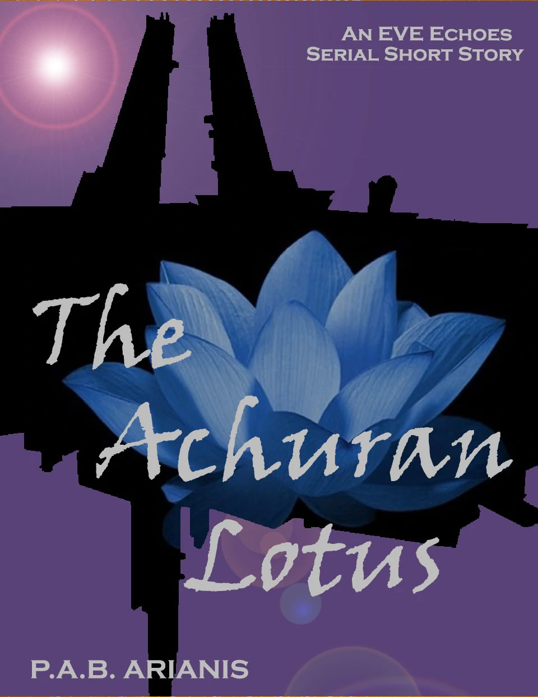

---
tags:
  - Prose
  - XephariousWryn
  - EvEEchoes
---

# The Achuran Lotus

**BOOK 5 - Sorting truth from lies in New Eden is often perilous but for Hail, it's their life's work. When that search leads them on the trail of a missing capsuleer, peril takes on twisted new meanings.**

 

> Author: P.A.B.Arianis

> Original post: [https://eve-arianis.webnode.page/l/the-archuran-lotus/](https://eve-arianis.webnode.page/l/the-archuran-lotus/)

> Author’s Note: This is an EVE Echoes story written in serial short format. It is recommended that you pause between chapters... or don't, this is New Eden. Capsuleers make the rules anyway. This original work is based in the fictional world of New Eden as created by CCP and NetEase. All rights to concepts and property related to EVE Echoes or gameplay remain with their original owners.

 

**Like a mystery   The Achuran Lotus is   Each petal opens pain**