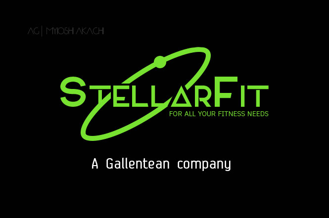

---
tags:
  - Gallente
  - Prose
---

# StellarFit

> I imagined a Gallente commercial about a fitness tool; any reference to the 80s is purely casual (or maybe not).

The video screen flickers to life, going from a matte black to frame a woman under bright lights.

She is fair skinned, with just enough of a tan, the eyes are green and electric. She is dressed in a tight bicolor spandex suit that hugs each and every curve: the leotard is a light green while the leggings are a complementary bright purple. Her blonde hair is tied up in a ponytail, revealing a slender neck, while a light blue headband circles her forehead.

“Have you ever thought about how hard it is to stay fit when you’re suspended in low gravity for most of your time?” she asks looking at the camera with a fatigued look “It’s hard, I can tell you that.”

“For land dwellers, or even station dwellers, it’s easy.” She speaks as she walks through a gym, with cattles and weights, benches and other machinery all around her. In background, a few undefined people are working out. “They just need to reach the closest gym and done, as easy as it is to take the nearest elevator or speeder.”

“But what about us? What about us, capsuleers, living in the stars? Floating in our pods for so many hours, as our ships streaks through space?!” she speaks with the passion of someone living such stressful condition. The camera turns around her, showing the tell tale connections of a pod dweller: black rounds sockets running down her neck and spine till they disappear below the low back cut of the leotard.

As the camera finish to circle, it zooms on her face, the unblemished face of modern cloning techniques “Sure, clones are there for that. Clone in, clone out. But let’s be honest, all those reincarnations get boring in the long run and you know…” she pauses for effect as her light green lips pulls into a conspiring grin “…there is no match for the thrill of muscles pumping, of the weights lifting and the kilometres under your shoes running past.”

“That’s why…” the camera pulls back from her and into the view comes a metal contraption, all black but for light green highlights and a few status lights “… I choose the Stellar Fit 0G 3000!”

“Working out on a ship hadn’t been easier, all in one place, to keep you fit even when in space!” the sales pitch is spoken with a cheerful tone as images of the contraption at work are superimposed.

“Get yours, today, at the StellarFit official store.” The connection link flashes in bright green at the bottom of the screen.
“Working out has never been easier.” Her smile is dazzling as more info and disclaimers pass by at the bottom before the screens turns darker and a green logo appears: 

“StellarFit, for all your fit needs. A Gallentean company.”

The screen flickers and dies, turning the matte black it has started from.
